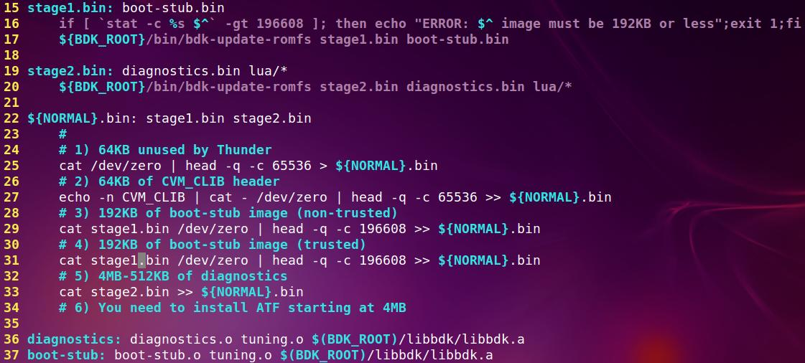

- [BDK读SATA寄存器](#bdk读sata寄存器)
- [BDK保存文件到flash](#bdk保存文件到flash)
- [lua调用c函数](#lua调用c函数)
- [fatfs](#fatfs)
- [lua trafficgen](#lua-trafficgen)
  - [怎么用](#怎么用)
  - [require("grafficgen")](#requiregrafficgen)
- [fat fs over spi](#fat-fs-over-spi)
- [编译](#编译)
  - [片上ROM](#片上rom)
  - [BDK头](#bdk头)
  - [debug](#debug)
  - [bdk的image构成](#bdk的image构成)
  - [启动](#启动)
- [重构后的main, normal-boot/boot-stub.c](#重构后的mainnormal-bootboot-stubc)
- [2s的依赖](#2s的依赖)
- [内存](#内存)
- [bdk有三种](#bdk有三种)
- [diagnostic](#diagnostic)
  - [依赖](#依赖)
- [csr访问, 在lua环境下](#csr访问-在lua环境下)
- [lua](#lua)

# BDK读SATA寄存器
```
cavium.csr.GSERX_LANEX_SDS_PIN_MON_2(3,0).display()
```

# BDK保存文件到flash
现在flash上实现了一个fatfs文件系统, 所以保存文件是可以的.   
文件需要用xmodem来传, 在BDK菜单下面的文件菜单下, 使用/xmodem虚拟文件作为源,
```
/fatfs/xxx作为目的来拷贝就可以了.
/fatfs/default.cfg
/fatfs/lua/xxx.lua
/fatfs/stage2.bin -- BDK diag菜单
```

# lua调用c函数
比如在lua里面, 可以直接调用c函数, 怎么做到的呢?
```
local data = cavium.c.bdk_twsix_read_ia(menu.node, twsi_bus, dev_addr, 0, 1, 0)
```
传统上, 如果一个C函数想被lua调用, 需要按照lua的格式来声明.  
但这里, 只用一个wrapper函数, 就能达到export所有C函数的效果.  
首先需要一个列表, 包括所有C函数
```c
typedef struct
{
    const char *name;
    void *func;
} bdk_functions_t;
extern const bdk_functions_t bdk_functions[];
```
这个工作是一个python脚本完成的.  
在makefile里面, 生成一个c文件包含这个函数列表
```makefile
bdk-functions.c: ./create_function_table.py $(objs)
    ./create_function_table.py $@ $(objs)
```
在这个脚本里, 主要是用readelf把所有函数列出来, 然后按照bdk_functions_t的格式写到文件里.
```py
def read_functions(elf, func_list):
    file = os.popen("aarch64-thunderx-elf-readelf --wide -s %s | grep -v LOCAL | grep FUNC" % elf)
    for line in file:
        parts = line.split()
        func = parts[-1]
        if not func in func_list:
            func_list.append(func)
    file.close()
    return func_list
all_funcs = []
for elf in sys.argv[2:]:
    read_functions(elf, all_funcs)
def write_function_table(out, table_name, functions):
    out.write("\n")
    for f in functions:
        out.write("extern void %s() __attribute__((weak));\n" % f)
    out.write("\n")
    out.write("const bdk_functions_t %s[] = {\n" % table_name)
    for f in functions:
        out.write("    {\"%s\", %s},\n" % (f, f))
    out.write("    {0, 0}\n")
    out.write("};\n")
    out.write("\n")
out = open(sys.argv[1], "w")
write_function_table(out, "bdk_functions", bdk_funcs)
```
好了, 现在所有C函数(这里只取bdk_开头的)都在`bdk-functions.c`里面了.
对在这个table里面的每个entry, 其实就是在lua的表(table)里面, 用函数名做索引, 把函数地址作为值.
```
lua_pushlightuserdata(L, bdk_functions[i].func);
lua_pushcclosure(L, cavium_c_call, 1);
lua_setfield(L, -2, bdk_functions[i].name);
```
这里面统一注册的是一个叫`cavium_c_call`的函数, 下面揭开这个万能函数的真面目
```c
static int cavium_c_call(lua_State* L)
{
    //首先, 这个func最多支持8个参数
    long (*func)(long arg1, long arg2, long arg3, long arg4, long arg5, long arg6, long arg7, long arg8);
    long args[8];
    //参数个数, 为什么getop能取出来?
    int num_args = lua_gettop(L);
    //函数地址
    func = lua_topointer(L, lua_upvalueindex(1));
    int i;
    for(i=0; i<num_args; i++)
    {
        /* Use lua_type() instead of lua_isX() so Lua doesn't do type
            conversion. I'll never understand the fascination with weakly
            typed languages */
        int arg_type = lua_type(L, i+1);
        if (arg_type == LUA_TNUMBER)
        {
            args[i] = lua_tonumber(L, i+1);
        }
        else if (arg_type == LUA_TSTRING)
        {
            const char *str = lua_tostring(L, i+1);
            args[i] = (long)str;
        }
        else if (arg_type == LUA_TNIL)
        {
            args[i] = 0;
        }
        else if (arg_type == LUA_TBOOLEAN)
        {
            args[i] = lua_toboolean(L, i+1);
        }
        else
        {
            luaL_error(L, "Invalid argument type");
            return 0;
        }
    }
    //返回值, 这里有点不好, 返回字符串有点麻烦
    long result = func(args[0], args[1], args[2], args[3], args[4], args[5], args[6], args[7]); //这里直接传了8个参数, 因为这里func是地址
    if ((func == (void*)bdk_qlm_mode_tostring) ||
        (func == (void*)bdk_dram_get_test_name) ||
        (func == (void*)bdk_dram_get_info_string) ||
        (func == (void*)bdk_usb_get_test_mode_string) ||
        (func == (void*)bdk_dram_get_config_name))
        lua_pushstring(L, (const char*)result);
    else
        lua_pushnumber(L, result);
    return 1;
}
```
# fatfs
```
/fatfs/default.cfg
./normal-boot/Makefile: $(BDK_ROOT)/bin/fatfs-tool -q -i $(FATFS_IMG) mkfs
./normal-boot/Makefile: $(BDK_ROOT)/bin/fatfs-tool -q -i $(FATFS_IMG) cp $(STAGE1_BIN) /
./normal-boot/Makefile: $(BDK_ROOT)/bin/fatfs-tool -q -i $(FATFS_IMG) cp $(STAGE2_BIN) /
./normal-boot/Makefile: $(BDK_ROOT)/bin/fatfs-tool -q -i $(FATFS_IMG) mkdir /lua
./normal-boot/Makefile: $(BDK_ROOT)/bin/fatfs-tool -q -i $(FATFS_IMG) cp lua-common/*.lua /lua
./normal-boot/Makefile: $(BDK_ROOT)/bin/fatfs-tool -q -i $(FATFS_IMG) cp $(BOARD_ROOT)/lua/*.lua /lua
./normal-boot/Makefile: $(BDK_ROOT)/bin/fatfs-tool -q -i $(FATFS_IMG) cp $(BOARD_ROOT)/default.cfg /
./normal-boot/Makefile: $(BDK_ROOT)/bin/fatfs-tool -q -i $(FATFS_IMG) cp ./safe-mode.cfg /
```

# lua trafficgen
## 怎么用
```lua
   local tg_pass = true
   local trafficgen = require("trafficgen")
   local tg = trafficgen.new()
   cavium.c.bdk_wait_usec(3 * 1000000) -- wait for links to come up.
   -- Do 100k packets, 60 bytes each, 50% of gigabit, timeout 5 secs
   all_pass = tg_run(tg, "N0.XLAUI1", 60, 100000, 50, 5) and all_pass
   -- Do 100k packets, 1499 bytes each, 50% of gigabit, timeout 7 secs
   all_pass = tg_run(tg, "N0.XLAUI1", 1499, 100000, 50, 7) and all_pass
   -- Do 100k packets, 9212 bytes each, 50% of gigabit, timeout 12 secs
   all_pass = tg_run(tg, "N0.XLAUI1", 9212, 10000, 10, 12) and all_pass
   -- Do 100k packets, 60 bytes each, 50% of gigabit, timeout 5 secs
   all_pass = tg_run(tg, "N0.XFI0.0", 60, 100000, 50, 5) and all_pass
```
## require("grafficgen")
首先, 声明一个对象, 最后就返回它.
```
local TrafficGen = {}
```
new方法:这个方法太牛了!
```
local known_ports = cavium.trafficgen.get_port_names()
```
`get_port_names()`实际上是C用链表实现的迭代器, 初始化时候构造链表, 用的时候遍历每个元素到lua栈里面, 从而传递给lua.
```c
static int get_port_names(lua_State* L)
{
    if (!tg_port_head)
        tg_init();
    int count = 0;
    lua_newtable(L);
    for (tg_port_t *tg_port = tg_port_head; tg_port!=NULL; tg_port = tg_port->next)
    {
        lua_pushinteger(L, ++count);
        lua_pushstring(L, bdk_if_name(tg_port->handle));
        lua_settable(L, -3);
    }
    return 1;
}
```
因为迭代器的存在, 底层C实现也就只需要实现一个迭代的`bdk_if_next_port()`函数接口
# fat fs over spi
在`libbdk-os/bdk-fs-fatfs.c`里面, 实现了fat fs的封装  
`fatfs_open`, `fatfs_read`等函数是给bdk的"简单文件系统"用的. 其实现是使用`libfatfs/ff.c`库, 调用里面提供的`f_read()`  
那`f_read`怎么知道怎么操作SPI呢? 实际上, fat fs可分为两层, 上层是文件系统, 下层是IO操作.

上层的东西一般是不变的, 变的就是IO层. IO层的驱动是disk_read, disk_write  
他们利用了设备文件的读和写
```c
total = fwrite(buff, DRV_SECTOR_SIZE(pdrv) * count, 1, DRV_FP(pdrv));
```
所以, 只要实现了设备文件的驱动, 就能把这个驱动代到IO层.

在`fatfs_diskio_init()`里面,`libfatfs/diskio.c`
`disk_initialize()`实现了其中的联系:
```c
    DRV_FP(pdrv) = fopen(DRV_DEVSTR(pdrv), "r+b");
```

# 编译
```
export PATH=${PATH}:${BDK_ROOT}/bin:/home/byj/repo/git/thunder/new/sdk-master/tools/bin
make
```

## 片上ROM
thunder片上有rom, 地址是0x87D000000000, 16K, 上电从这里启动  
rom根据GPIO的配置决定从SPI或eMMC load 192K的代码到L2 cache.
* non-trusted启动时, code在spi/eMMC的0x20000
* trusted启动时, code在spi/eMMC的0x50000.
代码被读到L2的scratch region, 地址是0x1000000, 然后跳转到0x1000100

## BDK头
一共256字节
```
    # BDK image heade for Thunder is
    #   Offset  Size    Description
    #   0x00    4       Raw instruction for skipping header (above)
    #   0x04    4       Length of the image, includes header
    #   0x08    8       Magic string "THUNDERX"
    #   0x10    4       CRC32 of image + header. These bytes are zero when calculating the CRC
    #   0x14    4       Zero, reserved for future use
    #   0x18    64      ASCII Image name. Must always end in zero
    #   0x58    32      ASCII Version. Must always end in zero
    #   0x78    136     Zero, reserved for future use
    #   0x100   -       Beginning of image. Header is always 256 bytes.
```

## debug
* libbdk-os/bdk-start.S  
必要时可以打开BDK_GPIO_BOOT_DEBUG, 这个是个GPIO的脚, 每个boot阶段会输出不同频率的波形.
* libbdk-arch/bdk-warn.h  
BDK_TRACE_ENABLE_INIT

## bdk的image构成
* stage1就是boot-stub.bin
* stage2就是diagnostics.bin

  

## 启动
```c
libbdk-os/bdk-start.S
拷贝代码到链接地址0, 把栈设在__bdk_initial_stack_end, 代码里面的.align 12意思是4K对齐.
这个时候有栈了, 下面是C代码
__bdk_init
    为EL1 2 3设置异常基地址
    把内存属性设为cached normal memory, no mmu
    设置时钟
    初始化两个串口
    //为什么这里能直接调write? --在libbdk-os/bdk-fs.c中, 静态链接了_write(), _open()等函数. 
    //这里面有静态变量file_handle, 里面的什么fs-op都填好了, 但1 2 3都是虚的/console
    //里面的console_write调的是最后一个打开的文件fd, 默认是3, 
    //再往下是dev_write, 这里根据dev来进一步调用dev->ops->write
    //最后是libbdk-os/bdk-fs-uart.c里面的uart_write, 轮询方式
    write(1, banner...)
    锁L2
    校验CRC
    bdk_thread_initialize()
    用malloc申请16K的空间, 给栈用 --哪里给的malloc的初始空间呢?
    //libc/newlib-2.1.0/newlib/libc/stdlib/malloc.c
    用一个新的thread来跑下面的
__bdk_init_main, 所有core都会跑这里
    释放在bdk-start.S设置的栈
    每个core都设置必须的sysreg
    __bdk_config_init, 设置一些config值, 比如LMAC
    探测多node的配置, 估计是哪里配的
    __bdk_init_node()
        bdk_clock_setup, 时钟
        bdk_l2c_initialize, cache
        bdk_rng_enable, 随机数
        bdk_pcie_global_initialize
        bdk_qlm_init
        bdk_twsix_initialize
        bdk_mdio_initialize
        
    __bdk_fs_init_late
        if (__bdk_fs_mem_init)
            result |= __bdk_fs_mem_init();
        if (__bdk_fs_mmc_init)
            result |= __bdk_fs_mmc_init();
        if (__bdk_fs_mpi_init)
            result |= __bdk_fs_mpi_init();
        if (__bdk_fs_pcie_init)
            result |= __bdk_fs_pcie_init();
        if (__bdk_fs_ram_init)
            result |= __bdk_fs_ram_init();
        if (__bdk_fs_rom_init)
            result |= __bdk_fs_rom_init();
        if (__bdk_fs_sata_init)
            result |= __bdk_fs_sata_init();
        if (__bdk_fs_xmodem_init)
            result |= __bdk_fs_xmodem_init();
        if (__bdk_fs_fatfs_init)
            result |= __bdk_fs_fatfs_init();
    新起线程main
    加链接时依赖
main, 每个板子都有自己的main, 比如normal-boot-crb-2s/boot-stub.c
    是能watchdog
    把第10个gpio拉高
    初始化和BMC连的twsi为slave模式
    boot大于3次了, 请求BMC的power cycle
    update_bmc_status(BMC_STATUS_REQUEST_POWER_CYCLE)
    从gpio_strap寄存器读启动模式, spi, emmc, ccpi还是pcie
    打印"BDK version"等
    初始化CCPI
    初始化主node的dram
    libdram_config()
    初始化node 1 的dram
    libdram_config()
    设QLM参考时钟
    QLM初始化
    BGX和PHY初始化?
    SATA
    PCIE
    为了从spi load代码, 初始化mpi
    bdk_fs_mpi_init()
    按D进BDK, 否则进ATF
    boot_image()
```
# 重构后的main, normal-boot/boot-stub.c
```c
main
    按了x就用/fatfs/safe-mode.cfg
    否则是/fatfs/default.cfg
    应该是把这个文件load到内存, 以便后面的api bdk_brd_cfg_get_int()使用
    bdk_loadenv("/fatfs/xxx.cfg")
    看门狗
    boot_read_config()
        MULTI_NODE        = bdk_brd_cfg_get_int(MULTI_NODE,         BDK_BRD_CFG_MULTI_NODE);
        BMC_TWSI          = bdk_brd_cfg_get_int(BMC_TWSI,           BDK_BRD_CFG_BMC_TWSI);
        DRAM_VERBOSE      = bdk_brd_cfg_get_int(DRAM_VERBOSE,       BDK_BRD_CFG_DRAM_VERBOSE);
        WATCHDOG_TIMEOUT  = bdk_brd_cfg_get_int(WATCHDOG_TIMEOUT,   BDK_BRD_CFG_WATCHDOG_TIMEOUT);
        DRAM_NODE0        = bdk_brd_cfg_get_str(DRAM_NODE0,         BDK_BRD_CFG_DRAM_NODE, 0);
        DRAM_NODE1        = bdk_brd_cfg_get_str(DRAM_NODE1,         BDK_BRD_CFG_DRAM_NODE, 1);
        BRD_DISABLE_TWSI  = bdk_brd_cfg_get_int(BRD_DISABLE_TWSI,   BDK_BRD_CFG_DISABLE_TWSI);
        BRD_DISABLE_DRAM  = bdk_brd_cfg_get_int(BRD_DISABLE_DRAM,   BDK_BRD_CFG_DISABLE_DRAM);
        BRD_DISABLE_CCPI  = bdk_brd_cfg_get_int(BRD_DISABLE_CCPI,   BDK_BRD_CFG_DISABLE_CCPI);
        BRD_DISABLE_QLM   = bdk_brd_cfg_get_int(BRD_DISABLE_QLM,    BDK_BRD_CFG_DISABLE_QLM);
        BRD_DISABLE_BGX   = bdk_brd_cfg_get_int(BRD_DISABLE_BGX,    BDK_BRD_CFG_DISABLE_BGX);
        BRD_DISABLE_USB   = bdk_brd_cfg_get_int(BRD_DISABLE_USB,    BDK_BRD_CFG_DISABLE_USB);
        BRD_DISABLE_PCI   = bdk_brd_cfg_get_int(BRD_DISABLE_PCI,    BDK_BRD_CFG_DISABLE_PCI);
    board_init_early(), 每个板子都有, 比如2s
        GPIO控制USB的电源
    boot_init_twsi()
    boot_init_ccpi_link()
    boot_init_dram(node0)
    boot_init_ccpi_node()
    boot_init_dram(node1)
    boot_init_qlm_clk()
    boot_init_qlm_mode()
    boot_init_bgx()
    boot_init_usb()
    boot_init_pci()
    board_init_late()
```
           
# 2s的依赖
```c
void __bdk_require_depends(void)
{
    BDK_REQUIRE(QLM);
    BDK_REQUIRE(MDIO);
    BDK_REQUIRE(PCIE);
    BDK_REQUIRE(GPIO);
    BDK_REQUIRE(RNG);
    BDK_REQUIRE(KEY_MEMORY);
    BDK_REQUIRE(MPI);
    BDK_REQUIRE(DRAM_CONFIG);
    BDK_REQUIRE(TWSI);
    BDK_REQUIRE(USB);
}
```

# 内存
在`normal-boot-crb-2s/boot-stub.c`
打开DRAM_VERBOSE
DRAM_NODE0是具体的板子, 比如crb_2s_V3, 在libdram/configs/config-crb-2s-V3.c

# bdk有三种
基本上都是一个main加上libbdk.a chain, normal, diag
```makefile
$(CHAINLOADER): $(BOARD_ROOT)/chainloader.o $(BOARD_ROOT)/boot-common.o $(BOARD_OBJS) $(BDK_ROOT)/libbdk/libbdk.a
$(DIAGNOSTICS): $(BOARD_ROOT)/diagnostics.o $(BOARD_OBJS) $(BDK_ROOT)/libbdk/libbdk.a
$(BOOT_STUB):   $(BOARD_ROOT)/boot-stub.o   $(BOARD_ROOT)/boot-common.o $(BOARD_OBJS) $(BDK_ROOT)/libbdk/libbdk.a
```

# diagnostic
```c
bdk-boot/diagnostics.c
main()
    bdk_lua_start()
        bdk_lua_init
```

## 依赖
```c
void __bdk_require_depends(void)
{
    BDK_REQUIRE(QLM);
    BDK_REQUIRE(PCIE);
    BDK_REQUIRE(FS_PCIE);
    BDK_REQUIRE(GPIO);
    BDK_REQUIRE(RNG);
    BDK_REQUIRE(KEY_MEMORY);
    BDK_REQUIRE(MDIO);
    BDK_REQUIRE(MPI);
    BDK_REQUIRE(DRAM_CONFIG);
    BDK_REQUIRE(DRAM_TEST);
    BDK_REQUIRE(ENVIRONMENT);
    BDK_REQUIRE(FS_XMODEM);
    BDK_REQUIRE(FS_RAM);
    BDK_REQUIRE(FS_SATA);
    BDK_REQUIRE(CSR_DB);
    BDK_REQUIRE(POWER_BURN);
    BDK_REQUIRE(TRAFFIC_GEN);
    BDK_REQUIRE(ERROR_DECODE);
    BDK_REQUIRE(TWSI);
    BDK_REQUIRE(SATA);
    BDK_REQUIRE(USB);
    BDK_REQUIRE(TNS);
}
```

# csr访问, 在lua环境下
bdk对csr的抽象实在太牛了, mark!
```c
libbdk-lua/cavium-csr.c
register_cavium_csr()
    create_csr_table()
```
这是个对象  
比如这个访问方式:
```
cavium.csr.MIO_TWSX_SW_TWSI(1).data = 0x80
```
实际调用的是
```
cavium_csr_field_newindex()
```
这是用table的元方法`__index`和`__newindex`实现的  
其他可用的访问方式是:
```
cavium.csr.NAME.read()
cavium.csr.NAME.write(value)
cavium.csr.NAME.display(optional)
cavium.csr.NAME.decode(optional)
cavium.csr.NAME.encode(table)
cavium.csr.NAME.FIELD 是调用cavium_csr_field_index
cavium.csr.NAME.FIELD=是调用cavium_csr_field_newindex
cavium.csr.NAME返回一个table, 但直接这么写会返回错误
cavium.csr返回一个迭代变量
```
终极文件`lua-modules/csr_db.lua`
这里补充一下这个db怎么生成的.
```
./csr-tool/csr-tool.py-23-OUTPUT_FILENAME_TYPEDEFS        = "output/bdk-csrs.h"
./csr-tool/csr-tool.py:24:OUTPUT_FILENAME_DB              = "output/bdk-csrs.c"
./csr-tool/csr-tool.py-25-OUTPUT_FILENAME_LUA             = "output/bdk-csrs.lua"
./csr-tool/Makefile-23- mv output/bdk-csrs*.h ../libbdk-arch/
./csr-tool/Makefile:24: mv output/bdk-csrs.c ../libbdk-arch/
./csr-tool/Makefile-25- mv output/bdk-csrs.lua ../lua-modules/csr_db.lua
```

# lua
```lua
pprint(cavium)
pprint(_G)
for name in cavium.csr() do local s=string.match(name, ".*GPIO.*"); if s then print(s) end end
cavium.csr.GPIO_BIT_CFGX(28).display()
cavium.csr.GPIO_BIT_CFGX(28).TX_OD=1
cavium.c.bdk_mdio_45_read(0,1,0,0,0)
should be 997
```
`:` 在 lua 里只是一个语法糖。
函数调用的时候 `obj:func(arg)` 其实等价于 `obj.func(obj,arg)`
函数定义时 `function obj:func(arg)` 等价于 `function obj.func(self,arg)`