- [四个运行级别](#四个运行级别)
- [地址空间](#地址空间)
  - [两级地址翻译](#两级地址翻译)
  - [hardware walker](#hardware-walker)
  - [49bit VA, 48bit PA](#49bit-va-48bit-pa)
- [thunder overview](#thunder-overview)
  - [cache](#cache)
  - [SMMU](#smmu)
    - [thunder SMMU](#thunder-smmu)
  - [PCC](#pcc)
  - [NCB](#ncb)
  - [RST](#rst)
  - [GIC](#gic)
  - [NIC](#nic)
    - [收包的CQE格式](#收包的cqe格式)
    - [收包CQE有几种形态](#收包cqe有几种形态)
    - [SQ, send queue](#sq-send-queue)
    - [TL4:拥塞通告：IEEE 802.1Qau](#tl4拥塞通告ieee-8021qau)
    - [报文格式](#报文格式)
    - [收报文流程](#收报文流程)
    - [收报文格式解析: 对报文的前254个字节都可以解析?](#收报文格式解析-对报文的前254个字节都可以解析)
  - [SLI](#sli)

# 四个运行级别
--怎么理解secure模式?????  
好像任何地址都可以配置为secure和unsecure的, secure  
  

# 地址空间
有三类:
* 虚拟地址(VA)
* 中间物理地址(IPA)
* 物理地址(PA)

同一时刻只能有其中一种地址存在在数据和指令cache中.

下图是物理地址的属性, bit47决定能不能cache. 这和octeon一样  
  
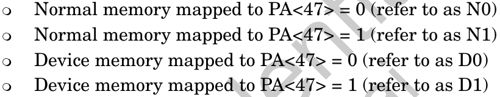  

## 两级地址翻译
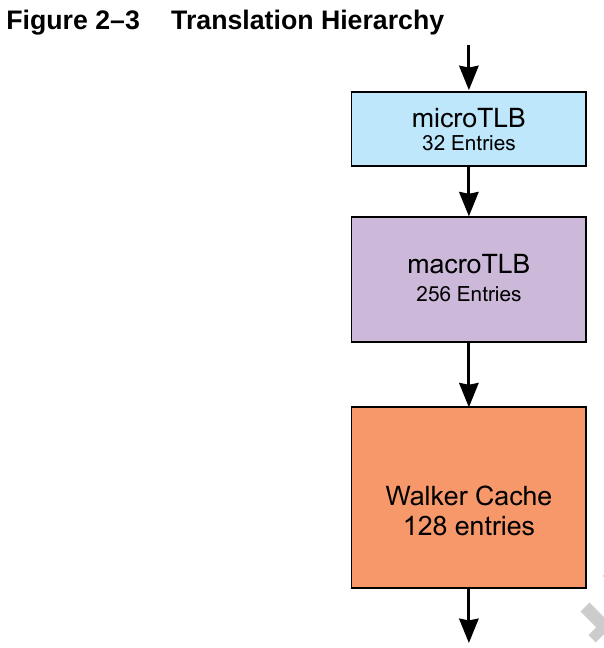  
两级查找: stage1(VA-->IPA)和stage2(IPA-->PA)
* uTLB: 缓存从VA到PA的结果
* mTLB: 缓存stage1 and stage2
* walker cache: 缓存the first three levels of the page table

## hardware walker
三级单位, 包含关系  
Page(level 2) > Block(2MB)(level 1) > Granule(64k)(level 0)  
Hardware-translation lookaside buffers and a page-table walkers deal only with granules or blocks

## 49bit VA, 48bit PA
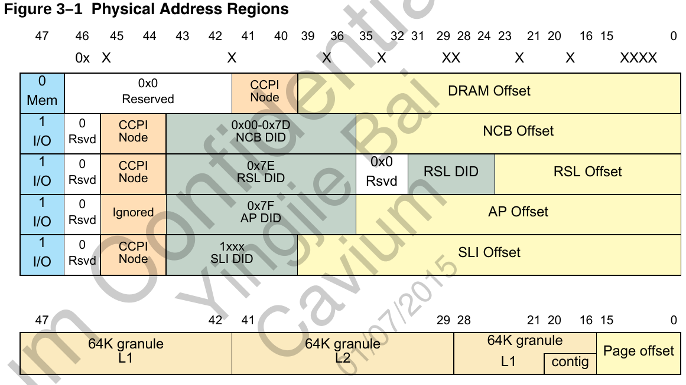  

# thunder overview
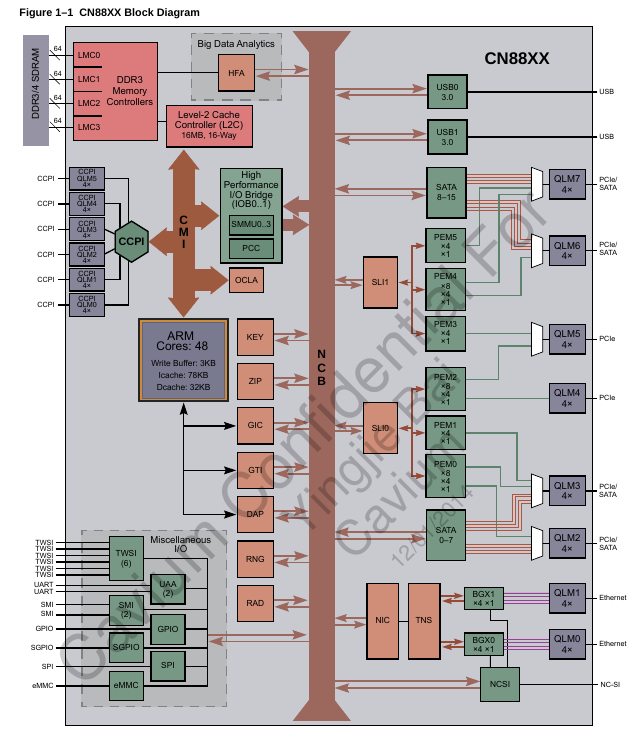  

## cache
L2cache保证CPUs, DMA的一致性.

## SMMU
SMMU用来把PCIe设备的虚拟态transaction地址转为系统物理地址. IOMMU? ----> 只有有DMA的设备才用这个.  
对thunder来说, 每个内置的block都是pcie设备没错, 但只是看起来是. 而且, 他们bar地址是固定的.

从CPU看起来, 每个设备的寄存器地址也是固定的.这个和octeon一样.

从设备发起的传输是DMA  
而从CPU发起的的传输不是DMA, 比如读VNIC的寄存器.

因为用户态进程不会搞DMA的事情, 所以IOMMU几乎和内核自己用的空间是一样的.  
在虚拟化的时候, 这个特点就非常重要, 一个虚拟机操作的设备要看到和这个虚拟机一样的地址空间.  
SMMU保护的是内存不能被没有权利看到它的设备访问.

### thunder SMMU
* 4个SMMU, 每个对应一个ECAM
* 设备发起的到NCB的read/write transaction有个49位的地址和16位的识别码(用来标识是哪个PCI设备), 这个49位的地址就是每个设备"隔离"的地址空间, 通过SMMU查IOTLB(1024个entry), 命中了就好说了, 没命中的话, SMMU会walk整个TABLE去查
* SMMU stream ID是个16bit的ID
  * 非ARI设备这16bit就是bus:dev:func
  * 是ARI设备, 是PF, 则是bus:func
  * 是ARI设备, 是VF, 则是bus:func+VF号+1
  * RAD控制器的没看懂
  * 外部设备就是16bit的requeser ID  
  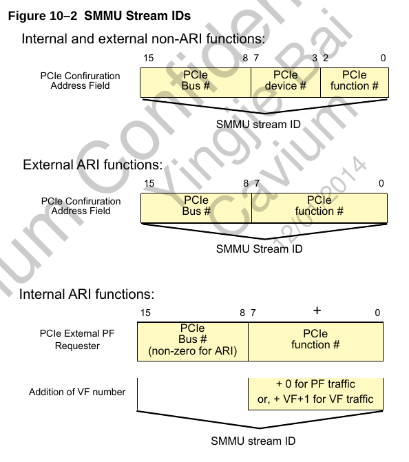  
  * 可以disable
  * 如果经过SMMU转换后, 一个DMA的写地址落在GIC的中断delivery寄存器, 这个就是MSI  
  用下面的格式来识别发中断的设备  
    
  * 有下面几类的寄存器
    * ECAM Registers
    * PCC PF Registers
    * PCC VF Registers
    * PCC Bridge Registers

## PCC
PCI Common Configuration unit  
PCI Enhanced access mechanism(ECAM)  
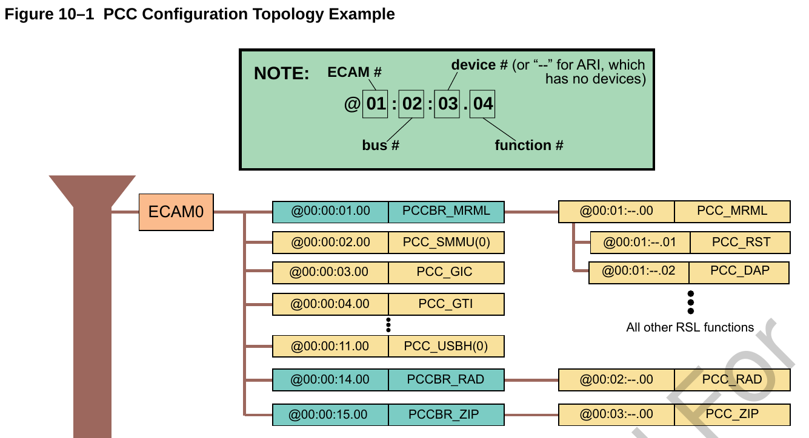  
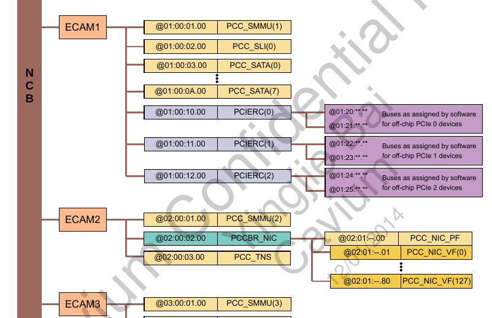  
  

* 有内置的多个桥: PCI On-Chip Common Bridges (PCCBR)
* PCCPF/PCCVF就是指具体的device了
* 支持MSI-X
* SR-IOV相关的寄存器只在PF里面有
* ARI技术: 在PCIE3.0里出现. 见[PCIe ARI](wiz://open_document?guid=fb0aca83-bfea-4b82-80d0-980c5f3e5340&kbguid=&private_kbguid=206cfc40-42e2-11e2-a9b7-907ab51b66ae)
在以前一个pci设备是bus(8bit):dev(5bit):func(3bit)来识别的, 一共16位, 所以我们经常说一共有256个bus, 32个dev, 8个func  
但是, ARI技术的出现, 让dev和func的概念同一叫func, 这样一来, 一个bus下面只有一个dev, 但这个dev可以有256个func

## NCB
  
* each NCBO has PCI configuration ECAM discovery through the PCC
* each NCBI has address translation routing through the SMMU
* 4个ECAM

## RST
内部有个ROM, 可以从spi或eMMC load固件  
但对image的格式, 每个地址区域存的东西都有要求  
启动流程: TBL1FW(由ROM load到L2)-->BL2FW-->BL3FW-->UEFI

  

## GIC
* 支持多cpu node
* 支持deliver to VM  
  

## NIC
* 一个NIC有128个VF, 其中127个就像单独的pcie设备(SR-IOV), 地址转换由SMMU完成
* QS, queue set, 和VF一对一, QS和VNIC可以自由组合, QS是物理上的, VNIC是逻辑上的  
QS到VNIC由`NIC_PF_QS(0..127)_CFG[VNIC]`控制  
  
  
* CQ, SQ, RBDR在内存里
* CQ, completion queue, VNIC加entry(CQE, 512byte), core减entry. 每个entry是收包完成或发包完成  
超过水线可以发中断  
核处理完一个CQE, 要写NIC_QS(0..127)_CQ(0..7)_DOOR来释放CQE

### 收包的CQE格式
  

### 收包CQE有几种形态
* 小包直接放在CQE里面  
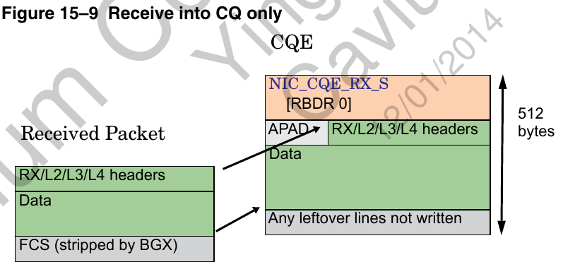  
* copy报文头到CQE  
  
* 指示放到RB  
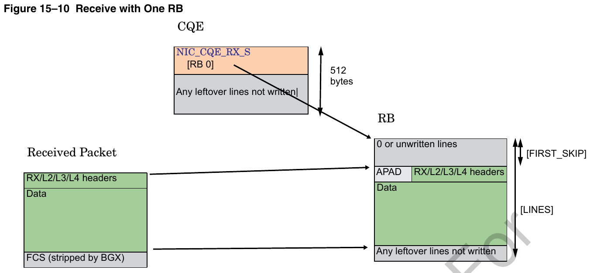  
  
  

### SQ, send queue
核发包的时候add一个SQE, 再发doorbell, 然后VNIC把这个SQE发出去, 并remove这个entry.  
SQ必须对应一个CQ(可以多对一), NIC在发包完成时自动创建一个CQE?  
核发包是要填SQE到SQ, 然后写NIC_QS(0..127)_SQ(0..7)_DOOR发包, VNIC完成后产生一个CQE到CQ  
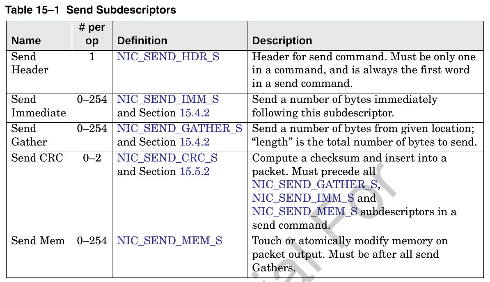  
* 发送命令字  
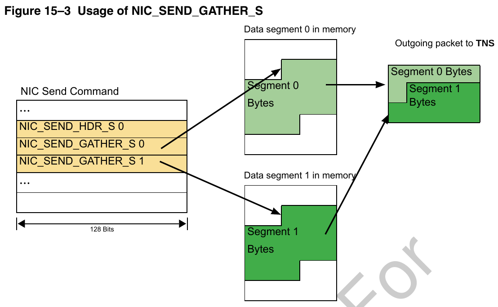  
  
* TCP 分片: If NIC_SEND_HDR_S[TSO] is set  
  
* 发包后的动作? 由VNIC来做?
  
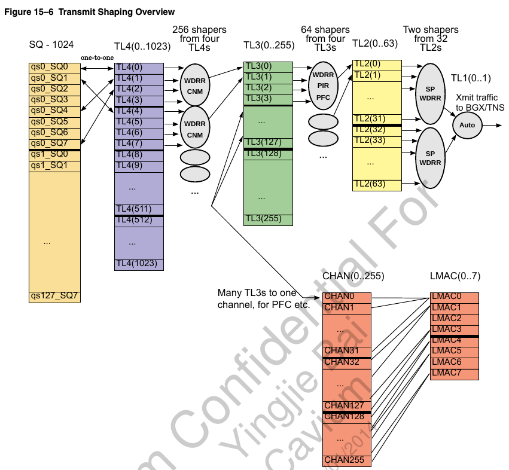  

### TL4:拥塞通告：IEEE 802.1Qau
拥塞通告属于流量管理，通过指示速率限制器来调整引起拥塞的流量，可将拥塞限制到网络边缘。IEEE 802.1Qau工作组接受了思科的拥塞通告提议，后者定义了一种架构来积极管理流量，以避免流量拥塞。

### 报文格式
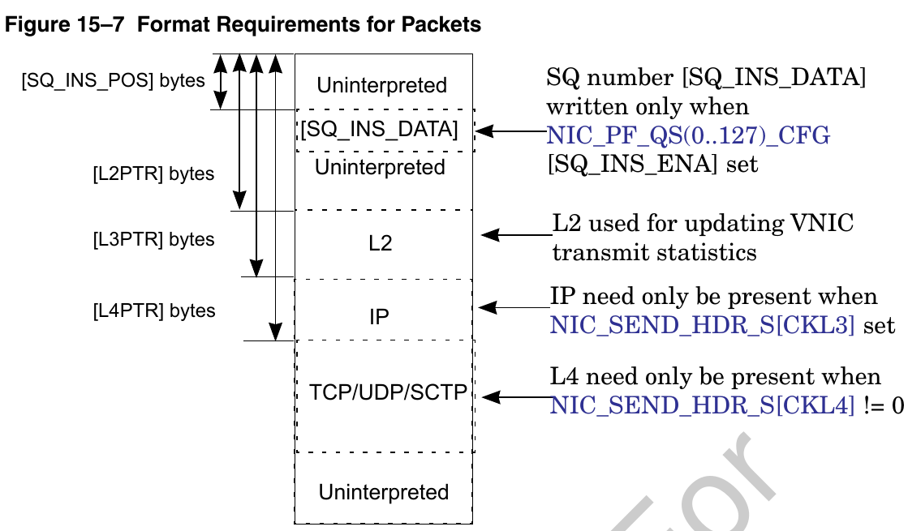  
* RBDR, receive-buffer descriptor ring, 是个描述符的ring, 表示空闲的收报文buffer.  
RBDR里面的每项都是个buffer指针, cache line对齐, 大小是`NIC_QS(0..127)_RBDR(0..1)_CFG[LINES]`  
RBDR超过水线也可以发中断
* RQ, receive queue, VNIC internal structure, 一个RQ也对应到一个CQ(可多对一), VNIC收包的时候会创建CQE. 一个RQ和一个或两个RBDR关联(可多对一).  
The receive queues (RQ) describe where receive traffic is to be placed.  
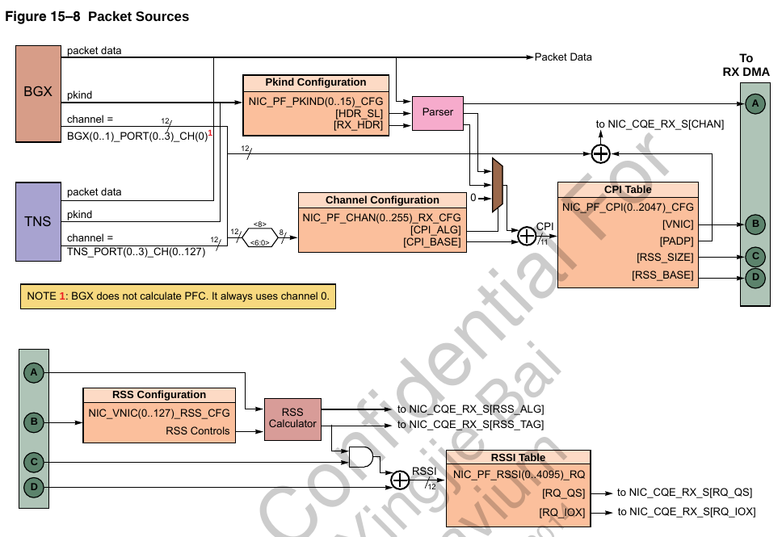  

### 收报文流程
报文从物理的interface进来, 这个物理口对应一个port号 `BGX(0..1)_PORT(0..3)_CH(0..15)` 或 `TNS_PORT(0..1)_CH(0..127)`  
从TNS来的报文可能加个内部头`NIC_RX_HDR_S`  
下一步是区分pkind, 一共16种, `NIC_PF_PKIND(0..15)_CFG`
典型应用是分三种pkind, one for all TNS interfaces, one for all BGX interfaces, and one for all BGX interfaces with PTP timestamps.  
然后决定报文的`NIC_PF_CHAN(0..255)_RX_CFG`, 这个CFG里面有个base和偏移, 决定了报文到哪个`NIC_PF_CPI(0..2047)_CFG`  
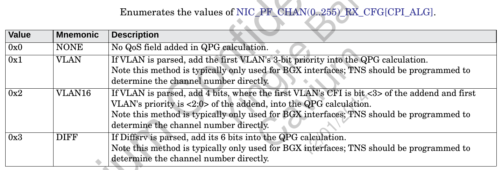  

CPI是channel parse index  
到了`NIC_PF_CPI(0..2047)_CFG`里面, 就决定了到那个VNIC, 同时决定了和VNIC对应的RSS和RSSI表的BASE

* 问题1: 所以从上面过程来看, 关键是pkind和chanel?  
--TNS可以指示到`NIC_PF_CPI(0..2047)_CFG`的选择 --必须用TNS?
* 问题2: NIC_PF_CPI(0..2047)_CFG已经决定了VNIC, 为什么后面NIC_PF_RSSI(0..4095)_RQ还能决定到哪个RQ? --冲突了?  
--调查哪里用了`NIC_PF_CPI(0..2047)_CFG`  
  

RSS是什么? receive-side scaling

NIC_PF_CPI(0..2047)_CFG里面
* VNIC: 哪个VNIC收, 同时对应了NIC_VNIC(0..127)_RSS_CFG, 它可以做HASH, 根据IP TCP UDP等可配, 最终决定到哪个RQ?
* RSSI_BASE: 在RSSI中的基址

`NIC_PF_RSSI(0..4095)_RQ`: 通过HASH来决定报文到那个`QS(0..127)`, 和一个QS里面的那个`IDX(0..7)`  
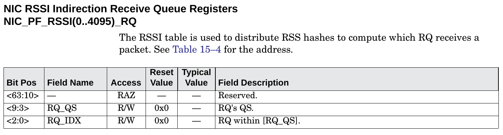  

### 收报文格式解析: 对报文的前254个字节都可以解析?
  
* mailbox  
用于在VF和PF之间通信(64bit words)
* TNS  
TNS到NIC的报文可以加  
  
* PF和VF的pcie接口  
  
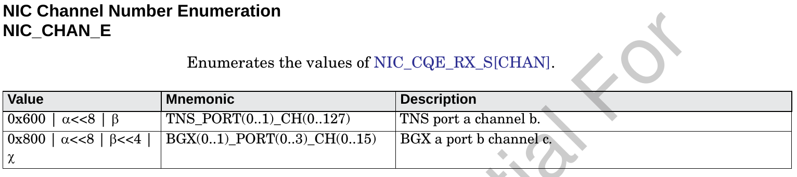  

## SLI
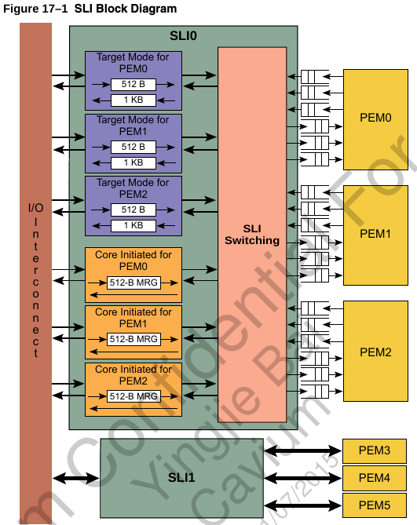  
* 由core发起的请求, S2M: SLI to Mac
* 配置空间请求
* 由target发起的请求, M2S; 包括MSI
* thunder做为EP时, host方也能访问thunder内部寄存器, 通过SLI窗口寄存器, 这和octeon一样.