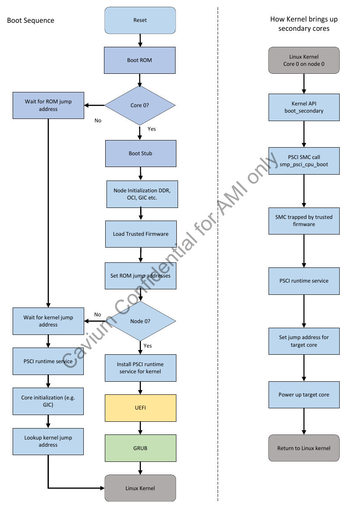

- [默认的grub](#默认的grub)
- [关于MAC地址](#关于mac地址)
- [内核里面的UEFI](#内核里面的uefi)
- [启动顺序](#启动顺序)
- [makefile目标](#makefile目标)
- [acpi table](#acpi-table)
- [Thunder_${PLATFORM}.dsc](#thunder_platformdsc)
- [ACPI](#acpi)
- [关于FDT](#关于fdt)
	- [ArmPlatformPkg/ThunderPkg/Dts/thunder-88xx.dts](#armplatformpkgthunderpkgdtsthunder-88xxdts)
		- [ArmPlatformPkg/ThunderPkg/Dts/thunder-88xx.dtsi](#armplatformpkgthunderpkgdtsthunder-88xxdtsi)
			- [soc 中断](#soc-中断)
			- [soc 两个串口](#soc-两个串口)
			- [pcie](#pcie)
			- [MDIO](#mdio)

# 默认的grub
```
menuentry 'Thunder Boot' {
        linux /boot/Image root=/dev/sda2 console=ttyAMA0,115200n8 earlycon=pl011,0x87e024000000 debug coherent_pool=16M rootwait rw uefi_debug
        boot
}
```

# 关于MAC地址
```
setvar N1ETH0 -guid A70B59ED-6228-4883-BBF0-5FD91C14EFF6 -bs -rt -nv =0x123456789abc01
```
这里的guid是
```
./ArmPlatformPkg/ThunderPkg/Thunder_cn88xx.dec:34:  gThunderPlatformTokenSpaceGuid   = { 0xa70b59ed, 0x6228, 0x4883, { 0xbb, 0xf0, 0x5f, 0xd9, 0x1c, 0x14, 0xef, 0xf6 } }
```

# 内核里面的UEFI
在内核里面打开了EFI=y  
内核支持UEFI的runtime service, 并且打开了uefi_stub, 使内核能够作为一个UEFI app来启动.

这里还打开了一个EFI_VARS的功能, 好像是能够通过/sys文件系统修改UEFI的变量

# 启动顺序
  
  
  

# makefile目标
```
DEBUG ?= 0
PLATFORM=cn88xx

目标
build -a AARCH64 -t ARMGCC -p ArmPlatformPkg/ThunderPkg/Thunder_${PLATFORM}.dsc -b ${TARGET}
cp  ./Build/Thunder_${PLATFORM}/${TARGET}_ARMGCC/FV/THUNDER_EFI.fd ${WORKSPACE}/THUNDER_EFI.fd

shell目标
build -a AARCH64 -t ARMGCC -p ShellPkg/ShellPkg.dsc -b ${TARGET}
```

# acpi table
每个板子都有
```
ArmPlatformPkg/ThunderPkg/AcpiTables/Crb1s.asl
ArmPlatformPkg/ThunderPkg/AcpiTables/Crb2s.asl
```

# Thunder_${PLATFORM}.dsc
* platform也有GUID
* common的模块
```
[LibraryClasses.common]
  ArmLib|ArmPkg/Library/ArmLib/AArch64/AArch64Lib.inf
  ArmCpuLib|ArmPkg/Drivers/ArmCpuLib/ArmCortexAEMv8Lib/ArmCortexAEMv8Lib.inf
  ArmPlatformLib|ArmPlatformPkg/ThunderPkg/Library/ThunderLib/ThunderLib.inf
  ThunderxConfigLib|ArmPlatformPkg/ThunderPkg/Library/ThunderxConfigLib/ThunderxConfigLib.inf
  ThunderxFdtLib|ArmPlatformPkg/ThunderPkg/Library/ThunderxFdtLib/ThunderxFdtLib.inf
  EfiResetSystemLib|ArmPkg/Library/ArmPsciResetSystemLib/ArmPsciResetSystemLib.inf
  ThunderxSmcLib|ArmPlatformPkg/ThunderPkg/Library/ThunderxSmcLib/ThunderxSmcLib.inf
  ThunderxTwsiLib|ArmPlatformPkg/ThunderPkg/Library/ThunderxTwsiLib/ThunderxTwsiLib.inf
  ThunderxWdogLib|ArmPlatformPkg/ThunderPkg/Library/ThunderxWdogLib/ThunderxWdogLib.inf


  ArmPlatformSysConfigLib|ArmPlatformPkg/ThunderPkg/Library/ThunderSysConfigLib/ThunderSysConfigLib.inf
  TimerLib|ArmPkg/Library/ArmArchTimerLib/ArmArchTimerLib.inf
  PciExpressLib|ArmPlatformPkg/ThunderPkg/Library/BasePciExpressLib/BasePciExpressLib.inf
  PciLib|MdePkg/Library/BasePciLibPciExpress/BasePciLibPciExpress.inf
```
* GIC
```
gArmTokenSpaceGuid.PcdSystemMemoryBase|0x01400000
gArmTokenSpaceGuid.PcdSystemMemoryBase_Node2|0x10000400000

  #
  # ARM General Interrupt Controller
  #
  gArmTokenSpaceGuid.PcdGicDistributorBase|0x801000000000
  gArmTokenSpaceGuid.PcdGicInterruptInterfaceBase|0x801000002000
```

* PL011就是arm体系下的串口
```
serial@101f0000 {
    compatible = "arm,pl011";
    reg = <0x101f0000 0x1000 >;
    interrupts = < 1 0 >;
};
```
`gEfiMdeModulePkgTokenSpaceGuid.PcdSerialRegisterBase|0x87e024000000` --从手册可以查到, 这个地址就是串口寄存器的地址, 看起来, thunder的串口是按照arm标准设计的.

* 为什么有的寄存器的地址非常小????
```
## PL180 MMC/SD card controller
  gArmPlatformTokenSpaceGuid.PcdPL180SysMciRegAddress|0x1C010048
  gArmPlatformTokenSpaceGuid.PcdPL180MciBaseAddress|0x1C050000
```

* 默认的grub启动路径, 固定的pci, 固定的uuid分区
```
  #
  # GRUB Loader from SATA DISK from EFI partition.
  #  
   gArmPlatformTokenSpaceGuid.PcdDefaultBootDescription|L"GRUB"
   gArmPlatformTokenSpaceGuid.PcdDefaultBootDevicePath|L"PciRoot(0x1)/Pci(0x8,0x0)/Sata(0x0,0x0,0x0)/HD(1,GPT,E3AE6975-BACE-464E-91E1-BB4FE9954047,0x800,0x31801)/\EFI\BOOT\BOOTAA64.EFI"
   gArmPlatformTokenSpaceGuid.PcdDefaultBootType|0
```

* 看起来变量是保存在flash上的
```
	#FTW Non-volatile flash storage
  gEfiMdeModulePkgTokenSpaceGuid.PcdFlashNvStorageVariableBase|0xF00000
  gEfiMdeModulePkgTokenSpaceGuid.PcdFlashNvStorageVariableBase64|0xF00000
  gEfiMdeModulePkgTokenSpaceGuid.PcdFlashNvStorageVariableSize|0x9000
  
  gEfiMdeModulePkgTokenSpaceGuid.PcdFlashNvStorageFtwWorkingBase|0xF09000
  gEfiMdeModulePkgTokenSpaceGuid.PcdFlashNvStorageFtwWorkingBase64|0xF09000
  gEfiMdeModulePkgTokenSpaceGuid.PcdFlashNvStorageFtwWorkingSize|0x1000
  
  gEfiMdeModulePkgTokenSpaceGuid.PcdFlashNvStorageFtwSpareBase|0xF0A000
  gEfiMdeModulePkgTokenSpaceGuid.PcdFlashNvStorageFtwSpareBase64|0xF0A000
  gEfiMdeModulePkgTokenSpaceGuid.PcdFlashNvStorageFtwSpareSize|0x0000A000
```

* 每个inf描述被包含的一个模块???
```
  #
  # ACPI Support
  #
  MdeModulePkg/Universal/Acpi/AcpiTableDxe/AcpiTableDxe.inf
  ArmPlatformPkg/ThunderPkg/AcpiPlatformDxe/AcpiPlatformDxe.inf
  ArmPlatformPkg/ThunderPkg/AcpiTables/AcpiTables.inf
```
```
  #
  # FDT support
  #
  ArmPlatformPkg/ThunderPkg/FdtPlatformDxe/FdtPlatformDxe.inf
```
```
  ArmPlatformPkg/ThunderPkg/MdeModulePkg/Universal/Variable/RuntimeDxe/VariableRuntimeDxe.inf
  ArmPlatformPkg/ThunderPkg/MdeModulePkg/Universal/FaultTolerantWriteDxe/FaultTolerantWriteDxe.inf
```
```
  #
  # FAT filesystem + GPT/MBR partitioning
  #
  MdeModulePkg/Universal/Disk/DiskIoDxe/DiskIoDxe.inf
  MdeModulePkg/Universal/Disk/PartitionDxe/PartitionDxe.inf
  MdeModulePkg/Universal/Disk/UnicodeCollation/EnglishDxe/EnglishDxe.inf
```
最后这三个有意思
```
  #ASIX Electronics Corp. AX88772B ETH to USB doungle supprt
  OptionRomPkg/Bus/Usb/UsbNetworking/Ax88772b/Ax88772b.inf


	#SMBIOS
  MdeModulePkg/Universal/SmbiosDxe/SmbiosDxe.inf
  	ArmPlatformPkg/ThunderPkg/Drivers/PlatformSmbiosDxe/PlatformSmbiosDxe.inf {
    <LibraryClasses>
    SmbiosLib|ArmPlatformPkg/ThunderPkg/Library/SmbiosLib/SmbiosLib.inf
  }


	#RTC
	ArmPlatformPkg/ThunderPkg/Drivers/Ds1337RtcDxe/Ds1337RtcDxe.inf
```
还包含了FDT的blob, 里面貌似也没什么特别的, 似乎是个common的
```
	#To include FDT blob in UEFI image
 	MdeModulePkg/Universal/Fdt/FdtTableDxe/FdtTableDxe.inf
```

# ACPI

看了半天FDT, 这个ACPI到底是搞什么飞机??????
```
PopulateMacAddressCrb2S()
```
似乎内核配置里面所有的ACPI都是n

注: 因为关闭了CONFIG_EXPERT

# 关于FDT
前面说了, `ArmPlatformPkg/ThunderPkg/FdtPlatformDxe/FdtPlatformDxe.inf`是FDT的入口

这是一个DXE_DRIVER, 入口是`FdtPlatformEntryPoint`

在`FdtPlatform.c`中
```c
/**
  Entrypoint of Fdt Platform driver.
**/
EFI_STATUS
EFIAPI
FdtPlatformEntryPoint (
  IN EFI_HANDLE         ImageHandle,
  IN EFI_SYSTEM_TABLE   *SystemTable
  )
{
    BOARD_CFG*					 HwConfig;
    HwConfig = ThunderXGetBoardConfig(); //这里貌似主要是搞BGX
    ThunderxPatchFdt(HwConfig); //这里需要重点关注
        主要是搞bgx
        mac地址是从一个变量读出来的
        UnicodeSPrint(mac_variable_name, 9 * sizeof(CHAR16), L"N%dETH%d", it->node, it->id) //N0ETH0
        err = gRT->GetVariable(mac_variable_name, &gThunderPlatformTokenSpaceGuid, NULL, &mac_size, mac_address);    
        然后写到FDT里面
        err = fdt_appendprop(device_tree_base, fdt_node, "local-mac-address", mac_address_char, 6)
    return EFI_SUCCESS;
}
```
这里的ThunderxBoardType需要适配

## ArmPlatformPkg/ThunderPkg/Dts/thunder-88xx.dts
```
/dts-v1/;
/include/ "thunder-88xx.dtsi"
/ {
	model = "Cavium ThunderX CN88XX board";
	compatible = "cavium,thunder-88xx";
	aliases {
		serial0 = &uaa0;
		serial1 = &uaa1;
	};
	memory@00000000 {
		device_type = "memory";
		reg = <0x0 0x00000000 0x3 0xc0000000>;
	};
	memory@10000000000 {
		device_type = "memory";
		reg = <0x100 0x00400000 0x3 0xc0000000>;
	};
};
```

### ArmPlatformPkg/ThunderPkg/Dts/thunder-88xx.dtsi
```
	compatible = "cavium,thunder-88xx";
	interrupt-parent = <&gic0>;
```
```
	psci {
		compatible = "arm,psci-0.2";
		method = "smc";
	};
```
```
		CPU0: cpu@000 {
			device_type = "cpu";
			compatible = "cavium,thunder", "arm,armv8";
			reg = <0x0 0x000>;
			enable-method = "psci";
		};
```
```
	timer {
		compatible = "arm,armv8-timer";
		interrupts = <1 13 0xff01>,
		             <1 14 0xff01>,
		             <1 11 0xff01>,
		             <1 10 0xff01>;
	};

	pmu {
		compatible = "arm,armv8-pmuv3";
		interrupts = <1 7 4>;
	};
```

#### soc 中断
```
		gic0: interrupt-controller@8010,00000000 {
			compatible = "arm,gic-v3";
			#interrupt-cells = <3>;
			#address-cells = <2>;
			#size-cells = <2>;
			#redistributor-regions = <2>;
			ranges;
			interrupt-controller;
			reg = <0x8010 0x00000000 0x0 0x010000>, /* GICD */
			      <0x8010 0x80000000 0x0 0x600000>, /* GICR Node 0 */
			      <0x9010 0x80000000 0x0 0x600000>; /* GICR Node 1 */
			interrupts = <1 9 0xf04>;

			its: gic-its@8010,00020000 {
				compatible = "arm,gic-v3-its";
				msi-controller;
				reg = <0x8010 0x20000 0x0 0x200000>;
			};
			
			its1: gic-its@9010,00020000 {
				compatible = "arm,gic-v3-its";
				msi-controller;
				reg = <0x9010 0x20000 0x0 0x200000>;
			};
		};
```

#### soc 两个串口
```
		uaa0: serial@87e0,24000000 {
			compatible = "arm,pl011", "arm,primecell";
			reg = <0x87e0 0x24000000 0x0 0x1000>;
			interrupts = <0 5 4>;
			clocks = <&refclkuaa>;
			clock-names = "apb_pclk";
		};

		uaa1: serial@87e0,25000000 {
			compatible = "arm,pl011", "arm,primecell";
			reg = <0x87e0 0x25000000 0x0 0x1000>;
			interrupts = <0 6 4>;
			clocks = <&refclkuaa>;
			clock-names = "apb_pclk";
```

#### pcie
下面的不属于soc, 是独立的

一个node有4个pcie(ECAM), 对应的有4个SMMU
```
	pcie0: pcie0@0x8480,00000000 {
	        compatible = "cavium,thunder-pcie";
		device_type = "pci";
		msi-parent = <&its>;
		bus-range = <0 255>;
		#size-cells = <2>;
		#address-cells = <3>;
		#stream-id-cells = <1>;
		reg = <0x8480 0x00000000 0 0x10000000>;  /* Configuration space */
		ranges = <0x03000000 0x8010 0x00000000 0x8010 0x00000000 0x70 0x00000000>, /* mem ranges */
			 <0x03000000 0x8300 0x00000000 0x8300 0x00000000 0x500 0x00000000>;
        };
	pcie7: pcie7@0x94b0,00000000 {
	        compatible = "cavium,thunder-pcie";
		device_type = "pci";
		msi-parent = <&its1>;
		bus-range = <0 255>;
		#size-cells = <2>;
		#address-cells = <3>;
		#stream-id-cells = <1>;
		reg = <0x94b0 0x00000000 0 0x10000000>;  /* Configuration space */
		ranges = <0x03000000 0x9330 0x00000000 0x9330 0x00000000 0x00 0x10000000>, /* mem ranges */
			<0x03000000 0x9180 0x00000000 0x9180 0x00000000 0x80 0x00000000>;
        };
```
```
	smmu0@0x8300,00000000 {
                compatible = "arm,smmu-v2";
                reg = <0x8300 0x0 0x0 0x2000000>;
                #global-interrupts = <1>;
		interrupts = <0 68 4>, <0 69 4>, <0 69 4>, <0 69 4>, <0 69 4>, <0 69 4>,
			     <0 69 4>, <0 69 4>, <0 69 4>, <0 69 4>, <0 69 4>, <0 69 4>,
			     <0 69 4>, <0 69 4>, <0 69 4>, <0 69 4>, <0 69 4>, <0 69 4>,
			     <0 69 4>, <0 69 4>, <0 69 4>, <0 69 4>, <0 69 4>, <0 69 4>,
			     <0 69 4>, <0 69 4>, <0 69 4>, <0 69 4>, <0 69 4>, <0 69 4>,
			     <0 69 4>, <0 69 4>, <0 69 4>, <0 69 4>, <0 69 4>, <0 69 4>,
			     <0 69 4>, <0 69 4>, <0 69 4>, <0 69 4>, <0 69 4>, <0 69 4>,
			     <0 69 4>, <0 69 4>, <0 69 4>, <0 69 4>, <0 69 4>, <0 69 4>,
			     <0 69 4>, <0 69 4>, <0 69 4>, <0 69 4>, <0 69 4>, <0 69 4>,
			     <0 69 4>, <0 69 4>, <0 69 4>, <0 69 4>, <0 69 4>, <0 69 4>,
			     <0 69 4>, <0 69 4>, <0 69 4>, <0 69 4>, <0 69 4>, <0 69 4>,
			     <0 69 4>, <0 69 4>, <0 69 4>, <0 69 4>, <0 69 4>, <0 69 4>,
			     <0 69 4>, <0 69 4>, <0 69 4>, <0 69 4>, <0 69 4>, <0 69 4>,
			     <0 69 4>, <0 69 4>, <0 69 4>, <0 69 4>, <0 69 4>, <0 69 4>,
			     <0 69 4>, <0 69 4>, <0 69 4>, <0 69 4>, <0 69 4>, <0 69 4>,
			     <0 69 4>, <0 69 4>, <0 69 4>, <0 69 4>, <0 69 4>, <0 69 4>,
			     <0 69 4>, <0 69 4>, <0 69 4>, <0 69 4>, <0 69 4>, <0 69 4>,
			     <0 69 4>, <0 69 4>, <0 69 4>, <0 69 4>, <0 69 4>, <0 69 4>,
			     <0 69 4>, <0 69 4>, <0 69 4>, <0 69 4>, <0 69 4>, <0 69 4>,
			     <0 69 4>, <0 69 4>, <0 69 4>, <0 69 4>, <0 69 4>, <0 69 4>,
			     <0 69 4>, <0 69 4>, <0 69 4>, <0 69 4>, <0 69 4>, <0 69 4>,
			     <0 69 4>, <0 69 4>, <0 69 4>;
                mmu-masters = <&pcie0 0x100>;
		thunderx,smmu-64-bit-writes-only;
        };
	smmu7@0x9330,00000000 {
                compatible = "arm,smmu-v2";
                reg = <0x9330 0x0 0x0 0x2000000>;
                #global-interrupts = <1>;
                interrupts = <0 82 4>, <0 83 4>, <0 83 4>, <0 83 4>, <0 83 4>, <0 83 4>,
			     <0 83 4>, <0 83 4>, <0 83 4>, <0 83 4>, <0 83 4>, <0 83 4>,
			     <0 83 4>, <0 83 4>, <0 83 4>, <0 83 4>, <0 83 4>, <0 83 4>,
			     <0 83 4>, <0 83 4>, <0 83 4>, <0 83 4>, <0 83 4>, <0 83 4>,
			     <0 83 4>, <0 83 4>, <0 83 4>, <0 83 4>, <0 83 4>, <0 83 4>,
			     <0 83 4>, <0 83 4>, <0 83 4>, <0 83 4>, <0 83 4>, <0 83 4>,
			     <0 83 4>, <0 83 4>, <0 83 4>, <0 83 4>, <0 83 4>, <0 83 4>,
			     <0 83 4>, <0 83 4>, <0 83 4>, <0 83 4>, <0 83 4>, <0 83 4>,
			     <0 83 4>, <0 83 4>, <0 83 4>, <0 83 4>, <0 83 4>, <0 83 4>,
			     <0 83 4>, <0 83 4>, <0 83 4>, <0 83 4>, <0 83 4>, <0 83 4>,
			     <0 83 4>, <0 83 4>, <0 83 4>, <0 83 4>, <0 83 4>, <0 83 4>,
			     <0 83 4>, <0 83 4>, <0 83 4>, <0 83 4>, <0 83 4>, <0 83 4>,
			     <0 83 4>, <0 83 4>, <0 83 4>, <0 83 4>, <0 83 4>, <0 83 4>,
			     <0 83 4>, <0 83 4>, <0 83 4>, <0 83 4>, <0 83 4>, <0 83 4>,
			     <0 83 4>, <0 83 4>, <0 83 4>, <0 83 4>, <0 83 4>, <0 83 4>,
			     <0 83 4>, <0 83 4>, <0 83 4>, <0 83 4>, <0 83 4>, <0 83 4>,
			     <0 83 4>, <0 83 4>, <0 83 4>, <0 83 4>, <0 83 4>, <0 83 4>,
			     <0 83 4>, <0 83 4>, <0 83 4>, <0 83 4>, <0 83 4>, <0 83 4>,
			     <0 83 4>, <0 83 4>, <0 83 4>, <0 83 4>, <0 83 4>, <0 83 4>,
			     <0 83 4>, <0 83 4>, <0 83 4>, <0 83 4>, <0 83 4>, <0 83 4>,
			     <0 83 4>, <0 83 4>, <0 83 4>, <0 83 4>, <0 83 4>, <0 83 4>,
			     <0 83 4>, <0 83 4>, <0 83 4>;
                mmu-masters = <&pcie7 0x100>;
		thunderx,smmu-64-bit-writes-only;
        };
```

#### MDIO

首先列出所有支持的qlm模式下的phy, 同样是2个node, 每个node有两个bgx

那么就有00 10 20 30表示4个bgx  
sgmii00 sgmii01 sgmii02 sgmii03: marvell,88e1240

xfi00 xfi01 xfi02 xfi03: 

```
		xfi00: xfi00 {
			qlm-mode = "0,xfi","0,xfi-10g-kr";
			reg = <0> ; --这里的reg要不要改???? 这个应该就是mdio的地址
			compatible = "cortina,cs4223-slice";
		};
```
xlaui00: cortina,cs4223-slice

xaui00: broadcom,bcm8706

rxaui00 rxaui01: marvell,88x3120

下面就是bgx, 一共4个, 指定phy-handle, 很全, 没什么好改的.

FDT就这么多了.
