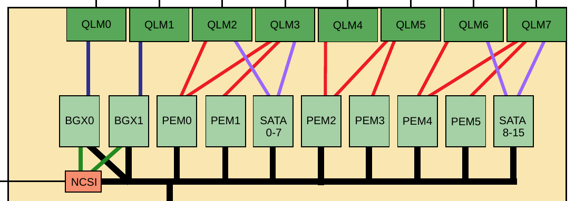

- [new](#new)
  - [如何export git的内容, 不带库](#如何export-git的内容-不带库)
  - [doxygen生成pdf](#doxygen生成pdf)
  - [在fedora上编perf](#在fedora上编perf)
  - [在板子上直接编kernel](#在板子上直接编kernel)
  - [禁用transparent_hugepage](#禁用transparent_hugepage)
  - [关于audit](#关于audit)
  - [分区resize](#分区resize)
  - [new库](#new库)
  - [编好以后](#编好以后)
    - [做盘](#做盘)
    - [格式化](#格式化)
    - [安文件系统](#安文件系统)
    - [解压到第二个分区](#解压到第二个分区)
    - [安装grub等--ubuntu](#安装grub等--ubuntu)
    - [安装模块](#安装模块)
  - [grub错误](#grub错误)
  - [ubuntu使用](#ubuntu使用)
  - [新版本UEFI](#新版本uefi)
  - [CRB更新UEFI](#crb更新uefi)
  - [qlm配置](#qlm配置)
- [old](#old)
  - [编译](#编译)
    - [bdk](#bdk)
    - [sdk](#sdk)
    - [kernel](#kernel)
    - [boot-wrapper --好像没什么用 --有用, dts](#boot-wrapper---好像没什么用---有用-dts)
    - [uboot-build](#uboot-build)
    - [uefi-build](#uefi-build)
    - [atf](#atf)
    - [垃圾文件](#垃圾文件)
    - [atf的image](#atf的image)
    - [制作启动盘](#制作启动盘)

# new
## 如何export git的内容, 不带库
```shell
#! /bin/sh
sdk_dir=`pwd`
target_dir=~/tmp/SDK
#export SDK
cd $sdk_dir
mkdir -p $target_dir
git archive HEAD | tar xf - -C $target_dir
#export linux
cd $sdk_dir/linux/kernel/linux-aarch64
mkdir -p $target_dir/linux/kernel/linux-aarch64
git archive HEAD | tar xf - -C $target_dir/linux/kernel/linux-aarch64
#export uefi
cd $sdk_dir/bootloader/edk2
mkdir -p $target_dir/bootloader/edk2
git archive HEAD | tar xf - -C $target_dir/bootloader/edk2
#export grub
cd $sdk_dir/bootloader/grub
mkdir -p $target_dir/bootloader/grub
git archive HEAD | tar xf - -C $target_dir/bootloader/grub
#export atf
cd $sdk_dir/firmware/atf
mkdir -p $target_dir/firmware/atf
git archive HEAD | tar xf - -C $target_dir/firmware/atf
#export uboot
cd $sdk_dir/bootloader/u-boot
mkdir -p $target_dir/bootloader/u-boot
git archive HEAD | tar xf - -C $target_dir/bootloader/u-boot
#export bdk
cd $sdk_dir/firmware/bdk
svn export . $target_dir/firmware/bdk
```

## doxygen生成pdf
```shell
cd ~/repo/git/thunder/new/bdk/thunder/docs
sudo apt-get install asciidoc
sudo apt-get install xsltproc
sudo apt-get install fop
sudo apt-get install doxygen
sudo apt-get install lua-ldoc
make
```
## 在fedora上编perf
需要安装
```shell
yum install libdwarf-devel
yum install audit-libs-devel
yum install elfutils-libelf-devel
yum install elfutils-libelf
yum install libnuma
yum install numactl-libs
yum install python-libs
yum install slang-devel
yum install slang
yum install libunwind-devel
yum install elfutils-devel
yum install gtk2-devel
yum install libtool
yum install perl-ExtUtils-Embed
yum install binutils-devel
yum install zlib-static
yum install numactl-devel
yum install python
yum install python-devel
```
```shell
cd /usr/src/linux-4.1.12-gentoo/tools/perf
make
make install
```

## 在板子上直接编kernel
```shell
cd linux
make mrproper
# cp ../native-config-no-ilp32 .config
make olddefconfig
make Image -j64
make dtbs    //估计要手动拷dtb到/boot, 这个和交叉编出来的一样
make modules -j64
make -s kernelrelease
make modules_install -j64
make install -j48    //会在/boot下面安装vmlinuz initramfs和System.map
make headers_install
make INSTALL_HDR_PATH=/usr/include headers_install
make firmware_install
cd /repo/thunder/linux/arch/arm64/boot/dts
cp thunder-88xx*.dtb /boot
cp Image /boot/Image.native
实际上, 这里的Image和vmlinuz是一模一样的
那么现在很可能就是, kernel使用Image(vmlinuz), 不用ramfs, 而是直接从硬盘起.
```

## 禁用transparent_hugepage
```shell
root@Tfedora /sys/kernel/mm/transparent_hugepage
# cat enabled 
[always] madvise never
```
也可以在kernel commandline里面加
transparent_hugepage=never
## 关于audit
某次异常重启后有audit打印
```
# [  303.397999] audit: type=2404 audit(1429709230.951:78): pid=1277 uid=0 auid=4294967295 ses=4294967295 msg='op=destroy kind=server fp=7c:94:0e:bc:be:3c:c9:0e:d7:eb:66:3c:
bc:96:00:c0 direction=? spid=1277 suid=0  exe="/usr/sbin/sshd" hostname=? addr=11.1.48.36 terminal=? res=success'
[  303.423078] audit: type=2404 audit(1429709230.981:79): pid=1277 uid=0 auid=4294967295 ses=4294967295 msg='op=destroy kind=server fp=cf:6d:fc:af:89:b7:de:5b:67:8e:70:7c:27
:ba:15:4a direction=? spid=1277 suid=0  exe="/usr/sbin/sshd" hostname=? addr=11.1.48.36 terminal=? res=success'
[  303.448021] audit: type=2404 audit(1429709231.001:80): pid=1277 uid=0 auid=4294967295 ses=4294967295 msg='op=destroy kind=server fp=94:0c:25:26:08:7b:46:41:85:a3:0c:86:3f
:35:09:1f direction=? spid=1277 suid=0  exe="/usr/sbin/sshd" hostname=? addr=11.1.48.36 terminal=? res=success'
[  303.473623] audit: type=2407 audit(1429709231.031:81): pid=1276 uid=0 auid=4294967295 ses=4294967295 msg='op=start direction=from-server cipher=aes128-ctr ksize=128 mac=h
mac-md5-etm@openssh.com pfs=curve25519-sha256@libssh.org spid=1277 suid=74 rport=50245 laddr=11.1.48.42 lport=22  exe="/usr/sbin/sshd" hostname=? addr=11.1.48.36 terminal=? 
res=success'
[  303.505115] audit: type=2407 audit(1429709231.061:82): pid=1276 uid=0 auid=4294967295 ses=4294967295 msg='op=start direction=from-server cipher=aes128-ctr ksize=128 mac=h
mac-md5-etm@openssh.com pfs=curve25519-sha256@libssh.org spid=1277 suid=74 rport=50245 laddr=11.1.48.42 lport=22  exe="/usr/sbin/sshd" hostname=? addr=11.1.48.36 terminal=? 
res=success'
```
解决办法  
`# auditctl -e 0`  
有人提到了改/etc/audit/audit.rules, 把里面的-D改成-e 0

## 分区resize
```shell
e2fsck -f /dev/sdc2
resize2fs /dev/sdc2 100G
gdisk /dev/sdc
n
```
几个都是默认的回车

## new库
现在又改了
```shell
byj@mint ~/repo/git/cavium/thunder/new/sdk-master
$ source env-setup
```
```shell
git clone git://cagit1.caveonetworks.com/thunder/sdk/sdk-new.git
cd sdk-new 
wget http://toolchain-releases.caveonetworks.com/releases/thunder/gcc47/thunderx-tools-693.tar.bz2 
tar -xjf thunderx-tools-693.tar.bz2 
ln -s thunderx-tools-693 tools 
```
```shell
. env-setup BOARD_TYPE=ebb8800
. env-setup BOARD_TYPE=crb-2s
./get_sources.sh -v --prep --gitdepth=10
./get_sources.sh -v --update
./get_sources.sh -v --stable --prep --gitdepth=10
./get_sources.sh -v --stable --update
```
```shell
make uefi-build
make linux-kernel
```
## 编好以后
```shell
cd ~/tmp/image
$ scp yingjie@192.168.1.5:~/repo/git/thunder/thunder-* .
$ sudo dd if=thunder-uefi.img of=/dev/mmcblk0 bs=4M
$ sync
```
### 做盘
`cd sdk/bootloader`
### 格式化
`./create_disk.sh --raw-disk /dev/sdc`
### 安文件系统
```
cd /cavium/share/thunder/linuxfs
sudo kpartx -av ThunderX-ubuntu-8G-v3-FAE.img
sudo mount /dev/mapper/loop0p2 mnt/
cd mnt
sudo tar cjvpf ../ThunderX-ubuntu-8G-v3-FAE-root.tar.bz2 .
sudo umount mnt
sudo kpartx -dv ThunderX-ubuntu-8G-v3-FAE.img
```
### 解压到第二个分区
```
cd /cavium/share/thunder/linuxfs
sudo mount /dev/sdc2 mnt
cd mnt
sudo tar xvf ../ThunderX-ubuntu-8G-v3-FAE-root.tar.bz2
sudo tar xvf ../ubuntu-shfae-150226.tar.bz2
tar xvf ../F21-aarch64-server-root.tar.bz2
sudo umount mnt
```
### 安装grub等--ubuntu
`./create_disk.sh --install-grub2 /dev/sdc1 /dev/sdc2 /boot`
此时在sdc1里面有
```
EFI  fdt.dtb  Image  startup.nsh
```
而sdc2里面有boot/
```
efi  fdt.dtb  grub  Image
```
安装grub等--redhat
```
./create_disk.sh --install-grub2 /dev/sdc1 /dev/sdc2 /
```
### 安装模块
`./create_disk.sh --install-modules /dev/sdc2`

## grub错误
```
Welcome to GRUB!
error: disk `,gpt2' not found.
Entering rescue mode...
grub rescue> ls
(hd0) (hd0,gpt2) (hd0,gpt1) (hd1) (hd2)
grub rescue> ls (hd0,gpt2)/
...显示root分区的内容
grub rescue> set root=(hd0,gpt2)
grub rescue> set prefix=(hd0,gpt2)/boot/grub/
grub rescue> insmod /boot/grub/arm64-efi/normal.mod
grub rescue> normal
```

## ubuntu使用
* 设时间
`date -s "2015-02-28 15:15:00"`
* 配网络
```shell
$ cat /etc/network/interfaces
# This file describes the network interfaces available on your system
# and how to activate them. For more information, see interfaces(5).
# The loopback network interface
auto lo
iface lo inet loopback
# The primary network interface
#auto eth0
#iface eth0 inet dhcp
```

## 新版本UEFI
```
Please choose option 1 (97MB) and then answer as follows
\EFI\BOOT\BOOTAA64.EFI
y
<nothing>
Grub.
```

## CRB更新UEFI
```shell
$ scp thunder-uefi.img yingjie@192.168.1.99:/tftpboot
$ ssh sysadmin@192.168.1.20     superuser
# cd /tmp/
# tftp -gr thunder-uefi.img 192.168.1.99
# /usr/local/bin/CPU_flash_upgrade.sh thunder-uefi.img 
```

## qlm配置
  
  
  
  

# old
## 编译
环境:
```
cd sdk
. env-setup
```
### bdk
```
cd bdk
make
```
### sdk
```shell
$ cd scripts
$ ./build-wrapper.sh sdk help
*. ebb8800 uboot
./build-wrapper.sh --no-uefi --board=ebb8800 --fae sdk build
*. ebb8800 uefi
./build-wrapper.sh --uefi --board=ebb8800 --fae sdk build
*. ebb8804 uboot
./build-wrapper.sh --no-uefi --board=ebb8804 --fae sdk build
*. ebb8804 uefi
./build-wrapper.sh --uefi --board=ebb8804 --fae sdk build
*. crb1s uboot
./build-wrapper.sh --no-uefi --board=crb-1s --fae sdk build
*. crb1s uefi
./build-wrapper.sh --uefi --board=crb-1s --fae sdk build
*. crb2s uboot
./build-wrapper.sh --no-uefi --board=crb-2s --fae sdk build
*. crb2s uefi
./build-wrapper.sh --uefi --board=crb-2s --fae sdk build
```
### kernel
kernel-fae
### boot-wrapper --好像没什么用 --有用, dts
```
thunder-88xx.dts 指向内核的dts文件
boot-wrapper/Makefile
    $(IMAGE): boot.o cache.o gic.o mmu.o ns.o smmu.o $(BOOTMETHOD) model.lds fdt.dtb $(KERNEL) $(FILESYSTEM)
```
### uboot-build
```
cd $abs_top_builddir/sdk/bootloader/trusted-firmware/atf -->thunder-bootfs.img
make with-uboot
只编atf和uboot
在build-sdk.source里面对kernel做mkimage, 然后把linux和dtb也做到thunder-bootfs.img里面去
依赖boot-wrapper/fdt.dtb, 用的是thunder-88xx.dts, 并加了一些启动参数, 比如root=
注:
这里的dts好像只分1s和2s的
```
### uefi-build
```
cd $abs_top_builddir/sdk/bootloader
make grub
make fdt -->这里用的是原始的thunder-88xx.dts, 没有改动
cd $abs_top_builddir/sdk/bootloader/trusted-firmware/atf
make with-uefi
uefi
    build -a AARCH64 -t ARMGCC -p ArmPlatformPkg/ThunderPkg/Thunder_${PLATFORM}.dsc -b ${TARGET}
    内存, 默认16G(0x3FF000000) ---->要改
    gArmTokenSpaceGuid.PcdSystemMemoryBase|0x00c00000
    gArmTokenSpaceGuid.PcdSystemMemorySize|0x3FF000000
    启动:
    gArmPlatformTokenSpaceGuid.PcdDefaultBootDescription|L"GRUB"
    注: 下面用到的EFI_PART_UUID=E3AE6975-BACE-464E-91E1-BB4FE9954047写死在bootloader/create_disk.sh
    默认的SATA port 是 QLM3/Port1, CRB最左边
    gArmPlatformTokenSpaceGuid.PcdDefaultBootDevicePath|L"PciRoot(0x1)/Pci(0x8,0x0)/Sata(0x0,0x0,0x0)/HD(1,GPT,E3AE6975-BACE-464E-91E1-BB4FE9954047,0x800,0x31801)/\EFI\BOOT\BOOTAA64.EFI"
    gArmPlatformTokenSpaceGuid.PcdDefaultBootType|0
    参考启动:
    gArmPlatformTokenSpaceGuid.PcdDefaultBootDescription|L"Linux from SemiHosting"
    gArmPlatformTokenSpaceGuid.PcdDefaultBootDevicePath|L"VenHw(C5B9C74A-6D72-4719-99AB-C59F199091EB)/Image"
    gArmPlatformTokenSpaceGuid.PcdDefaultBootArgument|" root=/dev/sda2 console=ttyAMA0 mem=1024M earlyprintk=pl011,0x87e024000000 debug maxcpus=16 rw"
    gArmPlatformTokenSpaceGuid.PcdDefaultBootType|2
    gArmPlatformTokenSpaceGuid.PcdFdtDevicePath|L"VenHw(C5B9C74A-6D72-4719-99AB-C59F199091EB)/fdt.dtb"
注意: 启动的时候需要\EFI\BOOT\BOOTAA64.EFI, 但我在crb上没看到? --在硬盘的第一个分区上. 需要mount /dev/sdb1, BOOTAA64.EFI 有115k
但这个东西从哪里来的?
貌似是edk代码grub-install里写死的
./bootloader/edk2/MdePkg/Include/Uefi/UefiSpec.h:2123:#define EFI_REMOVABLE_MEDIA_FILE_NAME_AARCH64 L"\\EFI\\BOOT\\BOOTAA64.EFI"
./bootloader/grub2/grub/util/grub-install.c:1107:             efi_file = "BOOTAA64.EFI"
```
### atf
```
with-uboot: ATF u-boot
    ${ATF_ROOT}/tools/make-bootfs.py --uboot ${UBOOT_IMAGE} -f ${BOOTFS_IMAGE}
with-uefi: uefi ATF
    ${ATF_ROOT}/tools/make-bootfs.py --uefi ${UEFI_IMAGE} -f ${BOOTFS_IMAGE}
ATF: bootwrapper fip.bin
    ${ATF_ROOT}/tools/make-bootfs.py  --bs ${BDK_IMAGE} --bl0  ${ATFBS_IMAGE} -f ${BOOTFS_IMAGE}
    ${ATF_ROOT}/tools/make-bootfs.py --fip ${ATFFIP_IMAGE} --bl1 ${ATFBL1_IMAGE} -f ${BOOTFS_IMAGE}
bootwrapper:
    make -s -C ${ATF_ROOT}/plat/thunder/bootstrap/ -j8 -->bootstrap.bin
fip.bin: bl1.bin
bl1.bin:
    make -f Makefile.ATF PLAT=thunder all fip -j8 -s CROSS_COMPILE=${CROSS_COMPILE}
u-boot:
    make -s -C ${UBOOT_ROOT} thunder_asim_config
    make -s -C ${UBOOT_ROOT} -j8 -s CROSS_COMPILE=${CROSS_COMPILE}
uefi:
    make -s -C ${THUNDER_ROOT}/bootloader uefi -->THUNDER_EFI.fd
```
### 垃圾文件
bootloader/trusted-firmware/Makefile, 因为它依赖的一个flash_tool被.py取代
### atf的image
```
ATF_BL0_OFFSET = 0x400000
ATF_BL1_OFFSET = 0x500000
ATF_BL2_OFFSET = 0x580000
ATF_BL32_OFFSET = 0x600000
ATF_LINUX_OFFSET = 0x800000
ATF_DTC_OFFSET = 0x700000
ATF_TBL_OFFSET = 0x480000
```
```
make-bootfs.py
--bs(bdk boot strap) normal-$board.bin
--bl0(atf boot strap) ${ATF_ROOT}/plat/thunder/bootstrap/build/bootstrap.bin 
--bl1(atf boot stage 1) ${ATF_ROOT}/build/thunder/release/bl1.bin
--fip(atf boot stage 2 and 3.1) ${ATF_ROOT}/build/thunder/release/fip.bin
-u(uboot) ${UBOOT_ROOT}/u-boot.bin ATF_BL32_OFFSET
-e(uefi) ${THUNDER_ROOT}/bootloader/edk2/THUNDER_EFI.fd ATF_BL32_OFFSET
-l(linux) uboot需要
-d(dtc) uboot需要, 在bootstrap阶段编译的dts
```

### 制作启动盘
```
bootloader/create_disk.sh
FI_PART_UUID=E3AE6975-BACE-464E-91E1-BB4FE9954047
--raw-disk /dev/sdb
create_disk_raw_disk()
    RAW_DISK="${1:-}"
    check_part $RAW_DISK 1
    reate_partitions $RAW_DISK
        两个分区, 第一个是100M的efi, 第二个是linux
    program_disk
        格式化两个分区fat和ext4
--install-grub2 <efi partition> <boot partition> <boot directory>
--install-grub2 /dev/sdb1 /dev/sdb2 /         # Red Hat
--install-grub2 /dev/sdb1 /dev/sdb2 /boot     # Ubuntu
install_grub2() $1 $2 $3
    __install_grub2 $efi_part $boot_part $boot_dir
        mkdir -p rootfs/boot
        mkdir -p rootfs/efi
        sudo mount -w $boot_part ./rootfs/boot
        sudo mount -w $efi_part ./rootfs/efi
        copy_files ./rootfs/efi ./rootfs/boot/$boot_dir ${RAW_DISK}
            sudo mkdir -p $boot_dir/efi
            sudo rm -rf $efi_dir/EFI
            sudo grub2/grub/build/sbin/grub-install \
            --target=arm64-efi --removable \
            --boot-directory=$boot_dir \
            --efi-directory=$efi_dir
            sudo cp startup.nsh $efi_dir 内容是fs0:\Image dtb=fdt.dtb root=/dev/sda2 console=ttyAMA0 earlycon=pl011,0x87e024000000 debug rw uefi_debug
            拷grub
            sudo mkdir -p $boot_dir/grub            
            sudo cp ./grub2/grub.cfg $boot_dir/grub/ 默认的grub配置, 第一个是linux /boot/Image root=/dev/sda2 console=ttyAMA0 earlycon=pl011,0x87e024000000 debug rw uefi_debug; devicetree /boot/fdt.dtb
            拷dtb
            sudo cp ./fdt.dtb $boot_dir
            sudo cp ./fdt.dtb $efi_dir
            拷linux Image
            sudo cp ./Image $boot_dir
            sudo cp ./Image $efi_dir
```