reboot会概率卡死, 怀疑和cpld拉住复位有关.

和pcie有关
```shell
CIU_CIB_RST_RAW(0):0x107000000E400
CIU_CIB_RST_EN(0):0x107000000E500
/user # devmem 0x107000000E400 64
0x0000000000000000
/user # devmem 0x107000000E500 64
0x0000000000000009
0x0001180006001628:
0x0001180006001640:
/user # devmem 0x0001180006001640 64
0x0000000000000148
HOST_MODE=1
RST_LINK=0
  
0x0001180006001680:
0x00011800060016C0:
```
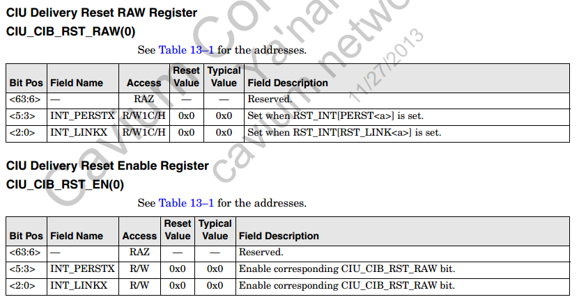  
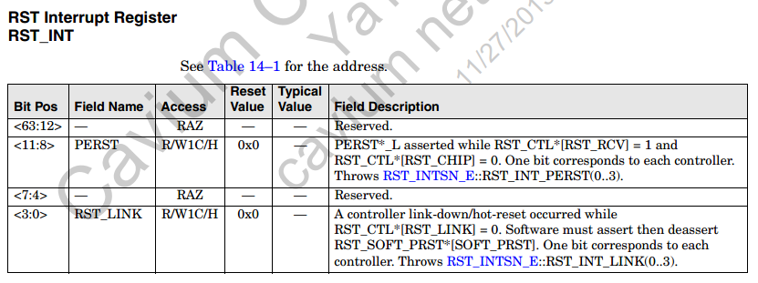  
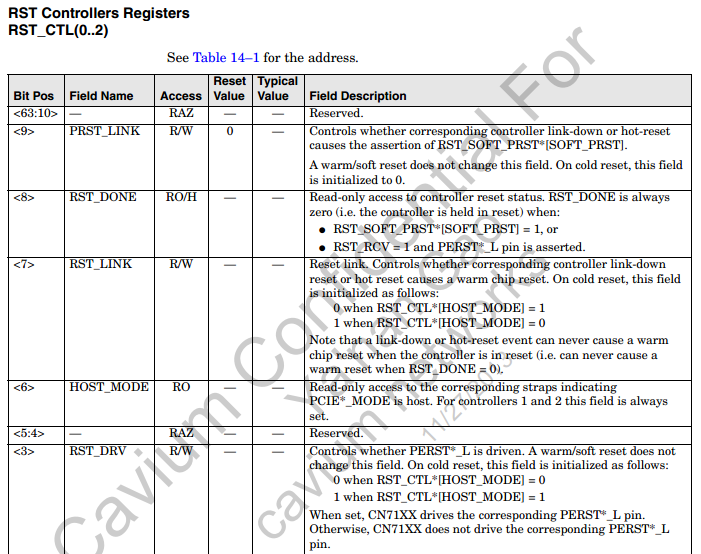  
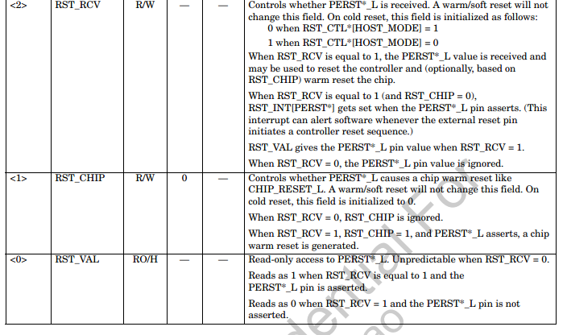  
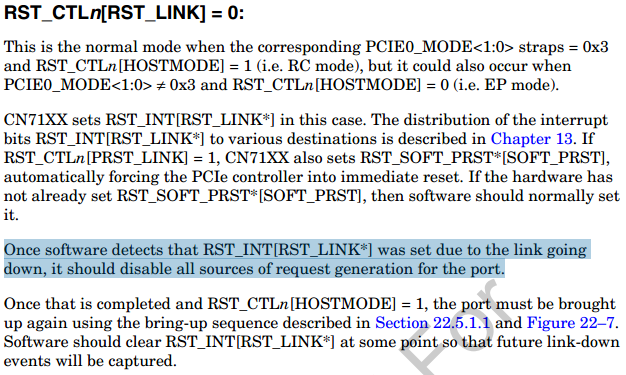  
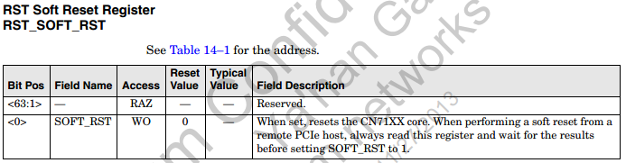  
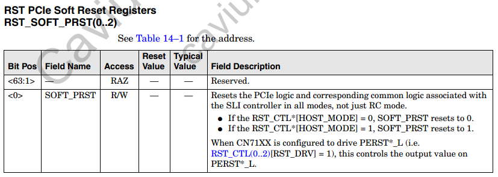  
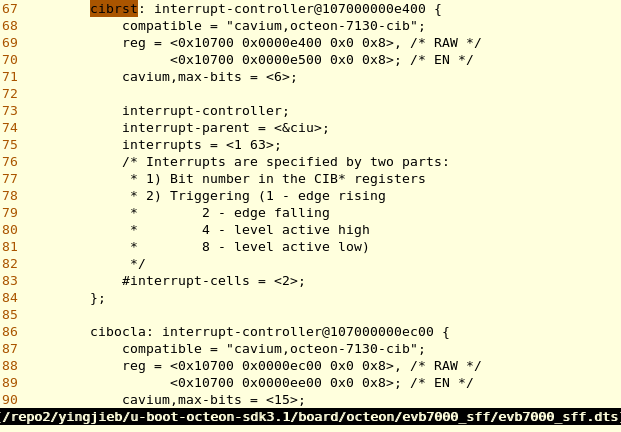  

# 流程
```c
kernel/reboot.c
sys_reboot:
kernel_restart()
    kernel_restart_prepare()
        blocking_notifier_call_chain(&reboot_notifier_list, SYS_RESTART, cmd);
        usermodehelper_disable();
        /*对每个device调用shutdown*/
        device_shutdown();
        对每个device:
            if (dev->bus && dev->bus->shutdown) {
                if (initcall_debug)
                    dev_info(dev, "shutdown\n");
                dev->bus->shutdown(dev);
            } else if (dev->driver && dev->driver->shutdown) {
                if (initcall_debug)
                    dev_info(dev, "shutdown\n");
                dev->driver->shutdown(dev);
            }
    migrate_to_reboot_cpu()
    /*调用注册过的所有sys core回调函数*/
    syscore_shutdown()
    pr_emerg("Restarting system\n")
    kmsg_dump()
    machine_restart()
        octeon_restart()
            for_each_online_cpu(cpu)
                cvmx_write_csr(CVMX_CIU_WDOGX(cpu_logical_map(cpu)), 0);
            cvmx_write_csr(CVMX_RST_SOFT_RST, 1)
```

reboot会调用`device_shutdown()` -> `static void cvm_oct_shutdown(struct platform_device *pdev)`
在这个函数里面:  
会关闭所有interface, 关闭GMX, rx_disable, 解注册并free掉net device, 清理hw pools, 清理pko queue.

# 调试
```
/user # reboot
/user # 
 WDT=a
application_watchdog: /scripts/application_watchdog: collecting system information...
/scripts/collect_system_information: line 26: can't create /logs/info_02_uptime: Read-only file system
/scripts/collect_system_information: line 29: can't create /logs/info_ps: Read-only file system
/scripts/collect_system_information: line 34: can't create /logs/info_sp: Read-only file system
/scripts/collect_system_information: line 47: can't create /logs/info_interrupts: Read-only file system
/scripts/collect_system_information: line 50: can't create /logs/info_memory: Read-only file system
/scripts/collect_system_information: line 51: can't create /logs/info_memory: Read-only file system
/scripts/collect_system_information: line 54: can't create /logs/info_stat: Read-only file system
The system is going down NOW!
Sent SIGTERM to all processes
Sent SIGKILL to all processes
[   48.179078] reboot_helper: stored panic_counter = 0
[   48.197076] reboot_helper: isam_reboot_type='warm'
[   48.214954] reboot-helper: Enabling preserved ram
[   48.232745] flush l2 cache.
[   48.248725] reboot_helper: continuing standard linux reboot
[   48.267860] device eth0 left promiscuous mode
[   48.306015] bonding: bond0: releasing active interface eth-nta
[   48.324985] bonding: bond0: Warning: clearing HW address of bond0 while it still has VLANs.
[   48.346430] bonding: bond0: When re-adding slaves, make sure the bond's HW address matches its VLANs'.
[   48.368930] device bond0 entered promiscuous mode
[   48.456398] reboot: Restarting system
[   48.473173] reboot: Restarting system2
[   48.490019] cvmx_write_csr CVMX_RST_SOFT_RST
[   48.507409] Error: CIU_CIB_RST_RAWX(0)[INT_LINKX]
=====================BOOT=======================
```
现象1:
```
/proc # cat interrupts 
           CPU0       CPU1       CPU2       CPU3       
  8:     134755      47296      14313       8189      Core  timer
  9:          0          0          0          0       CIU  cpld0_nmi
 10:          0          0          0          0       CIU  cpld0
 11:          0          0          0          0       CIU  pioneer0
 24:       8567          0          0          0       CIU  eth0
 35:       1007          0          0          0       CIU  serial
 45:          0          0          0          0       CIU  i2c-octeon
 57:          0          0          0          0       CIU  octeon-hw-status
 59:          0          0          0          0       CIU  i2c-octeon
 60:          0          0          0          0       CIU  octeon-hw-status
 73:        973          0          0          0     CIU-W  octeon_wdt
 74:          0        973          0          0     CIU-W  octeon_wdt
 75:          0          0        973          0     CIU-W  octeon_wdt
 76:          0          0          0        973     CIU-W  octeon_wdt
 89:          0          0          0          0       CIU  octeon-hw-status
 90:          0          0          0          0       CIU  octeon-hw-status
 91:          0          0          0          0       CIU  octeon-hw-status
 92:          0          0          0          0       CIU  octeon-hw-status
 93:          0          0          0          0       CIU  octeon-hw-status
 94:          0          0          0          0       CIU  octeon-hw-status
 95:          0          0          0          0       CIU  octeon-hw-status
 96:          0          0          0          0       CIU  octeon-hw-status
 97:          0          0          0          0       CIU  octeon-hw-status
 98:          0          0          0          0       CIU  octeon-hw-status
 99:          0          0          0          0       CIU  octeon-hw-status
105:      23036      28147      20942      19105     CIU-M  SMP-IPI
109:          1          0          0          0       CIU  linux-kernel-bde
113:          0          0          0          0       CIU  MSI[0:63]
114:          0          0          0          0       CIU  MSI[64:127]
115:          0          0          0          0       CIU  MSI[127:191]
116:          0          0          0          0       CIU  MSI[192:255]
127:          0          0          0          0       CIU  octeon-hw-status
ERR:          0
/proc # devmem 0x1a000010 8 0x8b
/proc # [ 5203.567484] Data bus error, epc == 0000000010cc490c, ra == 0000000010cc4874
[ 5203.588339] Error: CIU_CIB_RST_RAWX(0)[INT_LINKX]
[ 5203.590919] [sched_delayed] sched: RT throttling activated
/proc # cat interrupts 
           CPU0       CPU1       CPU2       CPU3       
  8:     143908      50283      15649       9957      Core  timer
  9:          0          0          0          0       CIU  cpld0_nmi
 10:          0          0          0          0       CIU  cpld0
 11:          0          0          0          0       CIU  pioneer0
 24:      10078          0          0          0       CIU  eth0
 35:       1065          0          0          0       CIU  serial
 45:          0          0          0          0       CIU  i2c-octeon
 57:          0          0          0          0       CIU  octeon-hw-status
 59:          0          0          0          0       CIU  i2c-octeon
 60:          0          0          0          0       CIU  octeon-hw-status
 73:       1045          0          0          0     CIU-W  octeon_wdt
 74:          0       1045          0          0     CIU-W  octeon_wdt
 75:          0          0       1045          0     CIU-W  octeon_wdt
 76:          0          0          0       1045     CIU-W  octeon_wdt
 89:          0          0          0          0       CIU  octeon-hw-status
 90:          0          0          0          0       CIU  octeon-hw-status
 91:          0          0          0          0       CIU  octeon-hw-status
 92:          0          0          0          0       CIU  octeon-hw-status
 93:          0          0          0          0       CIU  octeon-hw-status
 94:          0          0          0          0       CIU  octeon-hw-status
 95:          0          0          0          0       CIU  octeon-hw-status
 96:          0          0          0          0       CIU  octeon-hw-status
 97:          0          0          0          0       CIU  octeon-hw-status
 98:          0          0          0          0       CIU  octeon-hw-status
 99:          0          0          0          0       CIU  octeon-hw-status
105:      24342      29600      22330      20376     CIU-M  SMP-IPI
109:          1          0          0          0       CIU  linux-kernel-bde
113:          0          0          0          0       CIU  MSI[0:63]
114:          0          0          0          0       CIU  MSI[64:127]
115:          0          0          0          0       CIU  MSI[127:191]
116:          0          0          0          0       CIU  MSI[192:255]
127:          1          0          0          0       CIU  octeon-hw-status
ERR:          0
```

# Error: CIU_CIB_RST_RAWX(0)[INT_LINKX]

`arch/mips/cavium-octeon/executive/cvmx-error-trees.c`  
error_tree_cn70xx:  
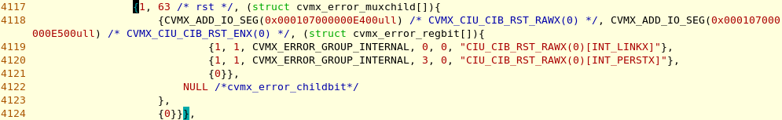  
在这里引用  
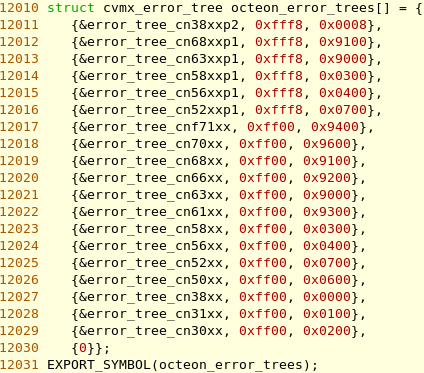  
```c
struct cvmx_error_childbit {
	u8 valid;
	u8 bit;
	struct cvmx_error_muxchild *children;
};
struct cvmx_error_muxchild {
	u64 reg;
	u64 mask_reg;
	struct cvmx_error_regbit *bits;
	struct cvmx_error_childbit *children;
};
```
lmc的error项:
```c
{1, 52 /* lmc0 */, (struct cvmx_error_muxchild[]){
    {CVMX_ADD_IO_SEG(0x00011800880001F0ull) + ((0) & 0) * 0x1000000ull /* CVMX_LMCX_INT(0) */, CVMX_ADD_IO_SEG(0x00011800880001E8ull) + ((0) & 0) * 0x1000000ull /* CVMX_LMCX_INT_EN(0) */, (struct cvmx_error_regbit[]){
            {1, 1, CVMX_ERROR_GROUP_LMC, 1, 0, "LMCX_INT(0)[SEC_ERR]"},
            {1, 1, CVMX_ERROR_GROUP_LMC, 0, 0, "LMCX_INT(0)[NXM_WR_ERR]"},
            {1, 1, CVMX_ERROR_GROUP_LMC, 5, 0, "LMCX_INT(0)[DED_ERR]"},
            {0}},
        NULL /*cvmx_error_childbit*/
    },
    {0}}},
{1, 52 /* lmc0 */, (struct cvmx_error_muxchild[]){
    {CVMX_ADD_IO_SEG(0x000107000000E200ull) /* CVMX_CIU_CIB_LMCX_RAWX(0,0) */, CVMX_ADD_IO_SEG(0x000107000000E300ull) /* CVMX_CIU_CIB_LMCX_ENX(0,0) */, (struct cvmx_error_regbit[]){
            {1, 1, CVMX_ERROR_GROUP_LMC, 1, 0, "CIU_CIB_LMCX_RAWX(0,0)[INT_SEC_ERRX]"},
            {1, 1, CVMX_ERROR_GROUP_LMC, 5, 0, "CIU_CIB_LMCX_RAWX(0,0)[INT_DED_ERRX]"},
            {1, 1, CVMX_ERROR_GROUP_LMC, 0, 0, "CIU_CIB_LMCX_RAWX(0,0)[INT_NXM_WR_ERR]"},
            {0}},
        NULL /*cvmx_error_childbit*/
    },
    {0}}},
```

# 注册
```c
struct octeon_hw_status_data {
	u64 reg;
	u32 bit;
	u8 reg_is_hwint:1;
};
```
```c
arch/mips/cavium-octeon/octeon-error-tree.c //这个文件负责解析错误, 表示层
arch_initcall(octeon_error_tree_init)
    static int __init octeon_error_tree_init(void)
        struct cvmx_error_tree *tree = octeon_error_trees
        //根据芯片id, 找到cn70xx的tree
        octeon_error_tree_current = tree->tree
        //注册notifier_call, 但什么时候调用呢?见下一条
        octeon_error_tree_notifier.notifier_call = octeon_error_tree_hw_status //这个函数会遍历那个error tree的字节点, 并打印描述
        octeon_hw_status_notifier_register(&octeon_error_tree_notifier)
            raw_notifier_chain_register(&octeon_hw_status_notifiers, nb)
        octeon_error_tree_enable(CVMX_ERROR_GROUP_INTERNAL, -1)
        //??
        octeon_error_tree_enable(CVMX_ERROR_GROUP_LMC, -1)
        octeon_error_tree_enable(CVMX_ERROR_GROUP_L2C, -1)
        //是不是还要加上CVMX_ERROR_GROUP_LMC,CVMX_ERROR_GROUP_L2C ?
```

## 上面注册的notifier_call什么时候调用?
```c
octeon-hw-status.c //这个文件提供一个硬件状态寄存器的中断处理和发生中断时的回调机制的抽象层
//RGMII SGMII SPI和octeon-error-tree.c都会调用这个函数
sr[idx].bit = bit->bit;
sr[idx].ack_w1c = bit->w1c;
sr[idx].has_child = 0;
octeon_hw_status_add_source(sr)
    root->hwint == chain->reg//遍历root, 寻找和入参一样的chain->reg
    root->irq = irq_create_mapping(NULL, root->hwint)
    rv = request_threaded_irq(root->irq, NULL,octeon_hw_status_irq, IRQF_ONESHOT,"octeon-hw-status", root)
//这个应该就是中断处理函数了
octeon_hw_status_irq()    
    visit_leaves(root, false, irq_cb, &d);
        irq_cb()
            raw_notifier_call_chain(&octeon_hw_status_notifiers, OCTEON_HW_STATUS_SOURCE_ASSERTED, &ohsd)
```

## 猜想, 调用int octeon_hw_status_disable(u64 reg, u64 bit_mask)关闭中断位就可以了.

# octeon_error_tree_enable()函数
```c
    while(对每个项和子项)
        irq_reg = octeon_error_tree_map_irq_reg(base->reg);
        sr[0].reg = irq_reg << 6 | line->bit;
        sr[0].reg_is_hwint = 1;
        sr[0].has_child = 1;
        octeon_error_tree_add(sr, 1, ARRAY_SIZE(sr) - 1, child, group, unit);
            octeon_hw_status_add_source()
                root->irq = irq_create_mapping(NULL, root->hwint);
                //注册中断, octeon_hw_status_irq()是在任务上下文调用的, 
                rv = request_threaded_irq(root->irq, NULL,octeon_hw_status_irq, IRQF_ONESHOT,"octeon-hw-status", root);
                    visit_leaves(root, false, irq_cb, &d);
                        raw_notifier_call_chain(&octeon_hw_status_notifiers,OCTEON_HW_STATUS_SOURCE_ASSERTED, &ohsd); //这就是前面注册的
            octeon_hw_status_enable()
            //递归调字节点的
```

注:request_threaded_irq()第二个入参是中断handler, 在中断上下文调用. 为NULL的话使用下面默认的irq_default_primary_handler
```c
/*
 * Default primary interrupt handler for threaded interrupts. Is
 * assigned as primary handler when request_threaded_irq is called
 * with handler == NULL. Useful for oneshot interrupts.
 */
static irqreturn_t irq_default_primary_handler(int irq, void *dev_id)
{
	return IRQ_WAKE_THREAD;
}
```

# ddr ecc中断寄存器
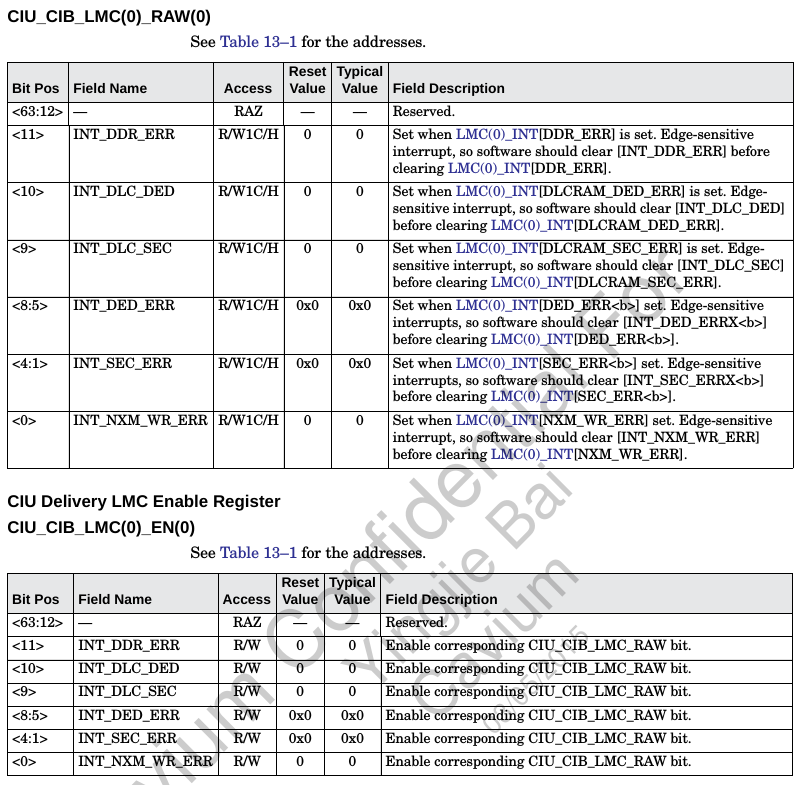  
  
```shell
# devmem 0x00011800880001E8 64
0x0000000000000000
# devmem 0x00011800880001F0 64
0x0000000000000000
# devmem 0x00011800880001D8 64
0x000000000AFFB398
# devmem 0x107000000E000 64
0x0000000000000000
# devmem 0x107000000E100 64
0x00000000007FFFFF
CIU_CIB_LMC(0)_RAW(0)
# devmem 0x107000000E200 64
0x0000000000000008
CIU_CIB_LMC(0)_EN(0)
# devmem 0x107000000E300 64
0x0000000000000023
# devmem 0x107000000E200 64
0x0000000000000008
# devmem 0x107000000E300 64 0xffff
[ 1026.792931] ERROR: CIB bit 3@800107000000e200 IRQ unhandled, disabling
# cat /proc/interrupts 
           CPU0       CPU1       CPU2       CPU3       
  8:     111448     111454     111460     111423      Core  timer
 25:        146          0          0          0       CIB  ahci
 26:          0          0          0          0       CIB  xhci-hcd:usb1
 27:          0          0          0          0       CIB  xhci-hcd:usb3
 34:        696          0          0          0       CIU  serial
 45:          8          0          0          0       CIU  i2c-octeon
 57:          0          0          0          0       CIU  octeon-hw-status
 59:          0          0          0          0       CIU  i2c-octeon
 60:          0          0          0          0       CIU  octeon-hw-status
 73:        221          0          0          0     CIU-W  octeon_wdt
 74:          0        221          0          0     CIU-W  octeon_wdt
 75:          0          0        221          0     CIU-W  octeon_wdt
 76:          0          0          0        221     CIU-W  octeon_wdt
 89:          0          0          0          0       CIU  cib
 90:          0          0          0          0       CIU  cib
 91:          0          0          0          0       CIU  octeon-hw-status
 92:          0          0          0          0       CIU  octeon-hw-status
 93:          0          0          0          0       CIU  octeon-hw-status
 94:          0          0          0          0       CIU  octeon-hw-status
 95:          0          0          0          0       CIU  octeon-hw-status
 96:          0          0          0          0       CIU  octeon-hw-status
 97:          0          0          0          0       CIU  cib
 98:          0          0          0          0       CIU  octeon-hw-status
 99:          0          0          0          0       CIU  octeon-hw-status
100:         13          0          0          0       CIU  octeon_mmc
105:       2087       2308        739       1575     CIU-M  SMP-IPI
113:          0          0          0          0       CIU  MSI[0:63]
114:          0          0          0          0       CIU  MSI[64:127]
115:          0          0          0          0       CIU  MSI[127:191]
116:          0          0          0          0       CIU  MSI[192:255]
121:    1108312          0          0          0       CIU  oct_ilm
122:          1          0          0          0       CIU  cib
127:          0          0          0          0       CIU  cib
144:        146          0          0          0       CIU  cib
145:          0          0          0          0       CIU  cib
ERR:          0
static irqreturn_t octeon_irq_cib_handler(int my_irq, void *data)
# [  366.867126] INFO: rcu_sched self-detected stall on CPU { 0}  (t=6000 jiffies g=18446744073709551430 c=18446744073709551429 q=15)                                [5/3476]
[  366.937276] CPU: 0 PID: 0 Comm: swapper/0 Not tainted 3.10.20-rt14-Cavium-Octeon #6
[  366.956650] Stack : ffffffff80980000 ffffffff812a0000 0000000000000057 ffffffff80980000
          000000000000000f ffffffff81290000 ffffffff80980000 0000000000000001
          000000000000000f ffffffff81290000 ffffffff80980000 0000000000000001
          0000000000000000 ffffffff8016e9e8 0000000000000000 0000000000000000
          ffffffff812a0000 ffffffff81290000 ffffffff80862c80 ffffffff809403f7
          ffffffff81289d00 ffffffff80940900 0000000000000000 0000000000000000
          8000000002270c58 ffffffff80940000 ffffffff80940000 ffffffff806dfbc8
          ffffffff8090afa8 ffffffff8090aea0 ffffffff8093a4e8 ffffffff801e3ec8
          ffffffff809404f0 ffffffff80862c80 0000000000000000 0000000000000000
          0000000000000000 ffffffff80149390 0000000000000000 0000000000000000
          ...
[  367.642775] Call Trace:
[  367.656940] [<ffffffff80149390>] show_stack+0xc0/0xe0
[  367.673711] [<ffffffff801e3ec8>] rcu_check_callbacks+0x3a8/0x838
[  367.691434] [<ffffffff801801ec>] update_process_times+0x54/0x88
[  367.709070] [<ffffffff801b9f90>] tick_sched_timer+0x70/0x180
[  367.726447] [<ffffffff80199cd8>] __run_hrtimer+0xa0/0x228
[  367.743561] [<ffffffff8019aaa8>] hrtimer_interrupt+0x2c8/0x3c0
[  367.761110] [<ffffffff8014c058>] c0_compare_interrupt+0x68/0x98
[  367.778749] [<ffffffff801d93b0>] handle_irq_event_percpu+0x80/0x2c0
[  367.796732] [<ffffffff801dd6e8>] handle_percpu_irq+0x98/0xc8
[  367.814106] [<ffffffff801d8924>] generic_handle_irq+0x44/0x58
[  367.831570] [<ffffffff806e7fac>] do_IRQ+0x24/0x30
[  367.847990] [<ffffffff80106a70>] plat_irq_dispatch+0xa0/0xc0
[  367.865364] [<ffffffff801440cc>] ret_from_irq+0x0/0x4
[  367.882130] [<ffffffff8019c5dc>] notifier_call_chain+0x8c/0xc0
[  367.899678] [<ffffffff8019c62c>] __atomic_notifier_call_chain+0x1c/0x28
[  367.918008] [<ffffffff8019cfc4>] notify_die+0x34/0x40
[  367.934774] [<ffffffff80149f90>] do_ri+0x60/0x280
[  367.951192] [<ffffffff801440c0>] ret_from_exception+0x0/0xc
[  367.968479] [<ffffffff8014b4f8>] do_ade+0x40/0x798
[  367.984983] [<ffffffff801440c0>] ret_from_exception+0x0/0xc
[  368.002269] [<ffffffff801d93a0>] handle_irq_event_percpu+0x70/0x2c0
[  368.020252] [<ffffffff801dd6e8>] handle_percpu_irq+0x98/0xc8
[  368.037626] [<ffffffff80103be0>] octeon_irq_cib_handler+0xf0/0x1c8
[  368.055522] [<ffffffff801d93b0>] handle_irq_event_percpu+0x80/0x2c0
[  368.073505] [<ffffffff801d9650>] handle_irq_event+0x60/0x90
[  368.090791] [<ffffffff801dce10>] handle_level_irq+0xd0/0x150
[  368.108165] [<ffffffff801d8924>] generic_handle_irq+0x44/0x58 很多打印
[  368.125626] [<ffffffff806e7fac>] do_IRQ+0x24/0x30
[  368.142044] [<ffffffff80106a3c>] plat_irq_dispatch+0x6c/0xc0
[  368.159417] [<ffffffff801440cc>] ret_from_irq+0x0/0x4
[  368.176181] [<ffffffff801443e0>] __r4k_wait+0x20/0x40
[  368.192950] [<ffffffff801b16c4>] cpu_startup_entry+0xe4/0x2b0
[  368.210415] [<ffffffff809de9c8>] start_kernel+0x4b0/0x4d0
[  368.227527]
```
