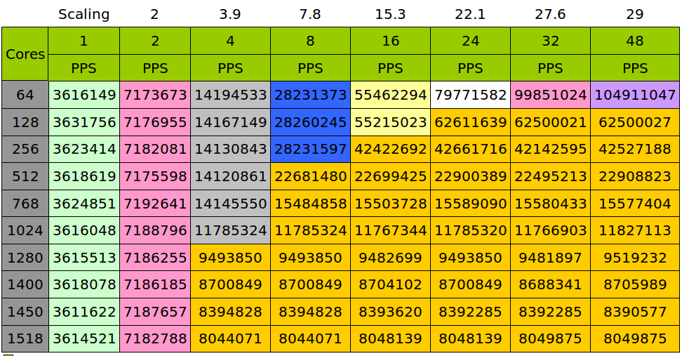
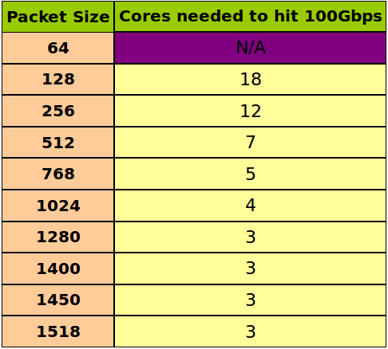
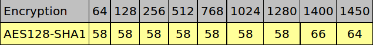

- [时间估算](#时间估算)
- [IP forwarding(IP Toolkit)](#ip-forwardingip-toolkit)
  - [CN68 vs CN78](#cn68-vs-cn78)
  - [linux vs SE](#linux-vs-se)
  - [CN78性能](#cn78性能)
- [Ipsec](#ipsec)
  - [Ipsec加密会导致frame增大](#ipsec加密会导致frame增大)
  - [CN68 vs CN78](#cn68-vs-cn78-1)
- [L2 passthrough](#l2-passthrough)
  - [CN78](#cn78)

# 时间估算
比如IP forwarding 单核处理速度是3.3M pps  
报文这个东西的处理流程可以想象成汽车组装流水线, 3.3M pps说的是这个流水线0.3us就能出一辆整车.  
0.3us说的是在上百个流水线节点最慢的节点需要的时间, 他是整个系统的瓶颈, 决定了出整车的速度.  
但从0开始算到第一个整车出来, 整个过程需要的时间是latency.这个latency应该远远大于0.3us(流水线深度越深, 这个差距应该越大)  
据反馈一个报文的latency在**100us**左右.  
下面是实际的ping测试, 两台thunder服务器之间有个光口交换机.
```
$ ping 192.168.1.21
PING 192.168.1.21 (192.168.1.21) 56(84) bytes of data.
64 bytes from 192.168.1.21: icmp_seq=1 ttl=64 time=0.348 ms
64 bytes from 192.168.1.21: icmp_seq=2 ttl=64 time=0.140 ms
64 bytes from 192.168.1.21: icmp_seq=3 ttl=64 time=0.131 ms
64 bytes from 192.168.1.21: icmp_seq=4 ttl=64 time=0.106 ms
64 bytes from 192.168.1.21: icmp_seq=5 ttl=64 time=0.110 ms
64 bytes from 192.168.1.21: icmp_seq=6 ttl=64 time=0.103 ms
64 bytes from 192.168.1.21: icmp_seq=7 ttl=64 time=0.126 ms
64 bytes from 192.168.1.21: icmp_seq=8 ttl=64 time=0.116 ms
```

# IP forwarding(IP Toolkit)
## CN68 vs CN78
CPU-core| pps | bps
----|----|----
CN68-1.5G-800SCLK-1066DDR-40G line card-4flow-simple executive |
64byte-1core | 3.3M    | 1.7G
64byte-16core | 41M    | 21.2G
64byte-32core | 43M    | 22.2G
128byte-1core | 3.3M    | 3.4G
128byte-12core | 33M | 33.7G
256byte-1core | 3.3M | 6.7G
256byte-8core | 18.1M | 37G
1518byte-1core| 3.2M | 39.4G
----|----|----
CN78-1.8G-1200SCLK-1866DDR-100G line card-4flow-simple executive |
64byte-1core | 3.6M    | 1.8G
64byte-16core | 55.4M    | 28.3G
64byte-32core | 99.8M    | 51G
64byte-48core | 104.9M    | 54G
128byte-1core | 3.6M    |
512byte-1core | 3.6M    |
512byte-8core | 22.6M    | 93G
1518byte-1core | 3.6M    |
1518byte-8core | 8.0M    |
1518byte-4core | 8.0M    | 97G
结论:
* CN78对比CN68有整体性的提升, 主要解决了40G到100G的扩展性问题, 可以看到, 78基本上能够达到100G, 而68由于设计规格和IO规格只有40G
* 单看单核性能78有一定程度提升, 主要来自于Core/IO/DDR的频率提升
* 在线性度上78也有提升

## linux vs SE
CPU-core| pps | bps
----|----|----
CN68-1.5G-800SCLK-1066DDR-40G line card-4flow-simple executive |
64byte-1core | 3.3M    | 1.7G
64byte-16core | 41M    | 21.2G
64byte-32core | 43M    | 22.2G(?)
128byte-1core | 3.3M    | 3.4G
128byte-12core | 33M | 33.7G
256byte-1core | 3.3M | 6.7G
1518byte-1core| 3.2M | 39.4G
----|----|----
CN68-1.3G-800SCLK-1333DDR-40G line card-4flow-Linux Forwarding-native |
64byte-1core | 0.68M    | 0.35G
64byte-8core | 5.3M    | 2.7G
64byte-16core | 10.8M    | 5.5G
64byte-32core | 15.2M    | 7.7G
512byte-1core | 0.68M | 2.7G
512byte-8core | 5.4M | 22.1G
512byte-12core | 8.9M | 36.5G
1518byte-1core | 0.68M | 8.2G
----|----|----
CN68-1.3G-800SCLK-1333DDR-40G line card-4flow-Linux Forwarding-ip offload module |
64byte-1core | 1.6M    | 
64byte-8core | 12.6M    | 
64byte-16core | 24.7M    |
64byte-32core | 33.6M    |
512byte-1core | 1.6M |
1518byte-1core | 1.6M |

## CN78性能
  
  

# Ipsec
## Ipsec加密会导致frame增大
  

## CN68 vs CN78
CPU-core| pps | bps
----|----|----
CN68-1.3G-800SCLK-1066DDR-40G line card-70 flow-10 sec burst-AES128-SHA1 |
64byte-1core | 0.57M    |
64byte-8core | 4.56M    |
64byte-16core | 9.06M    |
64byte-32core | 17.87M    |
128byte-1core | 0.52M    |
128byte-32core | 16.35M    |
512byte-1core | 0.35M    |
512byte-24core | 8.40M    |
1024byte-1core | 0.25M    |
1024byte-16core | 3.96M    |
1450byte-1core | 0.19M    |
1450byte-16core | 3.15M    | 36G
----|----|----
CN78-1.8G-1200SCLK-2100DDR-100G line card-60 flow-AES128-SHA1 |
64byte-1core | 0.75M    |
64byte-8core | 5.76M    |
64byte-16core | 11.4M    |
64byte-32core | 20.3M    |
128byte-1core | 0.69M    |
512byte-1core | 0.47M    |
1024byte-1core | 0.33M    |
1450byte-1core | 0.27M    |
1450byte-8core | 2.1M    |
1450byte-16core | 4.3M    |
1450byte-32core | 8.1M    | 93G
结论:
* 基本同Ip forwarding

# L2 passthrough
## CN78
CPU-core| pps | bps
----|----|----
CN78-1.8G-1200SCLK-1866DDR-100G line card-4flow-simple executive |
64byte-1core | 5.9M    | 3G
64byte-16core | 90.7M    | 
64byte-32core | 104.1M    | 53G
64byte-48core | 104.1M    | 
128byte-1core | 5.9M    |
512byte-1core | 5.9M    |
512byte-4core | 22.9M    | 93G
1518byte-1core | 5.9M    |
1518byte-2core | 8.0M    | 97G