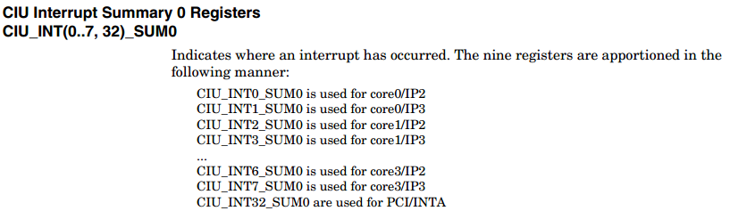

- [MIPS中断](#mips中断)
  - [中断ebase寄存器](#中断ebase寄存器)
- [octeon CIU](#octeon-ciu)
- [kernel代码](#kernel代码)
  - [generic_handle_irq_desc(irq, desc)](#generic_handle_irq_descirq-desc)
  - [中断初始化](#中断初始化)
  - [irq号](#irq号)
  - [中断注册方法](#中断注册方法)
    - [从hw irq号得到](#从hw-irq号得到)
    - [从platform_device得到](#从platform_device得到)
    - [从of_node得到](#从of_node得到)
  - [中断触发方式的判断](#中断触发方式的判断)
  - [中断处理过程](#中断处理过程)
    - [哪里调用了`handle_int()`? --直接写进中断向量表0号位置](#哪里调用了handle_int---直接写进中断向量表0号位置)
- [gpio中断](#gpio中断)
  - [问题现象](#问题现象)
  - [参考代码](#参考代码)

# MIPS中断
  
  
  
  
  
  

## 中断ebase寄存器
  
  

# octeon CIU
中央中断控制器  
下图中, A是SUM0, B是SUM1;  
SUM0共有9个地址, 每个core2个. 4(core)*2+1(pcie RC); 也有9个相应的en地址  
SUM1只有1个地址, 所有core公用. 但有9个对应的en地址, 目的是每个core都能单独使能中断.  
还有个SUM4(0..3), 每个core一个, 对应IP4.  
  
  
  
  
  
  
  

# kernel代码
octeon-irq.c
```
static __read_mostly u8 octeon_irq_ciu_to_irq[8][64];
```
kernel/irq.c

  

* CIU: 8个mips中断
```c
octeon_irq_init_core();
octeon_irq_ip2 = octeon_irq_ip2_ciu
octeon_irq_ip3 = octeon_irq_ip3_ciu;
octeon_irq_ip4 =  octeon_irq_ip4_ciu
ciu_domain = irq_domain_add_tree(ciu_node, &octeon_irq_domain_ciu_ops, dd);
irq_set_default_host(ciu_domain);
```
* GPIO:
```c
gpiod->base_hwirq = base_hwirq
irq_domain_add_linear(gpio_node, 16, &octeon_irq_domain_gpio_ops, gpiod)
```
* CIB:
```c
cib_domain = irq_domain_add_linear(of_node, host_data->max_bits,&octeon_irq_domain_cib_ops,host_data);
r = request_irq(parent_irq, octeon_irq_cib_handler, 0,"cib", cib_domain);
    request_threaded_irq(irq, handler, NULL, flags, name, dev)
```

cib中断上下文的处理函数
```c
octeon_irq_cib_handler()
    找出中断bit
    //应答相应位
    cvmx_write_csr(host_data->raw_reg, 1ull << i)
    //调用通用处理函数
    generic_handle_irq_desc(irq, desc)
```

## generic_handle_irq_desc(irq, desc)
基本上, 每个中断线都有一个handle, 在初始化时确定. 一般handle有以下几种:
* handle_level_irq(unsigned int irq, struct irq_desc *desc)
* handle_edge_irq(unsigned int irq, struct irq_desc *desc)
* handle_nested_irq(unsigned int irq, struct irq_desc *desc)
* handle_simple_irq(unsigned int irq, struct irq_desc *desc)

比如
```c
handle_simple_irq(unsigned int irq, struct irq_desc *desc)
    handle_irq_event(desc);
        handle_irq_event_percpu(desc, action)
            //先调用request_irq()注册的handler, 注意action是个链表
            //对每个链表action
            res = action->handler(irq, action->dev_id);
            根据返回值, 
            IRQ_WAKE_THREAD:则调用action->thread_fn()
                irq_wake_thread(desc, action);
            IRQ_HANDLED:不调用thread_fn()
```

## 中断初始化
```c
init_IRQ()
    for (i = 0; i < NR_IRQS; i++) //#define NR_IRQS OCTEON_IRQ_LAST
        irq_set_noprobe(i)
    arch_init_irq(ciu_types)
        of_irq_init(ciu_types);
                     while 所有的compatible
                        //调用每个compatible的init
                        irq_init_cb = (of_irq_init_cb_t)match->data
                        ret = irq_init_cb(desc->dev, desc->interrupt_parent)
                octeon_irq_init_ciu(struct device_node *ciu_node, struct device_node *parent)
```
  
  

## irq号
有硬件irq号和linux irq号之分:  
* 硬件irq号 hw: irq_hw_number_t hw
* 根据硬件irq号算出line和bit
```c
unsigned int line = hw >> 6;
unsigned int bit = hw & 63;
```
* line和bit用于算出linux irq号
```c
linux_irq = octeon_irq_ciu_to_irq[line][bit]
```
例如对lmc中断来说, line是1, bit是52, 就能查表得出linux irq号
* 每个domain都有一个map函数, 用于hw irq和虚拟irq之间转换

## 中断注册方法
知道linux irq号, 用`request_irq()`或`request_threaded_irq()`就能注册中断了.  
参考`octeon_setup_debug_uart()`

但linux irq号怎么得到?

### 从hw irq号得到
用下面这个函数来map一个hw irq, 返回一个linux irq. 必须先有一个虚拟irq才能开始用中断
```
unsigned int irq_create_mapping(struct irq_domain *domain, irq_hw_number_t hwirq)
```
这里面的关键是理解到底那个hwirq是你要注册的中断, 这要看这个domain的map函数  

得到

### 从platform_device得到
```c
irq = platform_get_irq(pdev, 0);

result = devm_request_irq(&pdev->dev, i2c->irq, octeon_i2c_isr, 0, DRV_NAME, i2c);
```

### 从of_node得到
```c
parent_irq = irq_of_parse_and_map(ciu_node, 0);
    of_irq_map_one(dev, index, &oirq)
    irq_create_of_mapping(oirq.controller, oirq.specifier,oirq.size);

r = request_irq(parent_irq, octeon_irq_cib_handler,IRQF_NO_THREAD, "cib", cib_domain);
```

## 中断触发方式的判断
```c
if (irqd_get_trigger_type(irq_data) & IRQ_TYPE_EDGE_BOTH)
//设置中断类型
irq_set_irq_type(virq, type);
```

## 中断处理过程
```c
asmlinkage void plat_irq_dispatch(void)
    //重点是这个循环
    while (1):
        读出cop0_cause和cop0_status
        //处理ip2
        octeon_irq_ip2
        //处理ip3
        octeon_irq_ip3
            读SUM1寄存器
            //找到最后一位1
            int bit = fls64(ciu_sum) - 1;
            //转换为linux irq
            int irq = octeon_irq_ciu_to_irq[1][bit]
            do_IRQ(irq)
                generic_handle_irq(irq)
                    generic_handle_irq_desc(irq, desc)
                        desc->handle_irq(irq, desc)
        //处理ip4
        octeon_irq_ip4
        do_IRQ(fls(cop0_cause) - 9 + MIPS_CPU_IRQ_BASE)
```

* 上面这个函数会被锁到cache里, 在`cavium-octeon/setup.c`里面
```c
cvmx_l2c_lock_mem_region(__pa_symbol(handle_int), len);
cvmx_l2c_lock_mem_region(__pa_symbol(plat_irq_dispatch), len2);
```

* 在`arch/mips/kernel/genex.S`中会调用这个函数  
更详细代码见`arch/mips/kernel/entry.S`和`arch/mips/kernel/process.c`  
汇编里面的`handle_int()`函数:  
```c
//这步很牛, 直接锁定返回地址是ret_from_irq
PTR_LA  ra, ret_from_irq
//这是个c函数, 所以最后返回指令肯定是 jr ra. 所以就跳到ret_from_irq()里面去了
PTR_LA  v0, plat_irq_dispatch
//直接跳过去. 这是个任意地址跳转指令
jr  v0
```

### 哪里调用了`handle_int()`? --直接写进中断向量表0号位置
```c
extern asmlinkage void handle_int(void)
@init/main.c
asmlinkage void __init start_kernel(void)
    @arch/mips/kernel/traps.c
    trap_init()
        ebase=0xffffffff80000000
        if (cpu_has_mips_r2)
            ebase += (read_c0_ebase() & 0x3ffff000)
        set_handler(0x180, &except_vec3_generic, 0x80)
        for (i = 0; i <= 31; i++)
            set_except_vector(i, handle_reserved)
        set_except_vector(23, handle_watch)
        set_handler(0x200, &except_vec4, 0x8)
        set_except_vector(0, using_rollback_handler() ? rollback_handle_int: handle_int); 
        set_except_vector(1, handle_tlbm);
        set_except_vector(2, handle_tlbl);
        set_except_vector(3, handle_tlbs); 
        set_except_vector(4, handle_adel);
        set_except_vector(5, handle_ades);
        set_except_vector(6, handle_ibe);
        set_except_vector(7, handle_dbe);
        set_except_vector(8, handle_sys);
        set_except_vector(9, handle_bp);
        set_except_vector(10, rdhwr_noopt ? handle_ri :(cpu_has_vtag_icache ?handle_ri_rdhwr_vivt : handle_ri_rdhwr));
        set_except_vector(11, handle_cpu)
        set_except_vector(12, handle_ov);
        set_except_vector(13, handle_tr); 
        board_nmi_handler_setup()
        set_except_vector(15, handle_fpe)
        set_except_vector(22, handle_mdmx)
        set_except_vector(24, handle_mcheck)
        set_except_vector(25, handle_mt)
        set_except_vector(26, handle_dsp)
        board_cache_error_setup()
        set_handler(0x080, &except_vec3_generic, 0x80)
```
以上这个表和mips异常表能对起来  
上述的`handle_int`, `handle_sys`, `handle_adel`, `handle_ades`, `handle_ibe`, `handle_dbe` ... 由下面的宏生成：
```c
[arch/mips/kernel/genex.S]
    BUILD_HANDLER adel ade ade silent       /* #4  */
    BUILD_HANDLER ades ade ade silent       /* #5  */
    BUILD_HANDLER ibe be cli silent         /* #6  */
    BUILD_HANDLER dbe be cli silent         /* #7  */
    BUILD_HANDLER bp bp sti silent          /* #9  */
    BUILD_HANDLER ri ri sti silent          /* #10 */
    BUILD_HANDLER cpu cpu sti silent        /* #11 */
    BUILD_HANDLER ov ov sti silent          /* #12 */
    BUILD_HANDLER tr tr sti silent          /* #13 */
    BUILD_HANDLER fpe fpe fpe silent        /* #15 */
    BUILD_HANDLER mdmx mdmx sti silent      /* #22 */
#ifdef  CONFIG_HARDWARE_WATCHPOINTS
    /*
     * For watch, interrupts will be enabled after the watch
     * registers are read.
     */
    BUILD_HANDLER watch watch cli silent        /* #23 */
#else
    BUILD_HANDLER watch watch sti verbose       /* #23 */
#endif
    BUILD_HANDLER mcheck mcheck cli verbose     /* #24 */
    BUILD_HANDLER mt mt sti silent          /* #25 */
    BUILD_HANDLER dsp dsp sti silent        /* #26 */
    BUILD_HANDLER reserved reserved sti verbose /* others */
```

BUILD_HANDLER 定义为：
```c
    .macro  BUILD_HANDLER exception handler clear verbose
    __BUILD_HANDLER \exception \handler \clear \verbose _int

    .endm

   .macro  __BUILD_HANDLER exception handler clear verbose ext
    .align  5
    NESTED(handle_\exception, PT_SIZE, sp)
    .set    noat
    SAVE_ALL
    FEXPORT(handle_\exception\ext)
    __BUILD_clear_\clear
    .set    at
    __BUILD_\verbose \exception
    move    a0, sp
    PTR_LA  ra, ret_from_exception
    j   do_\handler //这里就是调用traps.c里面的do_*函数, 如do_bp, do_tr, do_ri
    END(handle_\exception)
    .endm
```

# gpio中断
## 问题现象
两块板子 发包到cpu 半小时内 GPIO2 不停中断(低电平)  
CN71xx core0  
SE-S from uboot  
PHY(拔出,插入) --(直连, 外上拉电阻)--> GPIO2中断(低电平触发) --> WQE

  

## 参考代码
GPIO中断配置  
`~/repo/hg/OCTEON-SDK-3.1.0/linux/kernel/linux/arch/mips/cavium-octeon/octeon-irq.c`
```c
static void octeon_irq_gpio_setup(struct irq_data *data)
{
	union cvmx_gpio_bit_cfgx cfg;
	struct octeon_ciu_chip_data *cd;
	u32 t = irqd_get_trigger_type(data);

	cd = irq_data_get_irq_chip_data(data);

	cfg.u64 = 0;
	cfg.s.int_en = 1;
	cfg.s.int_type = (t & IRQ_TYPE_EDGE_BOTH) != 0;
	cfg.s.rx_xor = (t & (IRQ_TYPE_LEVEL_LOW | IRQ_TYPE_EDGE_FALLING)) != 0;

	/* 140 nS glitch filter*/
	cfg.s.fil_cnt = 7;
	cfg.s.fil_sel = 3;

	cvmx_write_csr(CVMX_GPIO_BIT_CFGX(cd->gpio_line), cfg.u64);
}
```
`linux/kernel/linux/Documentation/devicetree/bindings/gpio/cavium-octeon-gpio.txt`
```c
Example:

	gpio-controller@1070000000800 {
		#gpio-cells = <2>;
		compatible = "cavium,octeon-3860-gpio";
		reg = <0x10700 0x00000800 0x0 0x100>;
		gpio-controller;
		/* Interrupts are specified by two parts:
		 * 1) GPIO pin number (0..15)
		 * 2) Triggering (1 - edge rising
		 *		  2 - edge falling
		 *		  4 - level active high
		 *		  8 - level active low)
		 */
		interrupt-controller;
		#interrupt-cells = <2>;
		/* The GPIO pin connect to 16 consecutive CUI bits */
		interrupts = <0 16>, <0 17>, <0 18>, <0 19>,
			     <0 20>, <0 21>, <0 22>, <0 23>,
			     <0 24>, <0 25>, <0 26>, <0 27>,
			     <0 28>, <0 29>, <0 30>, <0 31>;
	};
```

GPIO中断应答
```c
static void octeon_irq_ciu_gpio_ack(struct irq_data *data)
{
	struct octeon_ciu_chip_data *cd;
	u64 mask;

	cd = irq_data_get_irq_chip_data(data);
	mask = 1ull << (cd->gpio_line);

	cvmx_write_csr(CVMX_GPIO_INT_CLR, mask);
}
```