Address Map and Accessing CSRs on the OCTEON CPU

Cn71xx这款处理器和我们之前用的powerpc系列处理器有不小的区别，刚开始可能不太适应，但熟悉了之后你会发现mips的处理器更简单。今天先来说一下地址空间和寄存器访问这个最基本的问题。

- [寄存器如何访问](#寄存器如何访问)
- [地址空间](#地址空间)
  - [物理地址空间](#物理地址空间)
  - [虚拟地址空间](#虚拟地址空间)
- [Linux下的内存视图](#linux下的内存视图)
  - [内核态](#内核态)
  - [用户态](#用户态)
  - [xkphys空间在用户态也可以访问](#xkphys空间在用户态也可以访问)

# 寄存器如何访问
先来看一个例子，u-boot启动代码，start.s里面如何访问寄存器：  
比如OCTEON_GPIO_TX_SET，很大，这是个64bit的寄存器地址：  
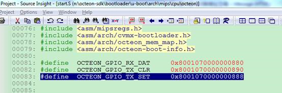  
直接赋值给a4，就可以直接访问了。  
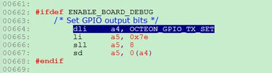  
这个地址在芯片手册里是这样定义的  
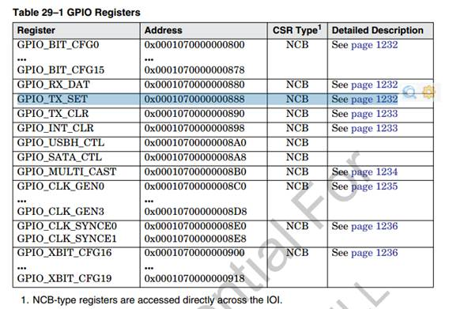  

大家可能会注意到，芯片手册GPIO_TX_SET的地址是0x0001070000000888，而代码里用的地址却是0x8001070000000888，最高位相差1.  
这个涉及到一个mips规定的“xkphys”地址空间，见下图：  
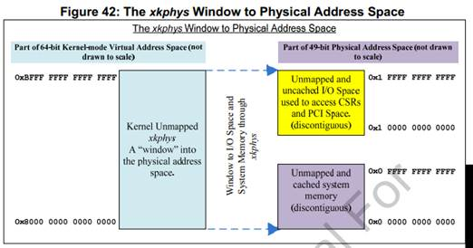  
“xkphys”是物理地址的一个“窗口”，通过这个窗口，就可以访问任何的物理地址。

**结论：从芯片手册查到的物理地址，与上0x8000000000000000，就能得到虚拟地址，cpu就可以访问这个虚拟地址。**

# 地址空间
这款CPU是个64bit的cpu，拥有巨大的64bit地址空间。
## 物理地址空间
还是以GPIO_TX_SET为例，它的物理地址是0x0001070000000888，共49bit的有效地址。与芯片手册说明一致：  
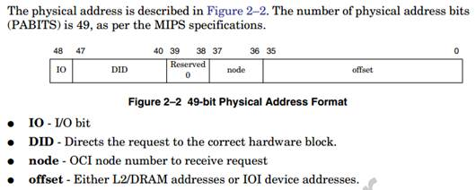  

Cavium把地址空间分为两类，IO空间和MEM空间。物理地址最高bit是1的都属于IO空间，为0则属于MEM空间。其他的像DID等位段，看看就行了，作用不大。
* MEM空间特指：DDR内存
* 剩下的都是IO空间，包括：所有寄存器，PCI的MEM/IO/CONFIG空间，bootbus空间。
* IO空间和MEM空间最大的区别是：对MEM空间（即DDR）的访问，都经过cache；而对IO空间的访问都不经过cache。


这里，有个和powerpc的重大区别：powerpc的寄存器空间基址可配，但这款cpu的所有寄存器地址都是固定地址。见下图：  
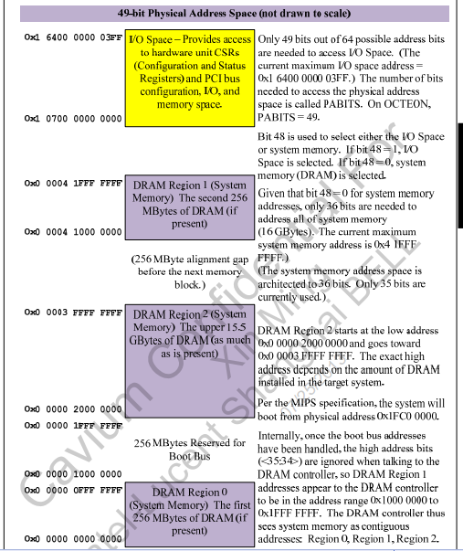  
特别的，PCI的MEM空间也是固定的  
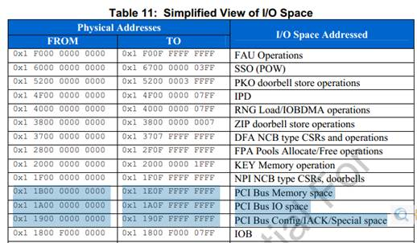  

## 虚拟地址空间
08-Ch_3_Software_Overview_r3_June_2009第10小节  
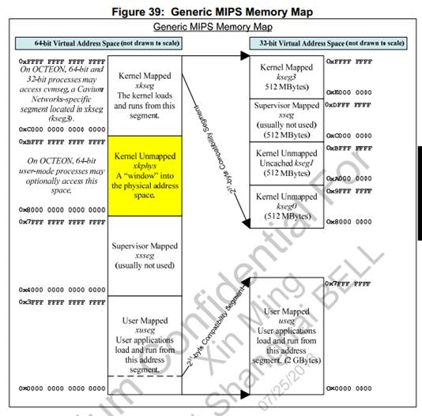  

# Linux下的内存视图
## 内核态
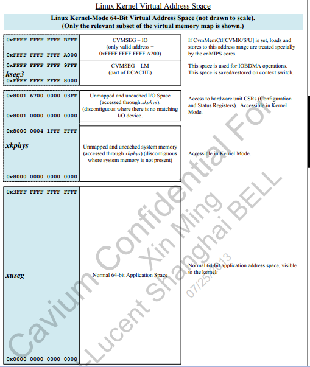  
## 用户态
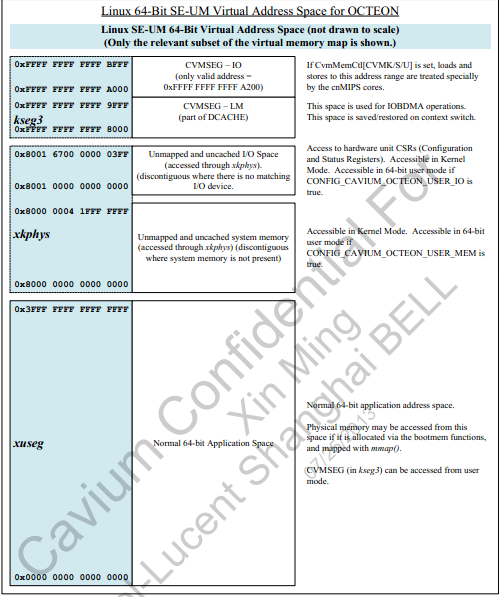  

## xkphys空间在用户态也可以访问
在内核menuconfig里面可配，默认是打开的.  
也就是说，用户态可以访问全部的物理内存和全部的SOC寄存器。  
这是个很强大的功能，用户态网口收包，不经过kernel就靠的是它。
```
cd Cavium_Networks/OCTEON-SDK/linux/kernel_2.6/linux
make menuconfig
```
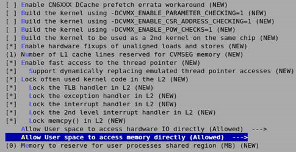  
