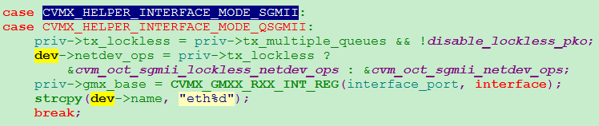

- [link状态分两端](#link状态分两端)
- [关于phy](#关于phy)
- [代码中检测link状态](#代码中检测link状态)
- [相关命令](#相关命令)
- [设备注册及初始化](#设备注册及初始化)
- [周期worker](#周期worker)
- [sgmii初始化](#sgmii初始化)
- [当执行ifconfig eth0 up时](#当执行ifconfig-eth0-up时)
- [在加载模块时, 会进行硬件初始化](#在加载模块时-会进行硬件初始化)

# link状态分两端
```
+-------------+                   |   +--------+
|     CPU     | link1 +-------+ link2 |  other |
|        SGMII|<=====>|  PHY  |<==|==>| system |
|        (MAC)|       +-------+   |   +--------+
+-------------+                   |
```
当配置为SGMII模式时，它就是一个MAC；对应的，配置为1000base-x时，它是PHY；  
对外面连的真正的PHY来说，有两个link状态：
* link1是指和MAC（PCS）层的link；
* link2是指和外部系统的link；好像这两个link都可以自协商

# 关于phy
在open的时候connect phy， 在stop的时候disconnect phy

# 代码中检测link状态
```c
cvmx-helper.c：
cvmx_helper_link_info_t cvmx_helper_link_get(int ipd_port) 
```
这个函数调用具体interface的link函数.  
【注】这个函数用于没有phy的情况下

在`ethernet-sgmii.c`里面
```c
cvm_oct_sgmii_open时
    if (priv->phydev) 有phy时
        int r = phy_read_status(priv->phydev);
        cvm_oct_adjust_link(dev);
            根据priv->phydev->link来改变link状态
    else 没有phy时
        link_info = cvmx_helper_link_get(priv->ipd_port);
    priv->poll = cvm_oct_sgmii_poll; 起个pull来轮询
```

# 相关命令
```
modprobe octeon-ethernet.ko
ifconfig eth0 192.168.0.8
ifconfig eth1 192.168.1.9
ifconfig eth0 up
ifconfig eth1 up
```
  

# 设备注册及初始化
```c
modprobe octeon-ethernet.ko
    module_platform_driver(cvm_oct_driver); //相当于传统的module_init()和 module_exit(hello_exit)
```
  
```c
        module_driver(cvm_oct_driver, platform_driver_register, platform_driver_unregister)
            platform_driver_register(struct platform_driver *drv=&cvm_oct_driver)
                drv->driver.bus = &platform_bus_type;
                //匹配设备时调用
                drv->driver.probe = platform_drv_probe;
                //设备移除时调用
                drv->driver.remove = platform_drv_remove;
                //关机时调用
                drv->driver.shutdown = platform_drv_shutdown;
                driver_register(&drv->driver);
                    //在fdt中找到匹配的设备后, 调用驱动提供的probe函数
                    cvm_oct_probe(struct platform_device *pdev)
                        //强制MDIO依赖
                        octeon_mdiobus_force_mod_depencency();
                        //fdt中的pip节
                        pip = pdev->dev.of_node;
                        cvm_oct_get_port_status(pip);
                            //70xx有5个interface, 每个interface又有n个port
```
  
  
```c
                            //全局变量iface_ops
                            iface_ops[0] = &iface_ops_sgmii;
                            iface_ops[1] = &iface_ops_sgmii;
```
  
```c
                            iface_ops[2] = &iface_ops_npi;
                            iface_ops[3] = &iface_ops_loop;
                            iface_ops[4] = &iface_ops_agl;
                            //对每个interface和port遍历
                            case CVMX_HELPER_INTERFACE_MODE_SGMII:
                            case CVMX_HELPER_INTERFACE_MODE_QSGMII:
                                //根据dts里面的关键字设置mac_phy_mode和1000x_mode
                                //只有SGMII和QSGMII有这两个选项
                                "cavium,sgmii-mac-phy-mode"
                                "cavium,sgmii-mac-1000x-mode"
                        //内核工作队列, 用于POLL
                        cvm_oct_poll_queue = create_singlethread_workqueue("octeon-ethernet");
                        cvm_oct_configure_common_hw();
                            //使能FPA
                            cvmx_fpa_enable();
                            //用FPA分配packet pool, 每个元素16个cache line; 一共8个pool
                            packet_pool = cvm_oct_alloc_fpa_pool(packet_pool, 16个cache line);
                            //1024个packet buffer, 默认值, 加载模块时可改num_packet_buffers
                            cvm_oct_mem_fill_fpa(packet_pool, num_packet_buffers);
                            //用FPA分配wqe pool
                            wqe_pool = cvm_oct_alloc_fpa_pool(-1, 一个cache line);
                            //用FPA分配output buffers pool
                            output_pool = cvm_oct_alloc_fpa_pool(-1, 8个cache line);
                            //初始化PIP, IPD, PKO. 硬件层初始化
                            cvmx_helper_initialize_packet_io_global();
                                cvmx_helper_interface_probe(int interface)
                                    __cvmx_helper_init_interface(...)
                                cvmx_helper_ipd_and_packet_input_enable();
                                //对每个端口
                                __cvmx_helper_packet_hardware_enable(interface);
                                    //详见下面第6条
                                    iface_ops[interface]->enable(interface)
                        //对每个interface和每个port
                            //转换为IPD port, 将所有口加入到pow_receive_group, 默认15. 可选0-15
                            port = cvmx_helper_get_ipd_port(interface, index);
                        //使能IPD/PIP
                        cvmx_helper_ipd_and_packet_input_enable();
                        //对每个可用的口, 填写dev的各种信息, 注册dev, sgmii注册的是"eth0 eth1"
                            struct octeon_ethernet *priv;
                            struct net_device *dev;
                            dev = alloc_etherdev(sizeof(struct octeon_ethernet));
                            priv = netdev_priv(dev);
                            //填充priv结构
```
  
  
  
```
                            AGL口也使用SGMII的op
```
  
```c
                            register_netdev(dev)
                            //将priv加入到全局链表cvm_oct_list
                            list_add_tail(&priv->list, &cvm_oct_list);
                            cvm_oct_add_ipd_port(priv);
                            queue_delayed_work(cvm_oct_poll_queue,
						   &priv->port_periodic_work, 5*HZ);
                    cvm_oct_rx_initialize()
                    queue_delayed_work(cvm_oct_poll_queue, &cvm_oct_rx_refill_work, HZ);
                         //也是个周期work, 1秒一次
                        void cvm_oct_rx_refill_worker(struct work_struct *work)
                            cvm_oct_rx_refill_pool(num_packet_buffers / 2);
                            queue_delayed_work(cvm_oct_poll_queue,
				   &cvm_oct_rx_refill_work, HZ);
                ...
            ...
        ...
    ...
```

# 周期worker
在probe函数里, 挂了一个周期worker, `INIT_DELAYED_WORK(&priv->port_periodic_work, cvm_oct_periodic_worker);`, 5秒一次
```c
void cvm_oct_periodic_worker(struct work_struct *work)
    priv = container_of();
    //这里的 priv->poll就是在接口open时注册的poll函数, 对SGMII来说, 就是cvm_oct_sgmii_poll
    poll_fn = priv->poll;
    poll_fn(priv->netdev);
    //这里调用的是 struct net_device_stats *cvm_oct_common_get_stats(struct net_device *dev)
    priv->netdev->netdev_ops->ndo_get_stats(priv->netdev);
    queue_delayed_work(cvm_oct_poll_queue, &priv->port_periodic_work, 5*HZ);
```

# sgmii初始化
```c
cvm_oct_sgmii_init(struct net_device *dev)
    struct octeon_ethernet *priv = netdev_priv(dev);
    cvm_oct_common_init(dev);
        从dts获取mac地址
        如果没有mac地址, 则用random地址
        SET_ETHTOOL_OPS(dev, &cvm_oct_ethtool_ops);
```
  
```c
    dev->netdev_ops->ndo_stop(dev);
    //phy层检测到link change, 就调用这个函数
    priv->link_change = cvm_oct_sgmii_link_change;
```

# 当执行ifconfig eth0 up时
```c
int cvm_oct_sgmii_open(struct net_device *dev)
    cvm_oct_phy_setup_device(dev);
        //从dts里面找phy-handle
        phy_node = of_parse_phandle(priv->of_node, "phy-handle", 0)
        //SGMII不走下面, rgmii走下面, cvm_oct_adjust_link是个回调函数
        priv->phydev = of_phy_connect(dev, phy_node, cvm_oct_adjust_link, 0, iface)
        phy_start_aneg(priv->phydev);
    //有phy走if分支
    if (priv->phydev)
        r = phy_read_status(priv->phydev)
        cvm_oct_adjust_link(dev);
    //没有phy走else分支
    else
        link_info = cvmx_helper_link_get(priv->ipd_port)
            //这个函数获取速率时有点问题, 需要定位
            __cvmx_helper_sgmii_link_get()
                根据板类型直接返回up(FPXTB)
        priv->poll = cvm_oct_sgmii_poll;
        //其实这个函数是周期性调的.
        cvm_oct_sgmii_poll(dev);
            link_info = cvmx_helper_link_get(priv->ipd_port)
            //和以前比, 一样就直接返回了. 第一次不一样, 往下走
            cvmx_helper_link_autoconf(priv->ipd_port)
                link_info = cvmx_helper_link_get(ipd_port);
                //更内部的link状态记录在cvmx_interfaces[interface].cvif_ipd_port_link_info
                //如果上面获取的link_info和内部的cvif_ipd_port_link_info一样, 就直接返回.
```
  
```c
                //第一次肯定不一样, 往下走
                cvmx_helper_link_set(ipd_port, link_info);
                     __cvmx_helper_sgmii_link_set()
                        //要禁止自协商, 在这里改. PCS层reset+配置
                        __cvmx_helper_sgmii_hardware_init_link(interface, index);
                        //主要是根据link_info配置GMX层寄存器, 速度, 全双工.
                        __cvmx_helper_sgmii_hardware_init_link_speed(interface, index, link_info)
```

# 在加载模块时, 会进行硬件初始化
```c
__cvmx_helper_sgmii_enable(int interface)
    __cvmx_helper_sgmii_hardware_init(interface, num_ports);
        __cvmx_helper_setup_gmx(interface, num_ports);
        __cvmx_helper_sgmii_hardware_init_one_time(interface, index);
        //初始化link状态
        __cvmx_helper_sgmii_link_set(ipd_port, __cvmx_helper_sgmii_link_get(ipd_port))
```
