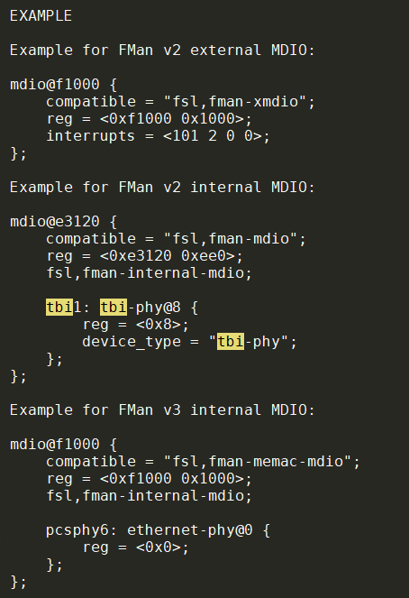

- [新kernel启动没打印](#新kernel启动没打印)
  - [现象](#现象)
    - [老kernel启动](#老kernel启动)
    - [新kernel启动](#新kernel启动)
  - [复现](#复现)
  - [跳转到kernel后, 新kernel会一直machine check](#跳转到kernel后-新kernel会一直machine-check)
    - [调查tlb](#调查tlb)
      - [老kernel正常的tlb](#老kernel正常的tlb)
    - [新kernel的tlb不正常](#新kernel的tlb不正常)
  - [问题, uboot怎么"跳转"到linux的?](#问题-uboot怎么跳转到linux的)
  - [用仿真器查看uboot的寄存器配置](#用仿真器查看uboot的寄存器配置)
  - [看代码](#看代码)
  - [仿真器打uboot断点](#仿真器打uboot断点)
  - [总结: 这里实际上有两个问题](#总结-这里实际上有两个问题)
  - [那么switch_to_as1到底有什么作用](#那么switch_to_as1到底有什么作用)
  - [为什么memstart_addr为0](#为什么memstart_addr为0)
  - [最终修改](#最终修改)
- [驱动问题](#驱动问题)
  - [内核不再有IRQF_DISABLED](#内核不再有irqf_disabled)
    - [修改](#修改)
  - [内核不再提供memory_accessor](#内核不再提供memory_accessor)
    - [修改](#修改-1)
  - [gpio的gpiochip_remove()函数不再返回int](#gpio的gpiochip_remove函数不再返回int)
    - [修改](#修改-2)
  - [gpio没有member dev](#gpio没有member-dev)
    - [修改](#修改-3)
  - [__noreturn编译标记](#__noreturn编译标记)
    - [真的要noreturn吗?](#真的要noreturn吗)
    - [option1: 修改我们自己的driver](#option1-修改我们自己的driver)
    - [或者](#或者)
    - [option2: 修改kernel, 去掉noreturn要求](#option2-修改kernel-去掉noreturn要求)
- [kernel代码路径](#kernel代码路径)
  - [kernel路径](#kernel路径)
  - [uboot](#uboot)
- [DTS](#dts)
  - [参考: dts说明](#参考-dts说明)
  - [编译dts](#编译dts)
  - [FMan: Frame Manager](#fman-frame-manager)
  - [kernel4.9和kernel3.12的部分DTS不同点](#kernel49和kernel312的部分dts不同点)

# 新kernel启动没打印
## 现象
### 老kernel启动
```
do_linux_exec:current_time = 56650 ms
## Booting kernel from Legacy Image at 7a0002a4 ...
   Image Name: Linux-3.12.37-rt51
   Image Type: PowerPC Linux Kernel Image (gzip compressed)
   Data Size: 3620039 Bytes = 3.5 MiB
   Load Address: 00000000
   Entry Point: 00000000
   Verifying Checksum ... OK
## Flattened Device Tree blob at 11000000
   Booting using the fdt blob at 0x11000000
   Uncompressing Kernel Image ... OK
   reserving fdt memory region: addr=c10000 size=9d61c8
   reserving fdt memory region: addr=20000000 size=60000000
   Loading Device Tree to 03fdc000, end 03fff6e6 ... OK
WARNING: Missing crypto node
memory reserve level 1
set memory reserve region 0, base 0x20000000, size 0x60000000 ok
WARNING: could not find compatible node: FDT_ERR_NOTFOUND##
2 bytes read in 0 ms
load_image_from_cf_card: load image /images/cf_low_2g_reclaim to 1fddcb08 done, size 2
reclaim flag in file:1, in uboot env:31
[ 0.000000] memblock_reserve: [0x00000000000000-0x00000000790000] early_init_devtree+0x104/0x338
[ 0.000000] memblock_reserve: [0x00000003fdc000-0x00000003feb000] early_init_devtree+0x128/0x338
[ 0.000000] memblock_reserve: [0x00000000c10000-0x000000015e7000] early_init_devtree+0x18c/0x338
```

### 新kernel启动
没有一行kernel打印, 前面的打印到`reclaim flag in file:1, in uboot env:31`, 都有

## 复现
启动kernel, uboot会把CF卡里的linux.itb加载到内存里, 并从中解析出uImage, dtb和rootfs
和下面的命令效果一样:
```
ext2load _cf 0:0 0x7a000000 /images/49/uImage
ext2load _cf 0:0 0x11000000 /images/49/fant-3041.dtb

ext2load _cf 0:0 0x7a000000 /images/312/uImage
ext2load _cf 0:0 0x11000000 /images/312/fant-3041.dtb

ext2load _cf 0:0 0xc10000 /images/linuxA/rootfs.cpio.xz

bootm 0x7a000000 - 0x11000000
```

## 跳转到kernel后, 新kernel会一直machine check
用仿真器查看, 新kernel一直陷在0xc0000540, 不论单步运行, 还是run free, 每次停住CPU都在0xc0000540  
这是个machine check异常.
```
ppcP3041[0,c] % th
Core 0 halted; pc=0xc0000540
```
此时看vmlinux的链接起始地址代码: 0xc0000000, 和vmlinux的objdump比较, 完全对不上  
很可能是tlb不对, 导致虚拟地址0xc0000000映射到的物理地址没有代码. 我们要查一下tlb

### 调查tlb
#### 老kernel正常的tlb
正常的tlb中, 0xc0000000被映射到物理地址0x1:00000000, 这个是ddr的地址, 从4G开始, 原因见下.
```
ppcP3041[0,h] % tlbr *
idx w vaddr GsLpidVTsSizeTidWIMGEUrUwUxSrSwSx paddr VfX0X1U0U1U2U3Iprot
  0 0 0xc0000000 -- 0V-- 9 0--M--------SrSwSx -> 0x1:00000000 --------------Iprot
  1 0 0xd0000000 -- 0V-- 9 0--M--------SrSwSx -> 0x1:10000000 --------------Iprot
  2 0 0xe0000000 -- 0V-- 9 0--M--------SrSwSx -> 0x1:20000000 --------------Iprot
```

### 新kernel的tlb不正常
这里出现了3个0xc0000000的映射
```
ppcP3041[0,c] % th
Core 0 halted; pc=0xc0000540
ppcP3041[0,h] % tlbr *
idx w vaddr GsLpidVTsSizeTidWIMGEUrUwUxSrSwSx paddr VfX0X1U0U1U2U3Iprot
  0 0 0xc0000000 -- 0V-- 9 0--M--------SrSwSx -> 0x0:00000000 --------------Iprot
  3 0 0xc0000000 -- 0VTs 8 0--M--------SrSwSx -> 0x1:00000000 --------------Iprot
 63 0 0xc0000000 -- 0VTs 8 0--M--------SrSwSx -> 0x1:00000000 --------------Iprot
```

## 问题, uboot怎么"跳转"到linux的?
在uboot解析uImage的时候, 它知道:
* Load Address: 00000000
* Entry Point: 00000000

注意这个Entry Point就是uboot要跳转到kernel的地址
这个地址被uboot转换为函数指针, 跳过去.
```c
      kernel = (void (*)(bd_t *, ulong, ulong, ulong, ulong, ulong, ulong))images->ep;
      (*kernel) ((bd_t *)of_flat_tree, 0, 0, EPAPR_MAGIC, getenv_bootm_mapsize(), 0, 0);
```
整个uboot启动kernel的过程打印, 和bootm的简要调用如下:
```c
## Booting kernel from Legacy Image at 7a0002a4 ...
   Image Name: Linux-3.12.37-rt51
   Image Type: PowerPC Linux Kernel Image (gzip compressed)
   Data Size: 3620039 Bytes = 3.5 MiB
   Load Address: 00000000
   Entry Point: 00000000
   Verifying Checksum ... OK
## Flattened Device Tree blob at 11000000
   Booting using the fdt blob at 0x11000000
   Uncompressing Kernel Image ... OK
   reserving fdt memory region: addr=c10000 size=9d61c8
   reserving fdt memory region: addr=20000000 size=60000000
   Loading Device Tree to 03fdc000, end 03fff6e6 ... OK
   
   
board/_common/uboot_wrappers.c
do_linux_exec
    //准备linux.itb, 包括uImage, fdt, rootfs
    prepare_images(addr, &kernel_addr, &kernel_size, &dtb_addr, &dtb_size, &rootfs_addr, &rootfs_size);
    //执行fdt命令
    fdt addr 0x...
     mchosen 0xc10000 0x9d61c8;
    fdt boa
        board/freescale/board.c
        ft_board_setup()
            base = getenv_bootm_low();
            size = board_get_bootm_size();
            fdt_fixup_memory(blob, (u64) base, (u64) size);
            board_reserve_memory(blob);
            
    //执行bootm命令
    bootm 0x7a0002a4 - 0x11000000
    do_bootm
        do_bootm_states
            bootm_start(cmdtp, flag, argc, argv)
            bootm_find_os(cmdtp, flag, argc, argv)
                /* 打印## Booting kernel from Legacy Image at */
                boot_get_kernel
            /* 打印## Flattened Device Tree blob at */
            bootm_find_other(cmdtp, flag, argc, argv)
            /* Load the OS */
            bootm_disable_interrupts()
            bootm_load_os(images, &load_end, 0)
            lmb_reserve(&images->lmb, images->os.load,(load_end - images->os.load));
            /* Relocate the ramdisk */
            boot_ramdisk_high()
            /* relocate flat device tree */
            boot_fdt_add_mem_rsv_regions()
            boot_relocate_fdt()
            /* boot linux */
            boot_selected_os()
                do_bootm_linux
                    boot_prep_linux
                    boot_body_linux
                    boot_jump_linux
                        void    (*kernel)(bd_t *, ulong r4, ulong r5, ulong r6, ulong r7, ulong r8, ulong r9);
                        kernel = (void (*)(bd_t *, ulong, ulong, ulong, ulong, ulong, ulong))images->ep;
                        (*kernel) ((bd_t *)of_flat_tree, 0, 0, EPAPR_MAGIC, getenv_bootm_mapsize(), 0, 0);
```

总结:
* 对kernel来说, 第一条命令在0xc0000000
* 对uboot来说, kernel被load后, 第一条命令在0x00000000
* uboot跳转到0地址, 后面的所有都是kernel负责, 包括配kernel自己的tlb.

## 用仿真器查看uboot的寄存器配置
UBOOT tlb:  
uboot把虚拟0地址映射到物理地址0x1:00000000.
```
  1 0 0x00000000 -- 0V-- a 0-----UrUwUxSrSwSx -> 0x1:00000000 --------------Iprot
  2 0 0x40000000 -- 0V-- a 0-----UrUwUxSrSwSx -> 0x1:40000000 --------------Iprot
 37 0 0xfe000000 -- 0V-- 7 0-I-G-------SrSw-- -> 0xf:fe000000 --------------Iprot
```
上面说了, 0x1:00000000是ddr的地址, 是哪里配的?  
这个要看LAW寄存器, 在PPC中, LAW寄存器组共32个, 管SOC中, 各个模块的物理地址布局的.  
注意, 我用的是布局, 指的是各个模块, 在36位物理地址中的位置. 和虚拟地址无关.  
所以LAW寄存器, 是给模块用来灵活的配置物理地址布局的  
每个SOC模块都有个全局的ID, 用来在SOC内部寻址, 比如一个transaction, 它的源可能是PCIe, 目的是DDR.  
在MIPS的Octeon系列上, 不用LAW寄存器组, 而是直接固定每个模块的地址, 因为它有64位地址空间可以用.  
  
对DDR来说, 它的ID是0x10和0x11, 它不可能是一个memory transaction的源, 只可能是目的.  
LAW寄存器: ddr使用fe00_0c70和fe00_0c80, 被map到36位物理地址0x1:00000000, 两段各2G, 一共4G.  
具体LAW寄存器要看芯片手册第二章, memory map  
这就对上了.  
```
ppcP3041[0,h] % md 0xfe000c00 256
0xfe000c00:
fe00_0c00 0000000f ff800000 81f00016 00000000 ................
fe00_0c10 0000000f f4000000 81800014 00000000 ................
fe00_0c20 0000000f f4200000 83c00014 00000000 ..... ..........
fe00_0c30 0000000f ff000000 81f0000e 00000000 ................
fe00_0c40 0000000f ff200000 81f00013 00000000 ..... ..........
fe00_0c50 0000000f 00000000 81d00018 00000000 ................
fe00_0c60 0000000f 80000000 8000001c 00000000 ................

fe00_0c70 00000001 00000000 8100001e 00000000 ................
fe00_0c80 00000001 80000000 8100001e 00000000 ................

fe00_0c90 0000000f ff300000 8000000f 00000000 .....0..........
```

## 看代码
现在比较清楚了, 老kernel的tlb配的是对的. 而新kernel的tlb配的很乱. 
0号tlb似乎是默认的, 新kernel认为0xc000000应该对应物理0地址.
```
idx w vaddr GsLpidVTsSizeTidWIMGEUrUwUxSrSwSx paddr VfX0X1U0U1U2U3Iprot
  0 0 0xc0000000 -- 0V-- 9 0--M--------SrSwSx -> 0x0:00000000 --------------Iprot
  3 0 0xc0000000 -- 0VTs 8 0--M--------SrSwSx -> 0x1:00000000 --------------Iprot
 63 0 0xc0000000 -- 0VTs 8 0--M--------SrSwSx -> 0x1:00000000 --------------Iprot
```
在`arch/powerpc/kernel/Makefile`中, 最后用的是head_fsl_booke.o
```
 87 extra-y := head_$(BITS).o
 88 extra-$(CONFIG_40x) := head_40x.o
 89 extra-$(CONFIG_44x) := head_44x.o
 90 extra-$(CONFIG_FSL_BOOKE) := head_fsl_booke.o
 91 extra-$(CONFIG_8xx) := head_8xx.o
 92 extra-y += vmlinux.lds
```

## 仿真器打uboot断点
断点就打在0地址, 必须硬件断点才行.  
`0x1:00000000`: kernel的物理地址  
`0x0:00000000`: uboot下生效的虚拟地址, map到kernel的物理地址  
`0x0:c0000000`: kernel的编译虚拟地址. kernel会自己配tlb, 把物理地址map到0xc0000000
```
# 带x的是硬断点.
bs x 0x00000000

# 能停住
ppcP3041[0,R] % tc
Core 0 running
Core 0 hardware breakpoint hit; pc=0x00000000
ppcP3041[0,B] % md 0x00000000
0x00000000:
0000_0000 60000000 48001b81 7c7e1b78 7c9f2378 `...H...|~.x|.#x
0000_0010 3b200000 3b000000 3ae00000 48000005 ; ..;...:...H...
0000_0020 7cc802a6 7ce000a6 54e4dffe 7cf00aa6 |...|...T...|...
0000_0030 54e7801e 7ce72378 7cf69ba6 7c003724 T...|.#x|...|.7$

#此时的tlb还是uboot配的.
```
OK, 现在开始单步调试kernel.
```shell
#断点设在uboot的虚拟地址0, 这是kernel的第一条指令
bs x 0x00000000
#让target继续运行
tc
#uboot里面load kernel
ext2load _cf 0:0 0x7a000000 /images/49/uImage
ext2load _cf 0:0 0x11000000 /images/49/fant-3041.dtb
bootm 0x7a000000 - 0x11000000
#boom最后会跳转到kenel的第一条指令, 触发断点
#Core 0 hardware breakpoint hit; pc=0x00000000
#首先要get_phys_addr

```
对应的head_fsl_booke.S
```c
c0000000 <_start>:
_ENTRY(_start);
//第一命令是nop, 占位的
c0000000:       60 00 00 00     nop
//get_phys_addr是新kernel新增的.
/* Translate device tree address to physical, save in r30/r31 */
//就像注释里说的, r3是device tree的地址, 在tlb中搜索r3, 返回物理地址
c0000004:       48 00 1b 81     bl      c0001b84 <get_phys_addr>
mr  r30,r3
mr  r31,r4
//默认0地址
li  r25,0           /* phys kernel start (low) */
li  r24,0           /* CPU number */
li  r23,0           /* phys kernel start (high) */

//到这里不管boot怎么使用tlb, kernel都会做invalidate操作. 但有个例外, 我们当前正在运行的tlb是uboot配的, 虽然虚拟地址不一定是0xc0000000, 但这条tlb必须有IPROT=1标记, 这样不会被invalidate掉.
//kernel会配置64M的kernel空间到TLB1[0]

//实际配tlb是这个文件. #include "fsl_booke_entry_mapping.S"
//这个文件没问题, 到这里就只有kernel的tlb 0xc0000000生效
0 0 0xc0000000 --   0V--   8  0--M--------SrSwSx -> 0x1:00000000 --------------Iprot

//继续往下走是建立中断表, 使用特殊指令mtivor0 .. mtivor15
set_ivor:
SET_IVOR(0,  CriticalInput);
SET_IVOR(1,  MachineCheck);
SET_IVOR(2,  DataStorage);
SET_IVOR(3,  InstructionStorage);
SET_IVOR(4,  ExternalInput);
SET_IVOR(5,  Alignment);
SET_IVOR(6,  Program);
SET_IVOR(7,  FloatingPointUnavailable);
SET_IVOR(8,  SystemCall);
SET_IVOR(9,  AuxillaryProcessorUnavailable);
SET_IVOR(10, Decrementer);
SET_IVOR(11, FixedIntervalTimer);
SET_IVOR(12, WatchdogTimer);
SET_IVOR(13, DataTLBError);
SET_IVOR(14, InstructionTLBError);
SET_IVOR(15, DebugCrit);
//设中断基址寄存器.
/* Check to see if we're the second processor, and jump to the secondary_start code if so */
//如果是从核, 跳转到secondary_start

//主核往下走
//建立第一个线程的ptr到init_task, 从此current到当前线程的指针可以使用
//建立栈
//跳转到early_init, 第一个C函数
c00003c4:       48 64 58 c9     bl      c0645c8c <early_init>
...
c00003d0:       48 64 59 15     bl      c0645ce4 <machine_init>
...
//这之前都没问题

//这个函数有问题, 在里面异常了.
c00003d4:       48 64 76 6d     bl      c0647a40 <MMU_init>
```

----

head_fsl_booke.S中的查找物理地址的函数: 通过tlbsx命令, 知道虚拟地址, 可以找到物理地址.
```c
//Translate the effec addr in r3 to phys addr. The phys addr will be put
//into r3(higher 32bit) and r4(lower 32bit)
get_phys_addr:
//把msr赋值到r8, msr是Machine State Register (MSR)
c0001b84:       7d 00 00 a6     mfmsr   r8
//mfspr   r9,SPRN_PID, spr是一些列的special的寄存器, 很多, 后面用枚举来指定具体spr
//pid是processor ID
c0001b88:       7d 30 0a a6     mfpid   r9
//有时候反汇编和实际的汇编不是完全对应的, 比如下面:
//MAS6是spr里面的 MMU assist register 6, MAS从0到8, 有9个.
//rlwinm  r9,r9,16,0x3fff0000 /* turn PID into MAS6[SPID] */
c0001b8c:       55 29 80 9e     rlwinm  r9,r9,16,2,15
//rlwimi  r9,r8,28,0x00000001 /* turn MSR[DS] into MAS6[SAS] */
c0001b90:       51 09 e7 fe     rlwimi  r9,r8,28,31,31
//mtspr   SPRN_MAS6,r9
c0001b94:       7d 36 9b a6     mtspr   630,r9
//tlbsx   0,r3            /* must succeed */
//在tlb中寻找EA地址r3对应的物理地址
c0001b98:       7c 00 1f 24     tlbsx   0,r3

mfspr   r8,SPRN_MAS1
mfspr   r12,SPRN_MAS3
rlwinm  r9,r8,25,0x1f       /* r9 = log2(page size) */
li  r10,1024
slw r10,r10,r9      /* r10 = page size */
addi    r10,r10,-1
and r11,r3,r10      /* r11 = page offset */
andc    r4,r12,r10      /* r4 = page base */
or  r4,r4,r11       /* r4 = devtree phys addr */
//无条件返回
blr
```

----
fsl_booke_entry_mapping.S
```c
/* 1. Find the index of the entry we're executing in */
//LR寄存器实际上是SPR寄存器组中的一个, 保存了return addr(bl命令的下一条命令的地址)
bl  invstr              /* Find our address */
invstr: mflr    r6              /* Make it accessible */
//上面一句执行完毕后: gpr6=0x00000020, r6是LR, LR是现在这个指令的虚拟地址

/* 2. Invalidate all entries except the entry we're executing in */
...

/* 3. Setup a temp mapping and jump to it */
//到这里, tlbr * 命令显示, 只有一个有效的tlb了. 就是uboot配的那条
1 0 0x00000000 --   0V--   a  0-----UrUwUxSrSwSx -> 0x1:00000000 --------------Iprot

/* 4. Clear out PIDs & Search info */
...
/* 5. Invalidate mapping we started in */
//到这里都是OK的.此时tlb为:
ppcP3041[0,s] % tlbr *
idx w vaddr      GsLpidVTsSizeTidWIMGEUrUwUxSrSwSx    paddr        VfX0X1U0U1U2U3Iprot
  0 0 0x00000000 --   0---   0  0----------------- -> 0x0:00000000 -------------------
  1 0 0x00000000 --   0V--   a  0-----UrUwUxSrSwSx -> 0x1:00000000 -------------------
  2 0 0x00000000 --   0VTs   1  0-----------SrSwSx -> 0x1:00000000 --------------Iprot
/* 6. Setup KERNELBASE mapping in TLB1[0] */
c0000230:       7c 00 07 a4     tlbwe
//到这里还是对的. kernel新增加了0xc0000000的映射. 但原来的uboot的tlb还在
Core 0 single-stepped; pc=0x00000234
ppcP3041[0,s] % tlbr *
idx w vaddr      GsLpidVTsSizeTidWIMGEUrUwUxSrSwSx    paddr        VfX0X1U0U1U2U3Iprot
  0 0 0xc0000000 --   0V--   8  0--M--------SrSwSx -> 0x1:00000000 --------------Iprot
  1 0 0x00000000 --   0---   a  0-----UrUwUxSrSwSx -> 0x1:00000000 -------------------
  2 0 0x00000000 --   0VTs   1  0-----------SrSwSx -> 0x1:00000000 --------------Iprot
  
/* 7. Jump to KERNELBASE mapping */
...
/* 8. Clear out the temp mapping */
c0000284:       7c 00 07 a4     tlbwe
c0000288:       39 20 00 0c     li      r9,12
c000028c:       7c 00 4e 24     tlbivax 0,r9
c0000290:       7c 00 04 6c     tlbsync
c0000294:       7c 00 04 ac     msync
//到这里, uboot配的tlb被清理了. 只有kernel的tlb. 
Core 0 single-stepped; pc=0xc0000288
ppcP3041[0,s] % tlbr *
idx w vaddr      GsLpidVTsSizeTidWIMGEUrUwUxSrSwSx    paddr        VfX0X1U0U1U2U3Iprot
  0 0 0xc0000000 --   0V--   8  0--M--------SrSwSx -> 0x1:00000000 --------------Iprot

//这个文件结束, 没毛病.
```

----
MMU_init有问题!
```c
c00003d4:       48 64 76 6d     bl      c0647a40 <MMU_init>
    //这里有问题
    c0647af8:       48 00 03 e5     bl      c0647edc <adjust_total_lowmem>
    //readelf vmlinux -a | grep -E "total_lowmem|__max_low_memory"
    //__max_low_memory = c06a_8d20   30000000 00000000
    //total_lowmem=c06b_8110   00000001 00000000
    //所以这里ram=768M
    ram = min((phys_addr_t)__max_low_memory, (phys_addr_t)total_lowmem);
    
    //后记: 这里有问题, 本意是从as0空间切换到as1空间. 
    //是git show 78a235efdc42ff363de81fdbc171385e8b86b69b 修改的: 大意是用tlb1来map第一个tlb的时候, 默认是map 64M 给kernel使用. 但有时候64M不够, 所以他要切换到AS1. 
    //注释掉就好了.
    i = switch_to_as1();
    
    unsigned long virt = PAGE_OFFSET;
    //readelf vmlinux -a | grep memstart_addr
    //这里的memstart_addr似乎应该是实际物理地址才好, 但这里全是0
    //memstart_addr = c06a_8d28   00000000 00000000
    phys_addr_t phys = memstart_addr;
    
    /*
     * Create a tlb entry with the same effective and physical address as
     * the tlb entry used by the current running code. But set the TS to 1.
     * Then switch to the address space 1. It will return with the r3 set to
     * the ESEL of the new created tlb.
     */
    c0647f1c:       4b 9b 9e 01     bl      c0001d1c <switch_to_as1>
    //过了, 但多了一个tlb entry(序号63), 和entry0一样, 但多了Ts标记;
    ...
    //这里有问题
    c0647f30:       4b 9c bc 19     bl      c0013b48 <map_mem_in_cams>
        ...
        
        struct tlbcamrange {
            unsigned long start;
            unsigned long limit;
            phys_addr_t phys;
        } tlbcam_addrs[NUM_TLBCAMS];
        
        强制phys = 0x100000000;
        
        //在for以后
        //readelf vmlinux -a | grep tlbcam_addrs
        ppcP3041[0,s] % md 0xc06bacc8
        0xc06bacc8:
        c06b_acc8   c0000000 cfffffff 00000001 00000000              ................
        c06b_acd8   d0000000 dfffffff 00000001 10000000              ................
        c06b_ace8   e0000000 efffffff 00000001 20000000              ............ ...
        c06b_acf8   00000000 00000000 00000000 00000000              ................
        
        // arch/powerpc/mm/tlb_nohash_low.S
        loadcam_multi(0, i, max_cam_idx);
        c0013938:       7d 08 02 a6     mflr    r8
    
    //返回as0空间
    restore_to_as0(i, 0, 0, 1);
    
_GLOBAL(loadcam_multi)
c0013938:       7d 08 02 a6     mflr    r8

//用bl和mfbl获取当前虚拟地址, 增加一条tlb entry
c0013968:       7c 00 07 a4     tlbwe
//再增加一条tlb, 在另一个地址空间?
ppcP3041[0,s] % tlbr *
idx w vaddr      GsLpidVTsSizeTidWIMGEUrUwUxSrSwSx    paddr        VfX0X1U0U1U2U3Iprot
  0 0 0xc0000000 --   0V--   8  0--M--------SrSwSx -> 0x1:00000000 --------------Iprot
  1 0 0x00000000 --   0---   a  0-----UrUwUxSrSwSx -> 0x1:00000000 -------------------
  2 0 0x00000000 --   0-Ts   1  0-----------SrSwSx -> 0x1:00000000 -------------------
  3 0 0xc0000000 --   0VTs   8  0--M--------SrSwSx -> 0x1:00000000 --------------Iprot
  
/* Switch to AS=1 */ --本来就是AS1空间呀???
c0013970:       7c c0 00 a6     mfmsr   r6
//ori r6,r6,MSR_IS|MSR_DS
c0013974:       60 c6 00 30     ori     r6,r6,48
c0013978:       7c c0 01 24     mtmsr   r6
...

c0013988:       4b ff ff 59     bl      c00138e0 <loadcam_entry>
...
_GLOBAL(loadcam_entry)
c00138e0:       7c a8 02 a6     mflr    r5
...
c0013928:       4c 00 01 2c     isync
c001392c:       7c 00 07 a4     tlbwe    // <--这行执行后, 0xc0000000被map到0x0:00000000; 强制4G物理地址后, 还是异常.
c0013930:       4c 00 01 2c     isync   // <--这里异常
```

## 总结: 这里实际上有两个问题
* map_mem_in_cams()函数负责map kernel的lowmem, 所谓kernel的lowmem就是0xc0000000开始的768M, PPC用3条TLB来做固定映射. kmalloc可以直接从这段区域直接申请内存. 看起来应该是这样: 0xc0000000, 0xd0000000, 0xe0000000各256M
```
ppcP3041[0,h] % tlbr *
idx w vaddr      GsLpidVTsSizeTidWIMGEUrUwUxSrSwSx    paddr        VfX0X1U0U1U2U3Iprot
  0 0 0xc0000000 --   0V--   9  0--M--------SrSwSx -> 0x1:00000000 --------------Iprot
  1 0 0xd0000000 --   0V--   9  0--M--------SrSwSx -> 0x1:10000000 --------------Iprot
  2 0 0xe0000000 --   0V--   9  0--M--------SrSwSx -> 0x1:20000000 --------------Iprot
```
map_mem_in_cams()函数, 从memsart_addr获取物理地址, 作为0xc0000000对应的物理地址.  
`phys_addr_t phys = memstart_addr;`  
而程序运行到这里的时候, memstart_addr为0.

在default分支上的也修复了同样的问题. 该问题的根本原因是我们配置了ddr在4G开始的物理地址.

* upstream的一个修改也会造成异常: 

```
git show 78a235efdc42ff363de81fdbc171385e8b86b69b
commit 78a235efdc42ff363de81fdbc171385e8b86b69b
Author: Kevin Hao <haokexin@gmail.com>
Date:   Tue Dec 24 15:12:07 2013 +0800

    powerpc/fsl_booke: set the tlb entry for the kernel address in AS1

    We use the tlb1 entries to map low mem to the kernel space. In the
    current code, it assumes that the first tlb entry would cover the
    kernel image. But this is not true for some special cases, such as
    when we run a relocatable kernel above the 64M or set
    CONFIG_KERNEL_START above 64M. So we choose to switch to address
    space 1 before setting these tlb entries.

    Signed-off-by: Kevin Hao <haokexin@gmail.com>
    Signed-off-by: Scott Wood <scottwood@freescale.com>

```

* 暂时修改:

```diff
$ hg diff arch/powerpc/mm/fsl_booke_mmu.c
diff --git a/arch/powerpc/mm/fsl_booke_mmu.c b/arch/powerpc/mm/fsl_booke_mmu.c
--- a/arch/powerpc/mm/fsl_booke_mmu.c
+++ b/arch/powerpc/mm/fsl_booke_mmu.c
@@ -212,6 +212,10 @@ unsigned long map_mem_in_cams(unsigned l
        unsigned long virt = PAGE_OFFSET;
        phys_addr_t phys = memstart_addr;

+       phys = 0x100000000;
+
+       pr_info("low mem: virt = 0x%lx, phys = %pa \n", virt, &phys);
+
        return map_mem_in_cams_addr(phys, virt, ram, max_cam_idx, dryrun);
 }

@@ -242,9 +246,9 @@ void __init adjust_total_lowmem(void)
        /* adjust lowmem size to __max_low_memory */
        ram = min((phys_addr_t)__max_low_memory, (phys_addr_t)total_lowmem);

-       i = switch_to_as1();
+       //i = switch_to_as1();
        __max_low_memory = map_mem_in_cams(ram, CONFIG_LOWMEM_CAM_NUM, false);
-       restore_to_as0(i, 0, 0, 1);
+       //restore_to_as0(i, 0, 0, 1);

        pr_info("Memory CAM mapping: ");
        for (i = 0; i < tlbcam_index - 1; i++)

diff --git a/drivers/of/fdt.c b/drivers/of/fdt.c
--- a/drivers/of/fdt.c
+++ b/drivers/of/fdt.c
@@ -1044,7 +1044,8 @@ int __init early_init_dt_scan_memory(uns

        endp = reg + (l / sizeof(__be32));

-       pr_debug("memory scan node %s, reg size %d,\n", uname, l);
+       pr_info("memory scan node %s, reg size %d,\n", uname, l);
+       pr_info("reg: %lx, %lx, %lx, %lx\n", *reg, *(reg+1),*(reg+2),*(reg+3));

        while ((endp - reg) >= (dt_root_addr_cells + dt_root_size_cells)) {
                u64 base, size;
@@ -1054,7 +1055,7 @@ int __init early_init_dt_scan_memory(uns

                if (size == 0)
                        continue;
-               pr_debug(" - %llx ,  %llx\n", (unsigned long long)base,
+               pr_info(" - %llx ,  %llx\n", (unsigned long long)base,
                    (unsigned long long)size);

                early_init_dt_add_memory_arch(base, size);

```

## 那么switch_to_as1到底有什么作用
我们以从核启动为例, head.s配置初始的64M tlb for 0xc000_000后, 调用了switch_to_as1.  
在调用switch_to_as1之前, tlb是:
```
idx w vaddr      GsLpidVTsSizeTidWIMGEUrUwUxSrSwSx    paddr        VfX0X1U0U1U2U3Iprot
  0 0 0xc0000000 --   0V--   8  0--M--------SrSwSx -> 0x1:00000000 --------------Iprot
```
调用后, tlb多了一条一样的映射, 但有Ts标记. Ts的解释是"compared with AS of the current access", 即当前是指令access还是数据access, 为什么要这么分?
```
idx w vaddr      GsLpidVTsSizeTidWIMGEUrUwUxSrSwSx    paddr        VfX0X1U0U1U2U3Iprot
  0 0 0xc0000000 --   0V--   8  0--M--------SrSwSx -> 0x1:00000000 --------------Iprot
 63 0 0xc0000000 --   0VTs   8  0--M--------SrSwSx -> 0x1:00000000 --------------Iprot
```

## 为什么memstart_addr为0
memstart_addr是个全局变量, 在这个地址打硬件断点, 写时触发:
```
readelf -a vmlinux | grep memstart_addr
得到c06a8d28
```
再根据断点的pc地址, 得到memstart_addr实际是在下面的函数里修改的.memstart_addr初始值是全F
```
early_init_dt_scan_memory()
    early_init_dt_scan_memory()
        if (base < memstart_addr) {
            memstart_addr = base;
            first_memblock_size = size;
        }
```
base地址是从dts解析的.
即使
```
        memory {
                reg = <0x00000001 0x00000001 0x00000001 0x00000008>;
                device_type = "memory";
        }
```
但uboot还是会改成:
```
Freescale # fdt print /memory
memory {
        reg = <0x00000000 0x00000000 0x00000001 0x00000000>;
        device_type = "memory";
};
```
reg里面的base和size都是2个cell. 所以uboot配成了base=0, size=4G

## 最终修改

* 修改dts:

```diff
$ hg diff board/fant/fant-3041.dts
diff --git a/board/fant/fant-3041.dts b/board/fant/fant-3041.dts
--- a/board/fant/fant-3041.dts
+++ b/board/fant/fant-3041.dts
@@ -35,7 +35,18 @@
        };

        memory {
-               reg = <0x0 0x0 0x1 0x0>;
+               /* fant configs DDR to start from 4G in bootprom/uboot
+               *  We pass physical ddr start address:0x100000000 to let
+               *  kernel know which physical address should map to 0xc0000000
+               *  Previously this was done by adding PHYSICAL_START_ADDR = 0x100000000
+               *  to kernel config in kernel 3.12
+               *  Check uboot ft_board_setup(), ensure it does not change
+               *  the base address here.
+               *  The misconfigured base address(eg. 0x0) causes kernel not boot.
+               *  As a down-side, we pass a fixed ddr size, because we don't
+               *  want uboot to do fdt_fixup_memory(), which forces the base to be 0x0.
+               */
+               reg = <0x00000001 0x00000000 0x00000001 0x00000000>;
                device_type = "memory";
        };

```
* 修改uboot: 

```diff
$ hg diff
diff --git a/board/freescale/board.c b/board/freescale/board.c
--- a/board/freescale/board.c
+++ b/board/freescale/board.c
@@ -750,15 +750,18 @@ phys_size_t board_get_bootm_size(void)

 int ft_board_setup(void *blob, bd_t * bd)
 {
-    int ret = 0;
+       ft_cpu_setup(blob, bd);
+#if 0
+/* don't overwrite base to 0, base must be set in .dts file
        phys_addr_t base;
        phys_size_t size;
-       ft_cpu_setup(blob, bd);

        base = getenv_bootm_low();
        size = board_get_bootm_size();

        fdt_fixup_memory(blob, (u64) base, (u64) size);
+*/
+#endif

        board_reserve_memory(blob);

```

# 驱动问题
## 内核不再有IRQF_DISABLED
从4.1开始, 内核不再有IRQF_DISABLED
```
commit d8bf368d0631d4bc2612d8bf2e4e8e74e620d0cc
Author: Valentin Rothberg <valentinrothberg@gmail.com>
Date:   Thu Mar 5 15:23:08 2015 +0100

    genirq: Remove the deprecated 'IRQF_DISABLED' request_irq() flag entirely

    The IRQF_DISABLED flag is a NOOP and has been scheduled for removal
    since Linux v2.6.36 by commit 6932bf37bed4 ("genirq: Remove
    IRQF_DISABLED from core code").

    According to commit e58aa3d2d0cc ("genirq: Run irq handlers with
    interrupts disabled"), running IRQ handlers with interrupts
    enabled can cause stack overflows when the interrupt line of the
    issuing device is still active.

    This patch ends the grace period for IRQF_DISABLED (i.e.,
    SA_INTERRUPT in older versions of Linux) and removes the
    definition and all remaining usages of this flag.

```
### 修改
删掉

## 内核不再提供memory_accessor
```
/*
 * 'struct memory_accessor' is a generic interface to provide
 * in-kernel access to persistent memory such as i2c or SPI EEPROMs
 */
struct memory_accessor {
    ssize_t (*read)(struct memory_accessor *, char *buf, off_t offset,
            size_t count);
    ssize_t (*write)(struct memory_accessor *, const char *buf,
             off_t offset, size_t count);
};
```
从kernel4.6开始, 内核不再提供memory_accessor
```
commit bec3c11bad0e7ac05fb90f204d0ab6f79945822b
Author: Andrew Lunn <andrew@lunn.ch>
Date:   Fri Feb 26 20:59:24 2016 +0100

    misc: at24: replace memory_accessor with nvmem_device_read

    Now that the AT24 uses the NVMEM framework, replace the
    memory_accessor in the setup() callback with nvmem API calls.

commit 3ccea0e1fdf896645f8cccddcfcf60cb289fdf76
Author: Andrew Lunn <andrew@lunn.ch>
Date:   Fri Feb 26 20:59:21 2016 +0100
    eeprom: at25: Remove in kernel API for accessing the EEPROM
    The setup() callback is not used by any in kernel code. Remove it.
    Any new code which requires access to the eeprom can use the NVMEM
    API.
    
```

### 修改
去掉该引用

## gpio的gpiochip_remove()函数不再返回int
从3.18开始, `gpiochip_remove()`返回void
### 修改
```
+#if LINUX_VERSION_CODE > KERNEL_VERSION(3,18,0)
+       gpiochip_remove(chip);
+       return 0;
+#else
        return gpiochip_remove(chip);
+#endif
```

## gpio没有member dev
从kernel4.5开始, `include/linux/gpio/driver.h`里
`struct  gpio_chip`把`dev`成员改为了`parent`

```
commit 58383c78425e4ee1c077253cf297b641c861c02e
Author: Linus Walleij <linus.walleij@linaro.org>
Date:   Wed Nov 4 09:56:26 2015 +0100

    gpio: change member .dev to .parent

    The name .dev in a struct is normally reserved for a struct device
    that is let us say a superclass to the thing described by the struct.
    struct gpio_chip stands out by confusingly using a struct device *dev
    to point to the parent device (such as a platform_device) that
    represents the hardware. As we want to give gpio_chip:s real devices,
    this is not working. We need to rename this member to parent.

```

### 修改
```diff
                chip->label = "gpio-cpld";
+
+#if LINUX_VERSION_CODE > KERNEL_VERSION(4,5,0)
+               chip->parent = &pdev->dev;
+#else
                chip->dev = &pdev->dev;
+#endif

```

## __noreturn编译标记
从4.8开始, PPC的kernel要求`ppc_md.{halt, restart}`有`__noreturn`编译标记

```
Linux Mint 19.1 Tessa $ git log -S __noreturn arch/powerpc/include/asm/machdep.h
commit 95ec77c06e8e63fff50c497eca0668bf6da39813
Author: Daniel Axtens <dja@axtens.net>
Date:   Tue Jul 12 10:54:52 2016 +1000

    powerpc: Make ppc_md.{halt, restart} __noreturn

    powernv marks it's halt and restart calls as __noreturn. However,
    ppc_md does not have this annotation. Add the annotation to ppc_md,
    and then to every halt/restart function that is missing it.

    Additionally, I have verified that all of these functions do not
    return. Occasionally I have added a spin loop to be sure.

    Signed-off-by: Daniel Axtens <dja@axtens.net>
    Signed-off-by: Michael Ellerman <mpe@ellerman.id.au>

# 查版本
git describe --contains 95ec77c06e8e63fff50c497eca0668bf6da39813
v4.8-rc1~85^2~97

```

而`reboot_helper/reboot_helper.c`没有这个标记, 编译不通过.

### 真的要noreturn吗?
在`/home/coder/project/linux-fsl/arch/powerpc/kernel/setup-common.c`中,
如果`ppc_md.restart(cmd)`不返回, 后面不就没法执行了吗?
```
void kernel_restart(char *cmd)
{
    kernel_restart_prepare(cmd);
    migrate_to_reboot_cpu();
    syscore_shutdown();
    if (!cmd)
        pr_emerg("Restarting system\n");
    else
        pr_emerg("Restarting system with command '%s'\n", cmd);
    kmsg_dump(KMSG_DUMP_RESTART);
    machine_restart(cmd);
}

void  machine_restart(char  *cmd)
{
    machine_shutdown();
    if (ppc_md.restart)
        ppc_md.restart(cmd);

    smp_send_stop();

    do_kernel_restart(cmd);
    mdelay(1000);

    machine_hang();
}
```

### option1: 修改我们自己的driver
```
#include <linux/version.h>

diff --git a/reboot_helper/reboot_helper.c b/reboot_helper/reboot_helper.c
--- a/reboot_helper/reboot_helper.c
+++ b/reboot_helper/reboot_helper.c
@@ -166,6 +166,9 @@ static void machine_restart_warm(char *c
 {
        preserve_ram_contents();
 }
+#if LINUX_VERSION_CODE > KERNEL_VERSION(4,8,0)
+static __noreturn void machine_restart_warm(char *cmd);
+#endif

```

### 或者
使用
`register_reboot_notifier`, 会在`kernel_restart_prepare`调用
`register_restart_handler`, 会在最后`do_kernel_restart`调用

### option2: 修改kernel, 去掉noreturn要求


# kernel代码路径
https://source.codeaurora.org/external/qoriq/qoriq-components
https://source.codeaurora.org/external/qoriq/qoriq-components/yocto-sdk/log/?h=thud
http://git.yoctoproject.org

## kernel路径
http://git.yoctoproject.org/cgit/cgit.cgi/linux-yocto-4.9/log/?h=standard/base
```
git clone https://git.yoctoproject.org/git/linux-yocto-4.9 -b standard/base --single-branch --depth=100
```

## uboot
https://source.codeaurora.org/external/qoriq/qoriq-components/u-boot/
```
git clone https://source.codeaurora.org/external/qoriq/qoriq-components/u-boot -b git.denx.de/master --single-branch --depth=100
```

# DTS
## 参考: dts说明
[树莓派dts说明](https://github.com/raspberrypi/documentation/blob/master/configuration/device-tree.md)

## 编译dts
```
cd /repo/yingjieb/ms/buildrootppc/output/build/linux-custom

cp ../../../board/fant/fant-4040.dts arch/powerpc/boot/dts/
scripts/dtc/dtc -O dts arch/powerpc/boot/dts/fant-4040.dts -o full-ref.dts

```

## FMan: Frame Manager
P4080有两个FMan

* kernel4.9
Documentation/devicetree/bindings/powerpc/fsl/fman.txt
* kernel3.12
Documentation/devicetree/bindings/powerpc/fsl/fman_device_tree.txt

## kernel4.9和kernel3.12的部分DTS不同点
FMan是个组合, 包括:ports, MACs等.

* kernel4.9简化了配置
去掉了Parser KeyGen Coarse-Classification Policer
增加了IEEE1588(管以太网精密时钟同步的)

* compatible去掉了"simple-bus"

* FMan内部ram, 所有FMan共享
```
muram@0 {
    compatible = "fsl,fman-muram";
    ranges = <0 0x000000 0x28000>;
}
```

* FMan port  
三种类型:  
Ethernet receiver (RX)  
Ethernet transmitter (TX)  
Offline/Host command (O/H)  
compatible全变了  
    * 4.9  
    "fsl,fman-v2-port-rx" for FManV2 RX ports  
    "fsl,fman-v2-port-tx" for FManV2 TX ports  
    "fsl,fman-v2-port-oh" for FManV2 OH ports  
    还有v3的, 比如  
    "fsl,fman-v3-port-oh" for FManV3 OH ports  
      
    * 3.12  
      

* 去掉了  
"fsl,fman-parser" : 对incoming的fame的报文头解析, 生成结果  
"fsl,fman-keygen" : 生成key用来分发到多Q  
"fsl,fman-cc" : FMan内部的树结构, 再分流表中搜索, 用来exact matching  
"fsl,fman-policer" : 配置流的优先级  
"fsl,p4080-fman-bmi", "fsl,fman-bmi" : 和BMan对接, 用来alloc/free frame buffer  
"fsl,p4080-fman-qmi", "fsl,fman-qmi" : 和QMan的接口, 用来把frame描述符(FD)入Q和出Q

* mEMAC/dTSEC/XGEC  
    * 4.9  
    "fsl,fman-dtsec" for dTSEC MAC  
    "fsl,fman-xgec" for XGEC MAC  
    "fsl,fman-memac for mEMAC MAC  
      
    * 3.12  
    必须有"fsl,fman-mac"  
    "fsl,fman-mac-dtsec"  
    "fsl,fman-mac-xgec"  
      

* MDIO  
内部phy叫tbi phy  
    * 4.9  
      
    * 3.12  
      
