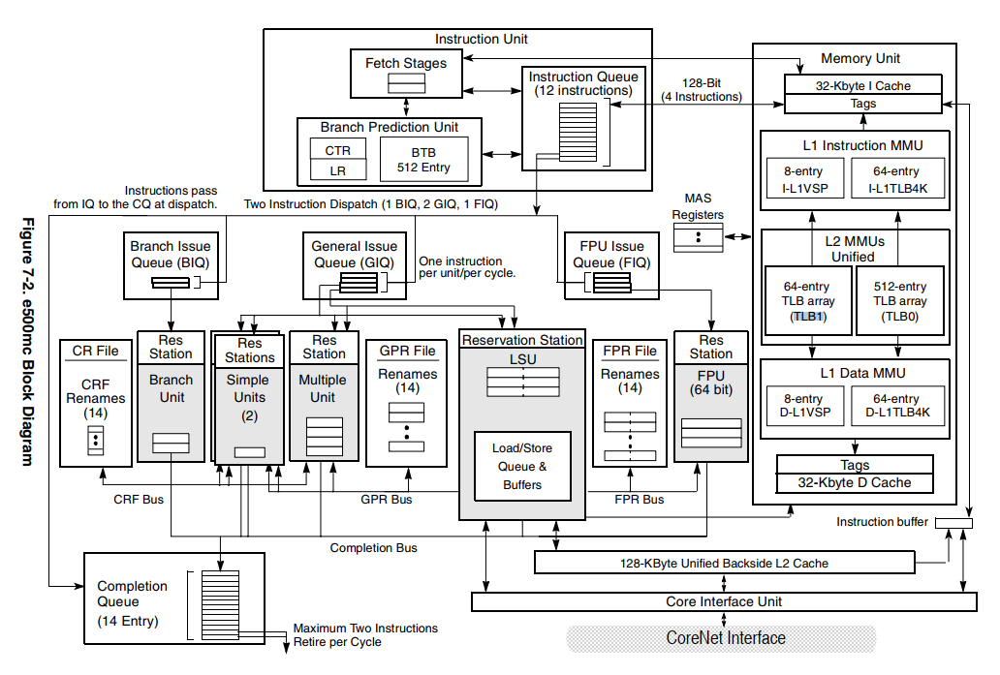
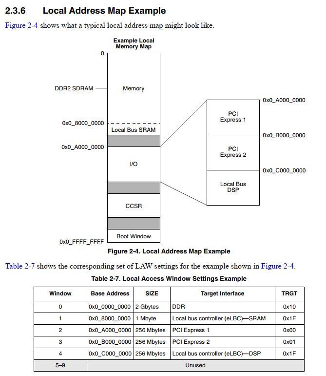
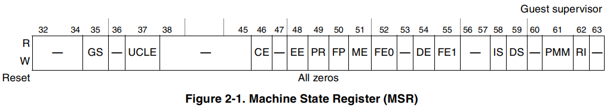
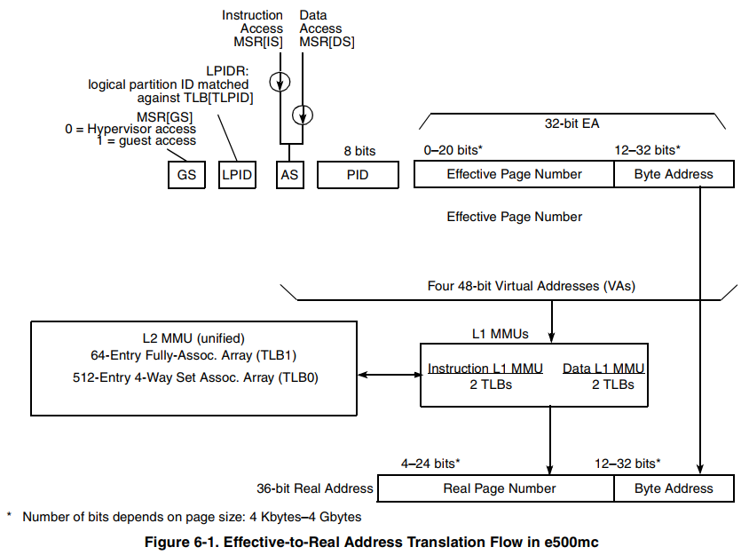
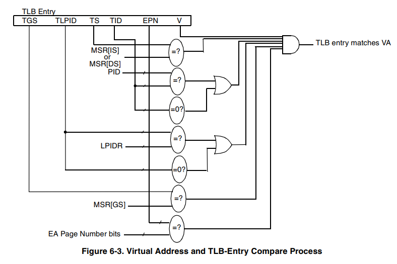
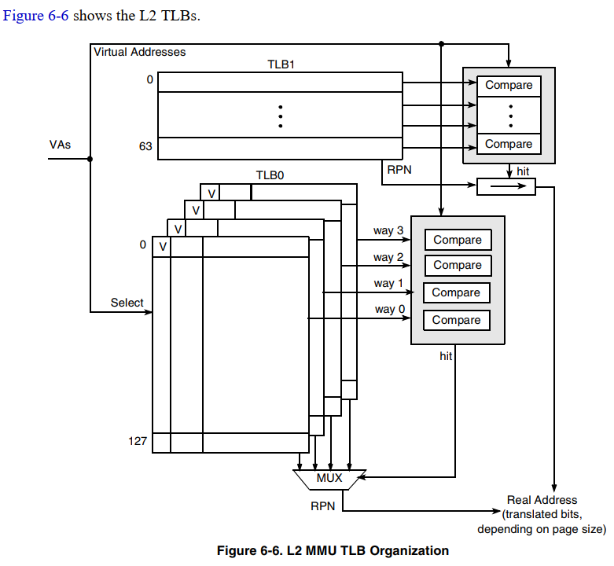
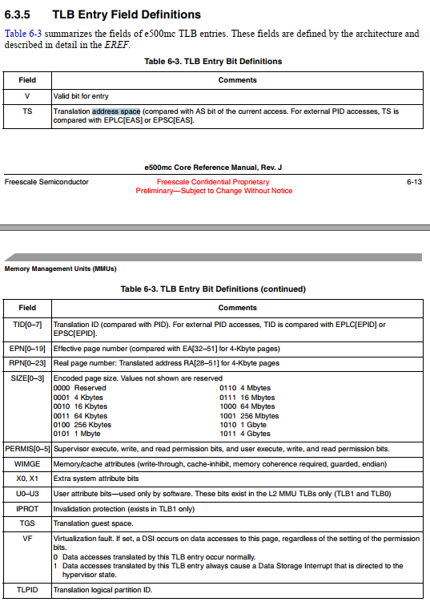
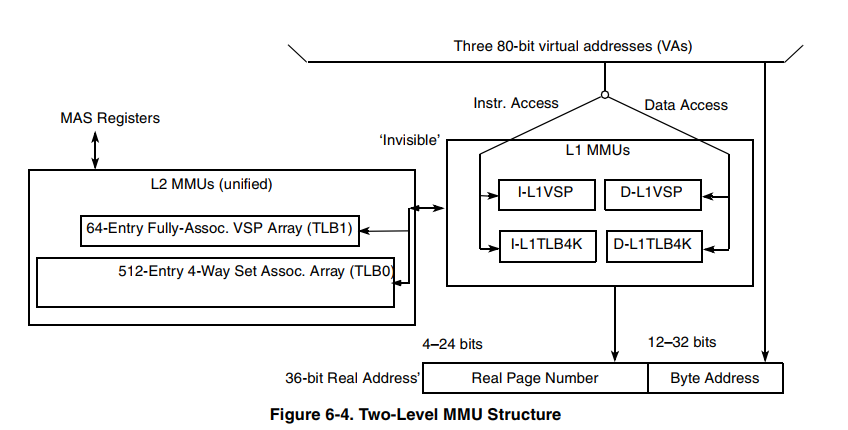
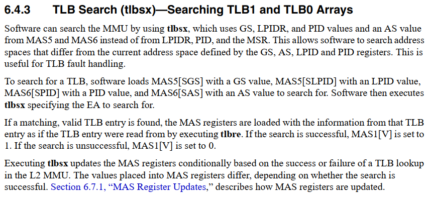

- [PPC e500ms框图](#ppc-e500ms框图)
- [PPC Memory Map知识](#ppc-memory-map知识)
- [虚实地址转换与寄存器知识](#虚实地址转换与寄存器知识)
- [主核linux启动](#主核linux启动)
  - [uboot阶段](#uboot阶段)
  - [kernel阶段](#kernel阶段)
- [从核linux启动](#从核linux启动)
  - [uboot阶段](#uboot阶段-1)
  - [linux阶段](#linux阶段)

# PPC e500ms框图
  

# PPC Memory Map知识
这里指内存及各种外设组件在CPU地址空间的map.

* LAW寄存器组: 共32个. 负责各组件在36位物理地址空间内的排布
组件ID是预定义的, 有点像mac地址, 代表组件在SOC级的bus中, 传输"地址寻址"的事务.
传输事务有源和目的. 有的组件可以是源, 也可以是目的. 有的组件只能是其中一种.
能做源的组件, 都可以主动发起访问, 比如CPU, 和PCIe以及DMA控制器.
主要ID有:

Source/Target ID | Transaction source | Transaction target | Notes
---|---|---|---|
0x00 | PCI-Express 1 | PCI-Express 1 | — 
0x0F | Reserved | Local Space |
0x10 | Reserved | Memory Complex 1 | DDR controller 1 or CPC1 SRAM
0x18 | Buffer Manager (control) | Buffer Manager Software Portal |
0x1F | Reserved | eLBC | — 
0x3C | Queue Manager (control) | Queue Manager Software Portal | —
0x48 | Pre-boot loader (PBL) | Reserved | —
0x70 | DMA 1 | Reserved |
0x80 | Core 0 (instruction) | Reserved | — 
0x81 | Core 0 (data) | Reserved |
0xC0 | Frame Manager 1 ID 1 | Reserved | — 

LAW不负责虚拟地址到物理地址的转换, 它只是负责物理地址的重新排布.

* 典型的物理地址布局  
  

* CCSRBAR负责映射soc寄存器基地址
* boot space 转换
每个核在复位的时候, 都有个4K的MMU映射在0x0_FFFF_F000, 并且从物理地址0x0_FFFF_FFFC执行代码.
意思是, 在复位的时候, MMU有个默认的1:1 4K映射.
第一条取指从地址0x0_FFFF_FFE0开始(burst read).
boot space 转换的作用是提供映射不同的组件到0x0_FFFF_F000
如果一个地址落在boot window(8 Mbytes at 0x0_FF80_0000 to 0x0_FFFF_FFFF)里面, boot space转换就生效(但需要enable), 这三个寄存器控制其map到哪里:
BSTRH, BSTRL, and BSTAR, 转换到4GB-BSTAR[SIZE] to 4GB-1

# 虚实地址转换与寄存器知识
* MSR  
  
* L1 MMU也有tlb, 但对软件不可见; 硬件把L1的TLB作为L2的TBL的缓存(inclusive cache), 自动管理.
* 两类TLB: TLB0和TLB0, 是并行工作的; TLB0的page size是固定4K, 比TLB1少了些通用性, 但entry数多. 多4K page的kernel应该比较友好.
* 多个tlb hit到一个虚拟地址是错误的.这种情况下, tlb会返回无效地址, 并且产生machine check  
  
  
  
  
  
  

# 主核linux启动
## uboot阶段
uboot启动到命令行后, 主核tlb如下:  
其代码运行在0x1ff0944c范围
```
idx w vaddr      GsLpidVTsSizeTidWIMGEUrUwUxSrSwSx    paddr        VfX0X1U0U1U2U3Iprot
  1 0 0x00000000 --   0V--   a  0-----UrUwUxSrSwSx -> 0x1:00000000 --------------Iprot
  2 0 0x40000000 --   0V--   a  0-----UrUwUxSrSwSx -> 0x1:40000000 --------------Iprot
  5 0 0xff800000 --   0V--   6  0-I-G-------SrSwSx -> 0xf:ff800000 --------------Iprot
  6 0 0xffc00000 --   0V--   6  0-I-G-------SrSwSx -> 0xf:ffc00000 --------------Iprot
  8 0 0xff200000 --   0V--   5  0-I-G-------SrSw-- -> 0xf:ff200000 --------------Iprot
  9 0 0xf4000000 --   0V--   5  0-----------SrSw-- -> 0xf:f4000000 --------------Iprot
 10 0 0xf4100000 --   0V--   5  0-I-G-------SrSw-- -> 0xf:f4100000 --------------Iprot
 11 0 0xf4200000 --   0V--   5  0-----------SrSw-- -> 0xf:f4200000 --------------Iprot
 12 0 0xf4300000 --   0V--   5  0-I-G-------SrSw-- -> 0xf:f4300000 --------------Iprot
 13 0 0xf0000000 --   0V--   6  0-I-G-------SrSw-- -> 0xf:00000000 --------------Iprot
 16 0 0x80000000 --   0V--   9  0-I-G-------SrSw-- -> 0xf:80000000 --------------Iprot
 17 0 0x90000000 --   0V--   9  0-I-G-------SrSw-- -> 0xf:90000000 --------------Iprot
 18 0 0xff300000 --   0V--   4  0-I-G-------SrSw-- -> 0xf:ff300000 --------------Iprot
 19 0 0xeffff000 --   0V--   1  0-I-G-------SrSwSx -> 0x1:1ffff000 --------------Iprot
 37 0 0xfe000000 --   0V--   7  0-I-G-------SrSw-- -> 0xf:fe000000 --------------Iprot
 38 0 0xff000000 --   0V--   2  0-I-G-------SrSw-- -> 0xf:ff000000 --------------Iprot
 39 0 0xff004000 --   0V--   2  0-I-G-------SrSw-- -> 0xf:ff004000 --------------Iprot 
```
从这里开始, uboot开始load linux.itb并执行.  
linux.itb包括uImage, fdt, rootfs  
uImage也是个itb, 是个压缩过的linux二进制. 不用解析elf.

```sequence
participant uboot_wrappers.c as wp
participant fantf/board.c as bd
participant common/cmd_bootm.c as bm
participant powerpc/lib/bootm.c as ppcbm

Note Over wp: prepare_images()
Note Over wp: fdt addr 0x... \n //initrd \n isam mchosen 0xc10000 0x9d61c8;
wp->bd: fdt boa
Note Over bd: //做dtb的fixup \n ft_board_setup
Note Over bd: //要非零物理地址启动, base要是实际LAW配的物理地址 \n 注1: fdt_fixup_memory(base, size)
bd-->wp:
wp->bm: bootm 0x7a0002a4 - 0x11000000
note over bm: bootm_find_os \n boot_get_kernel
note over bm: //for dts \n bootm_find_other
note over bm: bootm_load_os
note over bm: boot_relocate_fdt
bm->ppcbm: do_bootm_linux
note over ppcbm: boot_prep_linux \n boot_body_linux \n boot_jump_linux
note over ppcbm: 注2: kernel = 把images->ep强转为函数指针;\n 注3: (*kernel) ((bd_t *)of_flat_tree, 0, 0, EPAPR_MAGIC, \n getenv_bootm_mapsize(), 0, 0)
```
* 注1:  
在fant-f上, ddr被配置在物理地址4G以上. 而uboot默认base为0, 不修改会导致kernel无法启动.  
对DDR来说, 它的ID是0x10和0x11, 它不可能是一个memory transaction的源, 只可能是目的.  
LAW寄存器: ddr使用fe00_0c70和fe00_0c80, 被map到36位物理地址0x1:00000000, 两段各2G, 一共4G.  
具体LAW寄存器要看芯片手册第二章, memory map

* 注2:  
在uboot解析uImage的时候, 它知道:  
Load Address: 00000000  
Entry Point: 00000000  
注意这个Entry Point就是uboot要跳转到kernel的地址

* 注3:  
对kernel来说, 第一条命令在0xc0000000  
对uboot来说, kernel被load后, 第一条命令在0x00000000; 如果要用仿真器调试kernel, 第一个断点应打在0x00000000  
uboot跳转到0地址, 后面的所有都是kernel负责, 包括配kernel自己的tlb

## kernel阶段
vmlinux的链接地址是0xc000_0000, 被uboot load到物理地址0x1:00000000.  
vmlinux使用uboot配的tlb来运行kernel的第一条指令, 该指令位于head.S  
在这条TLB中, 物理地址0x1:00000000被映射到虚拟地址0
```
idx w vaddr      GsLpidVTsSizeTidWIMGEUrUwUxSrSwSx    paddr        VfX0X1U0U1U2U3Iprot
  1 0 0x00000000 --   0V--   a  0-----UrUwUxSrSwSx -> 0x1:00000000 --------------Iprot
```
所以, 可以说kernel是从虚拟地址0开始执行的. kernel在执行过程中, 用`tlbsx`命令, 能根据虚拟地址, 查到实际运行的物理地址, 并以此来配置TLB.  
当前的虚拟地址, 可以用跳转指令`bl`, 然后读`lr`寄存器得到.如:
```c
    bl  invstr
invstr:
    mflr    r6
```

kernel启动流程如下:
```sequence
participant init/main.c as m
participant head_fsl_booke.S as hd
participant powerpc/kernel/\nsetup_32.c as su
participant powerpc/kernel/\nprom.c as pr
participant powerpc/mm/\ninit_32.c as int
participant powerpc/mm/\nfsl_booke_mmu.c as mmu

note over hd: c0000000 <_start>: \n此时还在用uboot配的TLB, \n虚拟地址从0开始
note over hd: invalidate所有uboot的TLB, \n但保留当前运行的kernel代码所用的TLB.
note over hd: 注1: //建立第一条kernel的TLB\n__early_start: \ninclude fsl_booke_entry_mapping.S
note over hd: 到这里已经是0xC000_0000地址了\n使用特殊指令mtivor0 .. mtivor15\n建立中断表: set_ivor
note over hd: 如果是从核, 跳转到\n __secondary_start
note over hd: 建立第一个线程的ptr到init_task,\n建立栈
hd->su: 跳转到第一个C函数\n early_init
note over su: 清零bss, 识别CPU类型
#su-->hd:
hd->su: machine_init
note over su: 到这里kernel已经被relocated好了
#note over su: early_init_devtree()\n early_init_mmu()
su->pr: early_init_devtree
note over pr: 根据device treee, 获取initrd等信息\n建立MEMBLOCKs: 内存区间表\n扫描并解析dt
note over pr: early_init_mmu()
pr-->hd:
hd->int: MMU_init
note over int: 从命令行解析MMU配置\n reserve hugetlb
int->mmu: adjust_total_lowmem
note over mmu: 为kernel固定768M \n"low memory"映射\n 注2: map_mem_in_cams_addr\n(物理地址,0xc0000000,768,3,0)
mmu-->int:
note over int: 初始化MMU硬件
int-->hd:
hd->m: start_kernel()
note over m: lockdep_init();\ncgroup_init_early();\nlocal_irq_disable();\nboot_cpu_init();\npage_address_init();
note over m: 打印Linux version
note over m: setup_arch(&command_line);\n初始化mm, percpu, \nsoftirq, 页表分配器, \n打印并解析命令行
note over m: 建立log buf, pid hash表, vfs的cache\n trap_init(); \nmm_init();
note over m: sched_init();\nrcu_init();\ntick_nohz_init();\ncontext_tracking_init();\nradix_tree_init();\ninit_IRQ();\ntick_init();\ninit_timers();\nsoftirq_init();\ntime_init();\nperf_event_init();\ncall_function_init();
note over m: 开中断local_irq_enable();
note right of m: 开始有中断
note over m: 初始化page_cgroup numa_policy \nsched_clock pidmap \nanon_vma thread_info_cache \nsignal 等等...
note over m: 初始化cgroup cpuset ftrace
note over m: rest_init(): \n开始第一个线程:kernel_init和\n第二个线程kthreadd
note over m: 到这里所有初始化结束, 进入idle\nwhile(1) do_idle()
```

* 注1:  
第一个64M TLB, 映射kernel代码段的. 从0xc0000000映射到4G物理地址
```
idx w vaddr      GsLpidVTsSizeTidWIMGEUrUwUxSrSwSx    paddr        VfX0X1U0U1U2U3Iprot
  0 0 0xc0000000 --   0V--   8  0--M--------SrSwSx -> 0x1:00000000 --------------Iprot
```

* 注2:  
用TLB1中的3个TLB, 固定映射kernel的768M空间  
这里物理地址是从全局变量 memstart_addr得到的, 而这个全局变量是由dtb解析来的.  
所谓kernel的lowmem就是0xc0000000开始的768M, PPC用3条TLB来做固定映射. kmalloc可以直接从这段区域直接申请内存. 看起来应该是这样:  0xc0000000, 0xd0000000, 0xe0000000各256M
```
idx w vaddr      GsLpidVTsSizeTidWIMGEUrUwUxSrSwSx    paddr        VfX0X1U0U1U2U3Iprot
  0 0 0xc0000000 --   0V--   9  0--M--------SrSwSx -> 0x1:00000000 --------------Iprot
  1 0 0xd0000000 --   0V--   9  0--M--------SrSwSx -> 0x1:10000000 --------------Iprot
  2 0 0xe0000000 --   0V--   9  0--M--------SrSwSx -> 0x1:20000000 --------------Iprot
```
这要求dts要修改base到4G
```
memory {
        //从4G开始, 大小4G
        reg = <0x00000001 0x00000000 0x00000001 0x00000000>;
        device_type = "memory";
}
```

# 从核linux启动
从核也是从0xFFFF_FFFC启动. 但会等待主核kick off

## uboot阶段

uboot启动从核流程如下:
```sequence
participant 主流程 @主核 as ci
participant mpc85xx/fdt.c @主核 as fdt
participant mpc85xx/mp.c @主核 as mp
participant mpc85xx/release.S @所有从核 as rl


note over ci: 省略前面过程, \n此时uboot已经在ram中运行
ci->mp: setup_mp()
note over mp: boot page是最大DDR地址-4K\n 注0: 找到__second_half_boot_page的物理地址\n 找到spin table的物理地址
note over mp: 注1: 找到虚拟地址CONFIG_BPTR_VIRT_ADDR的tlb index
note over mp: 重新配置这个TLB index, 使得\nCONFIG_BPTR_VIRT_ADDR map到boot page
note over mp: 拷贝__secondary_start_page到CONFIG_BPTR_VIRT_ADDR, \n即拷贝到boot page的物理地址
note over mp: 注2: plat_mp_up(): \n把boot page的地址写入bstrh和bstrl寄存器
mp->rl: release 从核
note over rl: 注3: 0xFFFF_FFFC: \n__secondary_reset_vector: \nb __secondary_start_page
rl->rl:
note over rl: 0xFFFF_F000: __secondary_start_page
note over rl: CPU core初始化, errata修复, \n打开CPU cache, 分支预测等组件.
note over rl: 配置TLB index5, 映射CCSR. \n注4:
note over rl: 解析spin table地址, 建立spin table的TLB映射\n 注5:TLB更新
note over rl: 从__bootpg_addr取__second_half_boot_page的物理地址,\n rfi(return from interrupt)跳转到这个地址 \n这个地址在上面刚刚配置的TLB内.
note over rl: 注6: __second_half_boot_page:\n 建立spin table entry
rl--> mp: 置位spin table中本CPU的标记
note over rl: 循环等待spin table被填入addr
note over rl: PC地址: 0x1fee4048
rl->rl:
note over mp: 等待spin table中每个CPU的标记, \n1表示对应的从核已经跑到
mp-->ci:
note over ci: 主核继续运行
note over ci: "boot m"命令
ci-->fdt: ft_fixup_cpu
note over fdt: 在dtb中添加spin table信息:\n获取spin table总地址\n在每个cpu节点下面:\n"enable-method" = "spin-table"\n"cpu-release-addr"=该cpu的spin table物理地址\n并把相关内存添加到reserve memory
```

* 注0:  
`__secondary_start_page`的编译地址是: 0x0ff43000  
`__second_half_boot_page`的编译地址是:0x0ff44000  
它们是挨着的两个4K空间.  
`__spin_table_addr`在第1个4K: 0x0ff43284, 这是个指针, 编译时为0  
`__spin_table`在第2个4K: 0x0ff44204

* 注1:  
CONFIG_BPTR_VIRT_ADDR默认是0xfffff000, 但fant-f改写为0xeffff000
```
idx w vaddr      GsLpidVTsSizeTidWIMGEUrUwUxSrSwSx    paddr        VfX0X1U0U1U2U3Iprot
 19 0 0xeffff000 --   0V--   1  0-I-G-------SrSwSx -> 0x1:1ffff000 --------------Iprot
```

* 注2:  
从核也是从0xFFFF_FFFC启动. 设置bstr寄存器后, 0xFFFF_F000开始的4K会被映射到bstr寄存器指向的地址, 即主核设置的boot page; boot page包含release.S中的`__secondary_start_page`开始的4K代码, 这4K代码的最后一句正好是0xFFFF_FFFC: `b __secondary_start_page`, 从核从这句开始执行.

* 注3:  
从核在复位状态下的默认TLB为:
```
idx w vaddr      GsLpidVTsSizeTidWIMGEUrUwUxSrSwSx    paddr        VfX0X1U0U1U2U3Iprot
  0 0 0xfffff000 --   0V--   1  0-I---------SrSwSx -> 0x0:fffff000 --------------Iprot
```
这里的paddr只是从核认为的物理地址, 实际上是bstr寄存器指向的地址. 

* 注4:  
配好CCSR后, TLB:
```
idx w vaddr      GsLpidVTsSizeTidWIMGEUrUwUxSrSwSx    paddr        VfX0X1U0U1U2U3Iprot
  0 0 0xfffff000 --   0V--   1  0-I---------SrSwSx -> 0x0:fffff000 --------------Iprot
  5 0 0xfe000000 --   0V--   1  0-I-G-------SrSw-- -> 0xf:fe000000 --------------Iprot
```

* 注5:  
从`__spin_table_addr`指向的地址, 找到spin table地址;  `__spin_table_addr`在第1个4K: 0x0ff43284  
所以在reset地址来看, 是`0xfffff284`, 此时它的内容是`1fee4100`, 应该是`__spin_table`在ram里relocate后的地址.  
这是个差点到512M的物理地址.  
此时TLB为:
```
idx w vaddr      GsLpidVTsSizeTidWIMGEUrUwUxSrSwSx    paddr        VfX0X1U0U1U2U3Iprot
  0 0 0xfffff000 --   0V--   1  0-I---------SrSwSx -> 0x0:fffff000 --------------Iprot
  1 0 0x1fee4000 --   0VTs   1  0--MG-------SrSwSx -> 0x1:1fee4000 --------------Iprot
  5 0 0xfe000000 --   0V--   1  0-I-G-------SrSw-- -> 0xf:fe000000 --------------Iprot  
```

* 注6:  
这里已经不是boot space范畴了. `__second_half_boot_page`在普通的ram中. 前面的汇编打开了cache, 所以这段代码是可以被cache的.
spin table定义如下:
```c
struct {
    uint64_t entry_addr;
    uint64_t r3;
    uint32_t rsvd1;
    uint32_t pir;
    ...占位, 共64字节, 一个cacheline
}
```
总的spin table在0x1fee4100(见上), 每个CPU占64字节(0x40).  
r10寄存器指向本CPU在spin table的entry. 这里我们调试的是CPU2, 此时r10是0x1fee4180
```
ppcP3041[2,s] % md 0x1fee4180
0x1fee4180:
1fee_4180   00000000 00000001 00000000 00000002              ................
1fee_4190   00000000 00000002 00000000 00000000              ................
1fee_41a0   00000000 00000000 00000000 00000000              ................
1fee_41b0   00000000 00000000 00000000 00000000              ................
```

## linux阶段
linux启动后, 在`/sys/firmware/devicetree/base`下能看到相关的dtb配置.  
比如对CPU2来说, 它的spin table物理地址是`0000 0001 1fee 4180`, 和上面分析是一致的.
```
/sys/firmware/devicetree/base/cpus/PowerPC,e500mc@2 # hexdump -C enable-method
00000000  73 70 69 6e 2d 74 61 62  6c 65 00                 |spin-table.|
0000000b
/sys/firmware/devicetree/base/cpus/PowerPC,e500mc@2 # hexdump  cpu-release-addr
0000000 0000 0001 1fee 4180                    
0000008
```
```sequence
participant 第一个进程kernel_init @主核 as ki
participant kernel/smp.c @主核 as smp
participant kernel/cpu.c @主核 as cpu
participant powerpc/kernel/smp.c @主核 as ppcsmp

note over ki: ...
note over ki: 初始化多核: do_pre_smp_initcalls();\nlockup_detector_init();\nsmp_init();\nsched_init_smp();
note over smp: 每个CPU都有idle threads \nstruct task_struct *idle_threads[NR_CPUS];
ki->smp: smp_init
note over smp: for each cpu: cpu_up(cpu)
smp->cpu: cpu_up
note over cpu: 获取该CPU的idle = idle thread \n 为这个CPU新建线程
cpu->ppcsmp: __cpu_up(cpu, idle)
note over ppcsmp: 全局变量unsigned int \ncpu_callin_map[NR_CPUS];\n
note over ppcsmp: 初始化idle进程的thread_info
note over ppcsmp: kick_cpu

ppcsmp-->cpu:
note over cpu: 激活这个CPU的线程\n 通知这个CPU已经online
cpu-->smp:
note over smp: 打印从核已启动\n Brought up 4 CPUs
smp-->ki:
note over ki: do_basic_setup(): \n初始化共享内存 驱动 irq 系统调用 执行initcalls\n从ramdis加载默认ko
note over ki: 至此系统正常running: \n依次尝试执行/init /sbin/init /etc/init \n/bin/init /bin/sh
```

```sequence
participant powerpc/kernel/smp.c \n@主核 as ppcsmp
participant platforms/85xx/smp.c \n@主核 as 85smp
participant mpc85xx/release.S \n@从核 as rl
participant head_fsl_booke.S \n@从核 as hd
participant powerpc/kernel/smp.c \n@从核 as ppcsmp2


note over rl: 循环等待spin table被填入addr
note over rl: PC地址: 0x1fee4048
rl->rl:
note left of rl: 此时还在uboot代码里面
ppcsmp->85smp: smp_85xx_kick_cpu
note over 85smp: 从device tree获取cpu-release-addr\n例如CPU2: *cpu_rel_addr=0x11fee4180\n将该地址ioremap得到spin table虚拟地址
note over 85smp: 注1: 将__early_start的物理地址写入spin table
85smp->rl: 从核启动物理地址生效\n:0x10000009c
note over 85smp: 等待从核release
note over rl: 注2: mask spin table 状态为released
rl-->85smp:
note over 85smp: 打开本地中断
85smp-->ppcsmp:
note over rl: 注3: 为该启动地址配置64M的1:1TLB
note over rl: TLB配好后, rfi命令跳转到启动地址
rl->hd: rfi命令跳转到linux代码
note over hd: //建立第一条kernel的TLB\n__early_start: \ninclude "fsl_booke_entry_mapping.S"\n这部分和主核一样
note over hd: 注4: 虚拟地址从0xc000_0000开始了\n设置中断向量表
note over hd: 从核, 跳转到\n __secondary_start
note over hd: 注5: 从核直接从TLBCAM[index] load tlb配置\n使低768M内存常驻TLB配置
note over hd: 初始current和current_thread_info到全局变量\n建立栈
note over hd: 跳转到start_secondary
hd->ppcsmp2: start_secondary
note over ppcsmp2: cpu_callin_map[cpu]置位
note over ppcsmp: 等待从核给\ncpu_callin_map[CPU]置位\n timeout说明从核没起来
ppcsmp2-->ppcsmp: 通知主核, 启动成功
note over ppcsmp2: 初始化cputime\n配置numa\ncpu上线\n打开本地中断
note over ppcsmp2: 注6: 从核从IDLE开始运行\ncpu_startup_entry\n(CPUHP_AP_ONLINE_IDLE)
```

* 注1:  
在linux下面, spin table定义如下:
```c
struct epapr_spin_table {
    u32    addr_h;
    u32    addr_l;
    u32    r3_h;
    u32    r3_l;
    u32    reserved;
    u32    pir;
};
```
这里的kernel代码有个bug, CPU是PPC32时, kernel不写addr_h, 一般系统的DDR配置在物理0地址, addr_h不写也没问题.  
但fant-f的物理地址在0x1_0000_0000, 即从4G开始, 那么`__pa(__early_start)`是大于32位的, 不写addr_h会导致从核得到的启动地址不对, 从核无法启动.
在fant-f上的相关地址打印如下: **注for注1**:
```c
cpu_rel_addr=0xc3fdc4ac *cpu_rel_addr=0x11fee4180
high_memory=0xf0000000 virt_to_phys(high_memory)=0x30000000
__early_start=0xc000009c, __pa(__early_start)=0x10000009c
```
修改方法很简单, 同时写入addr_h和addr_l, 从核就能成功启动.
```c
//增加写入addr_h
out_be32(&spin_table->addr_h, __pa(__early_start) >> 32);
out_be32(&spin_table->addr_l, __pa(__early_start));
```

* 注for注1: 还有一个bug  
`virt_to_phys(high_memory)=0x30000000`这里是有问题的.  
我们的phy地址是4G以上的, 所以这里的`0x30000000`显然不对.  
问题出在`arch/powerpc/include/asm/io.h`  
`virt_to_phys`返回的是`unsigned long`, 在PPC32机器上, `unsigned long`是32位, 不够装下我们的phy地址.
```c
static inline unsigned long virt_to_phys(volatile void * address)
{
    //__pa的返回类型是64位的, 但从本函数返回被截断了.
    return __pa((unsigned long)address);
}
```
历史背景:
**virt_to_phys**被kernel里面很多核心代码和众多driver引用.  `unsigned long`在32位机器上是32位, 在64位机器上是64位, 所以这个api被设计成默认虚拟地址和物理地址等宽. 一般情况下, 这样设计没问题.  
PPC4080, CPU是32位, 但物理地址有36位, 这种情况下, 如果DDR被配置在物理0地址, 大小不超过4G, 这样做也是没问题的.  
但fant-f很特殊, DDR被配置在了物理4G地址开始, 其物理地址"真的"超过了32位. 在这种情况下, `virt_to_phys`返回的物理地址会被截断.  
修改:  
也很简单, 把`unsigned long`换成`phys_addr_t`, `phys_addr_t`足够容下物理地址.  
此时打印如下:`virt_to_phys(high_memory)`地址变正确了.
```c
cpu_rel_addr=0xc3fdc4ac *cpu_rel_addr=0x11fee4180
high_memory=0xf0000000 virt_to_phys(high_memory)=0x130000000
__early_start=0xc000009c, __pa(__early_start)=0x10000009c
```

* 注2:  
从核的spin table被主核更新为, 从核要跳转到物理地址`00000001 0000009c`执行.
```
ppcP3041[2,s] % md 0x1fee4180
0x1fee4180:
1fee_4180   00000001 0000009c 00000000 00000002              ................
1fee_4190   00000000 00000002 00000000 00000000              ................
1fee_41a0   00000000 00000000 00000000 00000000              ................
1fee_41b0   00000000 00000000 00000000 00000000              ................
```
此时TLB为:
```
idx w vaddr      GsLpidVTsSizeTidWIMGEUrUwUxSrSwSx    paddr        VfX0X1U0U1U2U3Iprot
  0 0 0xfffff000 --   0V--   1  0-I---------SrSwSx -> 0x0:fffff000 --------------Iprot
  1 0 0x1fee4000 --   0VTs   1  0--MG-------SrSwSx -> 0x1:1fee4000 --------------Iprot
  5 0 0xfe000000 --   0V--   1  0-I-G-------SrSw-- -> 0xf:fe000000 --------------Iprot  
```

* 注3:  
TLB更新为
```
idx w vaddr      GsLpidVTsSizeTidWIMGEUrUwUxSrSwSx    paddr        VfX0X1U0U1U2U3Iprot
  0 0 0x00000000 --   0V--   8  0-----------SrSwSx -> 0x1:00000000 --------------Iprot
  1 0 0x1fee4000 --   0VTs   1  0--MG-------SrSwSx -> 0x1:1fee4000 --------------Iprot
  5 0 0xfe000000 --   0V--   1  0-I-G-------SrSw-- -> 0xf:fe000000 --------------Iprot  
```
但注意此时虚拟地址还不是0xc0000000开始的, 而是从0开始的.

* 注4:  
此时就只剩linux配的一条有效tlb
```
idx w vaddr      GsLpidVTsSizeTidWIMGEUrUwUxSrSwSx    paddr        VfX0X1U0U1U2U3Iprot
  0 0 0xc0000000 --   0V--   8  0--M--------SrSwSx -> 0x1:00000000 --------------Iprot
```

* 注5:  
从核不用计算low_mem(768M), 而是直接读TLBCAM的配置, 从而配置成和主核一样的3个常驻TLB, 给linux 的low_mem使用.  
与之对应的是high_mem(256M), 在high_mem的内存需要动态TLB才能访问.  
这中间的操作由`bl  loadcam_entry`和`bl  restore_to_as0`包围, 期间多配了一个带Ts标记的TLB.
```
idx w vaddr      GsLpidVTsSizeTidWIMGEUrUwUxSrSwSx    paddr        VfX0X1U0U1U2U3Iprot
  0 0 0xc0000000 --   0V--   9  0--M--------SrSwSx -> 0x1:00000000 --------------Iprot
  1 0 0xd0000000 --   0V--   9  0--M--------SrSwSx -> 0x1:10000000 --------------Iprot
  2 0 0xe0000000 --   0V--   9  0--M--------SrSwSx -> 0x1:20000000 --------------Iprot
 63 0 0xc0000000 --   0VTs   8  0--M--------SrSwSx -> 0x1:00000000 --------------Iprot  
```

* 注6:  
从核开始运行IDLE进程, tlb最终为只有768M固定映射.
```
idx w vaddr      GsLpidVTsSizeTidWIMGEUrUwUxSrSwSx    paddr        VfX0X1U0U1U2U3Iprot
  0 0 0xc0000000 --   0V--   9  0--M--------SrSwSx -> 0x1:00000000 --------------Iprot
  1 0 0xd0000000 --   0V--   9  0--M--------SrSwSx -> 0x1:10000000 --------------Iprot
  2 0 0xe0000000 --   0V--   9  0--M--------SrSwSx -> 0x1:20000000 --------------Iprot
```
