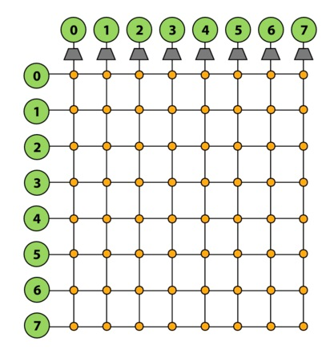
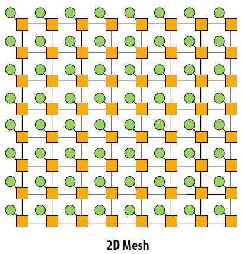
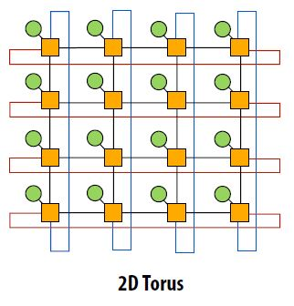
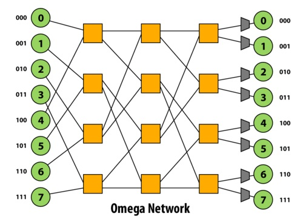
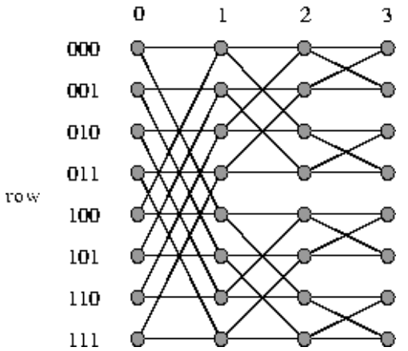
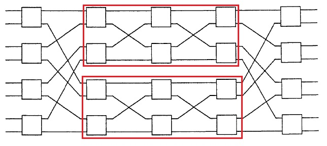

Multiprocessor Interconnection Networks

- [Introduction](#introduction)
- [Crossbar](#crossbar)
- [Mesh](#mesh)
  - [2D Mesh](#2d-mesh)
  - [3D Mesh](#3d-mesh)
  - [Torus](#torus)
  - [Real-World Example](#real-world-example)
- [Multi-stage logarithmic networks](#multi-stage-logarithmic-networks)
  - [Definitions](#definitions)
  - [Omega Network](#omega-network)
  - [Butterfly Network](#butterfly-network)
  - [Benes Network](#benes-network)
  - [Real-world example usages](#real-world-example-usages)

# Introduction

We'll be introducing various types of interconnect topologies. For most of the 418 discussion so far, communication between processors (and their caches) with memory have been over a standard, shared-bus interconnect. The problem with this approach is that there will be significant contention on the interconnect because only one processor can be using the interconnect at any given time. The motivation for exploring other interconnect topologies is to allow for the possibility of optimizing various aspects of its design - for example, one may choose to optimize the latency or scalability of an interconnect system, or the actual cost of its real-world implementation might be worth optimizing instead.

# Crossbar

One type of interconnect topology is called a crossbar. A crossbar has every node of the network connected to every other node. Because any node can send simultaneous messages to every other node in the system without conflicts, this network topology is nonblocking. Furthermore, the direct connections allow for O(1) latency - each switch in the network directly connects the source node of a message to its destination node, so the message only has to traverse one "hop" in the network in order to be delivered. Crossbars also generally provide high bandwidth.

  
Figure 1: Crossbar

The downside of crossbars is that because they use so many wires, they can end up being tremendously expensive. They're also not too scalable - as you can see in Figure 1 above, a crossbar of N nodes requires N^2 switches.

Real-World Example: Developed in 2007 by Sun Microsystems (later acquired by Oracle), the Sun UltraSPARC T2 is a microprocessor that uses a full crossbar for its 4, 6 or 8 cores (there are 8 in Figure 2 shown below). Note that the complexity of the chip's crossbar interconnect makes it almost the size of a CPU core!

  
Figure 2: Sun UltraSPARC T2

# Mesh

## 2D Mesh

  
Figure 3: 2D Mesh

The 2D mesh network topology is a 2D grid of nodes where each node is connected to its own switch. The latency to send a message from one node to another node is non-uniform. Traveling from one node to an adjacent node travels over one link while going from a node from one corner to a node in the opposite corner travels over 2n-2 links. The latency on average is O(sqrt(N)). Since there is one switch per node, the cost is O(N). This is better than the crossbar network topology but the obvious tradeoff is higher latency.

Other characteristics are that the layout is very intuitive. It is easy to lay out on a chip. The topology is considered direct since nodes are connected to switches that are within the network. There are also multiple ways for messages to travel from one node to the other. However, the mesh topology is considered blocking. Consider a node in the corner of a 2D mesh trying to send 3 messages to 3 different locations. There are only two paths connected to the switch for this node so at least one message is blocked.

## 3D Mesh

Higher dimensional meshes can also be created. 3D meshes are sometimes used. 3D meshes have the same asymptotic latency and cost. The latency is slightly lower while the cost and complexity of creating a 3D mesh are higher.

## Torus

  
Figure 4: 2D Torus

The 2D torus is an extension of the 2D mesh. A problem with 2D meshes is that nodes near the edge of the mesh have different characteristics than nodes at the center. The 2D torus avoids this problem by having a link between a switch on an edge and the switch on the opposite edge. Similar to a 3D mesh, the 2D torus has slightly lower latency while higher cost and complexity than a 2D mesh.

## Real-World Example

  
Figure 5: Tilera TILE-Gx

Tilera creates processors, TILE-Gx, that use the mesh topology as the bus interconnect. "Tilera's architecture eliminates the dependence on a bus, and instead puts a non-blocking, cut-through switch on each processor core, which connects it to a two dimensional on-chip mesh network called iMesh (Intelligent Mesh)."[http://www.tilera.com/about_tilera/technology](http://www.tilera.com/about_tilera/technology/ "http://www.tilera.com/about_tilera/technology")

# Multi-stage logarithmic networks

## Definitions

-   A network is *non-blocking* if it is capable of connecting an unused input to an unused output, no matter what other connections are being used in the network. A network is *blocking* otherwise.
-   A blocking network is *rearrangeably non-blocking* if once the permutation from inputs to outputs is known, the network can then be rearranged to provide all connections specified by the permutation.
-   A *self-routing* network allows each crossbar in a network to route a packet using only the information local to that crossbar, such as what it is connected to, and the information in the packet.

Banyan networks are defined to be multi-stage networks that have exactly one path from any input to any output. Multi-stage logarithmic networks are a subset of banyan networks that are typically constructed using 2x2 crossbar connections. The cost and latency of multi-stage logarithmic networks is `O(log(n))`and  `O(log(n))` respectively. Three prominent examples of multi-stage logarithmic networks are the Omega network, the Butterfly network, and the Benes network. The Omega network and the Butterfly network are delta networks, a subset of banyan networks that are self-routing. Self-routing networks are of practical interest for fast packet switching. Delta networks are blocking networks. A more detailed examination of why delta networks are blocking networks can be found [here](http://pnewman.com/papers/thesis/chapter4.pdf).

For simplicity, we will look at examples of these networks with n inputs and n outputs, where n is a power of 2.

## Omega Network

  

The Omega network is a delta network that, when constructed with 2x2 crossbar connections, has `log2(n)` stages of `n/2` 2x2 crossbars. Thus the latency of any path in the network is `O(log(n))`, and the cost of the network is `O(nlog(n))`. The paths between one stage to the next is a perfect shuffle (in terms of permutations). In other words, do a logical left rotate on the binary representations of a port id to get the next port id. This network is a blocking network: consider paths 1-6 and 3-7.

## Butterfly Network

  

The Butterfly network is a delta network that, when constructed with 2x2 crossbar connections, has `log2(n)` stages, each with `n/2` 2x2 crossbars, just like the Omega network. In the image above, each crossbar is drawn twice. In fact, the Omega and Butterfly networks are isomorphic.

## Benes Network

  

The Benes network is recursively constructed. The image above shows a Benes network constructed with 2x2 crossbar connections, where the red rectangles (4x4 Benes networks) are recursively used to form the 8x8 network. A special property of this network is that it is rearrangeably non-blocking, as described in the definitions above. This network has `2log2(n)`stages, each with n/2 2x2 crossbars.

## Real-world example usages

A real-world example usage of a Banyan network in an interconnect is the IBM SP-2.

A real-world example usage of a Butterly network in an interconnect is the Monsoon supercomputer.
