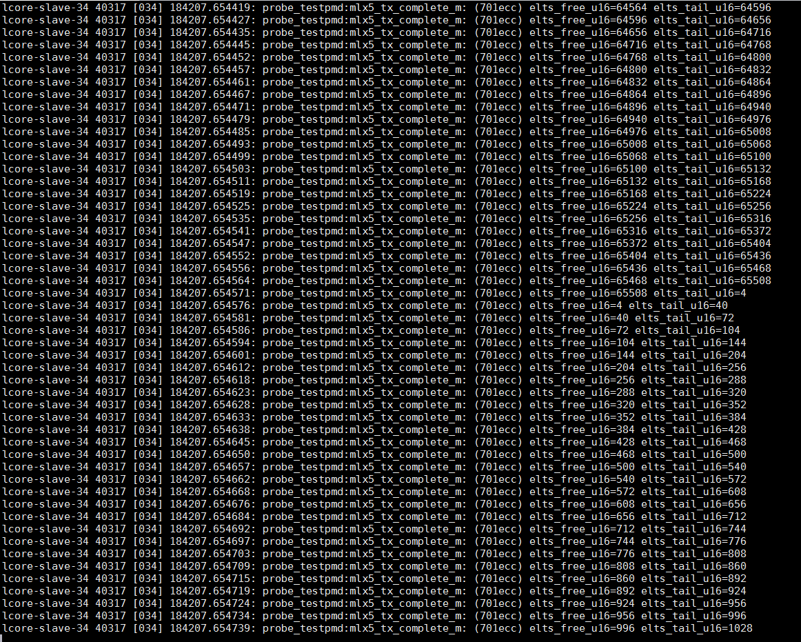
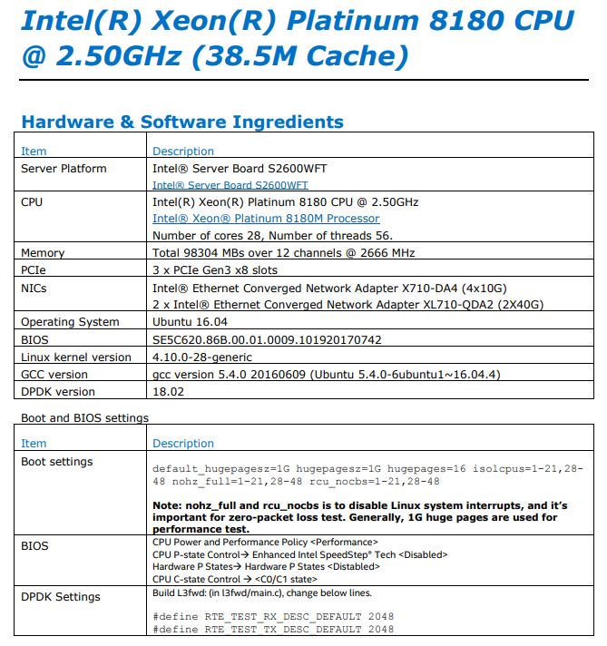
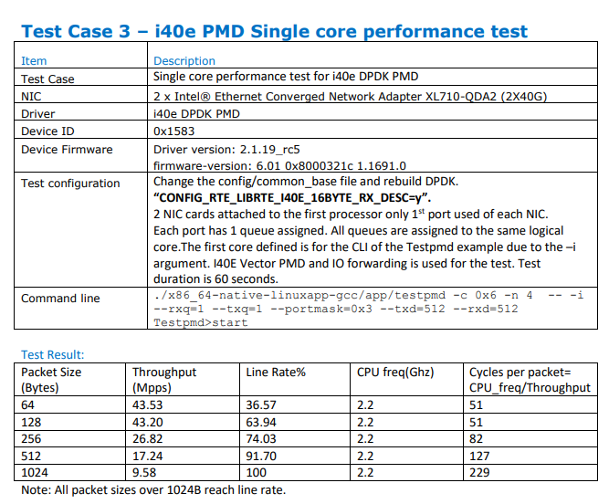
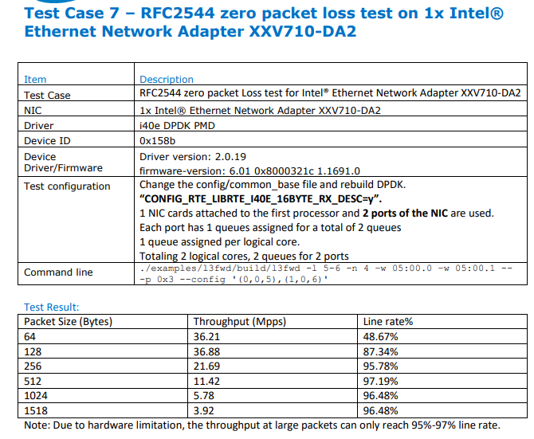

- [DPDK代码梳理](#dpdk代码梳理)
  - [PMD说明](#pmd说明)
  - [MLX的txq](#mlx的txq)
    - [macswap段错误](#macswap段错误)
  - [程序框架, 以IO FWD为例](#程序框架-以io-fwd为例)
    - [pkt_burst_io_forward](#pkt_burst_io_forward)
    - [mlx 10G NIC](#mlx-10g-nic)
- [DPDK上手](#dpdk上手)
  - [Mallanox OFED安装](#mallanox-ofed安装)
    - [OFED简介](#ofed简介)
    - [安装](#安装)
      - [相关问题解决](#相关问题解决)
  - [DPDK编译安装](#dpdk编译安装)
    - [高版本pktgen编译](#高版本pktgen编译)
  - [运行testpmd](#运行testpmd)
    - [在VM上运行testpmd](#在vm上运行testpmd)
    - [在Mellanox PMD(Poll-Mode Driver)上运行testpmd](#在mellanox-pmdpoll-mode-driver上运行testpmd)
    - [testpmd交互模式](#testpmd交互模式)
    - [testpmd命令记录](#testpmd命令记录)
    - [testpmd常用命令](#testpmd常用命令)
    - [testpmd常用的fwd模式](#testpmd常用的fwd模式)
    - [运行多个testpmd实例](#运行多个testpmd实例)
    - [testpmd查看统计](#testpmd查看统计)
  - [l3fwd](#l3fwd)
    - [编译](#编译)
    - [运行](#运行)
  - [pktgen](#pktgen)
    - [pktgen命令记录](#pktgen命令记录)
    - [图示](#图示)
    - [测试结果](#测试结果)
  - [Mellanox DPDK性能优化](#mellanox-dpdk性能优化)
    - [关闭流控](#关闭流控)
    - [huagepage](#huagepage)
      - [KVM用hugepage](#kvm用hugepage)
    - [isolcpu](#isolcpu)
    - [关闭透明大页](#关闭透明大页)
    - [关闭中断均衡](#关闭中断均衡)
    - [mlx网卡的一些特殊优化](#mlx网卡的一些特殊优化)
    - [用taskset pin vm的核](#用taskset-pin-vm的核)
  - [Mellanox驱动/FW的命令汇总](#mellanox驱动fw的命令汇总)
    - [mod option](#mod-option)
    - [常用命令](#常用命令)
    - [mst tool(Mellanox Software Tools)](#mst-toolmellanox-software-tools)
- [SR-IOV相关](#sr-iov相关)
  - [SR-IOV使能, 重启不保存](#sr-iov使能-重启不保存)
    - [disable sriov, 配置VF要在disable sriov以后做](#disable-sriov-配置vf要在disable-sriov以后做)
    - [允许的vf数](#允许的vf数)
  - [SR-IOV使能, 重启保存(未验证)](#sr-iov使能-重启保存未验证)
    - [step 1](#step-1)
    - [step 2](#step-2)
    - [step 3](#step-3)
    - [step 4 重启机器](#step-4-重启机器)
  - [VF相关命令](#vf相关命令)
    - [Vlan tag](#vlan-tag)
    - [VF的mac link状态](#vf的mac-link状态)
    - [VF的包统计](#vf的包统计)
    - [VF和port的关系](#vf和port的关系)
    - [VF的QoS](#vf的qos)
  - [vxlan相关](#vxlan相关)
  - [QinQ](#qinq)
    - [802.1ad 双tag](#8021ad-双tag)
- [VM相关](#vm相关)
  - [两个VM用vhost-user连OVS](#两个vm用vhost-user连ovs)
  - [virt-manager](#virt-manager)
- [性能相关](#性能相关)
  - [grub选项](#grub选项)
  - [intel报告 on Platinum 8180](#intel报告-on-platinum-8180)
    - [testpmd](#testpmd)
    - [L3fwd](#l3fwd-1)

# DPDK代码梳理
## PMD说明
https://doc.dpdk.org/guides/prog_guide/poll_mode_drv.html

## MLX的txq
一次实际的txq
```c
(gdb) bt
#0  mlx5_tx_complete (txq=0xfff7bff79500) at /home/bai/share/repo/hxt/mainstream-dpdk-stable/drivers/net/mlx5/mlx5_rxtx.h:478
#1  mlx5_tx_burst_mpw (dpdk_txq=0xfff7bff79500, pkts=0xebf30a <ports_ids+2>, pkts_n=1761) at /home/bai/share/repo/hxt/mainstream-dpdk-stable/drivers/net/mlx5/mlx5_rxtx.c:940
#2  0x000000000049e57c in pkt_burst_mac_swap ()
#3  0x0000000000476f50 in run_pkt_fwd_on_lcore ()
#4  0x0000000000477030 in start_pkt_forward_on_core ()
#5  0x00000000005153c4 in eal_thread_loop ()
#6  0x0000ffffa86d7bb8 in start_thread () from /lib64/libpthread.so.0
#7  0x0000ffffa861fb50 in thread_start () from /lib64/libc.so.6
(gdb) p *txq
$13 = {elts_head = 63996, elts_tail = 63804, elts_comp = 28, mpw_comp = 0, cq_ci = 21080, wqe_ci = 34108, wqe_pi = 34026, elts_n = 11, cqe_n = 6, wqe_n = 11, tso_en = 0, tunnel_en = 1, swp_en = 0,
  mpw_hdr_dseg = 0, max_inline = 0, inline_max_packet_sz = 0, qp_num_8s = 1235712, offloads = 0, mr_ctrl = {dev_gen_ptr = 0xfff7bffe9558, cur_gen = 0, mru = 0, head = 1, cache = {{start = 281439006359552,
        end = 281439543230464, lkey = 2514682368}, {start = 0, end = 0, lkey = 0}, {start = 0, end = 0, lkey = 0}, {start = 0, end = 0, lkey = 0}, {start = 0, end = 0, lkey = 0}, {start = 0, end = 0,
        lkey = 0}, {start = 0, end = 0, lkey = 0}, {start = 0, end = 0, lkey = 0}}, cache_bh = {len = 2, size = 256, overflow = 0, table = 0xfff7bff78000}}, cqes = 0xfff7a02d0000, wqes = 0xfff7a02a0000,
  qp_db = 0xfff7bff80184, cq_db = 0xfff7bff80100, bf_reg = 0xffdee4a96800, elts = 0xfff7bff79700, stats = {idx = 0, opackets = 332528124, obytes = 19951687440, oerrors = 0}}

```
```c
/* TX queue descriptor. */
__extension__
struct mlx5_txq_data {
    uint16_t elts_head; /* Current counter in (*elts)[]. */
    uint16_t elts_tail; /* Counter of first element awaiting completion. */
    uint16_t elts_comp; /* Counter since last completion request. */
    uint16_t mpw_comp; /* WQ index since last completion request. */
    uint16_t cq_ci; /* Consumer index for completion queue. */
#ifndef NDEBUG
    uint16_t cq_pi; /* Producer index for completion queue. */
#endif
    uint16_t wqe_ci; /* Consumer index for work queue. */
    uint16_t wqe_pi; /* Producer index for work queue. */
    uint16_t elts_n:4; /* (*elts)[] length (in log2). */
    uint16_t cqe_n:4; /* Number of CQ elements (in log2). */
    uint16_t wqe_n:4; /* Number of of WQ elements (in log2). */
    uint16_t tso_en:1; /* When set hardware TSO is enabled. */
    uint16_t tunnel_en:1;
    /* When set TX offload for tunneled packets are supported. */
    uint16_t swp_en:1; /* Whether SW parser is enabled. */
    uint16_t mpw_hdr_dseg:1; /* Enable DSEGs in the title WQEBB. */
    uint16_t max_inline; /* Multiple of RTE_CACHE_LINE_SIZE to inline. */
    uint16_t inline_max_packet_sz; /* Max packet size for inlining. */
    uint32_t qp_num_8s; /* QP number shifted by 8. */
    uint64_t offloads; /* Offloads for Tx Queue. */
    struct mlx5_mr_ctrl mr_ctrl; /* MR control descriptor. */
    volatile struct mlx5_cqe (*cqes)[]; /* Completion queue. */
    volatile void *wqes; /* Work queue (use volatile to write into). */
    volatile uint32_t *qp_db; /* Work queue doorbell. */
    volatile uint32_t *cq_db; /* Completion queue doorbell. */
    volatile void *bf_reg; /* Blueflame register remapped. */
    struct rte_mbuf *(*elts)[]; /* TX elements. */
    struct mlx5_txq_stats stats; /* TX queue counters. */
} __rte_cache_aligned;

uint16_t mlx5_tx_burst_mpw(void *dpdk_txq, struct rte_mbuf **pkts, uint16_t pkts_n)
{
    struct mlx5_txq_data *txq = (struct mlx5_txq_data *)dpdk_txq;
    ...
}
```

### macswap段错误
在<调试和分析记录>里面, 已经分析过, macswap段错误的原因是数组越界  
这段程序负责回收mbuf, 根据`txq->wqe_pi`生产者的index, 找到`txq->wqes`里面对应的wqe, 其对应的硬件定义如下:
```c
struct mlx5_wqe_ctrl {
	uint32_t ctrl0;
	uint32_t ctrl1;
	uint32_t ctrl2;
	uint32_t ctrl3;
} __rte_aligned(MLX5_WQE_DWORD_SIZE);
```
elts_tail根据wqe的ctrl3得出
```c
(gdb) p *(volatile struct mlx5_wqe_ctrl *)0xfff7a02b3e00
$52 = {ctrl0 = 251167745, ctrl1 = 81465856, ctrl2 = 134217728, ctrl3 = 63836}
elts_tail = ctrl->ctrl3 //从硬件读出来的, 所谓的硬件是wqe
elts_tail=63836
```
elts_free是上一次的`txq->elts_tail`

591行free数组越界导致段错误:

  

通常情况下free和tail的增长情况:
  

通过加打印:950行, 抓到的2次异常情况
```bash
testpmd> PANIC in mlx5_tx_complete_m():
Array index exceeding: elts_free:2685 elts_tail:1576

testpmd> PANIC in mlx5_tx_complete():
Array index exceeding: elts_free:40737 elts_tail:39488
```

下面想知道, 假定`elts_tail`发生了"突变", 那能抓到这次突变吗? 突变的上一次值是多少? 有什么规律?  
运行`sudo perf record -e probe_testpmd:mlx5_tx_complete_m -a -C 34 -- sleep 30`抓30秒, 时间太长则数据量太大. 看运气, 多抓几次.

抓到了, 最后一行:
  

## 程序框架, 以IO FWD为例
```bash
主核:
main()
	rte_eal_init()
		每个从核pthread_create执行eal_thread_loop, 主从核通过管道通信
            
	start_packet_forwarding()
		#通知从核执行start_pkt_forward_on_core
		launch_packet_forwarding(start_pkt_forward_on_core)
            for (i = 0; i < cur_fwd_config.nb_fwd_lcores; i++)
                rte_eal_remote_launch(pkt_fwd_on_lcore,fwd_lcores[i], lc_id);
                    #这里的f会被eal_thread_loop执行
                    lcore_config[slave_id].f = f;
                    lcore_config[slave_id].arg = arg;
                    #通知从核
                    n = write(m2s, &c, 1);
                    #等待ack
                    n = read(s2m, &c, 1);
	prompt()
		#stop时
		stop_packet_forwarding()
			#每个从核执行, run_pkt_fwd_on_lcore里面会检查stopped
			fwd_lcores[lc_id]->stopped = 1
			#RX-packets:
			total_recv += stats.ipackets;
			#TX-packets:
			total_xmit += stats.opackets;
			#RX-dropped:
			total_rx_dropped += stats.imissed;
			#TX-dropped:
            #+=fwd_dropped(见pkt_burst_io_forward), 即tx数小于rx数的部分
			total_tx_dropped += port->tx_dropped;
			#RX-nombufs:
			total_rx_nombuf  += stats.rx_nombuf;
从核:
thread_start()
	start_thread()
		eal_thread_loop()
            m2s = lcore_config[lcore_id].pipe_master2slave[0];
            s2m = lcore_config[lcore_id].pipe_slave2master[1];
            while 1:
                #没有命令下发则阻塞在这
                n = read(m2s, &c, 1);
                lcore_config[lcore_id].state = RUNNING;
                #ack
                n = write(s2m, &c, 1);
                ret = lcore_config[lcore_id].f(lcore_config[lcore_id].arg)
                    start_pkt_forward_on_core()
                        run_pkt_fwd_on_lcore()
                            do
                                #每个stream都运行一次, 比如下面
                                #Logical Core 1 (socket 0) forwards packets on 2 streams:
                                #  RX P=0/Q=0 (socket 0) -> TX P=1/Q=0 (socket 0) peer=02:00:00:00:00:01
                                #  RX P=1/Q=0 (socket 0) -> TX P=0/Q=0 (socket 0) peer=02:00:00:00:00:00
                                #第一次从P0Q0收包, 发到P1Q0;第二次从P1Q0收包, 发到P0Q0
                                for (sm_id = 0; sm_id < nb_fs; sm_id++)
                                    #对io fwd来说, 是pkt_burst_io_forward()
                                    (*pkt_fwd)(fsm[sm_id])
                            while (! fc->stopped)
                lcore_config[lcore_id].ret = ret;
                rte_wmb();
                lcore_config[lcore_id].state = FINISHED;
```
### pkt_burst_io_forward
```bash
pkt_burst_io_forward
    nb_rx = rte_eth_rx_burst(fs->rx_port, fs->rx_queue, pkts_burst, nb_rx);
        struct rte_eth_dev *dev = &rte_eth_devices[port_id];
        nb_rx = (*dev->rx_pkt_burst)(dev->data->rx_queues[queue_id], rx_pkts, nb_pkts);
			#ixgbe_rxtx_vec_neon.c
			#最大burst为RTE_IXGBE_MAX_RX_BURST=32
			ixgbe_recv_pkts_vec()
			
    
    #return The number of output packets actually stored in transmit descriptors of
    #the transmit ring. The return value can be less than the value of the
    #*tx_pkts* parameter when the transmit ring is full or has been filled up.
    #往设备的tx queue发报文, burst模式, 通常是32个; 入参同时也提供了实际报文的所在的pool, 是由之前rte_pktmbuf_pool_create()申请的; 这样, 有报文地址, 有个数, rte_eth_tx_burst()就可以发送了; 但实际能发送的个数要看这个tx queue里tx ring的可用的tx描述符的个数;
    #每个报文发送时, 先在transmit ring里取下一个可用的描述符, 释放已经用它发完的buffer, 用报文的rte_mbuf来配这个tx描述符, 然后发送; 如果有分片的话, 会用几个tx描述符
    #有个水限tx_free_thresh, 当tx描述符低于这个水限, 则rte_eth_tx_burst()函数要"尝试"释放这些已经发送完成的描述符指向的rte_mbuf
    #rte_eth_txconf::txq_flags有DEV_TX_OFFLOAD_MT_LOCKFREE的话, 多核可以同时在同一个queue上发送, 不用加锁.
    nb_tx = rte_eth_tx_burst(fs->tx_port, fs->tx_queue, pkts_burst, nb_rx);
        struct rte_eth_dev *dev = &rte_eth_devices[port_id];
        return (*dev->tx_pkt_burst)(dev->data->tx_queues[queue_id], tx_pkts, nb_pkts);
			ixgbe_xmit_pkts_vec()
				ixgbe_xmit_fixed_burst_vec()
                    #tx_free_thresh为32
                    if (txq->nb_tx_free < txq->tx_free_thresh)
                        #根据tx_ring里txq->tx_next_dd指向的描述符的DD(descripor done)位的指示,
                        #释放txq->sw_ring里面指向的mbuf, 一次释放txq->tx_rs_thresh个(32个)
                        ixgbe_tx_free_bufs(txq);
                            
    #见rte_ethdev.h
    fs->fwd_dropped += (nb_rx - nb_tx);
```

### mlx 10G NIC
```
mlx5_rx_burst_vec
mlx5_tx_burst_mpw
```

# DPDK上手
## Mallanox OFED安装
这里我们使用Mallanox ConnectX-4网卡, 首先需要安装Mallanox驱动包OFED
### OFED简介
OFED(Mellanox OpenFabrics Enterprise Distribution for Linux)

* OFED是个软件包, 用来支持自家网卡在InfiniBand和Ethernet上支持RDMA, 包括
	* 驱动(mlx4,mlx5), InfiniBand的上层协议(IPoIB, SRP and iSER Initiator)
	* OpenFabrics工具: OpenSM诊断和性能工具
	* Open MPI stack, 一些benchmark工具(OSU benchmarks, Intel MPI benchmarks, Presta)
	* PGAS
	* HPC的相关软件
	* 其他: ibutils2, ibdump, MFT

### 安装
到http://www.mellanox.com/page/products_dyn?product_family=26&mtag=linux下载安装包
```bash
sudo yum install gcc-gfortran
sudo ./mlnxofedinstall -h
./mlnxofedinstall --add-kernel-support
#如果提示版本不对
sudo ./mlnxofedinstall --add-kernel-support --skip-distro-check
#经验证, ofed4.4.1和dpdk18.05要用下面的配置安装
sudo ./mlnxofedinstall --add-kernel-support --skip-distro-check --dpdk --upstream-libs
sudo ./mlnxofedinstall --add-kernel-support --skip-distro-check --dpdk --with-mlnx-ethtool --with-mft --with-mstflint --upstream-libs
#安装完成
sudo /etc/init.d/openibd restart
#看版本
ofed_info -s
```
注: 应该会最大化安装, --add-kernel-support会安装kernel驱动

#### 相关问题解决
* ibv_exp_query_device错误
运行app, 比如testpmd, 提示`PMD: net_mlx5: ibv_exp_query_device() failed`
解决: 重装ofed, 注意版本和DPDK版本要匹配, 而且安装参数也有影响


## DPDK编译安装
```bash
#clone代码
git clone ssh://1680532@bjsss013.hxtcorp.net:29418/networking/dpdk
git checkout hxt-dev-v17.08
#使用gcc6.3编译
scl enable devtoolset-6 bash
cd dpdk
export RTE_TARGET=arm64-armv8a-linuxapp-gcc
#打开common_base一个就行了
sed -i 's/\(CONFIG_RTE_LIBRTE_MLX5_PMD=\)n/\1y/g' config/common_base
make config T=${RTE_TARGET}
#使能Mlx网卡
sed -ri 's,(LIBRTE_MLX5_PMD=).*,\1y,' build/.config
#编译
make -j24
#带-g编译, 可用gdb调试
make -j EXTRA_CFLAGS=-g
make -j EXTRA_CFLAGS="-g -O1 -Wno-error"
#编译加安装
make install T=${RTE_TARGET} -j
make install -j EXTRA_CFLAGS="-g" T=${RTE_TARGET}
#编译l3fwd
make examples T=$RTE_TARGET -j

#pktgen
#和dpdk版本, ofed版本都有关
wget http://www.dpdk.org/browse/apps/pktgen-dpdk/snapshot/pktgen-dpdk-pktgen-3.4.5.zip
export RTE_SDK=[the path to the DPDK SW root folder]
export RTE_TARGET=arm64-armv8a-linuxapp-gcc
cd pktgen-dpdk-pktgen-3.4.5
make -j24
make EXTRA_CFLAGS="-Wno-error" -j
#高版本pktgen
sudo yum install lua-devel.aarch64 readline-devel.aarch64

#经过验证的版本:
dpdk 17.08 & pktgen3.4.5
dpdk 17.11 & pktgen3.4.9(编不过要把rte_memcpy删掉)
dpdk 18.05 & pktgen3.5.6(打多流大包有问题)
```

### 高版本pktgen编译
```bash
#先编译lua5.3
curl -R -O http://www.lua.org/ftp/lua-5.3.5.tar.gz
tar zxf lua-5.3.5.tar.gz
cd lua-5.3.5
make linux test
#默认装到/user/local下面
sudo make install
#添加lua5.3.pc
$ cat /usr/local/lib/pkgconfig/lua5.3.pc
V= 5.3
R= 5.3.5
prefix= /usr/local
exec_prefix= ${prefix}
libdir= ${prefix}/lib
includedir= ${prefix}/include

Name: Lua
Description: An Extensible Extension Language
Version: ${R}
Requires:
Libs: -L${libdir} -llua -lm -ldl
Cflags: -I${includedir}

#比如编译pktgen-3.5.6
#修改Makefile
$ git diff
diff --git a/app/Makefile b/app/Makefile
index 3949e51..a78ea7d 100644
--- a/app/Makefile
+++ b/app/Makefile
@@ -89,8 +89,8 @@ endif

 ifeq ($(CONFIG_RTE_LIBRTE_LUA),y)
 else
-MYLIBS     += -lpktgen_lua
-MYLIB_PATH += -L$(LUA_LIB) $(shell pkg-config --libs lua5.3)
+MYLIBS     += -lpktgen_lua $(shell pkg-config --libs-only-l lua5.3)
+MYLIB_PATH += -L$(LUA_LIB) $(shell pkg-config --libs-only-L lua5.3)

 CFLAGS     += -I/usr/include/lua5.3
 CFLAGS     += -I$(RTE_SRCDIR)/../lib/lua/
 
#编译pktgen
export RTE_SDK=[the path to the DPDK SW root folder]
export RTE_TARGET=arm64-armv8a-linuxapp-gcc
PKG_CONFIG_PATH=/usr/local/lib/pkgconfig make -j
```

## 运行testpmd
### 在VM上运行testpmd
```bash
sudo modprobe uio 
sudo modprobe uio_pci_generic
#VM最大内存才8G, 这里分4G给testpmd
sudo bash -c "echo 8 > /sys/kernel/mm/hugepages/hugepages-524288kB/nr_hugepages"
#绑定到uio_pci_generic
sudo ./usertools/dpdk-devbind.py --status
sudo ./usertools/dpdk-devbind.py -b uio_pci_generic 04:00.0
sudo ./usertools/dpdk-devbind.py -b uio_pci_generic 05:00.0
sudo ./build/app/testpmd -- -i
#intel 82599绑定回kernel driver
./usertools/dpdk-devbind.py -b ixgbe 0005:01:00.0 0005:01:00.1
```
virtio pmd参考: https://doc.dpdk.org/guides/nics/virtio.html

### 在Mellanox PMD(Poll-Mode Driver)上运行testpmd
不需要unbind kernel driver, 一般文档会要求先unbind pci device, 再bind到uio_pci_generic或vfio-pci上, 
比如:
```bash
./usertools/dpdk-devbind.py --status
#要先加载uio_pci_generic.ko
modprobe uio_pci_generic
./usertools/dpdk-devbind.py --bind=uio_pci_generic 04:00.1
或
./usertools/dpdk-devbind.py --bind=uio_pci_generic eth1
#unbind
./usertools/dpdk-devbind.py -u 04:00.1
```
Mellanox网卡**不需要** unbind, 因为它家的kernel module本身就支持UIO/VFIO
```bash
#用PCI地址制定网口
./testpmd -c 0x1ff -n 4 -w 0000:08:00.0
-w 0000:08:001 --socket-mem=2048,0 -- --port-numa-config=0,0,1,0 --socketnum=0
--burst=64 --txd=1024 --rxd=256 --mbcache=512 --rxq=4 --txq=4 --nbcores=8
--i
#强制dpdk使用1G大页, 否则会用满可用大页
./testpmd --socket-mem 1024

#ConnectX-4 NIC最好性能举例:
./testpmd -c 0x1ff -n 4 -w 0000:08:00.0,txq_inline=128
-w 0000:08:00.1,txq_inline=128 --socket-mem=2048,0 -- --port-numaconfig=0,0,1,0
--socket-num=0 --burst=64 --txd=1024 --rxd=256 --mbcache=512
--rxq=4 --txq=4 --nb-cores=8 --rss-udp --i
#一个port举例
./testpmd -c 0xe000 -n 4 -w 0000:08:00.0,txq_inline=200 --socketmem=2048,0
-- --port-numa-config=0,0,1,0 --socket-num=0 --burst=64 --
txd=4096 --rxd=1024 --mbcache=512 --rxq=4 --txq=4 --nb-cores=4 --rss-udp --i 
#hxt的例子
./build/app/testpmd -l 3-43 -n 6 txq_inline=256,rxq_cqe_comp_en=1,txqs_min_inline=8,
txq_mpw_en=1 -- -i --txq=16 --rxq=16 --mbcache=512 --rxd=4096 --txd=4096
```
* `-l`是说run在哪些core上, 每个core一个线程
* `-n 6`是说6个mem channel

### testpmd交互模式
这里默认两台机器直连, 都运行testpmd
在RX侧:
```bash
~]# testpmd> set nbcore 32
~]# testpmd> port config all rss ether
# 反压, 不关闭默认是开启的; 这是个网卡的配置, 关一次就好了.
~]# testpmd> set flow_ctrl tx off 0
~]# testpmd> set flow_ctrl rx off 0
~]# testpmd> set fwd rxonly
~]# testpmd> start
```
在TX侧:
```bash
~]# testpmd> set nbcore 32
~]# testpmd> set flow_ctrl tx off 0
~]# testpmd> set flow_ctrl rx off 0
~]# testpmd> set fwd flowgen
~]# testpmd> start
```
* nbcore就是说用多少个core
* RX侧是rxonly模式, tx侧是flowgen模式, 都关闭流控
* 用`set txpkts [length]`配置报文大小

### testpmd命令记录
```bash
#使用前准备
#关闭流控
$ sudo ethtool -A enP5p1s0 rx off tx off
#关闭透明大页
见下面

#用-w指定pci设备
$ sudo ./build/app/testpmd -l 42-45 -w 0005:01:00.0 -- -i
$ sudo ./build/app/testpmd -l 42-45 -w 0005:01:00.0 --log-level=9 -- -i
$ sudo ./build/app/testpmd -l 42-45 -w 0005:01:00.0 -- -i --txq=16 --rxq=16
$ sudo ./build/app/testpmd -l 37-45 -w 0005:01:00.0 -- -i
```
### testpmd常用命令
```bash
#port信息
testpmd> show port info all
#关闭混杂模式
testpmd> set promisc all off

#看统计
testpmd> show port stats all
testpmd> show port xstats all
#清统计
testpmd> clear port stats all
watch -dn1 'ethtool -S enP5p1s0 | egrep "rx_packets|tx_packets|dis|pause"'

#收发包配置信息: packet size,nbcore, queue个数, 描述符个数
testpmd> show config rxtx
#看转发配置
testpmd> show config fwd 
#修改包大小, 默认64字节小包
testpmd> set txpkts 512
#fwd模式
set fwd (io|mac|macswap|flowgen|rxonly|txonly|csum|icmpecho)
#设置port的queue和描述符个数
port config all (rxq|txq|rxd|txd) (value)
testpmd> port config all rxq 2
testpmd> port config all txq 2
testpmd> port config all txd 2048
testpmd> port config all rxd 2048
#改完配置要stop再start port
port stop all
port start all
#设置rss(receive side scaling)模式
port config all rss (all|ip|tcp|udp|sctp|ether|port|vxlan|geneve|nvgre|none)
#从上面看到burst默认32个?
port config all burst (value)
#设置port的mtu
port config mtu X value
```

* 因为不经过kernel网络栈, 用ip或ifconfig命令看不到收发包统计; 用`ethtool -S`可以看到物理层收发包统计.
* 最简单的一条流(stream)的基本的逻辑是: 一个CPU从一个rxq里收包, 做处理, 再发包到txq
* rxq/txq的数目和cpu的数目(nbcore)要匹配, testpmd会自动安排多流, 比如配了2个core, 4个q
```oxygene
testpmd> show config fwd                                                                                
flowgen packet forwarding - ports=1 - cores=2 - streams=4 - NUMA support enabled, MP over anonymous pages disabled  
Logical Core 38 (socket 0) forwards packets on 2 streams:  
  RX P=0/Q=0 (socket 0) -> TX P=0/Q=0 (socket 0) peer=02:00:00:00:00:00
  RX P=0/Q=1 (socket 0) -> TX P=0/Q=1 (socket 0) peer=02:00:00:00:00:00
Logical Core 39 (socket 0) forwards packets on 2 streams:  
  RX P=0/Q=2 (socket 0) -> TX P=0/Q=2 (socket 0) peer=02:00:00:00:00:00
  RX P=0/Q=3 (socket 0) -> TX P=0/Q=3 (socket 0) peer=02:00:00:00:00:00
```
* 根据经验, 一般一个core配一到两个q性能最好; Rx only模式, 单核能到16~17Mpps(小包) 
4个核能到43Mpps, 再增加核也上不去了; 经分析, 瓶颈应该在PMD通过Mlx_core驱动(提供的类似UIO的接口?)访问硬件上, 此时可以看到`ethtool -S enP5p1s0`里面, 接收方rx_discards_phy不断增加, 说明硬件在丢弃报文(有问题, TX一直发, RX stop, 而rx_discards_phy不增加; 很可能是驱动层丢包)--进一步说明硬件的buffer满了, 而上层来不及处理; 但增加core数不管用, 所以瓶颈应该在用户态访问硬件上.

### testpmd常用的fwd模式
https://doc.dpdk.org/guides/testpmd_app_ug/testpmd_funcs.html?highlight=set%20fwd
* io: 默认fwd模式, 不改报文
* macswap: 交换报文的目的mac和源mac
* flowgen: 产生多条流, 目的IP变化
* rxonly: 只收
* txonly: 构造报文发送, 不收

### 运行多个testpmd实例
默认dpdk的程序不能多开, 会报错.
用下面命令可以多开: lcore不一样, prefix不一样, -w设备不一样
```bash
sudo ./build/app/testpmd -l 36-41 -m 512 --file-prefix pg1 -w 0004:01:00.0 --proc-type auto txq_inline=256,rxq_cqe_comp_en=1,txqs_min_inline=8,txq_mpw_en=1 -- -i

sudo ./build/app/testpmd -l 42-45 -m 512 --file-prefix pg2 -w 0005:01:00.0 --proc-type auto txq_inline=256,rxq_cqe_comp_en=1,txqs_min_inline=8,txq_mpw_en=1 -- -i
```

### testpmd查看统计
```bash
~]# testpmd> show port stats all
~]# testpmd> show port xstats all
```

## l3fwd
### 编译
```bash
export RTE_TARGET=arm64-armv8a-linuxapp-gcc
make examples T=$RTE_TARGET
```
### 运行
```bash
#主要是配--config, 这是个map表. l3fwd没有交互模式, 所以配多少个q, 怎么map, 都在这个表里了.(port, q, core)
sudo examples/l3fwd/arm64-armv8a-linuxapp-gcc/l3fwd -l 37-45 -w 0005:01:00.0 -n 6 -- -p 0x1 --config '(0,0,37),(0,1,38)'
#多了--不一样哦
examples/l3fwd/arm64-armv8a-linuxapp-gcc/l3fwd --help
examples/l3fwd/arm64-armv8a-linuxapp-gcc/l3fwd -- --help

#要加混杂模式才能转发? -P
examples/l3fwd/arm64-armv8a-linuxapp-gcc/l3fwd -l 37-45 -w 0004:01:00.1 -n 6 -- -P -p 0x1 --config '(0,0,37),(0,1,38)'

  -p PORTMASK: Hexadecimal bitmask of ports to configure
  -P : Enable promiscuous mode
  -E : Enable exact match
  -L : Enable longest prefix match (default)
  --config (port,queue,lcore): Rx queue configuration
  --eth-dest=X,MM:MM:MM:MM:MM:MM: Ethernet destination for port X
  --enable-jumbo: Enable jumbo frames
  --max-pkt-len: Under the premise of enabling jumbo,
                 maximum packet length in decimal (64-9600)
  --no-numa: Disable numa awareness
  --hash-entry-num: Specify the hash entry number in hexadecimal to be setup
  --ipv6: Set if running ipv6 packets
  --parse-ptype: Set to use software to analyze packet type

```


## pktgen
编译见上面
```bash
cd ~/repo/hxt/pktgen/pktgen-dpdk-pktgen-3.4.5
#运行, [42:43].0的意思是rx用core42,tx用core43, core41为显示和timer
#-T是打开颜色, -P是混杂模式
sudo app/arm64-armv8a-linuxapp-gcc/pktgen -l 41-45 -w 0005:01:00.0 -- -T -P -m "[42:43].0"
#43和44两个核做tx, 能64字节线速
sudo app/arm64-armv8a-linuxapp-gcc/pktgen -l 41-45 -w 0005:01:00.0 -- -T -P -m "[42:43-44].0"
sudo app/arm64-armv8a-linuxapp-gcc/pktgen -l 31-35 -w 0005:01:00.0 -- -T -P -m "[32-33:34-35].0"

#运行testpmd
sudo ./build/app/testpmd -l 37-45 -n 6 -w 0005:01:00.0 txq_inline=256,rxq_cqe_comp_en=1,txqs_min_inline=8,txq_mpw_en=1 -- -i
```
### pktgen命令记录
```bash
#启动pktgen, rx用core42,tx用core43, core41为显示和timer
sudo app/arm64-armv8a-linuxapp-gcc/pktgen -l 41-45 -w 0005:01:00.0 -- -T -P -m "[42:43].0"
#配目的IP(组播IP)
Pktgen:/> set 0 dst ip 224.0.0.1
#改变目的组播IP
Pktgen:/> set 0 dst ip 225.0.0.1
#配目的mac(组播MAC)
Pktgen:/> set 0 dst mac 01:00:5e:00:00:01
#配目的组播mac
Pktgen:/> set 0 dst mac 01:00:5e:00:00:02
#设置发包速率为1%, 太大会丢包
Pktgen:/> set 0 rate 1
#开始发送
Pktgen:/> start all
#停止发送
Pktgen:/> stop all

#设置发包数目
Pktgen:/> set 0 count 1000000000
#设置发包大小
Pktgen:/> set 0 size 1024

#清除统计
Pktgen:/> clr

#burst数目
set 0 burst 32

#多流 start min max inc
range 0 dst ip 0.0.0.0 0.0.0.0 1.2.3.4 0.0.1.0
range 0 dst ip 0.0.0.0 0.0.0.0 0.0.0.1 0.0.0.1
range 0 size 64 64 64 0
range 0 size 256 256 256 0
range 0 size 512 512 512 0
range 0 size 1024 1024 1024 0
enable 0 range

#抓包
#开始
enable 0 capture
#结束抓, 此时会在当前目录下生成.pcap文件
disable 0 capture
#查看该pcap文件
tcpdump -vvXX -r pktgen-20181113-160020-0.pcap
```

### 图示
  

### 测试结果
A对B打流, A:pktgen, 1core tx, 1core rx; B:testpmd, fwd=io, nbcore=1, rxtx配置如下  | pps | L1 Dcache miss | note
------ | ------ | ------ | -----
rxq= 1 txq=1 rxd=128 txd=512 | Rx~=Tx=16.1M |  | rx_out_of_buffer不断增长
rxq= 1 txq=1 rxd=256 txd=256 | Rx:17.9M Tx:14.9M | | rx_out_of_buffer不断增长
rxq= 1 txq=1 rxd=512 txd=512 | Rx~=Tx=16.3M | 2.80% | rx_out_of_buffer不断增长
rxq= 1 txq=1 rxd=1024 txd=1024 | Rx~=Tx=13.6M | 3.08% | rx_out_of_buffer不断增长
rxq= 1 txq=1 rxd=2048 txd=2048 | Rx~=Tx=12.6M | 3.19% | rx_out_of_buffer不断增长
rxq= 1 txq=1 rxd=4096 txd=4096 | Rx~=Tx=12.6M |  | rx_out_of_buffer不断增长
rxq= 2 txq=2 rxd=128 txd=512 | Rx~=Tx=15.5M |  | rx_out_of_buffer不断增长
rxq= 2 txq=2 rxd=2048 txd=2048 | Rx~=Tx=12.3M |  | rx_out_of_buffer不断增长


## Mellanox DPDK性能优化
### 关闭流控
```
ethtool -A eth16 rx off tx off
```
### huagepage
用`/dev/hugepages`
#### KVM用hugepage
`-mem-path /dev/hugepages`
### isolcpu
in grub kernel cmdline
`isolcpus=4-43`
### 关闭透明大页
```bash
echo never > /sys/kernel/mm/transparent_hugepage/defrag
echo never > /sys/kernel/mm/transparent_hugepage/enabled
echo 0 > /sys/kernel/mm/transparent_hugepage/khugepaged/defrag
sysctl -w vm.swappiness=0
sysctl -w vm.zone_reclaim_mode=0
```
### 关闭中断均衡
```bash
service irqbalance stop
#手动配置中断
set_irq_affinity_cpulist.sh 0-1 ethX
```
### mlx网卡的一些特殊优化
```bash
$ sudo ibdev2netdev -v
0004:01:00.0 mlx5_0 (MT4115 - MT1738K12272) CX413A - ConnectX-4 QSFP28 fw 12.22.1002 port 1 (ACTIVE) ==> enP4p1s0 (Up)
0005:01:00.0 mlx5_1 (MT4115 - MT1738K12253) CX413A - ConnectX-4 QSFP28 fw 12.22.1002 port 1 (ACTIVE) ==> enP5p1s0 (Up)

mlxconfig -d mlx5_0 q
mlxconfig -d mlx5_0 s CQE_COMPRESSION=1 

#for ConnectX-4: txq_inline=200, txqs_min_inline=4
./testpmd -c 0x1ff -n 4 -w
0000:08:00.0,txq_inline=128,txqs_min_inline=4 -w
0000:08:00.1,txq_inline=128,txqs_min_inline=4 --socket-mem=2048,0 --
--port-numa-config=0,0,1,0 --socket-num=0 --burst=64 --txd=1024 --
rxd=256 --mbcache=512 --rxq=4 --txq=4 --nb-cores=8 -i
```
### 用taskset pin vm的核


## Mellanox驱动/FW的命令汇总
### mod option
在/etc/modprobe.d/mlx4.conf里面可以添加参数
```
options mlx4_core parameter=<value>
options mlx4_en parameter=<value>
```
比如下面的参数, 详见`Mellanox Linux user manual.pdf`
```
debug_level enable_sys_tune num_vfs probe_vf set_4k_mtu enable_qos probe_vf
```
### 常用命令
```bash
#进入 退出混杂模式
ifconfig eth2 promisc
ifconfig eth2 -promisc

#查看mlx网卡信息
ibstat

#看mlx网卡收发包实际速度(ethtool)
mlnx_perf -i enP4p1s0f0

#PCI设备和接口对应
$ sudo ibdev2netdev -v
0004:01:00.0 mlx5_0 (MT4115 - MT1738K12240) CX413A - ConnectX-4 QSFP28 fw 12.22.1002 port 1 (ACTIVE) ==> enP4p1s0 (Up)
0005:01:00.0 mlx5_1 (MT4115 - MT1717X06081) CX413A - ConnectX-4 QSFP28 fw 12.22.1002 port 1 (ACTIVE) ==> enP5p1s0 (Up)

#FW
mlxfwmanager

#当前版本
$ ethtool -i enP5p1s0
driver: mlx5_core
version: 4.3-3.0.2
firmware-version: 12.22.1002 (MT_2120110027)
expansion-rom-version:
bus-info: 0005:01:00.0
supports-statistics: yes
supports-test: yes
supports-eeprom-access: no
supports-register-dump: no
supports-priv-flags: yes

#offload功能状态
$ sudo ethtool -k enP5p1s0

#配置offload功能
ethtool -K eth<x> [rx on|off] [tx on|off] [sg on|off] [tso on|off] [lro on|off]

#看q和irq的数目, 用L(大写)可以配置
$ ethtool -l enP5p1s0

#中断合并, 参数大C可以配置
$ ethtool -c enP5p1s0

#查看pause帧配置
$ ethtool -a enP5p1s0

#ring大小
$ ethtool -g enP5p1s0

#查看详细统计, 详细到每个q
ethtool -S enP5p1s0

#qos
$ mlnx_qos -i enP5p1s0

#traffic class
$ sudo tc_wrap.py -i enP5p1s0

#拥塞控制工具
mlnx_qcn
```

### mst tool(Mellanox Software Tools)
```
$ sudo mst start
$ sudo mst status
```

# SR-IOV相关
## SR-IOV使能, 重启不保存
```bash
sudo bash -c "echo 1 > /sys/module/mlx5_core/parameters/probe_vf"
sudo bash -c "echo 2 > /sys/class/infiniband/mlx5_0/device/mlx5_num_vfs"
#或者用
/sys/bus/pci/devices/0004:01:00.0/sriov_numvfs
```
执行成功后, 用`ifconfig`和`ibdev2netdev`能看到新加的接口
eg. 在原来的接口enP4p1s0基础上, 新增了enP4p1s0f1和enP4p1s0f2

1. 如果probe_vf为0, 则不创建net device, 即没有enP4p1s0f1和enP4p1s0f2, 但PCI的VF是有的
这种情况很常用, 因为VF最终会被bind到VM里.
根据比较新的kernel版本
`/sys/class/net/enP4p1s0/device/sriov_drivers_autoprobe`也有相同的功能
详见
https://git.kernel.org/pub/scm/linux/kernel/git/next/linux-next.git/diff/Documentation/ABI/testing/sysfs-bus-pci?id=0e7df22401a3dfd403b26dea62dd00e0598b538b

2. 好几个文件都有相同的功能:
`/sys/class/net/enP4p1s0/device/sriov_numvfs`
`/sys/class/net/enP4p1s0/device/mlx5_num_vfs`
并且, 如果当前有VF已经分配了, 此时想改numvfs数的话, 要先disable sriov.

### disable sriov, 配置VF要在disable sriov以后做
`sudo bash -c "echo 0 > /sys/class/infiniband/mlx5_0/device/mlx5_num_vfs"`
注:	此时查看ifconfig, VF的接口消失了


### 允许的vf数
`cat /sys/class/net/enP4p1s0/device/sriov_totalvfs`
如果要增加vf数, 要参考下面的`mlxconfig s`命令

## SR-IOV使能, 重启保存(未验证)
需要mst启动, 用`mst status`查看mst_device
### step 1
```bash
$ sudo mlxconfig -d /dev/mst/mt4115_pciconf0 s SRIOV_EN=1 NUM_OF_VFS=8

Device #1:
----------

Device type:    ConnectX4
Name:           N/A
Description:    N/A
Device:         /dev/mst/mt4115_pciconf0

Configurations:                              Next Boot       New
         SRIOV_EN                            True(1)         True(1)

 Apply new Configuration? ? (y/n) [n] : y
Applying... Done!
-I- Please reboot machine to load new configurations.
```
### step 2
```bash
#查询一下并重启fw
$ sudo mlxconfig -d /dev/mst/mt4115_pciconf0 q

Device #1:
----------

Device type:    ConnectX4
Name:           N/A
Description:    N/A
Device:         /dev/mst/mt4115_pciconf0

Configurations:                              Next Boot
         MEMIC_BAR_SIZE                      0
         MEMIC_SIZE_LIMIT                    _256KB(1)
         ROCE_NEXT_PROTOCOL                  254
         NON_PREFETCHABLE_PF_BAR             False(0)
         NUM_OF_VFS                          8
         FPP_EN                              True(1)
         SRIOV_EN                            True(1)
         PF_LOG_BAR_SIZE                     5
         VF_LOG_BAR_SIZE                     0
         NUM_PF_MSIX                         63
         NUM_VF_MSIX                         11
         INT_LOG_MAX_PAYLOAD_SIZE            AUTOMATIC(0)
         SW_RECOVERY_ON_ERRORS               False(0)
         RESET_WITH_HOST_ON_ERRORS           False(0)
         CQE_COMPRESSION                     BALANCED(0)
         IP_OVER_VXLAN_EN                    False(0)
         LRO_LOG_TIMEOUT0                    6
         LRO_LOG_TIMEOUT1                    7
         LRO_LOG_TIMEOUT2                    8
         LRO_LOG_TIMEOUT3                    12
         LOG_DCR_HASH_TABLE_SIZE             14
         DCR_LIFO_SIZE                       16384
         ROCE_CC_PRIO_MASK_P1                255
         ROCE_CC_ALGORITHM_P1                ECN(0)

#mstflint是个fw tool, 读mlx网卡的flash
sudo mstflint -d 0004:01:00.0 dc

nv_config.global.pci.settings.log_vf_uar_bar_size = 0x0
nv_config.global.pci.settings.sriov_en = 1
nv_config.global.pci.settings.total_vfs = 8
en_dis_exprom_through_nv = 1

#重启FW
mlxfwreset -d /dev/mst/mt4115_pciconf0 reset
```

### step 3
```bash
#修改/etc/modprobe.d/mlx4_core.conf如下
options mlx4_core num_vfs=5 port_type_array=1,2 probe_vf=1

注:
num_vfs=n 是说使能8个vf到每个卡?
num_vfs=00:04.0-5;6;7,00:07.0-8;9;10 驱动会使能:
* HCA positioned in BDF 00:04.0
	5 single VFs on port 1
	6 single VFs on port 2
	7 dual port VFs
* HCA positioned in BDF 00:07.0
	8 single VFs on port 1
	9 single VFs on port 2
	10 dual port VFs
	
port_type_array=1,2 是说两个port的类型
1-ib, 2-eth, 3-auto, 4-N/A

probe_vf=1 是说在host上开1个vf
在mlx5_core上, 这是个bool值
```

### step 4 重启机器

## VF相关命令
一般用iproute2里面的tool
### Vlan tag
```bash
#配置出guest加tag, 入guest去tag
ip link set dev <PF device> vf <NUM> vlan <vlan_id> [qos <qos>]
#其中:
* NUM = 0..max-vf-num
* vlan_id = 0..4095
* qos = 0..7ip
```
### VF的mac link状态
```
ip link set dev <PF device> vf <NUM> mac <LLADDR>
ip link set dev <PF device> vf <NUM> spoofchk [on | off]
ip link set dev <PF device> vf <UM> state [enable| disable| auto]
```
### VF的包统计
```
cat /sys/class/infiniband/mlx5_2/device/sriov/2/stats
```
### VF和port的关系
```oxygene
ip link
61: p1p1: <BROADCAST,MULTICAST> mtu 1500 qdisc noop state DOWN mode DEFAULT group default qlen 1000
link/ether 00:02:c9:f1:72:e0 brd ff:ff:ff:ff:ff:ff
vf 0 MAC 00:00:00:00:00:00, vlan 4095, spoof checking off, link-state auto
vf 37 MAC 00:00:00:00:00:00, vlan 4095, spoof checking off, link-state auto
vf 38 MAC ff:ff:ff:ff:ff:ff, vlan 65535, spoof checking off, link-state disable
vf 39 MAC ff:ff:ff:ff:ff:ff, vlan 65535, spoof checking off, link-state disable
```
或者
`mlnx_get_vfs.pl`

### VF的QoS
需要驱动支持, module 参数 `enable_vfs_qos=1`, 
`ip link set dev <PF device> vf <NUM> rate <TXRATE>`

## vxlan相关
Vxlan: 把二层报文用UDP封装, 可以理解成扩大了二层范围
Mlx网卡有offload Vxlan的功能
```bash
$ ethtool -k eth0 | grep udp_tnl
tx-udp_tnl-segmentation: on

# ip link add vxlan0 type vxlan id 10 group 239.0.0.10 ttl 10 dev ens1f0 dstport 4789
# ip addr add 192.168.4.7/24 dev vxlan0
# ip link set up vxlan0
```
注意: Vxlan增加了50 bytes (14-eth + 20-ip + 8-udp + 8-vxlan), 需要修改MTU

## QinQ
比如两个机器A和B, 分别起了VM VMA和VMB, A和B有vlan100, 而VMA和VMB在Vlan40里面, 此时VMA要发报文给VMB, 要配置VF是VST QinQ, 从它发出来的报文会被网卡加上vlan100, 发给VMB以后, B上的网卡再去掉vlan100, 这样VMA和VMB都还以为自己在Vlan40里面
```bash
#获取priv-flags
$ sudo ethtool --show-priv-flags enP5p1s0
Private flags for enP5p1s0:
rx_cqe_moder     : on
tx_cqe_moder     : off
rx_cqe_compress  : off
sniffer          : off
dropless_rq      : off
per_channel_stats: on

#在hypervisor里面使能QinQ
ethtool --set-priv-flags ens2 phv-bit on
#为每个VF的port设置S-Vlan tag(100)
ip link set dev ens2 vf 0 vlan 100 proto 802.1ad
#也可以设置qof
ip link set dev ens2 vf 0 vlan 100 qos 3 proto 802.1ad
#给VF配自己的vlan和IP
ip link add link ens5 ens5.40 type vlan protocol 802.1q id 40
ip addr add 42.134.135.7/16 brd 42.134.255.255 dev ens5.40
ip link set dev ens5.40 up
```

# VM相关
## 两个VM用vhost-user连OVS
详见https://software.intel.com/en-us/articles/using-open-vswitch-with-dpdk-for-inter-vm-nfv-applications
```bash
#ovs配置
cd $OVS_DIR
sudo ./utilities/ovs-vsctl add-br br0 -- set bridge br0 datapath_type=netdev
sudo ./utilities/ovs-vsctl add-port br0 vhost-user1 -- set Interface vhost-user1 type=dpdkvhostuser
sudo ./utilities/ovs-vsctl add-port br0 vhost-user2 -- set Interface vhost-user2 type=dpdkvhostuser

#qemu配置
sudo qemu-system-x86_64 -m 1024 -smp 4 -cpu host -hda /home/user/centos7vm1.qcow2 -boot c -enable-kvm -no-reboot -net none -nographic \
-chardev socket,id=char1,path=/run/openvswitch/vhost-user1 \
-netdev type=vhost-user,id=mynet1,chardev=char1,vhostforce \
-device virtio-net-pci,mac=00:00:00:00:00:01,netdev=mynet1 \
-object memory-backend-file,id=mem,size=1G,mem-path=/dev/hugepages,share=on
-numa node,memdev=mem -mem-prealloc
sudo qemu-system-x86_64 -m 1024 -smp 4 -cpu host -hda /home/user/centosvm2.qcow2 -boot c -enable-kvm -no-reboot -net none -nographic \
-chardev socket,id=char2,path=/run/openvswitch/vhost-user2 \
-netdev type=vhost-user,id=mynet2,chardev=char2,vhostforce \
-device virtio-net-pci,mac=00:00:00:00:00:02,netdev=mynet2 \
-object memory-backend-file,id=mem,size=1G,mem-path=/dev/hugepages,share=on
-numa node,memdev=mem -mem-prealloc

```
## virt-manager
用MLX网卡的VF, 要选PCI Host Device列表里面的VF, 并在VM里面安装MLNX_OFED
增加网卡VF的xml举例如下:
```xml
    <hostdev mode='subsystem' type='pci' managed='yes'>
      <source>
        <address domain='0x0005' bus='0x01' slot='0x00' function='0x1'/>
      </source>
      <address type='pci' domain='0x0000' bus='0x05' slot='0x00' function='0x0'/>
    </hostdev>
```


# 性能相关
## grub选项
根据intel性能报告提到不仅要在grub里面`isolcpus`, 还要配置`nohz_full`和`rcu_nocbs`, 以关掉相应核的中断
```
default_hugepagesz=1G hugepagesz=1G hugepages=16 isolcpus=1-21,28-48 nohz_full=1-21,28-48 rcu_nocbs=1-21,28-48
Note: nohz_full and rcu_nocbs is to disable Linux system interrupts, and it’s
important for zero-packet loss test. Generally, 1G huge pages are used for
performance test.
```
## intel报告 on Platinum 8180
详见: http://fast.dpdk.org/doc/perf/DPDK_17_08_Intel_NIC_performance_report.pdf

DUT配置  
  

### testpmd
testpmd单核  
  

### L3fwd
l3fwd单核
  
