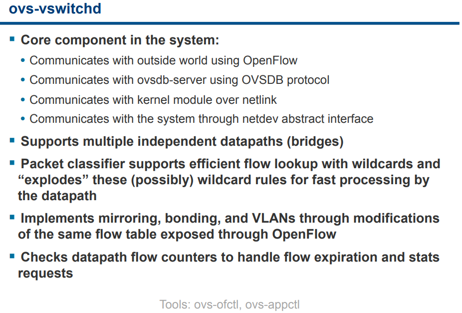

- [openvswitch](#openvswitch)
  - [下载和编译](#下载和编译)
    - [编译ovs2.9.3](#编译ovs293)
  - [运行](#运行)
  - [使用](#使用)
  - [常用命令](#常用命令)
    - [配flow举例](#配flow举例)
  - [性能相关](#性能相关)
  - [实例](#实例)
    - [PHY-PHY](#phy-phy)
    - [PHY-VM-PHY (vHost Loopback)](#phy-vm-phy-vhost-loopback)
    - [PHY-VM-PHY (vHost Loopback) (Kernel Forwarding)](#phy-vm-phy-vhost-loopback-kernel-forwarding)
    - [PHY-VM-PHY (vHost Multiqueue)](#phy-vm-phy-vhost-multiqueue)
  - [OVS选项pmd-cpu-mask](#ovs选项pmd-cpu-mask)
  - [关于多队列](#关于多队列)
    - [DPDK多队列](#dpdk多队列)
    - [默认情况](#默认情况)
    - [配成2个queue](#配成2个queue)
      - [OVS配置](#ovs配置)
      - [绑定pmd](#绑定pmd)
      - [VM配置](#vm配置)
  - [Vlan和QinQ](#vlan和qinq)
  - [QoS](#qos)
  - [OVS简介](#ovs简介)
  - [参考](#参考)

# openvswitch
## 下载和编译
OVS主页有下载链接, 官方也有git: https://github.com/openvswitch/ovs  
也可以用内部的OVS git库, 和官网是同步的:
```bash
git clone ssh://youraccount@bjsss013.hxtcorp.net:29418/networking/ovs
#注意OVS和DPDK的版本搭配, 比如OVS2.8.4配合DPDK17.08
git checkout v2.8.4
#记录一下安装准备
sudo yum group install "Development Tools"
#安装推荐的组件(可选), 详见http://docs.openvswitch.org/en/latest/intro/install/general/#build-requirements
yum install libcap-ng-devel openssl-devel unbound-devel
#生成configure(直接下载的tar包, 可略过这一步)
./boot.sh
#编译, 用with-dpdk参数. 需要dpdk已经成功编译并安装
#详见http://docs.openvswitch.org/en/latest/intro/install/dpdk/
DPDK_ROOT=/home/bai/repo/hxt/mainstream-dpdk-stable/
./configure --with-dpdk=$DPDK_ROOT/arm64-armv8a-linuxapp-gcc LIBS=-libverbs
#或者, 加上debug, 调试时使用
./configure --with-debug --with-dpdk=$DPDK_ROOT/arm64-armv8a-linuxapp-gcc LIBS=-libverbs CFLAGS="-g -O0"
#开始编译
make -j
sudo make install
```
> configure阶段, 要加参数`LIBS=-libverbs`, 因为Mellanox驱动会用到`/lib64/libibverbs.so.1`, 它是ofed驱动包安装到系统的.

### 编译ovs2.9.3
```
./boot.sh
sudo yum install python2-pip
sudo pip install --upgrade pip
sudo pip install six
DPDK_ROOT=/home/bai/repo/hxt/mainstream-dpdk-stable/
./configure --with-dpdk=$DPDK_ROOT/arm64-armv8a-linuxapp-gcc LIBS="-libverbs -lmlx5 -lmlx4"
make -j 
sudo make install
```
注: ofed4.4.1里面, 把ibverbs又分成了mlx4和mlx5
```
drivers/net/mlx4/Makefile:LDLIBS += -libverbs -lmlx4
drivers/net/mlx5/Makefile:LDLIBS += -libverbs -lmlx5
```

## 运行
```bash
export PATH=$PATH:/usr/local/share/openvswitch/scripts
sudo ovs-ctl start
#打开dpdk初始化
sudo ovs-vsctl --no-wait set Open_vSwitch . other_config:dpdk-init=true
#看log
sudo cat /usr/local/var/log/openvswitch/ovs-vswitchd.log
```
> 如果sudo命令找不到ovs相关的命令, 需要`sudo visudo`然后注释掉`secure_path`所在行, 否则出于安全原因, sudo会reset环境变量到secure_path提供的值.

## 使用
```bash
#新增一个bridge
sudo ovs-vsctl add-br ovsbr0 -- set bridge ovsbr0 datapath_type=netdev
#查看现有bridge
sudo ovs-vsctl show
sudo ovs-vsctl list-br
#列出Open_vSwitch表(root 表)
sudo ovs-vsctl list Open_vSwitch
#总表下面, 还有默认的几个表: Bridge Port Interface Controller等等
sudo ovs-vsctl list Bridge
sudo ovs-vsctl list Port
sudo ovs-vsctl list Interface

#先查看一下系统上的网卡情况
sudo ibdev2netdev -v
#添加dpdk端口
sudo ovs-vsctl add-port ovsbr0 dpdkp0 -- set Interface dpdkp0 type=dpdk options:dpdk-devargs=0005:01:00.0
#查看所有端口
sudo ovs-vsctl list-ports ovsbr0
#查看端口信息, 包括mtu, mac, 收发包统计
sudo ovs-vsctl list interface dpdkp1
#删除端口
sudo ovs-vsctl del-port dpdkp0
```

* 关于datapath_type
`sudo ovs-vsctl add-br ovsbr0 -- set bridge ovsbr0 datapath_type=netdev`执行后, `ifconfig -a`看到多出来两个interface, `ovsbr0`和`ovs-netdev`, 用`ethtool -i`查看, 发现driver都是`tun`
`datapath_type=netdev`是DPDK要求的方式, 详见http://docs.openvswitch.org/en/latest/howto/dpdk/
如果不设置, 默认是system方式. 和下面命令效果相同
`sudo ovs-vsctl set bridge ovsbr0 datapath_type=system`
会发现`ovs-netdev`变成了`ovs-system`, driver也由`tun`变成了`openvswitch`

* 对一个PCIe, 两个port的网卡, 用下面的命令添加端口
`ovs-vsctl add-port br0 dpdk-p0 -- set Interface dpdk-p0 type=dpdk options:dpdk-devargs="class=eth,mac=00:11:22:33:44:55"`
`ovs-vsctl add-port br0 dpdk-p0 -- set Interface dpdk-p1 type=dpdk options:dpdk-devargs="class=eth,mac=00:11:22:33:44:56"`

* 添加一个dpdk的port后, ovs会使一个core进入poll模式, 占用CPU100%. 
调用路径是`netdev_dpdk_rxq_recv()@ovs/lib/netdev-dpdk.c`->`rte_eth_rx_burst()@dpdk/lib/librte_ether/rte_ethdev.h`
```bash
$ sudo pstack 10320
Thread 1 (process 10320):
#0  mlx5_rx_burst (dpdk_rxq=0xfff78da20b80, pkts=<optimized out>, pkts_n=<optimized out>) at /home/bai/share/mint/repo/hxt/dpdk/drivers/net/mlx5/mlx5_rxtx.c:1805
#1  0x00000000007a3504 in rte_eth_rx_burst (nb_pkts=32, rx_pkts=0xffff08f9e2a0, queue_id=0, port_id=1 '\001') at /home/bai/share/mint/repo/hxt/dpdk/arm64-armv8a-linuxapp-gcc/include/rte_ethdev.h:2747
#2  netdev_dpdk_rxq_recv (rxq=<optimized out>, batch=0xffff08f9e290) at lib/netdev-dpdk.c:1733
#3  0x00000000006fbda8 in netdev_rxq_recv (rx=rx@entry=0xfff78d9ff600, batch=0xffff08f9e290, batch@entry=0xffff08f9e2b0) at lib/netdev.c:701
#4  0x00000000006d8740 in dp_netdev_process_rxq_port (pmd=pmd@entry=0xffff602e0010, rx=0xfff78d9ff600, port_no=2) at lib/dpif-netdev.c:3113
#5  0x00000000006d89c8 in pmd_thread_main (f_=0xffff602e0010) at lib/dpif-netdev.c:3854
#6  0x000000000074c9ec in ovsthread_wrapper (aux_=<optimized out>) at lib/ovs-thread.c:348
#7  0x0000ffff8aa17bb8 in start_thread () from /lib64/libpthread.so.0
#8  0x0000ffff8a7ffb50 in thread_start () from /lib64/libc.so.6
```

## 常用命令
```bash
#关闭megaflows, 默认打开的; 关闭后flow信息更详细
#根据文档, megaflow是microflow后面的一级cache, 应该算是第一级别的cache, 再后面是dpcls
$ sudo ovs-appctl list-commands | grep mega
  upcall/disable-megaflows
  upcall/enable-megaflows
  
#老化时间配置成一个小时, 默认是10秒
ovs-vsctl --no-wait set Open_vSwitch . other_config:max-idle=3600000
#统计 
sudo ovs-appctl dpctl/show --statistics 
#dump自动生成的flow信息, 哪个core, 什么action; 和上面命令对应着看
sudo ovs-appctl dpctl/dump-flows
#删除所有flow
sudo ovs-appctl dpctl/del-flows

#openflow信息, 能看link状态, 端口mac地址; 
sudo ovs-ofctl show ovsbr0 

#rxq具体信息: 哪个core在pulling哪个port的哪个q 
sudo ovs-appctl dpif-netdev/pmd-rxq-show

#pmd的信息, 包括emc hits, idle cycles, processing cycles等信息
sudo ovs-appctl dpif-netdev/pmd-stats-show
sudo ovs-appctl dpif-netdev/pmd-stats-clear -pmd 33
sudo ovs-appctl dpif-netdev/pmd-stats-show -pmd 33

#pmd的性能信息: 很好用, 但新版本才有; pps, emc hit等等
sudo ovs-appctl dpif-netdev/pmd-stats-clear && sleep 1 && sudo ovs-appctl dpif-netdev/pmd-perf-show -pmd 34
sudo ovs-appctl dpif-netdev/pmd-stats-clear && sleep 1 && sudo ovs-appctl dpif-netdev/pmd-perf-show | grep -E "thread|Rx|Tx"

#多个命令入口
sudo ovs-appctl list-commands
$ sudo ovs-appctl list-commands | grep show
  autoattach/show-isid    [bridge]
  bfd/show                [interface]
  bond/show               [port]
  cfm/show                [interface]
  coverage/show
  dpctl/ct-stats-show     [dp] [zone=N]
  dpctl/show              [dp...]
  dpif-netdev/pmd-perf-show [-nh] [-it iter-history-len] [-ms ms-history-len] [-pmd core] [dp]
  dpif-netdev/pmd-rxq-show [-pmd core] [dp]
  dpif-netdev/pmd-stats-show [-pmd core] [dp]
  dpif/show
  dpif/show-dp-features   bridge
  fdb/show                bridge
  fdb/stats-show          bridge
  lacp/show               [port]
  lacp/show-stats         [port]
  mdb/show                bridge
  memory/show
  ovs/route/show
  qos/show                interface
  qos/show-types          interface
  rstp/show               [bridge]
  stp/show                [bridge]
  tnl/arp/show
  tnl/neigh/show
  tnl/ports/show          -v
  upcall/show


#看看log
sudo tail -f /usr/local/var/log/openvswitch/ovs-vswitchd.log
#openflow信息, 能看link状态, 端口mac地址(交换机的端口也有mac地址?)
sudo ovs-ofctl show ovsbr0
#端口统计
sudo ovs-ofctl dump-ports ovsbr0

#底层端口信息: q个数, rxd/txd个数, mtu等
sudo ovs-appctl dpif/show

#修改mtu
sudo ovs-vsctl set Interface ovsbr0 mtu_request=4000
sudo ovs-vsctl set Interface dpdkp1 mtu_request=4000
sudo ovs-vsctl set Interface dpdkvhostuser0 mtu_request=4000
sudo ovs-vsctl set Interface dpdkvhostuser1 mtu_request=4000
```
### 配flow举例
```bash
#查现有flow(配置的flow, 不包括自动生成的flow)
$ sudo ovs-ofctl dump-flows ovsbr0

# 接口的name和ofport对应关系
sudo ovs-vsctl -- --columns=name,ofport list Interface

#从vhostuser0到vhostuser1
sudo ovs-vsctl set interface dpdkp1 ofport_request=1
sudo ovs-vsctl set interface "dpdkvhostuser0" ofport_request=2
sudo ovs-vsctl set interface "dpdkvhostuser1" ofport_request=3
sudo ovs-ofctl add-flow ovsbr0 in_port=2,action=output:3
sudo ovs-ofctl add-flow ovsbr0 in_port=3,action=output:2

#清除所有flow
sudo ovs-ofctl del-flows ovsbr0
#清除flow后加回默认flow, 否则端口都不通
sudo ovs-ofctl add-flow ovsbr0 actions=NORMAL

#查看详细的flow
sudo ovs-appctl dpif/dump-flows ovsbr0
#更详细的flow, 哪个core, 什么action
sudo ovs-appctl dpctl/dump-flows
```

[Open vSwitch Cheat Sheet](http://therandomsecurityguy.com/openvswitch-cheat-sheet/)
[详细命令参考](https://blog.csdn.net/rocson001/article/details/73163041)

## 性能相关
参考: http://docs.openvswitch.org/en/latest/intro/install/dpdk/#performance-tuning
需要考虑:
* OS level的优化, 比如: CPU频率, cmdline里面`isolcpus=<>`
* 编译选项的优化
* 多队列, 多核, 多描述符: `pmd-cpu-mask, options:n_rxq=<integer>, options:n_rxq_desc=<integer>`
* 亲和性: taskset, 或者在qemu配置里面vcpu pin
* 修改EMC(Exact Match Cache)大小: 这个EMC保存着fast path的流表, 修改`EM_FLOW_HASH_SHIFT` in `lib/dpif-netdev.c`, 适当改大点
* 关闭Rx Mergeable Buffers, 这个是给jumbo报文用的, reserve 描述符. `mrg_rxbuf=off`
* 报文缓存发送: Output Packet Batching: 对于中断驱动的VM的virtio driver来说, 发送报文是多缓存一些, 集中发送能显著减少中断次数, 从而显著减小guest里面的中断开销, 增大throughput, 但会增加latency.
* pmd绑定核
http://docs.openvswitch.org/en/latest/topics/dpdk/pmd/

```bash
#配置txq和rxq描述符个数: 通常描述符少则latency低, 但throughput不高; 描述符多则相反
ovs-vsctl set Interface dpdk0 options:n_rxq_desc=<integer>
ovs-vsctl set Interface dpdk0 options:n_txq_desc=<integer>
#配置flush时间为50us, 默认为0; 
ovs-vsctl set Open_vSwitch . other_config:tx-flush-interval=50
#另外还可尝试tx-burst-interval
```

## 实例
### PHY-PHY
两个dpdk的物理port
```bash
# Add userspace bridge
$ ovs-vsctl add-br br0 -- set bridge br0 datapath_type=netdev

# Add two dpdk ports
$ ovs-vsctl add-port br0 phy0 -- set Interface phy0 type=dpdk \
      options:dpdk-devargs=0000:01:00.0 ofport_request=1

$ ovs-vsctl add-port br0 phy1 -- set Interface phy1 type=dpdk
      options:dpdk-devargs=0000:01:00.1 ofport_request=2
```
配置flow, phy0和phy1互相转发
```bash
# Clear current flows
$ ovs-ofctl del-flows br0

# Add flows between port 1 (phy0) to port 2 (phy1)
$ ovs-ofctl add-flow br0 in_port=1,action=output:2
$ ovs-ofctl add-flow br0 in_port=2,action=output:1
```
PHY-PHY示意图  
  

### PHY-VM-PHY (vHost Loopback)
两个dpdk (PHY) ports, 两个dpdkvhostuser ports:
> vhost-user模式下(dpdkvhostuser), ovs是server, qemu是client; 新版本推荐使用同样是c-s模式的vhost-user-client模式(dpdkvhostuserclient), 此时ovs是client, qemu是server
```bash
# Add userspace bridge
$ ovs-vsctl add-br br0 -- set bridge br0 datapath_type=netdev

# Add two dpdk ports
$ ovs-vsctl add-port br0 phy0 -- set Interface phy0 type=dpdk \
      options:dpdk-devargs=0000:01:00.0 ofport_request=1

$ ovs-vsctl add-port br0 phy1 -- set Interface phy1 type=dpdk
      options:dpdk-devargs=0000:01:00.1 ofport_request=2

# Add two dpdkvhostuser ports
$ ovs-vsctl add-port br0 dpdkvhostuser0 \
    -- set Interface dpdkvhostuser0 type=dpdkvhostuser ofport_request=3
$ ovs-vsctl add-port br0 dpdkvhostuser1 \
    -- set Interface dpdkvhostuser1 type=dpdkvhostuser ofport_request=4
```
> 增加vhost-user端口后, 会在`/usr/local/var/run/openvswitch/`下生成socket文件, 起VM的时候要作为参数传给qemu

配流:
```bash
# Clear current flows
$ ovs-ofctl del-flows br0

# Add flows
$ ovs-ofctl add-flow br0 in_port=1,action=output:3
$ ovs-ofctl add-flow br0 in_port=3,action=output:1
$ ovs-ofctl add-flow br0 in_port=4,action=output:2
$ ovs-ofctl add-flow br0 in_port=2,action=output:4

# Dump flows
$ ovs-ofctl dump-flows br0
```
用qemu起一个VM
```bash
$ export VM_NAME=vhost-vm
$ export GUEST_MEM=3072M
$ export QCOW2_IMAGE=/root/CentOS7_x86_64.qcow2
$ export VHOST_SOCK_DIR=/usr/local/var/run/openvswitch

$ taskset 0x20 qemu-system-x86_64 -name $VM_NAME -cpu host -enable-kvm \
  -m $GUEST_MEM -drive file=$QCOW2_IMAGE --nographic -snapshot \
  -numa node,memdev=mem -mem-prealloc -smp sockets=1,cores=2 \
  -object memory-backend-file,id=mem,size=$GUEST_MEM,mem-path=/dev/hugepages,share=on \
  -chardev socket,id=char0,path=$VHOST_SOCK_DIR/dpdkvhostuser0 \
  -netdev type=vhost-user,id=mynet1,chardev=char0,vhostforce \
  -device virtio-net-pci,mac=00:00:00:00:00:01,netdev=mynet1,mrg_rxbuf=off \
  -chardev socket,id=char1,path=$VHOST_SOCK_DIR/dpdkvhostuser1 \
  -netdev type=vhost-user,id=mynet2,chardev=char1,vhostforce \
  -device virtio-net-pci,mac=00:00:00:00:00:02,netdev=mynet2,mrg_rxbuf=off
```
> 前面说过, ovs的vhost-user port会生成socket文件, 要传到qemu; 另外, qemu必须在hugetlbfs上为vm分配大页内存, 让vhost-user port能够访问在大页上的vitio-net设备的虚拟rings和packet buffers

配多个queue举例:
```
-chardev socket,id=char2,path=/usr/local/var/run/openvswitch/vhost-user-2
-netdev type=vhost-user,id=mynet2,chardev=char2,vhostforce,queues=$q
-device virtio-net-pci,mac=00:00:00:00:00:02,netdev=mynet2,mq=on,vectors=$v
```

在VM里面编译DPDK, 运行testpmd
```bash
$ cd $DPDK_DIR/app/test-pmd;
$ ./testpmd -c 0x3 -n 4 --socket-mem 1024 -- \
    --burst=64 -i --txqflags=0xf00 --disable-hw-vlan
$ set fwd mac retry
$ start
```
PHY-VM-PHY示意图:  
  

这个例子中, 在VM里跑testpmd, 跑完了要还原vNIC的driver到kernel
```bash
$ $DPDK_DIR/usertools/dpdk-devbind.py --bind=virtio-pci 0000:00:03.0
$ $DPDK_DIR/usertools/dpdk-devbind.py --bind=virtio-pci 0000:00:04.0
```
### PHY-VM-PHY (vHost Loopback) (Kernel Forwarding)
在VM不用dpdk-testpmd, 而是用kernel协议栈做转发
```bash
$ ip addr add 1.1.1.2/24 dev eth1
$ ip addr add 1.1.2.2/24 dev eth2
$ ip link set eth1 up
$ ip link set eth2 up
$ systemctl stop firewalld.service
$ systemctl stop iptables.service
$ sysctl -w net.ipv4.ip_forward=1
$ sysctl -w net.ipv4.conf.all.rp_filter=0
$ sysctl -w net.ipv4.conf.eth1.rp_filter=0
$ sysctl -w net.ipv4.conf.eth2.rp_filter=0
$ route add -net 1.1.2.0/24 eth2
$ route add -net 1.1.1.0/24 eth1
$ arp -s 1.1.2.99 DE:AD:BE:EF:CA:FE
$ arp -s 1.1.1.99 DE:AD:BE:EF:CA:EE
```
### PHY-VM-PHY (vHost Multiqueue)

部分命令:
```
$ ovs-vsctl set Open_vSwitch . other_config:pmd-cpu-mask=0xc
$ ovs-vsctl set Interface phy0 options:n_rxq=2
$ ovs-vsctl set Interface phy1 options:n_rxq=2
```
> 对虚拟网卡dpdkvhostuser也可以设置n_rxq
请参考: http://docs.openvswitch.org/en/latest/howto/dpdk/#phy-vm-phy-vhost-multiqueue

## OVS选项pmd-cpu-mask
```bash
#dpdk-lcore-mask是指DPDK可以运行在哪些core上(有可能运行dpdk的core), 这里是core 0, 22, 44不能跑dpdk
#非datapath线程运行的core, 对性能影响不大
sudo ovs-vsctl --no-wait set Open_vSwitch . other_config:dpdk-lcore-mask=0xffffefffffbffffe
#这是个2 node的numa系统, 每个node分配1024M内存
sudo ovs-vsctl --no-wait set Open_vSwitch . other_config:dpdk-socket-mem="1024,1024"
#pmd-cpu-mask是指哪些core运行PMD(实际运行PMD的core), core 1 2 3 4, 45 46 47 48跑DPDK
sudo ovs-vsctl set Open_vSwitch . other_config:pmd-cpu-mask=1E0000000001E
```
> The dpdk-lcore-mask is a core bitmask that is used during DPDK initialization and it is where the non-datapath OVS-DPDK threads such as handler and revalidator threads run. As these are for non-datapath operations, the dpdk-lcore-mask does not have any significant performance impact on multiple NUMA systems. There is a nice default option when dpdk-lcore-mask is not set, in which the OVS-DPDK cpuset will be used for handler and revalidator threads. This means they can be scheduled across multiple cores by the Linux scheduler.

参考: https://software.intel.com/en-us/articles/set-up-open-vswitch-with-dpdk-on-ubuntu-server
https://developers.redhat.com/blog/2017/06/28/ovs-dpdk-parameters-dealing-with-multi-numa/


## 关于多队列
### DPDK多队列
参考: http://docs.openvswitch.org/en/latest/topics/dpdk/pmd/

### 默认情况
默认情况下, OVS和VM之间使用一个Queue(一对RX和TX), 如下图:

vhost-user 默认配置:  
  

更进一步讲, 物理NIC默认也是一个Queue来从物理网卡发送和接收(图中NIC部分的Q0); Host上的OVS-DPDK, 也是用一个Queue, 通过一个PMD来收发包; VM上的VNIC, 一般是内核态的virtio驱动(也可以是用户态dpdk的), 也是用一个queue.

### 配成2个queue
可以配置2个queue, 如下图:

vhost-user 2 queue:  
  

#### OVS配置
```bash
#Add a bridge ‘br0’ as type netdev.
ovs-vsctl add-br br0 -- set Bridge br0 datapath_type=netdev
#Add physical port as ‘dpdk0’, as port type=dpdk and request ofport=1.
ovs-vsctl add-port br0 dpdk0 -- set Interface dpdk0 type=dpdk ofport_request=1
#Add vHost-user port as ‘vhost-user0’, as port type= dpdkvhostuser and request ofport=2.
ovs-vsctl add-port br0 vhost-user0 -- set Interface vhost-user0 type=dpdkvhostuser ofport_request=2
#Delete any existing flows on the bridge.
ovs-ofctl del-flows br0
#Configure flow to send traffic received on port 1 to port 2 (dpdk0 to vhost-user0).
ovs-ofctl add-flow br0 in_port=1,action=output:2
#Set the PMD thread configuration to two threads to run on the host. In this example core 2 and core 3 on the host are used.
ovs-vsctl set Open_vSwitch . other_config:pmd-cpu-mask=C
#Set the number of receive queues for the physical port ‘dpdk0’ to 2.
ovs-vsctl set Interface dpdk0 options:n_rxq=2
#Set the number of receive queues for the vHost-user port ‘vhost-user0’ to 2.
ovs-vsctl set Interface vhost-user0 options:n_rxq=2
```
#### 绑定pmd
```
#配置多queue, 绑定pmd core
sudo ovs-vsctl set Interface dpdkvhostuser0 options:n_rxq=2 other_config:pmd-rxq-affinity="0:34,1:35"
```

#### VM配置
```bash
./qemu/x86_64-softmmu/qemu-system-x86_64 -cpu host -smp 2,cores=2 -hda /root/fedora-22.img -m 2048M --enable-kvm -object memory-backend-file,id=mem,size=2048M,mem-path=/dev/hugepages,share=on -numa node,memdev=mem -mem-prealloc -chardev socket,id=char1,path=/usr/local/var/run/openvswitch/vhost-user0 -netdev type=vhost-user,id=mynet1,chardev=char1,vhostforce,queues=2 -device virtio-net-pci,mac=00:00:00:00:00:01,netdev=mynet1,mq=on,vectors=6
```
vectors的个数是2*queue个数+2

参数如下:  
  

参考: https://software.intel.com/en-us/articles/configure-vhost-user-multiqueue-for-ovs-with-dpdk

## Vlan和QinQ
测试示意图:  
  

在Host B上:
```bash
#将两个VM对应的port加入vlan 100(外层 vlan), 并配置cvlan(内层 vlan)为0和10
sudo ovs-vsctl set port dpdkvhostuser0 vlan_mode=dot1q-tunnel tag=100 cvlans=0,10 other-config:qinq-ethtype=802.1q
sudo ovs-vsctl set port dpdkvhostuser1 vlan_mode=dot1q-tunnel tag=100 cvlans=0,10 other-config:qinq-ethtype=802.1q
#将物理网卡加入vlan 100, native-tagged是说出端口带tag, 详见ofproto/ofproto.h
sudo ovs-vsctl set port dpdkp1 vlan_mode=native-tagged tag=100 other-config:qinq-ethtype=802.1q
```
在VM01上
```bash
#配置vm01的接口IP为192.168.1.100
ip addr add 192.168.1.100/24 dev eth1
#增加vlan 10
ip link add link eth1 name eth1.10 type vlan id 10
#给vlan 10子接口配置IP
ip addr add 192.168.10.100/24 dev eth1.10
ip link set up dev eth1.10
```
在VM02上
```bash
#配置vm01的接口IP为192.168.1.200
ip addr add 192.168.1.200/24 dev eth1
#增加vlan 10
ip link add link eth1 name eth1.10 type vlan id 10
#给vlan 10子接口配置IP
ip addr add 192.168.10.200/24 dev eth1.10
ip link set up dev eth1.10
```

## QoS
OVS支持Ingress和Egress两个方向的流控, 注意: 方向是对OVS来说的.
- Egress
OVS的出方向, 限制OVS发包速率
参考: https://software.intel.com/en-us/articles/qos-configuration-and-usage-for-open-vswitch-with-dpdk
    ```bash
    #查看port支持的qos类型, 目前只有egress-policer for OVS-DPDK
    $ sudo ovs-appctl -t ovs-vswitchd qos/show-types "dpdkp1"
    QoS type: egress-policer
    bai@CentOS-43 ~/share/mint/repo/hxt/packages/libvirt-4.6.0
    $ sudo ovs-appctl -t ovs-vswitchd qos/show-types "dpdkvhostuser0"
    QoS type: egress-policer
    #查看当前QoS配置
    ovs-appctl -t ovs-vswitchd qos/show vhost-user2
    #清除QoS配置
    ovs-vsctl -- destroy QoS vhost-user2 -- clear Port vhost-user2 qos
    #限制vhost-user2这个port发送到对端VM的速率, cir是Byte/second, 换算成bit是10M bps
    ovs-vsctl set port vhost-user2 qos=@newqos -- --id=@newqos create qos type=egress-policer other-config:cir=1250000 other-config:cbs=2048
    ```
    其中:
    - `type= egress-policer`: The QoS type to set on the port. In this case ‘egress-policer’.
    - `other_config=cir`: Committed Information Rate, the maximum rate (in bytes) that the port should be allowed to send.
    - `other_config=cbs`: Committed Burst Size measured in bytes and represents a token bucket. At a minimum should be set to the expected largest size packet.

- Ingress
OVS的入方向, 对它所连接的对端eg.VM来说, 是限制其发速率
    - `ingress_policing_rate`
    the maximum rate (in Kbps) that this VM should be allowed to send
    - `ingress_policing_burst`
    a parameter to the policing algorithm to indicate the maximum amount of data (in Kb) that this interface can send beyond the policing rate.
    ```bash
    #限制入口速率1 Mbps
    $ ovs-vsctl set interface tap0 ingress_policing_rate=1000
    $ ovs-vsctl set interface tap0 ingress_policing_burst=100
    #查看配置 
    ovs-vsctl list interface tap0
    #清除速度限制
    $ ovs-vsctl set interface vhost-user0 ingress_policing_rate=0
    ```

## OVS简介
  
  
  
  
  
  
  
  
  
  
  
  
  

## 参考
* [dpdk howto](http://docs.openvswitch.org/en/latest/howto/dpdk/)
* [dpdk vhost-user](http://docs.openvswitch.org/en/latest/topics/dpdk/vhost-user/)
* [DPDK在OpenStack中的实现](http://syswift.com/183.html)


