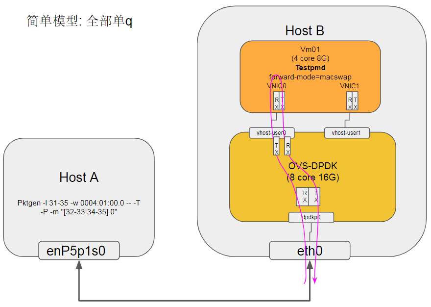
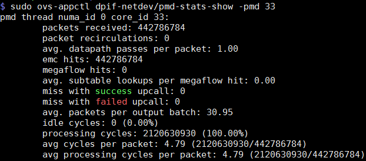
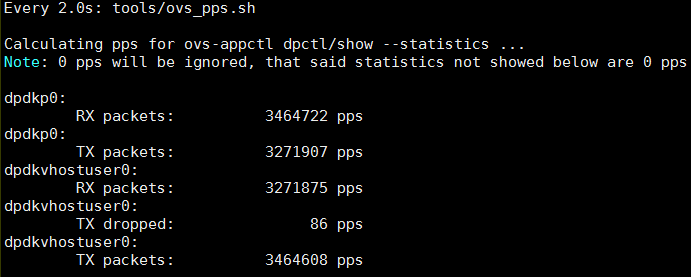
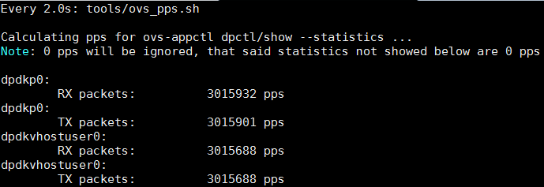
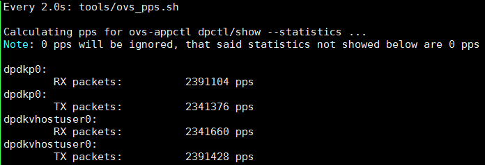
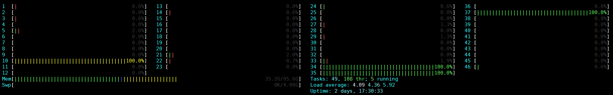
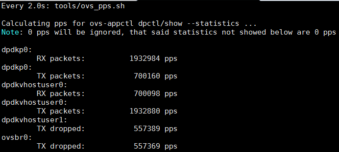
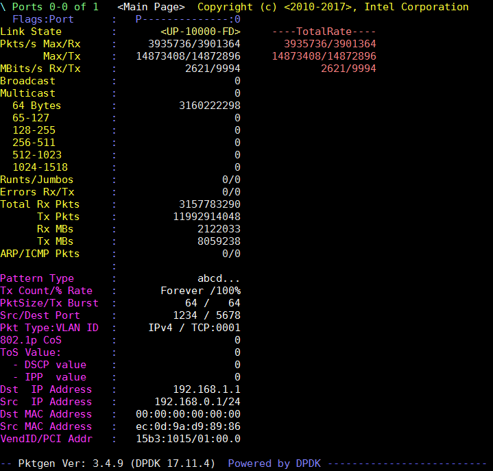

- [环境](#环境)
- [配置](#配置)
  - [OVS配置](#ovs配置)
  - [VM配置](#vm配置)
- [实验1 OVS全部1Q](#实验1-ovs全部1q)
  - [拓扑模型](#拓扑模型)
    - [拓扑1](#拓扑1)
    - [拓扑2](#拓扑2)
    - [性能结果](#性能结果)
  - [拓扑1运行数据](#拓扑1运行数据)
  - [拓扑1多流(TCP)运行数据](#拓扑1多流tcp运行数据)
    - [pktgen命令参考](#pktgen命令参考)
    - [性能数据](#性能数据)
    - [可能的瓶颈](#可能的瓶颈)
  - [配flow](#配flow)
  - [解决vm里面testpmd性能不够问题](#解决vm里面testpmd性能不够问题)
  - [拓扑2运行数据](#拓扑2运行数据)

# 环境
服务器 | Host A 10.129.41.129 | Host B 10.129.41.130 | Note
-----|-----|-----|-----|
Socket| 1 | 1 | 单socket
CPU | 48core@2.6G HXT1.0 | 46core@2.6G HXT1.0 | `sudo dmidecode -t processor`
MEM | 96G | 96G | `free -h`
NIC | MLX CX4121A 10G 0004:01:00.0 enP4p1s0f0| MLX CX4121A 10G 0004:01:00.0 enP4p1s0f0| `ibdev2netdev -v`
NIC | MLX CX4121A 10G 0004:01:00.1 enP4p1s0f1| MLX CX4121A 10G 0004:01:00.1 enP4p1s0f1| `ibdev2netdev -v`
OS | CentOS 7.5.1804 | CentOS 7.5.1804 | `cat /etc/redhat-release`
kernel | 4.14.62-5.hxt.aarch64 | 4.14.62-5.hxt.aarch64 | `uname -r`
Mellanox OFED version | 4.4-1.0.0.0 | 4.4-1.0.0.0 | `ofed_info -s`
QEMU version | NA | 2.12.1 | `qemu-system-aarch64 --version` 源码编译
DPDK version | 17.11.4 | 17.11.4 | 源码编译
pktgen version |3.4.9 | NA | 源码编译
OVS(with DPDK) version | NA | 2.10.1(with dpdk 17.11.4) | `sudo ovs-vsctl show` 源码编译
libvirt version | NA | 4.6.0 | 源码编译
virt-manager version | NA | 1.5.1 | 源码安装

# 配置
预置条件: DPDK, OVS, Qemu, libvirt, virt-manager已经成功编译安装

## OVS配置
OVS选项 | 值 | 说明
----|----|-----|
dpdk-init | true |
bridge | ovsbr0 |
pmd-cpu-mask | FF00000000 | 8个core 32 33 34 35 36 37 38 39
dpdk-socket-mem | 16384 | 单socket 16G
vhost-user port 0 |  dpdkvhostuser0 |
vhost-user port 1 |  dpdkvhostuser1 |
dpdk port0 | dpdkp0 | MLX CX4 10G NIC

```bash
#增加32G的hugepage
sudo bash -c "echo 64 > /sys/kernel/mm/hugepages/hugepages-524288kB/nr_hugepages"
#开始ovs
export PATH=$PATH:/usr/local/share/openvswitch/scripts
sudo ovs-ctl start
#打开硬件offload, 2.10才有; 2.9.3没效果
#miniflow_extract, dpcls_lookup等函数被offload了
sudo ovs-vsctl --no-wait set Open_vSwitch . other_config:hw-offload=true
#多条流会有用? :提高~15%
sudo ovs-vsctl --no-wait set Open_vSwitch . other_config:smc-enable=true

#打开dpdk初始化
sudo ovs-vsctl --no-wait set Open_vSwitch . other_config:dpdk-init=true
#新增一个bridge, 使用用户态datapath模式
sudo ovs-vsctl add-br ovsbr0 -- set bridge ovsbr0 datapath_type=netdev
#配置pmd跑在8个核上, core 32 33 34 35 36 37 38 39
sudo ovs-vsctl set Open_vSwitch . other_config:pmd-cpu-mask=FF00000000
#配置使用node0的16G内存.
sudo ovs-vsctl --no-wait set Open_vSwitch . other_config:dpdk-socket-mem="16384"

#增加物理port, 对应物理NIC
sudo ovs-vsctl add-port ovsbr0 dpdkp0 -- set Interface dpdkp0 type=dpdk options:dpdk-devargs=0004:01:00.0
#增加两个port, 类型是dpdkvhostuserclient
sudo ovs-vsctl add-port ovsbr0 dpdkvhostuser0 -- set Interface dpdkvhostuser0 type=dpdkvhostuserclient
sudo ovs-vsctl set Interface dpdkvhostuser0 options:vhost-server-path="/tmp/dpdkvhostuser0"
sudo ovs-vsctl add-port ovsbr0 dpdkvhostuser1 -- set Interface dpdkvhostuser1 type=dpdkvhostuserclient
sudo ovs-vsctl set Interface dpdkvhostuser1 options:vhost-server-path="/tmp/dpdkvhostuser1"

#以下为可选配置
#配置多queue
sudo ovs-vsctl set Interface dpdkvhostuser0 options:n_rxq=2
sudo ovs-vsctl set Interface dpdkvhostuser1 options:n_rxq=2
#设置物理port使用2个q
sudo ovs-vsctl set Interface dpdkp0 options:n_rxq=2
```

## VM配置
预置条件: libvirtd已经成功启动
先用virt-manager创建2个VM, 配置如下:
VM | VM01 | VM02
---|---|---|
CPUs | 4 | 4
Memory | 8192M | 8192M
Disk | hxt-centos7.5-01.qcow2 32G | hxt-centos7.5-02.qcow2 32G
NIC(for external Net) | virtio NAT |  virtio NAT
NIC(for test) | vhostuser0 | vhostuser0
NIC(for test) | vhostuser1 | vhostuser1
```bash
#启动libvirtd服务
sudo systemctl start libvirtd
#启动virt-manager
sudo xauth add $(xauth -f /home/bai/.Xauthority list | tail -1) 
sudo virt-manager -c 'qemu+unix:///system?socket=/usr/local/var/run/libvirt/libvirt-sock'
#启动一个VM, 这个VM配置如上
sudo virsh create ~/repo/save/vm/2vhostuser.xml
```

# 实验1 OVS全部1Q
```bash
$ sudo ovs-vsctl set Interface dpdkp0 options:n_rxq=1
$ sudo ovs-vsctl set Interface dpdkvhostuser0 options:n_rxq=1
$ sudo ovs-vsctl set Interface dpdkvhostuser1 options:n_rxq=1

$ sudo ovs-appctl dpif/show
netdev@ovs-netdev: hit:8540019443 missed:406
        ovsbr0:
                dpdkp0 3/4: (dpdk: configured_rx_queues=1, configured_rxq_descriptors=2048, configured_tx_queues=9, configured_txq_descriptors=2048, lsc_interrupt_mode=false, mtu=1500, requested_rx_queues=1, requested_rxq_descriptors=2048, requested_tx_queues=9, requested_txq_descriptors=2048, rx_csum_offload=true)
                dpdkvhostuser0 1/2: (dpdkvhostuser: configured_rx_queues=1, configured_tx_queues=1, mtu=1500, requested_rx_queues=1, requested_tx_queues=1)
                dpdkvhostuser1 2/3: (dpdkvhostuser: configured_rx_queues=1, configured_tx_queues=1, mtu=1500, requested_rx_queues=1, requested_tx_queues=1)
                ovsbr0 65534/1: (tap)
```
## 拓扑模型
### 拓扑1
pktgen发64字节小包, 单条流, 目的mac随意, 经过OVS到VM, VM跑testpmd macswap转发, 只经过一个vhost user port

在VM上执行
`sudo arm64-armv8a-linuxapp-gcc/app/testpmd -w 04:00.0 -- -i --forward-mode=macswap`

拓扑1: 经过1个vhostuser port, 单q  
  

### 拓扑2
在VM上执行
`sudo arm64-armv8a-linuxapp-gcc/app/testpmd  -- -i --forward-mode=macswap`

拓扑2: 经过2个vhostuser port, 单q  
  

### 性能结果
上面两个图性能差不多, 大约如下:

Frame Size (Bytes) | Max Line Rate (Mpps) | Throughput (Mpps) | % Line Rate
----|----|-----|----
64 | 14.88 | 3.85 | 25.87%
128 | 8.45 | 3.33 | 39.40%
256 | 4.53 | 3.25 | 71.74%
512 | 2.35 | 2.35 | 100%
1024 |  1.20 | 1.20 | 100%
1518 |  0.81 | 0.81 | 100%


## 拓扑1运行数据
  

稳定状态下OVS的pps统计  
  

调查对象 | 运行状况
----|----|
rxq分布|   
core 33统计 |   
core 34统计 |   

## 拓扑1多流(TCP)运行数据
case# |L2 flow# |L3 flow#|dst ip | src ip | dst port | src port | dst mac | src mac 
----|----|----|----|----|----|----|----|----
pktgen default single|`1`|`1`| 192.168.1.1 | 192.168.0.1 | 5678|1234|00:00:00:00:00:00|ec:0d:9a:d9:89:86|
pktgen default range|`1`|`254*255*255 = 16516350`| 192.168.1.{1..254} | 192.168.0.1 | {0..254}|{0..254}|00:00:00:00:00:00|ec:0d:9a:d9:89:86
case 1 |`1`|`2*255*255 = 130050`| 192.168.1.{1..2} | 192.168.0.1 | {0..254}|{0..254}|00:00:00:00:00:00|ec:0d:9a:d9:89:86
case 2 |`2`|`1`| 192.168.1.1 | 192.168.0.1 | 0|0|00:00:00:00:00:00|00:00:00:00:00:{01 .. 02}
case 3 |`4`|`1`| 192.168.1.1 | 192.168.0.1 | 0|0|00:00:00:00:00:00|00:00:00:00:00:{01 .. 04}
case 4(CMCC) |`10000`|`1`| 192.168.1.1 | 192.168.0.1 | 0|0|00:00:00:00:00:00|00:00:00:00:{00:01 .. 27:10}
case 5 |`8`|`1`| 192.168.1.1 | 192.168.0.1 | 0|0|00:00:00:00:00:00|00:00:00:00:00:{01 .. 08}
case 6 |`255`|`1`| 192.168.1.1 | 192.168.0.1 | 0|0|00:00:00:00:00:00|00:00:00:00:00:{01 .. ff}
case 7 |`2000`|`1`| 192.168.1.1 | 192.168.0.1 | 0|0|00:00:00:00:00:00|00:00:00:00:{00:01 .. 07:d0}
case 8 |`4000`|`1`| 192.168.1.1 | 192.168.0.1 | 0|0|00:00:00:00:00:00|00:00:00:00:{00:01 .. 0f:a0}
case 9 |`3000`|`1`| 192.168.1.1 | 192.168.0.1 | 0|0|00:00:00:00:00:00|00:00:00:00:{00:01 .. 0b:b8}
case 10 |`2500`|`1`| 192.168.1.1 | 192.168.0.1 | 0|0|00:00:00:00:00:00|00:00:00:00:{00:01 .. 09:c4}

注:
* case 4(CMCC): 是CMCC NFV测试规范里的要求配置: 

CMCC NFV测试规范: 7.3.5.1	基于10GE网卡的网络转发性能  
  

### pktgen命令参考
```bash
enable 0 range
#从默认状态的range, IP变化2个
range 0 dst ip max 192.168.1.2
#从默认状态的range, 改为range模式的单流
range 0 dst ip inc 0.0.0.0
range 0 dst port inc 0
range 0 src port inc 0
#改变src mac, 10000个
range 0 src mac 00:00:00:00:00:01 00:00:00:00:00:01 00:00:00:00:27:10 00:00:00:00:00:01
#改变src mac, 2个
range 0 src mac 00:00:00:00:00:01 00:00:00:00:00:01 00:00:00:00:00:02 00:00:00:00:00:01
#改变src mac, 2000个
range 0 src mac 00:00:00:00:00:01 00:00:00:00:00:01 00:00:00:00:07:d0 00:00:00:00:00:01
```

### 性能数据
case |L2 flow# |L3 flow#| Throughput@64B (Mpps) | OVS flow# | Note
----|----|----|----|----|----|
pktgen default single |`1`|`1`| 3.82 | 2 |   
case 1 |`1`|`2*255*255 = 130050`| 3.32 | 2 |   
pktgen default range|`1`|`254*255*255 = 16516350`| 2.31 | 2 |   
case 2 |`2`|`1`| 3.00 | 4 |   
case 3 |`4`|`1`| 2.58 | 8
case 5 |`8`|`1`| 2.31 | 16 |   
case 6 |`255`|`1`| 1.89 | 510 |   
case 7 |`2000`|`1`| 1.77 | 4000 |   
以上case的htop|----|----|----|----|   
以下case OVS开始"不正常"|----|----|----|----|   
case 10 |`2500`|`1`| 1.30 | 5000 |   
case 9 |`3000`|`1`| 1.10 | 6000 | 
case 8 |`4000`|`1`| 0.88 | 8000 |   
case 4(CMCC) |`10000`|`1`| 0.68 | 20000 |   

注:
* 查OVS的flow数:
`sudo ovs-appctl dpctl/show --statistics`
* dpdkvhostuser0时不时有TX dropped

### 可能的瓶颈
首先是VM里面的testpmd?
其次是dpdkp0收包?

## 配flow
```
#配flow
sudo ovs-vsctl set interface dpdkp0 ofport_request=1 
sudo ovs-vsctl set interface "dpdkvhostuser0" ofport_request=2 
sudo ovs-vsctl set interface "dpdkvhostuser1" ofport_request=3 
sudo ovs-ofctl add-flow ovsbr0 in_port=1,action=output:2 
sudo ovs-ofctl add-flow ovsbr0 in_port=2,action=output:1
```
手动配端口flow之后, 源mac变化的所有case里, 自动生成的flow个数一直保持为2, 性能的下降也变小了很多; 对比之前没有配置port flow规则的时候, 生成的flow个数和源mac个数正相关.

```bash
$ sudo ovs-ofctl dump-flows ovsbr0
 cookie=0x0, duration=735.584s, table=0, n_packets=2560466336, n_bytes=153627980160, in_port=dpdkp0 actions=output:dpdkvhostuser0
 cookie=0x0, duration=734.856s, table=0, n_packets=1393435005, n_bytes=83606100300, in_port=dpdkvhostuser0 actions=output:dpdkp0
 cookie=0x0, duration=232599.667s, table=0, n_packets=20420892318, n_bytes=1225253539080, priority=0 actions=NORMAL

$ sudo ovs-appctl dpctl/dump-flows
flow-dump from pmd on cpu core: 39
recirc_id(0),in_port(1),packet_type(ns=0,id=0),eth_type(0x0800),ipv4(frag=no), packets:109149103, bytes:6548946180, used:0.000s, flags:., actions:3
flow-dump from pmd on cpu core: 34
recirc_id(0),in_port(3),packet_type(ns=0,id=0),eth_type(0x0800),ipv4(frag=no), packets:54566419, bytes:3273985140, used:0.000s, flags:., actions:1
```

## 解决vm里面testpmd性能不够问题

## 拓扑2运行数据
pktgen发64字节小包, 经过OVS到VM, VM跑testpmd macswap转发, 经过2个vhost user port

  

dpdkp0收包

```
dpdkp0:
        RX packets:          4310802 pps
dpdkp0:
        TX packets:          3918137 pps
dpdkvhostuser0:
        RX packets:          3688044 pps
dpdkvhostuser0:
        TX packets:           250301 pps
dpdkvhostuser1:
        RX packets:           229745 pps
dpdkvhostuser1:
        TX packets:          4060117 pps
```
