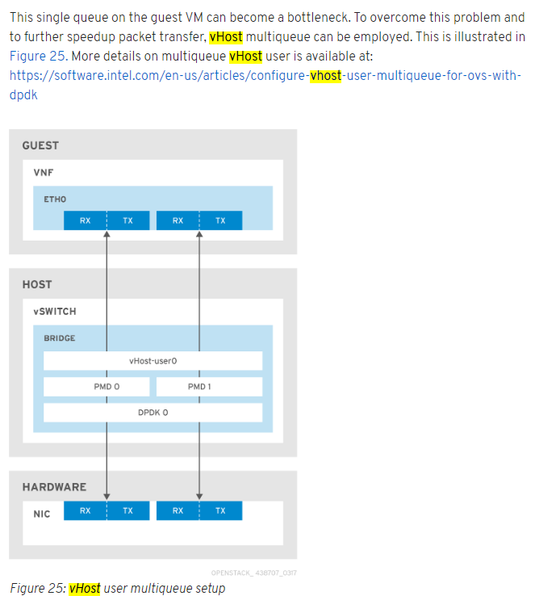
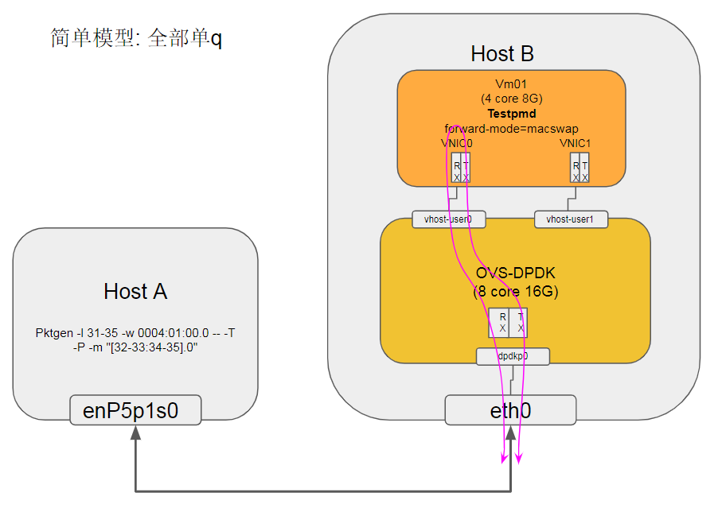
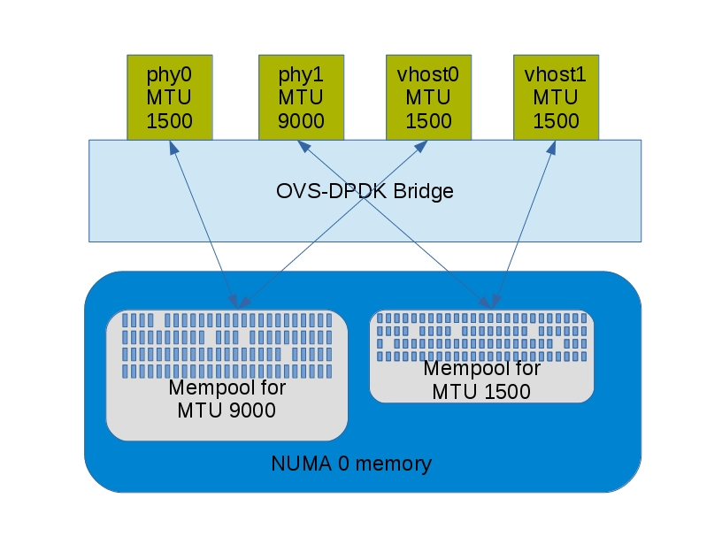
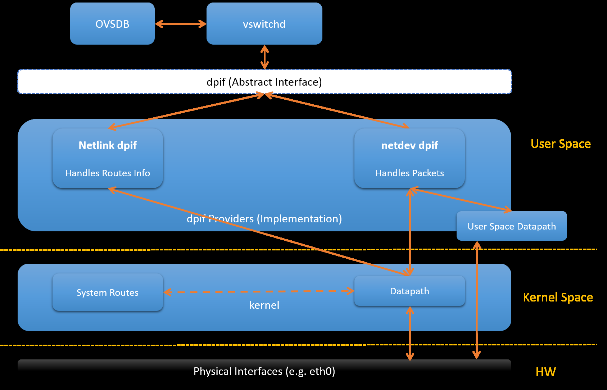
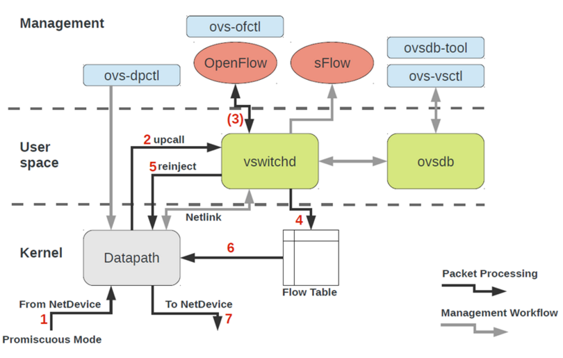
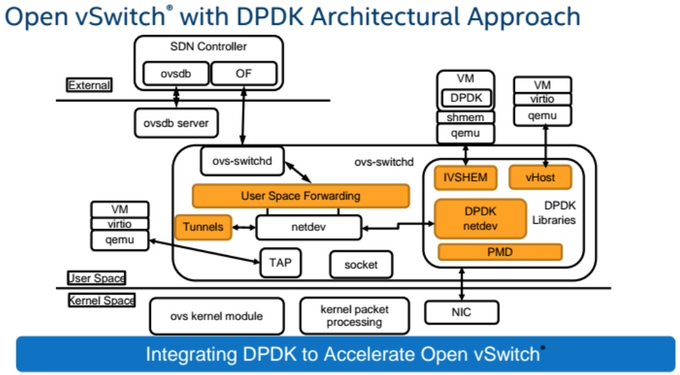
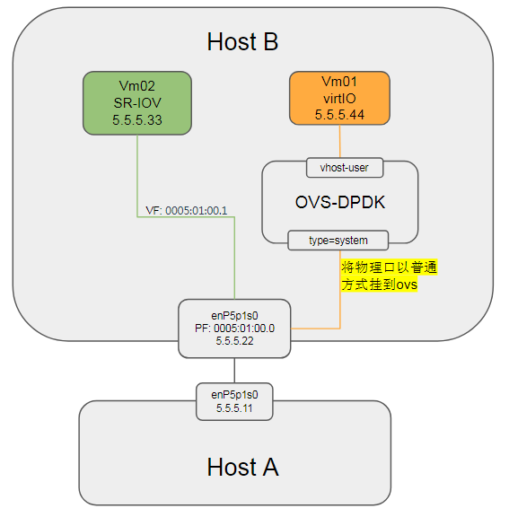

- [vhost-user协议](#vhost-user协议)
- [KVM的irqfd和ioeventfd](#kvm的irqfd和ioeventfd)
  - [irqfd](#irqfd)
  - [ioeventfd](#ioeventfd)
- [eventfd在ovs的使用](#eventfd在ovs的使用)
  - [qemu的通知机制](#qemu的通知机制)
  - [qemu里的eventfd](#qemu里的eventfd)
  - [eventfd由qemu通过msg传递到ovs-dpdk](#eventfd由qemu通过msg传递到ovs-dpdk)
  - [在dpdk的vhost驱动中, 写eventfd](#在dpdk的vhost驱动中-写eventfd)
  - [补充: 通过unix socket来传递文件描述符](#补充-通过unix-socket来传递文件描述符)
- [关于OVS流匹配](#关于ovs流匹配)
- [smc-enable: signature match cache](#smc-enable-signature-match-cache)
- [vhost协议](#vhost协议)
  - [vhost架构](#vhost架构)
  - [补充](#补充)
- [OVS-DPDK关键路径](#ovs-dpdk关键路径)
  - [dpdkp0的关键路径](#dpdkp0的关键路径)
  - [vhostuser0的关键路径](#vhostuser0的关键路径)
- [buffer到底多大](#buffer到底多大)
- [datapath](#datapath)
  - [kernel datapath](#kernel-datapath)
  - [userspace datapath](#userspace-datapath)
  - [Architecure](#architecure)
- [vport类型](#vport类型)
  - [netdev](#netdev)
  - [internal](#internal)
  - [patch](#patch)
  - [tunnel vports: vxlan, gre, etc](#tunnel-vports-vxlan-gre-etc)
- [用户态通过物理口发包流程](#用户态通过物理口发包流程)
  - [使用perf抓关键路径](#使用perf抓关键路径)
  - [结论](#结论)

# vhost-user协议
详见`qemu/docs/interop/vhost-user.txt`
* Qemu是master, ovs是slave; master通过unix socket共享它的虚拟队列(virtqueues);
* 当OVS的虚拟port是dpdkvhostuserclient模式时, 这个socket由Qemu来listen, 由OVS来connect
* 在socket上, 传递消息的格式如下:  
```
------------------------------------ 
| request | flags | size | payload | 
------------------------------------ 
 
 * Request: 32-bit type of the request 
 * Flags: 32-bit bit field: 
   - Lower 2 bits are the version (currently 0x01) 
   - Bit 2 is the reply flag - needs to be sent on each reply from the slave 
   - Bit 3 is the need_reply flag - see VHOST_USER_PROTOCOL_F_REPLY_ACK for 
     details. 
 * Size - 32-bit size of the payload 
```
* payload格式会根据不同的类型来改变, 比如vring状态描述, vring地址描述, 内存地址描述, IOTLB消息, virtio配置空间  
```c
//消息定义 
typedef struct VhostUserMsg { 
    VhostUserRequest request; 
    uint32_t flags; 
    uint32_t size; 
    union { 
        uint64_t u64; 
        struct vhost_vring_state state; 
        struct vhost_vring_addr addr; 
        VhostUserMemory memory; 
        VhostUserLog log; 
        struct vhost_iotlb_msg iotlb; 
        VhostUserConfig config; 
    }; 
} QEMU_PACKED VhostUserMsg; 
```
* vhost-user用的消息协议跑在socket上, 但大部分消息兼容kernel的vhost驱动用的ioctl中的消息;  
master发request, slave发reply, 但大部分消息不需要reply, 除了以下几个:  
```c
 * VHOST_USER_GET_FEATURES 
 * VHOST_USER_GET_PROTOCOL_FEATURES 
 * VHOST_USER_GET_VRING_BASE 
 * VHOST_USER_SET_LOG_BASE (if VHOST_USER_PROTOCOL_F_LOG_SHMFD) 
```
* 有些消息传的是fd  
```
 * VHOST_USER_SET_MEM_TABLE 
 * VHOST_USER_SET_LOG_BASE (if VHOST_USER_PROTOCOL_F_LOG_SHMFD) 
 * VHOST_USER_SET_LOG_FD 
 * VHOST_USER_SET_VRING_KICK 
 * VHOST_USER_SET_VRING_CALL 
 * VHOST_USER_SET_VRING_ERR 
 * VHOST_USER_SET_SLAVE_REQ_FD 
```

# KVM的irqfd和ioeventfd
## irqfd
Allows an fd to be used to inject an interrupt to the guest
> KVM provides a complete virtual system environment for guests, including
support for injecting interrupts modeled after the real exception/interrupt
facilities present on the native platform (such as the IDT on x86).
Virtual interrupts can come from a variety of sources (emulated devices,
pass-through devices, etc) but all must be injected to the guest via
the KVM infrastructure. This patch adds a new mechanism to inject a specific
interrupt to a guest using a decoupled eventfd mechnanism: Any legal signal
on the irqfd (using eventfd semantics from either userspace or kernel) will
translate into an injected interrupt in the guest at the next available
interrupt window.

在`kvm_vm_ioctl()`中, 增加`KVM_ASSIGN_IRQFD`, 调用`kvm_assign_irqfd()`, 把`irqfd_wakeup()`加到底下`eventfd`的回调里面, 通过`workqueue`调用`irqfd_inject()`完成中断注入  
https://patchwork.kernel.org/patch/23307/

## ioeventfd
Allow an fd to be used to receive a signal from the guest  
https://git.kernel.org/pub/scm/linux/kernel/git/torvalds/linux.git/commit/?id=d34e6b175e61821026893ec5298cc8e7558df43a
> ioeventfd is a mechanism to register PIO/MMIO regions to trigger an eventfd
signal when written to by a guest. Host userspace can register any
arbitrary IO address with a corresponding eventfd and then pass the eventfd
to a specific end-point of interest for handling.

> Normal IO requires a blocking round-trip since the operation may cause
side-effects in the emulated model or may return data to the caller.
Therefore, an IO in KVM traps from the guest to the host, causes a VMX/SVM
"heavy-weight" exit back to userspace, and is ultimately serviced by qemu's
device model synchronously before returning control back to the vcpu.

> However, there is a subclass of IO which acts purely as a trigger for
other IO (such as to kick off an out-of-band DMA request, etc). For these
patterns, the synchronous call is particularly expensive since we really
only want to simply get our notification transmitted asychronously and
return as quickly as possible. All the sychronous infrastructure to ensure
proper data-dependencies are met in the normal IO case are just unecessary
overhead for signalling. This adds additional computational load on the
system, as well as latency to the signalling path.

> Therefore, we provide a mechanism for registration of an in-kernel trigger
point that allows the VCPU to only require a very brief, lightweight
exit just long enough to signal an eventfd. This also means that any
clients compatible with the eventfd interface (which includes userspace
and kernelspace equally well) can now register to be notified. The end
result should be a more flexible and higher performance notification API
for the backend KVM hypervisor and perhipheral components.

# eventfd在ovs的使用
## qemu的通知机制
```c
//qemu/util/event_notifier-posix.c 
int event_notifier_init(EventNotifier *e, int active) 
    //如果有定义CONFIG_EVENTFD 
    ret = eventfd(0, EFD_NONBLOCK | EFD_CLOEXEC); 
    e->rfd = e->wfd = ret; 
    //否则用pipe()和fcntl()的组合来产生两个非阻塞的fd, 最后e->rfd = fds[0];e->wfd = fds[1]; 
     
int event_notifier_get_fd(const EventNotifier *e) 
    return e->rfd; 
 
//写fd 
int event_notifier_set(EventNotifier *e) 
    ret = write(e->wfd, &value, sizeof(value)); 
//读fd 
int event_notifier_test_and_clear(EventNotifier *e) 
    read(e->rfd, buffer, sizeof(buffer)); 
```

## qemu里的eventfd
```c
//qemu/hw/virtio/vhost-user.c 
//这里我要找file->fd; 那关键是要找调用了这个函数的file参数 
vhost_user_set_vring_call(struct vhost_dev *dev, struct vhost_vring_file *file) 
    vhost_set_vring_file(dev, VHOST_USER_SET_VRING_CALL, file); 
        if (ioeventfd_enabled() && file->fd > 0) 
            fds[0] = file->fd; 
            vhost_user_write(dev, &msg, fds,1) 
                //qemu/hw/virtio/vhost-user.c 
                qemu_chr_fe_set_msgfds() 
                qemu_chr_fe_write_all() 
                    //qemu/chardev/char.c 
                    qemu_chr_write() 
                        qemu_chr_write_buffer() 
                            //其实是tcp_chr_write() 
                            cc->chr_write() 
                            tcp_chr_write() 
                                io_channel_send_full() 
                                    //qemu/io/channel.c 
                                    qio_channel_writev_full() 
                                        //其实是qio_channel_socket_writev() 
                                        klass->io_writev() 
                                        //qemu/io/channel-socket.c 
                                        qio_channel_socket_writev() 
                                            cmsg->cmsg_type = SCM_RIGHTS; 
                                            memcpy(CMSG_DATA(cmsg), fds, fdsize); 
                                            sendmsg(sioc->fd, &msg, 0); 
 
//qemu/hw/virtio/vhost-user.c 
const VhostOps user_ops = { 
    .backend_type = VHOST_BACKEND_TYPE_USER, 
    .vhost_backend_init = vhost_user_init, 
    ... 
    .vhost_set_vring_call = vhost_user_set_vring_call, 
    ... 
} 
 
//qemu/hw/virtio/vhost-backend.c 
//注册vhost user在qemu里面的驱动 
int vhost_set_backend_type(struct vhost_dev *dev, VhostBackendType backend_type) 
    switch (backend_type) 
        case VHOST_BACKEND_TYPE_KERNEL: 
            dev->vhost_ops = &kernel_ops; 
        case VHOST_BACKEND_TYPE_USER: 
            dev->vhost_ops = &user_ops; 
 
//下面要找dev->vhost_ops->vhost_set_vring_call 
//在qemu/hw/virtio/vhost.c 
static int vhost_virtqueue_init() 
    //生成eventfd 
    event_notifier_init(&vq->masked_notifier, 0); 
    //vq->masked_notifier->rfd就是刚才生成的eventfd 
    file.fd = vq->masked_notifier->rfd 
    dev->vhost_ops->vhost_set_vring_call(dev, &file); 
 
//也有可能是vq->guest_notifier->rfd 
void vhost_virtqueue_mask() 
    file.fd = vq->guest_notifier->rfd; 
```

## eventfd由qemu通过msg传递到ovs-dpdk
```c
//在OVS代码里面的netdev_dpdk_vhost_client_reconfigure被调用 
//ovs/lib/netdev-dpdk.c 
static const struct netdev_class dpdk_vhost_client_class = 
    NETDEV_DPDK_CLASS( 
        "dpdkvhostuserclient", 
        NULL, 
        netdev_dpdk_vhost_client_construct, 
        netdev_dpdk_vhost_destruct, 
        netdev_dpdk_vhost_client_set_config, 
        NULL, 
        netdev_dpdk_vhost_send, 
        netdev_dpdk_vhost_get_carrier, 
        netdev_dpdk_vhost_get_stats, 
        NULL, 
        NULL, 
        netdev_dpdk_vhost_user_get_status, 
        netdev_dpdk_vhost_client_reconfigure, 
        netdev_dpdk_vhost_rxq_recv); 
//DPDK的代码: 
//lib/librte_vhost/socket.c 
rte_vhost_driver_start(const char *path) 
    vsocket = find_vhost_user_socket(path); 
    //起一个线程, 不断poll fdsets 
    pthread_create(&fdset_tid, NULL, fdset_event_dispatch, &vhost_user.fdset); 
        //fdset_event_dispatch()@lib/librte_vhost/fd_man.c 
        while(1) 
            poll(pfdset->rwfds, numfds, 1000 /* millisecs */); 
            //for pfdentry in pfdset 
            //该fd没有event 
                if (!pfd->revents) 
                    continue; 
                fd = pfdentry->fd; 
                rcb = pfdentry->rcb; 
                wcb = pfdentry->wcb; 
                dat = pfdentry->dat; 
                if (rcb && pfd->revents & (POLLIN | FDPOLLERR)) 
                    rcb(fd, dat, &remove1); 
                    //读unix socket的回调函数 
                    vhost_user_read_cb(int connfd, void *dat, int *remove) 
                        //lib/librte_vhost/vhost_user.c 
                        vhost_user_msg_handler(int vid, int fd) 
                            read_vhost_message(fd, &msg); 
                                //这个函数有讲究: 通过unix socket的SCM_RIGHTS可以传递文件描述符!详见下小节 
                                //lib/librte_vhost/socket.c 
                                read_fd_message() 
                                    struct msghdr msgh; 
                                    recvmsg(sockfd, &msgh, 0); 
                                    cmsg = CMSG_FIRSTHDR(&msgh) 
                                    //fd是在msgh的cmsg的CMSG_DATA字段里 
                                    memcpy(fds, CMSG_DATA(cmsg), fdsize); 
                            vhost_user_check_and_alloc_queue_pair(dev, &msg); 
                            switch (msg.request.master) 
                                case VHOST_USER_SET_MEM_TABLE: 
                                case VHOST_USER_SET_VRING_NUM: 
                                case VHOST_USER_SET_VRING_ADDR: 
                                case VHOST_USER_SET_VRING_BASE: 
                                case VHOST_USER_SET_VRING_CALL: 
                                    vhost_user_set_vring_call(dev, &msg); 
                                        //看起来这个fd是msg传过来的 
                                        file.fd = pmsg->fds[0]; 
                                        vq->callfd = file.fd; 
                if (wcb && pfd->revents & (POLLOUT | FDPOLLERR)) 
                    wcb(fd, dat, &remove2); 
                 
    vhost_user_start_client(struct vhost_user_socket *vsocket) 
        //unix domain socket 
        int fd = vsocket->socket_fd; 
        const char *path = vsocket->path; 
        vhost_user_connect_nonblock(fd, (struct sockaddr *)&vsocket->un,sizeof(vsocket->un)); 
        vhost_user_add_connection(int fd, struct vhost_user_socket *vsocket) 
            conn = malloc(sizeof(*conn)); 
            vid = vhost_new_device(); 
            vsocket->notify_ops->new_connection(vid); 
            //fd加入fd_sets, 当fd可读时, 调用回调函数; 由上面的fdset_event_dispatch线程调用 
            ret = fdset_add(&vhost_user.fdset, fd, vhost_user_read_cb, NULL, conn); 
```

## 在dpdk的vhost驱动中, 写eventfd
```c
//lib/librte_vhost/virtio_net.c 
//进队列 
rte_vhost_enqueue_burst() 
    virtio_dev_rx() 
        eventfd_write(vq->callfd, (eventfd_t)1); 
//出队列 
rte_vhost_dequeue_burst() 
    update_used_idx() 
        eventfd_write(vq->callfd, (eventfd_t)1); 
```

## 补充: 通过unix socket来传递文件描述符
我们知道文件描述符是个比较小的整数, 一般是不能共享给其他unrelated进程的, 大部分共享文件描述符的操作出现在父子进程通信场景下, 但在上面的分析中, qemu通过unix socket把eventfd传递给OVS, 怎么做到的呢?

这用到了unix socket的特性, SCM_RIGHTS, unix socket可以传递文件描述符数组给其他进程, 就像它们被`dup()`过一样.

`man 7 unix`搜索SCM_RIGHTS  
`man 3 cmsg`里有示例代码:
```c
struct msghdr msg = { 0 }; 
struct cmsghdr *cmsg; 
int myfds[NUM_FD];  /* Contains the file descriptors to pass */ 
int *fdptr; 
char iobuf[1]; 
struct iovec io = { 
    .iov_base = iobuf, 
    .iov_len = sizeof(iobuf) 
}; 
union {         /* Ancillary data buffer, wrapped in a union 
                   in order to ensure it is suitably aligned */ 
    char buf[CMSG_SPACE(sizeof(myfds))]; 
    struct cmsghdr align; 
} u; 
 
msg.msg_iov = &io; 
msg.msg_iovlen = 1; 
msg.msg_control = u.buf; 
msg.msg_controllen = sizeof(u.buf); 
cmsg = CMSG_FIRSTHDR(&msg); 
cmsg->cmsg_level = SOL_SOCKET; 
cmsg->cmsg_type = SCM_RIGHTS; 
cmsg->cmsg_len = CMSG_LEN(sizeof(int) * NUM_FD); 
fdptr = (int *) CMSG_DATA(cmsg);    /* Initialize the payload */ 
memcpy(fdptr, myfds, NUM_FD * sizeof(int)); 
```
注意: **通过unix socket传递的fd, 实际指向的文件是同一个, 但发送方和接收方的fd号其实是不一样的, 类似于fd被`dup()`过.**

# 关于OVS流匹配
https://www.cnblogs.com/neooelric/p/7160222.html  
https://blog.csdn.net/u010378472/article/details/79146557

# smc-enable: signature match cache
实测性能提高10% - 15%  
https://mail.openvswitch.org/pipermail/ovs-dev/2018-July/348978.html
> It is generally beneficial to turn on SMC but turn off EMC when traffic flow count is much larger than EMC size.

# vhost协议
https://blog.csdn.net/me_blue/article/details/77854595  
https://blog.csdn.net/me_blue/article/details/77969084  
https://access.redhat.com/solutions/3394851

* 控制信息走socket文件, 包括交换内存map表, door bell通知对方数据已经放到virtio queue里面了  
通过socket以"door bell"方式通知对方是有代价的, 读写socket需要系统调用, 双方还要处理对应的中断.
* 数据面直接用DMA(direct memory access), 或者说是共享内存方式读写.
  * VM启动的时候, 内存初始化为shared
  * VM的virtio-net驱动把内存分配给virtio queue, 相关的结构体符合virtio规范
  * qemu把这个内存地址通过控制面socket给OVS-DPDK
  * DPDK把这个地址映射成符合virtio规范的结构体, 所以内存一样, 结构体也一样.
  * 通过以上几步, DPDK就可以直接读写VM在其hugepage上分配的virtio queue
* 一方把data放到virtio ring后, 数据通知方式有两种:
  * 另外一方不断的poll, 比如DPDK的pmd
  * 通过"中断"方式通知对方
    * 利用KVM提供的ioeventfd和irqfd机制

> In the end the vhost instance only knows about the guest memory mapping, a kick eventfd, and a call eventfd.

## vhost架构
http://blog.allenx.org/2013/09/09/vhost-architecture

## 补充

https://access.redhat.com/documentation/en-us/reference_architectures/2017/html/deploying_mobile_networks_using_network_functions_virtualization/performance_and_optimization

  

相关代码:
```
Here are the main points to begin exploring the code: 
 
    drivers/vhost/vhost.c - common vhost driver code 
    drivers/vhost/net.c - vhost-net driver 
    virt/kvm/eventfd.c - ioeventfd and irqfd 
 
The QEMU userspace code shows how to initialize the vhost instance: 
 
    hw/vhost.c - common vhost initialization code 
    hw/vhost_net.c - vhost-net initialization 
```

# OVS-DPDK关键路径
  

先查pmd的q分布
```
sudo ovs-appctl dpif-netdev/pmd-rxq-show
```

## dpdkp0的关键路径
发现dpdkp0的q跑在core 33上, 是从dpdkp0物理口收包, 再发到vhostuser0的过程.  
抓关键路径
```
sudo perf top -g -a -C 33 --no-children 
```

结合代码, 调用路径如下:
```sh
start_thread 
ovsthread_wrapper 
pmd_thread_main 
  #一个core可以poll多个rxq 
  poll_cnt = pmd_load_queues_and_ports(pmd, &poll_list); 
  for (i = 0; i < poll_cnt; i++) 
    dp_netdev_process_rxq_port(pmd, poll_list[i].rxq,poll_list[i].port_no) 
        #报文是放在这里的 
        struct dp_packet_batch batch; 
        dp_packet_batch_init(&batch); 
        #先收包 
        netdev_rxq_recv(rxq->rx, &batch) 
            netdev_dpdk_rxq_recv 
                #收包函数占比8.9%, 排名第四 
                mlx5_rx_burst_vec 
        #再转发, 交换机的基本逻辑 
        dp_netdev_input(pmd, &batch, port_no) 
            #emc是exact match cache:pmd->flow_cache 
            emc_processing 
                #对每个packet执行 
                    pkt_metadata_init 
                    #解析报文, 解析类似五元组的信息 
                    #这个占比第三高, 16% 
                    miniflow_extract 
                    #在flow cache里查找key(由miniflow_extract得来), 用memcmp;  
                    flow = emc_lookup(flow_cache, key) 
            fast_path_processing 
                #多流(L2或L3变化)的时候, 该函数占比最高 
                dpcls_lookup 
            packet_batch_per_flow_execute 
        dp_netdev_pmd_flush_output_packets(pmd, false) 
            dp_netdev_pmd_flush_output_on_port 
                netdev_send 
                    #实际执行__netdev_dpdk_vhost_send 
                    #占比第二高, %17 
                    netdev_dpdk_vhost_send 
                        #该函数单条流时占比最高, 22% 
                        rte_vhost_enqueue_burst 
```

## vhostuser0的关键路径
发现vhostuser0的q跑在core 36上, 是vhostuser0从VM收包, 再发到dpdkp0物理口的过程.  
抓关键路径
```
sudo perf top -g -a -C 36 --no-children 
```
结合代码, 调用路径如下:
```sh
start_thread 
ovsthread_wrapper 
pmd_thread_main 
  #一个core可以poll多个rxq 
  poll_cnt = pmd_load_queues_and_ports(pmd, &poll_list); 
  for (i = 0; i < poll_cnt; i++) 
    dp_netdev_process_rxq_port(pmd, poll_list[i].rxq,poll_list[i].port_no) 
        #报文是放在这里的 
        struct dp_packet_batch batch; 
        dp_packet_batch_init(&batch); 
        #先收包 
        netdev_rxq_recv(rxq->rx, &batch) 
            netdev_dpdk_rxq_recv 
                netdev_dpdk_vhost_rxq_recv 
                    #占比最高, 22.36% 
                    rte_vhost_dequeue_burst 
        #再转发, 交换机的基本逻辑 
        dp_netdev_input(pmd, &batch, port_no) 
            #emc是exact match cache:pmd->flow_cache 
            emc_processing 
                #对每个packet执行 
                    pkt_metadata_init 
                    #解析报文, 解析类似五元组的信息 
                    #这个占比第三高, 14% 
                    miniflow_extract 
                    #只有从vhostuser收包才有这个函数, 占比11%, 可以优化吗???? 
                    #x86有SSE4优化 
                    miniflow_hash_5tuple 
                    #在flow cache里查找key(由miniflow_extract得来), 用memcmp;  
                    flow = emc_lookup(flow_cache, key) 
            fast_path_processing 
                #多流(L2或L3变化)的时候, 该函数占比最高 
                dpcls_lookup 
            packet_batch_per_flow_execute 
        dp_netdev_pmd_flush_output_packets(pmd, false) 
            dp_netdev_pmd_flush_output_on_port 
                netdev_send 
                    netdev_dpdk_eth_send 
                        #该函数单条流时占比10% 
                        mlx5_tx_burst_mpw 
```

# buffer到底多大
参考: https://developers.redhat.com/blog/2018/03/16/ovs-dpdk-hugepage-memory/

同一个numa上的ports可以共享mem pool, 但受多方面因素影响, 例如两个物理dpdk port, 同在一个numa上, MTU都是1500, 那很有可能是在一个mem pool里.  
mem pool一般是预先分好的, 比如
```sh
#MTU是1500时: 
Total size per buffer = 3008 Bytes 
#MTU是9000时: 
Total size per buffer = 10176 Bytes 
```

开始的时候, OVS预先申请256k个buffer, 那么
```sh
#MTU是1500时: 
Size of requested mempool = 3008 Bytes * 256K 
Size of requested mempool = 788 MBytes 
#MTU是9000时: 
Size of requested mempool = 10176 Bytes * 256K 
Size of requested mempool = 2668 MBytes 
#那么OVS一共要分: 
Size of mempools = 788 MBytes + 2668 MBytes 
Size of mempools = 3456 MBytes 
 
#初始化时 
ovs-vsctl --no-wait set Open_vSwitch . other_config:dpdk-socket-mem=4096,4096 
```

  

# datapath
OVS有两种datapath: kernel datapath和userspace datapath:
  

## kernel datapath
默认即kernel datapath, 使用内核模块`openvswitch.ko`
* 代码实现在lib/dpif-netlink.c  
> When a packet arrives on a vport, the kernel module processes it by extracting its flow key and looking it up in the flow table. If there is a matching flow, it executes the associated actions. If there is no match, it queues the packet to userspace for processing (as part of its processing, userspace will likely set up a flow to handle further packets of the same type entirely in-kernel).
* kernel datapath框图  
  

## userspace datapath
在创建bridge的时候, 加选项`datapath_type=netdev`, 就打开了userspace模式
* 代码实现在lib/dpif-netdev.c
* userspace datapath架构图  
  

## Architecure
```
           _ 
          |   +-------------------+ 
          |   |    ovs-vswitchd   |<-->ovsdb-server 
          |   +-------------------+ 
          |   |      ofproto      |<-->OpenFlow controllers 
          |   +--------+-+--------+  _ 
          |   | netdev | |ofproto-|   | 
userspace |   +--------+ |  dpif  |   | 
          |   | netdev | +--------+   | 
          |   |provider| |  dpif  |   | 
          |   +---||---+ +--------+   | 
          |       ||     |  dpif  |   | implementation of 
          |       ||     |provider|   | ofproto provider 
          |_      ||     +---||---+   | 
                  ||         ||       | 
           _  +---||-----+---||---+   | 
          |   |          |datapath|   | 
   kernel |   |          +--------+  _| 
          |   |                   | 
          |_  +--------||---------+ 
                       || 
                    physical 
                       NIC 
```

# vport类型
## netdev
```
.send = dev_queue_xmit
```
dev_queue_xmit(skb) will transmit the packet on a physical network device eventually
## internal
```
.send = internal_dev_recv
```
the send method will call netif_rx(skb) insert the skb into TCP/IP stack, and packet will eventually be transmitted by stack
## patch
```
.send = patch_send()
```
the send method will just pass the skb pointer to the peer vport
## tunnel vports: vxlan, gre, etc
tunnel xmit method in kernel, e.g. .send = vxlan_xmit for vxlan

# 用户态通过物理口发包流程
当使用ovs创建的bridge配置成用户态datapath模式时(datapath_type=netdev), 把物理口添加到ovs上:
```
sudo ovs-vsctl del-port ovsbr0 enP5p1s0
```
  

发现vm01(5.5.5.44)是ping不通host B(5.5.5.22)的, 但可以ping通对端host A(5.5.5.11)

## 使用perf抓关键路径
重点关注`lib/netdev-linux.c`里面的`netdev_linux_send()`函数, 在Host B上面抓ovs-vswitchd的调用路径.
```sh
#回顾一下perf probe用法: 解析符号表 
perf probe -x /lib64/libibverbs.so.1 -F 
perf probe -x `which ovs-vswitchd` -F | grep ibv 
#结合代码, 加动态probe点 
sudo perf probe -x `which ovs-vswitchd` --add netdev_linux_send 
sudo perf probe -x `which ovs-vswitchd` --add wrap_sendmmsg 
#开始抓调用, 30秒. 
sudo perf record -e probe_ovs:netdev_linux_send -e probe_ovs:wrap_sendmmsg -e net:net_dev_start_xmit -p 3470 -g -o perf-ping22.data -- sleep 30 
#分析结果 
sudo perf report -i perf-no-ping.data -n 
```

* Vm01 上不ping任何IP  
结果:没有采样--正常

* Vm01 ping Host A场景  
在Vm01上:ping -f 5.5.5.11
结果:  
netdev_linux_send和wrap_sendmmsg都有99K次数被采样到:  
结合代码, 调用路径如下:  
```sh
start_thread 
ovsthread_wrapper 
pmd_thread_main 
dp_netdev_process_rxq_port 
    #先收包 
    netdev_rxq_recv 
    #再转发, 交换机的基本逻辑 
    dp_netdev_input 
        packet_batch_per_flow_execute 
            dp_netdev_execute_actions 
            dp_execute_cb 
                case OVS_ACTION_ATTR_OUTPUT: 
                netdev_send 
                    netdev_linux_send 
                        #使用AF_PACKET socket, 直接pypass掉ip协议栈 
                        sock = socket(AF_PACKET, SOCK_RAW, 0); 
                        int ifindex = netdev_get_ifindex(netdev_); 
                        netdev_linux_sock_batch_send(sock, ifindex, batch); 
                            sendmsg 
                            ---------- 
                            #kernel space 
                            sock_sendmsg 
                            packet_sendmsg 
                            packet_snd.isra.64 
                            dev_queue_xmit 
                            sch_direct_xmit 
                            dev_hard_start_xmit 
```

* Vm01 ping Host B场景  
在Vm01上:ping -f 5.5.5.22  
结果:  
采样次数比上个场景少很多, 因为发包少很多, 进一步讲, ping一直等不到回应, 超时了才发下一个.  
基本路径和上一个场景一样; 但有时会抓到另一种路径:
```
_start 
__libc_start_main 
main 
bridge_run 
bridge_run__ 
ofproto_type_run 
type_run 
dpif_netdev_run 
dp_netdev_process_rxq_port 
dp_netdev_input__ 
fast_path_processing 
odp_execute_actions 
dp_execute_cb 
netdev_linux_send 
```

## 结论
在userspace datapath(datapath_type=netdev)模式下, **ovs通过socket(AF_PACKET, SOCK_RAW, 0)发包, 不走ip协议栈.**

参考:
https://arthurchiao.github.io/blog/ovs-deep-dive-3-datapath/
https://github.com/openvswitch/ovs/blob/master/Documentation/topics/porting.rst
https://github.com/openvswitch/ovs/blob/master/Documentation/topics/datapath.rst
