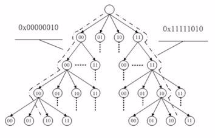
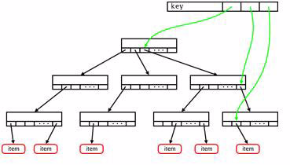
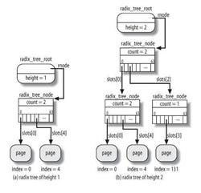
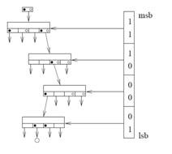
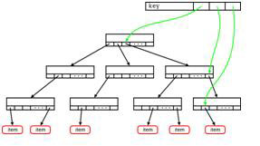

基数（radix）树

我的理解: 用指针(本质是long就行, 比如irq号也行)作为key, 查找相关信息; 比如指针被分为4段, 从左到右表示树的第1 2 3 4层的节点的位置.

API包括: 插入 删除 查询

```c
spin_lock_irqsave(&irq_lock, flags);
    radix_tree_insert(&irq_desc_tree, start, info);
spin_unlock_irqrestore(&irq_lock, flags);

spin_lock_irqsave(&irq_lock, flags);
    radix_tree_delete(&irq_desc_tree, info->uio->irq);
spin_unlock_irqrestore(&irq_lock, flags);

spin_lock_irqsave(&irq_lock, flags);
    info = radix_tree_lookup(&irq_desc_tree, irq);
spin_unlock_irqrestore(&irq_lock, flags);
```

原文: https://www.cnblogs.com/wuchanming/p/3824990.html

- [radix树概述](#radix树概述)
- [radix树slot数](#radix树slot数)
- [结点结构](#结点结构)
- [并行操作的优化](#并行操作的优化)
  - [RCU并发查询](#rcu并发查询)
  - [并发修改](#并发修改)
    - [清除标签](#清除标签)
    - [删除元素](#删除元素)
- [radix树API说明](#radix树api说明)
  - [声明和初始化radix树](#声明和初始化radix树)
  - [插入条目](#插入条目)
  - [删除条目](#删除条目)
  - [查询操作](#查询操作)
  - [标签操作](#标签操作)
- [并行操作使用radix树API的方法](#并行操作使用radix树api的方法)
  - [查询获取slot操作](#查询获取slot操作)
  - [查询修改slot操作](#查询修改slot操作)
- [radix树API的实现](#radix树api的实现)
  - [查找单个条目](#查找单个条目)
  - [查找多个条目](#查找多个条目)
  - [插入条目](#插入条目-1)
  - [扩展树的高度](#扩展树的高度)
  - [删除条目](#删除条目-1)
  - [缩小树的高度](#缩小树的高度)

Linux基数树（radix tree）是将指针与long整数键值相关联的机制，它存储有效率，并且可快速查询，用于指针与整数值的映射（如：IDR机制）、内存管理等。

IDR（ID Radix）机制是将对象的身份鉴别号整数值ID与对象指针建立关联表，完成从ID与指针之间的相互转换。IDR机制使用radix树状结构作为由id进行索引获取指针的稀疏数组，通过使用位图可以快速分配新的ID，IDR机制避免了使用固定尺寸的数组存放指针。IDR机制的API函数在lib/idr.c中实现，这里不加分析。

Linux radix树最广泛的用途是用于内存管理，结构`address_space`通过radix树跟踪绑定到地址映射上的核心页，该radix树允许内存管理代码快速查找标识为dirty或writeback的页。Linux radix树的API函数在`lib/radix-tree.c`中实现。

# radix树概述
radix树是通用的字典类型数据结构，radix树又称为PAT位树（Patricia Trie or crit bit tree）。Linux内核使用了数据类型unsigned long的固定长度输入的版本。每级代表了输入空间固定位数。

radix tree是一种多叉搜索树，树的叶子结点是实际的数据条目。每个结点有一个固定的、2^n指针指向子结点（每个指针称为槽slot），并有一个指针指向父结点。

Linux内核利用radix树在文件内偏移快速定位文件缓存页，图4是一个radix树样例，该radix树的分叉为4(22)，树高为4，树的每个叶子结点用来快速定位8位文件内偏移，可以定位4x4x4x4=256页，如：图中虚线对应的两个叶子结点的路径组成值0x00000010和0x11111010，指向文件内相应偏移所对应的缓存页。 

  
图4 一个四叉radix树

Linux radix树每个结点有64个slot，与数据类型long的位数相同，图1显示了一个有3级结点的radix树，每个数据条目（item）可用3个6位的键值（key）进行索引，键值从左到右分别代表第1~3层结点位置。没有孩子的结点在图中不出现。因此，**radix树为稀疏树提供了有效的存储，代替固定尺寸数组提供了键值到指针的快速查找。**

  
图1 一个3级结点的radix树及其键值表示

 

# radix树slot数

Linux内核根据用户配置将树的slot数定义为4或6，即每个结点有16或64个slot，如图2所示，当树高为1时，64个slot对应64个页，当树高为2时，对应64*64个页。 

  
图2 高为1和2、slot数为64的radix树

Linux内核radix树的slot数定义如下（在`lib/radix-tree.c`中）：

```c
#ifdef __KERNEL__
/*值为6时，表示每个结点有2^6＝64个slot，值为4时，表示有2^4=16个slot*/
#define RADIX_TREE_MAP_SHIFT (CONFIG_BASE_SMALL ? 4 : 6)
#else
#define RADIX_TREE_MAP_SHIFT 3 /* 用于更有强度的测试 */
#endif
/*表示1个叶子结点可映射的页数，如：1<<6=64，表示可映射64个slot映射64页*/
#define RADIX_TREE_MAP_SIZE (1UL << RADIX_TREE_MAP_SHIFT)
#define RADIX_TREE_MAP_MASK (RADIX_TREE_MAP_SIZE-1)
/*定义slot数占用的long类型长度个数，每个slot用位图1位进行标记，如：64个slot时，值为2*/
#define RADIX_TREE_TAG_LONGS \
((RADIX_TREE_MAP_SIZE + BITS_PER_LONG - 1) / BITS_PER_LONG)
```

# 结点结构

树的根结点结构`radix_tree_root`列出如下（在`include/linux/radix-tree.h`中）：
```c
#define RADIX_TREE_MAX_TAGS 2 /*每个slot需要的最大标签位数*/

/*根结点的标签存放在gfp_mask中，通过__GFP_BITS_SHIFT移位得到 */
struct radix_tree_root {
    unsigned int height; /* 从叶子向上计算的树高度 */
    gfp_t gfp_mask;
    /*间接指针指向结点而非数据条目，通过设置root->rnode的低位表示是否是间指针*/
    struct radix_tree_node *rnode;
#ifdef CONFIG_RADIX_TREE_CONCURRENT
    struct radix_tree_context *context;
    struct task_struct *owner;
#endif
};
```

结构radix_tree_context列出如下：
```c
struct radix_tree_context {
    struct radix_tree_root *root;
#ifdef CONFIG_RADIX_TREE_CONCURRENT
    spinlock_t *locked;
#endif
}
```

树的结点结构`radix_tree_node`列出如下（在`lib/radix-tree.c`中）：
```c
struct radix_tree_node {
    unsigned int height; /* 从叶子向上计算的树高度 */
    unsigned int count; /*非叶子结点含有一个count域，表示出现在该结点的孩子的数量*/

    struct rcu_head rcu_head;
    void *slots[RADIX_TREE_MAP_SIZE]; /*结点的slot指针*/
   /* 结点标签数组=每个slot需要的最大标签位数*slot数所需的long类型变量数 */
   unsigned long tags[RADIX_TREE_MAX_TAGS][RADIX_TREE_TAG_LONGS];
};
```

Linux内核radix树高度是可变的，它依赖于存储的索引键值。radix树查询必须知道树高度，以便知道结点的slot是指向叶子结点的指针还是结点的其他层。Linux在结点结构中有成员height存入树高度信息。

Linux radix树的独特特征是标签扩展。图2显示了有2个标签，分别表示打开和关闭。这些标签是结点结构的成员tags，该标签用一个位图实现，在加锁的情况下设置和清除。每个标签基本上是一个在radix树顶层上的位图序号。标签与群查询一起用来在给定的范围内查找给定标签集的页。

标签在每结点位图中维护，在每个给定的级别上，可以判定下一个级别是否至少有一个标签集。

  
图2 带有2位图标签指示的8位radix树

在结点结构`radix_tree_node`中，`tags`域是一个二维数组，每个`slot`用2位标识，这是一个典型的用空间换时间的应用。tags域用于记录该结点下面的子结点有没有相应的标志位。目前`RADIX_TREE_MAX_TAGS`为2，表示只记录两个标志，其中`tags[0]`为`PAGE_CACHE_DIRTY`，`tags[1]`为`PAGE_CACHE_WRITEBACK`。如果当前节点的`tags[0]`值为1，那么它的子树节点就存在`PAGE_CACHE_DIRTY`节点，否则这个子树分枝就不存在着这样的节点，就不必再查找这个子树了。比如在查找`PG_dirty`的页面时，就不需要遍历整个树，而可以跳过那些`tags[0]`为0值的子树，这样就提高了查找效率。

“加标签查询”是返回有指定标签集radix树条目的查询，可以查询设置了标签的条目。加标签查询可以并行执行，但它们需要通过设置或清除标签从操作上互斥。

# 并行操作的优化
Linux radix树并行操作包括并行查询和并行修改，其中，并行修改在标准内核中未完没有实现，需要通过打补丁获得该功能。并行操作说明如下：

## RCU并发查询
通过使用RCU，RCU Radix树可以进行完全并发的查询操作。RCU从根本上要求原子操作地移动指针从数据结构的一个版本到新的版本，保持旧版本直到系统经过静止状态。在静止状态点，旧版本数据结构已没有用户，因此可以被安全释放。
RCU radix树的修改操作之间还需要串行化，但是查询不再需要与修改操作串行化。

## 并发修改
RCU可使RCU radix树查询完全并行化，但修改操作成了“瓶颈”。这可通过将全树的锁破碎成较小的锁进行改善，再明显的方法是对结点进行加锁而非对整个树加锁。

radix树修改操作可分为单向和双向操作。单向操作仅执行从根节点和叶子结点的单方向指针移动，它包括插入、更新和设置标签操作。双向操作较复杂，它需要在指针移到叶子后又回移，它包括删除和清除标签操作。

梯级加锁（Ladder Locking）和锁耦合（Lock-Coupling）技术常用于数据库方面，允许单向遍历结点加锁的树（双向可能产生死锁）。如果所有的修改者从树顶到树底进行修改，并且修改的结点持有锁，那么，向下遍历时对孩子加锁，在孩子被锁住时再释放该结点锁。在这种情况下并发操作是可能的，因为只要根结点解锁，另一个操作就可以自上向下进行。如果两操作的路径没有相同操作结点，后一个操作可能在前一个操作完成之前完成。最坏的情况是流水线操作，但这还是比串行化操作好很多。

双向操作包括删除和清除标签操作，分别说明如下：

### 清除标签
在radix树中清除一个标签包括向下遍历树、查找定位条目和清除条目标签的操作。只要孩子结点没有打标签的条目，就可以向上遍历结点清除标签。结束条件是：如果遍历遇到一个结点，在清除一个标签后，它还有一个或多个条目带有标签集，就可以结束向上遍历。为了与向下遍历期间有同样的结束点，将终止条件改为：向上遍历将在有比清除标签数更多标签的结点处结束。这样，不论何时遇到这样的结点，将作为上遍历树的结束点。


### 删除元素
删除元素在删除无用结点时还需要删除该条目的所有标签。它的终止条件需要满足这两个方面。向上回退遍历树时需要满足下面的条件：当遇到一个非空结点且没有无用的标签时应终止向上回退遍历树。

在向下遍历树时鉴别此点的条件是：当遇到有超过2个孩子的结点、并且每个标签来说结点有多于一个标签条目被清除时，结束向上遍历。该条件用来鉴别向上回退遍历的终止点。

# radix树API说明
## 声明和初始化radix树
声明和初始化radix树的方法列出如下：

```c
#include <linux/radix-tree.h>
/* gfp_mask表示如何执行内存分配，如果操作（如：插入）以原子性上下文中执行，其值为GFP_ATOMIC*/
RADIX_TREE(name, gfp_mask); /* 声明和初始化名为name的树*/

struct radix_tree_root my_tree;
INIT_RADIX_TREE(my_tree, gfp_mask);
```

## 插入条目
插入条目的函数定义列出如下：
```c
int radix_tree_insert(struct radix_tree_root *root, unsigned long index, void *item)
```

函数`radix_tree_insert`插入条目item到树root中，如果插入条目中内存分配错误，将返回错误`-ENOMEM`。该函数不能覆盖写正存在的条目。如果索引键值index已存在于树中，返回错误`-EEXIST`。插入操作成功是，返回0。
对于插入条目操作失败将引起严重问题的场合，下面的一对函数可避免插入操作失败：
```c
int radix_tree_preload(gfp_t gfp_mask);
void radix_tree_preload_end(void);
```

函数`radix_tree_preload`尝试用给定的`gfp_mask`分配足够的内存，保证下一个插入操作不会失败。在调用插入操作函数之前调用此函数，分配的结构将存放在每CPU变量中。函数`radix_tree_preload`操作成功后，将完毕内核抢占。因此，在插入操作完成之后，用户应调用函数`radix_tree_preload_end`打开内核抢占。

## 删除条目
删除条目的函数定义列出如下：
```c
void *radix_tree_delete(struct radix_tree_root *root, unsigned long index)
```

函数`radix_tree_delete`删除与索引键值index相关的条目，如果删除条目在树中，返回该条目的指针，否则返回NULL。

## 查询操作
用于查询操作的函数定义列出如下：
```c
/*在树中查找指定键值的条目，查找成功，返回该条目的指针，否则，返回NULL*/
void *radix_tree_lookup(struct radix_tree_root *root, unsigned long index);
/*返回指向slot的指针，该slot含有指向查找到条目的指针*/
void **radix_tree_lookup_slot(struct radix_tree_root *root, unsigned long index);
/*查询返回max_items条目在results中。查询时键值索引从first_index开始*/
radix_tree_gang_lookup(struct radix_tree_root *root, void **results, unsigned long first_index, unsigned int max_items);
```

## 标签操作
与标签操作相关的函数说明列出如下：
```c
/*将键值index对应的条目设置标签tag，返回值为设置标签的条目*/
void *radix_tree_tag_set(struct radix_tree_root *root, unsigned long index, unsigned int tag);
/*从键值index对应的条目清除标签tag，返回值为清除标签的条目*/
void *radix_tree_tag_clear(struct radix_tree_root *root, unsigned long index, unsigned int tag);
/*检查键值index对应的条目是否为标签tag，如果键值不存在，返回0，如果键值存在，但标签未设置，返回-1；如果键值存在，且标签已设置，返回1*/
int radix_tree_tag_get(struct radix_tree_root *root, unsigned long index, unsigned int tag);
/*从first_index起查询树root中标签值为tag的条目，在results中返回*/
unsigned int radix_tree_gang_lookup_tag(struct radix_tree_root *root, void **results, unsigned long first_index, unsigned int max_items, unsigned int tag);
/*如果树root中有任何条目使用tag标签，返回键值*/
int radix_tree_tagged(struct radix_tree_root *root, unsigned int tag);
```

# 并行操作使用radix树API的方法

## 查询获取slot操作

查询操作支持RCU无阻塞并行读操作，因此，需要遵循RCU的用法加RCU读锁，还需要将`rcu_dereference()`用于获得的slot，在写（或更新）操作时，需要给新的slot使用`rcu_assign_pointer()`。查询操作的使用方法列出如下：
```c
struct page **slot, *page;
rcu_read_lock();
slot = radix_tree_lookup_slot(&mapping->page_tree, index);
page = rcu_dereference(*slot);
rcu_read_unlock();
```

## 查询修改slot操作

Linux内核的radix树需要打补丁才支持并发修改。查询仅有一个全局状态：RCU静止状态，并发修改需要跟踪持有什么锁。锁状态对于操作来说必须是外部的，因此，我们需要实例化一个本地上下文跟踪这些锁。查询修改slot的方法列出如下：
```c
struct page **slot;
DEFINE_RADIX_TREE_CONTEXT(ctx,&mapping->page_tree);
radix_tree_lock(&ctx); /*锁住了根结点*/
/* ctx.tree代替&mapping->page_tree作为根，可以传递上下文
slot = radix_tree_lookup_slot(tx.tree, index);
rcu_assign_pointer(*slot, new_page);
radix_tree_unlock(&ctx);
```

radix树API函数radix_tree_lookup_slot含有锁从树顶向下移动机制，锁移动的代码部分列出如下：
```c
void **radix_tree_lookup_slot(struct radix_tree *root, unsigned long index)
{
    ...
    RADIX_TREE_CONTEXT(context, root); /*提供上下文和实际的root指针*/
    ...
    do {
        ...
        /* 从树顶向下移动锁*/
        radix_ladder_lock(context, node);
        ...
    } while (height > 0);
    ...
}
```

# radix树API的实现

树的操作通常包括查找、插入、删除和树调整，下面分别说明radix树这些操作的实现。

## 查找单个条目

radix树通过索引键值进行查询，如图1所示，它按路径组成索引键值，图中3级结点对应3段6位表示的索引值，图中key对应的叶子slot的索引键值为“2,63,1”。通过叶子slot的指针slot[1]就可得到所存储的数据item。因此，查询迭代时，需要将索引键值“2,63,1”移去高2层“2,63”，得到叶子slot的指针索引键值“1”。

  
图1 一个3级结点的radix树及其键值表示

函数radix_tree_lookup执行查找操作，查找方法是：从叶子到树顶，通过数组索引键值值查看数组元素的方法，一层层地查找slot。其列出如下（在lib/radix-tree.c中）：
```c
void *radix_tree_lookup(struct radix_tree_root *root, unsigned long index)
{
    unsigned int height, shift;
    struct radix_tree_node *node, **slot;

    node = rcu_dereference(root->rnode); /*获取根结点*/
    if (node == NULL)
        return NULL;

    /*间接指针指向结点而非数据条目，通过设置root->rnode的低位表示是否是间指针。对于间接指针来说，树高度值root->height大于0，但是RCU查找需要测试间接指针，因为root->height 值不可靠。这种问题仅的RCU下需要考虑*/ 
    if (!radix_tree_is_indirect_ptr(node)) { /*非间接指针，说明只有根结点*/
        if (index > 0)
            return NULL;
        return node;
    }

    /*获取真正结点指针，因为根结点指针的第0位设置为1表示为间接指针。当使用结点指针时，必须将第0位设置为0，因为地址以字对齐*/
    node = radix_tree_indirect_to_ptr(node);

    height = node->height;
    if (index > radix_tree_maxindex(height)) /*索引键值不能超过最大索引值*/
        return NULL;

    /*每层索引偏移值为RADIX_TREE_MAP_SHIFT，叶子索引值偏移基数为（树高-1）*每层索引偏移值*/ 
    shift = (height-1) * RADIX_TREE_MAP_SHIFT;

    do { /*从叶子到树顶，通过树路径组成的索引查找指定索引键值的slot*/
        slot = (struct radix_tree_node **)(node->slots + ((index>>shift) & RADIX_TREE_MAP_MASK)); /*如：slots +1*/
        node = rcu_dereference(*slot);
        if (node == NULL)
            return NULL;

        shift -= RADIX_TREE_MAP_SHIFT; /*向上移一层，再迭代查找*/
        height--;
    } while (height > 0);

    return node;
}
```

## 查找多个条目

函数`radix_tree_gang_lookup`执行多个索引键值的查找，其列出如下：
```c
unsigned int radix_tree_gang_lookup(struct radix_tree_root *root, void **results, unsigned long first_index, unsigned int max_items)
{
    unsigned long max_index;
    struct radix_tree_node *node;
    unsigned long cur_index = first_index;
    unsigned int ret;

    node = rcu_dereference(root->rnode);
    if (!node)
        return 0;

    if (!radix_tree_is_indirect_ptr(node)) { /*如果为非间接指针，表示只有根节点*/
        if (first_index > 0)
            return 0;
        results[0] = node;
        return 1;
    }
    node = radix_tree_indirect_to_ptr(node); /*清除用于间接指针标识的第0位*/

    max_index = radix_tree_maxindex(node->height); /*获取树的最大索引键值*/

    ret = 0;
    while (ret < max_items) { /* max_items为查找的最大条目数*/
        unsigned int nr_found;
        unsigned long next_index; /* 下一个搜索的索引键值*/

        if (cur_index > max_index) /*已查询完所需查询的索引键值*/
            break;
        nr_found = __lookup(node, results + ret, cur_index,
        max_items - ret, &next_index);
        ret += nr_found;
        if (next_index == 0)
            break;
        cur_index = next_index;
    }

    return ret;
}

static unsigned int
__lookup(struct radix_tree_node *slot, void **results, unsigned long index, unsigned int max_items, unsigned long *next_index)
{
    unsigned int nr_found = 0;
    unsigned int shift, height;
    unsigned long i;

    height = slot->height;
    if (height == 0)
        goto out;
    /*所有叶子slot的索引键值基数偏移*/
    shift = (height-1) * RADIX_TREE_MAP_SHIFT; 

    /*从底层向树顶层，
    for ( ; height > 1; height--) { /*从叶子向树顶查找*/
        i = (index >> shift) & RADIX_TREE_MAP_MASK;
        for (;;) { /*遍历每一层的各个路径，由树顶到当前层一条路径组成索引键值*/
            /*如果slot不为空，那么它挂有子结点，跳出本循环，进入子结点层进行本循环*/
            if (slot->slots[i] != NULL)
                break;
           /*如果slot为空，就跳过slot对应的所有索引键值*/ 
           /*清除索引号低位.将索引号与该层slot的起始索引号对齐*/
           index &= ~((1UL << shift) - 1);
           /*跳过一个slot的索引键值数*/
          index += 1UL << shift;
          if (index == 0)
              goto out; /* 32-bit wraparound */
          i++; /*找到多个slot*/
          if (i == RADIX_TREE_MAP_SIZE)
              goto out;
       }

       shift -= RADIX_TREE_MAP_SHIFT; /*向上移一层，基数偏移减少*/
       slot = rcu_dereference(slot->slots[i]);
       if (slot == NULL)
           goto out;

    }

    /* 返回找到的多个slot*/
    for (i = index & RADIX_TREE_MAP_MASK; i < RADIX_TREE_MAP_SIZE; i++) {
        struct radix_tree_node *node;
        index++;
        node = slot->slots[i];
        if (node) {
            results[nr_found++] = rcu_dereference(node);
           if (nr_found == max_items)
               goto out;
        }
    }
    out:
    *next_index = index;
    return nr_found;
}
```
 

## 插入条目

函数radix_tree_insert找到索引键值对应的结点，将item加到该结点的slot指针上。其列出如下：
```c
int radix_tree_insert(struct radix_tree_root *root, unsigned long index, void *item)
{
    struct radix_tree_node *node = NULL, *slot;
    unsigned int height, shift;
    int offset;
    int error;

    BUG_ON(radix_tree_is_indirect_ptr(item));

    /* 如果树的高度不够，就扩展树。函数radix_tree_maxindex计算树高容纳的最大索引*/
    if (index > radix_tree_maxindex(root->height)) {
        error = radix_tree_extend(root, index);
        if (error)
            return error;
    }

    slot = radix_tree_indirect_to_ptr(root->rnode);

    height = root->height;
    shift = (height-1) * RADIX_TREE_MAP_SHIFT; /*计算偏移基数*/

    offset = 0; 
    while (height > 0) {
        if (slot == NULL) { /*如果slot为空，则需要加入孩子结点*/
            /* 分配slot */
            if (!(slot = radix_tree_node_alloc(root)))
                return -ENOMEM;
            slot->height = height;
            if (node) {/*添加slot*/
                rcu_assign_pointer(node->slots[offset], slot);
             node->count++;
         } else
             rcu_assign_pointer(root->rnode,radix_tree_ptr_to_indirect(slot));
        }

        /* 进入上一层*/
        offset = (index >> shift) & RADIX_TREE_MAP_MASK;
        node = slot;
        slot = node->slots[offset];
        shift -= RADIX_TREE_MAP_SHIFT;
        height--;
    }
    /*如果index对应的slot已有映射页面，返回-EEXIST*/
    if (slot != NULL)
        return -EEXIST;

    if (node) {
        node->count++; /*增加子结点的计数*/
        rcu_assign_pointer(node->slots[offset], item);
        BUG_ON(tag_get(node, 0, offset));
        BUG_ON(tag_get(node, 1, offset));
    } else { /*为顶层结点*/
        rcu_assign_pointer(root->rnode, item);
        BUG_ON(root_tag_get(root, 0));
        BUG_ON(root_tag_get(root, 1));
    }

    return 0;
}
```

## 扩展树的高度

如果当前树高度不足以存放index，就需要扩展树，扩展方法是在旧树顶上加新的根结点，并将原根结点的tag信息移到新根结点的第1个slot。函数radix_tree_extend 列出如下：
```c
static int radix_tree_extend(struct radix_tree_root *root, unsigned long index)
{
    struct radix_tree_node *node;
    unsigned int height;
    int tag;

    /* 计算扩展的深度*/
    height = root->height + 1;
    /*如果index超过树高所容纳的最大索引值，树高递增*/
    while (index > radix_tree_maxindex(height)) 
        height++;

    /*到这里已计算好合适的高度height*/ 
    if (root->rnode == NULL) { /*只有根结点，设置好树高度就可返回*/
        root->height = height;
        goto out;
    }

    /*将当前树扩展到高度height*/
    do {
        unsigned int newheight;
        if (!(node = radix_tree_node_alloc(root))) /*分配一个结点*/
            return -ENOMEM;

        /* 增加树高，在树顶点之上增加一个结点*/
        node->slots[0] = radix_tree_indirect_to_ptr(root->rnode);

        /*传播tag信息到新根结点*/
        /*以前的根结点现成为新顶结点的第1个插槽。 如果以前的根结点打上了tag，就将新增结点的第1个插槽对应的子节点打上相应的tag*/
        for (tag = 0; tag < RADIX_TREE_MAX_TAGS; tag++) {
            if (root_tag_get(root, tag))
               tag_set(node, tag, 0);
        }

        newheight = root->height+1;
        node->height = newheight;
        node->count = 1;
        node = radix_tree_ptr_to_indirect(node);
        rcu_assign_pointer(root->rnode, node);
        root->height = newheight;
    } while (height > root->height);
out:
    return 0;
}
```

## 删除条目

函数`radix_tree_delete`删除index对应的条目，并返回删除条目的地址。其列出如下：
```c
void *radix_tree_delete(struct radix_tree_root *root, unsigned long index)
{
    /*数组path用于保存路径上的结点及索引偏移值*/
    struct radix_tree_path path[RADIX_TREE_MAX_PATH + 1], *pathp = path;
    struct radix_tree_node *slot = NULL;
    struct radix_tree_node *to_free;
    unsigned int height, shift;
    int tag;
    int offset;

    height = root->height;
    if (index > radix_tree_maxindex(height)) /*index不能超过树的最大索引值*/
        goto out;

    slot = root->rnode;
    if (height == 0) { /*只有根结点*/
        root_tag_clear_all(root);
        root->rnode = NULL;
        goto out;
    }
    slot = radix_tree_indirect_to_ptr(slot);

    shift = (height - 1) * RADIX_TREE_MAP_SHIFT;
    pathp->node = NULL;
    /*获取删除条目的路径*/
    /*将index从根到叶子的路径所经过的结点及相应索引偏移值存放在数组pathp中*/
    do {
        if (slot == NULL)
            goto out;

        pathp++;
        offset = (index >> shift) & RADIX_TREE_MAP_MASK;
        pathp->offset = offset;
        pathp->node = slot;
        slot = slot->slots[offset];
        shift -= RADIX_TREE_MAP_SHIFT;
        height--;
    } while (height > 0);

    if (slot == NULL)
        goto out;

    /*清除与删除条目相关的所有标签*/
    for (tag = 0; tag < RADIX_TREE_MAX_TAGS; tag++) {
        if (tag_get(pathp->node, tag, pathp->offset))
            radix_tree_tag_clear(root, index, tag);
    }

    to_free = NULL;
    /*释放不再需要的结点 */
    while (pathp->node) { /*删除
        pathp->node->slots[pathp->offset] = NULL; /*清除slot*/
        pathp->node->count--; /*孩子数量减1*/
        /*调用RCU机制的函数call_rcu在最后一个引用结束时延迟释放结点to_free */
        if (to_free)
            radix_tree_node_free(to_free);

        if (pathp->node->count) { /*还有孩子存在*/
           if (pathp->node == radix_tree_indirect_to_ptr(root->rnode)) /*为根结点的孩子*/
                radix_tree_shrink(root); /*树缩小*/
           goto out;
        }

        /*释放有0个slot的结点 */
        to_free = pathp->node;
        pathp--;

    }
    /*运行到这里，说明是根结点*/
    root_tag_clear_all(root);
    root->height = 0;
    root->rnode = NULL;
    if (to_free)
        radix_tree_node_free(to_free);

out:
    return slot;
}
```

## 缩小树的高度
函数`radix_tree_shrink`缩小树的高度到最小。其列出如下：
```c
static inline void radix_tree_shrink(struct radix_tree_root *root)
{
    /* 尝试缩小树的高度*/
    while (root->height > 0) {
        struct radix_tree_node *to_free = root->rnode;
        void *newptr;

        BUG_ON(!radix_tree_is_indirect_ptr(to_free));
        to_free = radix_tree_indirect_to_ptr(to_free);

        /*候选结点多于一个孩子或孩子不在最左边slot，不能缩小树的高度，跳出循环*/
        if (to_free->count != 1)
            break;
        if (!to_free->slots[0])
            break;

        /*不需要调用rcu_assign_pointer()，因为仅从树的一部分到另一部分移动结点。如果释放旧指针的引用to_free->slots[0]是安全的，那么释放新指针的引用root->rnode也是安全的*/ 
       newptr = to_free->slots[0];
       if (root->height > 1)
           newptr = radix_tree_ptr_to_indirect(newptr);
       root->rnode = newptr;
       root->height--; 
       /*仅释放0结点*/
       tag_clear(to_free, 0, 0);
       tag_clear(to_free, 1, 0);
       to_free->slots[0] = NULL;
       to_free->count = 0;
       radix_tree_node_free(to_free);
    }
}
```
