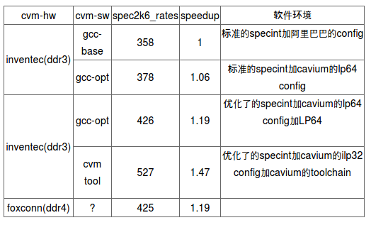

- [Ali support](#ali-support)
  - [char类型在arm和x86上不一样](#char类型在arm和x86上不一样)
  - [高精度时钟](#高精度时钟)
  - [io优化](#io优化)
  - [openssl](#openssl)
  - [CCPI lattency](#ccpi-lattency)
  - [specint 2006](#specint-2006)
  - [kernel 测试](#kernel-测试)
  - [perf frontend backend stall from ARM](#perf-frontend-backend-stall-from-arm)
  - [streamline from ARM](#streamline-from-arm)
  - [qemu如何进入monitor命令行](#qemu如何进入monitor命令行)
  - [更新grub](#更新grub)
  - [docker](#docker)
  - [kernel team的问题](#kernel-team的问题)
    - [问题](#问题)
    - [回答](#回答)
  - [PXE调试](#pxe调试)
  - [driver调试手段之trace](#driver调试手段之trace)
  - [ssh配置文件](#ssh配置文件)
  - [efi grub 和 grub.cfg](#efi-grub-和-grubcfg)
  - [几何平均数和算数平均数](#几何平均数和算数平均数)
  - [kernel补丁](#kernel补丁)
  - [给alibaba提动kernel补丁的过程](#给alibaba提动kernel补丁的过程)
  - [启动时加模块的参数](#启动时加模块的参数)
  - [ssd的strim是什么东东? discard? Fstrim/discard](#ssd的strim是什么东东-discard-fstrimdiscard)
  - [调试RDS tps变为0的问题](#调试rds-tps变为0的问题)
  - [网口讨论 关于网络处理的基本流程和概念](#网口讨论-关于网络处理的基本流程和概念)
  - [编译模块的kernel通用路径](#编译模块的kernel通用路径)
  - [通过其他机器上外网](#通过其他机器上外网)
  - [解决polkitd的问题](#解决polkitd的问题)
  - [sysbench里面随机函数lrand48问题](#sysbench里面随机函数lrand48问题)
  - [ssh keepalive](#ssh-keepalive)
  - [git生成patch](#git生成patch)
  - [添加和删除网关](#添加和删除网关)
  - [一次性top](#一次性top)
  - [coredump](#coredump)
  - [在thunder上的sysdig 好像用不起来...](#在thunder上的sysdig-好像用不起来)
  - [sysdig初体验](#sysdig初体验)
  - [ulimit进程数限制](#ulimit进程数限制)
  - [在thunder上做盘](#在thunder上做盘)
  - [rtc时间](#rtc时间)
  - [SATA slow sync问题](#sata-slow-sync问题)
  - [使用native gcc的变量设置](#使用native-gcc的变量设置)
  - [smp_affinity和rps_cpus](#smp_affinity和rps_cpus)
  - [mysql调试方法论之各种调试和检测命令](#mysql调试方法论之各种调试和检测命令)
  - [mysql性能提升之网口中断](#mysql性能提升之网口中断)
  - [解决sync flood问题](#解决sync-flood问题)
  - [mysql调优之瓶颈在哪? 理论](#mysql调优之瓶颈在哪-理论)
  - [mysql调优之innodb_spin_wait_delay = 30](#mysql调优之innodb_spin_wait_delay--30)
  - [memcpy和strcpy](#memcpy和strcpy)
  - [perf调试单进程, 调用栈?](#perf调试单进程-调用栈)
  - [numactl](#numactl)
  - [预取 prefetch](#预取-prefetch)
  - [gdb调试多进程](#gdb调试多进程)
  - [aj kernel git换remote?](#aj-kernel-git换remote)
  - [交叉编译kernel](#交叉编译kernel)
  - [pssh可以在多个机器同时执行命令](#pssh可以在多个机器同时执行命令)
  - [ssh免密码登录](#ssh免密码登录)
  - [ssh远程执行命令](#ssh远程执行命令)
  - [cpu offline 动态](#cpu-offline-动态)
  - [dd原理 每个字节都被复制](#dd原理-每个字节都被复制)
  - [UUID启动 不用sda sdb](#uuid启动-不用sda-sdb)
  - [重做fedora](#重做fedora)
  - [fedora网口配置](#fedora网口配置)
  - [查看10台系统是否online](#查看10台系统是否online)
  - [check cpld 版本](#check-cpld-版本)
  - [写mac地址](#写mac地址)
  - [编译gcc](#编译gcc)
  - [96个核的异常问题](#96个核的异常问题)
  - [关于rps_cpus](#关于rps_cpus)
  - [xps_cpu](#xps_cpu)
  - [网络时间](#网络时间)
  - [irq绑定](#irq绑定)
  - [tubo错误分析](#tubo错误分析)
  - [ethtool可以配置驱动](#ethtool可以配置驱动)
  - [为什么ulimit -n的值不能改?](#为什么ulimit--n的值不能改)
  - [atomic解决mysql崩溃问题, weak order](#atomic解决mysql崩溃问题-weak-order)


# Ali support
> 记录我在Alibaba支持ARM64的一些技术点

##  char类型在arm和x86上不一样
toku db有几个测试项fail
```
rds.tokudb_bug_811, rds.tokudb_file_length, 
rds.tokudb_ftclose_checkpoint and the result mismatch with rds.tokudb_zstd_compression
```
原因是: **x86的char是有符号的, 而arm上char是无符号的!**
```diff
--- a/storage/tokudb/ft-index/ft/serialize/compress.cc
+++ b/storage/tokudb/ft-index/ft/serialize/compress.cc
@@ -295,7 +295,7 @@ void toku_decompress (Bytef       *dest,   uLongf 
destLen,
          strm.zalloc = Z_NULL;
          strm.zfree = Z_NULL;
          strm.opaque = Z_NULL;
-        char windowBits = source[1];
+        int8_t windowBits = source[1];
          int r = inflateInit2(&strm, windowBits);
          lazy_assert(r == Z_OK);
          strm.next_out = dest;
```


##  高精度时钟
在编译tokudb的代码时, 需要实现一个函数
```c
static inline tokutime_t toku_time_now(void) {
    uint32_t lo, hi;
    __asm__ __volatile__ ("rdtsc" : "=a" (lo), "=d" (hi));
    return (uint64_t)hi << 32 | lo;
}
```
这里面用了x86的汇编. 需要在ARM64上实现这个功能
具体的实现应该是`__asm __volatile__ ("mrs %[rt],cntvct_el0" : [rt] "=r" (result));`
或者这样
```c
unsigned long long get_ticks(void)
{
    unsigned long long tv;
#if defined(AARCH64)
    asm volatile("mrs %0, cntvct_el0" : "=r" (tv));
#elif defined(X64)
    asm volatile ("rdtsc" : "=a"(tv));
#endif
    return tv;
}
```


##  io优化
```sh
echo 150 > /sys/block/sda/device/timeout
echo deadline > /sys/block/sdb/queue/scheduler
echo deadline > /sys/block/sda/queue/scheduler
echo 500> /sys/block/sdb/queue/nr_requests
/etc/default/irqbalance
#Configuration for the irqbalance daemon
#Should irqbalance be enabled?
ENABLED="1"
#Balance the IRQs only once?
ONESHOT="0"
IRQBALANCE_BANNED_CPUS="ffffffffffffffffffffffff"
```
```
Here are some potential optimizations to get the best performance:
Regarding the MegaRAID controller  
    If you are using SSD as data volumes, use LSI MegaRAID Fast Path and tune the OS as described below.  Click here for a KB article with a trial key .
    Use SSD as caching along with disk drives and LSI MegaRAID CacheCade or CacheCade Pro 2.0 Click here for a trial key 
    If using HDD (Hard Disk Drives) enable write back cache (consider using a BBU in the event of unexpected power loss or unclean shutdown)
Linux OS tuning also improves performance for LSI SAS HBAs.
Under Windows and Linux using SSDs:  
    When the volume is created, use write through caching (i.e. write cache will be disabled)
    Use Direct IO (and not Cached IO)
    Use RAID 0 for the highest performance (note: the loss of a single SSD will result in the loss of all data)
    In general, the dual core controllers (e.g. 9265/9285) perform faster than the single controllers (e.g. 9260/9280)
Under Linux (some of these are specific to SSDs, as indicated below):  
    telinit 3   (Shutdown to runlevel 3/kill Xwindows)      
    echo "0" > /sys/block/sda/queue/rotational   (Turn off seek reordering-use with SSDs)
    I/O scheduler     
        To check the current setting: cat /sys/block/sdb/queue/scheduler
        To tune the setting: echo "deadline" > /sys/block/sdb/queue/scheduler (Change to deadline I/O scheduler)
        Repeat for other devices (e.g. sdb, sdc, etc.)
        This setting reverts to the default after a system reboot.  You may want to create a start up script that will automatically run this tuning parameter after every reboot. 
    Turn up block layer queue depth for sda to 975-use with SSDs or use with HDDs if using a single Logical Drive)               
        To check the current setting: cat /sys/block/sda/queue/nr_requests
        To tune the setting: echo "975" > /sys/block/sdb/queue/nr_requests
        Repeat for other devices (e.g. sdb, sdc, etc.)
        This setting reverts to the default after a system reboot.  You may want        to create a start up script that will automatically run this tuning        parameter after every reboot.
     Turn up driver queue depth for sda to 975-use with SSDs or use with HDDs if using a single Logical Drive) 
        To check the current setting: cat /sys/block/sda/device/queue_depth
        To tune the setting: echo "975" > /sys/block/sda/device/queue_depth
        Repeat for other devices (e.g. sdb, sdc, etc.)
        This setting reverts to the default after a system reboot.  You may want        to create a start up script that will automatically run this tuning        parameter after every reboot. 
    echo N > /sys/module/drm_kms_helper/parameters/poll (Turn off kworkd001 CPU eating background kernel thread)
    Assign Affinity Masks - See A008273-110112
    Setup rq_affinity
        To check the current setting: cat /sys/block/sda/queue/rq_affinity
        To tune the setting: echo "0" > /sys/block/sda/queue/rq_affinity
        Repeat for other devices (e.g. sdb, sdc, etc.)
        This setting reverts to the default after a system reboot.  You may want to create a start up script that will automatically run this tuning   parameter after every reboot.
        Newer kernels (e.g. RHEL 6.4) allow this setting to be '2', which will cause the block layer softirq to run on the exact same CPU that issued the I/O.
```


##  openssl
```
I've tested the RSA2048 performance with this cmd
openssl speed rsa2048 -multi 32 
And intel 2630 got about:  6911, 2650 with 32 core and -multi 32 thread got about 7907.7
runing the same cmd in one of ten machine (2 sockets) on my hand(evb3 maybe) and with option: multi 96 got about 6509.9.
```
```
Today, I try to run openssl speed rsa2048 on ThunderX CRB-1s (ThunderX CPU @ 2.0GHz , 48Cores).
“./openssl speed rsa2048 -multi 32” test result is: 5505.3
“./openssl speed rsa2048 -multi 48” test result is: 8104.6
```

##  CCPI lattency
The following is the CCPI latency #. On our pass 1.x silicon we are running at 6.25Gbps, pass 2.0 aka the production part will be 10Gbps.  You will see latency improvement from 400 cycles to 300 cycles.

##  specint 2006
  

##  kernel 测试
* LKP
    Blogbench
    dbench
    Ext4-frags
    Fileio
    ku-latency
    kvm-unit-tests
    nuttcp
    pft
* LTP
* Trinity
* AIM9
* XFS Test
* unionmount-testsuite
* Fsync
* 

##  perf frontend backend stall from ARM
```
Hi Bai,
As we discussed on-site at Alibaba, I think it would be good to backport the patches that add support for the frontend stall and backend stall performance counters.
This was implemented earlier this year by Jan Glauber from Cavium, and appeared in the 4.6 kernel.
As discussed, these counters are very valuable when you need to analyze the root cause of a CPU performance problem, following the top-down methodology (see https://moodle.technion.ac.il/pluginfile.php/560599/mod_resource/content/1/Vtune%20%20-%20Top%20Down%20Performance%20Analysis%20,%20by%20Ahmad%20Yasin.pdf for the paper).
My understanding is that the following commits introduce this support in the main-line linux kernel:
94085fe - Thu, 18 Feb 2016 17:50:12 +0100 (5 months ago)
           arm64: dts: Add Cavium ThunderX specific PMU - Jan Glauber
c210ae8 - Thu, 18 Feb 2016 17:50:14 +0100 (5 months ago)
          arm64: perf: Extend event mask for ARMv8.1 - Jan Glauber
7175f05 - Thu, 18 Feb 2016 17:50:13 +0100 (5 months ago)
          arm64: perf: Enable PMCR long cycle counter bit - Jan Glauber
d0aa2bf - Thu, 18 Feb 2016 17:50:11 +0100 (5 months ago)
          arm64/perf: Add Cavium ThunderX PMU support - Jan Glauber
5f140cc - Thu, 18 Feb 2016 17:50:10 +0100 (5 months ago)
           arm64: perf: Rename Cortex A57 events - Jan Glauber
If the support could be backported to linux kernel 4.2, it means Alibaba could use these counters to more efficiently investigate the root cause of CPU inefficiencies.
```

##  streamline from ARM
* DS-5 download
https://developer.arm.com/products/software-development-tools/ds-5-development-studio/downloads
* gator source code
https://github.com/ARM-software/gator
* protocol
https://github.com/ARM-software/gator/tree/master/protocol


##  qemu如何进入monitor命令行
`Crtl+a c`


##  更新grub
```
vim /etc/default/grub
grub2-mkconfig  -o /boot/efi/EFI/centos/grub.cfg
reboot
```

##  docker
https://docs.docker.com/engine/installation/linux/centos/

##  kernel team的问题

###  问题
why 100, not 1000？
why noop, not others?
why 64k, not 4k? performance comparison?

###  回答
* 100hz vs. 1000hz: we see minimal performance difference for most of our applications here.
    * We have performed significant testing using both settings, as well as 250hz and 300hz without any issue.
    * I will direct all future kernels to use 1000hz moving forward, at your preference.
* noop is generally best for SSDs, which many customer use often
    * However, if your application has a combination of SSDs and HDDs we will gladly switch the default to deadline, which is shown to work well with both disks and all applications. The impact on SSDs is effectively 0, while the improvement with HDDs is significant.
    * The only consideration is that MySQL is known to have poor performance when using the CFQ scheduler, this is true on all platforms, and is a standard note for MySQL performance.
* 64k vs 4k: 64k has performance benefits in many applications, 5% on average (though many, even most applications see 0 change).
    * However, specifically, 64k is considered the desired default for ARM64, RedHat has specifically asked for 64k to be the standard.
    * 4k works perfectly fine, however. The performance hit isn’t very noticeable in most applications.
    * We would kindly suggest using the default 64k, however, particularly since RedHat and CentOS will be providing 64k based distributions in the future.
* We chose a number of configuration options based on our experience, or because they were considered recommend by the ARM ecosystem, however these are only defaults, and we understand your use case may differ.
Please ask if you have any questions at all, we are very eager to customize your kernel such that it may maximize your application performance, while ensuring a minimal impact on your deployment process.


##  PXE调试
* PXE需要配DHCP TFTP FTP server.
Thunder机器先是通过DHCP获取IP地址, 然后TFTP下载grub.efi, 目录在/tftpboot下面.
* 这个efi会在板子上跑起来, 然后会下载grub.cfg和image, initrd等文件, 用这些文件, 系统就能进入最小安装环境(ram os).
起kernel的时候可以在grub里面传参数来指定ISO的位置, 用FTP协议.
这里遇到的问题是系统卡住了, 此时需要tcpdump来调试, 需要知道机器的mac, 有很多方法可以查到.
`tcpdump -i em1 ether host 02:1f:b7:00:00:00 -vv`
下面就可以装了. 用text模式, 选server with GUI.
* 用BMC可以看输出, 关键是用`which javaws`来打开那个文件

##  driver调试手段之trace
调试driver的时候, 经常会加一些打印; 而其实你想过没有, 一些比较成熟的系统, 比如i2c已经有系统性的调试打印了;
在自己动手加打印之前, 先把这些被默认关闭的调试打印打开, 经常会事半功倍, 下面以调试i2c read为例
* 打开调试信息输出
`echo 1 > /sys/kernel/debug/tracing/events/i2c/i2c_read/enable`
* 查看输出
`cat /sys/kernel/debug/tracing/trace`
* 这些debug信息在哪里? --i2c框架代码里已经埋好
`trace_i2c_read(...)`


##  ssh配置文件
```
baiyingjie@mserver-dell ~/.ssh
$ chmod 600 config
$ cat config 
Host ali6
    Hostname 10.97.219.6 
    User root
    IdentityFile ~/.ssh/id_rsa
    ServerAliveInterval 60
Host ali55
    Hostname 10.97.219.55
    User root
    IdentityFile ~/.ssh/id_rsa
    ServerAliveInterval 60
Host rdsgserver
    Hostname 192.168.10.3
    User root
    IdentityFile ~/.ssh/id_rsa
    ProxyCommand ssh -q -W %h:%p rdsgclient
    ServerAliveInterval 60
Host rdsgclient
    Hostname 30.2.47.69
    User root
    IdentityFile ~/.ssh/id_rsa
    ServerAliveInterval 60
```


##  efi grub 和 grub.cfg
* 这三个东西都是存在第一个分区里面的, 这是个fat32的bootable分区, 好像专门给uefi用的
* 这个分区会mount到/boot/efi
* 注意grub.cfg也是在这个分区里面
* 根分区(一般是第二个分区, ext4)里面也有grub和grub2文件夹, 但里面要么是软链接到/boot/efi的, 要么就是像背景图一样的不重要文件?
  


##  几何平均数和算数平均数
* 算数平均数: n个数的和除以n
* 几何平均数定义: n个数相乘再开n次方
* 应用场景:
- 算数平均数用来表示这n个数的和的平均特征, 意味着你要考察的潜在目标是他们的和
- 几何平均数是这n个数的积的特征, 考察的潜在目标是乘积.


##  kernel补丁
```
git format-patch 
git apply --check  newpatch.patch
git am --signoff < newpatch.patch
```


##  给alibaba提动kernel补丁的过程
* thunder_master基于linux_4.2, 开发了比如500+个commit
* 同样基于linux_4.2添加新的分支alibaba_4.2
* 在alibaba_4.2上, 用git cherry-pick commitid从thunder_master上的500+commit里面挑出来有用的, 比如200个左右.
git cherry-pick可以把别的分支上的commit应用到当前分支
* 用alibaba给的centos7.1里面的内核源码新建一个repo
* 在新建的这个repo里面, git remote add cavium thunder_repo(就是刚才那个)
* git fetch cavium 把cavium repo取下来, 注意此时并没有更新到工作区
* 还用git cherry-pick commitB...commitA应用cavium repo alibaba_4.2上的两个commit B和A之间的补丁. B就是linux_4.2, A就是最新的alibaba_4.2; 这里不用merge是因为虽然都是基于4.2, 但这两个repo没有共同的commit, 
* 给ali提供patch的时候, 用git format-patch
* ali应用patch的时候, 可以git apply


##  启动时加模块的参数
```shell
root@Tfedora /etc/modprobe.d
# cat megaraid_sas.conf 
options megaraid_sas msix_disable=1
```

##  ssd的strim是什么东东? discard? Fstrim/discard
```
I suspect the reason for this may be SSD garbage collection. The only 
known solution to it that I'm aware of is trim: 
https://en.wikipedia.org/wiki/Trim_%28computing%29
```


##  调试RDS tps变为0的问题
```
When TPS drops to zero, run this:
gdb -ex "set pagination 0" -ex "thread apply all bt" \
   --batch -p $(pidof mysqld) > pmp.txt
```
* set pagination 0是说不要分页, 否则还要提示敲回车继续
* thread apply all bt是说查所有线程的调用栈


##  网口讨论 关于网络处理的基本流程和概念
* 在内核态的整个包处理流程中, 不会内存拷贝
硬件收到的是比特流, 然后通过DMA把报文放在buffer里(这些buffer是驱动在初始化的时候或运行时分配好的, 硬件看到的是指针, 这些buffer都是物理地址连续的), 然后发中断, 但是往那个cpu发呢? 
这是由q决定的. Thunder上一个网口设备默认是8个q, 但可以通过ethtool -L tx 16 rx 16 eth0来配. 这里用默认的8个q来分析: 每个q绑定一个core, 中断就发到对应的core上. 网口中断的下半部是NAPI, 也是在同一个core上, NAPI负责把buffer处理成skb, 然后算hash, 并根据/sys/class/net/neP6p1s0f1/queues/rx-0/rps_cpus来决定把这个"work"放到那个core的q(TCP/IP的q? 每个core都有一个)上.
注意以上都没有内存拷贝.
然后就是那个core来跑TCP/IP协议栈, 跑完了以后, kernel发现有一个或多个socket的文件描述符在等待, 这时会把这个buffer(或者叫skb好一点)拷贝到用户态, 每个socket都会拷一遍.
据说内核的处理数度是1M pps/core.
* DPDK是完全在用户态控制硬件收发包
要用DPDK, 要先unbind默认的网口driver, 应该是通过/proc, 有个接口. 然后相当于把PCIE的设备assgin给DPDK.
DPDK run的时候, 会直接访问对应的PCIE设备的寄存器(通过PCIE map)来直接控制硬件; buffer的问题也是通过map内核空间的内存来解决物理地址连续的问题; 没有中断, 全是polling.
此时内核是看不到这个网口的, ifconfig看不到.
DPDK据说~10M pps/core
* 目前每个interface最大支持96个q
* 一些参考数据
> Upstream driver performance(internal: Not ready to share with customers
> (This is to give a rough idea  on what would be the max performance on 88xx + pass 2.0 + 2.0 Ghz )
> Per core performance:
> testpmd: 19.2 mpps/core
> l2fwd:  11.8 mpps/core
> l3fwd: 9.3 mpps/cor

##  编译模块的kernel通用路径
/lib/modules${kernel}/build是软链接, 指向本地编译kernel的路径, 有了它, 我们在编译module的时候就能方便的找到kernel的源码树.

##  通过其他机器上外网
on 192.168.10.2
```
sysctl -w net.ipv4.ip_forward=1
iptables -t nat -A POSTROUTING -j MASQUERADE -s 192.168.10.0/24 -o enP9p144s0f0
```
* enP10p88s0f0是可以上外网的interface
* 192.168.10.0/24 是内网网段
on 192.168.10.3
```
route add default gw 192.168.10.2
echo "nameserver 10.65.0.1" > /etc/resolv.conf
```

##  解决polkitd的问题
```shell
root@Tfedora /usr/share/dbus-1/system-services
# cat org.freedesktop.PolicyKit1.service
[D-BUS Service]
#Name=org.freedesktop.PolicyKit1
#Exec=/usr/lib/polkit-1/polkitd --no-debug
#User=root
#SystemdService=polkit.service
```
or 
```
mv org.freedesktop.PolicyKit1.service org.freedesktop.PolicyKit1.service.bak
```

##  sysbench里面随机函数lrand48问题
在sysbench里面用了lrand48函数, 在多线程跑的时候, 在thunder上有的随机数会重复, 概率很大, 但x86上就没有.
man lrand48得知:
```
$ man lrand48
ATTRIBUTES
   Multithreading (see pthreads(7))
       The drand48(), erand48(), lrand48(), nrand48(), mrand48(), jrand48(), srand48(), seed48(), and lcong48() functions record global state information for the random
       number generator, so they are not thread-safe.
```
* 这个lrand48不是线程安全的
* 可以用lrand48_r, 这个是可重入的

##  ssh keepalive
ssh连接超时问题解决方案：
1. 修改server端的etc/ssh/sshd_config
ClientAliveInterval 60 ＃server每隔60秒发送一次请求给client，然后client响应，从而保持连接
ClientAliveCountMax 3 ＃server发出请求后，客户端没有响应得次数达到3，就自动断开连接，正常情况下，client不会不响应
2. 修改client端的etc/ssh/ssh_config添加以下：（在没有权限改server配置的情形下）
ServerAliveInterval 60 ＃client每隔60秒发送一次请求给server，然后server响应，从而保持连接
ServerAliveCountMax 3  ＃client发出请求后，服务器端没有响应得次数达到3，就自动断开连接，正常情况下，server不会不响应

##  git生成patch
```shell
byj@mint ~/repo/git/thunder/RDS/alisql
$ git diff cavium_baseline cavium_optimized > RDS_Cavium.patch
```

##  添加和删除网关
```shell
ip route show
ip route add default via 10.97.219.247 dev eth2
ip route del 10.0.0.0/8
```

##  一次性top
$ ./alldo.sh 'top -bn1 | head -15'

##  coredump
```shell
root@ARM ~/src/git/LuaJIT/src
# ulimit -c unlimited
root@ARM ~/src/git/LuaJIT/src
# ./luajit --version
Segmentation fault (core dumped)
root@ARM ~/src/git/LuaJIT/src
# ls core.15262 -lh
-rw------- 1 root root 1.6M 1月  12 15:17 core.15262
root@ARM ~/src/git/LuaJIT/src
# gdb luajit core.15262 
```
* 需要先是能core机制 `ulimit -c unlimited`
* 默认core文件生成在当前目录下
* gdb可以直接debug这个core文件 `gdb program core-file-name`

##  在thunder上的sysdig 好像用不起来...
```
cmake -DUSE_BUNDLED_LUAJIT=OFF ..
```

##  sysdig初体验
安装: 我是去sysdig官网下的deb安装包
* 基本使用
sysdig不加参数会输出系统实时的系统调用, 所有进程的, 感觉没什么大用.
`sudo sysdig proc.name=sshd` 这种只观察一个进程的格式可能更有用一点, 但其实和strace -p差不多.
所有的输出可以先写到文件里, 然后读出来, 比如
```shell
sysdig -w mint.scap
sysdig -r mint.scap
```
* 凿子
sysdig里面有个很有意思的新名词chisel(凿子), 它是sysdig用来分析上面的事件流的一些脚本, 用
`sysdig -cl`来查看所有支持的chisel, 按app, cpu, net, io, performance等等来分了好几类
比如
```shell
sudo sysdig -c topprocs_net 显示最占网络的程序
sudo sysdig -c topprocs_time 显示最占时间的文件
sudo sysdig -c topprocs_file 显示读写文件最多的进程
```
* 实例
我在局域网用rsync在拷贝一个大文件, 速度大约11M/s, 在服务端:
`sudo sysdig -c topprocs_file` 显示rsync最占文件操作, 11M/s
`sudo sysdig -c topprocs_net` 显示sshd最占网络, 11M/s
那么很显然, rsync负责读取文件内容, sshd负责传输.
`sudo sysdig -c fileslower 1` 显示IO调用延时超过1ms的
`sysdig -i fileslower` 用-i选项可以查看如何使用
`sudo sysdig -c spy_users` 这个可以查看系统中所有用户的操作
`sudo sysdig -A -c spy_ip 192.168.2.13` 这个厉害了, 可以检测和192.168.2.13的数据传输. 但似乎ping报文没法监控. -A的意思是ascii方式显示
显示cat打开的所有文件的名称, 注意evt.arg.name就表示这个名称, -p%是打印格式
```shell
$ sudo sysdig -p"%evt.arg.name" proc.name=cat and evt.type=open
/etc/ld.so.cache
/lib/x86_64-linux-gnu/libc.so.6
/usr/lib/locale/locale-archive
/home/byj/tmp/octeon_edac-lmc.c.patch
```
注意上面的例子使用了条件, proc.name=和evt.type, sysdig支持的条件可以用`sysdig -l`来查看
过滤器可以使用比较操作符 如  (=, !=, <, <=, >, >=, contains) 且可以联合布尔操作符 (and, or and not) 还有括号

##  ulimit进程数限制
```shell
vim /etc/security/limits.conf
vim /etc/security/limits.d/20-nproc.conf
```

##  在thunder上做盘
```shell
export THUNDER_ROOT=/root/src/ThunderX-SDK
lsblk
./create_disk.sh --raw-disk /dev/sdb
```

##  rtc时间
`date 123010372015`
`hwclock -s` 读rtc到系统时间
`hwclock -w` 把系统时间写入rtc

##  SATA slow sync问题
* 工具: iobench
* 关键词: softirq smp_function_call IPI
* 关于smp function call, 它的目的是**让另外一个cpu来执行一个函数**
linux/kernel/linux-aarch64/block/blk-softirq.c
比如在本cpu上执行
```c
/*
 * Setup and invoke a run of 'trigger_softirq' on the given cpu.
 */
static int raise_blk_irq(int cpu, struct request *rq)
{
if (cpu_online(cpu)) {
struct call_single_data *data = &rq->csd;
data->func = trigger_softirq;
data->info = rq;
data->flags = 0;
smp_call_function_single_async(cpu, data);
return 0;
}
return 1;
}
```
它用IPI(核间中断)来通知另一个CPU来执行下面的函数, 这个函数是
```c
static void trigger_softirq(void *data)
{
struct request *rq = data;
unsigned long flags;
struct list_head *list;
local_irq_save(flags);
list = this_cpu_ptr(&blk_cpu_done);
list_add_tail(&rq->ipi_list, list);
if (list->next == &rq->ipi_list)
raise_softirq_irqoff(BLOCK_SOFTIRQ);
local_irq_restore(flags);
}
```

##  使用native gcc的变量设置
```shell
#!/bin/sh
export MY_ROOT_DIR=`pwd`
#export PATH=$MY_ROOT_DIR/gcc5-native/bin:$PATH
#export LD_LIBRARY_PATH=$MY_ROOT_DIR/gcc5-native/lib64
export PATH=$MY_ROOT_DIR/thunderx-tools-414/aarch64-thunderx-linux-gnu/sys-root/usr/bin:$PATH
export LD_LIBRARY_PATH=$MY_ROOT_DIR/thunderx-tools-414/aarch64-thunderx-linux-gnu/sys-root/lib64
```

##  smp_affinity和rps_cpus
简单的说, 两个都是均衡网卡中断的, 区别似乎是:
* smp_affinity是多队列网卡多中断情况下用的, 硬件中断到哪个核处理
* rps_cpus是硬件中断搞完了以后, 可以把接下来的下半部交给其他核处理.
如果为0, 则默认还是本核处理
总结下来, **中断来了, 先看smp_affinity到哪个核, 此时是硬中断流程.
硬中断处理完了, 再看rps_cpus, 分发到哪个核上做下半部.**

##  mysql调试方法论之各种调试和检测命令
首先要对mysql特别有研究, 对代码, 各种选项, **performance-schema=1**, 这是第一点.
然后是各种系统工具的使用, 比如vmstat, mpstat, top, ps, 网络工具等等
`mpstat -P ALL` 查看所有cpu的状态
`vmstat -w`
然后是用perf来分析hotpot代码
最后是debug代码的手段:
比如`pstack`和`gdb`的使用, 如果程序跑到了一个持续的异常状态, 比如sysbench测试的时候每秒统计都是0, 这时需要先`pstack`来查调用栈, 在`pstack`执行期间, 这个进程的所有线程都会被停住, 从调用栈里面查看端倪. 下一步就是用`gdb -p`去跟.
```
pstack -p
strace -p
gdb -p
sysdig
lttng
```
以上所有这些都是手段, 其实真正的东西是, 理解内核, 理解libc, 理解应用, 都要深入理解.
* vmstat命令
`vmstat -w 5 $((3600*3))`
3小时, 输出对齐
获取所有cpu的利用率信息
`mpstat -P ALL 5 1`
`iostat -x /dev/sda`
* pstack命令
pstack命令可以打印进程的调用栈. 基本原理是pstack告诉kernel保存一个这个进程的栈快照, 然后show出来.

##  mysql性能提升之网口中断
>We don't have hardware assisted flow director and having more number of queues means interrupts are shared
on many CPUs and mysql threads frequently get context switched. Hence low performance. Right from beginning we
always saw better performance with leaving cores 0-8 aside and pinning mysql to CPUs 9-47 (of node0). 
If possible, can you try one experiment (with below settings) and see if that benefits.
Replace eth0 with whatever interface you are using.
```shell
echo 0 > /sys/class/net/eth0/queues/rx-0/rps_cpus
echo 0 > /sys/class/net/eth0/queues/rx-1/rps_cpus
echo 0 > /sys/class/net/eth0/queues/rx-2/rps_cpus
echo 0 > /sys/class/net/eth0/queues/rx-3/rps_cpus
echo 0 > /sys/class/net/eth0/queues/rx-4/rps_cpus
echo 0 > /sys/class/net/eth0/queues/rx-5/rps_cpus
echo 0 > /sys/class/net/eth0/queues/rx-6/rps_cpus
echo 0 > /sys/class/net/eth0/queues/rx-7/rps_cpus
echo 32768 > /proc/sys/net/core/rps_sock_flow_entries
echo 4096 > /sys/class/net/eth0/queues/rx-0/rps_flow_cnt
echo 4096 > /sys/class/net/eth0/queues/rx-1/rps_flow_cnt
echo 4096 > /sys/class/net/eth0/queues/rx-2/rps_flow_cnt
echo 4096 > /sys/class/net/eth0/queues/rx-3/rps_flow_cnt
echo 4096 > /sys/class/net/eth0/queues/rx-4/rps_flow_cnt
echo 4096 > /sys/class/net/eth0/queues/rx-5/rps_flow_cnt
echo 4096 > /sys/class/net/eth0/queues/rx-6/rps_flow_cnt
echo 4096 > /sys/class/net/eth0/queues/rx-7/rps_flow_cnt
```

##  解决sync flood问题
* 现象是
```
[142943.335106] TCP: request_sock_TCP: Possible SYN flooding on port 25616. Sending cookies.  Check SNMP counters.
[143245.955016] TCP: request_sock_TCP: Possible SYN flooding on port 25616. Sending cookies.  Check SNMP counters.
[143397.874323] TCP: request_sock_TCP: Possible SYN flooding on port 25616. Sending cookies.  Check SNMP counters.
[146560.278277] TCP: request_sock_TCP: Possible SYN flooding on port 25616. Sending cookies.  Check SNMP counters.
```
* 解决
1. Set net.ipv4.tcp_max_syn_backlog and net.core.somaxconn to large enough values (I used 4096 for both)
2. Set back_log in my.cnf to a large enough value (I used 4096)

##  mysql调优之瓶颈在哪? 理论
mysql专家:Aleksei
Kopytov Alexey <kaamos@yandex.ru>
在升级了新的kernel到4.2之后, throughput下降了, 但专家在看了mysql的自有的调试框架的输出之后, 反而觉得新内核更好.
为什么呢?
专家使用了一个很形象的比喻:
*这就像是公路上的堵车现象, 原来有两个地方比较窄, 大家一次通过这两个地方, 车流量还是可以的;
但一旦第一个窄口子变宽了之后, 会有更多的车来到第二个窄口, 此时这里的竞争更加激烈, 互不相让, 结果就是车流量反而下降了.*

##  mysql调优之innodb_spin_wait_delay = 30
在用了新的内核之后, throughput降低了(50K), 但是通过专家的发现, mutex耗时最长(这里的mutex已经是用户态的spinlock, 用了atomic的东东).
当innodb_spin_wait_delay = 100时, throughput提高了(到70K).
这里这个东西的含义是, 当竞争一个锁的时候, 程序先spin多久, 然后就放弃CPU进入睡眠.
当核多的时候, 大家当然要等的时间多些.

##  memcpy和strcpy
理论上, memcpy肯定比strcpy快.
但我们在调试translator的时候, 发现strcpy反而更快一点.
为什么呢?
**因为malloc的对齐问题!**
修改m_alloc函数, 这个函数的入参size表示要申请多少个字节, 
在m_alloc函数内部, 把这个size强制16字节对齐,
`ullMemSize = (ullMemSize+16)&~0xf;`
结果快很多! 对一个频繁操作字符串或者内存的应用来说, 这点影响至关重要!

##  perf调试单进程, 调用栈?
用-g 选项

##  numactl
numactl可以控制一个进程以及他的所有子进程的numa运行模式, 比如绑定到某个node上.

##  预取 prefetch
如果 perf发现热点代码在ldr xxx, 说明它在不断load什么东西. 此时用prefetch会好点.
```c++
#define PRFM(x,y) asm("prfm pldl1strm, [%x[a], %[off] ]" : : [a]"r"(x), [off]"i"(y))
float Decoder::CalcModelScore( Hypothesis* hypo ) {
    float score = 0.0;
    size_t i = 0;
    std::vector<float> &mfw = m_model->m_featWeights;
    std::vector<float>::const_iterator mfwi = mfw.begin();
    float *hmfs = hypo->m_featureScoreVec;
    size_t limit = m_model->m_featNumber;
    PRFM(hmfs, 0);
    PRFM(hmfs, 128);
    PRFM(hmfs, 256);
    PRFM(&(*mfwi), 0);
    PRFM(&(*mfwi), 128);
    PRFM(&(*mfwi), 256);
    if (limit & 1) {
        score = hmfs[i] * mfw[i];
        i++;
    }
#if 1
    for( ; i < limit; i+=2 ) {
        score += hmfs[i] * *mfwi;
        mfwi++;
        score += hmfs[i+1] * *mfwi;
        mfwi++;
    }
#else
    for( ; i < limit; i+=2 ) {
        score += hmfs[i] * mfw[i];
        score += hmfs[i+1] * mfw[i+1];
    }
#if 0
    float score = 0.0;
    for(size_t i = 0 ; i < m_model->m_featNumber; i++ ) {
        score += hypo->m_featureScoreVec[i] * m_model->m_featWeights[i];
    }
#endif
#endif
    return score;
}
```

##  gdb调试多进程
搜索 gdb follow fork 来查看gdb关于folk的选项.
gdb 可以同时调试几个进程
比如gdb调试父进程的时候, 如果父进程fork了一次, gdb默认的行为是detach子进程, 只跟踪父进程. 如果子进程里面曾经打了断点, 则子进程会收到SIGTRAP信号而终止(如果没有显式接管), 有个选项可以改变这个默认行为, 使gdb可以也可以跟踪子进程, 但统一时刻只能跟踪一个进程, 未被跟踪的进程是suspended状态. 
* inferior 选择调试哪个父子?进程
* info source可以显示当前调试位置的源码

##  aj kernel git换remote?
https://github.com/ajasty-cavium/linux
git clone -b aj-alibaba bill@192.168.137.197:src/linux-aarch64
换成官网的
git remote set-url origin git://cagit1.caveonetworks.com/thunder/sdk/linux-aarch64.git
为了防止换了url以后git pull从新的url的default branch来取东西, 因为git pull是fetch远程的默认分支, 在merge到本地分支.
git remote set-branches origin aj-alibaba
git remote set-head origin aj-alibaba

##  交叉编译kernel
```shell
export ARCH=arm64
export CROSS_COMPILE=aarch64-thunderx-linux-gnu-
export PATH=/home/byj/repo/git/thunder/new/sdk-master.change/tools/bin:$PATH
cp alibaba.config .config
make olddefconfig
make Image -j4
make modules -j4
```

##  pssh可以在多个机器同时执行命令
pssh可以做下面脚本的事情
apt install pssh
在多个服务器上同时执行命令的脚本
在ali有10台机器, 经常要同时执行同样的命令. 一台一台来执行太麻烦, 有没有一个脚本可以同时执行呢?
有, 用到了下面的ssh免密码功能, 以及ssh命令可以后面跟字符串来在远端机器上执行.
以及eval
```shell
#! /bin/bash
B="\033[1;37;40m"
N="\033[0m"
atlocal=F
servers="
yingjie@192.168.85.10
byj@localhost
"
cvmservers="
root@10.97.219.6
root@10.97.219.55
root@10.97.219.21
root@10.97.219.44
root@10.97.219.50
root@10.97.219.53
root@10.97.219.214
root@10.97.219.13
root@10.97.219.47
root@10.97.219.69
"
if [ "$1" = "-l" ]; then
    atlocal=T
    shift
fi
for i in $servers; do
    ip=${i#*@}
    echo
    echo -e $B">>>$i"$N
    if [ "$atlocal" = "T" ]; then
        eval "$*"
    else
        ssh $i "$*"
    fi
done
```
使用时:
1. 这个命令要在10台机器上执行
```shell
byj@mint ~/repo/git/thunder/new/alibaba
$ ./alldo.sh ls
```
2. 这个命令要在本地机器执行, 但要对每个服务器的ip进行某种操作
```shell
byj@mint ~/repo/git/thunder/new/alibaba
$ ./alldo.sh -l ping \$ip
```
注意需要用\来转义$, 因为我们希望$ip作为字符串传给脚本, 脚本里面用`eval "$*"`来执行. 注意, 如果这里不用eval的话, 脚本里面的$ip是不会被传递到命令的.
<<shell中的eval学习与应用>>里面有详细的eval的原理的解释.我的理解是:
* 普通的"$*"的执行方法, 并不是在执行扩展后的$*, 而是省略了命令解析的前面很多步骤, 比如解析特殊符号, 管道符, 分号, 重定向等.
* 而eval的好处在于, 它把后面的字符串按照命令格式重新解析一遍, 它的效果相当于在shell窗口敲了一遍这个命令.
* 至于为什么eval会继承`$ip`, 我认为eval是在当前shell进程执行的. 而`"$*"`会新建进程来执行. 

##  ssh免密码登录
"公私钥"认证方式简单的解释:首先在客户端上创建一对公私钥 （公钥文件：~/.ssh/id_rsa.pub； 私钥文件：~/.ssh/id_rsa）。然后把公钥放到服务器上（~/.ssh/authorized_keys）, 自己保留好私钥.在使用ssh登录时,ssh程序会发送私钥去和服务器上的公钥做匹配.如果匹配成功就可以登录了。
用A登录B
在A上
```
ssh-keygen -t rsa -P ''
```
它在/home/byj/.ssh/下面生成私钥id_rsa和公钥id_rsa.pub
然后把公钥/home/byj/.ssh/id_rsa.pub写到B的文件~/.ssh/authorized_keys里
```
cat ~/.ssh/id_rsa.pub | ssh yingjie@192.168.85.10 "cat >> ~/.ssh/authorized_keys"
```
需要的话要改B上的访问权限
```
chmod 700 .ssh; chmod 640 .ssh/authorized_keys
```
然后就可以直接从A登录到B了
```
ssh yingjie@192.168.85.10
```

##  ssh远程执行命令
ssh会接受一个字符串, 登录后在目的机器执行
```
ssh xxx@xxx "command;next command;next command"
```

##  cpu offline 动态
```
#echo 0 > /sys/devices/system/cpu/cpuX/online
cat /proc/cpuinfo | grep nid | wc -l
```

##  dd原理 每个字节都被复制
```
dd if=/dev/sdX of=/dev/sdY bs=512 conv=noerror,sync
```
> This will clone the entire drive, including the MBR (and therefore bootloader), all partitions, UUIDs, and data.
   noerror instructs dd to continue operation, ignoring all read errors. Default behavior for dd is to halt at any error.
   sync fills input blocks with zeroes if there were any read errors, so data offsets stay in sync.
   bs=512 sets the block size to 512 bytes, the "classic" block size for hard drives. If and only if your hard drives have a 4 Kib block size, you may use "4096" instead of "512". Also, please read the warning below, because there is more to this than just "block sizes" -it also influences how read errors propagate.

##  UUID启动 不用sda sdb
本来想用
`root=UUID=xxx`来指定UUID, 但是kernel不认, 系统会一直等待.
这样写就OK了:
```
menuentry 'Thunder Fedora default Boot' {
    linux /boot/Image root=PARTUUID=5105e002-fe7d-4fc6-8b78-c9fc7cad3d84 console=ttyAMA0,115200n8 earlycon=pl011,0x87e024000000 coherent_pool=16M rootwait rw transparent_hugepage=never
    boot
}
```
正确的写法是:
`root=PARTUUID=xxx`
这里需要说明的是,UUID和PARTUUID是不一样的, 新版本的blkid能够show出来.
UUID是文件系统的ID, 而PARTUUID是分区的ID.
UUID在initrd中能被识别, 而PARTUUID在kernel就能识别.
下面的说明很详细
> 
The parameter you have to pass to boot from UUID is PARTUUID. So it should be root=PARTUUID=666c2eee-193d-42db-a490-4c444342bd4e.
The documentation explains why it's coming back with unknown-block(0,0):
kernel-parameters.txt:
    root=       [KNL] Root filesystem
            See name_to_dev_t comment in init/do_mounts.c.
init/do_mounts.c:
```c
/*
 *  Convert a name into device number.  We accept the following variants:
 *
 *  1) device number in hexadecimal represents itself
 *  2) /dev/nfs represents Root_NFS (0xff)
 *  3) /dev/<disk_name> represents the device number of disk
 *  4) /dev/<disk_name><decimal> represents the device number
 *         of partition - device number of disk plus the partition number
 *  5) /dev/<disk_name>p<decimal> - same as the above, that form is
 *     used when disk name of partitioned disk ends on a digit.
 *  6) PARTUUID=00112233-4455-6677-8899-AABBCCDDEEFF representing the
 *     unique id of a partition if the partition table provides it.
 *     The UUID may be either an EFI/GPT UUID, or refer to an MSDOS
 *     partition using the format SSSSSSSS-PP, where SSSSSSSS is a zero-
 *     filled hex representation of the 32-bit "NT disk signature", and PP
 *     is a zero-filled hex representation of the 1-based partition number.
 *  7) PARTUUID=<UUID>/PARTNROFF=<int> to select a partition in relation to
 *     a partition with a known unique id.
 *
 *  If name doesn't have fall into the categories above, we return (0,0).
 *  block_class is used to check if something is a disk name. If the disk
 *  name contains slashes, the device name has them replaced with
 *  bangs.
 */
```
> So I guess that the real answer is that the kernel does not support root=UUID, only root=PARTUUID. If you want to use a filesystem UUID, I guess you need an initramfs that can handle mounting filesystems by UUID.
Just to clarify UUIDs are the only reliable way for the kernel to identify hard drives. There are two types: UUID, which is stored in the filesystem and is not available to the kernel at boot-time, and PARTUUID, which is stored in the partition table and IS available at boot time. So you have to use
root=PARTUUID=SSSSSSSS-PP
as /dev/sd?? can change with devices plugged/unplugged.
Don't forget to capitalize the hexadecimal number SSSSSSSS-PP you get from blkid!
The more easy to use
root=LABEL=
root=UUID=
only work with an initramfs that fetches these identifiers.
So, if you use a non-empty initramfs, you can have all three! With an empty initramfs, you only have PARTUUID.

##  重做fedora
需要root
```shell
cd /home/byj/repo/git/thunder/new/sdk-master
. env-setup BOARD_TYPE=crb-2s
cd /home/byj/repo/git/thunder/new/sdk-master/host/bin
./create_disk.sh --raw-disk /dev/sdc
cd /home/byj/repo/git/thunder/new/fs
mount /dev/sdc2 mnt
cd mnt
tar xvf ../fedora-with-native-kernel-repo-gcc-update-to-20150423-factory.tar.bz2
cd ..
umount mnt
cd /home/byj/repo/git/thunder/new/sdk-master/host/bin
./create_disk.sh --install-grub2 /dev/sdc1 /dev/sdc2 /boot
./create_disk.sh --install-modules /dev/sdc2
```

##  fedora网口配置
* 静态IP
```shell
root@ARM /etc
# cat ./sysconfig/network-scripts/ifcfg-enP2p1s0f1
DEVICE=enP2p1s0f1
USERCTL=no
ONBOOT=yes
BOOTPROTO=none
USERCTL=no
IPADDR=10.97.219.47
NETMASK=255.255.255.0
GATEWAY=10.97.219.247
DNS1=10.137.59.1
```
* bond
```shell
root@ARM /etc/sysconfig/network-scripts
# cat ifcfg-bond0 
DEVICE=bond0
ONBOOT=no
BOOTPROTO=none
USERCTL=no
BONDING_OPTS="mode=4 miimon=100 xmit_hash_policy=1"
root@ARM /etc/sysconfig/network-scripts
# cat ifcfg-enP6p1s0f1 
DEVICE=enP6p1s0f1
USERCTL=no
ONBOOT=no
BOOTPROTO=none
```

##  查看10台系统是否online
```shell
$ cat macip.table | cut -d ' ' -f2 | xargs -i ping {} -c 3 | egrep -i "statistics|transmitted"
```

##  check cpld 版本
```shell
/usr/local/bin/cpldaccess --get-data 0x29
```

##  写mac地址
1. Enter UEFI shell.
2. setvar N0ETH0 -guid A70B59ED-6228-4883-BBF0-5FD91C14EFF6 -bs -rt -nv =0x123456789abc02
3. setvar N1ETH0 -guid A70B59ED-6228-4883-BBF0-5FD91C14EFF6 -bs -rt -nv =0x123456789abc01

##  编译gcc
* 需要先装一些依赖包
```shell
yum install gcc-c++ texi2html
yum install texi2html -y
yum install vim
yum install makeinfo
yum install texinfo
yum install make
yum install termcap
yum install ncurses
yum install m4
yum install flex bison -y
yum install ncurses-devel.aarch64
yum install gmp
yum install gmp-devel
yum install mpfr-devel mpc-dev -y
yum install mpc-devel -y
yum install gmpc-devel.aarch64
yum install mpc.aarch64
yum install libmpc-devel.aarch64
```
* 编译gcc
```shell
INSTALL_DIR=${HOME}/gcc5-native
rm -Rf ${INSTALL_DIR}
cd binutils
rm -Rf objdir
mkdir objdir
cd objdir
../configure --disable-libsanitizer --prefix=${INSTALL_DIR} --with-cpu=thunderx --enable-languages=c,c++,fortran --disable-werror
make -j48
make install
cd ../../
cd gcc
rm -Rf objdir
mkdir objdir
cd objdir
../configure --disable-libsanitizer --prefix=${INSTALL_DIR} --with-cpu=thunderx --enable-languages=c,c++,fortran --disable-werror
make -j48
make install
cd ../../
```

##  96个核的异常问题
现象是96个核跑ODPS的时候, 会有96个worker, 其中有一两个worker会挂掉.
异常打印显示是访问0地址异常, 此时的重要特征是PC为0;
为什么PC都为0了呢? 谁踩了内存吗?
这个问题我们后面再议, 我们先要弄清楚另外一个问题, 我们不知道哪个worker会挂掉, 怎么调试?
首先, 那个异常打印能提供很多信息, 比如pc为0, 但lr指针不为0, 通过这个指针, 可以找到bug在代码里大致的位置.
dmesg | tail -30
然后, 通过来调试. 大牛的办法是, 打开core dump功能, 这样当某个worker挂掉的时候, 会产生core文件.
这里我把用到的命令大约列以下:
```
thread apply all bt
info sharedlibrary
info thread
thread 84
up
p $x1 //打印寄存器x1
p/x *((long ***)($29+32))
```
通过分析bug附近的汇编代码, 大体脉络如下:
最终, 程序是要调用一个类的成员函数:
someclass->run()
这就需要先找到someclass的指针, 然后找到run的地址;
但是这个地址是0, 导致pc跳到0去执行.
为什么是0呢?
最后分析到锁的问题.
一般锁的流程是这样的
```
lock(v)
modify(something)
unlock(v)
```
这个问题出现的背景是:
**Thunder有个write buffer, 会做merge, 导致内存写是out of order的.**
锁的本质是从0(可获取锁) 到1(占有锁) 再到0(释放锁, 此时别人可以获取锁)
而按照上面上锁的流程, 这三句的执行顺序是
```
lock=1
some_var=any
lock=0
```
因为我们有write buffer, 所以有可能lock=1 和lock=0被merge了, 准确的说, lock=1进入
write buffer做为entry 0, 然后修改被保护的变量some_var 做为entry1, 而lock=0进入write buffer的时候, 它可能被
merge到entry0, 导致lock从0到1再0的过程在wirte buffer里只有0.
从外面的核看起来, 这个锁一直都是0. 所以别人也在改那个关键变量, 导致问题.
解决办法是, 在unlock之前加`mb()`, memory barriar
```
lock(v)
modify(something)
--在这里加mb(), 对ARM来说是DMB指令.
unlock(v)
```
原来的代码是这样的：
```
easy/src/include/easy_atomic.h
easy_atomic_barrier() {__asm__ ("" ::: "memory");}
easy_trylock(lock)  (*(lock) == 0 && easy_atomic_cmp_set(lock, 0, 1))
easy_unlock(lock)   {__asm__ ("" ::: "memory"); *(lock) = 0;}
```
新的代码:
```
easy/src/include/easy_atomic.h
easy_atomic_barrier() {__asm__ ("dmb ish" ::: "memory");}
easy_trylock(lock)  (*(lock) == 0 && easy_atomic_cmp_set(lock, 0, 1))
easy_unlock(lock)   {__asm__ ("dmb ish" ::: "memory"); *(lock) = 0;}
```
[byj]注:gcc4.9.2提供这个函数
`void __atomic_thread_fence (int memmodel)`
反汇编也是:dmb ish
```
0000000000000000 <foo>:
   0:   d5033bbf        dmb     ish
   4:   d65f03c0        ret
```

##  关于rps_cpus
我们的系统里默认是把rps_cpus打开了, 这样的好处是对网口的一个queue来说, 
硬件中断到一个CPU, 但是可以用几个CPU来处理接下来的软中断(应该是在跑linux网络协议栈)
我们vnic有8个queue, 绑定到1~8号core来处理硬中断, 如果不打开rps_cpu, 那就只有这8个CPU来跑接下来的软中断;
而如果打开了rps_cpus, 那接下来的软中断可能跑在所有的CPU上(有个mask来管的). 此时观察到的现象是, 用top来看,
si这一项在所有CPU上都有值.
而我们在测试mysql时, 采用的策略是关闭rps_cpu, 为什么呢?
因为我们发现, 测mysql时, 系统的负载并不高, 网络负载也不高.
此时8个CPU处理网络就足够了, 其他core都跑mysql. 
所以我们不需要把si都分到所有core上来跑, 这样反而会影响mysql, 比如导致cache miss升高.
`echo 0 > /sys/class/net/eth4/queues/rx-0/rps_cpus`
在测试ODPS的时候, 网络性能很差, 10G的接口只有2G左右的带宽.
在调试的时候发现, rps_cpus是全f
```
cd /sys/class/net/neP6p1s0f1/queues/rx-0
cat rps_cpus
ffffffff,fffdffff,ffffffff
```
这里就有个问题, 这个是2个node的系统, 这里把所有cpu的rps都打开了, 那么会有很大可能是node1来处理node0的软中断,
这样效率低.
所以要这样改: enP6p1s0f1是node1的接口
`echo ffffffff,fffd0000,00000000 > /sys/class/net/neP6p1s0f1/queues/rx-0/rps_cpus`

##  xps_cpu
对应的, 有个xps_cpu的东东.
我理解, CPU发包, 那么此时CPU是固定的, 下面就是选择往那个q里面发, 这个q一般是hash来的, 这就导致了从全局来看, CPU和q是多对多的关系, 而xps_cpu是一个对每个q的一个CPU set的限制, 也就是说, 一个q, 只能对应这个set里面的CPU, 要获得更好的局部性, 个人觉得可以一对一.
这个patch主要是针对多队列的网卡发送时的优化，当发送一个数据包的时候，它会根据cpu来选择对应的队列，而这个cpu map可以通过sysctl来设置：
`/sys/class/net/eth<n>/queues/tx-<n>/xps_cpus`
这里xps_cpus是一个cpu掩码，表示当前队列对应的cpu。
而xps主要就是提高多对列下的数据包发送吞吐量，具体来说就是提高了发送数据的局部性。按照作者的benchmark，能够提高20%.
原理很简单，就是根据当前skb对应的hash值(如果当前socket有hash，那么就使用当前socket的)来散列到xps_cpus这个掩码所 设置的cpu上，也就是cpu和队列是一个1对1，或者1对多的关系，这样一个队列只可能对应一个cpu，从而提高了传输结构的局部性。
没有xps之前的做法是这样的，当前的cpu根据一个skb的4元组hash来选择队列发送数据，也就是说cpu和队列是一个多对多的关系，而这样自然就会导致传输结构的cache line bouncing。

##  网络时间
```
ntpdate <ntp服务器的ip>
ntpdate s2g.time.edu.cn
```

##  irq绑定
```shell
irq_set_affinity() #(eth, irq, desired_core)
{
    DEV="$1"
    IRQ="$2"
    VEC="$3"
    MASK_FILL=""
    MASK_ZERO="00000000"
    let "IDX = $VEC / 32"
    for ((i=1; i<=$IDX; i++))
    do
        MASK_FILL="${MASK_FILL},${MASK_ZERO}"
    done
    let "VEC -= 32 * $IDX"
    MASK_TMP=$((1<<$VEC))
    MASK=`printf "%X%s" $MASK_TMP $MASK_FILL`
    printf "%s mask=%s for /proc/irq/%d/smp_affinity\n" $DEV $MASK $IRQ
    printf "%s" $MASK > /proc/irq/$IRQ/smp_affinity
}
```
使用时, 比如对第161号中断, 绑定到core95上, 此时eth0没用
```
$ irq_set_affinity eth0 161 95
eth0 mask=80000000,00000000,00000000 for /proc/irq/161/smp_affinity
```
```shell
q_set_affinity() #(eth, queue_num, desired_core)
{
    DEV="$1"
    QUE="$2"
    VEC="$3"
    MASK_FILL=""
    MASK_ZERO="00000000"
    let "IDX = $VEC / 32"
    for ((i=1; i<=$IDX; i++))
    do
        MASK_FILL="${MASK_FILL},${MASK_ZERO}"
    done
    let "VEC -= 32 * $IDX"
    MASK_TMP=$((1<<$VEC))
    MASK=`printf "%X%s" $MASK_TMP $MASK_FILL`
    IRQ=`cat /proc/interrupts | grep -i $DEV-TxRx-$QUE | cut  -d:  -f1 | sed "s/ //g"`
    printf "%s mask=%s for /proc/irq/%d/smp_affinity\n" $DEV $MASK $IRQ
    # printf "%s" $MASK > /proc/irq/$IRQ/smp_affinity
}
```
使用时, 对eth9的第15个q绑定到core35上
```
$ q_set_affinity eth9 15 35
eth9 mask=8,00000000 for /proc/irq/125/smp_affinity
```

##  tubo错误分析
tubo[85270]: unhandled level 1 translation fault (11) at 0xffffff1c000bc8, esr 0x92000005

```
>>> dr(0x92000005,[31,26],25,[24,0])
[31-26]
Bin: 100100
Dec: 36
Hex: 0x24
[25]
Bin: 1
Dec: 1
Hex: 0x1
[24-0]
Bin: 0000000000000000000000101
Dec: 5
Hex: 0x5
```
所以:
EC:100100

IL: 1

ISS:0000000000000000000000101


**详细解释**:
arm64体系规定的虚拟地址有三种:39bit 42bit 48bit(numa用)
所以最高几位还有空余, arm规定最高8位可以用作tag, 硬件在地址翻译的时候会忽略掉tag.
但这里发生的情况是:
ali自己写的代码里面, 手动修改?(增加然后删除)tag, 但这个tag是16位的.
这个是用户态代码, 用户态的地址空间是`0x0000_0000_0000_0000`到`0x0000_ffff_ffff_ffff`
比如原来的地址是0x0000_fxxx_xxxx_xxxx, 在去掉tag的时候, 代码里面?会做最高位的符号扩展,
导致扩展到内核空间?0xffff_fxxx_xxxx_xxxx
最后的修改方案是最高16位强制填0

##  ethtool可以配置驱动
这个把eth3的q设为8个
`ethtool eth3 -L combined 8`
用小l可以查当前的配置
```
[root@cavium tmp]# ethtool -l eth8
Channel parameters for eth8:
Pre-set maximums:
RX:             0
TX:             0
Other:          1
Combined:       63
Current hardware settings:
RX:             0
TX:             0
Other:          1
Combined:       16
```

##  为什么ulimit -n的值不能改?
1. 修改file-max
`echo  6553560 > /proc/sys/fs/file-max`
`sysctl -w "fs.file-max=34166"`，前面2种重启机器后会恢复为默认值
或`vim /etc/sysctl.conf`, 加入以下内容, 重启生效
`fs.file-max = 6553560`
2. 修改ulimit的open file，系统默认的ulimit对文件打开数量的限制是1024
`ulimit -HSn 102400` 这只是在当前终端有效，退出之后，open files又变为默认值。当然也可以写到/etc/profile中，因为每次登录终端时，都会自动执行/etc/profile
或`vim /etc/security/limits.conf` 加入以下配置，重启即可生效
```
*        soft    noproc 65535
*        hard    noproc 65535
*        soft    nofile 65535
*        hard    nofile 65535
```

##  atomic解决mysql崩溃问题, weak order
修改原子锁：
正确的修改原子锁方法
```c
vim storage/innobase/include/os0sync.h
# define os_atomic_test_and_set_byte(ptr, new_val) \
        __atomic_exchange_n (ptr,new_val, __ATOMIC_ACQ_REL)
        /*__sync_lock_test_and_set(ptr, (byte) new_val)*/
# define os_atomic_test_and_set_ulint(ptr, new_val) \
        __atomic_exchange_n (ptr,new_val, __ATOMIC_ACQ_REL)
        /*__sync_lock_test_and_set(ptr, new_val)*/
vim ./include/atomic/gcc_builtins.h
#define make_atomic_fas_body(S)                     \
  v= __atomic_exchange_n (a,v, __ATOMIC_ACQ_REL);
/*  v= __sync_lock_test_and_set(a, v);*/
```
