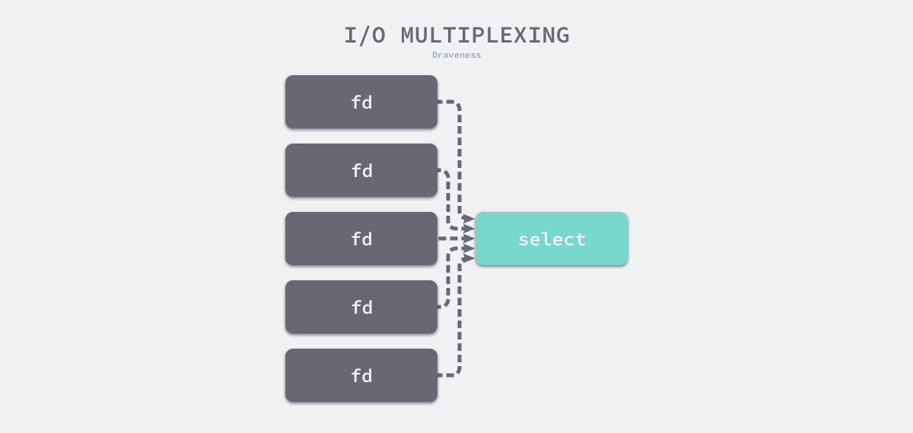
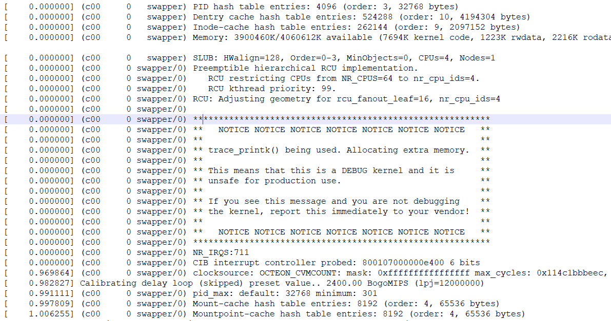
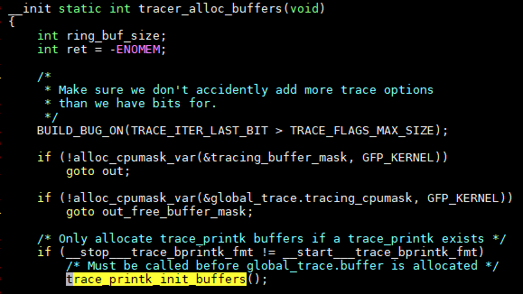
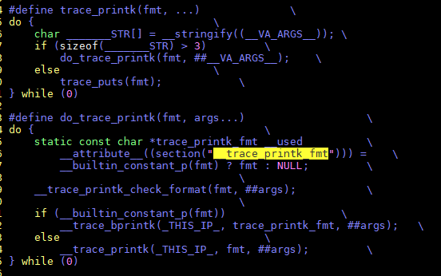
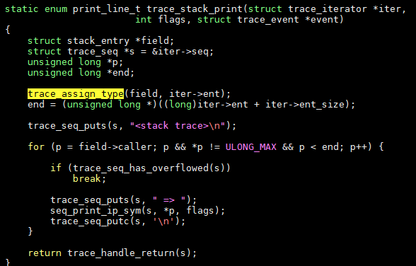
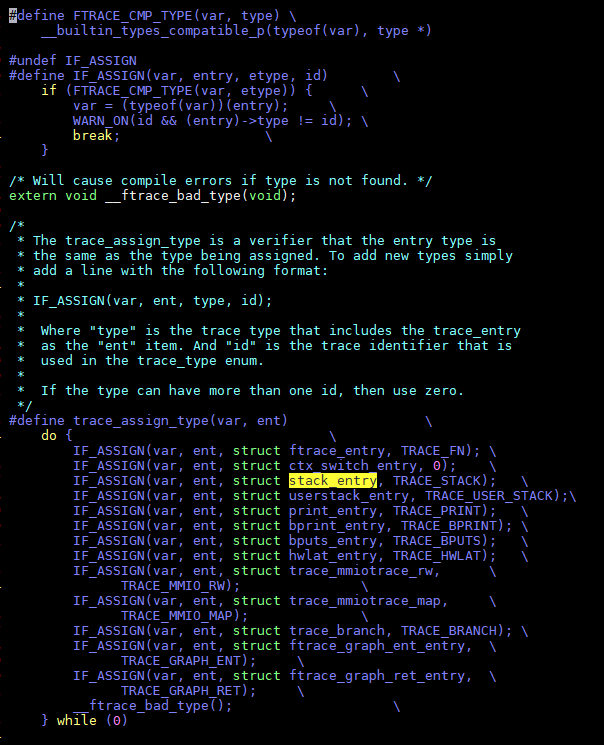
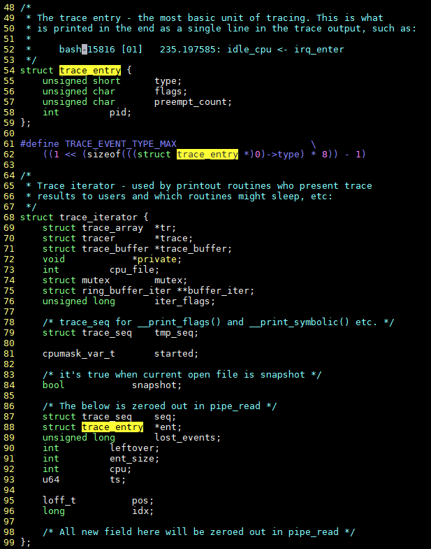
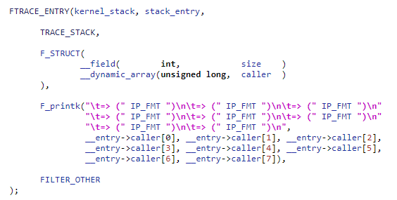
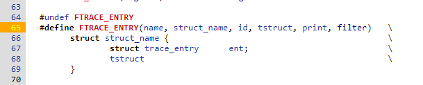

- [raw socket收报全丢掉, 测试性能](#raw-socket收报全丢掉-测试性能)
- [scanf忽略某个filed](#scanf忽略某个filed)
- [IO模型](#io模型)
  - [普通阻塞读写](#普通阻塞读写)
  - [非阻塞系统调用](#非阻塞系统调用)
  - [多路IO复用](#多路io复用)
  - [O_ASYNC和O_NONBLOCK有什么区别?](#o_async和o_nonblock有什么区别)
- [父子进程与FD -- fcntl的使用](#父子进程与fd----fcntl的使用)
- [使用gcc内建函数返回调用者](#使用gcc内建函数返回调用者)
  - [printk支持多种内部结构打印](#printk支持多种内部结构打印)
- [trace_printk()很有意思](#trace_printk很有意思)
  - [结论](#结论)
- [Uboot的命令注册机制](#uboot的命令注册机制)
- [C实现基类派生](#c实现基类派生)
  - [同类型检查](#同类型检查)
  - [实例](#实例)
    - [基类和派生类](#基类和派生类)
- [把rootfs.cpio嵌入到vmlinux--incbin的使用](#把rootfscpio嵌入到vmlinux--incbin的使用)
- [如何用C设计面向对象的中间层](#如何用c设计面向对象的中间层)
  - [父类子类公用一个结构体](#父类子类公用一个结构体)
  - [一个公共C文件, 和若干个"子类"C文件](#一个公共c文件-和若干个子类c文件)
  - [总结](#总结)
- [syslog记录log到syslogd](#syslog记录log到syslogd)
- [使用宏拼接](#使用宏拼接)

# raw socket收报全丢掉, 测试性能
```c
#include <sys/types.h>
#include <unistd.h>
#include <sys/types.h>
#include <sys/socket.h>
#include <stdio.h>
#include <stdlib.h>
#include <strings.h>
#include <unistd.h>

#include <linux/if_packet.h>
#include <linux/if_ether.h>
#include <linux/if_arp.h>
#include <netinet/in.h>

#include <string.h>

extern unsigned if_nametoindex(const char *ifname);

char *interface = "eth-mgnt";
int create_raw_eth_socket(void)
{
  int eth_sock;
  struct sockaddr_ll eth_dest;

  unsigned long itf_ifindex = if_nametoindex(interface);

  /*ETH socket, RAW communication*/
  eth_dest.sll_family   = PF_PACKET;
  eth_dest.sll_protocol = htons(ETH_P_ALL);
  eth_dest.sll_ifindex  = itf_ifindex;
  eth_dest.sll_hatype   = ARPHRD_ETHER;
  eth_dest.sll_pkttype  = PACKET_OTHERHOST;
  eth_dest.sll_halen    = ETH_ALEN;

  eth_sock = socket(AF_PACKET, SOCK_RAW, htons(ETH_P_ALL));
  bind(eth_sock,(struct sockaddr*)&eth_dest,sizeof(eth_dest));

  return eth_sock;
}

int main(int argc,char *argv[], char**envp)
{
  int eth_sock;
  struct sockaddr_ll eth_src;
  unsigned char data[1600];
  unsigned long packet_count = 0;

  eth_sock = create_raw_eth_socket();

  while (1)
  {
    socklen_t addr_len = sizeof(eth_src);
    int size = recvfrom(eth_sock,data,sizeof(data),0,(struct sockaddr*)&eth_src,&addr_len);
    if (size < 0) {
      printf("Error reading socket\n\r");
      break;
    }
    packet_count++;

    if ((packet_count % 1000) == 0)
        printf("count = %10lu\n",packet_count);
  }

  close(eth_sock);
  return 1;
}

```

# scanf忽略某个filed
`%*`关键词告诉scanf忽略这部分input
```c
fscanf(fpstat, "%*d %*s %*c %*d %*d %*d %*d %*d %*u %*u %*u %*u %*u %lu"
               "%lu %ld %ld %*d %*d %*d %*d %*u %lu %ld",
               &result->utime_ticks, &result->stime_ticks,
               &result->cutime_ticks, &result->cstime_ticks, &result->vsize,
               &rss)
```

# IO模型
## 普通阻塞读写
正常的读写是阻塞的.
```c
ssize_t read(int fd, void *buf, size_t count);
ssize_t write(int fd, const void *buf, size_t nbytes);
```
  

## 非阻塞系统调用
非阻塞的读写需要先给fd设置标记
```
int flags = fcntl(fd, F_GETFL, 0);
fcntl(fd, F_SETFL, flags | O_NONBLOCK);
```
后面的读写会马上返回, 如果没准备好, 返回EAGAIN.

  


## 多路IO复用
```
int select(int nfds, fd_set *restrict readfds, fd_set *restrict writefds, fd_set *restrict errorfds, struct timeval *restrict timeout);
```
> 除了标准的 select 函数之外，操作系统中还提供了一个比较相似的 poll 函数，它使用链表存储文件描述符，摆脱了 1024 的数量上限。  
  

## O_ASYNC和O_NONBLOCK有什么区别?
异步编程模型下, 一般设socket的fd为O_NONBLOCK, 结合epoll, 等待数据的时候阻塞在epoll, 写socket不阻塞, 有错误直接返回.

那O_ASYNC有什么用? 和O_NONBLOCK有什么区别?  
答:O_ASYNC请求kernel在有数据的时候发送SIGIO or SIGPOLL给所属进程. 一般不常用, 因为在sighandler里面处理io不好, signal的deliver过程比epoll复杂.

参考[StackOverflow](https://stackoverflow.com/questions/6260114/whats-the-difference-between-async-and-nonblocking-in-unix-socket)

# 父子进程与FD -- fcntl的使用
子进程集成父进程的FD, 但子进程exec后呢?
有个函数, 如果调用, 表示子进程exec后, 关闭该fd. 意思就是子进程即使exec, 默认也是继承父进程的fd的.
```c
fcntl(fd, F_SETFD, FD_CLOEXEC)
```
fcntl还有其他作用:
```c
#include<unistd.h>
#include<fcntl.h>
//定义函数
int fcntl(int fd , int cmd);
int fcntl(int fd,int cmd,long arg);
int fcntl(int fd,int cmd,struct flock * lock);

//fcntl()用来操作文件描述词的一些特性。参数fd代表欲设置的文件描述词，参数cmd代表欲操作的指令。
//有以下几种情况:
F_DUPFD用来查找大于或等于参数arg的最小且仍未使用的文件描述词，并且复制参数fd的文件描述词。执行成功则返回新复制的文件描述词。请参考dup2()。F_GETFD取得close-on-exec旗标。若此旗标的FD_CLOEXEC位为0，代表在调用exec()相关函数时文件将不会关闭。
F_SETFD 设置close-on-exec 旗标。该旗标以参数arg 的FD_CLOEXEC位决定。
F_GETFL 取得文件描述词状态旗标，此旗标为open（）的参数flags。
F_SETFL设置文件描述词状态旗标，参数arg为新旗标，但只允许O_APPEND、O_NONBLOCK和O_ASYNC位的改变，其他位的改变将不受影响。
F_GETLK 取得文件锁定的状态。
F_SETLK 设置文件锁定的状态。此时flcok 结构的l_type值必须是F_RDLCK、F_WRLCK或F_UNLCK。如果无法建立锁定，则返回-1，错误代码为EACCES或EAGAIN。
F_SETLKW F_SETLK作用相同，但是无法建立锁定时，此调用会一直等到锁定动作成功为止。若在等待锁定的过程中被信号中断时，会立即返回-1，错误代码为EINTR。参数lock指针为flock结构指针，定义如下
struct flcok
{
    short int l_type;
    short int l_whence;
    off_t l_start;
    off_t l_len;
    pid_t l_pid;
};
l_type 有三种状态:
F_RDLCK 建立一个供读取用的锁定
F_WRLCK 建立一个供写入用的锁定
F_UNLCK 删除之前建立的锁定
l_whence 也有三种方式:
SEEK_SET 以文件开头为锁定的起始位置。
SEEK_CUR 以目前文件读写位置为锁定的起始位置
SEEK_END 以文件结尾为锁定的起始位置。

//返回值
成功则返回0，若有错误则返回-1，错误原因存于errno.
```

# 使用gcc内建函数返回调用者
在kernel启动过程中, 有下面的打印:
```c
memblock_reserve: [0x00000100000000-0x00000100829fff] flags 0x0 early_init_devtree+0x104/0x350
memblock_reserve: [0x00000000c10000-0x0000000166fdc7] flags 0x0 early_init_fdt_scan_reserved_mem+0x5c/0x7c
memblock_reserve: [0x000001fe000000-0x000001feffffff] flags 0x0 memblock_alloc_range_nid+0x70/0x7c
```
看起来`memblock_reserve`是个函数, 表示哪段区间的内存被reserve了. 它的最后一个打印字段有意思, 是调用者的函数名吗?
打印出自:
```c
int __init_memblock memblock_reserve(phys_addr_t base, phys_addr_t size)
{
 memblock_dbg("memblock_reserve: [%#016llx-%#016llx] flags %#02lx %pF\n",
       (unsigned long long)base,
       (unsigned long long)base + size - 1,
       0UL, (void *)_RET_IP_);

 return memblock_add_range(&memblock.reserved, base, size, MAX_NUMNODES, 0);
}
```
而`_RET_IP_`是`#define _RET_IP_    (unsigned long)__builtin_return_address(0)`

`__builtin_return_address`是gcc提供的内建函数, 返回当前函数的返回地址. level0表示当前函数, level1表示返回其父函数的返回地址, 以此类推.  
`Built-in Function: void * __builtin_return_address (unsigned int level)`

详见: https://gcc.gnu.org/onlinedocs/gcc/Return-Address.html

----
有了程序地址, printk传入`%pS`就能打印符号了. 见`linux/Documentation/core-api/printk-formats.rst`

## printk支持多种内部结构打印
实际上, printk支持很多很多常见格式的打印, 比如IP地址(`%pI4`), MAC地址格式的打印, 物理地址`phys_addr_t`类型的(`%pa`), DMA地址...

还有一些linux内部常用结构, 比如dentry, block_device, device tree, 时间, clock等等等等.

# trace_printk()很有意思
在代码里加了trace_printk(), 和ftrace连用, 可以很方便的调试代码.
而且, 有个地方很有意思, 你调用了trace_printk(), 在kernel启动的很早期, 会打印一个warning message

  

这个地方非常早, trace_printk()还没来得及被调用.

那kernel怎么知道要打印这个呢? 如果代码里没有调用trace_printk(), 是没有这个打印的
这个warning是在`trace_printk_init_buffers()`打印的, 条件是  
`if (__stop___trace_bprintk_fmt != __start___trace_bprintk_fmt)`  
这两个"变量"是指针:
```c
extern const char *__start___trace_bprintk_fmt[];
extern const char *__stop___trace_bprintk_fmt[];
```
  

在链接脚本里`include/asm-generic/vmlinux.lds.h`
```c
#define TRACE_PRINTKS() VMLINUX_SYMBOL(__start___trace_bprintk_fmt) = .; \
    *(__trace_printk_fmt) /* Trace_printk fmt' pointer */ \
    VMLINUX_SYMBOL(__stop___trace_bprintk_fmt) = .;
```

OK, 再来看看`trace_printk()`的定义:  
  

原来, trace_printk()的入参fmt, 是保存在`__trace_printk_fmt`这个section的, 用trace_printk_fmt指针指向它.

如果有代码调用了trace_printk(), 那就传了fmt参数, 从而`__trace_printk_fmt`里面有东西, 这是**在编译时**就知道了的事情;

那**在运行时**判断, 这个section里面有没有东西  
`if (__stop___trace_bprintk_fmt != __start___trace_bprintk_fmt)`

## 结论
这是个很好的技巧, 根据编译时代码的状态, 来决定运行时的行为.

# Uboot的命令注册机制
要点: 这样可以免去在运行时"注册"命令. 使用连接器的自定义section里面的数组, 命令静态的被连接到可执行程序里.
这样做, 可以在一个C文件里, 同时完成命令的实现, 和命令的注册.
这个特殊的section, 可以在运行时访问.

比如bootm命令, 在`common/cmd_bootm.c`中, 是这样注册的:
```c
U_BOOT_CMD(
    bootm, CONFIG_SYS_MAXARGS, 1, do_bootm,
    "boot application image from memory", bootm_help_text
);
```
这个宏, 会把bootm相关的要素: 命令, 函数, 说明, 写入特殊的段内, 需要链接器配合.
linux kernel也经常用这个机制.
```c
#define U_BOOT_CMD(_name, _maxargs, _rep, _cmd, _usage, _help) \
    U_BOOT_CMD_COMPLETE(_name, _maxargs, _rep, _cmd, _usage, _help, NULL)

#define U_BOOT_CMD_COMPLETE(_name, _maxargs, _rep, _cmd, _usage, _help, _comp) \
    ll_entry_declare(cmd_tbl_t, _name, cmd) = \
        U_BOOT_CMD_MKENT_COMPLETE(_name, _maxargs, _rep, _cmd, \
                _usage, _help, _comp);
```

关键在于`include/linker_lists.h`中:
```c
#define ll_entry_declare(_type, _name, _list)     \
    _type _u_boot_list_2_##_list##_2_##_name __aligned(4) \
    __attribute__((unused, \
    section(".u_boot_list_2_"#_list"_2_"#_name)))
```
可以在运行时访问, 因为可以找到数组的"基地址"
```c
struct my_sub_cmd *msc = ll_entry_start(struct my_sub_cmd, cmd_sub);

#define ll_entry_start(_type, _list) \
({                                                    \
    static char start[0] __aligned(4) __attribute__((unused, \
        section(".u_boot_list_2_"#_list"_1"))); \
    (_type *)&start;                                        \
})
```

# C实现基类派生
关键点: C里面, 派生类的结构体, 显式的在最开始包含其基类的结构体.  
这样, 在知道一个指针是基类, 但实际是派生类的情况下, 可以指针强转成派生类.

使用gcc提供的类型检查, 可以保证这个强转的合法性.
## 同类型检查
GNU提供了一个runtime宏来检查两个类型是否一样:
`int __builtin_types_compatible_p(type_a, type_b);`
type_a和type_b一致, 返回1; 否则返回0  
使用
```c
#define __COMPARE_TYPES(v, t) \
    __builtin_types_compatible_p(__typeof__(v), t)
...
if (__COMPARE_TYPES(p, double) != 0)
    err(EX_DATAERR, "invalid type");
```

## 实例
  
  
以上代码简化为
```c
struct stack_entry *field = (struct stack_entry *) iter->ent
```
### 基类和派生类
`field`是`stack_entry`, 而`iter->ent`是`trace_entry`, 是不一样的. 为什么能强转呢?

  
  

这中间的奥秘在于, strace_entry相当于基类, stack_entry是它的派生类.
strace_entry被stack_entry包含在其结构体头部.  
具体见`kernel/trace/trace.h`  
  

这样, 指向基类的指针, 被强制转换为指向其派生类的指针. 这要求`trace_stack_print`的入参`struct trace_iterator *iter`, 本身就是stack_entry派生类.

# 把rootfs.cpio嵌入到vmlinux--incbin的使用
在`linux-octeon-3.0/usr/initramfs_data.S`中  
使用了.incbin  
其中, INITRAMFS_IMAGE为initramfs_data.cpio.gz
```c
#include <linux/stringify.h>
#include <asm-generic/vmlinux.lds.h>
 
.section .init.ramfs,"a"
__irf_start:
.incbin __stringify(INITRAMFS_IMAGE)
__irf_end:
.section .init.ramfs.info,"a"
.globl VMLINUX_SYMBOL(__initramfs_size)
VMLINUX_SYMBOL(__initramfs_size):
#ifdef CONFIG_64BIT
    .quad __irf_end - __irf_start
#else
    .long __irf_end - __irf_start
#endif
```

# 如何用C设计面向对象的中间层
## 父类子类公用一个结构体
设计一个结构体, 并声明这个结构体的全局变量: 这个结构体有点像C++的类, 但可以认为是父类和子类都共用这个结构体, 所以, 这个结构体应该设计成既包括公有方法的指针, 又包括私有方法的指针. 
```c
typedef struct
{
    一些控制变量;
    //父类方法指针, 由父类C文件提供默认值;
    void (*lock)(void);
    void (*unlock)(void);
    int (*reset)(int stop_core);
    uint64_t (*read_register)(int core, int reg);
    void (*write_register)(int core, int reg, uint64_t value);
    uint64_t (*read_csr)(uint64_t physical_address);
    void (*write_csr)(uint64_t physical_address, uint64_t value);
      
    //子类方法, 分别由子类C文件提供
    int (*open)(const char *remote_spec);
    void (*close)(void);
    void (*read_mem)(void *buffer, uint64_t physical_address, int length);
    void (*write_mem)(uint64_t physical_address, const void *buffer, int length);
    uint64_t (*get_running_cores)(void);
     uint32_t (*get_num_cores)(void);
} octeon_remote_funcs_t;
/*全局变量*/
static octeon_remote_funcs_t remote_funcs;
```

## 一个公共C文件, 和若干个"子类"C文件
```
父类:
octeon-remote.c
子类:
    octeon-remote-cvmx.c          
    octeon-remote-gdbremote.c 
    octeon-remote-map.c
    octeon-remote-console.c 
    octeon-remote-debug-handler.c 
    octeon-remote-linux.c     
    octeon-remote-pci.c
```
父类C文件提供了对外统一的api(虚函数), 使调用者不用关心底层实现, 特别的, 在子类C文件中, 虽然是有具体的"虚函数"的实现, 但最好还是调用父类的虚函数接口.

父类C文件负责总的初始化, 包括公用结构体变量的父类方法指针的赋值, 并根据情况(如用户输入), 来调用某个子类的初始化接口. 

子类的初始化接口里, 负责子类特殊的初始化, 以及子类方法指针的赋值.

## 总结
这种方式实现的封装, 要求全部子类的代码都要参与编译. 只是运行阶段, 根据情况, 选择使用某个子类. 

# syslog记录log到syslogd
```c
#include <syslog.h>

setlogmask (LOG_UPTO (LOG_NOTICE));

openlog ("exampleprog", LOG_CONS | LOG_PID | LOG_NDELAY, LOG_LOCAL1);

syslog (LOG_NOTICE, "Program started by User %d", getuid ());
syslog (LOG_INFO, "A tree falls in a forest");

closelog ();
```

# 使用宏拼接
* 定义寄存器表board_cpld_registers.h, 注意不要加头文件卫士  

```c
cpld_declare_reg(CIPHER1,                   0x00,   0,  8)
cpld_declare_reg(CIPHER2,                   0x01,   0,  8)
cpld_declare_reg(CIPHER3,                   0x02,   0,  8)
cpld_declare_reg(CIPHER4,                   0x03,   0,  8)
cpld_declare_reg(VERSION,                   0x07,   0,  8)
cpld_declare_reg(REVISION,                  0x08,   0,  8)
cpld_declare_reg(REG_GICI_SHELF_BPSW,       0x0b,   0,  8)
cpld_declare_reg(SHELF_ID,                  0x0b,   0,  2)
cpld_declare_reg(BPSW,                      0x0b,   4,  3)
cpld_declare_reg(GICI_P,                    0x0b,   7,  1)
cpld_declare_reg(REG_NTR_STAT,              0x0e,   0,  8)
```

* 在公共头文件里定义宏接口, 使用宏拼接##来简化操作  

```c
extern spinlock_t cpld_lock;
 
#undef cpld_declare_reg
#define cpld_declare_reg(a,b,c,d) a,
enum cpld_field_id {
#include "board_cpld_registers.h"
};
 
#undef cpld_declare_reg
#define cpld_declare_reg(a,b,c,d) a##_OFFSET_ = b,
enum cpld_field_offset {
#include "board_cpld_registers.h"
};
 
#undef cpld_declare_reg
#define cpld_declare_reg(a,b,c,d) a##_START_BIT_ = c,
enum cpld_field_start_bit {
#include "board_cpld_registers.h"
};
 
#undef cpld_declare_reg
#define cpld_declare_reg(a,b,c,d) a##_MASK_ = ((1 << (d)) - 1) << (c),
enum cpld_field_mask {
#include "board_cpld_registers.h"
};
 
#define rd_cpld_field(base, field_nr, pval) \
        do { \
            unsigned long __flags; \
            u8 __tmp; \
            spin_lock_irqsave(&cpld_lock, __flags); \
            __tmp = ioread8((base) + field_nr##_OFFSET_); \
            spin_unlock_irqrestore(&cpld_lock, __flags); \
            *(pval) = (__tmp & field_nr##_MASK_) >> field_nr##_START_BIT_; \
        }while(0)
 
#define  wr_cpld_field(base, field_nr, val) \
        do { \
            unsigned long __flags; \
            u8 __tmp; \
            spin_lock_irqsave(&cpld_lock, __flags); \
            __tmp = ioread8((base) + field_nr##_OFFSET_); \
            __tmp &= (u8)~field_nr##_MASK_; \
            __tmp |= ((val) << field_nr##_START_BIT_) & field_nr##_MASK_; \
            iowrite8(__tmp, (base) + field_nr##_OFFSET_); \
            spin_unlock_irqrestore(&cpld_lock, __flags); \
        }while(0)
```
