- [内存一致性和内存屏障](#内存一致性和内存屏障)
  - [内存一致性协议: directory类的协议](#内存一致性协议-directory类的协议)
  - [内存的一致性协议: MESI协议(用于Pentium II, 1998), 属于snooping类的协议](#内存的一致性协议-mesi协议用于pentium-ii-1998-属于snooping类的协议)
    - [基本概念](#基本概念)
    - [举例: atomic](#举例-atomic)
  - [write buffer](#write-buffer)
    - [带来一致性问题:](#带来一致性问题)
    - [用Write memory barrier解决](#用write-memory-barrier解决)
  - [invalid queue](#invalid-queue)
    - [带来一致性问题](#带来一致性问题-1)
    - [用Read memory barrier解决](#用read-memory-barrier解决)
- [内存对齐](#内存对齐)
- [pthread的spin lock实现](#pthread的spin-lock实现)
  - [其他实现方式](#其他实现方式)


# 内存一致性和内存屏障
## 内存一致性协议: directory类的协议
目录类的协议, 是在一个表里记录核管理所有cache的状态, 也基本分三大类:Invalid Shared Exclusive 
CPU的所有读写, 也会发message给这个directory, 来保证一致性.
扩展性好?

## 内存的一致性协议: MESI协议(用于Pentium II, 1998), 属于snooping类的协议
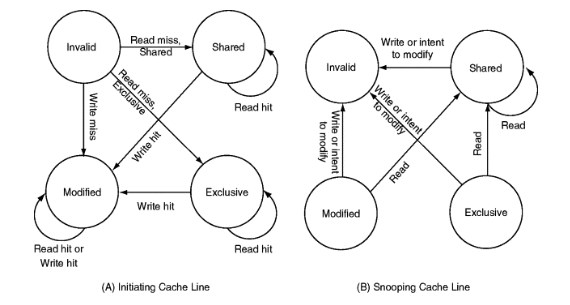  
上图A是指发起改变的cache line. B是监听改变的cache line.
以cache line为基本单位, 有四种状态:
* Modified 
* Exclusive
* Shared
* Invalid

注意cache一致性并不单指L2或L3, 在现代CPU上, 通常一个core有自己的private L1 cache, 这个cache也要遵从cache一致性协议.

可以反证: 在spin lock场景下, 如果CPU的L1 cache是彼此孤立的, 未取得锁的CPU, 因为已经将lock值cache到L1, 每次读都有L1 read hit, 那么每次都将看到同一个值, 永远获取不到锁.


### 基本概念
* read: 读一个cache line的物理地址
* read response: 响应前一个read命令, 可以由memory或cache提供; 如果一个cache有这个data, 并且在"Modified"状态, 这个cache**必须**响应read命令
* invalidate: 被失效的cache line的物理地址
* invalidate acknowledge: 收到invalidate消息的CPU, 必须在移除被失效cache line后, 发invalidate acknowledge消息.
* read invalidate: 在发read地址的同时, 指示其他cache移除这个数据. 
是read和invalidate的组合, 需要read response 和一组invalidate acknowledge
* writeback: 把"Modified"状态的cache line写入到memory, 以及可能的cache; 为其他数据腾空间.

### 举例: atomic
比如`atomic_inc()`, 是个read-modify-write的过程, 具体而言:
1. CPU发read invalidate命令, 通过read invalidate来得到data, 同时通知其他持有这个data的CPU的cache line都失效
2. 只有CPU收到完整的invalidate acknowledge消息后, 才能完成这次transition  
现代CPU通常有原子指令来支持atomic操作, 但其bus上的协议逻辑还是类似的.

再比如下面的while读取current_ticket, 假设此时CPU的cache没有这个data, 那么就是CPU发read命令, 等待read response得到data.
状态从invalid转变到shared.  
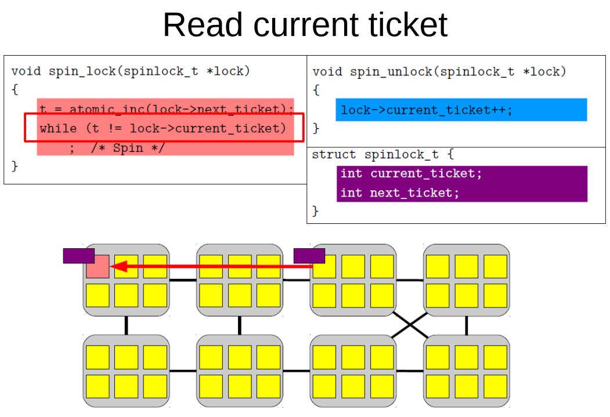  

再比如, 更新current ticket时, 依次完成
1. 本来这个cache line是**shared**状态, 此时蓝色部分要更改变量, CPU就会发invalidate命令
2. CPU等待invalidate acknowledge相应, 这里图上画了8个CPU都有这个data, 那要等8个响应回来
3. 此时状态为**exclusive**
4. CPU把更新的data写到cache line里, 变为**modified**状态. 蓝色CPU
5. 其他的CPU read这个data, 比如上面那个不断while读current_ticket的CPU
6. 蓝色CPU必须响应红色CPU的read, 用read response把cache line返回给read请求的CPU, 此时也有可能writeback到内存里.
7. 红色CPU得到data的cache line拷贝, 这次值更新了, 红色CPU退出等待.

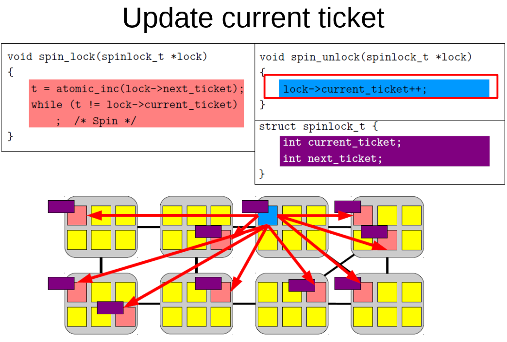  

## write buffer
如前面所述, 对变量写, 要先invalidate cache line, 要等待其他cache返回invalidate acknowledge, 最后再写cache line. 
这个过程比较昂贵.  
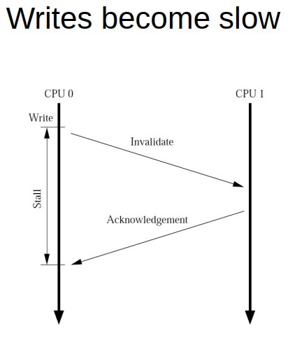  

所以产生了write buffer, 或者叫store buffer. 这样CPU放下数据, 就可以返回, 不用等待.  
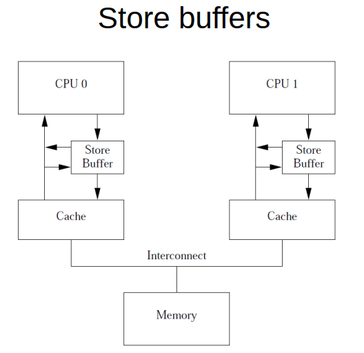  

### 带来一致性问题:
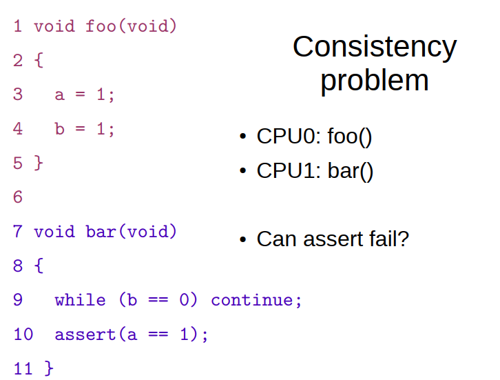  

在下面的情况下, a被写入store buffer, 此时其他cache可能还在refer a=0
在执行b=1时, b是exclusive状态, 是可以直接写cache的;  
当收到read(b)的请求时, 响应read_reply(b,1)  
最后CPU1 看到了b的更新, 而没看到a的更新. 导致assert fail

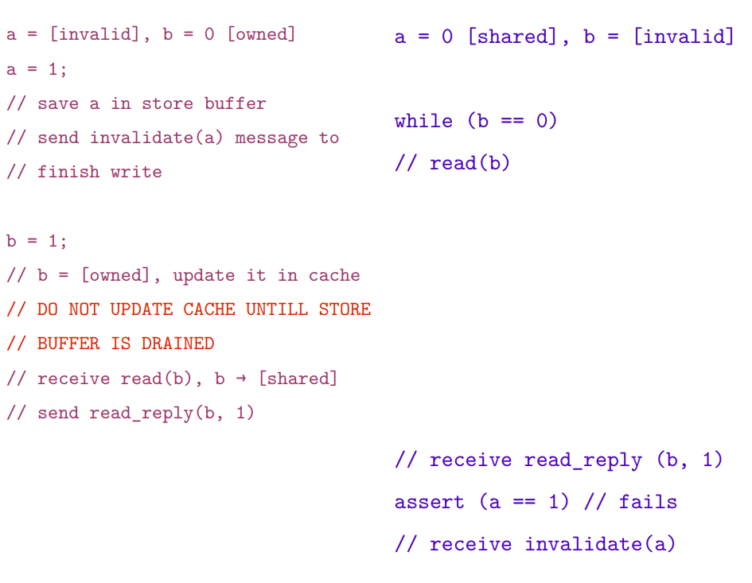  

### 用Write memory barrier解决
写屏障指令smp_wmb()是用来解决上述问题的:
* 在发生其他的store命令写cache之前, 强制CPU去flush它的store buffer
* CPU可以stall, 也可以把后续的store命令用store buffer先保存, 直到把之前的store buffer清空.

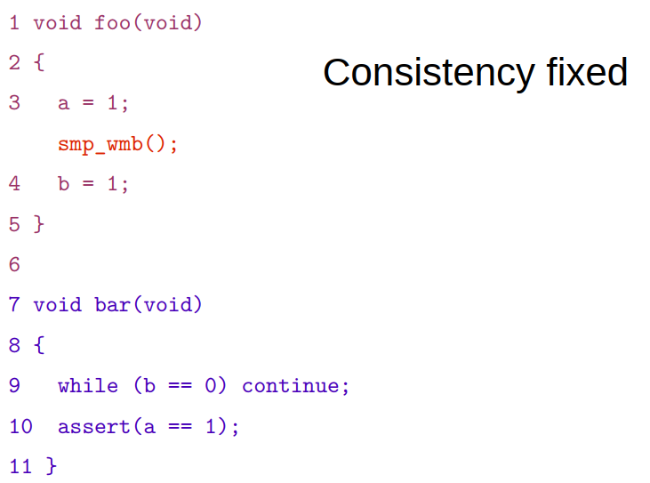  

详细解释:  
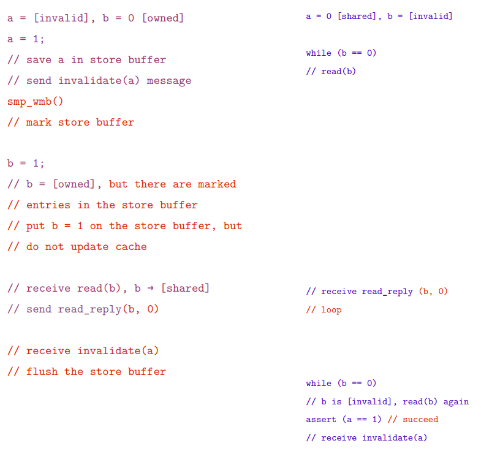  

## invalid queue
invalid消息可能会慢, 比如一个data有很多份cache line的拷贝, 要等到所有的invalidate acknowledgements都完成吗?  
虽然有store buffer, 但store buffer溢出怎么办?  
不等cache行不行?
* 接收CPU用invalid queue保存invalid消息
* 马上完成acknowledge, 通知发起CPU可以往下走
* 由invalid queue实施后面的invalid操作

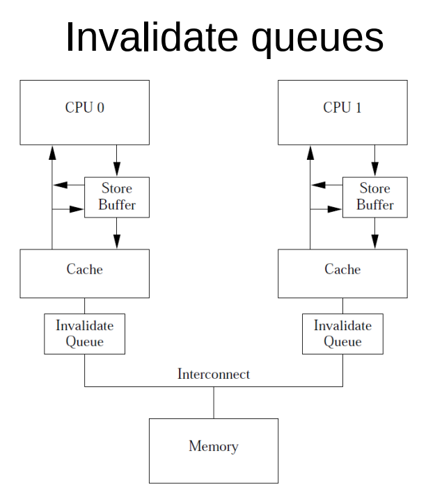  

### 带来一致性问题
这里已经用smp_wmb()来解决了store buffer的一致性问题.

但CPU1收到invalidate(a)后, 是放到队列里的.  
导致在看到b变为1后的assert(), 对a的访问是cache hit(因为还没有来得及invalidate, 可能因为invalidate queue暂存的invalidate消息比较多.  
在这种情况下, CPU1读到a还是0  

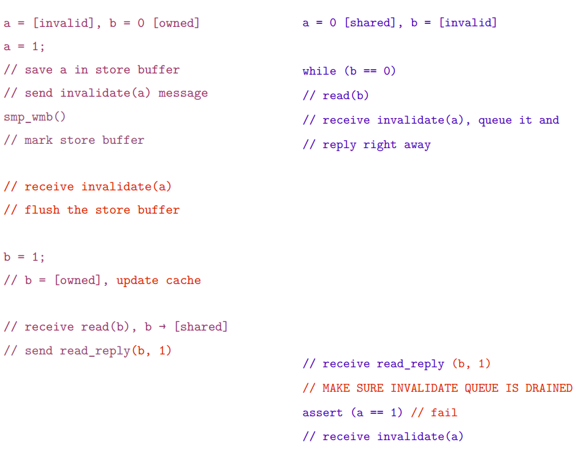  

### 用Read memory barrier解决
smp_rmb(): 标记invalidate queue中的所有entry(即invalidate消息), 使得后续的load(读)操作都要等待, 直到所有的被标记的entry都被成功应用到cache.  
这样读的时候, 就不会出现"假的"cache hit.  

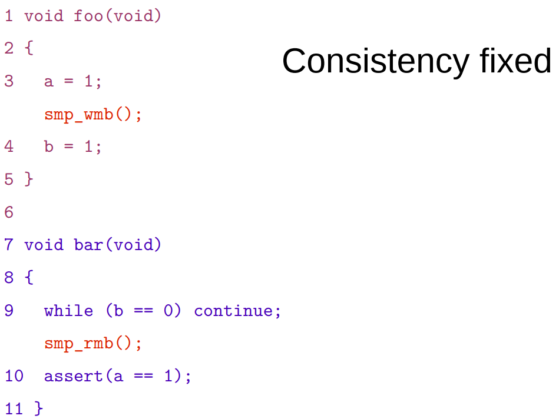  

详细解释:
在CPU1执行while(b==0)后加入读屏障指令:
* CPU1必须停下来等待invalidate queue完成
* invalidate queue里的invalidate(a)消息, 把a的cache line从cache里移除了
* CPU1执行assert, 因为cache里没有a了, 发生cache miss, 产生了read消息
* CPU0响应这个read消息, 返回新的a=1
* CPU1收到a的值为1, 不会触发断言.

# 内存对齐
```c
addr & ~(align - 1)
//
(gdb) p/x ~(8-1)
$3 = 0xfffffff8
(gdb) p/x ~(64-1)
$5 = 0xffffffc0
(gdb) p/x ~(128-1)
$6 = 0xffffff80
```

# pthread的spin lock实现
pthread库实现了spin lock, pthread_spinlock_t值为0表示空闲, 值为1表示被锁.

其实现如下:
```c
# 用perf probe能看到代码实现, 需要libc的debug符号
# perf probe -x /lib64/libpthread.so.0 -L pthread_spin_lock

<pthread_spin_lock@/usr/src/debug/glibc-2.17-c758a686/nptl/../nptl/pthread_spin_lock.c:0>
pthread_spin_lock (pthread_spinlock_t *lock)
{
    /* atomic_exchange 通常要更省指令, 而
        atomic_compare_and_exchange在锁已经被别人持有的时候, 产生的bus traffic更少
        这里假设第一次尝试获取锁, 大部分情况下是成功的, 所以第一次用atomic_exchange, 不成功后面再用atomic_compare_and_exchange.
    */
    if (atomic_exchange_acq (lock, 1) == 0)
        return 0;
    /* 等待锁释放. 如果没有这个while, 直接用cmpxchg会带来昂贵的核之间的同步开销, 所以这里先等待lock值变为0.
        这里也可以加wait--计数, 防止无限等待
    */ 
    while (*lock != 0);
    /* 有人释放了锁, 这里就把锁置1. 也要用循环.
        最简单的实现是, 前面都不要, 只要这个while, 也能搞定
        代价是多核的同步traffic会变多, 通常这种同步开销比较大
    */
    while (atomic_compare_and_exchange_val_acq (lock, 1, 0) != 0);
    return 0;
}

# perf probe -x /lib64/libpthread.so.0 -L pthread_spin_unlock
pthread_spin_unlock (pthread_spinlock_t *lock)
{
    atomic_full_barrier ();
    //值为0表示释放锁.
    *lock = 0;
    return 0;
}
```

## 其他实现方式
还有用计数器++, 用atomic_inc(计数器)等方式的spin lock实现. 
所有这些实现, 都需要atomic_xxx, 来原子的改变lock变量的值.
