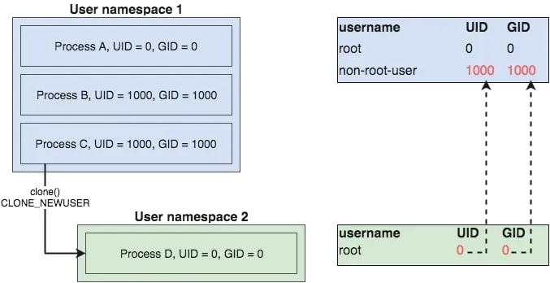

- [使用unshare](#使用unshare)
  - [名字空间种类](#名字空间种类)
  - [mount名字空间](#mount名字空间)
  - [相关的syscall](#相关的syscall)
- [go运行新的名字空间](#go运行新的名字空间)
  - [更加完整的的名字空间](#更加完整的的名字空间)
  - [USER名字空间](#user名字空间)
  - [创建全新的mount名字空间](#创建全新的mount名字空间)
  - [Network名字空间](#network名字空间)
    - [使能外网](#使能外网)
  - [reexec](#reexec)

笔记参考来源: https://github.com/teddyking/ns-process

# 使用unshare
unshare用来在新的名字空间里面run另外一个program
```shell
$ sudo su                   # become root user
$ hostname                  # check current hostname
dev-ubuntu  
$ unshare -u /bin/sh        # create a shell in new UTS namespace
$ hostname my-new-hostname  # set hostname
$ hostname                  # confirm new hostname
my-new-hostname  
$ exit                      # exit new UTS namespace
$ hostname                  # confirm original hostname unchanged
dev-ubuntu
```
上面的例子中, `unshare -u`使用了新UTS空间来run一个shell程序, 在里面改hostname并不会改外面的hostname

## 名字空间种类
1. Mount - isolate filesystem mount points
2. UTS - isolate hostname and domainname
3. IPC - isolate interprocess communication (IPC) resources
4. PID - isolate the PID number space
5. Network - isolate network interfaces
6. User - isolate UID/GID number spaces
7. Cgroup - isolate cgroup root directory

* 大部分unshare的名字空间需要sudo权限, 但User例外

## mount名字空间
```shell
whoami                  #返回root, 在里面认为自己是root
sudo unshare -m /bin/sh #在新的mount空间运行shell
ls /                    #在新的空间能看到外面的root
ls /proc                #也能看到外面的proc
cat /proc/mounts        #在里面看到的mounts和外面一样, 但外面修改的mount不会体现在里面
mkdir test
mount -o bind /dev test #在里面mount不需要sudo, 因为自己就是root; 而且在外面也看不到
```
为什么mount名字空间能够"继承"父进程的mounts呢? `man mount_namespaces`解释了这个行为似乎是有意为之.
> “When a process creates a new mount namespace using clone(2) or unshare(2) with the CLONE_NEWNS flag, the mount point list for the new namespace is a copy of the caller’s mount point list.”

## 相关的syscall
有三个相关的syscall
* clone: 创建新的进程, 支持CLONE_NEWNS CLONE_NEWPID等flag
* setns: 让calling进程加入一个已经存在的namespace
* unshare: 把calling进程放到一个新的namespace

# go运行新的名字空间
`"os/exec"`和`"syscall"`本身就支持了在新的名字空间运行子进程. 比如下面的例子
```go
# Git repo: https://github.com/teddyking/ns-process
# Git tag: 1.0
# Filename: ns_process.go
package main

import (
	"fmt"
	"os"
	"os/exec"
	"syscall"
)

func main() {
	cmd := exec.Command("/bin/sh")

	cmd.Stdin = os.Stdin
	cmd.Stdout = os.Stdout
	cmd.Stderr = os.Stderr

	cmd.Env = []string{"PS1=-[ns-process]- # "}

	cmd.SysProcAttr = &syscall.SysProcAttr{
		Cloneflags: syscall.CLONE_NEWUTS,
	}

	if err := cmd.Run(); err != nil {
		fmt.Printf("Error running the /bin/sh command - %s\n", err)
		os.Exit(1)
	}
}
```
重点是在`cmd.Run()`之前, 用`cmd.SysProcAttr`来设置新的子进程的名字空间的属性

`SysProcAttr.Cloneflags`会在`cmd.Run()`执行`clone()`系统调用的时候传入.

## 更加完整的的名字空间
上面的例子只有UTS空间, 也可以把所有的名字空间都加上. 这样新的子进程就能运行在一个完整隔离的空间了.
```go
cmd.SysProcAttr = &syscall.SysProcAttr{
		Cloneflags: syscall.CLONE_NEWNS |
			syscall.CLONE_NEWUTS |
			syscall.CLONE_NEWIPC |
			syscall.CLONE_NEWPID |
			syscall.CLONE_NEWNET |
			syscall.CLONE_NEWUSER,
	}
```
这个例子其实还不够实际使用
* `CLONE_NEWNS`只是隔离的子进程以后的mount, 当下的子进程还是继承了父进程的mount. 子进程能看到"外面的"root和mount
* `CLONE_NEWPID`需要自己来mount `/proc`
* `CLONE_NEWNET`需要额外配置network interface
* `CLONE_NEWUSER`需要UID/GID mapping

## USER名字空间
带USER的名字空间不需要root权限, 比如直接运行`unshare -m`会报权限错误:
```shell
$ unshare -m /bin/sh
unshare: unshare(0x20000): Operation not permitted
```
但加了`-U`就不会报错了:
```
$ unshare -Um /bin/sh
$ whoami
nobody
```
在里面显示user是`nobody`, 并不是之前的`root`. 这样虽然启动`unshare`不用`sudo`, 但里面的程序只有`nobody`权限.

下面的图表示了在用户名字空间1里的一个非root权限进程`C`, 创建了一个新的USER名字空间2, 在用户名字空间2里面, 进程`D`以为自己是`root`.
但这个`root`实际上是进程`C`的UID为1000的用户.


用下面的代码可以把当前用户map到新名字空间的root用户
```go
# Git repo: https://github.com/teddyking/ns-process
# Git tag: 2.0
# Filename: ns_process.go
# ...
cmd.SysProcAttr = &syscall.SysProcAttr{
		Cloneflags: syscall.CLONE_NEWNS |
			syscall.CLONE_NEWUTS |
			syscall.CLONE_NEWIPC |
			syscall.CLONE_NEWPID |
			syscall.CLONE_NEWNET |
			syscall.CLONE_NEWUSER,
		UidMappings: []syscall.SysProcIDMap{
			{
				ContainerID: 0,
				HostID:      os.Getuid(),
				Size:        1,
			},
		},
		GidMappings: []syscall.SysProcIDMap{
			{
				ContainerID: 0,
				HostID:      os.Getgid(),
				Size:        1,
			},
		},
	}
# ...
```
注意这里用到了`syscall.SysProcIDMap`这个结构体, `ContainerID`为`0`表示里面的`root`, `HostID`是外面的user id.

用`unshre -r`也可以达到同样的效果, `-r`的意思是
> Map current user to root (implies -U)

## 创建全新的mount名字空间
如前面所说, mount名字空间继承了父进程的mount点.
要创建全新的mount名字空间, 需要`pivot_root`系统调用的配合.

go的syscall标准库提供了
`func PivotRoot(newroot string, putold string) (err error)`
其中
* `newroot`和`putold`必须是目录
* 他们必须不能是在当前root下的mount点. 后面会用`bind` mount来解决这个限制
* `putold`必须是在`newroot`下面的目录
* `putold`不能是其他挂载点

下面的go代码演示了
1. 先用`bind mount`来挂载`newroot`目录
2. 然后用`PivotRoot`来切换root目录
3. 再后用`Umount`来卸载old root
```go
# Git repo: https://github.com/teddyking/ns-process
# Git tag: 4.0
# Filename: rootfs.go
func pivotRoot(newroot string) error {
	putold := filepath.Join(newroot, "/.pivot_root")

	// bind mount newroot to itself - this is a slight hack
	// needed to work around a pivot_root requirement
	if err := syscall.Mount(
		newroot,
		newroot,
		"",
		syscall.MS_BIND|syscall.MS_REC,
		"",
	); err != nil {
		return err
	}

	// create putold directory
	if err := os.MkdirAll(putold, 0700); err != nil {
		return err
	}

	// call pivot_root
	if err := syscall.PivotRoot(newroot, putold); err != nil {
		return err
	}

	// ensure current working directory is set to new root
	if err := os.Chdir("/"); err != nil {
		return err
	}

	// umount putold, which now lives at /.pivot_root
	putold = "/.pivot_root"
	if err := syscall.Unmount(
		putold,
		syscall.MNT_DETACH,
	); err != nil {
		return err
	}

	// remove putold
	if err := os.RemoveAll(putold); err != nil {
		return err
	}

	return nil
}
```

上面的代码要在新的mount名字空间里运行:
```go
# Git repo: https://github.com/teddyking/ns-process
# Git tag: 4.0
# Filename: ns_process.go
func nsInitialisation() {
	newrootPath := os.Args[1]

	if err := pivotRoot(newrootPath); err != nil {
		fmt.Printf("Error running pivot_root - %s\n", err)
		os.Exit(1)
	}

	nsRun()
}

func main() {
	var rootfsPath string
	// ...
	cmd := reexec.Command("nsInitialisation", rootfsPath)
}
```

到这里, 新的mount名字空间就是干净的了. 但因为没有挂载`/proc`, 它还什么都干不了.
增加`proc`挂载点代码如下:
```go
# Git repo: https://github.com/teddyking/ns-process
# Git tag: 4.1
# Filename: rootfs.go
func mountProc(newroot string) error {
	source := "proc"
	target := filepath.Join(newroot, "/proc")
	fstype := "proc"
	flags := 0
	data := ""

	os.MkdirAll(target, 0755)
	if err := syscall.Mount(
		source,
		target,
		fstype,
		uintptr(flags),
		data,
	); err != nil {
		return err
	}

	return nil
}

# Git repo: https://github.com/teddyking/ns-process
# Git tag: 4.1
# Filename: ns_process.go
func nsInitialisation() {
	newrootPath := os.Args[1]

	if err := mountProc(newrootPath); err != nil {
		fmt.Printf("Error mounting /proc - %s\n", err)
		os.Exit(1)
	}

	if err := pivotRoot(newrootPath); err != nil {
		fmt.Printf("Error running pivot_root - %s\n", err)
		os.Exit(1)
	}

	nsRun()
}
```
重点是在`pivotRoot`之前, 调用`syscall.Mount`在`newroot`下挂载`proc`.

## Network名字空间
用了`syscall.CLONE_NEWNET`后, 新的名字空间里面是没有network interface的. 要在新的名字空间使用网络, 我们需要:
1. Create a bridge device in the host’s Network namespace
2. Create a veth pair
3. Attach one side of the pair to the bridge
4. Place the other side of the pair in ns-process's Network namespace
5. Ensure all traffic originating in the namespaced process gets routed via the veth


来源: https://medium.com/@teddyking/namespaces-in-go-network-fdcf63e76100
这里用了另外一个程序`netsetgo`, 这也是个go程序, 用了`"github.com/vishvananda/netlink"`库, 比如调用如下API:
* `netlink.LinkAdd`
* `netlink.LinkSetMaster`
* `netlink.LinkSetNsPid`
* `netlink.RouteAdd`

但这里有个问题, 配置网络需要操作host网络空间, 这需要root权限. 但我们的目的是不用sudo来执行.  
这需要`setuid`属性来解决. `setuid`是以own这个而不是调用executable文件的用户来执行, 而不是调用executable文件的用户权限.
```shell
# Git repo: https://github.com/teddyking/ns-process
# Git tag: 4.1
$ wget "https://github.com/teddyking/netsetgo/releases/download/0.0.1/netsetgo"
$ sudo mv netsetgo /usr/local/bin/
$ sudo chown root:root /usr/local/bin/netsetgo
$ sudo chmod 4755 /usr/local/bin/netsetgo
```
`chmod`一般用`755`, 前面的`4`就是表示`setuid`. 有`setuid`flag的文件, 执行权限算owner的.

`netsetgo`需要同时操作host和新的名字空间, 即要有新的名字空间才能操作, 这要求`ns_process`要先运行:
下面的代码中`ns_process`先`Start()`, 得到pid后传给`netsetgo`, 后者创建好网络环境后退出, `ns_process`择一直在后台运行.
```go
# Git repo: https://github.com/teddyking/ns-process
# Git tag: 5.0
# Filename: ns_process.go
if err := cmd.Start(); err != nil {
	fmt.Printf("Error starting the reexec.Command - %s\n", err)
	os.Exit(1)
}

pid := fmt.Sprintf("%d", cmd.Process.Pid)
netsetgoCmd := exec.Command(netsetgoPath, "-pid", pid)
if err := netsetgoCmd.Run(); err != nil {
	fmt.Printf("Error running netsetgo - %s\n", err)
	os.Exit(1)
}

if err := cmd.Wait(); err != nil {
	fmt.Printf("Error waiting for reexec.Command - %s\n", err)
	os.Exit(1)
}
```

现在的问题就是在`/bin/sh`运行前, 如何等待network就绪. 这里假设新的namespace里如果发现至少一个interface, 就说明network ready了.
```go
# Git repo: https://github.com/teddyking/ns-process
# Git tag: 5.0
# Filename: net.go
func waitForNetwork() error {
	maxWait := time.Second * 3
	checkInterval := time.Second
	timeStarted := time.Now()

	for {
		interfaces, err := net.Interfaces()
		if err != nil {
			return err
		}

		// pretty basic check ...
		// > 1 as a lo device will already exist
		if len(interfaces) > 1 {
			return nil
		}

		if time.Since(timeStarted) > maxWait {
			return fmt.Errorf("Timeout after %s waiting for network", maxWait)
		}

		time.Sleep(checkInterval)
	}
}
```
把上面的函数加入到`nsInitialisation`, 在`/bin/sh`执行前, 在新的namespace执行.
```go
# Git repo: https://github.com/teddyking/ns-process
# Git tag: 5.0
# Filename: ns_process.go
func nsInitialisation() {
	newrootPath := os.Args[1]

	if err := mountProc(newrootPath); err != nil {
		fmt.Printf("Error mounting /proc - %s\n", err)
		os.Exit(1)
	}

	if err := pivotRoot(newrootPath); err != nil {
		fmt.Printf("Error running pivot_root - %s\n", err)
		os.Exit(1)
	}

	if err := waitForNetwork(); err != nil {
		fmt.Printf("Error waiting for network - %s\n", err)
		os.Exit(1)
	}

	nsRun()
}
```

运行后, 结果如下:
```shell
# Git repo: https://github.com/teddyking/ns-process
# Git tag: 5.0
$ go build
$ ./ns-process
-[ns-process]- # ifconfig
veth1     Link encap:Ethernet  HWaddr 6A:DD:B4:30:1A:49
          inet addr:10.10.10.2  Bcast:0.0.0.0  Mask:255.255.255.0
          inet6 addr: fe80::68dd:b4ff:fe30:1a49/64 Scope:Link
          UP BROADCAST RUNNING MULTICAST  MTU:1500  Metric:1
          RX packets:18 errors:0 dropped:0 overruns:0 frame:0
          TX packets:7 errors:0 dropped:0 overruns:0 carrier:0
          collisions:0 txqueuelen:1000
          RX bytes:2359 (2.3 KiB)  TX bytes:578 (578.0 B)
-[ns-process]- # route
Kernel IP routing table
Destination     Gateway         Genmask         ... Iface
default         10.10.10.1      0.0.0.0         ... veth1
10.10.10.0      *               255.255.255.0   ... veth1
-[ns-process]- # ping 10.10.10.1
PING 10.10.10.1 (10.10.10.1): 56 data bytes
64 bytes from 10.10.10.1: seq=0 ttl=64 time=0.098 ms
^C
--- 10.10.10.1 ping statistics ---
1 packets transmitted, 1 packets received, 0% packet loss
round-trip min/avg/max = 0.098/0.098/0.098 ms
```

### 使能外网
需要在host配iptables, 并且在名字空间里面配置DNS.

在host上:
```shell
# Git repo: https://github.com/teddyking/ns-process
# Git tag: 5.0
$ sudo iptables -tnat -N netsetgo
$ sudo iptables -tnat -A PREROUTING -m addrtype --dst-type LOCAL -j netsetgo
$ sudo iptables -tnat -A OUTPUT ! -d 127.0.0.0/8 -m addrtype --dst-type LOCAL -j netsetgo
$ sudo iptables -tnat -A POSTROUTING -s 10.10.10.0/24 ! -o brg0 -j MASQUERADE
$ sudo iptables -tnat -A netsetgo -i brg0 -j RETURN
```

在名字空间里:
```shell
# Git repo: https://github.com/teddyking/ns-process
# Git tag: 5.0
$ go build
$ ./ns-process
-[ns-process]- # echo "nameserver 8.8.8.8" >> /etc/resolv.conf
-[ns-process]- # ping google.com
PING google.com (172.217.23.14): 56 data bytes
64 bytes from 172.217.23.14: seq=0 ttl=51 time=4.766 ms
```

这里还有一个问题, 现在`ns-process`能访问外网, 那么最好有个单独的hostname, 使用`syscall.Sethostname()`在network之前设置新的hostname.
```go
# Git repo: https://github.com/teddyking/ns-process
# Git tag: 6.0
# Filename: ns_process.go
func nsInitialisation() {
	newrootPath := os.Args[1]

	if err := mountProc(newrootPath); err != nil {
		fmt.Printf("Error mounting /proc - %s\n", err)
		os.Exit(1)
	}

	if err := pivotRoot(newrootPath); err != nil {
		fmt.Printf("Error running pivot_root - %s\n", err)
		os.Exit(1)
	}

	if err := syscall.Sethostname([]byte("ns-process")); err != nil {
		fmt.Printf("Error setting hostname - %s\n", err)
		os.Exit(1)
	}

	if err := waitForNetwork(); err != nil {
		fmt.Printf("Error waiting for network - %s\n", err)
		os.Exit(1)
	}

	nsRun()
}
```

## reexec
`ns-process`使用了`https://github.com/moby/moby/tree/master/pkg/reexec`这个package, 目的是运行`/bin/sh`之前, 在新的名字空间运行一些"初始化"的工作.

下面的代码中, `nsInitialisation`先是准备`/proc`, `pivotRoot`, `hostname`, `networking`等, 然后调用`/bin/sh`
```go
package main

import (
	"flag"
	"fmt"
	"os"
	"os/exec"
	"syscall"

	"github.com/docker/docker/pkg/reexec"
)

func init() {
	reexec.Register("nsInitialisation", nsInitialisation)
	if reexec.Init() {
		os.Exit(0)
	}
}

func nsInitialisation() {
	newrootPath := os.Args[1]

	if err := mountProc(newrootPath); err != nil {
		fmt.Printf("Error mounting /proc - %s\n", err)
		os.Exit(1)
	}

	if err := pivotRoot(newrootPath); err != nil {
		fmt.Printf("Error running pivot_root - %s\n", err)
		os.Exit(1)
	}

	if err := syscall.Sethostname([]byte("ns-process")); err != nil {
		fmt.Printf("Error setting hostname - %s\n", err)
		os.Exit(1)
	}

	if err := waitForNetwork(); err != nil {
		fmt.Printf("Error waiting for network - %s\n", err)
		os.Exit(1)
	}

	nsRun()
}

func nsRun() {
	cmd := exec.Command("/bin/sh")

	cmd.Stdin = os.Stdin
	cmd.Stdout = os.Stdout
	cmd.Stderr = os.Stderr

	cmd.Env = []string{"PS1=-[ns-process]- # "}

	if err := cmd.Run(); err != nil {
		fmt.Printf("Error running the /bin/sh command - %s\n", err)
		os.Exit(1)
	}
}

func main() {
	var rootfsPath, netsetgoPath string
	flag.StringVar(&rootfsPath, "rootfs", "/tmp/ns-process/rootfs", "Path to the root filesystem to use")
	flag.StringVar(&netsetgoPath, "netsetgo", "/usr/local/bin/netsetgo", "Path to the netsetgo binary")
	flag.Parse()

	exitIfRootfsNotFound(rootfsPath)
	exitIfNetsetgoNotFound(netsetgoPath)

	cmd := reexec.Command("nsInitialisation", rootfsPath)

	cmd.Stdin = os.Stdin
	cmd.Stdout = os.Stdout
	cmd.Stderr = os.Stderr

	cmd.SysProcAttr = &syscall.SysProcAttr{
		Cloneflags: syscall.CLONE_NEWNS |
			syscall.CLONE_NEWUTS |
			syscall.CLONE_NEWIPC |
			syscall.CLONE_NEWPID |
			syscall.CLONE_NEWNET |
			syscall.CLONE_NEWUSER,
		UidMappings: []syscall.SysProcIDMap{
			{
				ContainerID: 0,
				HostID:      os.Getuid(),
				Size:        1,
			},
		},
		GidMappings: []syscall.SysProcIDMap{
			{
				ContainerID: 0,
				HostID:      os.Getgid(),
				Size:        1,
			},
		},
	}

	if err := cmd.Start(); err != nil {
		fmt.Printf("Error starting the reexec.Command - %s\n", err)
		os.Exit(1)
	}

	// run netsetgo using default args
	// note that netsetgo must be owned by root with the setuid bit set
	pid := fmt.Sprintf("%d", cmd.Process.Pid)
	netsetgoCmd := exec.Command(netsetgoPath, "-pid", pid)
	if err := netsetgoCmd.Run(); err != nil {
		fmt.Printf("Error running netsetgo - %s\n", err)
		os.Exit(1)
	}

	if err := cmd.Wait(); err != nil {
		fmt.Printf("Error waiting for the reexec.Command - %s\n", err)
		os.Exit(1)
	}
}
```