- [背景](#背景)
- [isolation platforms 隔离平台类型](#isolation-platforms-隔离平台类型)
  - [hypervisors](#hypervisors)
    - [qemu/kvm](#qemukvm)
    - [Firecracker](#firecracker)
    - [Cloud Hypervisor](#cloud-hypervisor)
  - [容器平台](#容器平台)
    - [docker](#docker)
    - [LXC](#lxc)
  - [安全容器平台](#安全容器平台)
    - [Kata container](#kata-container)
    - [gVisor](#gvisor)
    - [Unikernels](#unikernels)
- [性能对比](#性能对比)
  - [CPU bond](#cpu-bond)
  - [内存](#内存)
  - [FIO](#fio)
  - [Networking](#networking)
- [结论](#结论)

本文是 [A Fresh Look at the Architecture and Performance of Contemporary Isolation Platforms](https://arxiv.org/abs/2110.11462) 的阅读笔记.

# 背景

虚拟化有两个大的需求:

* 隔离性
* 性能

这个文章就分析了现在主流的虚拟化平台在这两方面的表现:

* 容器平台: 比如docker
* 安全容器平台: 比如kata
* hypervisor平台: 比如qemu
* unikernel平台

qemu/kvm的技术是第一波主导虚拟化浪潮的技术, 随后容器技术以其轻量化的隔离技术提供了更多的实例, 创造了更多的效益, 从而逐渐更加流行.

所谓的安全容器就是容器+qemu/kvm的结合体, 分别取了kvm的隔离性和容器的便捷性, 但在性能上有一定的损失.

# isolation platforms 隔离平台类型
## hypervisors
使用了硬件虚拟化技术, 有guest kernel和guest OS, 隔离性好, 但比较重. 比如ARMv8架构中:

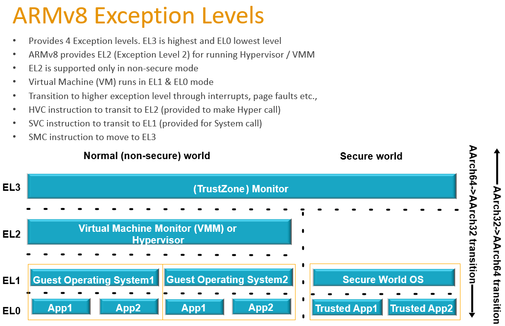  
其中EL2就是专门给hypervisor运行的mode  
一般的kernel运行在EL1

### qemu/kvm
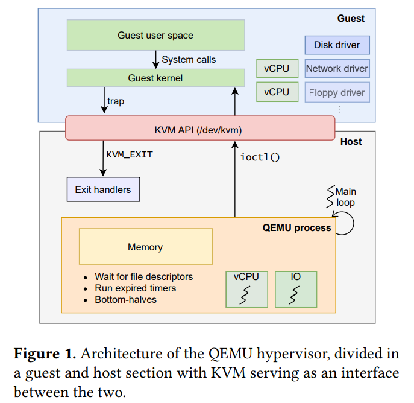  

一个VM就是一个host上的进程, vCPU是进程里的thread, VM的内存就是用这个进程的内存作为VM的“物理”内存.

Qemu的main loop是事件驱动的，等待fd事件, 比如tap设备, virtio设备的事件. main loop和`/dev/kvm`交互, 把对guest VM的操做交给KVM去做. 比如KVM会启动两个线程来模拟vCPU. 比如`ioctl(KVM_RUN)`产生一个`VM_ENTRY`, 把控制权交给guest, guest持续运行, 遇到某些操做在guest里面无法进行就会trap到QEMU.

ARM KVM架构:

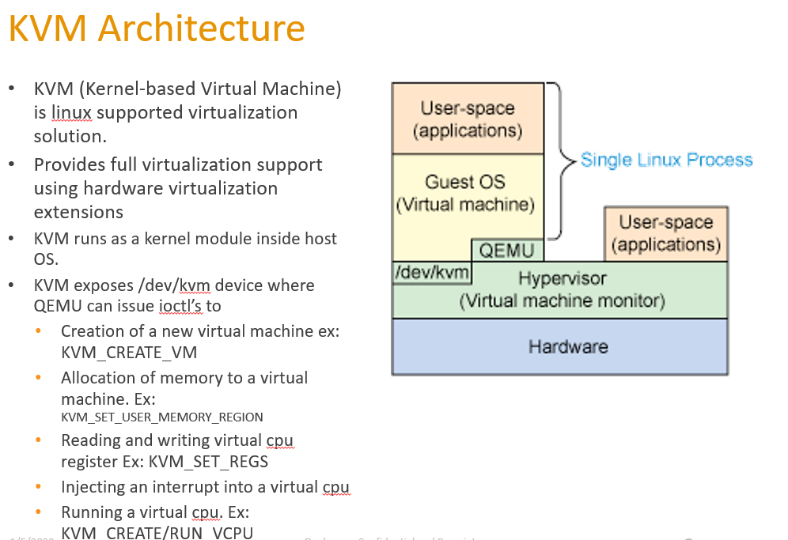  
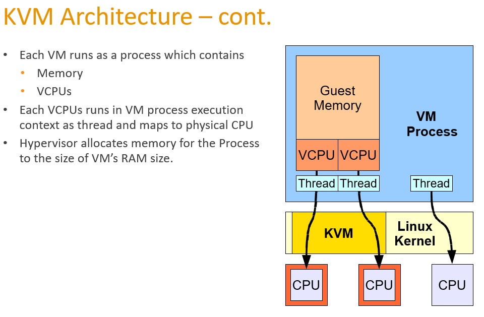  
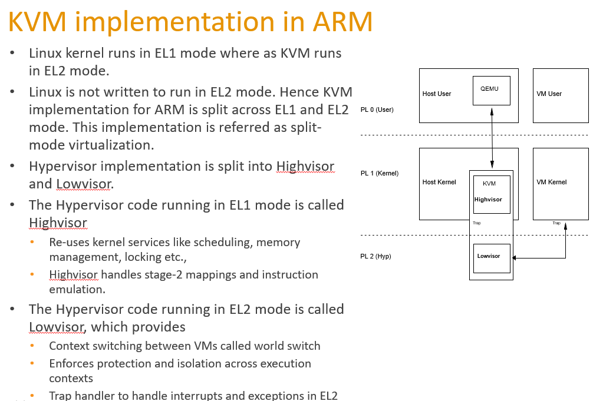  

### Firecracker
firecracker 和qemu类似, 也是event driven模式, 也是用kvm来创建和运行VM, 但是精简了qemu的设备模拟, 只保留virtio-net, virtio-blk等半虚拟设备, 以及鼠标键盘, 目标是精简. 另外fircracker也优化了linux kernel的启动, 直接启动64bit的非压缩的kernel, 而非kernel自解压再启动.

github地址: https://github.com/firecracker-microvm/firecracker

从[Chrome OS Virtual Machine Monitor](https://google.github.io/crosvm) 项目而来, 基于KVM, 大部分代码是Rust.

crosvm是一个全新的VMM, 类似eqmu的功能.

Firecracker在crosvm基础上, 减小了50%的代码, 没有考虑BIOS, 没有考虑PCI. 比QEMU少了96%的代码...

设计亮点:
* **Simple Guest Model** – Firecracker guests are presented with a very simple virtualized device model in order to minimize the attack surface: a network device, a block I/O device, a Programmable Interval Timer, the KVM clock, a serial console, and a partial keyboard (just enough to allow the VM to be reset).

* **Process Jail** – The Firecracker process is jailed using [cgroups](https://en.wikipedia.org/wiki/Cgroups) and [seccomp BPF](https://www.kernel.org/doc/html/latest/userspace-api/seccomp_filter.html), and has access to a small, tightly controlled list of system calls.

* **Static Linking** – The firecracker process is statically linked, and can be launched from a jailer to ensure that the host environment is as safe and clean as possible.

### Cloud Hypervisor
被Firecracker支持的功能多点, 比qemu瘦点. 支持mem和vcpu的热插拔.

## 容器平台
### docker
也就是runc
### LXC
docker最开始是用`liblxc`做为基础库的, 后来改成自己写的`libcontainer`.

相对于docker, lxc试图比较完整的建立一个linux系统, 比如带systemd, 比如使用ZFS文件系统. lxc用了cgroup v2的特性支持以non-root启动container.

## 安全容器平台
### Kata container
* Kata自己精简优化了guest kernel, 去掉了大部分驱动和模块.
* host上运行的Kata-runtime负责和hypervisor交互, hypervisor来启动VM.
* Kata有自己定制的mini OS, 基于Clear Linux, OS起来后马上用systemd启动Kata-agent
* Kata-agent和Kata-runtime通过vsock来交互, 使用ttRPC(一种gRPC的变种)
* 流程是host上docker run命令运行一个image, kata-runtime先通知hypervisor启动一个VM, 这个VM会使用Kata定制精简的kernel和同样定制精简的mini OS先启动, 然后马上启动Kata-agent, 然后Kata-agent通过ttRPC和Kata-runtime要到image, 然后在VM内部启动这个image. 后续host上的docker 命令, 会经过Kata-runtime的转发, 到Kata-agent来执行.

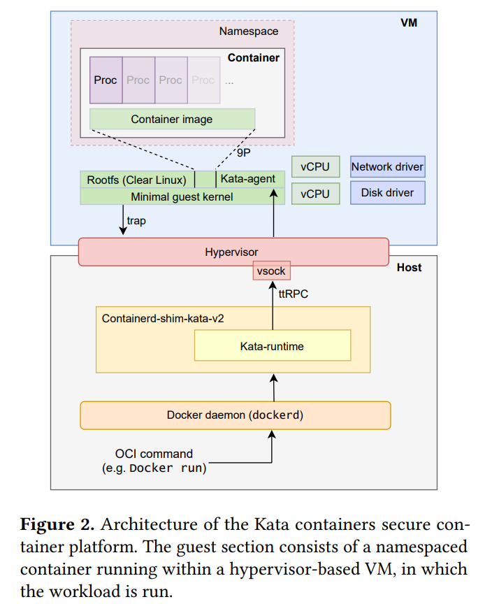  

### gVisor
gVisor是一个用户态的操做系统, 旨在减小attack surface.

* 在用户态实现了tcpip等协议栈, 但没有设备驱动. 网络还是通过传统的虚拟网络设备走host.
* app的系统调用会被gVisor拦截, 转到gVisor来处理.
* 拦截的办法有ptrace和KVM. ptrace性能低, KVM性能高.
* 在KVM模式下, gVisor运行在KVM VM里面.
* Gofer负责实际调用IO系统调用到host

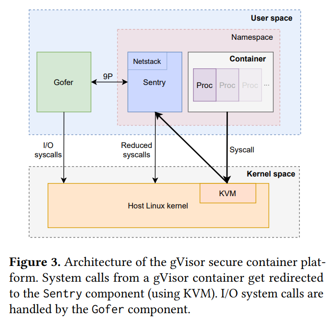  

### Unikernels
基本思想是把VM的kernel和OS全部用一个库来代替. 通过动态链接的方式, app的系统调用被这个lib接管, lib在同一个进程空间把kernel和OS的事情都给做了. 这样系统调用就是个简单的函数调用了. 类似vxworks没有用户态和内核态, 大家都在一个空间里, 所以也没有啥进程空间的概念, 也就不支持`fork()`和`exec()`等系统调用.

典型的代表是OSv, 从后面的测试来看, OSv必须运行在一个hypervisor上, 默认Qemu, 也可以运行在Firecracker上.

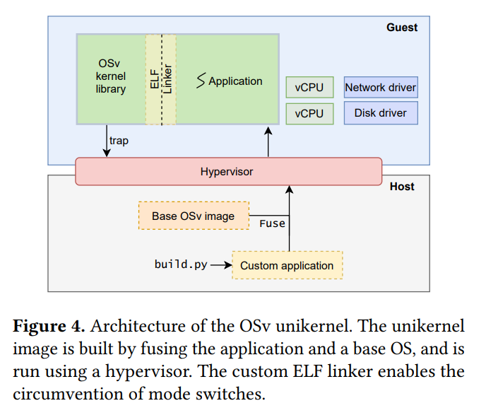  

# 性能对比
## CPU bond
对纯计算的应用, 各个平台性能差不多.

## 内存
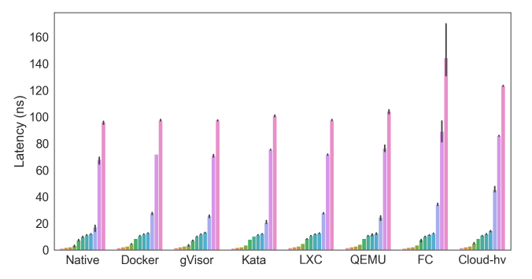  
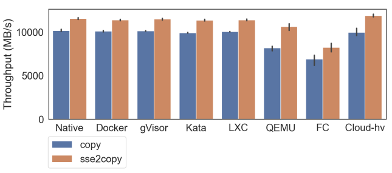  

Firecracker和cloud hypervisor的内存测试比较差, 可能是因为它们都是Rust实现的vm-memory.

## FIO
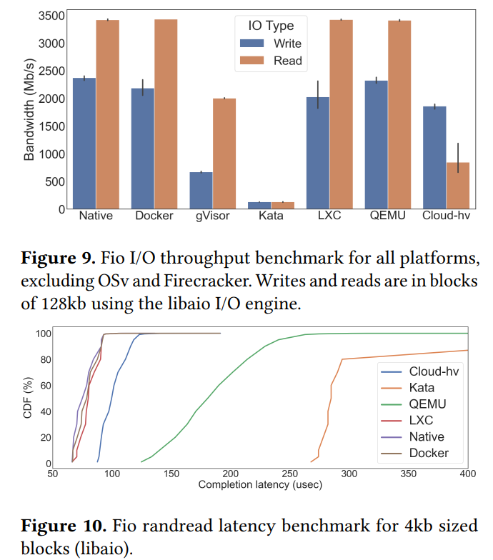  

qemu在bandwidth上和native/docker一样, 但latency还是大了好几倍.

Kata表现的最差, 可能和9p文件系统有关. virtio-fs正在代替9p的使用.

gVisor也差, 可能也受9p拖累, 而且它所有的IO请求都走Gofer, 也进一步拖慢了IO系统.

## Networking
使用iperf3进行client server测试. client跑在host, server在VM中.

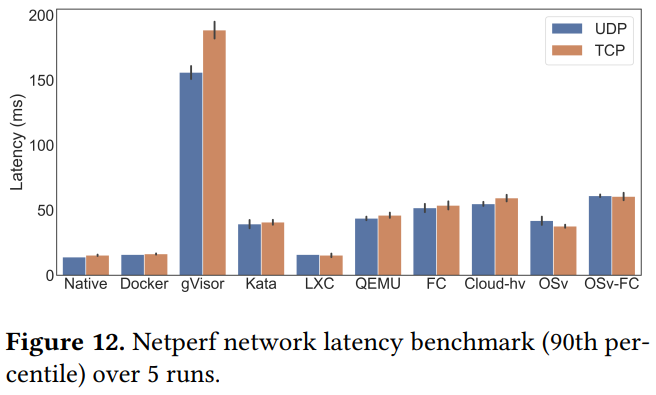  

OSv: 其实是OSv运行在qemu上. 它甚至比直接运行在Qemu上的iperf3性能还好.

# 结论
* containers(docker, lxc)性能几乎和native一样, 启动很快
* hypervisors在networking和mem上都有overhead, 在io吞吐应该还好, 但* latency也有penalty.
* Kata性能一般, 可能和9p有关
* gVisor性能差
* OSv总的来说性能也不错, 调用的host的代码也最少
