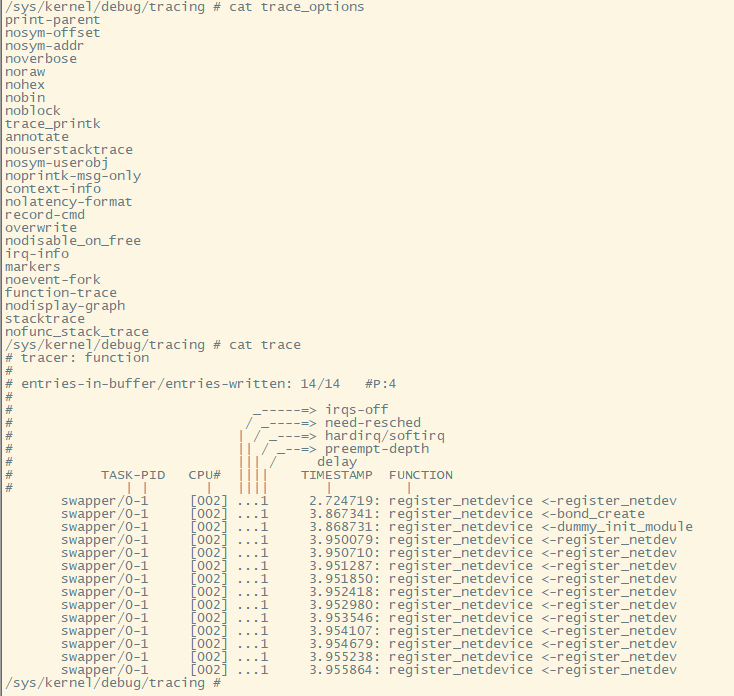
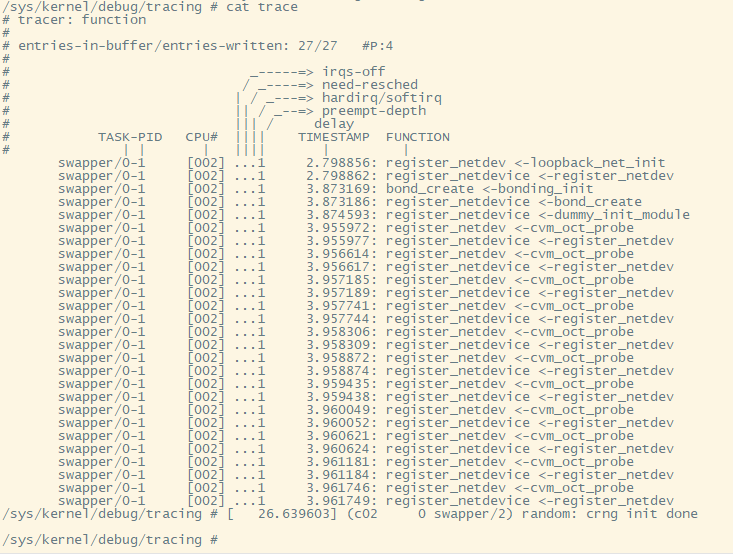
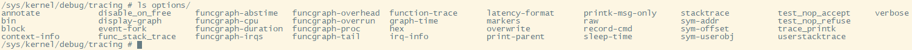
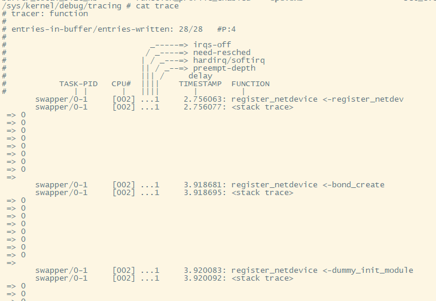
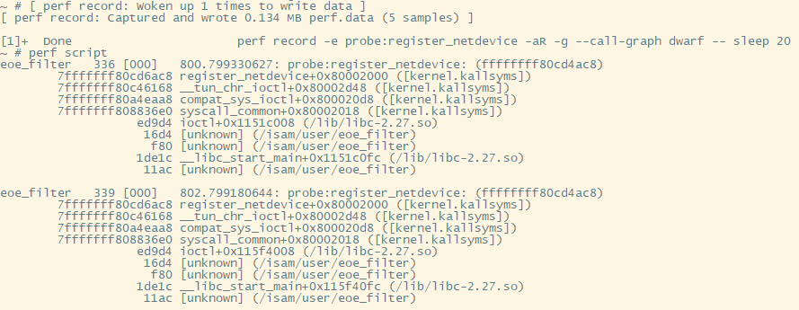
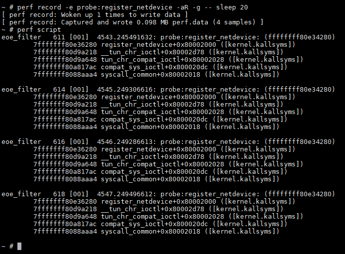

- [bond0设备的例子](#bond0设备的例子)
  - [背景 -- 是谁创建了bond0设备](#背景----是谁创建了bond0设备)
  - [使用ftrace打印调用栈 -- MIPS上不成功](#使用ftrace打印调用栈----mips上不成功)
    - [打开stacktrace选项](#打开stacktrace选项)
    - [使用function trace](#使用function-trace)
    - [初步结果](#初步结果)
    - [使用笨方法](#使用笨方法)
    - [bond代码: bond驱动会默认创建bond0设备](#bond代码-bond驱动会默认创建bond0设备)
    - [打印调用栈 -- MIPS上不成功](#打印调用栈----mips上不成功)
    - [补充网上成功的例子](#补充网上成功的例子)
  - [使用perf probe](#使用perf-probe)
    - [perf支持的栈帧记录模式](#perf支持的栈帧记录模式)
    - [带dwarf解析的输出](#带dwarf解析的输出)
    - [不带dwarf解析的输出](#不带dwarf解析的输出)
    - [例子](#例子)
  - [但boot time怎么办?](#但boot-time怎么办)
- [probe方式看用户态进程的调用栈](#probe方式看用户态进程的调用栈)
  - [ftrace方法 -- 不成功](#ftrace方法----不成功)
    - [先回顾以下kprobe用法](#先回顾以下kprobe用法)
    - [再看uprobe](#再看uprobe)
    - [实际操作 -- 最后enable没成功](#实际操作----最后enable没成功)
  - [perf probe方法 -- 成功](#perf-probe方法----成功)

# bond0设备的例子
## 背景 -- 是谁创建了bond0设备
用kernel4.9时, 多了bond0设备, 导致其默认路由配置错误, 以及mtu配置错误, 给NT LT通信带来了不小的麻烦.

因为新kernel配置了bonding驱动, 但这个驱动会自动创建bond0设备, 还是启动脚本里创建的, 不得而知.

搜索启动脚本, 有bond相关操作的脚本有:
```
echo broadcast > /sys/class/net/bond0/bonding/mode
ifconfig bond0 up
echo +eth-nta > /sys/class/net/bond0/bonding/slaves
vconfig add bond0 $vlan
```
似乎没有哪里创建bond0设备

## 使用ftrace打印调用栈 -- MIPS上不成功
网络驱动会调用`register_netdevice`来创建网络设备.

思路是使用ftrace, 在`register_netdevice`被调用的时候, 打印调用栈; 通过调用栈, 来进一步寻找谁创建了netdev.

### 打开stacktrace选项
要用到`trace_options`的stacktrace功能, 默认是关掉的.  
带前缀no的是关闭的选项.
```shell
/sys/kernel/debug/tracing # cat trace_options 
print-parent
nosym-offset
nosym-addr
noverbose
noraw
nohex
nobin
noblock
trace_printk
annotate
nouserstacktrace
nosym-userobj
noprintk-msg-only
context-info
nolatency-format
record-cmd
overwrite
nodisable_on_free
irq-info
markers
noevent-fork
function-trace
nodisplay-graph
nostacktrace
notest_nop_accept
notest_nop_refuse
```
相关的选项说明如下:
* userstacktrace - 记录当前线程的用户态调用栈, 默认关闭
* stacktrace - 记录调用栈, 默认关闭

要打开stacktrace, 可以:  
`echo stacktrace > trace_options`  
也可以在启动cmdline里加 `trace_options=stacktrace`  
参考: Documentation/trace/ftrace.txt

### 使用function trace
本文这里, bond0在系统启动时就生成了, 如果用debugfs来调试就太完了. 所以我用cmdline来使能ftrace调试.

在kernel cmdline里,
```shell
ftrace=function ftrace_filter=register_netdevice trace_options=stacktrace
```
* ftrace= 效果和debugfs里面的`current_tracer`一样
* ftrace_filter= 效果和debugfs里面的`set_ftrace_filter`一样


参考:
* kernel/trace/trace.c, 搜索`__setup`
* kernel/trace/ftrace.c, 搜索`__setup`

### 初步结果
看来没有stacktrace的内容, 经过验证, cmdline里面的`trace_options=stacktrace`没有作用.

function tracer默认打印一级的调用关系  
  

一个比较笨的思路是, 因为function trace默认有上一级函数调用, 那么可以用ftrace filter反复trace多次, 一步步的找到调用源头.  
但这个方法对boot time的函数跟踪很不友好, 要反复重启N多次.

### 使用笨方法
```shell
#增加ftrace=function ftrace_filter=register_netdevice,bond_create,bonding_init,register_netdev
bootoctlinux $(loadaddr) 'coremask=0x0f mem=0 ctxt=OSW isamversion=ZAM8AA62.990, prozone=0x4000000,0x80000000 logbuffer=uboot,0x20000,0x7be00000 bpsflag=0x4,0x7be20000 bpcommit=0,0x140000,0x160000 mtdparts=octeon_nand0:0x8000000@0x0(recovery),-@0x8000000(nand);octeon_nand1:0x40000000@0x0(nand1);bootflash:0x20000@0x140000(statusA),0x20000@0x160000(statusB),0x140000@0x180000(bootA),0x140000@0x2c0000(bootB),0x1900000@0x400000(linuxA),0x1900000@0x1d00000(linuxB),0x20000@0x120000(preferred_oswp),0x80000@0x3600000(management_a),0x80000@0x3680000(management_b),0x120000@0x0(bps) linux_fit_image=0x1e00000,0x7a000000 unpreferred_oswp=0 console=ttyS1,115200 ftrace=function ftrace_filter=register_netdevice,bond_create,bonding_init,register_netdev config_overlay=linux_shell_only=1,reboot=0'
```
  

### bond代码: bond驱动会默认创建bond0设备
```c
bonding_init()
    ...
    //max_bonds默认是1
    for (i = 0; i < max_bonds; i++)
        bond_create()
            //这里传入的name是NULL, 那默认就是"bond%d"
            bond_dev = alloc_netdev_mq()
            register_netdevice(bond_dev)
```

### 打印调用栈 -- MIPS上不成功
再调查一下, 原来function tracer提供了自己的func_stack_trace选项.

ftrace的options有两个形式:
* trace_options文件: 只有通用的option
* options目录: 除了通用的option, 还有各个tracer的特殊option  
  

function tracer使用func_stack_trace来打开调用栈
```shell
/sys/kernel/debug/tracing # cat options/func_stack_trace 
0
```
试试看能不能在cmdline里面打开  
`ftrace=function ftrace_filter=register_netdevice trace_options=func_stack_trace`  
这次有调用栈, 但都是0, 似乎是MIPS的bug.  
  

注: 即使打开了内核选项`CONFIG_FRAME_POINTER=y`也不行. MIPS的`CONFIG_FRAME_POINTER`不怎么管用.

参考: [Secrets of the Ftrace function tracer](https://lwn.net/Articles/370423/)


### 补充网上成功的例子
使用function tracer提供的`options/func_stack_trace`
```shell
   [tracing]# echo kfree > set_ftrace_filter
   [tracing]# cat set_ftrace_filter
   kfree
   [tracing]# echo function > current_tracer
   [tracing]# echo 1 > options/func_stack_trace
   [tracing]# cat trace | tail -8
    => sys32_execve
    => ia32_ptregs_common
                cat-6829 [000] 1867248.965100: kfree <-free_bprm
                cat-6829 [000] 1867248.965100: <stack trace>


    => free_bprm
    => compat_do_execve
    => sys32_execve
    => ia32_ptregs_common
   [tracing]# echo 0 > options/func_stack_trace
   [tracing]# echo > set_ftrace_filter
```

## 使用perf probe
perf probe和perf record的组合, 能够记录几乎任何函数的运行时调用关系.

perf probe底层使用kprobe来实现对kernel的探测, 对用户态程序则使用uprobe(基于utrace框架). probe方式最基本的思想是把被probe的指令, 替换成breakpoint指令, 在hit的时候, 调用特殊的handler; handler作为一个同步异常, 工作在内核态, 能够访问当前线程的所有信息. 

记录调用栈最关键的地方在于记录栈帧信息, 对octeon系列的MIPS板子来说, 内核态和用户态稍微有点区别:
* 内核态: 虽然MIPS内核默认没有CONFIG_FRAME_POINTER=y, 但内核的栈帧似乎被perf解析的很好.  
注: 即使打开CONFIG_FRAME_POINTER=y, 效果也没有更好.
* 用户态函数: 必须用dwarf方式记录调用栈.

### perf支持的栈帧记录模式
在perf record时候, 通过`--call-graph`参数可以指定record调用栈的方式:
* fp: 编译时使用栈指针. 如果编译时有--fomit-frame-pointer, 则对栈帧解析不准.
* dwarf : 编译时有--fomit-frame-pointer, 要使用dwarf格式, 需要libundwind或libdw  
dwarf是一种标准的debugging信息的格式, 包括了CFI (Call Frame Information).  
使用dwarf模式时, perf record会同时记录用户态栈帧
* lbr : Intel硬件支持

```
--call-graph
    Setup and enable call-graph (stack chain/backtrace) recording,
    implies -g. Default is "fp".


        Allows specifying "fp" (frame pointer) or "dwarf"
        (DWARF's CFI - Call Frame Information) or "lbr"
        (Hardware Last Branch Record facility) as the method to collect
        the information used to show the call graphs.


        In some systems, where binaries are build with gcc
        --fomit-frame-pointer, using the "fp" method will produce bogus
        call graphs, using "dwarf", if available (perf tools linked to
        the libunwind or libdw library) should be used instead.
        Using the "lbr" method doesn't require any compiler options. It
        will produce call graphs from the hardware LBR registers. The
        main limitation is that it is only available on new Intel
        platforms, such as Haswell. It can only get user call chain. It
        doesn't work with branch stack sampling at the same time.


        When "dwarf" recording is used, perf also records (user) stack dump
        when sampled. Default size of the stack dump is 8192 (bytes).
        User can change the size by passing the size after comma like
        "--call-graph dwarf,4096".
```
### 带dwarf解析的输出
`perf record -e probe:register_netdevice -aR -g --call-graph dwarf -- sleep 20`  
  
注: eoe_filter被strip掉了debug信息, 所以这里显示unknown

### 不带dwarf解析的输出
`perf record -e probe:register_netdevice -aR -g -- sleep 20`  
  

### 例子
比如我想看是谁调用了`register_netdevice`函数, 这是内核函数, 调用后会创建个netdev.
```shell
#添加内核probe点
perf probe register_netdevice
#记录20秒
perf record -e probe:register_netdevice -aR -g -- sleep 20 
#使用dwarf还可以看到用户态调用
perf record -e probe:register_netdevice -aR -g --call-graph dwarf -- sleep 20


#在另外一个窗口操作, 会触发函数调用; 我敲了4次命令
/isam/user/eoe_filter -n lo -t tap0 -E
#record完成后会有如下打印, 显示采样到4次.
~ # [ perf record: Woken up 1 times to write data ]
[ perf record: Captured and wrote 0.087 MB perf.data (4 samples) ]


#能够看调用栈
perf script
```
  


## 但boot time怎么办?
perf probe底层使用kprobe的event接口, 虽然上面的例子里, 在系统起来后, 用perf probe可以看调用栈. 但kernel启动过程中, kprobe并没有提供相应的手段.

Huawei的wang nan在2015年提交了一组patch: 没被接受?  
[Early kprobe: enable kprobes at very early booting stage](https://lwn.net/Articles/635262/)

19年Masami Hiramatsu提交的patch似乎更好: 使用了新的kernel cmdline方式: SKC(Supplemental Kernel Cmdline)  
[tracing: skc: Boot-time tracing and Supplemental Kernel Cmdline](https://lwn.net/Articles/797246/)  
以上两组patch改的很深入, 值得看看


> Supplemental Kernel Cmdline: Supplemental kernel command line (SKC) allows admin to pass a tree-structured supplemental kernel commandline file (SKC file) when boot up kernel. This expands the kernel command line in efficient way.


# probe方式看用户态进程的调用栈
主要是用uprobe接口和callstack调试用户态perf probe找不到call frame问题

## ftrace方法 -- 不成功
```shell
~ # cp remote/root/tmp/a.out .
~ # perf probe -x a.out -V p -v
Open Debuginfo file: /root/a.out
Searching variables at p
Matched function: p [325]
Failed to get call frame on 0x10000600
Failed to find the address of p
  Error: Failed to show vars. Reason: No such file or directory (Code: -2)
```
perf是在kernel目录树tools下面编译的, 是个用户态程序.  
错误打印出自: `tools/perf/util/probe-finder.c`的`call_probe_finder()`函数, 有好几个路径会调用它.

那么怎么知道出错时确切的调用路径呢?  
联想到, ftrace支持的filter格式中, 有stacktrace选项, 见[ftrace和trace-cmd记录](profiling_ftrace和trace-cmd记录.md), 但那是内核的function trace提供的功能, kprobe/uprobe有吗?


### 先回顾以下kprobe用法
详见`linux/Documentation/trace/kprobetrace.rst`
```shell
#用到的文件
/sys/kernel/debug/tracing/kprobe_events
/sys/kernel/debug/tracing/events/kprobes/<EVENT>/enable
#语法
p[:[GRP/]EVENT] [MOD:]SYM[+offs]|MEMADDR [FETCHARGS] : Set a probe
r[MAXACTIVE][:[GRP/]EVENT] [MOD:]SYM[+0] [FETCHARGS] : Set a return probe
-:[GRP/]EVENT : Clear a probe
```
```shell
#增加一个kprobe event, 会在events/kprobes生成一个目录 
echo "p:myprobe do_sys_open" > kprobe_events 
#这个目录下有类似的format, trigger等文件 
ls events/kprobes/ 
enable filter myprobe 
ls events/kprobes/myprobe/ 
enable filter format id trigger 
 
#去掉myprobe 
echo "-:myprobe" >> kprobe_events 
#或者全部清空, 执行后myprobe目录就消失了 
echo > kprobe_events 
 
#开始 
echo 1 > events/kprobes/myprobe/enable 
echo 1 > tracing_on 
cat trace 
 
#带参数, 在aarch64上, x0到x7表示前8个参数 
echo "p:my_probe update_min_vruntime cfs=%x0:x64" > kprobe_events 
echo 1 > events/kprobes/my_probe/enable 
echo 1 > tracing_on 
```

### 再看uprobe
详见`linux/Documentation/trace/uprobetracer.rst`

filter和trigger等控制文件使用说明: `linux/Documentation/trace/events.rst`  
文档上说要打开`CONFIG_UPROBE_EVENTS`  
实际上, 新版本的kernel使用
```shell
~ # zcat /proc/config.gz | grep -i UPROBE
CONFIG_ARCH_SUPPORTS_UPROBES=y
CONFIG_UPROBES=y
CONFIG_UPROBE_EVENT=y
```
控制文件:
```shell
/sys/kernel/debug/tracing/uprobe_events
/sys/kernel/debug/tracing/events/uprobes/<EVENT>/enable
```
格式
```shell
p[:[GRP/]EVENT] PATH:OFFSET [FETCHARGS] : Set a uprobe
r[:[GRP/]EVENT] PATH:OFFSET [FETCHARGS] : Set a return uprobe (uretprobe)
-:[GRP/]EVENT
   GRP : Group name. If omitted, "uprobes" is the default value.
   EVENT : Event name. If omitted, the event name is generated based
                   on PATH+OFFSET.
   PATH : Path to an executable or a library.
   OFFSET : Offset where the probe is inserted.


   FETCHARGS : Arguments. Each probe can have up to 128 args.
    %REG : Fetch register REG
    @ADDR : Fetch memory at ADDR (ADDR should be in userspace)
    @+OFFSET : Fetch memory at OFFSET (OFFSET from same file as PATH)
    $stackN : Fetch Nth entry of stack (N >= 0)
    $stack : Fetch stack address.
    $retval : Fetch return value.(*)
    $comm : Fetch current task comm.
    +|-offs(FETCHARG) : Fetch memory at FETCHARG +|- offs address.(**)
    NAME=FETCHARG : Set NAME as the argument name of FETCHARG.
    FETCHARG:TYPE : Set TYPE as the type of FETCHARG. Currently, basic types
```

### 实际操作 -- 最后enable没成功
```shell
mount -t debugfs none /sys/kernel/debug
cd /sys/kernel/debug/tracing/
#Failed to get call frame on是在call_probe_finder函数里打印的
#先要要先找到这个函数的地址, 因为uprobe只接受地址
yingjieb@FNSHA190 /repo/yingjieb/ms/buildroot73/output/build/linux-custom/tools/perf
$ nm perf | grep call_probe_finder
10114b48 t call_probe_finder
#按照格式, 创建一个uprobe
echo 'p /usr/bin/perf:0x10114b48' > /sys/kernel/debug/tracing/uprobe_events
#在events下面, 会生成一个新的目录
/sys/kernel/debug/tracing # ls events/uprobes/
enable filter p_perf_0x10114b48
#在新的probe目录下, 有filter和trigger控制文件, 这就是我想要的
/sys/kernel/debug/tracing/events/uprobes/p_perf_0x10114b48 # ls
enable filter format id trigger
#加stacktrace触发: 注意echo后面必须加引号
echo 'stacktrace' > /sys/kernel/debug/tracing/events/uprobes/p_perf_0x10114b48/trigger
/sys/kernel/debug/tracing/events/uprobes/p_perf_0x10114b48 # cat trigger 
stacktrace:unlimited
#开始, 提示错误!!!
/sys/kernel/debug/tracing/events/uprobes/p_perf_0x10114b48 # echo 1 > enable 
[247440.579699] (c02 4595 sh) event trace: Could not enable event p_perf_0x10114b48
sh: write error: Invalid argument
```

## perf probe方法 -- 成功
要点:
* 在mips上, 必须用`--call-graph dwarf`才能看到调用栈; 默认的fp(fram pointer)方式不行
* 使用perf probe命令定义的动态probe点, 在`/sys/kernel/tracing/events/uprobe`下面是没有event的;  
但在这个目录下有: `/sys/kernel/tracing/events/probe_perf`;  
说明`perf probe -x`对用户态probe, 底层也是调用uprobe接口?
* 注: 同时看看`/sys/kernel/tracing`和`/sys/kernel/debug/tracing`

```shell
# 用perf probe定义probe点
~ # perf probe -x /root/perf call_probe_finder
Failed to get call frame on 0x10114b48
Added new event:
  probe_perf:call_probe_finder (on call_probe_finder in /root/perf)


You can now use it in all perf tools, such as:


        perf record -e probe_perf:call_probe_finder -aR sleep 1


# 记录
~ # perf record -e probe_perf:call_probe_finder -aR --call-graph dwarf -- /root/perf probe -x a.out -V p -v
Open Debuginfo file: /root/a.out
Searching variables at p
Matched function: p [325]
Failed to get call frame on 0x10000600
Failed to find the address of p
  Error: Failed to show vars. Reason: No such file or directory (Code: -2)
[ perf record: Woken up 1 times to write data ]
[ perf record: Captured and wrote 0.102 MB perf.data (1 samples) ]
#解析perf.data
~ # perf script
perf 4779 [001] 248792.3977600534: probe_perf:call_probe_finder: (10114b48)
                  114b48 call_probe_finder+0xe0000000 (/root/perf)
                  117360 probe_point_search_cb+0xe0000278 (/root/perf)
                   173fc [unknown] (/usr/lib/libdw-0.176.so)
                   17360 [unknown] (/usr/lib/libdw-0.176.so)
                   15e18 dwarf_getfuncs+0x125aa184 (/usr/lib/libdw-0.176.so)
                  117560 debuginfo__find_probe_location.isra.8+0xe0000140 (/root/perf)
                  1177dc debuginfo__find_available_vars_at+0xe000011c (/root/perf)
                  10e75c show_available_vars+0xe00000fc (/root/perf)
                   3b1fc __cmd_probe.isra.4+0xe0000a54 (/root/perf)
                   3b9dc cmd_probe+0xe00000ac (/root/perf)
                   5f928 run_builtin+0xe0000098 (/root/perf)
                    83a8 main+0xe0000780 (/root/perf)
                   1de1c __libc_start_main+0x12cf40fc (/lib/libc-2.27.so)
                    84dc hlt+0xe0000000 (/root/perf)
```
