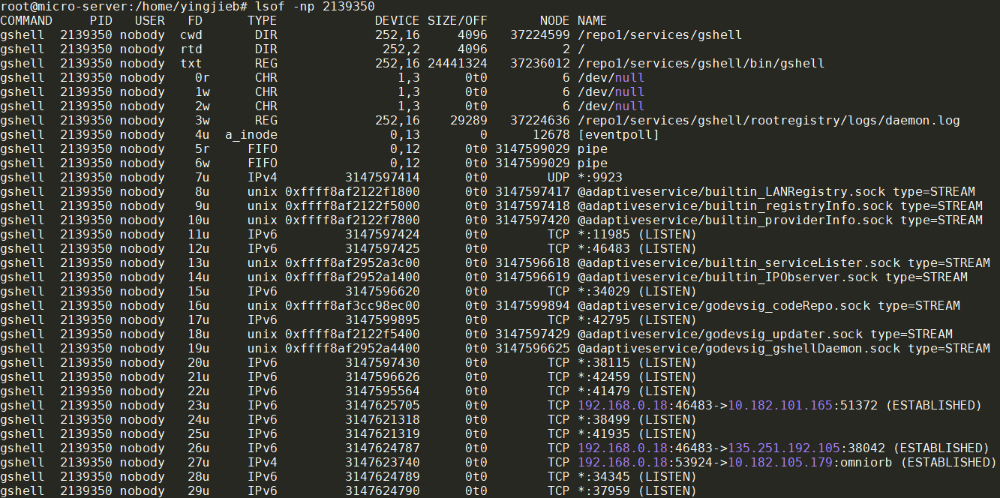
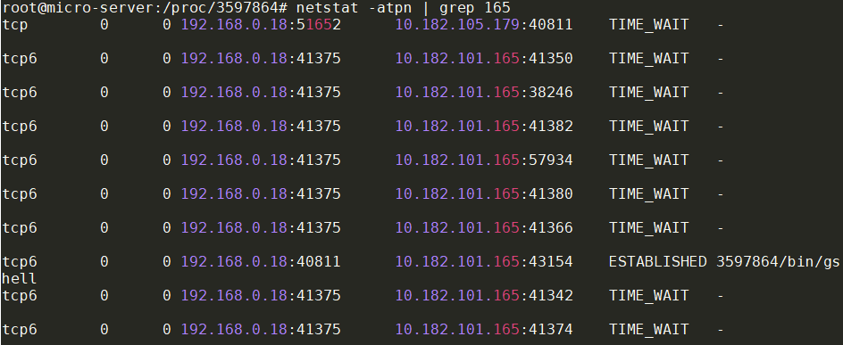
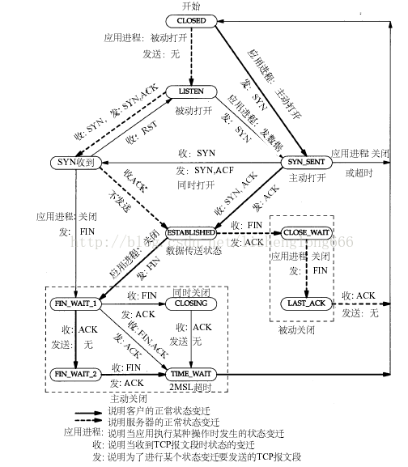

记录一次socket泄漏的调查过程.
- [背景](#背景)
- [问题现象](#问题现象)
- [分析调查](#分析调查)
  - [代码分析](#代码分析)
  - [用`lsof`和`netstat`调查](#用lsof和netstat调查)
  - [可能就是socket泄漏](#可能就是socket泄漏)
  - [pprof](#pprof)
    - [reverse proxy造成了goroutine泄漏](#reverse-proxy造成了goroutine泄漏)
- [解决](#解决)
- [总结](#总结)
- [知识点](#知识点)
  - [TIME\_WAIT状态的连接](#time_wait状态的连接)
  - [close状态的迁移](#close状态的迁移)

# 背景
[gshell](https://github.com/godevsig/gshellos)是golang写的微服务框架, 有个类似dockerd的daemon负责服务调度和发现, 它用到了`adaptiveservice`库, 代码我放在了[github godevsig/adaptiveservice](https://github.com/godevsig/adaptiveservice).  

gshell正常用起来应该是这样, 风格类似docker:  


gshell daemon可以感知所有gshell node(称作provider)提供的服务:  


# 问题现象
gshell daemon经过大概几个月的运行, log里面显示大量的`too many open files`
```shell
[2022/11/29 10:32:50.727067][daemon][WARN] stream transport listener: accept tcp [::]:11985: accept4: too many open files
[2022/11/29 10:32:50.727073][daemon][WARN] stream transport listener: accept tcp [::]:11985: accept4: too many open files
[2022/11/29 10:32:50.727078][daemon][WARN] stream transport listener: accept tcp [::]:11985: accept4: too many open files
[2022/11/29 10:32:50.727083][daemon][WARN] stream transport listener: accept tcp [::]:11985: accept4: too many open files
[2022/11/29 10:32:50.727098][daemon][WARN] stream transport listener: accept tcp [::]:11985: accept4: too many open files
[2022/11/29 10:32:50.727110][daemon][WARN] stream transport listener: accept tcp [::]:11985: accept4: too many open files
[2022/11/29 10:32:50.727117][daemon][WARN] stream transport listener: accept tcp [::]:11985: accept4: too many open files
[2022/11/29 10:32:50.727122][daemon][WARN] stream transport listener: accept tcp [::]:11985: accept4: too many open files
[2022/11/29 10:32:50.727128][daemon][WARN] stream transport listener: accept tcp [::]:11985: accept4: too many open files
[2022/11/29 10:32:50.727133][daemon][WARN] stream transport listener: accept tcp [::]:11985: accept4: too many open files
[2022/11/29 10:32:50.727138][daemon][WARN] stream transport listener: accept tcp [::]:11985: accept4: too many open files
[2022/11/29 10:32:50.727143][daemon][WARN] stream transport listener: accept tcp [::]:11985: accept4: too many open files
[2022/11/29 10:32:50.727149][daemon][WARN] stream transport listener: accept tcp [::]:11985: accept4: too many open files
[2022/11/29 10:32:50.727154][daemon][WARN] stream transport listener: accept tcp [::]:11985: accept4: too many open files
[2022/11/29 10:32:50.727159][daemon][WARN] stream transport listener: accept tcp [::]:11985: accept4: too many open files
[2022/11/29 10:32:50.727165][daemon][WARN] stream transport listener: accept tcp [::]:11985: accept4: too many open files
[2022/11/29 10:32:50.727170][daemon][WARN] stream transport listener: accept tcp [::]:11985: accept4: too many open files
```

使用`prlimit`查看进程的limits, 发现此进程打开文件的上限是1024:  
  

1024这个值对一个daemon来说是太小了, 使用`prlimit -n10240 -p 3597864`可以临时修改最大文件数, 但能不能真正解决问题? 还是只能让daemon可以跑更久一点, 但最后还是会崩?

我们要讨论的问题是
1. 是否有fd泄漏
2. 如果有的话, fd泄漏发生在哪里

# 分析调查
## 代码分析
上述错误打印对应下面的代码, 在一个goroutine里的循环里不断的`Accept`连接, 并把新建好的`netconn`放到这个streamTransport的`chanNetConn` 里面.  
  
注: 这里我把log打印改为了`Debugf`, 否则就会产生大量的`too many open files`打印, 最终log文件会把磁盘填满.

每个新建的`netconn`都会在单独的goroutine里面处理:  
```golang
	defer func() {
		for netconn := range st.chanNetConn {
			netconn.Close()
		}
	}()

	closed := st.closed
	for {
		select {
		case <-closed:
			return
		case netconn := <-st.chanNetConn:
			go handleConn(netconn)
		}
	}
```

处理过程比较复杂, 基本上最后也会在`defer`里面调用`netconn.Close()`  
  

除了一个例外:  
如果`fnOnConnect`存在的话, 这个函数就是被设计成接管模式
```golang
// OnConnectFunc sets a function which is called when new
// incoming connection is established.
// Further message dispaching on this connection will stop
// if fn returns true, leaving the connection NOT closed, fn
// should then take over this Netconn and close it when finished.
func OnConnectFunc(fn func(Netconn) (takeOver bool)) ServiceOption {
	return func(svc *service) {
		svc.fnOnConnect = fn
	}
}
```

这么看代码流程上似乎OK. 那么问题就是简单的1024个client同时连接导致的fd不足吗?

## 用`lsof`和`netstat`调查
通过几天的`/proc/pid/fd`观察, 发现fd个数确实在缓慢增长, 大部分是socket:  


`lsof -np 3597864`显示更详细的信息:  


对socket来说, 能显示状态的FD, 比如`LISTEN`, `ESTABLISHED`, 是比较正常的.  
而后面数量比较多的`sock`:
```shell
gshell  3597864 nobody   42u     sock                0,9      0t0 3126838341 protocol: TCPv6
gshell  3597864 nobody   43u     sock                0,9      0t0 3126844553 protocol: TCPv6
gshell  3597864 nobody   44u     sock                0,9      0t0 3138644284 protocol: TCPv6
gshell  3597864 nobody   45u     sock                0,9      0t0 3124033098 protocol: TCPv6
gshell  3597864 nobody   46u     sock                0,9      0t0 3124035739 protocol: TCPv6
gshell  3597864 nobody   47u     sock                0,9      0t0 3126847184 protocol: TCPv6
gshell  3597864 nobody   48u     sock                0,9      0t0 3140046172 protocol: TCPv6
gshell  3597864 nobody   49u     sock                0,9      0t0 3126845992 protocol: TCPv6
gshell  3597864 nobody   50u     sock                0,9      0t0 3126836885 protocol: TCPv6
gshell  3597864 nobody   51u     sock                0,9      0t0 3138652549 protocol: TCPv6
gshell  3597864 nobody   52u     sock                0,9      0t0 3126843789 protocol: TCPv6
gshell  3597864 nobody   53u     sock                0,9      0t0 3137310543 protocol: TCPv6
gshell  3597864 nobody   54u     sock                0,9      0t0 3137313903 protocol: TCPv6
gshell  3597864 nobody   55u     sock                0,9      0t0 3137306228 protocol: TCPv6
```
这个patten更像是socket leak, 见下面的讨论
* [Sockets found by lsof but not by netstat](https://serverfault.com/questions/153983/sockets-found-by-lsof-but-not-by-netstat)
* [In lsof output what are those 'sock' lines?](https://serverfault.com/questions/1000338/in-lsof-output-what-are-those-sock-lines)
* [Zombie socket file descriptors issue](https://github.com/spring-projects/spring-framework/issues/25348)

`lsof`和`/proc/3597864/fd`的socket fd数量是一致的:

```shell
root@micro-server:/home/yingjieb# lsof -np 3597864 | egrep "IP|sock|unix" | wc -l
59
root@micro-server:/proc/3597864# ls -l fd | grep socket | wc -l
59
```
这59个socket fd中, 有40个是疑似泄漏的fd:
```shell
root@micro-server:/home/yingjieb# lsof -np 3597864 | egrep "sock                0,9" | wc -l
40
```
用`lsof`和`netstat`命令查看正常状态的socket:
```shell
root@micro-server:/home/yingjieb# lsof -np 3597864 | egrep "IP|sock|unix" | egrep -v "sock                0,9"
gshell  3597864 nobody    7u     IPv4         3112600867      0t0        UDP *:9923
gshell  3597864 nobody    8u     unix 0xffff8af63fcf5c00      0t0 3112600870 @adaptiveservice/builtin_LANRegistry.sock type=STREAM
gshell  3597864 nobody    9u     unix 0xffff8af63fcf5400      0t0 3112600873 @adaptiveservice/builtin_registryInfo.sock type=STREAM
gshell  3597864 nobody   10u     unix 0xffff8af63fcf5800      0t0 3112600875 @adaptiveservice/builtin_providerInfo.sock type=STREAM
gshell  3597864 nobody   11u     IPv6         3112600879      0t0        TCP *:11985 (LISTEN)
gshell  3597864 nobody   12u     IPv6         3112600880      0t0        TCP *:40811 (LISTEN)
gshell  3597864 nobody   13u     unix 0xffff8af61f3d7800      0t0 3112598912 @adaptiveservice/builtin_serviceLister.sock type=STREAM
gshell  3597864 nobody   14u     unix 0xffff8af61f3d2800      0t0 3112598913 @adaptiveservice/builtin_IPObserver.sock type=STREAM
gshell  3597864 nobody   15u     IPv6         3112598914      0t0        TCP *:35803 (LISTEN)
gshell  3597864 nobody   16u     unix 0xffff8af55a29bc00      0t0 3112599907 @adaptiveservice/godevsig_codeRepo.sock type=STREAM
gshell  3597864 nobody   17u     IPv6         3112599908      0t0        TCP *:42963 (LISTEN)
gshell  3597864 nobody   18u     unix 0xffff8af63fcf6800      0t0 3112600888 @adaptiveservice/godevsig_updater.sock type=STREAM
gshell  3597864 nobody   19u     IPv6         3112600889      0t0        TCP *:37605 (LISTEN)
gshell  3597864 nobody   20u     unix 0xffff8af1102ca400      0t0 3112603785 @adaptiveservice/godevsig_gshellDaemon.sock type=STREAM
gshell  3597864 nobody   21u     IPv6         3112603786      0t0        TCP *:35851 (LISTEN)
gshell  3597864 nobody   22u     IPv6         3112603788      0t0        TCP *:42063 (LISTEN)
gshell  3597864 nobody   23u     IPv6         3112650095      0t0        TCP 192.168.0.18:40811->10.182.101.165:43154 (ESTABLISHED)
gshell  3597864 nobody   24u     IPv6         3112650097      0t0        TCP *:41375 (LISTEN)
gshell  3597864 nobody   25u     IPv6         3112650098      0t0        TCP *:33655 (LISTEN)
```
```shell
root@micro-server:/home/yingjieb# netstat -apn | grep 3597864
tcp6       0      0 :::42063                :::*                    LISTEN      3597864/bin/gshell
tcp6       0      0 :::11985                :::*                    LISTEN      3597864/bin/gshell
tcp6       0      0 :::42963                :::*                    LISTEN      3597864/bin/gshell
tcp6       0      0 :::33655                :::*                    LISTEN      3597864/bin/gshell
tcp6       0      0 :::35803                :::*                    LISTEN      3597864/bin/gshell
tcp6       0      0 :::41375                :::*                    LISTEN      3597864/bin/gshell
tcp6       0      0 :::37605                :::*                    LISTEN      3597864/bin/gshell
tcp6       0      0 :::35851                :::*                    LISTEN      3597864/bin/gshell
tcp6       0      0 :::40811                :::*                    LISTEN      3597864/bin/gshell
tcp6       0      0 192.168.0.18:40811      10.182.101.165:43154    ESTABLISHED 3597864/bin/gshell
udp        0      0 0.0.0.0:9923            0.0.0.0:*                           3597864/bin/gshell
unix  2      [ ACC ]     STREAM     LISTENING     3112600875 3597864/bin/gshell   @adaptiveservice/builtin_providerInfo.sock
unix  2      [ ACC ]     STREAM     LISTENING     3112598913 3597864/bin/gshell   @adaptiveservice/builtin_IPObserver.sock
unix  2      [ ACC ]     STREAM     LISTENING     3112600870 3597864/bin/gshell   @adaptiveservice/builtin_LANRegistry.sock
unix  2      [ ACC ]     STREAM     LISTENING     3112600873 3597864/bin/gshell   @adaptiveservice/builtin_registryInfo.sock
unix  2      [ ACC ]     STREAM     LISTENING     3112599907 3597864/bin/gshell   @adaptiveservice/godevsig_codeRepo.sock
unix  2      [ ACC ]     STREAM     LISTENING     3112598912 3597864/bin/gshell   @adaptiveservice/builtin_serviceLister.sock
unix  2      [ ACC ]     STREAM     LISTENING     3112603785 3597864/bin/gshell   @adaptiveservice/godevsig_gshellDaemon.sock
unix  2      [ ACC ]     STREAM     LISTENING     3112600888 3597864/bin/gshell   @adaptiveservice/godevsig_updater.sock
```
正常状态的socket, 无论用`lsof`还是`netstat`得到的数量统计是一致的:
```
root@micro-server:/home/yingjieb# lsof -np 3597864 | egrep "IP|sock|unix" | egrep -v "sock                0,9" | wc -l
19
root@micro-server:/home/yingjieb# netstat -apn | grep 3597864 | wc -l
19
```

而"异常"的sock在`netstat`或是`ss`命令中都难寻踪迹, 是socket泄漏吗?

## 可能就是socket泄漏
网上的说法大部分都指向了代码bug, 即socket fd并没有被close导致的fd泄漏. 根据[这篇文章](https://idea.popcount.org/2012-12-09-lsof-cant-identify-protocol/), 这些socket在`/proc/net/*`的信息被kernel移除了, 所以`lsof`查询不到这些socket信息.

从这里开始, 就要看代码了.

## pprof
因为是golang写的, 我已经加了pprof支持, 通过log找到debug端口:
`debugging at: [::]:42063`

首先要看一下goroutine是否有泄漏:  
`curl http://localhost:42063/debug/pprof/goroutine?debug=1`

一共106个goroutine, 要一个一个看:  
`goroutine profile: total 106`

### reverse proxy造成了goroutine泄漏
下面的goroutine数量正好40个:
```golang
40 @ 0x43fb25 0x406a0f 0x40664b 0x63ac85 0x641c65 0x4791a1
#       0x63ac84        github.com/godevsig/adaptiveservice.(*proxyRegServiceInWAN).Handle.func3+0x2c4  /go/pkg/mod/github.com/godevsig/adaptiveservice@v0.9.24-0.20220927055808-74b42ce93f20/builtinservices.go:199
#       0x641c64        github.com/godevsig/adaptiveservice.(*streamTransport).receiver.func2+0x1444    /go/pkg/mod/github.com/godevsig/adaptiveservice@v0.9.24-0.20220927055808-74b42ce93f20/streamtransport.go:320
```

对应代码如下, 在199行有可能永远阻塞:  


这个reverse proxy涉及3方, 分别是:
* 内网服务方S 
* 外网用户方C
* 代理方P

代理流程如下:
1. S不能直接注册public服务, 它发现内网能提供reverse proxy服务的P  
2. S连接P, 得到长连接ConnCmd, P代替S完成注册public服务, 该服务的public端口为SrvPort
3. P listen一个对S专用的端口ReversePort
4. 每当有C去连接P的SrvPort时, 会得到一个socket(ClientSocket)
5. P通过ConnCmd给S发送通知msg
6. S接收msg后主动去连接P的ReversePort
7. P得到一个新socket(ServerSocket)
8. P负责在ClientSocket和ServerSocket之间按字节转发(`io.Copy`)
9. 任意一方断开时, 调用对方连接的`Close()`

199行出问题时, 或许是因为S被kill了, S和P的长连接已经断开, 导致S无法执行第6步, 而P则卡在第7步, 就是第199行.

# 解决
当S和P的长连接ConnCmd出现问题时, close掉channel chanServerConn, 这样就不会在199行阻塞. 修改见下面第183行和201行  


修改后的版本`lsof`的正常显示:  



# 总结
* lsof里面"不正常"的sock就是fd泄漏, 代码里没有把socket close
* 这些socket在netstat里面没有显示

# 知识点
## TIME_WAIT状态的连接
在本端close掉connection后, socket不会马上关闭, 要大概至少50秒后才会在`netstat`里面消失.

下面图里, `192.168.0.18:41375`是server端, 和多个client`10.182.101.165:xxxxx`连接.  


## close状态的迁移
