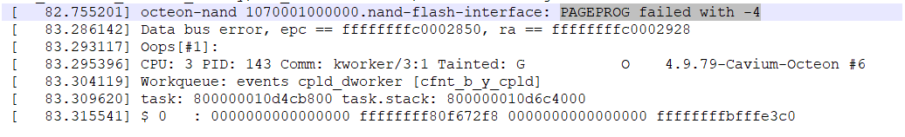
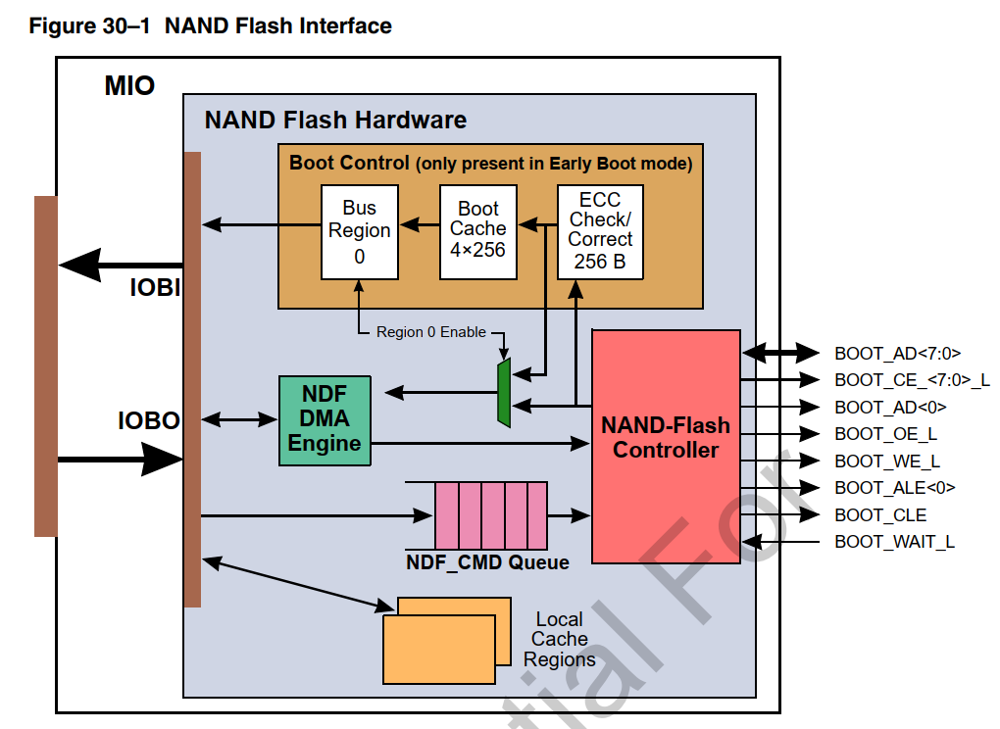
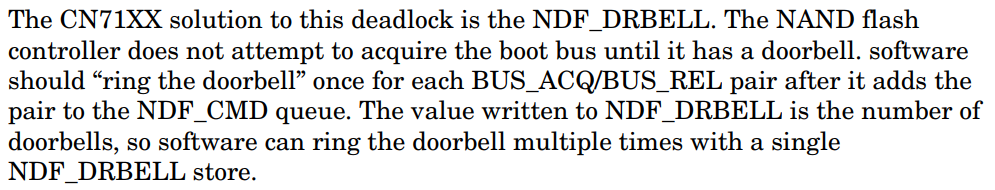
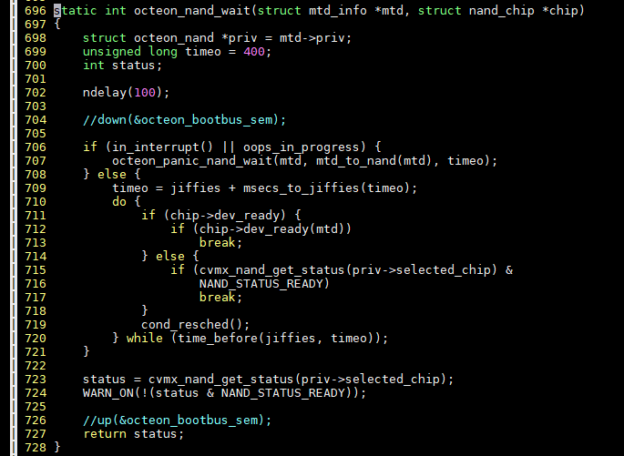
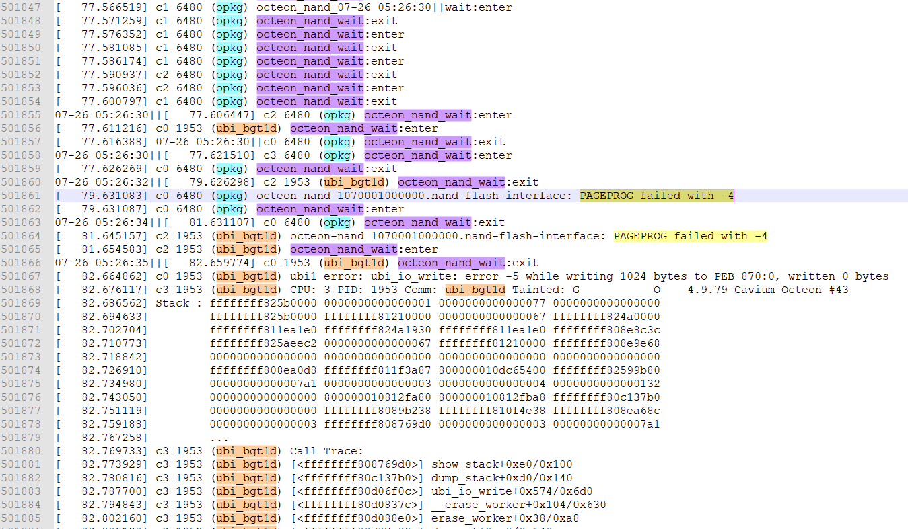
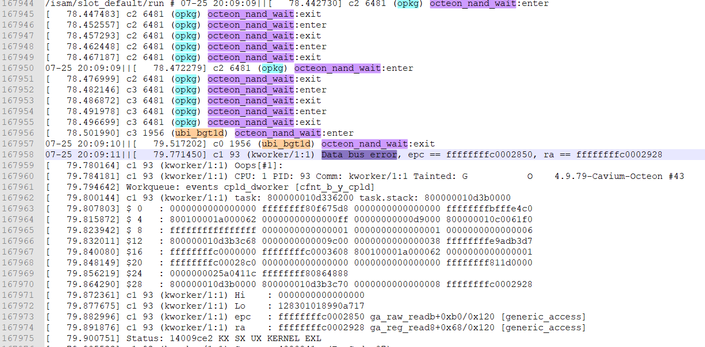
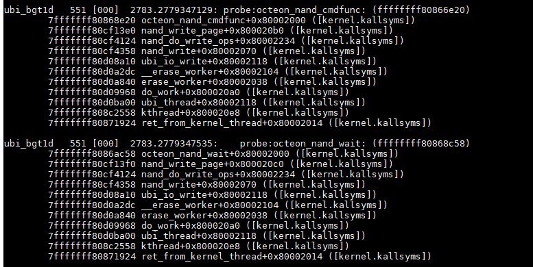
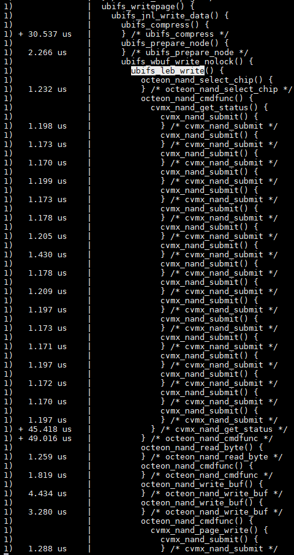
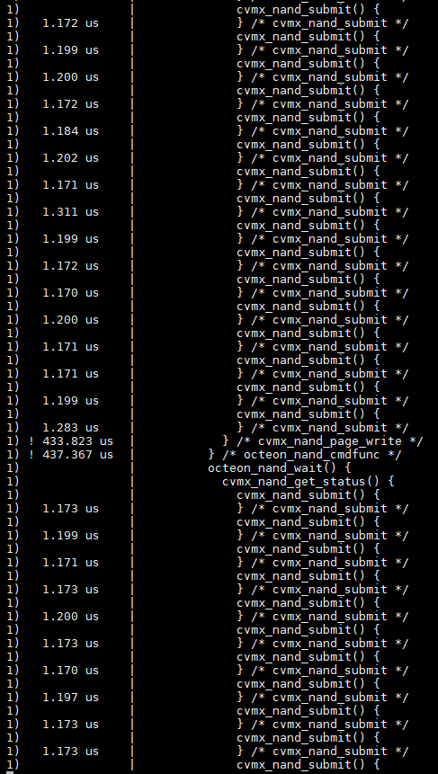

- [问题现象](#问题现象)
- [根因分析](#根因分析)
  - [nand访问逻辑](#nand访问逻辑)
  - [控制器读写序列的关键区](#控制器读写序列的关键区)
  - [再上一层的软件有锁吗?](#再上一层的软件有锁吗)
  - [根本原因](#根本原因)
- [问题解决](#问题解决)
- [补充](#补充)

# 问题现象
启动的时候概率出现"PAGEPROG failed with -4", 并常伴随Data bus error.  
概率较高.  
  

# 根因分析
Octeon底层nand驱动缺少临界区保护, 导致Nand控制器的命令字不配对, 产生超时错误.
ubifs后台进程ubi_bgt1d是普通进程, 优先级低, 容易被抢占, 增大了问题出现的概率.

## nand访问逻辑
nand的一般操作序列为:
* 读: 先发CMD 00h, 接着发列地址, 再发行地址, 再发CMD 30h; 然后等待状态寄存器变为ready, 就可以开始读数据了.
* 写: 每次写一个Page, 先发CMD 80h, 再发列地址, 行地址, 然后发数据, 发完数据发CMD 10h, 然后等待状态寄存器为ready.
* 擦: 擦以Block为单位, 不涉及数据传输.  再CMD 60h和D0h之间发行地址即可.

对Octeon的CPU来说:  
nand控制器挂在bootbus上, 和其他bootbus器件共用信号;  
nand读写时序都是多周期的, data线只有8个, 而需要通过这8根线, 给nand器件发送命令字, 地址, 和数据.  
在CLE阶段发CMD, 在ALE阶段发行地址, 列地址; 在WE/OE阶段发数据或读数据.  
  

## 控制器读写序列的关键区
如上所述, 读写nand需要一系列的操作序列, 应该保证在该操作序列的执行期间, bootbus上的引脚变化**必须是一次完整的Nand 操作**.
在硬件层面上, Octeon用NDF_CMD_Queue来保证, 它定义了一些列控制器命令字:
* 所有的操作序列从BUS_ACQ开始, 以BUS_REL结束. 对应代码是`__cvmx_nand_build_pre_cmd`和`__cvmx_nand_build_post_cmd`
  * 这之间的若干命令组成了nand操作命令序列.

* Nand控制器会参与bootbus总线仲裁, 为了保证不产生死锁, 比如获取了bootbus控制权, 但软件没来得及发release命令, 进程被调度出去了.  
控制器给出的机制是`doorbell`, 其实现的核心是写`doorbell`寄存器: `cvmx_write_csr(CVMX_NDF_DRBELL, 1)`  
  

那么, 为什么还有关键区竞争问题呢?  
`arch/mips/cavium-octeon/executive/cvmx-nand.c`所提供的底层nand函数, 都没有锁保护.

配对的命令字`BUS_ACQ`和`BUS_REL`之间, 也没有锁保护.  
函数`__cvmx_nand_low_level_read`里, `__cvmx_nand_build_pre_cmd`和`__cvmx_nand_build_post_cmd`之间是临界区.  
那么, 试想一下, 两个进程同时操作nand, 比如本文出现问题的场景, 进程`opkg`和`ubi_bgt1d`, 如果上层控制逻辑没有锁, 那么到`cvmx-nand.c`的`__cvmx_nand_low_level_read`时, 
临界区控制器命令字可能会交叉, 导致nand控制器无法理解这个操作序列.

## 再上一层的软件有锁吗?
它的上一层接口, `arch/mips/cavium-octeon/octeon-nand.c`里面, 部分函数有`octeon_bootbus_sem`锁.  
但kernel4.9中, 新增的`octeon_nand_wait`没有这个锁, 但它会调用底层接口`cvmx_nand_get_status()`, 进而调用`__cvmx_nand_low_level_read`来获取nand的状态  
  

注: `down(&octeon_bootbus_sem)`和`up(&octeon_bootbus_sem)`是新加的, 用以bug fix这个问题.  
截图里注释掉是为了复现调试问题.


## 根本原因
问题就出在这里.  
如前所述, 在写nand flash后, 调用这个接口来等待nand flash状态变为ready, `cvmx_nand_get_status`会在bootbus上发送一些列的操作序列, 这些序列包括ALE CLE 等关键信号的变化; 虽然nand控制器硬件上有doorbell机制, 但软件实现上, 在`BUS_ACQ`和`BUS_REL`之间并没有保护临界区.  
可以在上一层软件上加更大的锁, 比如`octeon_bootbus_sem`  
kernel3.10 octeon驱动在mtd层就加了这个锁, 不会出问题. 但kernel4.9新增的这个的函数没有锁保护.

ubifs后台进程ubi_bgt1d是普通进程, 在attach mtd分区时启动, 优先级是20, 优先级低, 容易被s6脚本启动的其他进程(优先级是实时RR -31)抢占了, 被抢占时, 命令字没配对;
同时, 另一个对nand操作的进程的nand驱动也在写nand命令字到nand控制器, 导致Nand命令字序列非法, 软件在等待超时后错误打印.
此时, 如果:
* 有CPLD访问, 则会出现 bus error 错误.
* 这两个互相干扰的nand写操作进程, 会出现 PAGEPROG failed with -4  
  

# 问题解决
1. 给kernel4.9新增函数加`octeon_bootbus_sem`锁  
经验证可以解决, 但:  
   * `ubi_bgt1d`很容易被抢占, 如果持有锁时被抢占, 则此期间
      * CPLD的访问会阻塞
      * Nand flash读写会阻塞
      * bootbus上, 所有需要`octeon_bootbus_sem`的访问都阻塞

2. 提高ubi相关进程优先级
提高到实时优先级, 与其他s6启动的进程同级. 理论上会降低概率, 但不能完全避免.  
未验证.

3. 在`BUS_ACQ`和`BUS_REL`之间加锁.  
理论上, 能解决`PAGEPROG failed with -4`问题, 但不能与其他bootbus访问互斥.  
-- 更正: 我认为可以保证和其他bootbus访问互斥, 因为这是硬件保证的, nand控制器会参与bootbus总线仲裁.  
patch如下:  

```diff
changeset:   317:32127fd74f84
branch:      linux-4.9-preparation
user:        Bai Yingjie
date:        Thu Aug 01 12:12:05 2019 +0800
files:       arch/mips/cavium-octeon/executive/cvmx-nand.c
description:
nand: use mutex to protect the DMA operation and command sequence in NDF_CMD queue

Octeon nand controller uses NDF_CMD queue to receive nand command sequence,
and then drives the bootbus pins to operate with the Nand flash chip.

One nand flash operation includes several commands which form the command sequence,
software writes the sequence wrapping with BUS_ACQ and BUS_REL pair and then rings
the doorbell to inform nand controller which in turn arbitrates for and releases the
boot-bus pins when it executes the BUS_ACQ/BUS_REL commands, respectively.

The sequence between BUS_ACQ and BUS_REL pair should in order.
Without proper lock, the command sequence into NDF_CMD queue may
become out of order, which results nand flash access failure.
Typical error message:
octeon-nand 1070001000000.nand-flash-interface: PAGEPROG failed with -4

Because of the nand failure, bootbus may occur Data Bus Error when other bootbus
devices trying to access through bootbus right after the nand failure.

Previously in kernel 3.10, higher level of software uses a bigger
lock "octeon_bootbus_sem" to do the job, but in kernel 4.9, the new added
functions like "octeon_nand_wait" does not acquire the lock.

We could add "down(&octeon_bootbus_sem)" to such functions, follow the previous
lock implementation. But "octeon_bootbus_sem" is a big lock, other bootbus
devices like CPLD also acquire the lock.

This patch provides another option that uses smaller lock granularity that only
locks NDF_CMD queue and DMA operation.

This approach passes the reboot test over 100 times.

diff --git a/arch/mips/cavium-octeon/executive/cvmx-nand.c b/arch/mips/cavium-octeon/executive/cvmx-nand.c
--- a/arch/mips/cavium-octeon/executive/cvmx-nand.c
+++ b/arch/mips/cavium-octeon/executive/cvmx-nand.c
@@ -273,6 +273,23 @@ static CVMX_SHARED const char *cvmx_nand

 static void __cvmx_nand_hex_dump(uint64_t buffer_address, int buffer_length);

+static DEFINE_MUTEX(cmdq_mutex);
+
+/**
+ * ensure the comands put into the NDF_CMD queue are ordered
+ * this lock protects the sequence between BUS_ACQ and BUS_REL command pair
+ * and also protects the DMA operation in conjunction with NDF_CMD queue.
+ */
+void __cvmx_nand_cmdq_lock(void)
+{
+       mutex_lock(&cmdq_mutex);
+}
+
+void __cvmx_nand_cmdq_unlock(void)
+{
+       mutex_unlock(&cmdq_mutex);
+}
+
 /* Compute the CRC for the ONFI parameter page.  Adapted from sample code
 ** in the specification.
 */
@@ -1456,7 +1473,6 @@ static inline cvmx_nand_status_t __cvmx_
                if (result)
                        CVMX_NAND_RETURN(result);
        }
-
        CVMX_NAND_RETURN(CVMX_NAND_SUCCESS);
 }

@@ -1640,6 +1656,8 @@ static inline int __cvmx_nand_low_level_
        if (!buffer_length)
                CVMX_NAND_RETURN(CVMX_NAND_INVALID_PARAM);

+       __cvmx_nand_cmdq_lock();
+
        nand_selected = __cvmx_nand_select(1);

        /* Build the command and address cycles */
@@ -1740,10 +1758,12 @@ static inline int __cvmx_nand_low_level_


        __cvmx_nand_select(nand_selected);
+       __cvmx_nand_cmdq_unlock();
        CVMX_NAND_RETURN(bytes);

 error:
        __cvmx_nand_select(nand_selected);
+       __cvmx_nand_cmdq_unlock();
        CVMX_NAND_RETURN(status);
 }

@@ -1887,6 +1907,8 @@ cvmx_nand_status_t cvmx_nand_page_write(
        if (buffer_address & 7)
                CVMX_NAND_RETURN(CVMX_NAND_INVALID_PARAM);

+       __cvmx_nand_cmdq_lock();
+
        nand_selected = __cvmx_nand_select(1);

        nand_address = __cvmx_nand_adjust_address(chip, nand_address);
@@ -1975,6 +1997,7 @@ cvmx_nand_status_t cvmx_nand_page_write(

 done:
        __cvmx_nand_select(nand_selected);
+       __cvmx_nand_cmdq_unlock();
        CVMX_NAND_RETURN(status);
 }
 EXPORT_SYMBOL(cvmx_nand_page_write);
@@ -2001,6 +2024,8 @@ cvmx_nand_status_t cvmx_nand_block_erase
        if (!cvmx_nand_state[chip].page_size)
                CVMX_NAND_RETURN(CVMX_NAND_INVALID_PARAM);

+       __cvmx_nand_cmdq_lock();
+
        nand_selected = __cvmx_nand_select(1);
        /* Build the command and address cycles */
        status = __cvmx_nand_build_pre_cmd(chip, NAND_COMMAND_ERASE,
@@ -2030,6 +2055,7 @@ cvmx_nand_status_t cvmx_nand_block_erase

 done:
        __cvmx_nand_select(nand_selected);
+       __cvmx_nand_cmdq_unlock();
        CVMX_NAND_RETURN(status);
 }
 EXPORT_SYMBOL(cvmx_nand_block_erase);
@@ -2230,6 +2256,8 @@ cvmx_nand_status_t cvmx_nand_set_feature
        if (feature == NULL)
                CVMX_NAND_RETURN(CVMX_NAND_INVALID_PARAM);

+       __cvmx_nand_cmdq_lock();
+
        nand_selected = __cvmx_nand_select(1);
        status = __cvmx_nand_build_pre_cmd(chip, NAND_COMMAND_SET_FEATURES,
                                           1, feat_num, 0);
@@ -2278,6 +2306,7 @@ cvmx_nand_status_t cvmx_nand_set_feature
        }
 done:
        __cvmx_nand_select(nand_selected);
+       __cvmx_nand_cmdq_unlock();
        CVMX_NAND_RETURN(status);
 }
 EXPORT_SYMBOL(cvmx_nand_set_feature);
@@ -2380,6 +2409,8 @@ cvmx_nand_status_t cvmx_nand_reset(int c
        if (!cvmx_nand_state[chip].page_size)
                CVMX_NAND_RETURN(CVMX_NAND_INVALID_PARAM);

+       __cvmx_nand_cmdq_lock();
+
        nand_selected = __cvmx_nand_select(1);
        status = __cvmx_nand_build_pre_cmd(chip, NAND_COMMAND_RESET, 0, 0, 0);
        if (status)
@@ -2396,6 +2427,7 @@ cvmx_nand_status_t cvmx_nand_reset(int c
                goto done;
 done:
        __cvmx_nand_select(nand_selected);
+       __cvmx_nand_cmdq_unlock();
        CVMX_NAND_RETURN(status);
 }
 EXPORT_SYMBOL(cvmx_nand_reset);

```

# 补充
  
  
  
  

