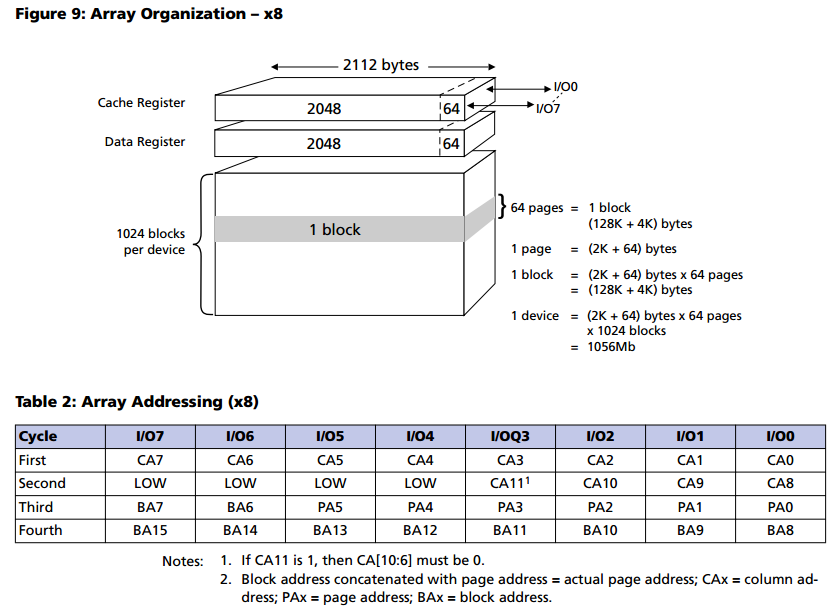

- [dts配置](#dts配置)
- [硬件图](#硬件图)
- [关于mtd](#关于mtd)
  - [分层](#分层)
  - [初始化 octeon-nand.c](#初始化-octeon-nandc)
  - [调试](#调试)
    - [初始化脚本化简](#初始化脚本化简)
    - [attach结果](#attach结果)
    - [错误1](#错误1)
    - [错误2](#错误2)
    - [错误3](#错误3)
    - [底层读函数调用栈](#底层读函数调用栈)

# dts配置
  

# 硬件图
  
  

# 关于mtd
## 分层
  
其中, FTL是个虚拟块设备层, 用于把nand flash转换成块设备

## 初始化 octeon-nand.c
* 知识点: `late_initcall()`, 定义在`init.h`中, 定义linux一个初始化的函数.见`late_initcall`和`module_init`
* 知识点: pr_debug(fmt, ...), 在定义了`DEBUG`后, 这是个`KERN_DEBUG`级别的printk
* 知识点: DEV_DBG, 这是octeon驱动定义的宏, 内部调用`dev_info()`, 类似的, 还有`dev_dbg()`, `dev_err()`, `dev_warn()`  
该宏用 static int debug 变量控制, 而这个变量是模块参数
```c
static int debug;
module_param(debug, int, 0644);
MODULE_PARM_DESC(debug, "Debug bit field. -1 will turn on all debugging.");
```
* 知识点: 模块参数修改, linux 模块笔记
* 知识点: 驱动中申请内存
`devm_kzalloc(&pdev->dev, sizeof(struct octeon_nand), GFP_KERNEL)`
  * 申请的内存会在drv/dev dettach时自动释放
  * 内存会被全部清零
* 知识点: 内核中的字节序转换宏, 比如`le32_to_cpu(data)`
* 代码梳理  
  

```c
late_initcall(octeon_nand_driver_init)
    platform_driver_register(&octeon_nand_driver)
        driver_register(&drv->driver)
            //先find, 找到了就不需要重新注册了
            driver_find(drv->name, drv->bus)
            bus_add_driver(drv)
                //申请driver_private结构*priv, 并和drv关联
                //并加入kset
                drv->p = priv
                priv->kobj.kset = bus->p->drivers_kset
                //在sysfs文件系统下在总线所在的drivers_kset目录下添加该驱动的目录
                kobject_init_and_add(&priv->kobj, &driver_ktype, NULL,"%s", drv->name)
                //drv添加到总线驱动链表上
                klist_add_tail(&priv->knode_bus, &bus->p->klist_drivers)
                //开始匹配驱动和设备
                driver_attach(drv)
                    //对bus下面的每个设备调用__driver_attach
                    bus_for_each_dev(drv->bus, NULL, drv, __driver_attach)
                        __driver_attach(struct device *dev, void *data)
                        struct device_driver *drv = data
                        driver_match_device(drv, dev)
                            //bus->match即platform_match
                            //优先从fdt里面match, 然后依次是ACPI, id table, name
                            drv->bus->match(dev, drv) //match即platform_match(dev, drv)
                        //如果match, 绑定drv和dev
                        driver_probe_device(drv, dev)
                            really_probe(dev, drv)
                                //暂时把dev的driver指针置为当前drv
                                dev->driver = drv
                                //sysfs中绑定drv和dev
                                driver_sysfs_add(dev)
                                    //调用BUS_NOTIFY_BIND_DRIVER call chain
                                    blocking_notifier_call_chain(&dev->bus->p->bus_notifier, BUS_NOTIFY_BIND_DRIVER, dev)
                                    //在sysfs中, drv和dev互相创建链接
                                    sysfs_create_link(&dev->driver->p->kobj, &dev->kobj, kobject_name(&dev->kobj))
                                    sysfs_create_link(&dev->kobj, &dev->driver->p->kobj, "driver")
                                //platform的bus没有probe方法, 不调用dev->bus->probe(dev)
                                drv->probe(dev) //在这里就是platform_drv_probe(struct device *_dev)
                                    //把platform的drv和dev通过指针偏移找回来
                                    drv = to_platform_driver(_dev->driver);
                                    dev = to_platform_device(_dev);
                                    //调用具体drv的probe, 比如octeon_nand_probe(struct platform_device *pdev)
                                    drv->probe(dev);
                                        //执行过程见下比如octeon_nand_probe()
                                driver_bound(dev)
                                    //把dev的p->knode_driver加到drv的p->klist_devices链表尾部
                                    klist_add_tail(&dev->p->knode_driver, &dev->driver->p->klist_devices);
                //添加drv的module
                module_add_driver(drv->owner, drv)
                //在sysfs的目录下创建文件uevent属性文件
                driver_create_file(drv, &driver_attr_uevent)
                //给driver添加bus上的所有属性
                driver_add_attrs(bus, drv)
                //添加绑定文件，driver_attr_bind 和 driver_attr_unbind
                add_bind_files(drv)
            driver_add_groups(drv, drv->groups)
            //产生一个KOBJ_ADD uevent
            kobject_uevent(&drv->p->kobj, KOBJ_ADD)
```
```c
octeon_nand_probe(struct platform_device *pdev)
    //从dts中解析所有nand chip
    //read nand id, onfi读nand芯片参数
    cvmx_nand_initialize()
    //申请priv结构, 对每个底层驱动来说, 这个结构都至关重要
    priv = devm_kzalloc(&pdev->dev, sizeof(struct octeon_nand), GFP_KERNEL)
    /* ecc mode 默认为NAND_ECC_SOFT_BCH, 其他可选值为
    ** NAND_ECC_NONE,NAND_ECC_SOFT,NAND_ECC_HW,NAND_ECC_HW_SYNDROME,NAND_ECC_HW_OOB_FIRST,
    */
    //填priv结构
    priv->mtd.owner = THIS_MODULE
    priv->mtd.priv = &priv->nand
    memset(priv->data, 0xff, sizeof(priv->data))
    priv->dev = &pdev->dev
    priv->selected_chip = chip
    priv->nand.ecc.mode = NAND_ECC_SOFT_BCH
    priv->nand.ecc.size = 512
    priv->nand.ecc.bytes = 7
    priv->nand.read_byte = octeon_nand_read_byte
    priv->nand.read_word = octeon_nand_read_word
    priv->nand.write_buf = octeon_nand_write_buf
    priv->nand.read_buf = octeon_nand_read_buf
    priv->nand.select_chip = octeon_nand_select_chip
    //几乎所有的活都由octeon_nand_cmdfunc完成
    priv->nand.cmdfunc = octeon_nand_cmdfunc
    priv->nand.init_size = octeon_nand_init_size
    octeon_nand_scan_onfi(priv)
        //确定ecc模式, 实际为NAND_ECC_HW_SYNDROME, 即hardware ECC syndrome
        //因为onfi_params.ecc_bits=4, 并且有OCTEON_FEATURE_BCH
        //octeon_nand_scan_onfi NAND chip 1 using hw_bch ECC for 4 bits of correction per 512 byte block. ECC size is 8 bytes
    octeon_nand_hw_bch_init(priv)
        //octeon_nand_calc_ecc_layout layout eccbytes: 32, free offset: 2, free length: 30
    //扫描每个page的oob, 建立bbt:bad block table, 及其他mtd/chip 结构
    nand_scan(&priv->mtd, 1)
    //mtd的name设为octeon_nand%d
    priv->mtd.dev.parent = &pdev->dev
    //static const char *part_probes[] = { "cmdlinepart", NULL }
    mtd_device_parse_register(&priv->mtd, part_probes, NULL, NULL, 0)
        parse_mtd_partitions(mtd, types, &real_parts, parser_data)
        add_mtd_device(mtd)
    octeon_nand_open_mtd[chip] = priv
```

## 调试
### 初始化脚本化简
```shell
~ # cat /etc/ubi_devices.config
# See mount_ubi for details.
ubidevnr=0 mtddev=/dev/mtd_nand
~ #
~ # cat /etc/ubi_volumes.config
# See mount_ubi for details
ubidevnr=0 volname=meta mountpoint= size=lebs:1
ubidevnr=0 volname=data mountpoint=/mnt/nand size=
~ #
~ # cat /etc/ubi_symlinks.config
# See mount_ubi for details.
linkdst=/mnt/nand linksrc=/mnt/persistent
```
```shell
#attach MTD device 6 (mtd6) to UBI and create UBI device number 0 (ubi0)
ubiattach -p /dev/mtd6 -d 0
#leb:logical eraseblocks, 这里nand的擦写单位是block, 128k
ubimkvol /dev/ubi0 -N meta --lebs=1
ubimkvol /dev/ubi0 -N data --maxavsize
#mount
mkdir -p /mnt/nand
mount -t ubifs ubi0:data /mnt/nand
#datach
ubidetach -p /dev/mtd6
#不用attach就可以format
ubiformat -yq /dev/mtd6
```

### attach结果
```shell
/user # ubiattach -p /dev/mtd6 -d 0
[ 222.657944] UBI: attaching mtd6 to ubi0
[ 223.012711] UBI: scanning is finished
[ 223.038015] UBI: attached mtd6 (name "nand", size 128 MiB) to ubi0
[ 223.056902] UBI: PEB size: 131072 bytes (128 KiB), LEB size: 129024 bytes
[ 223.076382] UBI: min./max. I/O unit sizes: 2048/2048, sub-page size 512
[ 223.095681] UBI: VID header offset: 512 (aligned 512), data offset: 2048
[ 223.115068] UBI: good PEBs: 1024, bad PEBs: 0, corrupted PEBs: 0
[ 223.133761] UBI: user volume: 0, internal volumes: 1, max. volumes count: 128
[ 223.153584] UBI: max/mean erase counter: 0/0, WL threshold: 4096, image sequence number: 1121128680
[ 223.175315] UBI: available PEBs: 1000, total reserved PEBs: 24, PEBs reserved for bad PEB handling: 20
[ 223.197328] UBI: background thread "ubi_bgt0d" started, PID 1210
UBI device number 0, total 1024 LEBs (132120576 bytes, 126.0 MiB), available 1000 LEBs (129024000 bytes, 123.0 MiB), LEB size 129024 bytes (126.0 KiB)
```

### 错误1
```shell
/user # ubiattach -p /dev/mtd6 -d 0
[ 246.687282] UBI: attaching mtd6 to ubi0
[ 247.041904] UBI: scanning is finished
[ 247.061929] UBI warning: ubi_io_read: error -77 (ECC error) while reading 22528 bytes from PEB 271:2048, read only 22528 bytes, retry
[ 247.090222] UBI warning: ubi_io_read: error -77 (ECC error) while reading 22528 bytes from PEB 271:2048, read only 22528 bytes, retry
[ 247.118534] UBI warning: ubi_io_read: error -77 (ECC error) while reading 22528 bytes from PEB 271:2048, read only 22528 bytes, retry
[ 247.146826] UBI error: ubi_io_read: error -77 (ECC error) while reading 22528 bytes from PEB 271:2048, read 22528 bytes
[ 247.170303] CPU: 0 PID: 1140 Comm: ubiattach Tainted: G O 3.10.20-rt14-Cavium-Octeon #37
[ 247.191948] Stack : 0000000040808000 ffffffff80171db8 0000000000000000 0000000000000000
          0000000000000000 0000000000000000 0000000000000000 0000000000000000
          000000000000000d 0000000000000000 0000000000000001 0000000000000000
          0000000000000010 0000000000000000 0000000000000000 0000000000000000
          ffffffff816e0000 ffffffff816d0000 ffffffff80667c98 ffffffff80715477
          ffffffff816c8d80 800000008c3a7858 0000000000000474 0000000000000000
          ffffffff80597150 ffffffff80698e60 800000008c232000 ffffffff8054213c
          800000008985bad8 800000008985b9d0 ffffffff80710448 ffffffff8040e654
          800000008c3a7520 ffffffff80667c98 0000000000000000 0000000000000474
          0000000000000000 ffffffff8014fa48 0000000000000000 0000000000000000
          ...
[ 247.929641] Call Trace:
[ 247.944784] [<ffffffff8014fa48>] show_stack+0xc0/0xe0
[ 247.962528] [<ffffffff8040e654>] ubi_io_read+0x1fc/0x3d8
[ 247.980533] [<ffffffff804047c8>] ubi_read_volume_table+0x168/0xae0
[ 247.999402] [<ffffffff80414710>] ubi_attach+0xa80/0x14b0
[ 248.017401] [<ffffffff804085c0>] ubi_attach_mtd_dev+0x710/0xcd0
[ 248.036006] [<ffffffff80408e58>] ctrl_cdev_ioctl+0xf8/0x1b8
[ 248.054265] [<ffffffff802bcc64>] compat_sys_ioctl+0xa4/0xe30
[ 248.072612] [<ffffffff80159c34>] handle_sys+0x134/0x160
```
### 错误2
```shell
/user # ubiattach -p /dev/mtd6 -d 0
[ 246.687282] UBI: attaching mtd6 to ubi0
[ 247.041904] UBI: scanning is finished
[ 247.061929] UBI warning: ubi_io_read: error -77 (ECC error) while reading 22528 bytes from PEB 271:2048, read only 22528 bytes, retry
[ 247.090222] UBI warning: ubi_io_read: error -77 (ECC error) while reading 22528 bytes from PEB 271:2048, read only 22528 bytes, retry
[ 247.118534] UBI warning: ubi_io_read: error -77 (ECC error) while reading 22528 bytes from PEB 271:2048, read only 22528 bytes, retry
[ 247.146826] UBI error: ubi_io_read: error -77 (ECC error) while reading 22528 bytes from PEB 271:2048, read 22528 bytes
[ 247.170303] CPU: 0 PID: 1140 Comm: ubiattach Tainted: G O 3.10.20-rt14-Cavium-Octeon #37
[ 247.191948] Stack : 0000000040808000 ffffffff80171db8 0000000000000000 0000000000000000
          0000000000000000 0000000000000000 0000000000000000 0000000000000000
          000000000000000d 0000000000000000 0000000000000001 0000000000000000
          0000000000000010 0000000000000000 0000000000000000 0000000000000000
          ffffffff816e0000 ffffffff816d0000 ffffffff80667c98 ffffffff80715477
          ffffffff816c8d80 800000008c3a7858 0000000000000474 0000000000000000
          ffffffff80597150 ffffffff80698e60 800000008c232000 ffffffff8054213c
          800000008985bad8 800000008985b9d0 ffffffff80710448 ffffffff8040e654
          800000008c3a7520 ffffffff80667c98 0000000000000000 0000000000000474
          0000000000000000 ffffffff8014fa48 0000000000000000 0000000000000000
          ...
[ 247.929641] Call Trace:
[ 247.944784] [<ffffffff8014fa48>] show_stack+0xc0/0xe0
[ 247.962528] [<ffffffff8040e654>] ubi_io_read+0x1fc/0x3d8
[ 247.980533] [<ffffffff804047c8>] ubi_read_volume_table+0x168/0xae0
[ 247.999402] [<ffffffff80414710>] ubi_attach+0xa80/0x14b0
[ 248.017401] [<ffffffff804085c0>] ubi_attach_mtd_dev+0x710/0xcd0
[ 248.036006] [<ffffffff80408e58>] ctrl_cdev_ioctl+0xf8/0x1b8
[ 248.054265] [<ffffffff802bcc64>] compat_sys_ioctl+0xa4/0xe30
[ 248.072612] [<ffffffff80159c34>] handle_sys+0x134/0x160
[ 248.090526]
[ 248.108337] UBI warning: ubi_io_read: error -77 (ECC error) while reading 22528 bytes from PEB 272:2048, read only 22528 bytes, retry
[ 248.136635] UBI warning: ubi_io_read: error -77 (ECC error) while reading 22528 bytes from PEB 272:2048, read only 22528 bytes, retry
[ 248.164927] UBI warning: ubi_io_read: error -77 (ECC error) while reading 22528 bytes from PEB 272:2048, read only 22528 bytes, retry
[ 248.193219] UBI error: ubi_io_read: error -77 (ECC error) while reading 22528 bytes from PEB 272:2048, read 22528 bytes
[ 248.216694] CPU: 1 PID: 1140 Comm: ubiattach Tainted: G O 3.10.20-rt14-Cavium-Octeon #37
[ 248.238338] Stack : 0000000040808000 ffffffff80171db8 0000000000000000 0000000000000000
          0000000000000000 0000000000000000 0000000000000000 0000000000000000
          000000000000000d 0000000000000000 0000000000000001 0000000000000000
          0000000000000010 0000000000000000 0000000000000000 0000000000000000
          ffffffff816e0000 ffffffff816d0000 ffffffff80667c98 ffffffff80715477
          ffffffff816c8d80 800000008c3a7858 0000000000000474 0000000000000001
          ffffffff80597150 ffffffff80698e60 800000008c232000 ffffffff8054213c
          800000008985bad8 800000008985b9d0 ffffffff80710448 ffffffff8040e654
          800000008c3a7520 ffffffff80667c98 0000000000000001 0000000000000474
          0000000000000000 ffffffff8014fa48 0000000000000000 0000000000000000
          ...
[ 248.976052] Call Trace:
[ 248.991191] [<ffffffff8014fa48>] show_stack+0xc0/0xe0
[ 249.008933] [<ffffffff8040e654>] ubi_io_read+0x1fc/0x3d8
[ 249.026939] [<ffffffff804047c8>] ubi_read_volume_table+0x168/0xae0
[ 249.045806] [<ffffffff80414710>] ubi_attach+0xa80/0x14b0
[ 249.063804] [<ffffffff804085c0>] ubi_attach_mtd_dev+0x710/0xcd0
[ 249.082409] [<ffffffff80408e58>] ctrl_cdev_ioctl+0xf8/0x1b8
[ 249.100668] [<ffffffff802bcc64>] compat_sys_ioctl+0xa4/0xe30
[ 249.119015] [<ffffffff80159c34>] handle_sys+0x134/0x160
[ 249.136927]
[ 249.153204] UBI: attached mtd6 (name "nand", size 128 MiB) to ubi0
[ 249.172084] UBI: PEB size: 131072 bytes (128 KiB), LEB size: 129024 bytes
[ 249.191563] UBI: min./max. I/O unit sizes: 2048/2048, sub-page size 512
[ 249.210865] UBI: VID header offset: 512 (aligned 512), data offset: 2048
[ 249.230252] UBI: good PEBs: 1024, bad PEBs: 0, corrupted PEBs: 0
[ 249.248944] UBI: user volume: 2, internal volumes: 1, max. volumes count: 128
[ 249.268768] UBI: max/mean erase counter: 15/12, WL threshold: 4096, image sequence number: 1553858720
[ 249.290673] UBI: available PEBs: 0, total reserved PEBs: 1024, PEBs reserved for bad PEB handling: 20
[ 249.312684] UBI: background thread "ubi_bgt0d" started, PID 1144
UBI device number 0, total 1024 LEBs (132120576 bytes, 126.0 MiB), available 0 LEBs (0 bytes), LEB size 129024 bytes (126.0 KiB)
/user # [ 249.340960] Unhandled kernel unaligned access[#1]:
[ 249.361326] CPU: 0 PID: 0 Comm: swapper/0 Tainted: G O 3.10.20-rt14-Cavium-Octeon #37
[ 249.382703] task: ffffffff80715560 ti: ffffffff806d8000 task.ti: ffffffff806d8000
[ 249.402862] $ 0 : 0000000000000000 ffffffff80548d6c 0000000000010000 0000000000000003
[ 249.486964] $ 4 : 80000000034827b8 8000000003482808 8000000003482858 0000000000000000
[ 249.571066] $ 8 : 00000045a98a140b 0000000000000c50 0000000000000000 0000000000000000
[ 249.655167] $12 : ffffffff806dba58 000000001000001f ffffffff8027c2a8 800000008c554000
[ 249.739267] $16 : 7fffffffffffffff 8000000003482280 0000000000000000 ffffffff8078b910
[ 249.823367] $20 : ffffffff8078b938 ffffffff806dd380 000000008f001160 ffffffff8074f080
[ 249.907467] $24 : 0000000010016980 ffffffff8014c4f8                                 
[ 249.991568] $28 : ffffffff806d8000 ffffffff806dba70 80000000034826e0 ffffffff8019c7d8
[ 250.075667] Hi : 0000000000000004
[ 250.091917] Lo : 0000000000000006
[ 250.108177] epc : ffffffff801b6c34 ktime_get_update_offsets+0xc/0x128
[ 250.127467] Tainted: G O
[ 250.143896] ra : ffffffff8019c7d8 hrtimer_interrupt+0xc8/0x408
[ 250.162664] Status: 14101ce2 KX SX UX KERNEL EXL
[ 250.256151] Cause : 00800014
[ 250.271705] BadVA : 00000045a989d776
[ 250.287955] PrId : 000d9600 (Cavium Octeon III)
[ 250.305247] Modules linked in: hxdrv(O) martini(O) fglt_b_reboot_helper(O) fglt_b_cpld(O) reborn_class(O)
[ 250.403603] Process swapper/0 (pid: 0, threadinfo=ffffffff806d8000, task=ffffffff80715560, tls=0000000000000000)
[ 250.426453] Stack : 0000000000000001 ffffffff803ce864 ffffffff81760f58 80000000034826e0
          8000000088702e18 ffffffff81761088 ffffffff81761088 0000000000000003
          80000000034827b8 8000000003482808 8000000003482858 0000000000000023
          ffffffff80710448 0000000000000000 0000000000000000 ffffffff8078b910
          ffffffff8078b938 ffffffff806dd380 000000008f001160 ffffffff8074f080
          ffffffff806d8000 ffffffff801528d8 0000000000000008 ffffffff801e3494
          0000000000000008 ffffffff8014a8c0 ffffffff806dd380 ffffffff807176a8
          ffffffff81630000 0000000000000018 ffffffff8066c7b8 ffffffff80790000
          000000008f001160 ffffffff80790000 ffffffff806d8000 ffffffff801e7740
          0000000000000000 ffffffff81630000 ffffffff81630000 ffffffff801e2984
          ...
[ 251.163781] Call Trace:
[ 251.178904] [<ffffffff801b6c34>] ktime_get_update_offsets+0xc/0x128
[ 251.197850] [<ffffffff8019c7d8>] hrtimer_interrupt+0xc8/0x408
[ 251.216278] [<ffffffff801528d8>] c0_compare_interrupt+0x70/0xa0
[ 251.234877] [<ffffffff801e3494>] handle_irq_event_percpu+0xac/0x338
[ 251.253823] [<ffffffff801e7740>] handle_percpu_irq+0x98/0xc8
[ 251.272159] [<ffffffff801e2984>] generic_handle_irq+0x44/0x60
[ 251.290585] [<ffffffff805496f4>] do_IRQ+0x24/0x30
[ 251.307969] [<ffffffff80106a20>] plat_irq_dispatch+0xa0/0xc0
[ 251.326305] [<ffffffff8014a560>] ret_from_irq+0x0/0x4
[ 251.344033] [<ffffffff8014a8c0>] __r4k_wait+0x20/0x40
[ 251.361762] [<ffffffff801b42b8>] cpu_startup_entry+0x98/0x320
[ 251.380188] [<ffffffff8078d9c0>] start_kernel+0x4b0/0x4d0
[ 251.398264]
[ 251.412428]
Code: 00000000 00000000 00000000 <f116c36b> 00000000 00000000 00000000 00000000 00000000
[ 251.561874] Unhandled kernel unaligned access[#2]:
[ 251.561882] ---[ end trace 852c8e19d7dea6e0 ]---
[ 251.561885] Kernel panic - not syncing: Fatal exception in interrupt
[ 251.561891] reboot_helper: stored panic_counter = 1
[ 251.561893] reboot_helper: isam_reboot_type='warm'
[ 251.561900] reboot-helper: Enabling preserved ram
[ 251.561902] flush l2 cache.
[ 251.561973] reboot_helper: continuing standard linux reboot
[ 251.701767] CPU: 1 PID: 1144 Comm: ubi_bgt0d Tainted: G D O 3.10.20-rt14-Cavium-Octeon #37
[ 251.723405] task: 800000008c414040 ti: 8000000089574000 task.ti: 8000000089574000
[ 251.743564] Rebooting in 5 seconds..
[ 251.743564] $ 0 : 0000000000000000 ffffffff80548d6c 0000000000010000 0000000000000003
[ 251.831227] $ 4 : 800000000351a7b8 800000000351a808 800000000351a858 0000000000000007
[ 251.915328] $ 8 : 0000000000000000 00000000000005f0 0000000000000000 0000000000000000
[ 251.999428] $12 : 8000000089577688 000000001000001f 0000000000000017 0000000000000017
[ 252.083528] $16 : 7fffffffffffffff 800000000351a280 0000000000000000 ffffffff8078b910
[ 252.167628] $20 : ffffffff8078b938 ffffffff806dd380 0000000000000840 ffffffff8074f080
[ 252.251729] $24 : 0000000000000004 ffffffff816e0000                                 
[ 252.335829] $28 : 8000000089574000 80000000895776a0 800000000351a6e0 ffffffff8019c7d8
[ 252.419931] Hi : 0000000000000000
[ 252.436180] Lo : 0000000007270e00
[ 252.452440] epc : ffffffff801b6c34 ktime_get_update_offsets+0xc/0x128
[ 252.471731] Tainted: G D O
[ 252.488159] ra : ffffffff8019c7d8 hrtimer_interrupt+0xc8/0x408
[ 252.506928] Status: 14101ce2 KX SX UX KERNEL EXL
[ 252.600415] Cause : 00800014
[ 252.615969] BadVA : ffffffffffffc36b
[ 252.632218] PrId : 000d9600 (Cavium Octeon III)
[ 252.649510] Modules linked in: hxdrv(O) martini(O) fglt_b_reboot_helper(O) fglt_b_cpld(O) reborn_class(O)
[ 252.747868] Process ubi_bgt0d (pid: 1144, threadinfo=8000000089574000, task=800000008c414040, tls=0000000000000000)
[ 252.770978] Stack : 0000000000000001 ffffffff80548bf8 8000000003277198 800000000351a6e0
          0000000000000001 ffffffff8015e894 80000000899d5a98 0000000000000003
          800000000351a7b8 800000000351a808 800000000351a858 ffffffffffffffff
          ffffffff80710450 0000000000000000 0000000000000000 ffffffff8078b910
          ffffffff8078b938 ffffffff806dd380 0000000000000840 ffffffff8074f080
          00000000021ee000 ffffffff801528d8 0000000000000008 ffffffff801e3494
          0000000000000008 ffffffff8013fc54 ffffffff806dd380 ffffffff807176a8
          ffffffff81630000 0000000000000018 00000000893905f8 ffffffff816c6458
          0000000000000840 ffffffff816c0000 00000000021ee000 ffffffff801e7740
          0000000000000018 ffffffff81630000 ffffffff81630000 ffffffff801e2984
          ...
[ 253.508306] Call Trace:
[ 253.523429] [<ffffffff801b6c34>] ktime_get_update_offsets+0xc/0x128
[ 253.542377] [<ffffffff8019c7d8>] hrtimer_interrupt+0xc8/0x408
[ 253.560803] [<ffffffff801528d8>] c0_compare_interrupt+0x70/0xa0
[ 253.579402] [<ffffffff801e3494>] handle_irq_event_percpu+0xac/0x338
[ 253.598349] [<ffffffff801e7740>] handle_percpu_irq+0x98/0xc8
[ 253.616685] [<ffffffff801e2984>] generic_handle_irq+0x44/0x60
[ 253.635112] [<ffffffff805496f4>] do_IRQ+0x24/0x30
[ 253.652497] [<ffffffff80106a20>] plat_irq_dispatch+0xa0/0xc0
[ 253.670833] [<ffffffff8014a560>] ret_from_irq+0x0/0x4
[ 253.688565] [<ffffffff8013fc54>] cvmx_nand_page_read+0xe4c/0xfb8
[ 253.707250] [<ffffffff80148acc>] octeon_nand_cmdfunc+0x1fc/0x540
[ 253.725936] [<ffffffff803ffbc8>] nand_do_read_ops+0x130/0x4a8
[ 253.744359] [<ffffffff80400294>] nand_read+0x64/0xa0
[ 253.762001] [<ffffffff803e4758>] part_read+0x40/0x90
[ 253.779644] [<ffffffff803e1b24>] mtd_read+0x6c/0xb0
[ 253.797200] [<ffffffff8040e528>] ubi_io_read+0xd0/0x3d8
[ 253.815103] [<ffffffff8040d268>] ubi_eba_copy_leb+0x2b0/0x5b0
[ 253.833527] [<ffffffff80411864>] wear_leveling_worker+0x36c/0x798
[ 253.852299] [<ffffffff804106ac>] do_work+0xa4/0x148
[ 253.869853] [<ffffffff804126e8>] ubi_thread+0x118/0x1a8
[ 253.887757] [<ffffffff80197d50>] kthread+0xb0/0xb8
[ 253.905224] [<ffffffff8014a5e4>] ret_from_kernel_thread+0x14/0x1c
[ 253.923993]
[ 253.938158]
Code: 00000000 00000000 00000000 <f116c36b> 00000000 00000000 00000000 00000000 00000000
[ 254.087610] Kernel unaligned instruction access[#3]:
[ 254.105262] CPU: 3 PID: 0 Comm: swapper/3 Tainted: G D O 3.10.20-rt14-Cavium-Octeon #37
[ 254.126640] task: 800000008c1394a0 ti: 800000008c13c000 task.ti: 800000008c13c000
[ 254.146799] $ 0 : 0000000000000000 ffffffff801bc80c 0000000000000001 ffffffff816e0000
[ 254.230901] $ 4 : ffffffff816e0000 ffffffff816e0000 00000009532a8285 0000000000000000
[ 254.315001] $ 8 : 00000045a98a140b 0000000000000c50 0000000000000000 0000000000000000
[ 254.399100] $12 : 800000008c13fb98 000000001000001f ffffffff80172878 8000000089670000
[ 254.483200] $16 : 0000000000000000 ffffffff80710460 800000000364a928 ffffffff806e0000
[ 254.567298] $20 : ffffffff806e0000 00000009532a8285 000000008f001160 ffffffff80790000
[ 254.651399] $24 : 00000000100c4eb0 ffffffff8014c4f8                                 
[ 254.735496] $28 : 800000008c13c000 800000008c13fbc0 800000008c13c000 0000000000000003
[ 254.819597] Hi : 0000000000000004
[ 254.835846] Lo : 0000000000000006
[ 254.852099] epc : 0000000000000003 0x3
[ 254.868696] Tainted: G D O
[ 254.885120] ra : 0000000000000003 0x3
[ 254.901717] Status: 14109ce2 KX SX UX KERNEL EXL
[ 254.995201] Cause : 40808010
[ 255.010755] BadVA : 0000000000000003
[ 255.027005] PrId : 000d9600 (Cavium Octeon III)
[ 255.044296] Modules linked in: hxdrv(O) martini(O) fglt_b_reboot_helper(O) fglt_b_cpld(O) reborn_class(O)
[ 255.142646] Process swapper/3 (pid: 0, threadinfo=800000008c13c000, task=800000008c1394a0, tls=0000000000000000)
[ 255.165495] Stack : 800000000364a928 ffffffff801bd444 0000000000000000 0000000000000003
          ffffffff81630000 ffffffff81630000 0000000000000018 ffffffff8066c7b8
          ffffffff80790000 ffffffff80179080 ffffffff81630000 ffffffff805496ec
          0000000000000008 0000000000000018 ffffffff8066c7b8 ffffffff80106a20
          ffffffff80710000 0000000000000000 ffffffff8070d018 ffffffff8078c1a8
          ffffffff80670000 ffffffff8014a560 0000000000000000 ffffffff801b42b8
          0000000000000000 0000000000000001 800000000364ab98 0000000000000000
          0000000000000140 0000000000000000 800000000364a720 800000000364a730
          800000000364a860 0000000000000000 0000000000000000 0000000000009c00
          ffffffff80172878 8000000089670000 ffffffff80710000 ffffffff8070d018
          ...
[ 255.902816] Call Trace:
[ 255.930618] [<ffffffff801bd444>] tick_check_idle+0xe4/0x190
[ 255.948871] [<ffffffff80790000>] plat_mem_setup+0x9c/0x234
[ 255.967036] [<ffffffff80179080>] irq_enter+0x80/0xb0
[ 255.984678] [<ffffffff805496ec>] do_IRQ+0x1c/0x30
[ 256.002059] [<ffffffff80106a20>] plat_irq_dispatch+0xa0/0xc0
[ 256.020396] [<ffffffff8014a560>] ret_from_irq+0x0/0x4
[ 256.038125] [<ffffffff801b42b8>] cpu_startup_entry+0x98/0x320
[ 256.056552] [<ffffffff80172878>] SyS_syslog+0x0/0x30
[ 256.074194] [<ffffffff80790000>] plat_mem_setup+0x9c/0x234
[ 256.092357] [<ffffffff80790000>] plat_mem_setup+0x9c/0x234
[ 256.110520] [<ffffffff8014c4f8>] r4k_wait+0x0/0x30
[ 256.127988] [<ffffffff801b42b8>] cpu_startup_entry+0x98/0x320
[ 256.146415] [<ffffffff801ab610>] account_idle_time+0x50/0xc8
[ 256.164751] [<ffffffff8014a8c0>] __r4k_wait+0x20/0x40
[ 256.182482] [<ffffffff8053e9d0>] kernel_entry+0x0/0x17c
[ 256.200387]
[ 256.214551]
Code: (Bad address in epc)
[ 256.243837]
```

### 错误3
```shell
[40.39] [ 2451.230273] octeon-nand 1070001000000.nand-flash-interface: octeon_nand_hw_bch_read_page octeon_nand_hw_bch_read_page(800000008c580018, 800000008c580300, c00000000020c000, 0, 65)
[40.39] [ 2451.258910] octeon-nand 1070001000000.nand-flash-interface: octeon_nand_read_buf len=2048
[40.39] [ 2451.279788] octeon-nand 1070001000000.nand-flash-interface: octeon_nand_read_buf len=64
[40.39] [ 2451.300486] octeon-nand 1070001000000.nand-flash-interface: octeon_nand_hw_bch_read_page Correcting block offset 0, ecc offset 0
[40.39] [ 2451.324752] octeon-nand 1070001000000.nand-flash-interface: octeon_nand_hw_bch_read_page Correcting block offset 512, ecc offset 8
[40.39] [ 2451.349183] octeon-nand 1070001000000.nand-flash-interface: octeon_nand_hw_bch_read_page Correcting block offset 1024, ecc offset 16
[40.39] [ 2451.373792] octeon-nand 1070001000000.nand-flash-interface: octeon_nand_hw_bch_read_page Correcting block offset 1536, ecc offset 24
[40.39] [ 2451.398401] octeon-nand 1070001000000.nand-flash-interface: octeon_nand_cmdfunc READ0 page_addr=0x42
[40.39] [ 2451.420540] octeon-nand 1070001000000.nand-flash-interface: octeon_nand_hw_bch_read_page octeon_nand_hw_bch_read_page(800000008c580018, 800000008c580300, c00000000020c800, 0, 66)
[40.39] [ 2451.449135] octeon-nand 1070001000000.nand-flash-interface: octeon_nand_read_buf len=2048
[40.39] [ 2451.470002] octeon-nand 1070001000000.nand-flash-interface: octeon_nand_read_buf len=64
[40.39] [ 2451.490697] octeon-nand 1070001000000.nand-flash-interface: octeon_nand_hw_bch_read_page Correcting block offset 0, ecc offset 0
[40.40] [ 2451.514958] octeon-nand 1070001000000.nand-flash-interface: octeon_nand_hw_bch_read_page Correcting block offset 512, ecc offset 8
[40.40] [ 2451.539393] octeon-nand 1070001000000.nand-flash-interface: octeon_nand_hw_bch_read_page Correcting block ooffffset 110024, eecccc ooffffsseet 166
[40.40]
[40.40] [ 2445511.5399443311]] CCPPUU 30 UUnnaabble ttoo handdllee kkeerrnneell paggiinng reeqquuest aatt virttuuaal addddrress 000000000000000000001158, eeppcc ==== fffffffffffff88001155dd77668, rraa == fffffffffffff880014a556644
[40.40] [ 2451.539461] CPU 1 Unable to handle kernel paging request at virtual address 00000000000001d0, epc == ffffffff8015d768, ra == ffffffff8014a564
[40.40] [ 2451.539476] CPU 0 Unable to handle kernel paging request at virtual address 000000008f0012b8, epc == ffffffff8015d768, ra == ffffffff8014a564
[40.40] [ 2451.539492] CPU 0 Unable to handle kernel paging request at virtual address 0000000000000158, epc == ffffffff8015d768, ra == ffffffff8014a564
[40.40] [ 2451.539515] CPU 0 Unable to handle kernel paging request at virtual address 0000000000000158, epc == ffffffff8015d768, ra == ffffffff8014a564
[40.40] [ 2451.539530] CPU 1 Unable to handle kernel paging request at virtual address 0000000000000158, epc == ffffffff8015d768, ra == ffffffff8014a564
[40.40] [ 2451.539567] CPU 0 Unable to handle kernel paging request at virtual address 0000000000000158, epc == ffffffff8015d768, ra == ffffffff8014a564
[40.40] [ 2451.539592] CPU 3 Unable to handle kernel paging request at virtual address 0000000000000158, epc == ffffffff8015d768, ra == ffffffff8014a564
[40.40] [ 2451.539607] CPU 0 Unable to handle kernel paging request at virtual address 0000000000000158, epc == ffffffff8015d768, ra == ffffffff8014a564
[40.40] [ 2451.539620] CPU 1 Unable to handle kernel paging request at virtual address 0000000000000101, epc == ffffffff80194080, ra == ffffffff8019e980
[40.40] [ 2451.539664] CPU -1 Unable to handle kernel paging request at virtual address 0000000000000100, epc == ffffffff80194080, ra == ffffffff8019e980
[40.40] [ 2451.539764] CPU 15 Unable to handle kernel paging request at virtual address 0000000000000158, epc == ffffffff8015d768, ra == ffffffff8014a564
[40.40] [ 2451.539855] CPU 15 Unable to handle kernel paging request at virtual address 0000000000000158, epc == ffffffff8015d768, ra == ffffffff8014a564
[40.40] [ 2451.539871] CPU 13 Unable to handle kernel paging request at virtual address 0000000000000158, epc == ffffffff8015d768, ra == ffffffff8014a564
[40.40] [ 2451.539896] CPU 30 Unable to handle kernel paging request at virtual address 0000000000000158, epc == ffffffff8015d768, ra == ffffffff8014a564
[40.40] [ 2451.539922] CPU 59 Unable to handle kernel paging request at virtual address 0000000000000230, epc == ffffffff8015d768, ra == ffffffff8014a564
[40.40] [ 2451.548618] CPU 12 Unable to handle kernel paging request at virtual address 0000000000000158, epc == ffffffff8015d768, ra == ffffffff8014a564
[40.40] [ 2451.548688] CPU 0 Unable to handle kernel paging request at virtual address 0000000000000158, epc == ffffffff8015d768, ra == ffffffff8014a564
[40.40] [ 2451.586537] CPU 7 Unable to handle kernel paging request at virtual address 0000000000000158, epc == ffffffff8015d768, ra == ffffffff8014a564
[40.40] [ 2451.586555] CPU 0 Unable to handle kernel paging request at virtual address 0000000000000158, epc == ffffffff8015d768, ra == ffffffff8014a564
[40.40] [ 2451.586616] CPU 7 Unable to handle kernel paging request at virtual address 0000000000000158, epc == ffffffff8015d768, ra == ffffffff8014a564
[40.40] [ 2451.586632] CPU 7 Unable to handle kernel paging request at virtual address 0000000000000158, epc == ffffffff8015d768, ra == ffffffff8014a564
[40.40] [ 2451.586649] CPU 20 Unable to handle kernel paging request at virtual address 0000000000000158, epc == ffffffff8015d768, ra == ffffffff8014a564
[40.52]
[40.52] =====================ISAM BOOT=======================
```

### 底层读函数调用栈
```c
ubi_io_read
    mtd_read
        part_read
            nand_read
                nand_do_read_ops
                    //把整个page+oob都读出到内部buffer, 即pirv->data
                    octeon_nand_cmdfunc(mtd=0x80000000885dc018, command=0, column=0, page_addr=0)
                        case NAND_CMD_READ0:
                            cvmx_nand_page_read
                    //分4组校正读到的page数据
                    octeon_nand_hw_bch_read_page
```
```c
#0 octeon_nand_read_buf (mtd=0x80000000886b0018, buf=0xc000000000091000 "\377", len=<optimized out>) at arch/mips/cavium-octeon/octeon-nand.c:176
#1 0xffffffff8014710c in octeon_nand_hw_bch_read_page (mtd=0x80000000886b0018, chip=0x80000000886b0300, buf=0xc000000000091000 "\377",
    oob_required=<optimized out>, page=<optimized out>) at arch/mips/cavium-octeon/octeon-nand.c:217
#2 0xffffffff803ffbf8 in nand_do_read_ops (mtd=mtd@entry=0x80000000886b0018, from=from@entry=33949696, ops=ops@entry=0x800000008df7bac0)
    at drivers/mtd/nand/nand_base.c:1473
#3 0xffffffff80400294 in nand_read (mtd=0x80000000886b0018, from=33949696, len=22528, retlen=0x800000008df7bb70, buf=0xc000000000091000 "\377")
    at drivers/mtd/nand/nand_base.c:1578
#4 0xffffffff803e4758 in part_read (mtd=0x800000008c57f000, from=<optimized out>, len=<optimized out>, retlen=<optimized out>,
    buf=<optimized out>) at drivers/mtd/mtdpart.c:68
#5 0xffffffff803e1b24 in mtd_read (buf=<optimized out>, retlen=<optimized out>, len=<optimized out>, from=<optimized out>, 
    mtd=0x800000008c57f000) at drivers/mtd/mtdcore.c:808
#6 mtd_read (mtd=0x800000008c57f000, from=from@entry=33949696, len=len@entry=22528, retlen=retlen@entry=0x800000008df7bb70,
    buf=buf@entry=0xc000000000091000 "\377") at drivers/mtd/mtdcore.c:793
#7 0xffffffff8040e528 in ubi_io_read (ubi=ubi@entry=0x800000008dfb4000, buf=0xc000000000091000, pnum=<optimized out>, offset=<optimized out>,
    len=<optimized out>) at drivers/mtd/ubi/io.c:167
#8 0xffffffff804047c8 in ubi_io_read_data (buf=<optimized out>, ubi=0x800000008dfb4000, len=<optimized out>, offset=0, pnum=<optimized out>)
    at drivers/mtd/ubi/ubi.h:946
#9 process_lvol (av=<optimized out>, ai=0x800000008c1baa80, ubi=0x800000008dfb4000) at drivers/mtd/ubi/vtbl.c:418
#10 ubi_read_volume_table (ubi=ubi@entry=0x800000008dfb4000, ai=ai@entry=0x800000008c1baa80) at drivers/mtd/ubi/vtbl.c:821
#11 0xffffffff80414710 in ubi_attach (ubi=ubi@entry=0x800000008dfb4000, force_scan=force_scan@entry=0) at drivers/mtd/ubi/attach.c:1438
#12 0xffffffff804085c0 in ubi_attach_mtd_dev (mtd=mtd@entry=0x800000008c57f000, ubi_num=0, vid_hdr_offset=<optimized out>, max_beb_per1024=20)
    at drivers/mtd/ubi/build.c:988
#13 0xffffffff80408e58 in ctrl_cdev_ioctl (file=<optimized out>, cmd=<optimized out>, arg=2139068992) at drivers/mtd/ubi/cdev.c:1014
#14 0xffffffff802bcc64 in compat_sys_ioctl (fd=<optimized out>, cmd=<optimized out>, arg=2139068992) at fs/compat_ioctl.c:1590
#15 0xffffffff80159c34 in handle_sys () at arch/mips/kernel/scall64-n32.S:57
```