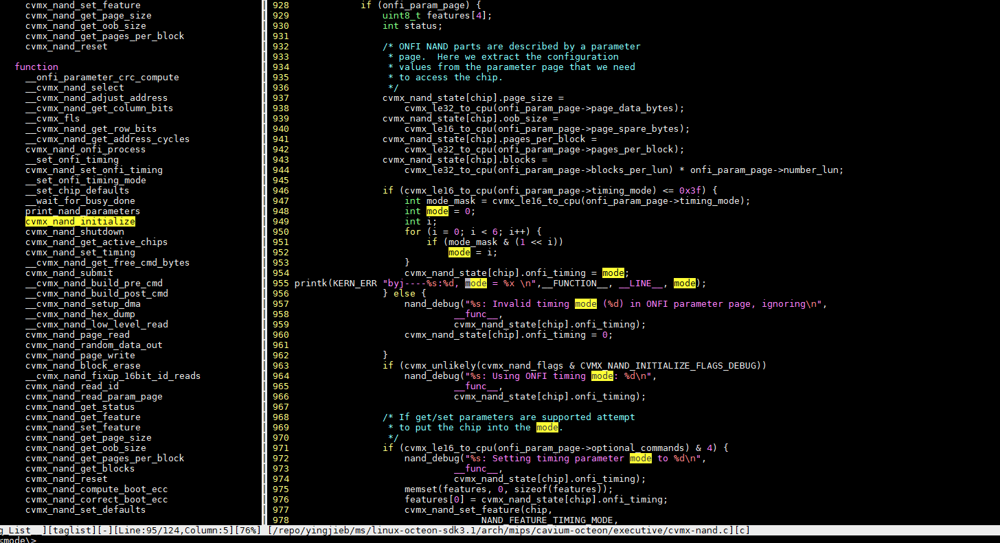

- [用户态使用设备物理地址方法](#用户态使用设备物理地址方法)
- [iomem冲突问题](#iomem冲突问题)
  - [现象](#现象)
  - [driver代码](#driver代码)
  - [dts](#dts)
  - [kernel的iomem机制](#kernel的iomem机制)
  - [修改](#修改)
- [nand问题分析](#nand问题分析)
  - [Nand访问](#nand访问)
    - [ONFI 接口的nand器件访问](#onfi-接口的nand器件访问)
    - [闪存命令](#闪存命令)
    - [闪存寻址](#闪存寻址)
    - [时序](#时序)
  - [跟踪octeon_nand_wait](#跟踪octeon_nand_wait)
    - [加printk信息的结果](#加printk信息的结果)
  - [nand写相关函数](#nand写相关函数)
  - [perf probe 相关函数](#perf-probe-相关函数)
  - [perf script原始记录](#perf-script原始记录)
    - [ls](#ls)
    - [cp](#cp)
    - [后台进程](#后台进程)
    - [写nand调用栈分析](#写nand调用栈分析)
  - [一次ubifs_writepage, 并没有真正写nand](#一次ubifs_writepage-并没有真正写nand)
  - [这次真正有nand操作](#这次真正有nand操作)
  - [nand buserror](#nand-buserror)
  - [nand的timing mode](#nand的timing-mode)
- [网口中断](#网口中断)
  - [core0 CPU占用率持续100%的情况下, 调试网口不通.](#core0-cpu占用率持续100的情况下-调试网口不通)

# 用户态使用设备物理地址方法
> he traditional answer here is to use `dma_alloc_coherent()` in a kernel driver, then share that memory with userspace, typically via `mmap()`.
> If you need more than a few megs of memory, you will run into some default size limits, which can be worked around by tweaking various kernel settings.
> The "modern" solution is called CMA - Contiguous Memory Allocator - which was merged into mainline linux kernel 3.5 (IIRC).

参考  
http://lwn.net/Articles/447405/  
http://lwn.net/Articles/486301/  
http://mina86.com/2012/06/10/deep-dive-into-contiguous-memory-allocator-part-i/
https://events.linuxfoundation.org/images/stories/pdf/lceu2012_nazarwicz.pdf

Sample driver: http://thread.gmane.org/gmane.linux.kernel/1263136


# iomem冲突问题
## 现象
CPLD初始化失败
```
[ 45.424249] (c01 1178 modprobe) cpld 100001a000000.cpld: cpld0: Failed to reserve physical memory 0 at 0x100001a000000 (size 0x10000)
[ 45.436819] (c01 1178 modprobe) cpld 100001a000000.cpld: cpld0: unable to reserve memory for device (rc -16)
[ 45.447447] (c01 1178 modprobe) cpld 100001a000000.cpld: cannot activate cpld 
```
## driver代码
  

注意这里的IRQ_CONFIG_FLAG_MEMRESERVE

## dts
  
确实和bootbus冲突了.  
  

## kernel的iomem机制
kernel给driver提供了资源注册的函数:  
在`include/linux/ioport.h`  
```c
devm_request_region()
devm_request_mem_region()
```
主要作用是给driver在初始化时, 声明自己的资源, 一般都是driver从dts里读出其设备的地址范围, 然后调用devm_request_mem_region()来"注册".  
devm_request_mem_region里面会做冲突检查, 有冲突打印错误.  
该机制主要是防止driver用的资源有冲突, 手段是在driver初始化时检查. 

但不调用这个devm_request_mem_region函数, 对driver的实际功能并没有影响.

体现在/proc目录下的ioports和iomem
```
~ # cat /proc/ioports 
00001000-ffffffff : OCTEON PCIe-0:0 IO
~ # cat /proc/iomem 
00400000-007fffff : System RAM
00800000-012e5fff : System RAM
  00800000-00f84207 : Kernel code
  00f84208-012e5fff : Kernel data
012e6000-0212ffff : System RAM
02130000-022c2fff : System RAM
  02130000-022c2daf : Kernel bss
02500000-0fcfffff : System RAM
20300000-79efffff : System RAM
80300000-efffffff : System RAM
f0001000-ffefffff : System RAM
100001000-10effffff : System RAM
100001a006000-100001a00600f : serial
1070000000800-10700000008ff : /soc@0/gpio-controller@1070000000800
1070000001000-10700000010ff : /soc@0/spi@1070000001000
1180000000800-118000000083f : serial
1180000000c00-1180000000c3f : serial
1180000001000-11800000011ff : /soc@0/i2c@1180000001000
1180000001200-11800000013ff : /soc@0/i2c@1180000001200
1180000001800-118000000183f : /soc@0/mdio@1180000001800
1180040000000-118004000000f : octeon_rng
11b00f0000000-11b0fffffffff : OCTEON PCIe-0:0 MEM
  11b00f0000000-11b00f00fffff : PCI Bus 0000:01
    11b00f0000000-11b00f000ffff : 0000:01:00.0
    11b00f0010000-11b00f00103ff : 0000:01:00.0
  11b00f0100000-11b00f010ffff : 0000:00:00.0
  11b0100000000-11b0100003fff : 0000:00:00.0
1400000000000-1400000000007 : octeon_rng
```

## 修改
* 硬件不用uart2的, 就在dts里删掉
* 或者在dts里面, 避免冲突
    * `uart2: reg = <0x10000 0x1a006000 0x0 0x10>`
    * `cpld: <2 0 0x10000 0x1A000000 0x10000>` 这里改小一点

# nand问题分析
## Nand访问
对Octeon的CPU来说:  
nand控制器挂在bootbus上, 和其他bootbus器件共用信号;  
nand读写时序都是多周期的, data线只有8个, 而需要通过这8根线, 给nand器件发送命令字, 地址, 和数据.  
在CLE阶段发CMD, 在ALE阶段发行地址, 列地址; 在WE/OE阶段发数据或读数据.  
  


### ONFI 接口的nand器件访问
参考: https://www.ssdfans.com/blog/2018/05/17/%E9%97%AA%E5%AD%98%E5%AE%9E%E6%88%98%E6%8C%87%E5%8D%97/
闪存实战指南:
闪存接口有同步异步之分，一般来说，异步传输速率慢，同步传输速率快。异步接口没有时钟，每个数据读由一次RE_n信号触发，每个数据写由一次WE_n信号触发。同步接口有一个时钟信号，数据读写和时钟同步。  
  
异步写:  
  
这张图里有5个信号：

* CLE：Command Latch Enable，CLE有效时IOx发送命令；
* CE_n：Chip Enable，这个信号来选通一个逻辑上的芯片——Target。为什么说是逻辑上的芯片？因为物理芯片里面封装了很多Target，每个Target是完全独立的，只是有可能共享数据信号，所以通过CE_n来选择当前数据传输的是哪个Target，业内一般把Target叫做CE；
* WE_n：Write Enable，写使能，这个信号是用户发给闪存的，有效时意味着用户发过来的写数据可以采样了；
* ALE：Address Latch Enable，ALE有效时IOx发送地址；
* IOx：数据总线。

同时有很多时间参数，这里只介绍几个关键的参数：

* tWP是WE_n低电平脉冲的宽度，tWH是WE_n高电平保持时间，合起来一个周期的时间就是tWC；
* tDS是数据建立时间，意思就是8比特数据要都达到稳定状态，最多这么长时间；
* tDH是数据稳定时间，这段时间里数据信号稳定，可以来采样；

这样我们来看上面的时序图，数据写入的时候，数据总线不能传输地址和命令，所以ALE和CLE无效。这个Target有数据传输，所以CE_n有效。每一个WE_n周期对应一次有效的数据传输。

再来看看的异步数据读出时序图，多了两个信号：  
  

* RE_n：读使能。这个信号是用户发给闪存的，每发一个读使能，闪存就在数据总线上准备好数据，等用户采样；
* R/B_n：Ready/Busy。闪存正在进行内部读的时候，Busy_n有效，当操作完成数据准备好之后，Ready有效，用户可以来读了。

所以，图就是用户向闪存发了读命令之后，Ready信号拉高，意味着数据准备好了。接着，用户发RE_n信号去读数据，每个RE_n周期，闪存发送一个有效数据到数据总线上，供用户采样。

### 闪存命令
nand控制器和nand存储器件通过如下命令交互:  
  
有的命令有两个时序周期, 比如 Page Program第一个周期发80h, 第二个周期发10h

### 闪存寻址
举例: 一个nand, 有2个LUN(Logical Unit), 每个LU有2个Plane, 每个Plane有N个Block, 每个Block有N个Page.  
行地址编码: LUN Address + Block Address + Page Address  
列地址: 就是Page内部的地址  
擦除以Block为单位.

### 时序
读: 先发CMD 00h, 接着发列地址, 再发行地址, 再发CMD 30h; 然后等待状态寄存器变为ready, 就可以开始读数据了.

写: 每次写一个Page, 先发CMD 80h, 再发列地址, 行地址, 然后发数据, 发完数据发CMD 10h, 然后等待状态寄存器为ready.

擦: 擦以Block为单位, 不涉及数据传输.  再CMD 60h和D0h之间发行地址即可.

## 跟踪octeon_nand_wait
### 加printk信息的结果
  
  


## nand写相关函数
```c
#并不完整
/repo/yingjieb/ms/linux-octeon-sdk3.1/drivers/mtd/nand/nand_base.c
 nand_write_page
  chip->cmdfunc(mtd, NAND_CMD_PAGEPROG, -1, -1);
  status = chip->waitfunc(mtd, chip);
  
 nand_write_oob_std
  chip->cmdfunc(mtd, NAND_CMD_SEQIN, mtd->writesize, page);
  chip->write_buf(mtd, buf, length);
  chip->cmdfunc(mtd, NAND_CMD_PAGEPROG, -1, -1);
  status = chip->waitfunc(mtd, chip);
  
/repo/yingjieb/ms/linux-octeon-sdk3.1/arch/mips/cavium-octeon/octeon-nand.c
 octeon_nand_write_oob_std
  chip->cmdfunc(mtd, NAND_CMD_PAGEPROG, -1, -1);
  chip->waitfunc(mtd, chip);
```
  
  

## perf probe 相关函数
```
perf probe octeon_nand_wait
perf probe octeon_nand_cmdfunc
perf record -e probe:octeon_nand_wait -e probe:octeon_nand_cmdfunc -aR -g --no-children sleep 60
perf record -e probe:octeon_nand_wait -e probe:octeon_nand_cmdfunc -aR -g sleep 60
perf report > perf.report
perf script > perf.script
grep -E "^\S" perf.script | less
```

## perf script原始记录
### ls
全是读操作.  
  
### cp
cp是先读后写.  
读一个特定文件时, 这个文件一般并没有被文件系统的page cache缓存, 所以读是直接读nand器件.  
同时page cache也会缓存, 后续的读会快.  
  
写是先写到page cache, 由内核线程把cache page的内容真正写入nand器件.  
先是要nand_check_wp, 看名字是检查写保护
  
接着是连续的几个nand_write_page, 比如这次是连续两次write_page  
  

再然后是wait, 也就是本文的重点要调查的函数.  
  

### 后台进程
主要是erase  
  

### 写nand调用栈分析
```c
mm/page-writeback.c
    #walk the list of dirty pages of the given address space and write all of them
    write_cache_pages()
fs/ubifs/file.c
    do_writepage(struct page *page, int len)
fs/ubifs/journal.c
    ubifs_jnl_write_data()
        这之间是有锁的.
        make_reservation()
        ...
        release_head()
fs/ubifs/io.c
    ubifs_leb_write()
drivers/mtd/ubi/eba.c
    #writes data to logical eraseblock @lnum of a dynamic volume @vol
    ubi_eba_write_leb()
        #每个logical eraseblock 都有锁保护
        leb_write_lock()
        ubi_io_write_data()
            ubi_io_write()
                #drivers/mtd/nand/nand_base.c
                #[MTD Interface] NAND write with ECC
                nand_write()
                    #一个nand controller可以挂多个chip, 用spin lock来保证当前的chip被选中.
                    #用状态机来保证controller的状态是对的, 状态不对说明其他进程没有准备好状态, 就释放spin lock, 搭配wait_queue让出控制权.
                    nand_get_device(mtd, FL_WRITING);
                    ret = nand_do_write_ops(mtd, to, &ops);
                        nand_write_page()
                            #octeon有硬件ecc, 但似乎有问题, 我们没使用. 
                            #我们用的是NAND_ECC_SOFT和NAND_ECC_BCH, ecc.write_page是nand_write_page_swecc
                            #每个page写之前算ecc, 见nand_calculate_ecc()
                            #每个page都有oob, 里面放ecc和坏块信息
                            chip->ecc.write_page()
                            chip->cmdfunc(mtd, NAND_CMD_PAGEPROG, -1, -1);
                            status = chip->waitfunc(mtd, chip);
                    nand_release_device(mtd);
        leb_write_unlock()
```

## 一次ubifs_writepage, 并没有真正写nand
  

## 这次真正有nand操作
  
  
  
  

## nand buserror
操作命令记录:
```sh
#典型错误打印
PAGEPROG failed with -4
#相关打印
recovery completed
UBIFS: mounted UBI device 1, volume 2, name "nand-persistent"
#调试记录
#uboot
setenv kernel_extra_args config_overlay=reboot=0 octeon-nand.debug=1
setenv kernel_extra_args config_overlay=reboot=0 loglevel=8 debug ignore_loglevel 
#linux
mount_ubi start
dd if=/dev/zero of=/mnt/nand-persistent/testnand bs=4M count=100;sync;mount_ubi stop
mount_ubi stop
ubidetach -p /dev/mtd
ubidetach -p "$mtddev"
ubiformat -yq "$mtddev"
mount -t ubifs ubi$ubidevnr:$volname $mountpoint
#编成ko加载
modprobe octeon-nand.ko
# perf和ftrace相关
perf probe -V cvmx_nand_page_write
perf probe -V cvmx_nand_page_write
perf probe --del probe:cvmx_nand_page_write
perf probe -x vmlinux -F | grep cvmx_nand_page_write
zcat /proc/config.gz | grep CONFIG_FRAME_POINTER


perf probe cvmx_nand_page_write
perf record -e probe:cvmx_nand_page_write -aR sleep 30

#相关代码
linux-octeon-sdk3.1/fs/ubifs/super.c
arch/mips/cavium-octeon/octeon-nand.c
arch/mips/cavium-octeon/executive/cvmx-nand.c
```
## nand的timing mode
  

kernel4.9配的timing mode是4  
  
改为0  
  


ONFI的timingmode有6种: 见[ONFI规范](www.onfi.org/-/media/client/onfi/specs/onfi_2_0_gold.pdf)
mode 0是最慢的.  
  
  
  


# 网口中断
目前调试网口中断默认全部由core0处理
  
通过smp_affinity可以修改让四个核都处理网口中断下半部: `echo f > smp_affinity`
  


## core0 CPU占用率持续100%的情况下, 调试网口不通.
默认core 0处理全部eth0的中断, 当core 0 100%被用户占用时(通常时100%用户态占用), 网口不通.  
目前我的解释是: 该用户态进程优先级过高, 导致中断不能被调度处理.  
解决方法:  
用tasetset把占CPU的进程绑定到其他核, 留0核处理网口中断.  
`taskset -c 1,2,3 xxxx程序`
