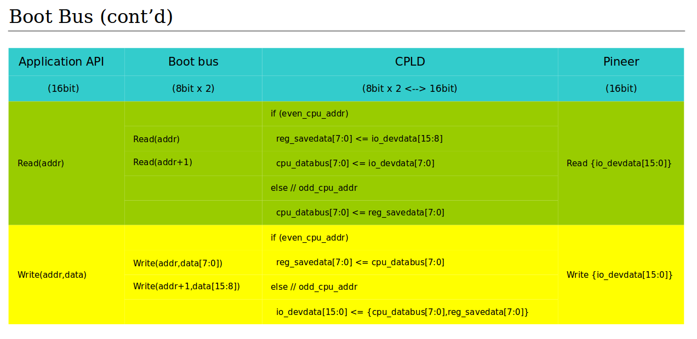

# 背景
octeon的localbus每次读写的基本单位是字节(8bit), 即对一个地址的读写会在bus产生CE/ALE/8bit DATA等硬件信号.

而我们在localbus下挂的一个器件(Pineer)是按16bit位宽设计的, 驱动中对16bit的读写, octeon CPU会首先传输低地址(addr), 然后传输高地址(addr+1).

这里要求addr必须2字节对齐.

我们在CPLD中做这个8bit到16biy的转换.
verilog伪代码如下(多年未写verilog了...):

  