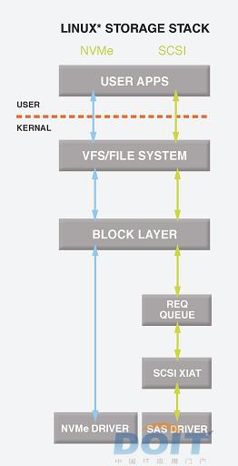

- [NVMe介绍](#nvme介绍)
- [NVMe驱动](#nvme驱动)

# NVMe介绍
对SSD做了很大优化，明显降低延迟，提高IOPS。解决了相对SSD的速度，SATA接口日益成为瓶颈。
其中一部分的优化来自于软件stack。通过标准的制定，NVMe SSD有通用的驱动，不同厂家兼容，主流操作系统都支持。
> NVMe精简了调用方式，执行命令时不需要读取寄存器；而AHCI每条命令则需要读取4次寄存器，一共会消耗8000次CPU循环，从而造成2.5μs的延迟。

但这也不是一劳永逸的，目前SSD使用的NAND闪存本身也会造成约50μs的延迟，也是很大的延迟的因素。
> 要解决存储介质造成的较高延迟，还需要依赖于未来可能应用的诸如PCM、RRAM、MRAM等新式存储器。

  
  
  
  

# NVMe驱动
参考 https://www.osr.com/nt-insider/2014-issue4/introduction-nvme-technology/

NVMe是基于PCIe的存储接口, 定义了一套寄存器级的接口以及host和NVMe device见的命令协议用于数据传输.  
NVMe驱动只有一套, 已经集成到kernel里面了.  符合NVMe规范的设备都可以直接用.

  

和网卡驱动很类似的是, NVMe驱动也是host和device在内存里共享queue的, 而且更有趣的是, 这个共享的内存可以在host上, 也可以在device上.

但存储器件和网卡器件有个本质的不同, 网卡器件的报文是双向触发的, host driver和device都可以发起数据传输; 而存储器件的特性是, host发读写命令, device只负责响应, 所以是host单向发起命令的模式, 这种模式更简单.

所以NVMe在设计上, 用submission queue和completion queue就可以了. 流程见上图.
* NVMe支持64K个queue, 每个queue支持64K个entry. 通常device不会有这么多, 一般是64个queue(一个管理queue, 63个io queue)  
和网卡一样, 通常一对queue是要一个core来处理的. 这也是NVMe对多核系统更友好的原因.
* 另外一点对多核系统友好的是, NVMe用MSI-X做中断机制, 它允许中断被发往特定的core. 这样发送命令和处理device的完成中断都是在同一个core上.
* NVMe device支持中断聚合(interrupt coalescing), 这样就不用每个complition都发中断了, 可以攒几个一起发.

下图表示一个系统里, 有一个管理队列pair, 三个io队列pair.

  
* submission queue的entry是64 byte, 用来描述一次read write或flush操作, 支持最大8K长度的数据.
* completion queue的entry只有16 byte, 包括了完成状态和到对应的submission queue里的entry的引用, 和原始的command能对应上.
* NVMe对命令的简化: io命令只有三个: read write flush, 管理命令有create/delete io submission/completion queue, identify, abort, set/get features, async event request.  
而scsi或者sata的命令, 非常多, 又杂乱.

