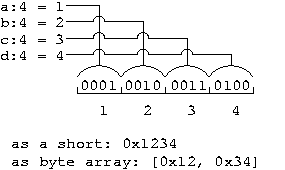
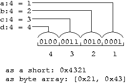
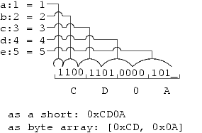
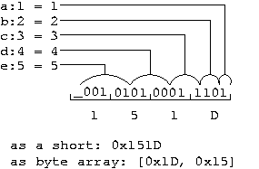
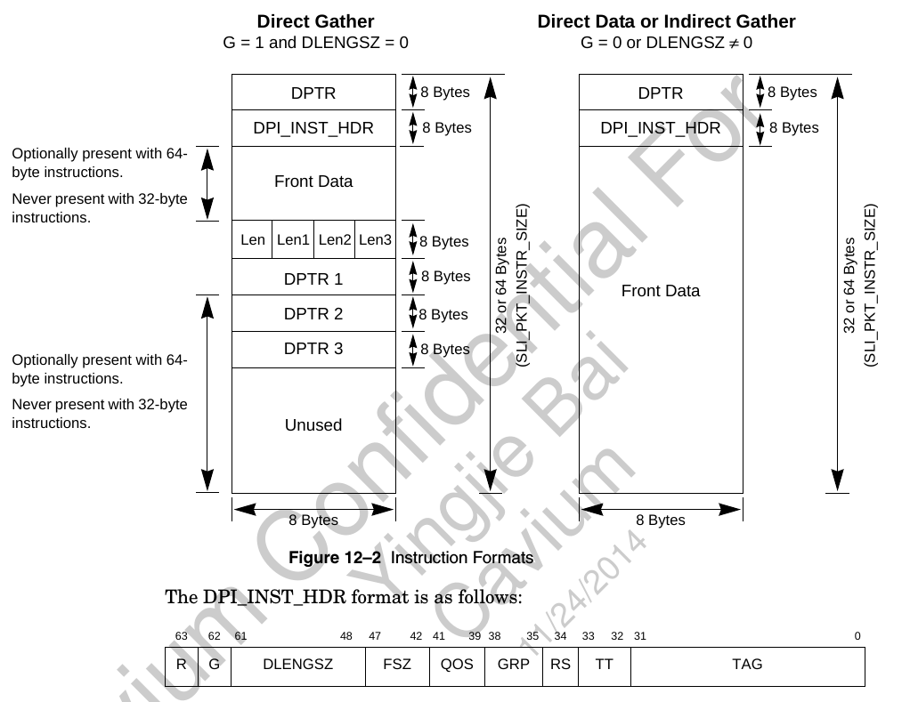

- [理论](#理论)
- [实例](#实例)
  - [在大端系统(编译器)下这么定义](#在大端系统编译器下这么定义)
  - [而在小端系统(编译器)下这么定义: 和大端完全按bit反序](#而在小端系统编译器下这么定义-和大端完全按bit反序)
  - [怎么理解这里的大小端呢?](#怎么理解这里的大小端呢)
  - [测试程序](#测试程序)
  - [运行结果](#运行结果)
- [c位操作 任意符号位扩展](#c位操作-任意符号位扩展)

# 理论
原文: http://mjfrazer.org/mjfrazer/bitfields/

How Endianness Effects Bitfield PackingHints for porting drivers.

Big endian machines pack bitfields from most significant byte to least.
Little endian machines pack bitfields from least significant byte to most.

When we read hexidecimal numbers ourselves, we read them from most significant byte to least. So reading big endian memory dumps is easer than reading little endian. When it comes to reading memory dumps of bitfields, it is even harder than reading integers.

Consider:
```c
union {
    unsigned short value;
    unsigned char byte[2];
    struct {
        unsigned short a : 4;
        unsigned short b : 4;
        unsigned short c : 4;
        unsigned short d : 4;
    } field;
} u;
```
On a big endian machine, the first field is in the first nibble in memory. When we print out a memory dump's character hex values, say [ 0x12, 0x34 ], it is easy to see that a = 1, b = 2, c = 3 and d = 4.

On a little endian machine, a memory dump of [ 0x12, 0x34 ] would indicate that a = 2, b = 1, c = 4, and d = 3. This is because our 2-nibble, or 1 byte, hex value has transposed the pairs of nibbles. Remember that field a would go in the least significant bits, so if we set (a, b, c, d) = (1, 2, 3, 4) we would read the nibbles from least significant to most as 1 2 3 4, but the bytes as 0x21, 0x43. Interpreting this memory as a short gives us the value 0x4321.

These two figures illustrate how the nibble sized elements are packed into memory with the 16 bit field being laid out from MSB to LSB.

  
Big Endian Layout  

  
Little Endian Layout
Now consider:
```c
union {
    unsigned short value;
    unsigned char byte[2];
    struct {
        unsigned short a : 1;
        unsigned short b : 2;
        unsigned short c : 3;
        unsigned short d : 4;
        unsigned short e : 5;
    } field;
} v;
```
Again, the bits are pack from most significant on a big endian machine and least significant on a little endian machine. Interpreted as a short, the bitfield 'a' adds 0x0001 to 'value' on a little endian machine and 0x8000 on a big endian machine. The unused bit is left to the end of interpreting the struct, so it is the MSB on a little endian machine and the LSB on a big endian machine.

These two figures illustrate how the differently sized elements are packed into memory with the 16 bit field being laid out from MSB to LSB.

  
Big Endian Layout  

  
Little Endian Layout

If I had a device that took a message in little endian order, as PC devices often do, and wanted to write endian portable driver code, I would write something like this:

```c
struct message {
    uint16      word;
    struct {
    #ifdef LITTLE_ENDIAN
        uint16 dir : 1;
        uint16 reg : 5;
        uint16 val : 8;
        uint16     : 1;
    #else
        uint16     : 1;
        uint16 val : 8;
        uint16 reg : 5;
        uint16 dir : 1;
    #endif
    } field;
};
```

Fill in the fields of the message m using m.field.reg, etc. The, place the message into a transfer buffer:
    buf[i]   = m.word & 0xFF;
    buf[i+1] = m.word >> 8 & 0xFF;

You will see Intel coders doing stuff like this:
    *(uint16*)&buf[i] = m.word;

This is because x86 CPUs have no alignment rules. Doing this will cause a bus error on most CPUs for odd values of i.

Here is a test program you can play around with on machines of various architectures.

```c
#include <stdio.h>

int main() {
    union {
        unsigned short value;
        unsigned char byte[2];
        struct {
            unsigned short one   : 1;
            unsigned short two   : 2;
            unsigned short three : 3;
            unsigned short four  : 4;
            unsigned short five  : 5;
        } field;
    } u;

    u.field.one   = 1;
    u.field.two   = 2;
    u.field.three = 3;
    u.field.four  = 4;
    u.field.five  = 5;

    printf("The fields are 1, 2, 3, 4, 5.\n");
    printf("The entire hex value is 0x%04x\n", u.value);
    printf("The first byte is 0x%02x\n", u.byte[0]);
    printf("The second byte is 0x%02x\n", u.byte[1]);

    return 0;
}
```

# 实例
这里特指驱动寄存器的表达, 比如这个寄存器, DPI_INST_HDR
  

## 在大端系统(编译器)下这么定义
```c
/** Instruction Header in BIG ENDIAN format.   */
typedef struct {
    /** Raw mode indicator 1 = RAW */ 
    uint64_t     raw:1;
    /** Gather indicator 1=gather*/
    uint64_t     gather:1;
    /** Data length OR no. of entries in gather list */
    uint64_t     dlengsz:14;
    /** Front Data size */
    uint64_t     fsz:6;
    /** Packet Order / Work Unit selection (1 of 8)*/
    uint64_t     qos:3;
    /** Core group selection (1 of 16) */
    uint64_t     grp:4;
    /** Short Raw Packet Indicator 1=short raw pkt */
    uint64_t     rs:1;
    /** Tag type */
    uint64_t     tagtype:2;
    /** Tag Value */
    uint64_t     tag:32;
}octeon_instr_ih_t;
```

## 而在小端系统(编译器)下这么定义: 和大端完全按bit反序
```c
/** Instruction Header in LITTLE ENDIAN format. */
typedef struct  {
    /** Tag Value */
    uint64_t     tag:32;
    /** Tag type */
    uint64_t     tagtype:2;
    /** Short Raw Packet Indicator 1=short raw pkt */
    uint64_t     rs:1;
    /** Core group selection (1 of 16) */
    uint64_t     grp:4;
    /** Packet Order / Work Unit selection (1 of 8)*/
    uint64_t     qos:3;
    /** Front Data size */
    uint64_t     fsz:6;
    /** Data length OR no. of entries in gather list */
    uint64_t     dlengsz:14;
    /** Gather indicator 1=gather*/
    uint64_t     gather:1;
    /** Raw mode indicator 1 = RAW */ 
    uint64_t     raw:1;
}octeon_instr_ih_t;
```

## 怎么理解这里的大小端呢?
* 第一, 编译器不是按照字节来排布位域的, 而是按照位域前面的type为单位来排列的, 也就是说, 上面的例子里是以uint64_t为单位的.  
这里的意思是这个uint64_t的结构体, 按照一个"整体"来摆放到内存里.
* 然后, 给定一个变量地址, 比如0x10000, 在这个例子里, 表示这个寄存器的变量在内存里占据8个字节, 从0x10000到0x10007, 在小端系统下, 编译器会在最小单位里面(如uint64_t), 按照定义的bit顺序从右到左排列位域;而在大端系统下, 是从左向右排列.
* 这符合: 地址都是从小到大, "小端把小的放头面, 大端把大的放头面"的原则;
* 硬件同学一般喜欢大的放头面

## 测试程序
```c
#include <stdio.h>

typedef unsigned long long uint64_t;

typedef struct  {
    /** Tag Value */
    uint64_t     tag:32;
    /** Tag type */
    uint64_t     tagtype:2;
    /** Short Raw Packet Indicator 1=short raw pkt */
    uint64_t     rs:1;
    /** Core group selection (1 of 16) */
    uint64_t     grp:4;
    /** Packet Order / Work Unit selection (1 of 8)*/
    uint64_t     qos:3;
    /** Front Data size */
    uint64_t     fsz:6;
    /** Data length OR no. of entries in gather list */
    uint64_t     dlengsz:14;
    /** Gather indicator 1=gather*/
    uint64_t     gather:1;
    /** Raw mode indicator 1 = RAW */ 
    uint64_t     raw:1;
}octeon_instr_ih_t;

int main()
{
    octeon_instr_ih_t *pt;
    octeon_instr_ih_t t;
    pt = &t;
    *(uint64_t *)pt = 0;
    t.raw = 1;
    printf("0x%llx\n", *(uint64_t*)pt);
}
```

## 运行结果
```
$ ./a.out 
0x8000000000000000
```

# c位操作 任意符号位扩展
如何符号位扩展一个b个bit的数字？
```c
unsigned b; // number of bits representing the number in x
int x;      // sign extend this b-bit number to r
int r;      // resulting sign-extended number
int const m = 1U << (b - 1); // mask can be pre-computed if b is fixed

x = x & ((1U << b) - 1);  // (Skip this if bits in x above position b are already zero.)
r = (x ^ m) - m;
```
