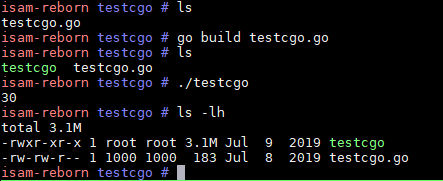

- [Background](#background)
- [Native compilation of go src](#native-compilation-of-go-src)
  - [board prerequisites](#board-prerequisites)
  - [set up Gentoo linux environment](#set-up-gentoo-linux-environment)
  - [build gc go toolchain](#build-gc-go-toolchain)
- [hello.go and cgotest.go](#hellogo-and-cgotestgo)
- [Works next](#works-next)

# Background
In previous article `go on mips board part 1`,  we have set up a go cross compiler and by using of buildroot go package frame work, we added a go-prototype package in buildroot and we are able to generate go "hello" executable running on MIPS board cfnt-b. 
For simple "hello" go executable, it is fine. However, Cgo is not supported. The MIPS N32 ABI we are always using for our MIPS board does not seem to support Cgo, see "Cgo issue" in `go on mips board part 1`, hence it prevents us from running go packages that call C code, which is the case that vOnuMgmt expects, according to vOnuMgmt expert.
So, What should we do? The errors are link time errors, ld complains about the format of the to be linked shared objects are incompatible. 
In the end of that article, I proposed to try MIPS N64 ABI. However, in buildroot, one can select "Target ABI" to either n32 or n64, but not both. If we use n64 ABI, there will be no lib32 support, for example, no n32 glibc is there which is the corner stone of the 32bit isam applications. 
The possible options to support N64 ABI:
* change the whole world from N32 ABI completely to N64 ABI: a fundamental change, big impact, think about Android or ios switching from 32 bit to 64 bit.
* in buildroot, implement "multilib" which supports both N32 and N64, let go packages use n64, everything else use n32: smaller impact, but consuming considerablelly more rootfs size since lib64 will also need to be copied to target rootfs.
```shell
#toolchain-external-custom/mips64-octeon-linux-gnu/sys-root
$ du -sh lib32 lib32-fp lib64 lib64-fp
50M lib32
25M lib32-fp
60M lib64
30M lib64-fp
```
The second option is preferred, but we need more work to investigate the effort.
There is indeed another prospect in which we can build go natively on the board, see below...
But please note that this approach is for prototype go **only** for performance evaluation, because it leverages a totally different root filesystem, much larger but has the ability to native build go packages compared to buildroot root filesystem. 
We will also need to explore more feasible method to build go packages if go performance is accetable on MIPS boards.


# Native compilation of go src
## board prerequisites
To be able to compile go natively, the board should have:
* native gcc toolchian: used to compile Cgo
* go bootstrap: used to build go toolchain


It is not the intention of buildroot to have the ablitiy to generate a gcc toolchain for the target board, all it is about is cross compilation.
And building a Gcc toolchain is not even an easy task for people working on X86 PC/Server environment, since lots of dependency packages need to install in order to get Gcc toolchain built, let alone we are on a embedded busybox based system.
So we need a basic system that can provide minimal development environment, for MIPS in particular.
Fortunately, there is one available(maybe one only for MIPS): Gentoo Linux


## set up Gentoo linux environment
I am skipping some details about how to setup the Gentoo Linux environment as it is less relevant to our go topic. So here I just list key points.
* Gentoo linux base rootfs is a prebuilt rootfs, with size about 2G, so I put it on my PC and let board mount it over nfs.
* Let board boot to the default Linux environment, and then `chroot` to Gentoo Linux.
`chroot` let us switch into Gentoo Linux as if it is the root filesystem


## build gc go toolchain
To build a gc go toolchain on the board, following steps are required:
* build go1.12 toolchain on X86 first
* on X86, use the go1.12 toolchain to build bootstrap toolchain for MIPS64
* copy go bootstrap toolchain for MIPS64 to board
* use that bootstrap toolchain to build go1.12 toolchain


The reason we need 4 steps is go toolchain is written in go, so in order to build go toolchain, we need go bootstrap toolchain, which is go1.4, only X86 can build that toolchain.


# hello.go and cgotest.go
OK, now we have native go toolchain, let's compile and run some go programs:
```shell
root@yingjieb-VirtualBox ~/work/nfsroot/mipsroot.go.ok/root
Linux Mint 19.1 Tessa # cat hello.go
package main
import "fmt"
func main() {
        fmt.Println("Hello, World!")
        fmt.Println("First go program on cfnt-b!")
}
root@yingjieb-VirtualBox ~/work/nfsroot/mipsroot.go.ok/root
Linux Mint 19.1 Tessa # cat cgotest.go
package main
//int Add(int a, int b){
// return a+b;
//}
import "C"
import "fmt"
func main() {
    a := C.int(10)
    b := C.int(20)
    c := C.Add(a, b)
    fmt.Println(c) // 30
}
```
The go programs run as expected.  
  
  

# Works next
* go program with libraries: hello.go is too simple, we need to run a real world go program that uses more libraries, to see if running them on MIPS board has any problems.
* general benchmarks: for example, lmbench. This is to see how general performance looks like compared to X86. 
* go basic performance
    * compress: tar/zip/bzip2/flate
    * structures: heap/list/ring
    * algorithm: sort/string
    * crypto: aes/des/dsa/md5/sha256
    * encoding: csv/json/xml
    * image: gif/jpeg/png
    * net: http/socket
* more complicated go benchmarks.