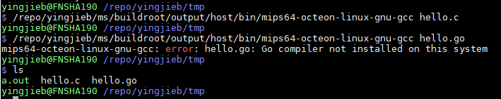

- [What is gccgo](#what-is-gccgo)
- [Current gcc used by MIPS boards doesn't compile go](#current-gcc-used-by-mips-boards-doesnt-compile-go)
- [Build gcc toolchain to support go](#build-gcc-toolchain-to-support-go)
- [gcc toolchain needs to be rebuild to support go](#gcc-toolchain-needs-to-be-rebuild-to-support-go)
  - [build gcc toolchain natively on X86](#build-gcc-toolchain-natively-on-x86)
  - [use gccgo](#use-gccgo)
- [C Interoperability](#c-interoperability)
- [Gcc version requirement](#gcc-version-requirement)
- [Conclusion](#conclusion)

# What is gccgo
> The gccgo compiler is a new frontend for GCC, the widely used GNU compiler.

refer to: https://golang.org/doc/install/gccgo

# Current gcc used by MIPS boards doesn't compile go
  

# Build gcc toolchain to support go
# gcc toolchain needs to be rebuild to support go
Building gccgo is just like building GCC with one or two additional options. See the instructions on the gcc web site. When you run configure, add the option --enable-languages=c,c++,go (along with other languages you may want to build). 


## build gcc toolchain natively on X86
gccgo is another branch of gcc, called branches/gccgo:
```sh
svn checkout svn://gcc.gnu.org/svn/gcc/branches/gccgo gccgo
mkdir objdir
cd objdir
../gccgo/configure --prefix=/opt/gccgo --enable-languages=c,c++,go --with-ld=/opt/gold/bin/ld
make
make install
```

## use gccgo
```sh
gccgo -c file.go
gccgo -o file file.o
```


# C Interoperability
> When using gccgo there is limited interoperability with C, or with C++ code compiled using extern "C".


refer to: https://golang.org/doc/install/gccgo#C_Interoperability


# Gcc version requirement
The GCC 4.7.1 release and all later 4.7 releases include a complete Go 1 compiler and libraries.
The GCC 4.9 releases include a complete Go 1.2 implementation.
The GCC 5 releases include a complete implementation of the Go 1.4 user libraries.

The GCC 6 releases include a complete implementation of the Go 1.6.1 user libraries.

The GCC 7 releases include a complete implementation of the Go 1.8.1 user libraries.

The GCC 8 releases are expected to include a complete implementation of the Go 1.10 release

# Conclusion
Gcc toolchain was compiled and generated by vendors, and by default made **without** go language support.
Current gcc toolchain is provided by Marvell(Cavium), which doesn't support go.
* gcc version is 4.7.0, which can not support Go 1.0
* the toolchain was **not** compiled with Go language support.

To be able to use gcc to compile go code, we need vendor to provide cross gcc toolchain, which must meet 2 prerequisites:
* with additional go language enabled: add `--enable-languages=c,c++,go` when compiling the toolchain.
* better to be Gcc 8, Gcc 7 only supports Go 1.8

