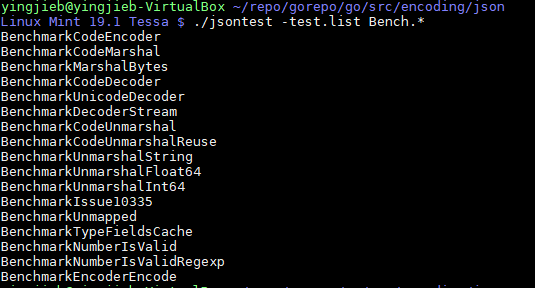
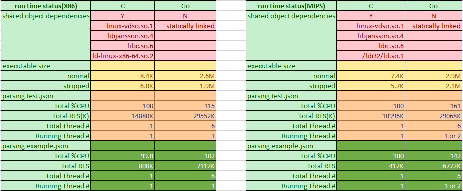
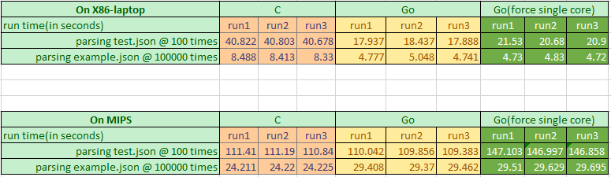
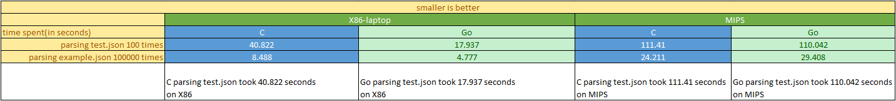

- [Background](#background)
  - [Single core performance methodology](#single-core-performance-methodology)
  - [Multi-core performance methodology](#multi-core-performance-methodology)
  - [Devices under test](#devices-under-test)
  - [Take goroutine into account](#take-goroutine-into-account)
- [Json performance](#json-performance)
  - [X86 vs MIPS comparison](#x86-vs-mips-comparison)
    - [run official json benchmark](#run-official-json-benchmark)
    - [the result](#the-result)
  - [Writing test code for C vs Go comparision](#writing-test-code-for-c-vs-go-comparision)
    - [compile and run the benchmark on MIPS board](#compile-and-run-the-benchmark-on-mips-board)
    - [runtime status](#runtime-status)
    - [result](#result)
  - [Overall observation](#overall-observation)

# Background
There are many factors that impact the performance of a workload under test: 
* On hardware wise, what is the CPU arch being used(X86, MIPS, ARM…), how is the Cache system like(L1 L2 L3), how many DDR controllers on the system, and how much memory a system has? what is the storage subsystem(SSD, NVME, or distributed storage system), what is the network subsystem(1G, 10G, 25G, which NIC being used?)…
* On software wise, what is the kernel and root file system? How is the software configured? Is it a single thread app or in multi thread mode? What is the contention model if it is multi-threaded?
	
The factors are too many and any one of them could have big impact on the performance.

However, there are indeed methodologies based on experience and practice that could direct the evaluation task of a given workload requirement.

## Single core performance methodology
Generally, unlike multi-thread workloads, single thread app does not involve contentions with other threads that share same resources, which avoids the complicities of lock contention, waiting or sleeping on a resource to be available, or cache coherence issue, etc. A typical example is MySQL, which uses many threads that may access the same row or column of a table.

So it is in practice more reliable to use single thread mode to do the benchmark. 

## Multi-core performance methodology
As said, multi-core introduces more complicities which are all about contention for shared resources, what resources are shared across multiple cores depends on the given workload. For example, if the target workload has multiple threads that shares a critical memory area, there will be a lock to protect the access to the shared memory, which may result in thread being scheduled out, which will hurt the performance.  
Even if the target workload is designed to be scale-out, say not using locks, its many threads are running independently sharing nothing from software perspective, that is not often the case in real world, but even it is, the cumulative performance may still not be scaled, that's because the cores actually share hardware buses, like cache bandwidth, ddr bandwidth…

So for multi-core performance , we should check the scalability of cores 2 4 6 8…, usually by using taskset to bind the tasks to different cores.
 
## Devices under test
From hardware perspective, which factor is more important for a given workload? That depends on the nature of the selected test app: 
* For compute intensive workloads, CPU micro architecture(multi-issue, OOO, branch predictor…), frequency(base and turbo), L1 L2 cache are the most important factors.
* For memory intensive workloads, L3 cache and DDR bandwidth sometimes are more important.
* For IO intensive workloads, normally CPU is not the problem, but the key is how fast the IO subsystem can be, multi-queue technology is often used to improve the IO performance to make better use of a multi-core system.

Most real world workloads are a mix type of the above 3 types, typically a server app waits for network IO to receive requests, the requests go through Kernel TCP/IP stack and then are delivered to app to process, the app invokes "compute" functions that normally use in memory data structures, and corresponding algorithm to do the real job.

The real job part is often compute and memory intensive, depends on how fast the requests come and wait in queues to be served.
Therefor we will further focus on the "real job" part. It is usually about how fast the CPU processes the instructions and how fast the data can be retrieved from the cache and memory system. Below is the comparison of the CPU architecture that to be evaluated for json performance:

| Machine        | X86-laptop                     | X86-workstation           | MIPS                   |
| -------------- | ------------------------------ | ------------------------- | ---------------------- |
| CPU            | Intel(R) Core(TM) i5-8350U     | Intel(R) Xeon(R) E7- 8837 | Cavium Octeon III      |
| Freq           | 1.70GHz base/ turbo to 3.58GHz | 2.67 GHz/ no turbo        | 1.2GHz/ no turbo       |
| Issue width    | 4 way                          | 4 way                     | 2 way                  |
| Execution mode | Out of Order                   | Out of Order              | In Order               |
| SIMD           | AVX SSE                        | SSE                       | NONE                   |
| Core #         | 4                              | 32                        | 4                      |
| L1 cache       | dcache 32K, icache 32K         | dcache 32K, icache 32K    | dcache 32K, icache 78K |
| L2 cache       | 256K                           | 256K                      | 512k                   |
| L3 cache       | 6M                             | 24M                       | NA                     |
| DDR Channel #  | 1 uesd/ 2max                   | ? Typical 4               | 1                      |

## Take goroutine into account
We want to focus on single thread single core app, then expands a bit more to multi-thread, however it is fairly hard in Golang to do so, because Go has goroutines.
Typically, Go runtime starts several threads on which go routines are scheduled to run by go runtime scheduler, go routines can be started by program by using `go` key word in your code, or can be started by go runtime like GC routines.
For example, in `json_load` benchmark(detailed in the following sections): there are 6 threads, with 8 goroutines running on top of them. 

So in the rest of this article, I decide to run go programs in 2 methods:
A. run with `taskset -c 1` to force it running on 1 core
B. free run the program, let go runtime to manage the threads.

For X86 vs MIPS comparison, only run `A` method, as we want to know X86 single core VS MIPS single core.
For Go vs C comparison, we focuse on `B` method, and we also look at `A` method.

# Json performance
## X86 vs MIPS comparison
I am using built-in json benchmark.
### run official json benchmark
Gc go toolchain has a test framework that all of its packages have built-in tests, encoding/json as the "official" json parser also follows the principle, there are many sub-tests of test and benchmarking.  
  
The benchmark takes the input `test.json` file, and test many operations on the data: encoding, decoding….
The input file `test.json` is a complicated recursive json file, with 1.9M size.  
  

We want ro run it in single core, so:
`taskset -c 1 ./jsontest -test.bench .*`
The run time snapshot is something looks like this: 1 core running nearly 100% in **user space**.
The behavior is the same on MIPS, so we can make sure the comparison is apple to apple.  
  

### the result
  


## Writing test code for C vs Go comparision
Now that we have a roughly idea of how much slower MIPS than X86 running json in Go, that's may be a reference of the performance loss about running OnuMgmt on the cloud VS on the device.
But since we will eventually have our code running on the device, for LT board it is MIPS, regardless what code it is, Go or C/C++…
So we got to know what is the performance comparison of Go VS C?


There are indeed some programing language comparison data on the internet: some good references are:
[Go java python lua C/C++](https://attractivechaos.github.io/plb/)
[Go vs C++](https://benchmarksgame-team.pages.debian.net/benchmarksgame/fastest/go-gpp.html)
[Go vs python](https://benchmarksgame-team.pages.debian.net/benchmarksgame/fastest/go-python3.html)


I've got the feeling that Go is a bit slower than C/C++, but much much faster than python.
It is all about on X86, then how about on MIPS? So we decided to write a simple json benchmark and run it on our MIPS board.


We reuse the input json file `test.json`, what the simple benchmark does is it opens and reads the json file, parsing json into its internal in memory data structures, and then converts the data structures back to json strings, and outputs back to stdout.
* For C implementation, we use libjansson which is used by **reborn platform** widely for json parsing.
* For Go implementation, we use official `encoding/json` package in GC go toolchain.


When benchmarking, run the program enough times and count the time spent as the performance index.


### compile and run the benchmark on MIPS board
For C implementation, we need libjansson
```shell
#install libjansson, we are on Gentoo linux, we use emerge
#for X86, it is 'apt install libjansson-dev'
emerge -av dev-libs/jansson
#compile, into a.out
gcc -O2 json_load.c -ljansson
#benchmark it
time ./a.out test.json 100 > /dev/null
```
For Go implementation, no other package needed.
```shell
#compile
go build json_load.go
#run, Go run time will automatically starts several threads
time ./json_load -fileName test.json -loopNum 100 > /dev/null
#force single core
taskset -c 1 time ./json_load -fileName test.json -loopNum 100 > /dev/null
```

### runtime status
There are 6 threads(starts with M), with 8 goroutines(starts with G) running on top of them. P represents Processor on the system.
`json_load` is a simple benchmark that has no awareness that it is multi-threaded, in the above 8 goroutines(sometimes more depends on the runtime), there is only one that does the "user" work: encoding and decoding the json file.  
  

  

The runtime resource comparison shows that Go has more memory footprint than C, which is nearly triple in huge json file case, while in the small json file case, C only requires 412K on MIPS, that says the json parsing itself is not memory consuming, but Go requires additional memory for its runtime managed data and thus consumes 6772K.
Go also has higher CPU usage, also because Go has runtime scheduler and Gc routines running together with the "user" routine. The CPU overhead on MIPS is considerably higher than X86. 
I would say the extra static size and about 30% of a single core overhead is the Go "tax" to use this modern programming language on MIPS.

### result
  

  

## Overall observation
* For Go builtin json test, MIPS is roughly 7 times slower than X86 @ real frequency
* For Go builtin json test, MIPS is roughly 3 times slower than X86 @ 1GHz frequency, by calculation
* For json parsing test between C and Go
    * X86 go json package is highly optimized, even faster than C implementation libjansson
    * MIPS go json package is less optimized, but still on par with C:libjansson