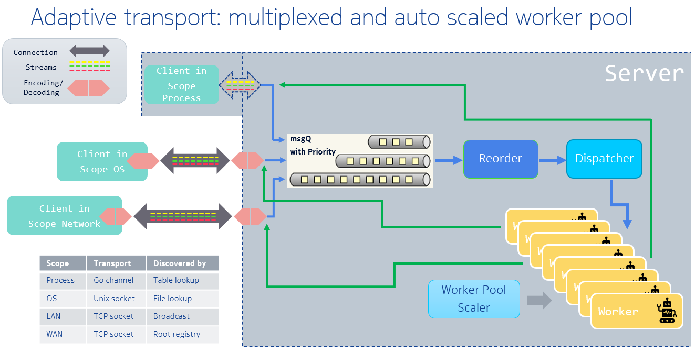
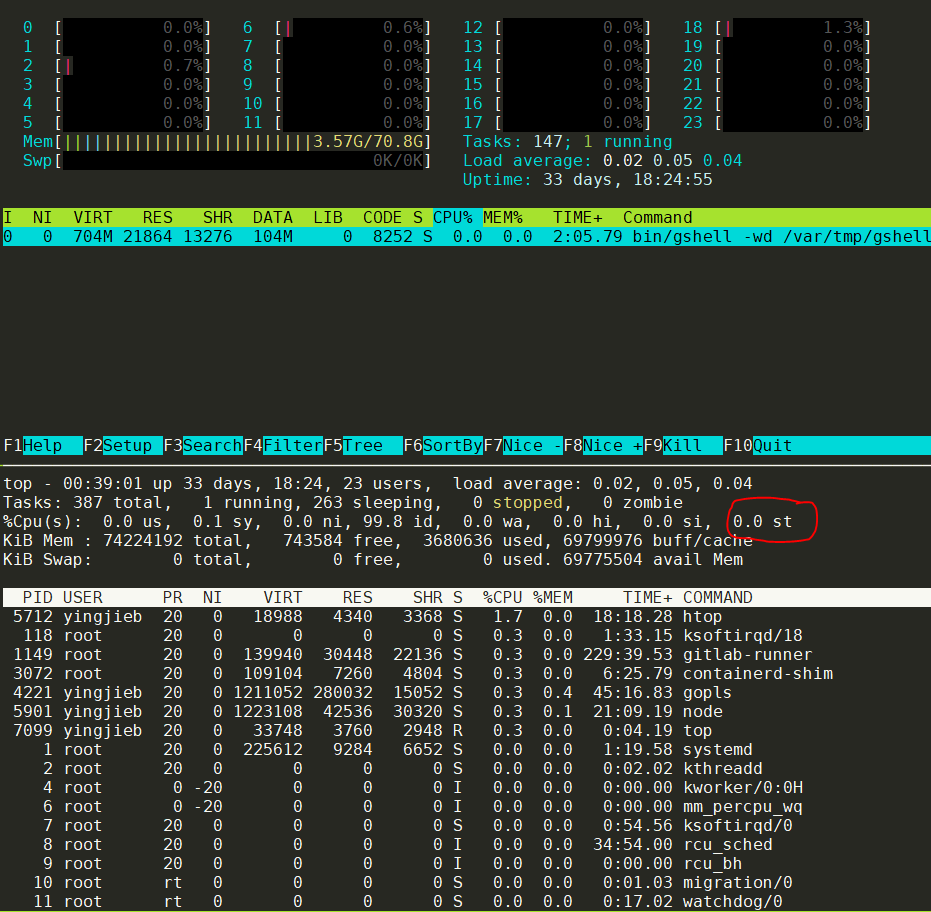
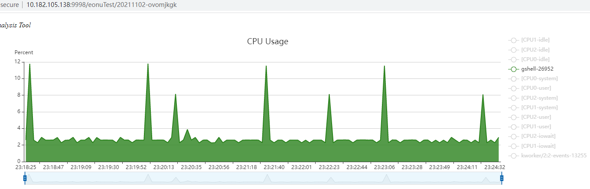
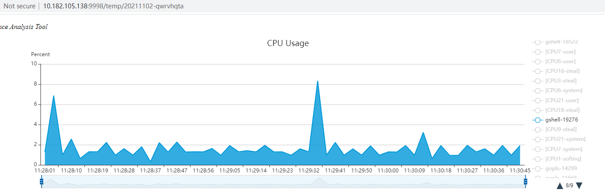
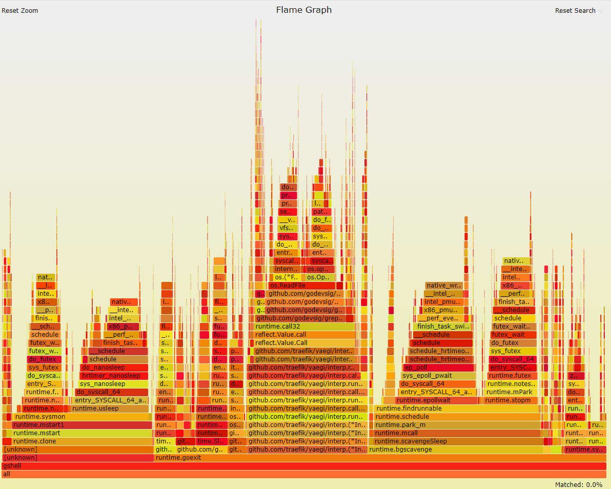
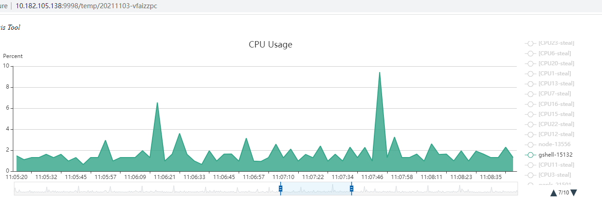

- [asbench调试](#asbench调试)
  - [背景](#背景)
  - [在x86服务器上性能不稳定](#在x86服务器上性能不稳定)
  - [试验](#试验)
  - [目前的结论:](#目前的结论)
- [topid性能调试](#topid性能调试)
  - [baseline](#baseline)
    - [CPU chart](#cpu-chart)
    - [火焰图](#火焰图)
  - [float改int有效果吗?](#float改int有效果吗)

# asbench调试
## 背景
测试adaptiveservice性能  
  

## 在x86服务器上性能不稳定
测试命令:
启动daemon, 注意这里限定了`GOMAXPROCS=8`, 就是说默认grg的最大proc数为8
`GSHELL_NOUPDATE=1 GOMAXPROCS=8 bin/gshell -loglevel info daemon -registry 10.182.105.179:11985 -bcast 9923`
启动asbenchserver:
`gsh run -group asbench benchmark/asbench/server/asbenchserver.go`
启动client, 测试性能
`gsh run -group asbench -i -rm benchmark/asbench/client/asbenchclient.go -t 10 -scope os -s32 -n 1`
发现有时候TPS数据差异很大:
```
Transaction Per Second(TPS):     15088.94
Transaction Per Second(TPS):     13968.29
Transaction Per Second(TPS):     16901.58
```
但有时候又很稳定:
```
Transaction Per Second(TPS):     24853.32
Transaction Per Second(TPS):     25749.64
Transaction Per Second(TPS):     24608.96
```

## 试验
经过简单的调整golang运行时的参数, 比如:
`GODEBUG=madvdontneed=0,schedtrace=1000,scheddetail=1,asyncpreemptoff=1 GOGC=off taskset -c 11 ./asbench -packet -t 10 -mode c`
`GODEBUG=madvdontneed=0,schedtrace=1000,scheddetail=1,asyncpreemptoff=1 GOGC=off GOMAXPROCS=1 ./asbench -packet -t 10 -mode c`
taskset似乎能起一定的作用, 但TPS还是不稳. 

## 目前的结论:
本测试是在云服务器(VM)上进行的, 似乎是KVM虚拟机. 在VM上用top看到, 性能稳定的时候, 都是`0.0st`(红框部分).  
  
但性能不稳定的时候, 是零点几的st: `0.3st`, 虽然只有零点几, 但可能是host上有什么负载, 或者是同一台物理机上其他人的VM有大load.  
因为KVM的核也是host上qemu的一个线程, 在VM中跑load, 会受到host的影响, 但这种影响似乎在VM上很难察觉.

# topid性能调试
## baseline
gshell版本`v21.11.02.rc2`
启动命令:
```
~/gshell # gsh run -rt 91 -i app-plat/topid/topid.go -chart -snapshot -sys -i 3 -tag eonuTest -info "cat /tmp/boardname,typeA_panda_show,typeA_squirrel_show"
```

### CPU chart
CPU chart(on ppc32, gccgo):  
  

CPU chart(on x86, gcgo):  
  

### 火焰图
  
火焰图上看, 占比比较大的有:
* yaegi解释器
* 进程update
* 调度
* GC
* 而gotidy编解码占比非常小

## float改int有效果吗?
topid client在向server端传输数据的时候, CPU占用率用的是float表示.
我们直到, 即使是简单的float值, 比如`1.05`, 其实在内存中的表达也是一个很大的"数值", 那么能不能传输int, 比如`105`, 这样可以大大简化提高gotiny的编码效率.

那float改成对应的int, 实际效果如何呢?  
-- 几乎没改善, 和perf火焰图一致.  
从火焰图上看, 应该效果非常小. 真的吗?  
把float64改成uint64  
  

CPU实际更擅长"纯数值"计算, 在一个应用逻辑中, 除了计算, 还有IO操作, 比如topid中, 更多的工作是proc文件系统操作和网络IO, 比例远远大于"纯数值"计算. 所以理论上float变成int能够提高编码效率, 但因为这部分计算占应用的比例太低, 实际上性能没有什么提高.
