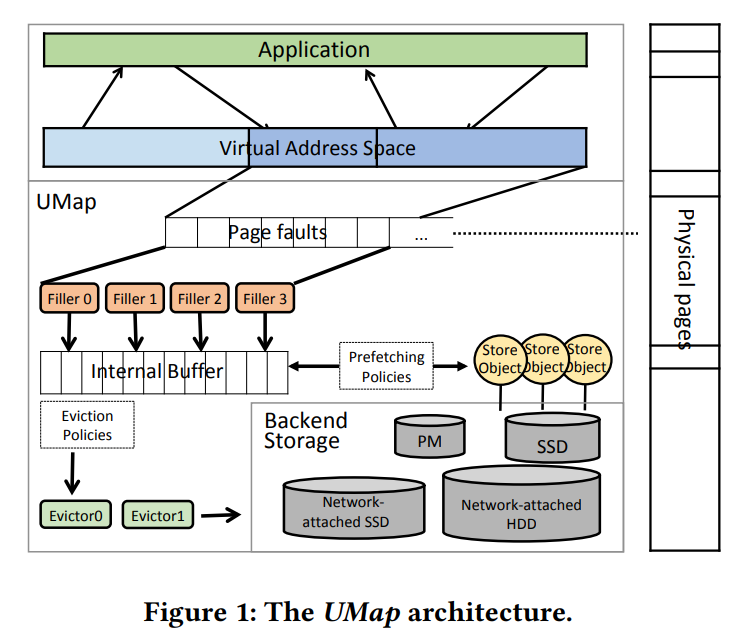
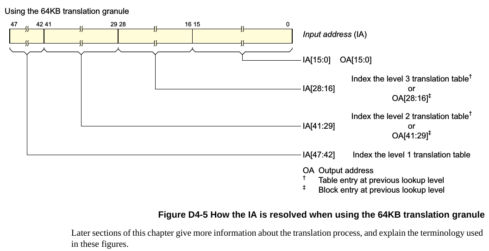
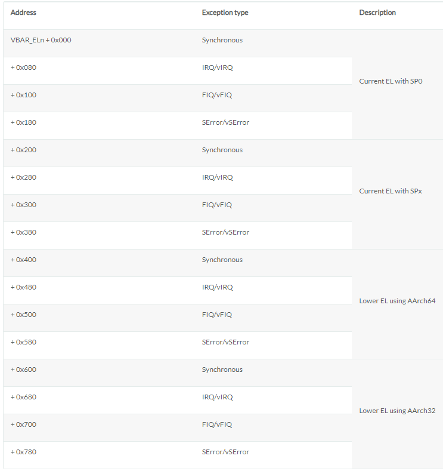

- [介绍](#介绍)
  - [原理简介](#原理简介)
- [编译和调试](#编译和调试)
- [代码结构](#代码结构)
  - [abi](#abi)
  - [sentry的内存管理](#sentry的内存管理)
    - [传统mm](#传统mm)
      - [shared map](#shared-map)
      - [private map](#private-map)
      - [匿名映射](#匿名映射)
    - [如何在用户态处理page fault](#如何在用户态处理page-fault)
      - [signal方式](#signal方式)
      - [userfaultfd方式用户态page管理](#userfaultfd方式用户态page管理)
    - [sentry的mm](#sentry的mm)
    - [性能对比](#性能对比)
  - [netstask](#netstask)
  - [pkg/abi/linux](#pkgabilinux)
    - [pkg/abi/linux/seccomp.go](#pkgabilinuxseccompgo)
  - [pkg/hostarch/hostarch.go](#pkghostarchhostarchgo)
  - [pkg/seccomp/seccomp.go](#pkgseccompseccompgo)
  - [pkg/sentry/arch/arch.go](#pkgsentryarcharchgo)
  - [kernel](#kernel)
    - [task的状态机](#task的状态机)
  - [runsc boot流程](#runsc-boot流程)
  - [platform](#platform)
  - [哪里调用了Switch()](#哪里调用了switch)
  - [ptrace](#ptrace)
    - [thread.setRegs](#threadsetregs)
    - [主要结构体](#主要结构体)
    - [ptrace系统调用](#ptrace系统调用)
    - [ptrace可以做什么?](#ptrace可以做什么)
  - [kvm](#kvm)
    - [golang的汇编基础](#golang的汇编基础)
    - [arm64 exception level](#arm64-exception-level)
    - [arm64内存基础](#arm64内存基础)
      - [VM的地址空间](#vm的地址空间)
    - [KVM基础](#kvm基础)
      - [gvisor对CPU和ring0.kernel的抽象](#gvisor对cpu和ring0kernel的抽象)
      - [machine和vCPU的定义](#machine和vcpu的定义)
    - [pagetable之虚拟地址region到物理地址region的map表](#pagetable之虚拟地址region到物理地址region的map表)
      - [KVM_SET_USER_MEMORY_REGION](#kvm_set_user_memory_region)
      - [mapPhysical()的调用路径之用户态page falut处理路径](#mapphysical的调用路径之用户态page-falut处理路径)
      - [mapPhysical的调用路径之seccompMmapHandler](#mapphysical的调用路径之seccompmmaphandler)
      - [mapPhysical的调用路径之newMachine](#mapphysical的调用路径之newmachine)
    - [KVM新建一个VM](#kvm新建一个vm)
      - [newMachine](#newmachine)
    - [arm64异常向量](#arm64异常向量)
      - [EL0同步异常](#el0同步异常)
      - [EL0同步异常之SVC系统调用异常](#el0同步异常之svc系统调用异常)
      - [kernelExitToEl1](#kernelexittoel1)
      - [顺便看一下kernelExitToEl0](#顺便看一下kernelexittoel0)
      - [EL1同步异常El1_sync](#el1同步异常el1_sync)
      - [EL1其他异常(irq, fiq, error)都走shutdown流程, 关闭guest](#el1其他异常irq-fiq-error都走shutdown流程-关闭guest)
    - [KVM_CREATE_VCPU](#kvm_create_vcpu)
      - [kernelAddr可以获取一个eface和func的内核地址](#kerneladdr可以获取一个eface和func的内核地址)
    - [KVM_ARM_VCPU_INIT](#kvm_arm_vcpu_init)
      - [入口代码](#入口代码)
    - [KVM的context实现](#kvm的context实现)
      - [arm64的cpu.SwitchToUser](#arm64的cpuswitchtouser)
      - [bluepill()汇编函数](#bluepill汇编函数)
      - [vCPU.CPU.SwitchToUser函数](#vcpucpuswitchtouser函数)
      - [补充 go linkname用法](#补充-go-linkname用法)

gvisor代码概览图:  


# 介绍
gvisor是一个用户态操做系统, 自带一个runsc, 可以和conainterd等编排工具集成.
gvisor主打安全特性.

As outlined in the previous blog post, gVisor’s [secure design principles](https://gvisor.dev/blog/2019/11/18/gvisor-security-basics-part-1/#design-principles) are:

1.  Defense in Depth: each component of the software stack trusts each other component as little as possible.
2.  Least Privilege: each software component has only the permissions it needs to function, and no more.
3.  Attack Surface Reduction: limit the surface area of the host exposed to the sandbox.
4.  Secure by Default: the default choice for a user should be safe.

## 原理简介
原文: https://www.infoq.com/presentations/gvisor-os-go/

  
  
  
  
  
  
  
  


# 编译和调试
clone gvisor后, 切换到go分支, 在runsc下面`go build`编译出来的runsc可以直接使用.  
  
修改daemon.json并且`systemctl reload docker`就可以使用runsc了:
```
docker run --cpus=2 -m 2g --rm --runtime=runsc -it --name=test centos:7 bash
```

顺利的话就进入container里面了

debug的log在`/tmp/runsc`, 其中比如`runsc.log.20220315-022030.789081.boot`就是主进程的log

docker run后, 找到对应的sndbox进程`runsc-sandbox`, 就可以用`dlv attach pid`来调试.

官方github里面install提到的containerd-shim-runsc-v1是没用到的.实际docker使用的是`/usr/bin/containerd-shim-runc-v2`

如果在arm64的raspberry pi上, 需要修改`/boot/firmware/cmdline.txt`, 增加`cgroup_enable=memory`
```
net.ifnames=0 dwc_otg.lpm_enable=0 console=serial0,115200 console=tty1 root=LABEL=writable rootfstype=ext4 elevator=deadline rootwait fixrtc cgroup_enable=memory
```

# 代码结构
gvisor的依赖包很多, 有containerd和docker等容器的, 有k8s的, 有protobuf和grpc的, 有报文解析相关的gopacket, 有更加基础的btree库... 很多  
gvisor有很多自己实现的基础库https://github.com/google/gvisor/tree/master/pkg  
可以说, gvisor的这些基础库本身, 就是系统级linux基础的golang实现的参考库.  
比如eventfd包就包装了linux的enventfd系统调用.  
比如在标准库基础上的sync包

## abi
gvisor提供了兼容linux的abi: https://github.com/google/gvisor/tree/master/pkg/abi/linux  
就是说gvisor支持大部分的c的abi:
比如aio, bpf, elf, epoll, fcntl, fs, ipc, mm, netlink, netfilter, ptrace, sched, time, uio, socket等等

## sentry的内存管理
sentry是gvisor用户态kernel的核心.

### 传统mm
mmap的任务是在一个进程里, map一个文件到一个虚拟地址范围.
当这个虚拟地址被访问的时候, 没有PTE的时候会产生page fault异常, kernel才分配物理页, 从文件copy实际内容到这个物理页.

* page是有cache的, 使用Least Recently Used (LRU)策略换出不经常使用的page. 当dirty page超过一个ratio, kernel会flush脏页.
* Read-ahead技术预加载page从而避免缺页异常的产生.
* madvise系统调用可以告知kernel app对内容范围的期望.

#### shared map
linux的mmap系统调用, 比如:
```go
mmap(
    /* addr = */ 0x400000,
    /* length = */ 0x1000,
    PROT_READ | PROT_WRITE,
    MAP_SHARED,
    /* fd = */ 3,
    /* offset = */ 0);
```
创建一个从fd 3到_virtual memory areas_ (VMAs)的mapping.  
这个mapping从VA 0x400000开始, 长度为0x1000字节, offset是0.  
假设fd 3对应的文件是`/tmp/foo`  
内核中这个mapping表示为:
```
VMA:     VA:0x400000 -> /tmp/foo:0x0
```
创建VMA的时候并没有分配PA, 因为这个时候linux还没有准备物理地址来保存`/tmp/foo`的内容. 直到应用读VA地址`0x400000`, 产生缺页异常, 才分配物理页, 然后copy文件内容到这个物理页. 比如kernel选择了`PA:0x2fb000`, 此时VMA是这样的:
```
VMA:     VA:0x400000 -> /tmp/foo:0x0
Filemap:                /tmp/foo:0x0 -> PA:0x2fb000
```
这里的Filemap对应kernel的`struct address_space`

这个时候kernel使用_page table entry_ (PTE)来做VA到PA的转换表.
```
VMA:     VA:0x400000 -> /tmp/foo:0x0
Filemap:                /tmp/foo:0x0 -> PA:0x2fb000
PTE:     VA:0x400000 -----------------> PA:0x2fb000
```
注意, VMA和Filemap是相对独立的东西, 而PTE受二者的影响, 比如:
* 这个应用调用了munmap系统调用, 这就解除了`VMA:     VA:0x400000 -> /tmp/foo:0x0`的映射, 进而解除了`PTE:     VA:0x400000 -----------------> PA:0x2fb000`. 但是, `Filemap:                /tmp/foo:0x0 -> PA:0x2fb000`不一定就解除了, 因为从文件`/tmp/foo:0x0`到物理地址`PA:0x2fb000`的映射以后还能用得上.
* 这个应用也可能调用`ftruncate`来invalidate这个文件的内容. 这就解除了`Filemap:                /tmp/foo:0x0 -> PA:0x2fb000`, 进而解除了`PTE:     VA:0x400000 -----------------> PA:0x2fb000`; 而`VMA:     VA:0x400000 -> /tmp/foo:0x0`就不需要改变, 因为PTE解除了, `VA:0x400000`需要另一个缺页异常来分配新的物理页, 所以VA仍然反应了文件内容的改变.

#### private map
对private map来说, 读和写都可能会有缺页异常.
首次读产生的缺页异常会产生一个只读的物理页:
```
VMA:     VA:0x400000 -> /tmp/foo:0x0 (private)
Filemap:                /tmp/foo:0x0 -> PA:0x2fb000
PTE:     VA:0x400000 -----------------> PA:0x2fb000 (read-only)
```
此时如果是shared map, 写操做也会写到`PA:0x2fb000`. 但private map会产生另外一个缺页异常, kernel另外选择一个物理页(比如0x5ea000), 拷贝之前的物理页内容到这个新分配的物理页, 然后更新map:
```
VMA:     VA:0x400000 -> /tmp/foo:0x0 (private)
Filemap:                /tmp/foo:0x0 -> PA:0x2fb000
PTE:     VA:0x400000 -----------------> PA:0x5ea000
```

#### 匿名映射
flag里面如果有`MAP_ANONYMOUS`就使用匿名映射, 就是不需要文件的映射. 匿名也分shared和private.
* shared模式下面, 会产生一个临时的零字节的文件, 大家都map到这个文件.
* private模式下面, 就没有这个临时文件了. 而是一开始都用一个固定的readonly的全零的页, 直到copy on write新分配一个可写的物理页.

### 如何在用户态处理page fault
#### signal方式
参考: https://lwn.net/Articles/550555/
一般的, 可以使用`mprotect(PROT_NONE)`来产生SIGSEGV, 然后在SIGSEGV的handler里面在用户态处理page fault.
```c
#include <sys/mman.h>

int mprotect(void *addr, size_t len, int prot);
int pkey_mprotect(void *addr, size_t len, int prot, int pkey);
```
> The SIGBUS signal handler's job is to handle the page fault by mapping a real page to the faulting address. That can be done in current kernels with the mremap() system call. The problem with mremap() is that it works by splitting the virtual memory area (VMA) structure used to describe the memory range within the kernel. Frequent mremap() calls will result in the kernel having to manage a large number of VMAs, which is an expensive proposition. mremap() will also happily overwrite existing memory mappings, making it harder to detect errors (or race conditions) in user-space handlers. For these reasons, mremap() is not an ideal solution to the problem.

还可以选`madvise(MADV_USERFAULT)`, 似乎更好

> Perhaps I'm misunderstanding something here, but I don't understand how `MADV_USERFAULT` is different/superior from doing an `mprotect(PROT_NONE)` and then handling the `SIGSEGV`. Can someone help me out?
For one there is the uglyness of properly handling SIGSEGVs which requires sigaltstack et al. which is far from easy.

> For another, if you would go that way you would need to call mmap() for every single page fault which would probably end up being horrendously expensive since you would end up with thousands of different mmap()s setup which is rather expensive. With the patchset, as far as I understand it, there's just one memory region setup in the kernel and just when it cannot find backing memory it falls back to the userspace page fault handler.

#### userfaultfd方式用户态page管理
上面描述的是使用SIGSEGV信号及其handler在用户态处理page fault, 简称umap  
而这篇文章: https://arxiv.org/ftp/arxiv/papers/1910/1910.07566.pdf  
提到了使用userfaultfd的umap技术, 在用户app的单独线程里处理page fault.
> Page faults in the address ranges are delivered asynchronously so that the faulting process is blocked instead of idling, allowing other processes to be scheduled to proceed.

参考: `man userfaultfd`
```
userfaultfd() creates a new userfaultfd object that can be used for delegation of page-fault handling to a user-space application, and returns a file descriptor that refers to the new object.  The new userfaultfd object is configured using ioctl(2).

Once the userfaultfd object is configured, the application can use read(2) to receive userfaultfd notifications.  The reads from userfaultfd may be blocking  or  non-blocking, depending on the value of flags used for the creation of the userfaultfd or subsequent calls to fcntl(2).
```

另外参考: https://www.kernel.org/doc/html/latest/admin-guide/mm/userfaultfd.html

> The real advantage of userfaults if compared to regular virtual memory management of mremap/mprotect is that the userfaults in all their operations never involve heavyweight structures like vmas (in fact the `userfaultfd` runtime load never takes the mmap_lock for writing).

> Vmas are not suitable for page- (or hugepage) granular fault tracking when dealing with virtual address spaces that could span Terabytes. Too many vmas would be needed for that.

> The `userfaultfd` once opened by invoking the syscall, can also be passed using unix domain sockets to a manager process, so the same manager process could handle the userfaults of a multitude of different processes without them being aware about what is going on (well of course unless they later try to use the `userfaultfd` themselves on the same region the manager is already tracking, which is a corner case that would currently return `-EBUSY`).

> The userland application should set the feature flags it intends to use when invoking the `UFFDIO_API` ioctl, to request that those features be enabled if supported.

> Once the `userfaultfd` API has been enabled the `UFFDIO_REGISTER` ioctl should be invoked (if present in the returned `uffdio_api.ioctls` bitmask) to register a memory range in the `userfaultfd` by setting the uffdio_register structure accordingly. The `uffdio_register.mode` bitmask will specify to the kernel which kind of faults to track for the range. The `UFFDIO_REGISTER` ioctl will return the `uffdio_register.ioctls` bitmask of ioctls that are suitable to resolve userfaults on the range registered. Not all ioctls will necessarily be supported for all memory types (e.g. anonymous memory vs. shmem vs. hugetlbfs), or all types of intercepted faults.

> Userland can use the `uffdio_register.ioctls` to manage the virtual address space in the background (to add or potentially also remove memory from the `userfaultfd` registered range). This means a userfault could be triggering just before userland maps in the background the user-faulted page.


这个page fault处理线程使用UFFDIO_COPY ioctl来解决page fault, 这个ioctl的好处是保证file内容被完全拷贝到新分配的物理内容, 才会唤醒app进程. 这个用户态处理page fault的过程, 可以使用app的knowledge, 比如可以设置page size, 预取和换出策略. 这些"定制化"的策略只影响这个app, 其他的app可以选择不同的策略. 这个灵活性是kernel无法提供的.
同时, 写进物理页的内容也可以是从其他非文件的地方来, 比如远程的数据服务器.

  
总的来说, Umap在用户态实现了page的管理. 在用户app的虚拟地址空间, umap管理深蓝色部分. 产生的page faults入队列, 由filler们把数据从不同的存储实体(stroe object)里填充到内部buffer, 如果buffer满了, 就触发eviction机制, 由evictor把脏页写回到存储实体里. 为了提高并发, fillers和evictors都是IO线程池.

umap可以让app自己配置page size, 这个对性能提高帮助很大. 也可以让app配置灵活的prefetching策略.
硬件的prefetching往往不够灵活, 因为现实的预取的pattern很复杂, 很难有一个通用的策略. 内核代码可以使用prefetch相关的函数来直到硬件预取, 但一般的实现里用户态没有相关的api.

umap的API类似mmap:
```go
int fd = open(fname , O_RDWR);
void* base_addr = umap(NULL, totalbytes, PROT_READ|PROT_WRITE, UMAP_PRIVATE, fd, 0);

//Select two non -contiguous pages to prefetch
std::vector <umap_prefetch_item > pfi;
umap_prefetch_item p0 = { .page_base_addr = &base[5 *psize] };
pfi.push_back(p0);
umap_prefetch_item p1 = { .page_base_addr = &base[15* psize] };
pfi.push_back(p1);
umap_prefetch(num_prefetch_pages , &pfi[0]);

computation();

//release resources
uunmap(base_addr , totalbytes);
```

umap的性能在page size为4K的时候还是低于mmap的, 但从64K开始, 已经开始超越:  
这说明基本上, umap的性能超越来自于page size可以修改, 而不是来自于其本身的框架. 因为userfaultfd的机制通知用户态本身就有不小的overhead.
  

### sentry的mm
参考: https://xhfu.me/files/ad5e3bbbdb2e7f4dbb5dc19c121e89a9/cse291_project_final_report.pdf

对sentry来说, app的mmap会被sentry拦截并解析(使用ptrace或kvm), 创建sentry的VMA到这个file的映射, 然后使用pgalloc包创建这个file到一个host临时文件的映射:
1. Create sentry VMA: Maps virtual address to offset of file in sentry (instead of host kernel). <= createVMALocked()

After triggered by a sentry page fault (VA accessed for 1st time)
2. Create sentry filemap: pgalloc is used to map file and offset in sentry to file and offset on host. <= getPMAsLocked()
3. Create host VMA: Maps virtual address from 1\. to file and offset on host from 2\. by calling the host mmap syscall. <= mapASLocked()

After triggered by a host page fault (VA acessed for 2nd time)
4. Create host filemap: Maps file and offset on host to physical address.
5. Create PTE: Maps virtual address from 1\. to physical address from 4.

### 性能对比
  
  

## netstask
netstask是gvisor的用户态kernel sentry的tcp/ip协议栈.
代码在https://github.com/google/gvisor/tree/master/pkg/sentry/socket/netstack

tcp/ip协议栈的核心实现在https://github.com/google/gvisor/tree/master/pkg/tcpip

gvisor支持NetworkSandbox和NetworkHost: 前者是默认的, 用的是gvisor自己实现的协议栈; 后者是直接使用host的syscall.

```go
const (
    // NetworkSandbox uses internal network stack, isolated from the host.
    NetworkSandbox NetworkType = iota

    // NetworkHost redirects network related syscalls to the host network.
    NetworkHost

    // NetworkNone sets up just loopback using netstack.
    NetworkNone
)
```

## pkg/abi/linux
这个包提供了很多系统级宏定义, 结构体定义, 按功能.go文件来组织的, 比较清楚, 相对全面, 比如
mm.go ip.go fs.go epoll_arm64.go 等等, 很多.

下面是其中一个seccomp.go的举例:

### pkg/abi/linux/seccomp.go
看起来都是手动根据系统头文件整理的, 比如:
```go
// Seccomp constants taken from <linux/seccomp.h>.
const (
    SECCOMP_MODE_NONE   = 0
    SECCOMP_MODE_FILTER = 2

    SECCOMP_RET_ACTION_FULL = 0xffff0000
    SECCOMP_RET_ACTION      = 0x7fff0000
    SECCOMP_RET_DATA        = 0x0000ffff

    SECCOMP_SET_MODE_FILTER   = 1
    SECCOMP_FILTER_FLAG_TSYNC = 1
    SECCOMP_GET_ACTION_AVAIL  = 2
)

// BPFAction is an action for a BPF filter.
type BPFAction uint32

// BPFAction definitions.
const (
    SECCOMP_RET_KILL_PROCESS BPFAction = 0x80000000
    SECCOMP_RET_KILL_THREAD  BPFAction = 0x00000000
    SECCOMP_RET_TRAP         BPFAction = 0x00030000
    SECCOMP_RET_ERRNO        BPFAction = 0x00050000
    SECCOMP_RET_TRACE        BPFAction = 0x7ff00000
    SECCOMP_RET_ALLOW        BPFAction = 0x7fff0000
)
```

## pkg/hostarch/hostarch.go
host只依赖标准库`"encoding/binary"`和unix系统库`"golang.org/x/sys/unix"`, 它描述了host的地址空间  
host包很简单, 主要是pagesize, 目前只支持4K的页.
```go
func init() {
    // Make sure the page size is 4K on arm64 platform.
    if size := unix.Getpagesize(); size != PageSize {
        panic("Only 4K page size is supported on arm64!")
    }
}
```
还有rwx的读写执行的属性定义.

## pkg/seccomp/seccomp.go
seccomp用于产生seccomp filter. 看起来是用的比较原始的bpf汇编.

## pkg/sentry/arch/arch.go
依赖
```go
    "gvisor.dev/gvisor/pkg/abi/linux"
    "gvisor.dev/gvisor/pkg/cpuid"
    "gvisor.dev/gvisor/pkg/hostarch"
    "gvisor.dev/gvisor/pkg/log"
    "gvisor.dev/gvisor/pkg/marshal"
    "gvisor.dev/gvisor/pkg/sentry/arch/fpu"
    "gvisor.dev/gvisor/pkg/sentry/limits"
```
arch目前支持amd64和arm64, 里面定义了上下文的接口, 用接口来抽象:
> Context provides architecture-dependent information for a specific thread.

每个线程都有个context, 里面有系统调用相关的, 栈相关的, 寄存器恢复相关的.
为了通用性, 值都用`uintptr`来表示, 比如:
```go
type SyscallArgument struct {
    // Prefer to use accessor methods instead of 'Value' directly.
    Value uintptr
}

// SyscallArguments represents the set of arguments passed to a syscall.
type SyscallArguments [6]SyscallArgument
```

context有个方法, get和set所有寄存器
```
    // PtraceGetRegs implements ptrace(PTRACE_GETREGS) by writing the
    // general-purpose registers represented by this Context to dst and
    // returning the number of bytes written.
    PtraceGetRegs(dst io.Writer) (int, error)

    // PtraceSetRegs implements ptrace(PTRACE_SETREGS) by reading
    // general-purpose registers from src into this Context and returning the
    // number of bytes read.
    PtraceSetRegs(src io.Reader) (int, error)
```

寄存器有统一的抽象
比如`pkg/sentry/arch/arch_aarch64.go`中, 定义的寄存器:
```go
// State contains the common architecture bits for aarch64 (the build tag of this
// file ensures it's only built on aarch64).
//
// +stateify savable
type State struct {
    // The system registers.
    Regs Registers

    // Our floating point state.
    fpState fpu.State `state:"wait"`

    // FeatureSet is a pointer to the currently active feature set.
    FeatureSet *cpuid.FeatureSet

    // OrigR0 stores the value of register R0.
    OrigR0 uint64
}
```
注意这里的`Registers`其实用的是`linux.PtraceRegs`
```go
// Registers represents the CPU registers for this architecture.
//
// +stateify savable
type Registers struct {
    linux.PtraceRegs

    // TPIDR_EL0 is the EL0 Read/Write Software Thread ID Register.
    TPIDR_EL0 uint64
}
```
这个`linux.PtraceRegs`在`pkg/abi/linux/ptrace_arm64.go`中定义, 这是个只在arm64上编译的文件, 属于linux abi的一部分.
```go
// PtraceRegs is the set of CPU registers exposed by ptrace. Source:
// syscall.PtraceRegs.
//
// +marshal
// +stateify savable
type PtraceRegs struct {
    Regs   [31]uint64
    Sp     uint64
    Pc     uint64
    Pstate uint64
}
```
上面的`State`实现了部分context接口的函数, 被`pkg/sentry/arch/arch_arm64.go`的`context64`使用:
```go
// context64 represents an ARM64 context.
//
// +stateify savable
type context64 struct {
    State
    sigFPState []fpu.State // fpstate to be restored on sigreturn.
}
```
这个`context64`就实现了全部的context要求的接口, 这要求有对底层寄存器的ABI的知识, 比如:
```
// General purpose registers usage on Arm64:
// R0...R7: parameter/result registers.
// R8: indirect result location register.
// R9...R15: temporary rgisters.
// R16: the first intra-procedure-call scratch register.
// R17: the second intra-procedure-call scratch register.
// R18: the platform register.
// R19...R28: callee-saved registers.
// R29: the frame pointer.
// R30: the link register.
```

## kernel
`package kernel`里面实现了基础的内核组件: task 调度 signal等等...

  

标准的kernel的调度对象是线程, 而gvisor的调度对象是goroutine
在标准的kernel下, 一个线程可以在如下情况下被调度出去:
* 线程自己让出执行, 或被抢占, 线程仍然runnable, 但已经不在执行
* 线程退出. sentry里面, 从`Task.run`里退出就可以了
* 线程进入可打断的sleep, 线程可以被自己唤醒或收到信号. sentry里面是用blocking这个模式, 所有事件block在go channel的select, 所以可以被打断. 在`task_block.go`
* 线程进入不可打断的睡眠, 只有用户自己定义的wakeup条件达到才能唤醒.

大体上, sentry还是用了checkpoints技术在关键点设置调度代码.

### task的状态机
  

## runsc boot流程

比如如下命令:
`docker run --cpus=2 -m 2g --rm --runtime=runsc -it --name=test centos:7 bash`
会导致`containerd-shim`调用`runsc boot`命令
```sh
runsc --root=/var/run/docker/runtime-runsc/moby --debug=true  --log=/run/containerd/io.containerd.runtime.v1.linux/moby/8142acd62c66b0847eddee55c7c247a05a04e91b0e4a0db2c6942075ceb75f2e/log.json --log-format=json --debug-log=/tmp/runsc/ --platform=kvm --strace=true --log-fd=3 --debug-log-fd=4 boot --bundle=/run/containerd/io.containerd.runtime.v1.linux/moby/8142acd62c66b0847eddee55c7c247a05a04e91b0e4a0db2c6942075ceb75f2e --controller-fd=5 --mounts-fd=6 --spec-fd=7 --start-sync-fd=8 --io-fds=9 --io-fds=10 --io-fds=11 --io-fds=12 --device-fd=13 --pidns=true --setup-root --stdio-fds=14 --stdio-fds=15 --stdio-fds=16 --cpu-num 24 --total-memory76005576704 8142acd62c66b0847eddee55c7c247a05a04e91b0e4a0db2c6942075ceb75f2e]
```

* kernel就是`runsc boot`进程, 这个进程也叫sandbox进程
* 比如在vm里ls或者ps, 用户程序代码段会被map到`runsc boot`进程空间, 用`pmap`能看到
    * 所有用户态程序都是用goroutine运行的
    * 所有的用户态程序都是在`runsc boot`进程空间的, 对host来说都是一个`runsc boot`进程, 如果看CPU占用率就会看到都是`runsc boot`进程在占用CPU.
    * KVM的platform的内存映射的核心逻辑是通过kVM的KVM_SET_USER_MEMORY_REGION
    来配置VM的PA到host进程的VA, 使得VM的VA被map到host进程的对应VA, 从而使用host进程的PA.
    
比如在VM里面执行`ls`命令, kernel(即`runsc boot`)发现是syscall的exec, 所以退出VM, 在host进程
空间load这个`ls`的elf, 做好memory映射

```go
//runsc boot: launch a sandbox process
//@runsc/cli/main.go
Main()
  //@runsc/cmd/boot.go
  (b *Boot) Execute()
    //Setting up sandbox chroot in "/tmp"
    setUpChroot()
      //原理上是调用unix.Mount()准备chroot的目录, 比如/tmp /proc等
      //然后调用pivot_root系统调用做chroot
      pivotRoot("/tmp")
    //使用controller-fd mounts-fd spec-fd start-sync-fd io-fds io-fds device-fd和上层交互
    //使用上面的信息Create the loader.
    bootArgs := boot.Args{
      ID:             f.Arg(0),
      Spec:           spec,
      Conf:           conf,
      ControllerFD:   b.controllerFD,
      Device:         os.NewFile(uintptr(b.deviceFD), "platform device"),
      GoferFDs:       b.ioFDs.GetArray(),
      StdioFDs:       b.stdioFDs.GetArray(),
      NumCPU:         b.cpuNum,
      TotalMem:       b.totalMem,
      UserLogFD:      b.userLogFD,
      ProfileBlockFD: b.profileBlockFD,
      ProfileCPUFD:   b.profileCPUFD,
      ProfileHeapFD:  b.profileHeapFD,
      ProfileMutexFD: b.profileMutexFD,
      TraceFD:        b.traceFD,
    }
    //新建一个kvm类型的VM做为flatform, 新建一个临时文件做为backed memory file
    //map VDSO, 新建一个timekeeper, 新建rootNetwork, 注册文件系统, 作为kernel
    //用上面的kernel做一个loader, 启动service响应socket的control请求
    l, err := boot.New(bootArgs) // l是loader
      //createPlatform在kvm实现下是新建一个vm
      //在Restore流程里也会调用createPlatform, 从当前的kernel恢复到新建的kernel
      //@runsc/boot/loader.go
      p, err := createPlatform(args.Conf, args.Device)
        p, err := platform.Lookup("kvm")
        //这里是kvm的New
        //@pkg/sentry/platform/kvm/kvm.go
        p.New(deviceFile)
          updateGlobalOnce()
            updateSystemValues(int(fd))
              sz, _, errno := unix.RawSyscall(unix.SYS_IOCTL, uintptr(fd), _KVM_GET_VCPU_MMAP_SIZE, 0)
              runDataSize = int(sz)
              hasGuestPCID = true
            //@pkg/ring0/lib_arm64.go
            ring0.Init() //目前为空
            physicalInit()
              //重要全局变量, 记录了这个进程状态下的VA和虚拟物理地址(或者叫IPA)的映射.
              //把host空间用mmap填满
              physicalRegions = computePhysicalRegions(fillAddressSpace())
          //ioctl创建一个vm    
          vm, _, errno = unix.Syscall(unix.SYS_IOCTL, fd, _KVM_CREATE_VM, 0)
          //@pkg/sentry/platform/kvm/machine.go
          machine, err := newMachine(int(vm))
            m := &machine{fd: vm}
            maxVCPUs, _, errno := unix.RawSyscall(unix.SYS_IOCTL, uintptr(m.fd), _KVM_CHECK_EXTENSION, _KVM_CAP_MAX_VCPUS)
            m.vCPUsByTID = make(map[uint64]*vCPU)
            m.vCPUsByID = make([]*vCPU, m.maxVCPUs)
            //这个kernel不是kernel.Kernel, 而是ring0.kernel, 是给kvm用的
            m.kernel.Init(m.maxVCPUs) //24个核是24个VCPU
            maxSlots, _, errno := unix.RawSyscall(unix.SYS_IOCTL, uintptr(m.fd), _KVM_CHECK_EXTENSION, _KVM_CAP_MAX_MEMSLOTS) //509个
            hasTSCControl, _, errno := unix.RawSyscall(unix.SYS_IOCTL, uintptr(m.fd), _KVM_CHECK_EXTENSION, _KVM_CAP_TSC_CONTROL) //我这里是false
            // Create the upper shared pagetables and kernel(sentry) pagetables.
            m.upperSharedPageTables = pagetables.New(newAllocator())
            m.mapUpperHalf(m.upperSharedPageTables)
            m.upperSharedPageTables.Allocator.(*allocator).base.Drain()
            m.upperSharedPageTables.MarkReadOnlyShared()
            m.kernel.PageTables = pagetables.NewWithUpper(newAllocator(), m.upperSharedPageTables, ring0.KernelStartAddress)
            // 配置seccomp为trap mmap, 其他allow; mmap会触发SIGSYS信号
            seccompMmapRules(m)
            // Map everything in the lower half.
            //即physicalRegions里的每个region都生成一个PTE(page table entry), 都在lower half
            m.kernel.PageTables.Map()
            // 把当前host进程已经map的虚拟地址空间("/proc/self/maps")映射进VM
            for line in open("/proc/self/maps")
              if vr.accessType.Execute
                //有代码被加到VM的页表
                m.kernel.PageTables.Map() 
              m.mapPhysical(physical, length, physicalRegions)
                // 用KVM的SET_USER_MEMORY_REGION ioctl来配置kvm的第二次翻译
                // map host va和VM pa
                handleBluepillFault(m, physical, phyRegions)
                  virtualStart, physicalStart, length, pr := calculateBluepillFault(physical, phyRegions)
                  m.setMemoryRegion(int(slot), physicalStart, length, virtualStart, flags)
                    unix.RawSyscall(unix.SYS_IOCTL, uintptr(m.fd), _KVM_SET_USER_MEMORY_REGION, uintptr(unsafe.Pointer(&userRegion)))
            //@pkg/sentry/platform/kvm/machine_arm64_unsafe.go      
            m.initArchState()
              unix.RawSyscall(_KVM_ARM_PREFERRED_TARGET)
              for maxVCPU //对每个vCPU
                //@pkg/sentry/platform/kvm/machine.go
                m.createVCPU(i)
                  //KVM ioctl _KVM_CREATE_VCPU
                  fd, _, errno := unix.RawSyscall(unix.SYS_IOCTL, uintptr(m.fd), _KVM_CREATE_VCPU, uintptr(id))
                  c := &vCPU{
                    id:      id,
                    fd:      int(fd),
                    machine: m,
                  }
                  c.CPU.Init(&m.kernel, c.id, c)
                    // Set the kernel stack pointer(virtual address).
                    c.registers.Sp = uint64(c.StackTop()) //这个kernel的stack是给中断用的
                  m.vCPUsByID[c.id] = c
                  c.setSignalMask()
                    //Defines which signals are blocked during execution of KVM_RUN
                    //按理说应该是每个线程来配置, 但这里没有开新go routine
                    unix.RawSyscall(_KVM_SET_SIGNAL_MASK)
                  //runData是mmap来的, 是用户态和KVM交互用的
                  runData, err := mapRunData(int(fd))
                  c.runData = runData
                  //@pkg/sentry/platform/kvm/machine_arm64_unsafe.go
                  c.initArchState()
                    //KVM_ARM_VCPU_INIT会把cpu重置为初始值. 如果没有这一步, KVM_RUN就会错误
                    unix.RawSyscall(_KVM_ARM_VCPU_INIT)
                    //用setOneRegister()设置如下寄存器:
                    //tcr_el1: Translation Control Register
                    //mair_el1: Multiprocessor Affinity Register
                    //ttbr0_el1: 用户态页表基地址, 这里对应sentry, 代码里也对应c.SetTtbr0Kvm(uintptr(data))
                    //ttbr1_el1: 内核态页表基地址, 这里是upper空间
                    //sp_el1: 内核态的sp, 处理中断的
                    //pc: 初始指向ring0.Start()
                    //r8: r8是platform专用寄存器, 指向c.CPU
                    //vbar_el1: 异常vector基地址, 是ring0.Vectors, 这是代码段
                  
                  //给这个vCPU设置时间
                  //在arm64上是setOneRegister _KVM_ARM64_REGS_TIMER_CNT
                  c.setSystemTime()
                    
            // m代表的machine是垃圾回收的, 用SetFinalizer机制来调用m.Destroy清理
            runtime.SetFinalizer(m, (*machine).Destroy)
      
      //这里new一个kernel.Kernel, 包括了一个新建的kvm platform的实例
      k := &kernel.Kernel{
        Platform: p,
      }
      
      //使用一个叫"runsc-memory"的临时文件做为backed memory file
      mf, err := createMemoryFile()
        memfd, err := memutil.CreateMemFD("runsc-memory", 0)
        memfile := os.NewFile(uintptr(memfd), memfileName)
        //@pkg/sentry/pgalloc/pgalloc.go
        mf, err := pgalloc.NewMemoryFile(memfile, pgalloc.MemoryFileOpts{})
      k.SetMemoryFile(mf)
      
      //VDSO
      vdso, err := loader.PrepareVDSO(k)
        //这个vdsodata.Binary是个自动生成的[]byte数组
        //好像是从vdso_bin里读出来的
        //在@pkg/sentry/loader/vdsodata/vdso_arm64.go
        vdsoFile := &byteFullReader{data: vdsodata.Binary}
        //检测VDSO的elf头, 返回一个elfInfo结构体
        info, err := validateVDSO(nil, vdsoFile, uint64(len(vdsodata.Binary)))
        size, ok := hostarch.Addr(len(vdsodata.Binary)).RoundUp()
        mf := mfp.MemoryFile()
        //给VDSO申请页
        vdso, err := mf.Allocate(uint64(size), pgalloc.AllocOpts{Kind: usage.System})
        ims, err := mf.MapInternal(vdso, hostarch.ReadWrite)
        _, err = safemem.CopySeq(ims, safemem.BlockSeqOf(safemem.BlockFromSafeSlice(vdsodata.Binary)))
        //再申请一个参数页
        paramPage, err := mf.Allocate(hostarch.PageSize, pgalloc.AllocOpts{Kind: usage.System})
      
      //新建一个timekeeper. 包括Monotonic和Realtime两种
      //@pkg/sentry/time/calibrated_clock.go
      tk := kernel.NewTimekeeper(k, vdso.ParamPage.FileRange())
      tk.SetClocks(time.NewCalibratedClocks())
      
      // Create root network namespace/stack.
      netns, err := newRootNetworkNamespace(args.Conf, tk, k)
        case config.NetworkHost:
          inet.NewRootNamespace(hostinet.NewStack(), nil)
        case config.NetworkNone, config.NetworkSandbox:
          s, err := newEmptySandboxNetworkStack(clock, uniqueID, conf.AllowPacketEndpointWrite)
          creator := &sandboxNetstackCreator{
            clock:                    clock,
            uniqueID:                 uniqueID,
            allowPacketEndpointWrite: conf.AllowPacketEndpointWrite,
          }
          inet.NewRootNamespace(s, creator)

      // Create capabilities.
      caps, err := specutils.Capabilities(args.Conf.EnableRaw, args.Spec.Process.Capabilities)
      
      // Create credentials.
      creds := auth.NewUserCredentials(
        auth.KUID(args.Spec.Process.User.UID),
        auth.KGID(args.Spec.Process.User.GID),
        extraKGIDs,
        caps,
        auth.NewRootUserNamespace())
      
      //初始化kernel
      k.Init(kernel.InitKernelArgs{
        FeatureSet:                  cpuid.HostFeatureSet().Fixed(),
        Timekeeper:                  tk,
        RootUserNamespace:           creds.UserNamespace,
        RootNetworkNamespace:        netns,
        ApplicationCores:            uint(args.NumCPU),
        Vdso:                        vdso,
        RootUTSNamespace:            kernel.NewUTSNamespace(args.Spec.Hostname, args.Spec.Hostname, creds.UserNamespace),
        RootIPCNamespace:            kernel.NewIPCNamespace(creds.UserNamespace),
        RootAbstractSocketNamespace: kernel.NewAbstractSocketNamespace(),
        PIDNamespace:                kernel.NewRootPIDNamespace(creds.UserNamespace),
      })
      
      registerFilesystems(k)
      adjustDirentCache(k)
      
      procArgs, err := createProcessArgs(args.ID, args.Spec, creds, k, k.RootPIDNamespace())
      err := initCompatLogs(args.UserLogFD)
      mountHints, err := newPodMountHints(args.Spec)
      
      eid := execID{cid: args.ID}
      //loader包括kernel.Kernel
      l := &Loader{
        k:             k,
        watchdog:      dog,
        sandboxID:     args.ID,
        processes:     map[execID]*execProcess{eid: {}},
        mountHints:    mountHints,
        root:          info,
        stopProfiling: stopProfiling,
      }
      
      sighandling.IgnoreChildStop()
      
      //Create the control server using the provided FD.
      ctrl, err := newController(args.ControllerFD, l)
        ctrl := &controller{}
        //创建基于unix socket urpc server
        ctrl.srv, err = server.CreateFromFD(fd)
        //注册控制接口
        ctrl.srv.Register(ctrl.manager)
        ctrl.srv.Register(net)
        ctrl.srv.Register(&control.Events{})
        ctrl.srv.Register(&control.Fs{Kernel: l.k})
        ctrl.srv.Register(&control.Lifecycle{Kernel: l.k})
        ctrl.srv.Register(&control.Logging{})
        ctrl.srv.Register(&control.Usage{Kernel: l.k})
        ctrl.srv.Register(&control.Proc{Kernel: l.k})
        ctrl.srv.Register(&control.State{Kernel: l.k})
        ctrl.srv.Register(&debug{})
        
      l.ctrl = ctrl
      //起一个go routine accept socket连接
      ctrl.srv.StartServing()
  
    //通知父进程sandbox已经启动完毕, 已经准备好controller服务
    // Wait for the start signal from runsc.
    //等待runsc发start信号
    l.WaitForStartSignal()
    // Run runs the root container.
    // Run the application and wait for it to finish.
    l.Run()
      //installs sandbox seccomp filters with the host.
      l.installSeccompFilters()
      //如果不是restore场景, 就新起一个进程load user mode程序
      // Create the root container init task. It will begin running
      // when the kernel is started.
      l.createContainerProcess(true, l.sandboxID, &l.root)
        // Create the FD map, which will set stdin, stdout, and stderr.
        createFDTable(ctx, info.spec.Process.Terminal, info.stdioFDs, info.spec.Process.User)
        //起一个监测gofer的routine
        l.startGoferMonitor(cid, int32(info.goferFDs[0].FD()))
        mntr := newContainerMounter(info, l.k, l.mountHints, kernel.VFS2Enabled)
        if root
          mntr.processHints(info.conf, info.procArgs.Credentials)
        //set up the file system for all containers
        //即所有的container都看到同一份/目录, mount的信息放在&info.procArgs
        setupContainerFS(ctx, info.conf, mntr, &info.procArgs)
        //@pkg/sentry/kernel/kernel.go
        // CreateProcess creates a new task in a new thread group with the given
        // options. The new task has no parent and is in the root PID namespace.
        //新的task在root pid 空间里, 没有parent 
        l.k.CreateProcess(info.procArgs)
          //准备mount namespace
          //建一个空的thread group
          tg := k.NewThreadGroup(mntns, args.PIDNamespace, NewSignalHandlers(), linux.SIGCHLD, args.Limits)
          // Create a fresh task context.
          remainingTraversals := args.MaxSymlinkTraversals
          loadArgs := loader.LoadArgs{
            Opener:              opener,
            RemainingTraversals: &remainingTraversals,
            ResolveFinal:        true,
            Filename:            args.Filename,
            File:                args.File,
            CloseOnExec:         false,
            Argv:                args.Argv,
            Envv:                args.Envv,
            Features:            k.featureSet,
          }
          // LoadTaskImage loads a specified file into a new TaskImage.
          //@pkg/sentry/kernel/task_image.go
          image, se := k.LoadTaskImage(ctx, loadArgs)
            //新建一个空的memoryManager with no mappings and 1 user
            //@pkg/sentry/mm/lifecycle.go
            m := mm.NewMemoryManager(k, k, k.SleepForAddressSpaceActivation)
            //@pkg/sentry/loader/loader.go
            //Load loads args.File into a MemoryManager.
            os, ac, name, err := loader.Load(ctx, args, k.extraAuxv, k.vdso)
              loaded, ac, file, newArgv, err := loadExecutable(ctx, args)
                //看文件头, 分elf("\x7fELF")和script("#!")
                case "\x7fELF":
                  // loadELF loads args.File into the Task address space.
                  //@pkg/sentry/loader/elf.go
                  loaded, ac, err := loadELF(ctx, args)
                    //加载args.File到args.MemoryManager, 底层调用MemoryManager.MMap建立一个内存区域
                    bin, ac, err := loadInitialELF(ctx, args.MemoryManager, args.Features, args.File)
                    if 解释器
                      interp, err = loadInterpreterELF(ctx, args.MemoryManager, intFile, bin)
                      
                case "#!":
                  //返回解释器的路径
                  args.Filename, args.Argv, err = parseInterpreterScript(ctx, args.Filename, args.File, args.Argv)
            // Lookup our new syscall table.
            st, ok := LookupSyscallTable(os, ac.Arch())
          
          // Create the task.
          config := &TaskConfig{
            Kernel:                  k,
            ThreadGroup:             tg,
            TaskImage:               image,
            FSContext:               fsContext,
            FDTable:                 args.FDTable,
            Credentials:             args.Credentials,
            NetworkNamespace:        k.RootNetworkNamespace(),
            AllowedCPUMask:          sched.NewFullCPUSet(k.applicationCores),
            UTSNamespace:            args.UTSNamespace,
            IPCNamespace:            args.IPCNamespace,
            AbstractSocketNamespace: args.AbstractSocketNamespace,
            MountNamespaceVFS2:      mntnsVFS2,
            ContainerID:             args.ContainerID,
            UserCounters:            k.GetUserCounters(args.Credentials.RealKUID),
          }
          t, err := k.tasks.NewTask(ctx, config)
            t, err := ts.newTask(cfg)
          t.traceExecEvent(image) // Simulate exec for tracing.
      l.watchdog.Start() //45s周期, 3m超时
      l.k.Start()
        k.started = true
        k.cpuClockTicker = ktime.NewTimer(k.timekeeper.monotonicClock, newKernelCPUClockTicker(k))
        k.cpuClockTicker.Swap(ktime.Setting{
          Enabled: true,
          Period:  linux.ClockTick,
        })
        // Start task goroutines.
        for t, tid := range k.tasks.Root.tids {
          t.Start(tid)
            //@pkg/sentry/kernel/task_run.go
            go t.run(uintptr(tid))
              // Activate our address space.
              t.Activate() //调用platform的NewAddressSpace()
              for
                t.doStop() //等待下一次运行
                //注意这个结构, 一行就支持状态机的迁移
                //因为多个状态都有execute函数, 执行后返回下一个状态
                //不同的状态:
                //runSyscallAfterPtraceEventClone
                //runSyscallAfterVforkStop
                //runSyscallAfterExecStop
                //runExit
                //runExitMain
                //runExitNotify
                //runApp
                //runInterrupt
                //runInterruptAfterSignalDeliveryStop
                //runSyscallAfterPtraceEventSeccomp
                //runSyscallAfterSyscallEnterStop
                //runSyscallAfterSysemuStop
                //runSyscallReinvoke
                //runSyscallExit
                //runVsyscallAfterPtraceEventSeccomp
                //初始状态是(*runApp):
                t.runState = t.runState.execute(t)
                  if t.interrupted()
                    return (*runInterrupt)(nil) //下个状态是interrupt
                  //在返回用户态之前, 执行task work
                  if atomic.LoadInt32(&t.taskWorkCount) > 0
                    queue := t.taskWork
                    for _, work := range queue
                      work.TaskWork(t)
                  //处理可能的SyscallReturn
                  //处理可能的SavedSignalMask
                  //调用platform的switch
                  info, at, err := t.p.Switch(t, t.MemoryManager(), t.Arch(), t.rseqCPU)
                  switch err {
                  case nil:
                    return t.doSyscall() //默认就是syscall
                  case platform.ErrContextInterrupt:
                    //被platform.Context.Interrupt()打断
                    return (*runApp)(nil)
                  case platform.ErrContextSignal:
                    //被信号打断
                    t.MemoryManager().HandleUserFault() //处理用户pagefault
                    if 是同步signal
                        t.SendSignal(info)
                    else
                        t.k.sendExternalSignal(info, "application")
                    return (*runApp)(nil)
                  case platform.ErrContextCPUPreempted:
                    t.rseqPreempted = true
                    return (*runApp)(nil)
                  }
        }
    l.WaitExit()
    l.Destroy()
```

## platform
kernel包括了platform, 比如在初始化的时候:
```go
p, err := createPlatform(cm.l.root.conf, deviceFile)
//Kernel包括platform
k := &kernel.Kernel{
    Platform: p,
}
```

platform抽象了一个platform的能力, 主要是描述调度能力, 地址空间能力.
比如MemoryManager是在地址空间之上的一种抽象:
```go
// MemoryManager represents an abstraction above the platform address space
// which manages memory mappings and their contents.
type MemoryManager interface {
    //usermem.IO provides access to the contents of a virtual memory space.
    usermem.IO
    // MMap establishes a memory mapping.
    MMap(ctx context.Context, opts memmap.MMapOpts) (hostarch.Addr, error)
    // AddressSpace returns the AddressSpace bound to mm.
    AddressSpace() AddressSpace
}
```
地址空间
```go
// AddressSpace represents a virtual address space in which a Context can
// execute.
type AddressSpace interface {
    // MapFile creates a shared mapping of offsets fr from f at address addr.
    // Any existing overlapping mappings are silently replaced.
    //
    // If precommit is true, the platform should eagerly commit resources (e.g.
    // physical memory) to the mapping. The precommit flag is advisory and
    // implementations may choose to ignore it.
    //
    // Preconditions:
    // * addr and fr must be page-aligned.
    // * fr.Length() > 0.
    // * at.Any() == true.
    // * At least one reference must be held on all pages in fr, and must
    //   continue to be held as long as pages are mapped.
    MapFile(addr hostarch.Addr, f memmap.File, fr memmap.FileRange, at hostarch.AccessType, precommit bool) error

    // Unmap unmaps the given range.
    //
    // Preconditions:
    // * addr is page-aligned.
    // * length > 0.
    Unmap(addr hostarch.Addr, length uint64)

    // Release releases this address space. After releasing, a new AddressSpace
    // must be acquired via platform.NewAddressSpace().
    Release()

    // PreFork() is called before creating a copy of AddressSpace. This
    // guarantees that this address space will be in a consistent state.
    PreFork()

    // PostFork() is called after creating a copy of AddressSpace.
    PostFork()

    // AddressSpaceIO methods are supported iff the associated platform's
    // Platform.SupportsAddressSpaceIO() == true. AddressSpaces for which this
    // does not hold may panic if AddressSpaceIO methods are invoked.
    AddressSpaceIO
}
```

platform包括了Context抽象, 包括上下文切换:
```go
// Switch resumes execution of the thread specified by the arch.Context
// in the provided address space. This call will block while the thread
// is executing.
// 正常应该是成功调用一个系统调用.
// 如果正在执行这个系统调用的时候有signal, 返回ErrContextSignal
// 如果调用了Interrupt()则返回ErrContextInterrupt
Switch(ctx context.Context, mm MemoryManager, ac arch.Context, cpu int32) (*linux.SignalInfo, hostarch.AccessType, error)

// PullFullState() pulls a full state of the application thread.
PullFullState(as AddressSpace, ac arch.Context)

// Interrupt interrupts a concurrent call to Switch(), causing it to return
// ErrContextInterrupt.
Interrupt()

// Release() releases any resources associated with this context.
Release()
```

根据`g3doc/architecture_guide/platforms.md`, gvisor需要平台实现系统调用的拦截, 上下文切换, 和memory map. 这些需求是以interface的形式来体现的:
```go
type Platform interface {
    NewAddressSpace() (AddressSpace, error)
    NewContext() Context
}

type Context interface {
    Switch(as AddressSpace, ac arch.Context) (..., error)
}

type AddressSpace interface {
    MapFile(addr hostarch.Addr, f File, fr FileRange, at hostarch.AccessType, ...) error
    Unmap(addr hostarch.Addr, length uint64)
}
```
现在有ptrace方式和KVM方式: ptrace方式更通用, 但性能差; KVM方式需要硬件虚拟化支持, 性能好点.

## 哪里调用了Switch()
是kernel调的:
在`pkg/sentry/kernel/task_run.go`
```go
// run runs the task goroutine.
//
// threadID a dummy value set to the task's TID in the root PID namespace to
// make it visible in stack dumps. A goroutine for a given task can be identified
// searching for Task.run()'s argument value.
func (t *Task) run(threadID uintptr) {
    atomic.StoreInt64(&t.goid, goid.Get())

    // Construct t.blockingTimer here. We do this here because we can't
    // reconstruct t.blockingTimer during restore in Task.afterLoad(), because
    // kernel.timekeeper.SetClocks() hasn't been called yet.
    blockingTimerNotifier, blockingTimerChan := ktime.NewChannelNotifier()
    t.blockingTimer = ktime.NewTimer(t.k.MonotonicClock(), blockingTimerNotifier)
    defer t.blockingTimer.Destroy()
    t.blockingTimerChan = blockingTimerChan

    // Activate our address space.
    t.Activate()
    // The corresponding t.Deactivate occurs in the exit path
    // (runExitMain.execute) so that when
    // Platform.CooperativelySharesAddressSpace() == true, we give up the
    // AddressSpace before the task goroutine finishes executing.

    // If this is a newly-started task, it should check for participation in
    // group stops. If this is a task resuming after restore, it was
    // interrupted by saving. In either case, the task is initially
    // interrupted.
    t.interruptSelf()

    for {
        // Explanation for this ordering:
        //
        // - A freshly-started task that is stopped should not do anything
        // before it enters the stop.
        //
        // - If taskRunState.execute returns nil, the task goroutine should
        // exit without checking for a stop.
        //
        // - Task.Start won't start Task.run if t.runState is nil, so this
        // ordering is safe.
        t.doStop()
        t.runState = t.runState.execute(t) //本质上是在循环调用这个t.runState.execute, 结合后面的分析, 这个函数触发一个syscall cycle的执行.
        if t.runState == nil {
            t.accountTaskGoroutineEnter(TaskGoroutineNonexistent)
            t.goroutineStopped.Done()
            t.tg.liveGoroutines.Done()
            t.tg.pidns.owner.liveGoroutines.Done()
            t.tg.pidns.owner.runningGoroutines.Done()
            t.p.Release()

            // Deferring this store triggers a false positive in the race
            // detector (https://github.com/golang/go/issues/42599).
            atomic.StoreInt64(&t.goid, 0)
            // Keep argument alive because stack trace for dead variables may not be correct.
            runtime.KeepAlive(threadID)
            return
        }
    }
}

// The runApp state checks for interrupts before executing untrusted
// application code.
type runApp struct{}

func (app *runApp) execute(t *Task) taskRunState {
    //先检查是否需要处理interrupt
    //在执行用户代码之前, 执行里面的taskWork
    for _, work := range queue {
        work.TaskWork(t)
    }
    if t.haveSyscallReturn {
    }
    if t.haveSavedSignalMask {
    }
    if t.rseqPreempted {
    }
    if t.hasTracer() {
    }
    //下面就调用了t.p.Switch
    info, at, err := t.p.Switch(t, t.MemoryManager(), t.Arch(), t.rseqCPU)
    
    switch err {
    case nil: // 最常见的case
        // Handle application system call.
        // 这里就是处理用户的syscall
        return t.doSyscall()
    case platform.ErrContextInterrupt:
    case platform.ErrContextSignalCPUID:
    case platform.ErrContextSignal:
    case platform.ErrContextCPUPreempted:
    default:
    
    }
}
```

这里是执行syscall的地方
`@pkg/sentry/kernel/task_syscall.go`

```go
// doSyscall is the entry point for an invocation of a system call specified by
// the current state of t's registers.
//
// The syscall path is very hot; avoid defer.
func (t *Task) doSyscall() taskRunState {
    t.Arch().SyscallSaveOrig()

    sysno := t.Arch().SyscallNo()
    args := t.Arch().SyscallArgs()
    
    if t.syscallFilters.Load() != nil {
    }
    
    return t.doSyscallEnter(sysno, args)
}

func (t *Task) doSyscallEnter(sysno uintptr, args arch.SyscallArguments) taskRunState {
    if next, ok := t.ptraceSyscallEnter(); ok {
        return next
    }
    return t.doSyscallInvoke(sysno, args)
}

func (t *Task) doSyscallInvoke(sysno uintptr, args arch.SyscallArguments) taskRunState {
    rval, ctrl, err := t.executeSyscall(sysno, args)

    if ctrl != nil {
        if !ctrl.ignoreReturn {
            t.Arch().SetReturn(rval)
        }
        if ctrl.next != nil {
            return ctrl.next
        }
    } else if err != nil {
        t.Arch().SetReturn(uintptr(-ExtractErrno(err, int(sysno))))
        t.haveSyscallReturn = true
    } else {
        t.Arch().SetReturn(rval)
    }

    return (*runSyscallExit)(nil).execute(t)
}

//这里的executeSyscall就是gvisor拦截syscall后, 真正处理这个syscall的地方
func (t *Task) executeSyscall(sysno uintptr, args arch.SyscallArguments) (rval uintptr, ctrl *SyscallControl, err error) {
    s := t.SyscallTable() //查表到具体的syscall
    fn := s.Lookup(sysno)
    if fn != nil {
        // Call our syscall implementation.
        rval, ctrl, err = fn(t, args) //调用fn
    } else {
        // Use the missing function if not found.
        rval, err = t.SyscallTable().Missing(t, sysno, args)
    }
}
```

## ptrace
gvisor试用ptrace来执行用户代码, 但不允许其执行系统调用.

ptrace有context的实现实例:主要是实现了Switch()方法
```go
// Switch runs the provided context in the given address space.
func (c *context) Switch(ctx pkgcontext.Context, mm platform.MemoryManager, ac arch.Context, cpu int32) (*linux.SignalInfo, hostarch.AccessType, error) {
    as := mm.AddressSpace()
    s := as.(*subprocess)
    //这里的效果是让这个subprocess执行到下一次syscall, 然后停下来
    isSyscall := s.switchToApp(c, ac) //有syscall和signal两种可能
    ...保存faultSP, faultAddr, faultIP
    如果是syscall, 就返回nil, hostarch.NoAccess, nil
    如果有SIGSEGV信号, 就返回&si, hostarch.NoAccess, platform.ErrContextSignal
    最后根据条件返回&si, at, platform.ErrContextSignalCPUID
    
}
```
Switch()的基础逻辑是执行一个syscall sycle, 然后停在下一个syscall.

这里面关键是switchToApp
```go
// switchToApp is called from the main SwitchToApp entrypoint.
//
// This function returns true on a system call, false on a signal.
func (s *subprocess) switchToApp(c *context, ac arch.Context) bool {
    // Lock the thread for ptrace operations.
    runtime.LockOSThread()
    defer runtime.UnlockOSThread()
    
    // Grab our thread from the pool.
    currentTID := int32(procid.Current())
    t := s.sysemuThreads.lookupOrCreate(currentTID, s.newThread)

    // Reset necessary registers.
    regs := &ac.StateData().Regs // 从ac里面读出regs
    t.resetSysemuRegs(regs)
    
    // Set registers. 要先设置寄存器, 寄存器的值来自于上次保存的值
    if err := t.setRegs(regs); err != nil {
        panic(fmt.Sprintf("ptrace set regs (%+v) failed: %v", regs, err))
    }
    
    // 这里看似像是个主循环, 但实际只是想执行一次system call
    for {
        // Start running until the next system call.
        if isSingleStepping(regs) {
            if _, _, errno := unix.RawSyscall6(
                unix.SYS_PTRACE,
                unix.PTRACE_SYSEMU_SINGLESTEP,
                uintptr(t.tid), 0, 0, 0, 0); errno != 0 {
                panic(fmt.Sprintf("ptrace sysemu failed: %v", errno))
            }
        } else {
            if _, _, errno := unix.RawSyscall6(
                unix.SYS_PTRACE,
                unix.PTRACE_SYSEMU, //通常是走这里, 每次都用ptrace系统调用来设置, 让tracee在下一次syscall之前停住
                uintptr(t.tid), 0, 0, 0, 0); errno != 0 {
                panic(fmt.Sprintf("ptrace sysemu failed: %v", errno))
            }
        }
        // Wait for the syscall-enter stop.
        sig := t.wait(stopped) //注释说的很明确, wait syscall-enter stop(下面会有说明)
        if sig == unix.SIGSTOP {
            // SIGSTOP was delivered to another thread in the same thread
            // group, which initiated another group stop. Just ignore it.
            continue
        }
        t.getRegs(regs) //wait()返回走到这里说明这个tracee的线程已经停在syscall了. 马上保存寄存器到t, 以便下次恢复.
        t.getFPRegs(fpState, uint64(fpLen), useXsave)
        t.getTLS(&tls)
        ac.SetTLS(uintptr(tls))
        
        // Is it a system call? 如果是syscall, 就return true了, 直接从本函数返回.
        if sig == (syscallEvent | unix.SIGTRAP) {
            s.arm64SyscallWorkaround(t, regs)

            // Ensure registers are sane.
            updateSyscallRegs(regs)
            return true
        }
        
        //下面是signal的处理流程
        t.getSignalInfo(&c.signalInfo)
        //处理的时候看这个signal是kernel发的还是自己进程发的, 其他进程发的被忽略.
    }
}
```

### thread.setRegs
上面switchToApp()函数中, 上来就从adress space里读出保存的寄存器, 用thread.setRegs()恢复到cpu中去.
这个函数就用到了下面会提到的ptrace的`PTRACE_SETREGSET`命令
```go
// setRegs sets the general purpose register set.
func (t *thread) setRegs(regs *arch.Registers) error {
    iovec := unix.Iovec{
        Base: (*byte)(unsafe.Pointer(regs)),
        Len:  uint64(unsafe.Sizeof(*regs)),
    }
    _, _, errno := unix.RawSyscall6(
        unix.SYS_PTRACE,
        unix.PTRACE_SETREGSET,
        uintptr(t.tid),
        linux.NT_PRSTATUS,
        uintptr(unsafe.Pointer(&iovec)),
        0, 0)
    if errno != 0 {
        return errno
    }
    return nil
}
```

### 主要结构体
子进程拥有线程池
```go
// subprocess is a collection of threads being traced.
type subprocess struct {
    platform.NoAddressSpaceIO

    // requests is used to signal creation of new threads.
    requests chan chan *thread

    // sysemuThreads are reserved for emulation.
    sysemuThreads threadPool

    // syscallThreads are reserved for syscalls (except clone, which is
    // handled in the dedicated goroutine corresponding to requests above).
    syscallThreads threadPool

    // mu protects the following fields.
    mu sync.Mutex

    // contexts is the set of contexts for which it's possible that
    // context.lastFaultSP == this subprocess.
    contexts map[*context]struct{}
}
```

线程
```go
// thread is a traced thread; it is a thread identifier.
//
// This is a convenience type for defining ptrace operations.
type thread struct {
    tgid int32
    tid  int32
    cpu  uint32

    // initRegs are the initial registers for the first thread.
    //
    // These are used for the register set for system calls.
    initRegs arch.Registers
}
```

thread有个syscall方法, 用于执行一个系统调用的**cycle**. 注意这里用了cycle一词, 执行过程和switchToApp()很像: 也是先load寄存器, 调用ptrace的PTRACE_CONT, 然后wait(), 待tracee的线程停住后保存寄存器.
看注释这个syscall不是给app用的, 而是某种条件下inject到远程上下文的.
```go
// syscall executes a system call cycle in the traced context.
//
// This is _not_ for use by application system calls, rather it is for use when
// a system call must be injected into the remote context (e.g. mmap, munmap).
// Note that clones are handled separately.
func (t *thread) syscall(regs *arch.Registers) (uintptr, error) {
    // Set registers.
    if err := t.setRegs(regs); err != nil {
        panic(fmt.Sprintf("ptrace set regs failed: %v", err))
    }

    for {
        // Execute the syscall instruction. The task has to stop on the
        // trap instruction which is right after the syscall
        // instruction.
        if _, _, errno := unix.RawSyscall6(unix.SYS_PTRACE, unix.PTRACE_CONT, uintptr(t.tid), 0, 0, 0, 0); errno != 0 {
            panic(fmt.Sprintf("ptrace syscall-enter failed: %v", errno))
        }

        sig := t.wait(stopped)
        if sig == unix.SIGTRAP {
            // Reached syscall-enter-stop.
            break
        } else {
            // Some other signal caused a thread stop; ignore.
            if sig != unix.SIGSTOP && sig != unix.SIGCHLD {
                log.Warningf("The thread %d:%d has been interrupted by %d", t.tgid, t.tid, sig)
            }
            continue
        }
    }

    // Grab registers.
    if err := t.getRegs(regs); err != nil {
        panic(fmt.Sprintf("ptrace get regs failed: %v", err))
    }

    return syscallReturnValue(regs)
}
```

线程池
```go
// threadPool is a collection of threads.
type threadPool struct {
    // mu protects below.
    mu sync.RWMutex

    // threads is the collection of threads.
    //
    // This map is indexed by system TID (the calling thread); which will
    // be the tracer for the given *thread, and therefore capable of using
    // relevant ptrace calls.
    threads map[int32]*thread
}
```

### ptrace系统调用
要理解这部分, 需要看`man ptrace`
ptrace是个系统调用, 可以让一个进程(tracer)观察和控制另一个进程(tracee)的内存和寄存器.主要是用来实现断点和系统调用跟踪用的.

tracee需要先被attach到tracer上. 这个attach是以线程为单位的: 一个进程的多个线程可以分别被attach到不同的tracer上, 没有被attach的线程就还是照常执行.
记住ptrace是对一个线程的.
```c
#include <sys/ptrace.h>

//下面的pid是tid, 即线程id
long ptrace(enum __ptrace_request request, pid_t pid,
            void *addr, void *data);
```
两种情况下一个进程可以发起trace到另外一个进程:
* fork一个子进程, 然后在子进程里调用ptrace PTRACE_TRACEME, 然后再用execve. 这样这个子进程就可以被trace了
* 用PTRACE_ATTACH or PTRACE_SEIZE来attach到另一个线程.

tracee在有signal的时候会停下来, 即使ignore的signal也会停住. 这个时候, tracer的wait()系统调用会返回, 然后tracer可以通过ptrace命令来对已经停住的tracee做检查和修改. 然后tracer让tracee继续运行. 最后用PTRACE_DETACH来解除trace状态, 让tracee可以继续正常运行.

### ptrace可以做什么?
ptrace的command很丰富, command就是传给ptrace系统调用的request
```
The value of request determines the action to be performed:
PTRACE_TRACEME: 唯一一个tracee调用的command, 用于把自身置为tracee
PTRACE_PEEKTEXT, PTRACE_PEEKDATA: 查看tracee的内存, 在linux下面, text和data是一个空间, 效果一样.
PTRACE_POKETEXT, PTRACE_POKEDATA: 修改tracee的内存.
PTRACE_PEEKUSER: 读tracee的USER区域, 这是个含有寄存器和其他信息的区域(见<sys/user.h>)
PTRACE_POKEUSER: 修改tracee的USER区域
PTRACE_GETREGS, PTRACE_GETFPREGS: 读tracee的通用寄存器或者浮点寄存器
PTRACE_SETREGS, PTRACE_SETFPREGS: 修改tracee寄存器
PTRACE_GETREGSET: 读CPU特殊寄存器
PTRACE_SETREGSET: 修改CPU寄存器
PTRACE_GETSIGINFO: 读取signal的信息. 这个signal导致了tracee的stop
PTRACE_PEEKSIGINFO
PTRACE_SETSIGINFO: 修改signal信息给tracee看
PTRACE_GETSIGMASK
PTRACE_SETSIGMASK
PTRACE_SETOPTIONS: 使用data来区分接下来的具体option, 用于控制ptrace行为
PTRACE_CONT: 继续tracee
PTRACE_SYSCALL, PTRACE_SINGLESTEP: 也是继续tracee, 但让它在下一个syscall的时候停下来, 或者是在下一个指令时停下来.
PTRACE_SYSEMU, PTRACE_SYSEMU_SINGLESTEP: 和上面差不多
PTRACE_LISTEN: 也是让tracee继续, 但是不执行(不会被调度到)... 
PTRACE_KILL: kill tracee
PTRACE_INTERRUPT: 让tracee停下来
PTRACE_ATTACH: attach tracee. 需要相应权限
PTRACE_SEIZE: 和attach类似, 但不会导致tracee停止
PTRACE_DETACH: dettach
```

tracee有stop和running状态, 虽然在blocking的系统调用的时候tracee被阻塞了, 但实际还在内核态运行, 是running的状态.
stop状态统称ptrace-stop, 当tracee进入ptrace-stop状态时, 会通过waitpid()通知tracer. 所以tracer要在循环里等待
```go
pid = waitpid(pid_or_minus_1, &status, __WALL);
```
ptrace-stop有几种可能:
* Signal-delivery-stop: 当一个进程收到signal时, 除了sigkill, kernel会选择这个进程的某个线程来handle signal(但如果这个signal是tgkill产生的, 那目标线程可以被caller指定). 如果这个被选中的线程是tracee, 就会进入signal-delivery-stop. 这个时候, signal还没有到达tracee, 而是先被tracer知道: 如果tracer不区supress这个signal, tracer的下一次ptrace  restart命令会inject这个signal到tracee.
* Group-stop: stop signal会导致整个进程的全部线程stop. 那tracee会进入group-stop. 注意这个stop signal也是经过了Signal-delivery-stop然后由tracer inject到tracee的, 进而导致了整个进程stop.
* PTRACE_EVENT stops: ptrace事件导致的stop, 比如PTRACE_EVENT_FORK, PTRACE_EVENT_CLONE
* Syscall-stops: 这个场景是因为之前ptrace设置了PTRACE_SYSCALL or PTRACE_SYSEMU命令, 会导致tracee在调用syscall之前stop, 这个就是Syscall-stop
* PTRACE_EVENT_SECCOMP stops: 和seccomp有关
* PTRACE_SINGLESTEP stops: 单步

注意, 因为ptrace大量用了waitpid(), 而真正的tracee的父进程一般也调用wait()来等待子进程退出, 那tracer会先收到waitpid的通知, 然后再通知tracee的父进程.

## kvm
目录在`gvisor/pkg/sentry/platform/kvm`

### golang的汇编基础
官方文档: https://go.dev/doc/asm
```
FP: Frame pointer: arguments and locals.
PC: Program counter: jumps and branches.
SB: Static base pointer: global symbols.
SP: Stack pointer: the highest address within the local stack frame.
```

某些CPU指令集, 比如arm64, 数据是从右到左:
```
MRS Move System register to general-purpose register
MSR Move general-purpose register to System register

MRS    R0,CPSR            ; delivery CPSR Content to R0
MSR    CPSR,R0            ; delivery R0 Content to CPSR
```
比如在kernel代码里:
```
mrs    x0, tpidrro_el0 // 特殊寄存器tpidrro_el0赋值给x0
msr    sctlr_el1, x0 // x0赋值给特殊寄存器sctlr_el1
```
但注意, go里面MOV的方向是从左向右:
```
MOVL    g(CX), AX     // Move g into AX.
MOVL    g_m(AX), BX   // Move g.m into BX.
```

所以, ARM64的MRS/MSR在golang里是反的: 它们依然遵循从左到右的原则:
```
MSR R1, MDSCR_EL1       // access to the DCC from EL0
MRS TTBR1_EL1, R1
```
再强调一次: **在go的汇编里, MSR和MRS的使用和ARM官方文档的方向相反**

### arm64 exception level
详见: https://developer.arm.com/documentation/102412/0102/Privilege-and-Exception-levels
* 寄存器都是带EL后缀的.
* 低EL不能访问高EL的寄存器; 强行访问会异常, 类别应该是指令异常
* 高EL可以访问低EL的寄存器, 但除了虚拟化场景, 其它场景并不常用?

### arm64内存基础
基础概念:
* AARCH64支持虚拟内存的tag, 虚拟内存的最高8位是tag, 在地址翻译的时候会被忽略.
* PC, LR, SP, ELR里面都是VA
* AArch64有48位VA, 空间有256TB, 有两个range空间
0xFFFF_0000_0000_0000 到 0xFFFF_FFFF_FFFF_FFFF 基址寄存器是TTBR1, 内核态
或
0x0000_0000_0000_0000 到 0x0000_FFFF_FFFF_FFFF 基址寄存器是TTBR0, 用户态
* IPA也是48位
* PA也是48位, 并且secure和non-secure的物理地址空间是独立的
* TTBR是地址转换表的基址寄存器, 这个表由硬件自动查, 并被缓存到TLB中; TTBR里面保存的是物理地址, 是给硬件MMU waker看的.
这个表最多有四级, 地址最多48位, 最大64KB一个映射

一个VA怎么找到PA?
  
  
  

#### VM的地址空间
用KVM启动的VM, 从VM看来, 它的物理地址空间就是其所在的host的qemu进程(或gvisor进程)的进程空间.  
第一步先用VM里的VA通过TTBR寄存器指向的page table, 查到IPA. 这个IPA其实就是启动VM的进程中某个地址.  
第二步拿着IPA通过VTTBR寄存器指向的page table来查PA. 这个VTTBR是在EL2里的hypervisor配置的.  
  

再说一遍, **VM看到的物理地址, 就是VM所在的进程地址**.

### KVM基础
用户态是通过open("/dev/kvm")然后做ioctl来和内核的kvm模块交互的.
KVM支持的IOCTL是:
```go
// KVM ioctls.
//
// Only the ioctls we need in Go appear here; some additional ioctls are used
// within the assembly stubs (KVM_INTERRUPT, etc.).
// 这里面包括创建VM, 创建VCPU, 设置寄存器, 读取寄存器等等
const (
    _KVM_CREATE_VM              = 0xae01
    _KVM_GET_VCPU_MMAP_SIZE     = 0xae04
    _KVM_CREATE_VCPU            = 0xae41
    _KVM_SET_TSS_ADDR           = 0xae47
    _KVM_RUN                    = 0xae80
    _KVM_NMI                    = 0xae9a
    _KVM_CHECK_EXTENSION        = 0xae03
    _KVM_GET_TSC_KHZ            = 0xaea3
    _KVM_SET_TSC_KHZ            = 0xaea2
    _KVM_INTERRUPT              = 0x4004ae86
    _KVM_SET_MSRS               = 0x4008ae89
    _KVM_SET_USER_MEMORY_REGION = 0x4020ae46
    _KVM_SET_REGS               = 0x4090ae82
    _KVM_SET_SREGS              = 0x4138ae84
    _KVM_GET_MSRS               = 0xc008ae88
    _KVM_GET_REGS               = 0x8090ae81
    _KVM_GET_SREGS              = 0x8138ae83
    _KVM_GET_SUPPORTED_CPUID    = 0xc008ae05
    _KVM_SET_CPUID2             = 0x4008ae90
    _KVM_SET_SIGNAL_MASK        = 0x4004ae8b
    _KVM_GET_VCPU_EVENTS        = 0x8040ae9f
    _KVM_SET_VCPU_EVENTS        = 0x4040aea0
)

// KVM exit reasons.
const (
    _KVM_EXIT_EXCEPTION       = 0x1
    _KVM_EXIT_IO              = 0x2
    _KVM_EXIT_HYPERCALL       = 0x3
    _KVM_EXIT_DEBUG           = 0x4
    _KVM_EXIT_HLT             = 0x5
    _KVM_EXIT_MMIO            = 0x6
    _KVM_EXIT_IRQ_WINDOW_OPEN = 0x7
    _KVM_EXIT_SHUTDOWN        = 0x8
    _KVM_EXIT_FAIL_ENTRY      = 0x9
    _KVM_EXIT_INTERNAL_ERROR  = 0x11
    _KVM_EXIT_SYSTEM_EVENT    = 0x18
    _KVM_EXIT_ARM_NISV        = 0x1c
)

// KVM capability options.
const (
    _KVM_CAP_MAX_MEMSLOTS          = 0x0a
    _KVM_CAP_MAX_VCPUS             = 0x42
    _KVM_CAP_ARM_VM_IPA_SIZE       = 0xa5
    _KVM_CAP_VCPU_EVENTS           = 0x29
    _KVM_CAP_ARM_INJECT_SERROR_ESR = 0x9e
    _KVM_CAP_TSC_CONTROL           = 0x3c
)

// KVM limits.
const (
    _KVM_NR_MEMSLOTS      = 0x100
    _KVM_NR_VCPUS         = 0xff
    _KVM_NR_INTERRUPTS    = 0x100
    _KVM_NR_CPUID_ENTRIES = 0x100
)

// KVM kvm_memory_region::flags.
const (
    _KVM_MEM_LOG_DIRTY_PAGES = uint32(1) << 0
    _KVM_MEM_READONLY        = uint32(1) << 1
    _KVM_MEM_FLAGS_NONE      = 0
)

// KVM hypercall list.
//
// Canonical list of hypercalls supported.
const (
    // On amd64, it uses 'HLT' to leave the guest.
    //
    // Unlike amd64, arm64 can only uses mmio_exit/psci to leave the guest.
    //
    // _KVM_HYPERCALL_VMEXIT is only used on arm64 for now.
    _KVM_HYPERCALL_VMEXIT int = iota
    _KVM_HYPERCALL_MAX
)
```

#### gvisor对CPU和ring0.kernel的抽象
注意kernel这个词在gvisor里有两个不同的意思:
* kernel.kernel: 是sentry的用户态kernel
* ring0.kernel: 专门管虚拟化的

`pkg/ring0/defs.go`
一个kernel可以被多个CPU共享
```go
// Kernel is a global kernel object.
//
// This contains global state, shared by multiple CPUs.
type Kernel struct {
    // PageTables are the kernel pagetables; this must be provided.
    PageTables *pagetables.PageTables

    KernelArchState
}
```

CPU
```go
// CPU is the per-CPU struct.
type CPU struct {
    // self is a self reference.
    //
    // This is always guaranteed to be at offset zero.
    self *CPU // 持有对自己的引用, 第一次见这么用的...

    // kernel is reference to the kernel that this CPU was initialized
    // with. This reference is kept for garbage collection purposes: CPU
    // registers may refer to objects within the Kernel object that cannot
    // be safely freed.
    kernel *Kernel

    // CPUArchState is architecture-specific state.
    CPUArchState

    // registers is a set of registers; these may be used on kernel system
    // calls and exceptions via the Registers function.
    registers arch.Registers

    // floatingPointState holds floating point state.
    floatingPointState fpu.State

    // hooks are kernel hooks.
    hooks Hooks
}
```

对arm64来说:
```go
// KernelArchState contains architecture-specific state.
type KernelArchState struct {
}

// CPUArchState contains CPU-specific arch state.
type CPUArchState struct {
    // stack is the stack used for interrupts on this CPU.
    stack [128]byte //中断栈只有128字节

    // errorCode is the error code from the last exception.
    errorCode uintptr

    // errorType indicates the type of error code here, it is always set
    // along with the errorCode value above.
    //
    // It will either by 1, which indicates a user error, or 0 indicating a
    // kernel error. If the error code below returns false (kernel error),
    // then it cannot provide relevant information about the last
    // exception.
    errorType uintptr

    // faultAddr is the value of far_el1.
    faultAddr uintptr

    // el0Fp is the address of application's fpstate.
    el0Fp uintptr

    // ttbr0Kvm is the value of ttbr0_el1 for sentry.
    ttbr0Kvm uintptr

    // ttbr0App is the value of ttbr0_el1 for applicaton.
    ttbr0App uintptr

    // exception vector.
    vecCode Vector

    // application context pointer.
    appAddr uintptr

    // lazyVFP is the value of cpacr_el1.
    lazyVFP uintptr

    // appASID is the asid value of guest application.
    appASID uintptr
}
```

#### machine和vCPU的定义
machine就是一个kvm new出来的一个VM, 包括一个kernel和多个vCPU
```go
// machine contains state associated with the VM as a whole.
type machine struct {
    // fd is the vm fd.
    fd int

    // machinePoolIndex is the index in the machinePool array.
    machinePoolIndex uint32

    // nextSlot is the next slot for setMemoryRegion.
    //
    // This must be accessed atomically. If nextSlot is ^uint32(0), then
    // slots are currently being updated, and the caller should retry.
    nextSlot uint32

    // upperSharedPageTables tracks the read-only shared upper of all the pagetables.
    upperSharedPageTables *pagetables.PageTables

    // kernel is the set of global structures.
    kernel ring0.Kernel

    // mu protects vCPUs.
    mu sync.RWMutex

    // available is notified when vCPUs are available.
    available sync.Cond

    // vCPUsByTID are the machine vCPUs.
    //
    // These are populated dynamically.
    vCPUsByTID map[uint64]*vCPU

    // vCPUsByID are the machine vCPUs, can be indexed by the vCPU's ID.
    vCPUsByID []*vCPU

    // maxVCPUs is the maximum number of vCPUs supported by the machine.
    maxVCPUs int

    // maxSlots is the maximum number of memory slots supported by the machine.
    maxSlots int

    // tscControl checks whether cpu supports TSC scaling
    tscControl bool

    // usedSlots is the set of used physical addresses (not sorted).
    usedSlots []uintptr

    // nextID is the next vCPU ID.
    nextID uint32

    // machineArchState is the architecture-specific state.
    machineArchState
}
```
注意这里的vCPU其实是和KVM的KVM_CREATE_VCPU对应的
```go
// vCPU is a single KVM vCPU.
type vCPU struct {
    // CPU is the kernel CPU data.
    //
    // This must be the first element of this structure, it is referenced
    // by the bluepill code (see bluepill_amd64.s).
    ring0.CPU // vCPU包含了CPU的抽象

    // id is the vCPU id.
    id int

    // fd is the vCPU fd.
    fd int

    // tid is the last set tid.
    tid uint64

    // userExits is the count of user exits.
    userExits uint64

    // guestExits is the count of guest to host world switches.
    guestExits uint64

    // faults is a count of world faults (informational only).
    faults uint32

    // state is the vCPU state.
    //
    // This is a bitmask of the three fields (vCPU*) described above.
    state uint32

    // runData for this vCPU.
    runData *runData

    // machine associated with this vCPU.
    machine *machine

    // active is the current addressSpace: this is set and read atomically,
    // it is used to elide unnecessary interrupts due to invalidations.
    active atomicAddressSpace

    // vCPUArchState is the architecture-specific state.
    vCPUArchState

    // dieState holds state related to vCPU death.
    dieState dieState
}
```

### pagetable之虚拟地址region到物理地址region的map表
`pkg/sentry/platform/kvm/physical_map.go`对虚拟地址和物理地址的定义:
```go
type region struct {
    virtual uintptr
    length  uintptr
}

type physicalRegion struct {
    region
    physical uintptr
}

// 用全局变量表示所有的region
// region从虚拟地址0开始, 到ring0.MaximumUserAddress
// 物理地址从physical := uintptr(reservedMemory)开始.
// 这个reservedMemory在arm64上是0, 在amd64上是0x100000000
//比如在x86机器上
// physicalRegion: virtual [1000,3f5b92bd1000) => physical [100001000,3f5c92bd1000)
// physicalRegion: virtual [7f5d12bd1000,7ffffffff000) => physical [3f5c92bd1000,3fff7ffff000)
// 这里的physical地址从100001000(4G+1000)开始, 因为在x86上reservedMemory = 0x100000000

//在arm64上(a53)
// region: virtual [fef5ca6000,ffff75ca6000)
// physicalRegion: virtual [1000,10000) => physical [1000,10000)
// physicalRegion: virtual [10000,abf000) => physical [10000,abf000)
// physicalRegion: virtual [abf000,ac0000) => physical [abf000,ac0000)
// physicalRegion: virtual [ac0000,181f000) => physical [ac0000,181f000)
// physicalRegion: virtual [181f000,fef5ca6000) => physical [181f000,fef5ca6000)
// physicalRegion: virtual [ffff75ca6000,ffff9cb58000) => physical [fef5ca6000,ff1cb58000)
// physicalRegion: virtual [ffff9cb58000,ffff9cb59000) => physical [ff1cb58000,ff1cb59000)
// physicalRegion: virtual [ffff9cb59000,ffff9cb5a000) => physical [ff1cb59000,ff1cb5a000)
// physical_map.go:177] physicalRegion: virtual [ffff9cb5a000,fffffffff000) => physical [ff1cb5a000,ff7ffff000)

var physicalRegions []physicalRegion
```
`pkg/sentry/platform/kvm/virtual_map.go`
```go
type virtualRegion struct {
    region
    accessType hostarch.AccessType
    shared     bool
    offset     uintptr
    filename   string
}
```
初始的physicalRegions~~基本上是个virtual 和physical 1:1的映射~~根据host地址空间和target的VM物理地址空间计算而来, `applyPhysicalRegions()`函数会遍历physicalRegions以此来更改pagetable, 比如`pkg/sentry/platform/kvm/machine_arm64.go`中:
```go
func (m *machine) mapUpperHalf(pageTable *pagetables.PageTables) {
    applyPhysicalRegions(func(pr physicalRegion) bool {
        //增加一个pageTable映射
        pageTable.Map(
            //这里对UpperHalf来说, 加上了ffff000000000000, 即虚拟地址=物理地址+ffff000000000000
            hostarch.Addr(ring0.KernelStartAddress|pr.virtual),
            pr.length,
            pagetables.MapOpts{AccessType: hostarch.AnyAccess, Global: true},
            pr.physical)

        return true // Keep iterating.
    })
}
```

后面会看到 vCPU初始化的时候, 会配置用户态的TTBR0和内核态的TTBR1
注意ttbr配置的是物理地址. 对VM来说, 其物理地址就是所在qemu进程(或gvisor进程)的ptes变量的虚拟地址.

```go
    // ttbr0_el1
    data = c.machine.kernel.PageTables.TTBR0_EL1(false, 0)

    reg.id = _KVM_ARM64_REGS_TTBR0_EL1
    if err := c.setOneRegister(&reg); err != nil {
        return err
    }

    c.SetTtbr0Kvm(uintptr(data))

    // ttbr1_el1
    data = c.machine.kernel.PageTables.TTBR1_EL1(false, 0)

    reg.id = _KVM_ARM64_REGS_TTBR1_EL1
    if err := c.setOneRegister(&reg); err != nil {
        return err
    }
```

TTBR0和TTBR1分别是 PageTables下面的两个地址: rootPhysical和archPageTables.rootPhysical
```go
// TTBR0_EL1 returns the translation table base register 0.
//
//go:nosplit
func (p *PageTables) TTBR0_EL1(noFlush bool, asid uint16) uint64 {
    return uint64(p.rootPhysical) | (uint64(asid)&ttbrASIDMask)<<ttbrASIDOffset
}

// TTBR1_EL1 returns the translation table base register 1.
//
//go:nosplit
func (p *PageTables) TTBR1_EL1(noFlush bool, asid uint16) uint64 {
    return uint64(p.archPageTables.rootPhysical) | (uint64(asid)&ttbrASIDMask)<<ttbrASIDOffset
}
```

TTBR0的地址是在`pkg/ring0/pagetables/pagetables.go`的PageTables的Init里面赋值的:
```go
// Init initializes a set of PageTables.
//
// +checkescape:hard,stack
//go:nosplit
func (p *PageTables) Init(allocator Allocator) {
    p.Allocator = allocator
    p.root = p.Allocator.NewPTEs()
    p.rootPhysical = p.Allocator.PhysicalFor(p.root)
}
```

而TTBR1的地址在`pkg/ring0/pagetables/pagetables_arm64.go`
```go
// InitArch does some additional initialization related to the architecture.
//
// +checkescape:hard,stack
//go:nosplit
func (p *PageTables) InitArch(allocator Allocator) {
    if p.upperSharedPageTables != nil {
        p.cloneUpperShared()
    } else {
        p.archPageTables.root = p.Allocator.NewPTEs()
        p.archPageTables.rootPhysical = p.Allocator.PhysicalFor(p.archPageTables.root)
    }
}
```

有两种Allocator, 
* `pkg/ring0/pagetables/allocator.go`
这是base的allocator, 具体实现在`pkg/ring0/pagetables/allocator_unsafe.go`, 就是普通的new一个PTE table的结构体, 它的`PhysicalFor`函数实际上获取的是这个PTE的虚拟地址, `uintptr(unsafe.Pointer(ptes))`;
这个allocator是给kernel用的, 因为kernel运行在vm外面; 从外面看, vm的物理地址就是外面的虚拟地址.
* `pkg/sentry/platform/kvm/bluepill_allocator.go`
KVM的bluepill的实现是用base的allocator申请PTE表, 再用bluepill进入guest模式一次, 然后退出guest.
```go
func (a *allocator) NewPTEs() *pagetables.PTEs {
    ptes := a.base.NewPTEs() // escapes: bluepill below.
    if a.cpu != nil {
        bluepill(a.cpu)
    }
    return ptes
}
// PhysicalFor returns the physical address for a set of PTEs.
// translateToPhysical()这个函数就是从全局表physicalRegions里面匹配虚拟地址找到物理地址.
// 纯软件查表, 没有硬件参与.
func (a *allocator) PhysicalFor(ptes *pagetables.PTEs) uintptr {
    virtual := a.base.PhysicalFor(ptes)
    physical, _, ok := translateToPhysical(virtual)
    if !ok {
        panic(fmt.Sprintf("PhysicalFor failed for %p", ptes)) // escapes: panic.
    }
    return physical
}
```
这个是给里面用的. 

#### KVM_SET_USER_MEMORY_REGION
kvm大概支持512个slot, gvisor定义了faultBlockSize为2G.

`setMemoryRegion()`函数调用了kvm的KVM_SET_USER_MEMORY_REGION API:
```go
// setMemoryRegion initializes a region.
//
// This may be called from bluepillHandler, and therefore returns an errno
// directly (instead of wrapping in an error) to avoid allocations.
//
//go:nosplit
func (m *machine) setMemoryRegion(slot int, physical, length, virtual uintptr, flags uint32) unix.Errno {
    userRegion := userMemoryRegion{
        slot:          uint32(slot),
        flags:         uint32(flags),
        guestPhysAddr: uint64(physical),
        memorySize:    uint64(length),
        userspaceAddr: uint64(virtual),
    }

    // Set the region.
    _, _, errno := unix.RawSyscall(
        unix.SYS_IOCTL,
        uintptr(m.fd),
        _KVM_SET_USER_MEMORY_REGION,
        uintptr(unsafe.Pointer(&userRegion)))
    return errno
}
```
注意这个API实际上是告诉KVM, 发生在EL2的第二阶段的地址该如何翻译:

```
初始化VM: 
    ioctl KVM_SET_USER_MEMORY_REGION : 决定了VM_PA --> host_VA
第一阶段: VM_VA --> VM_PA
第二阶段: VM_PA --> host_VA --> host_PA
```

`mapPhysical()`调用了`setMemoryRegion()`函数从全局表physicalRegions, 按照入参物理地址和长度, 调用kvm的ioctl来映射USER_MEMORY_REGION
```go
// mapPhysical的入参phyRegions都是传入全局变量physicalRegions
//比如在x86机器上
// physicalRegion: virtual [1000,3f5b92bd1000) => physical [100001000,3f5c92bd1000)
// physicalRegion: virtual [7f5d12bd1000,7ffffffff000) => physical [3f5c92bd1000,3fff7ffff000)
// 这里的physical地址从100001000(4G+1000)开始, 因为在x86上reservedMemory = 0x100000000

(m *machine) mapPhysical(physical, length uintptr, phyRegions []physicalRegion, flags uint32)
    //传入physical, 从phyRegions里查表, 并考虑对齐, 返回virtualStart, physicalStart, length
    _, physicalStart, length, ok := calculateBluepillFault(physical, phyRegions)
    //如果没map
    if !m.hasSlot(physicalStart)
        handleBluepillFault(m, physical, phyRegions, flags)
            //又来一次
            virtualStart, physicalStart, length, pr := calculateBluepillFault(physical, phyRegions)
            //因为kvm是以slot来管理内存的, 这里用atomic和for循环来自己做互斥
            slot := atomic.SwapUint32(&m.nextSlot, ^uint32(0))
            for slot == ^uint32(0) { //在这里等待atomic换出的value不是ffffffff
                yield() // Race with another call.
                slot = atomic.SwapUint32(&m.nextSlot, ^uint32(0))
            }
            m.setMemoryRegion(int(slot), physicalStart, length, virtualStart, flags)
                //用KVM的_KVM_SET_USER_MEMORY_REGION ioctl把
                unix.RawSyscall(unix.SYS_IOCTL, ..._KVM_SET_USER_MEMORY_REGION...)
```

#### mapPhysical()的调用路径之用户态page falut处理路径
```go
//pkg/sentry/mm
(mm *MemoryManager) handleASIOFault()
    mm.mapASLocked()

(mm *MemoryManager) HandleUserFault()
    mm.mapASLocked()
    
(mm *MemoryManager) populateVMA()
    mm.mapASLocked()

(mm *MemoryManager) populateVMAAndUnlock()
    mm.mapASLocked()
    
(mm *MemoryManager) MLock()
    mm.mapASLocked()
    
(mm *MemoryManager) MLockAll()
    mm.mapASLocked()

//pkg/sentry/mm/address_space.go
(mm *MemoryManager) mapASLocked()
    //pkg/sentry/platform/kvm/address_space.go
    mm.as.MapFile()
        as.mapLocked()
            //pkg/sentry/platform/kvm/machine.go
            as.machine.mapPhysical()
                //pkg/sentry/platform/kvm/bluepill_fault.go
                handleBluepillFault()
                    //pkg/sentry/platform/kvm/machine_unsafe.go
                    m.setMemoryRegion()
                        unix.RawSyscall(unix.SYS_IOCTL, _KVM_SET_USER_MEMORY_REGION)
```

#### mapPhysical的调用路径之seccompMmapHandler
在new一个VM的时候, host进程的mmap会被seccomp拦截, 转由seccompMmapHandler()来处理  
准确的说, 在newMachine()里面, seccompMmapRules()用sigsysHandler来处理sigsys
```go
// seccompMmapRules adds seccomp rules to trap mmap system calls that will be
// handled in seccompMmapHandler.
func seccompMmapRules(m *machine) {
    // 只在host进程执行一次
    seccompMmapRulesOnce.Do(func() {
        // 调用unix.RawSyscall6(unix.SYS_RT_SIGACTION, ...)替换handler
        sighandling.ReplaceSignalHandler(unix.SIGSYS, addrOfSigsysHandler(), &savedSigsysHandler)
        rules := []seccomp.RuleSet{}
        rules = append(rules, []seccomp.RuleSet{
            // Trap mmap system calls and handle them in sigsysGoHandler
            {
                Rules: seccomp.SyscallRules{
                    unix.SYS_MMAP: {
                        {
                            seccomp.MatchAny{},
                            seccomp.MatchAny{},
                            seccomp.MaskedEqual(unix.PROT_EXEC, 0),
                            /* MAP_DENYWRITE is ignored and used only for filtering. */
                            seccomp.MaskedEqual(unix.MAP_DENYWRITE, 0),
                        },
                    },
                },
                Action: linux.SECCOMP_RET_TRAP,
            },
        }...)
        instrs, err := seccomp.BuildProgram(rules, linux.SECCOMP_RET_ALLOW, linux.SECCOMP_RET_ALLOW)
    })
    ...
```
根据sigaction的配置, sigsys被触发的时候, `sigsysHandler(int sig,  siginfo_t  *info,  void  *ucontext)`会被调用

```go
// The arguments are the following:
//
//     R0 - The signal number.
//     R1 - Pointer to siginfo_t structure.
//     R2 - Pointer to ucontext structure.
//
TEXT ·sigsysHandler(SB),NOSPLIT,$0
    // si_code should be SYS_SECCOMP.
    MOVD    SIGINFO_CODE(R1), R7
    CMPW    $1, R7
    BNE    fallback

    CMPW    $SYS_MMAP, R8
    BNE    fallback

    MOVD    R2, 8(RSP)
    BL    ·seccompMmapHandler(SB)   // Call the handler.

    RET

fallback:
    // Jump to the previous signal handler.
    MOVD    ·savedHandler(SB), R7
    B    (R7)

// 取上面函数的地址
// func addrOfSighandler() uintptr
TEXT ·addrOfSigsysHandler(SB), $0-8
    MOVD    $·sigsysHandler(SB), R0
    MOVD    R0, ret+0(FP)
    RET
```

需要注意的是, 在初始化的时候, host进程的地址空间有很多已经mmap成了不可访问, 那么后面的mmap得到的虚拟地址, 应该是落在和目标VM物理地址范围(40bit)的连续地址空间.
在这个signal处理函数里面, 调用了seccompMmapHandler
```go
// seccompMmapHandler is a signal handler for runtime mmap system calls
// that are trapped by seccomp.
//
// It executes the mmap syscall with specified arguments and maps a new region
// to the guest.
//
//go:nosplit
func seccompMmapHandler(context unsafe.Pointer) {
    //从ucontext上下文恢复当时mmap的入参, 并重新调用mmap
    addr, length, errno := seccompMmapSyscall(context)
        //类似这样:
        unix.RawSyscall6(uintptr(ctx.Regs[8]), uintptr(ctx.Regs[0]), ...)
    for 在machinePool里所有host进程管理的VM
        physical, length, ok := translateToPhysical(virtual)
        //用KVM的SET_USER_MEMORY_REGION ioctl来配置kvm的第二次翻译
        m.mapPhysical(physical, length, physicalRegions)
}
```


注: `man sigaction`
sigaction系统调用接受两种形式的handler
```c
           struct sigaction {
               void     (*sa_handler)(int);
               void     (*sa_sigaction)(int, siginfo_t *, void *);
               sigset_t   sa_mask;
               int        sa_flags;
               void     (*sa_restorer)(void);
           };
```
这里我们用的是`void     (*sa_sigaction)(int, siginfo_t *, void *)`
> If  SA_SIGINFO  is specified in sa_flags, then sa_sigaction (instead of sa_handler) specifies the signal-handling function for signum.  This function receives three arguments, as described below.

```c
           void
           handler(int sig, siginfo_t *info, void *ucontext)
           {
               ...
           }

       These three arguments are as follows

       sig    The number of the signal that caused invocation of the handler.

       info   A pointer to a siginfo_t, which is a structure containing further information about the signal, as described below.

       ucontext
              This is a pointer to a ucontext_t structure, cast to void *.  The structure pointed to by this field contains signal context information that was  saved  on  the  user-space  stack  by  the  kernel;  for details, see sigreturn(2).  Further information about the ucontext_t structure can be found in getcontext(3).  Commonly, the handler
              function doesn't make any use of the third argument.

       The siginfo_t data type is a structure with the following fields:

           siginfo_t {
               int      si_signo;     /* Signal number */
               int      si_errno;     /* An errno value */
               int      si_code;      /* Signal code */
               int      si_trapno;    /* Trap number that caused
                                         hardware-generated signal
                                         (unused on most architectures) */
               pid_t    si_pid;       /* Sending process ID */
               uid_t    si_uid;       /* Real user ID of sending process */
               int      si_status;    /* Exit value or signal */
               clock_t  si_utime;     /* User time consumed */
               clock_t  si_stime;     /* System time consumed */
               sigval_t si_value;     /* Signal value */
               int      si_int;       /* POSIX.1b signal */
               void    *si_ptr;       /* POSIX.1b signal */
               int      si_overrun;   /* Timer overrun count;
                                         POSIX.1b timers */
               int      si_timerid;   /* Timer ID; POSIX.1b timers */
               void    *si_addr;      /* Memory location which caused fault */
               long     si_band;      /* Band event (was int in
                                         glibc 2.3.2 and earlier) */
               int      si_fd;        /* File descriptor */
               short    si_addr_lsb;  /* Least significant bit of address
                                         (since Linux 2.6.32) */
               void    *si_lower;     /* Lower bound when address violation
                                         occurred (since Linux 3.19) */
               void    *si_upper;     /* Upper bound when address violation
                                         occurred (since Linux 3.19) */
               int      si_pkey;      /* Protection key on PTE that caused
                                         fault (since Linux 4.6) */
               void    *si_call_addr; /* Address of system call instruction
                                         (since Linux 3.5) */
               int      si_syscall;   /* Number of attempted system call
                                         (since Linux 3.5) */
               unsigned int si_arch;  /* Architecture of attempted system call
                                         (since Linux 3.5) */
           }

```

注2: `man sigretrun`  
这也是个系统调用, 但不能被用户直接调用, 而是被libc调用做为`signal trampoline(蹦床)`.  
kernel在返回用户态的时候, 看到有signal pending, 就把当前上下文ucontext保存在该进程的用户空间, 然后调用用户态的sighandler, 当这个handler返回的时候, 返回到libc的`signal trampoline`代码, `sigreturn`在这个`trampoline`代码里被调用, 这是个系统调用, 内核会把之前的为调用sighandler的准备工作undo, 从ucontext里面恢复上下文, 恢复原来进程的执行.

> If the Linux kernel determines that an unblocked signal is pending for a process, then, at the next transition back to user mode in that process (e.g., upon return from a sys‐tem call or when the process is rescheduled onto the CPU), it creates a new frame on the user-space stack where it saves various pieces of process  context  (processor  status word, registers, signal mask, and signal stack settings).

> The  kernel  also  arranges  that,  during the transition back to user mode, the signal handler is called, and that, upon return from the handler, control passes to a piece of user-space code commonly called the "signal trampoline".  The signal trampoline code in turn calls sigreturn().

> This sigreturn() call undoes everything that was done—changing the process's signal mask, switching signal stacks (see sigaltstack(2))—in order to invoke the  signal  handler. Using  the information that was earlier saved on the user-space stack sigreturn() restores the process's signal mask, switches stacks, and restores the process's context (processor flags and registers, including the stack pointer and instruction pointer), so that the process resumes execution at the point where it was interrupted by the signal.

#### mapPhysical的调用路径之newMachine
见下面

### KVM新建一个VM
New一个kvm实例就是
```go
func New() {
    deviceFile, err := os.OpenFile("/dev/kvm", unix.O_RDWR, 0)
    fd := deviceFile.Fd()
    // 注意这里, 不管New多少个VM, updateGlobalOnce只被调用一次
    // 
    // Ensure global initialization is done.
    globalOnce.Do(func() {
        globalErr = updateGlobalOnce(int(fd))
            physicalInit()
                //这个函数在host的地址空间内, 调用多次mmap, 使其地址空间充满unix.PROT_NONE属性(即不可访问)的mmap映射, 最后只保留一个小于40bit的host地址空间
                //正如其名称所示, 用不可访问的地址映射填充host的大部分地址空间, 只保留一个小于40bit(ARM64)的地址空间.
                //这么做的目的是让host地址空间可以injective
                fillAddressSpace() // 这个函数返回已经map了的地址区域, 这些区域是excludedRegions
                //将上面excludedRegions逐个addValidRegion到全局表physicalRegions, 物理地址从reservedMemory(arm64上是0)开始递增
                //将剩下的host地址空间(即上面保留的40bit大小的空间)addValidRegion到全局表physicalRegions
                //故全局表physicalRegion不是1:1的物理到虚拟地址的映射
                //而是物理地址从0开始的, 多个到host地址空间的映射; 前面的多组映射实际上是不能访问的, 只有最后一个映射才是VM的物理地址空间到host的地址空间的一个
                //比如在x86机器上
                // physicalRegion: virtual [1000,3f5b92bd1000) => physical [100001000,3f5c92bd1000)
                // physicalRegion: virtual [7f5d12bd1000,7ffffffff000) => physical [3f5c92bd1000,3fff7ffff000)
                // 这里的physical地址从100001000(4G+1000)开始, 因为在x86上reservedMemory = 0x100000000
                computePhysicalRegions()
            updateSystemValues(int(fd))
            ring0.Init()
    })
    
    for { //直接的syscall调用要自己用个for来处理unix.EINTR, man 7 signal说的很清楚, 像read/write/ioctl等系统调用作用在slow的device上, 如果在还没有transfer数据前被signal打断, 根据SA_RESTART的情况, 可以返回EINTR
        vm, _, errno = unix.Syscall(unix.SYS_IOCTL, fd, _KVM_CREATE_VM, 0)
        if errno == unix.EINTR {
            continue
        }
        if errno != 0 {
            return nil, fmt.Errorf("creating VM: %v", errno)
        }
        break
    }
    // Create a VM context.
    machine, err := newMachine(int(vm))
    // All set.
    return &KVM{
        machine: machine,
    }, nil
}

// NewContext returns an interruptible context.
func (k *KVM) NewContext() platform.Context {
    return &context{
        machine: k.machine,
    }
}
```

#### newMachine
```go
// newMachine returns a new VM context.
func newMachine(vm int) (*machine, error) {
    // Create the machine.
    m := &machine{fd: vm}
    // Pull the maximum vCPUs.
    // CPU虚拟化: 最大的vCPU个数
    m.getMaxVCPU()
    // Pull the maximum slots.
    // 内存虚拟化: 最大的内存slot数, 大概512个
    unix.RawSyscall(unix.SYS_IOCTL, uintptr(m.fd), _KVM_CHECK_EXTENSION, _KVM_CAP_MAX_MEMSLOTS)
    // Check TSC Scaling
    unix.RawSyscall(unix.SYS_IOCTL, uintptr(m.fd), _KVM_CHECK_EXTENSION, _KVM_CAP_TSC_CONTROL)
    
    // Create the upper shared pagetables and kernel(sentry) pagetables.
    m.upperSharedPageTables = pagetables.New(newAllocator())
    // 应该是对应ffff000000000000空间(kernel)
    // map 虚拟地址=物理地址+ffff000000000000
    m.mapUpperHalf(m.upperSharedPageTables)
    m.upperSharedPageTables.MarkReadOnlyShared()
    //新建一个pagetable, 并把upper pagetable设为上面的m.upperSharedPageTables
    m.kernel.PageTables = pagetables.NewWithUpper(newAllocator(), m.upperSharedPageTables, ring0.KernelStartAddress) // KernelStartAddress是ffff000000000000
    
    // Install seccomp rules to trap runtime mmap system calls. They will
    // be handled by seccompMmapHandler.
    // 配置seccomp为trap mmap, 其他allow; mmap会触发SIGSYS信号
    // 当newMachine的进程(非guest)调用mmap时, seccompMmapHandler()会被调用(位于pkg/sentry/platform/kvm/machine_unsafe.go)
    // 当host进程(包括VM的进程)mmap的时候, mmap会触发SIGSYS信号, handler里面
    // 为每个VM, 都使用m.mapPhysical(physical, length, physicalRegions, _KVM_MEM_FLAGS_NONE)
    seccompMmapRules(m)
    
    // Apply the physical mappings. Note that these mappings may point to
    // guest physical addresses that are not actually available. These
    // physical pages are mapped on demand, see kernel_unsafe.go.
    applyPhysicalRegions(func(pr physicalRegion) bool {
        // Map everything in the lower half.
        m.kernel.PageTables.Map(
            hostarch.Addr(pr.virtual),
            pr.length,
            pagetables.MapOpts{AccessType: hostarch.ReadWrite},
            pr.physical)

        return true // Keep iterating.
    })
    
    // 把当前host进程已经map的虚拟地址空间映射进VM
    // 这个函数的作用是把host进程的已经建立的虚拟地址region映射进VM, 让VM看到和host进程相同的虚拟地址, 并对应到相同的物理地址, 即VM能够执行host进程的代码. 比如在VM执行host中的funcx, VM中直接使用funcx在host中的虚拟地址, VM中自己维护的页表把这个VA转到PA, 这个PA是VM的"物理地址", 因为这个PA和host的VA已经在KVM中建立了映射(ioctl KVM_SET_USER_MEMORY_REGION), 经过KVM的第二次地址翻译, 这个host的VA就被翻译成真正的PA.
    // 其实就是相当于经过VM的两个阶段的MMU翻译, 结果就是VM能直接访问host空间的代码.
    applyVirtualRegions()
        f, err := os.Open("/proc/self/maps")
        //用regex解析每行得到虚拟地址start和length
        //对每个virtual region
        for 每个entry
            //1. 从host虚拟地址查到VM的物理地址
            physical, length, ok := translateToPhysical(virtual)
            //2. 如果属性有execute, 即host进程的代码, install到VM的kernel pagetable里
            //只有代码被加到VM的页表
            m.kernel.PageTables.Map(
                hostarch.Addr(virtual),
                length,
                pagetables.MapOpts{AccessType: vr.accessType},
                physical)
            //3. 每个entry都会调用kvm的ioctl KVM_SET_USER_MEMORY_REGION, 让VM可以访问host进程的地址空间区域
            // Ensure the physical range is mapped.
            m.mapPhysical(physical, length, physicalRegions)
    
    // 做个_KVM_ARM_PREFERRED_TARGET的KVM ioctl
    m.initArchState()
        //在里面newVCPU(), 最多maxvcpu个
        for int(m.nextID) < m.maxVCPUs-1 {
            c := m.newVCPU() //见下面
            c.state = 0
            m.initialvCPUs[c.id] = c
        }
    // m代表的machine是垃圾回收的, 用SetFinalizer机制来调用m.Destroy清理
    runtime.SetFinalizer(m, (*machine).Destroy)
}

func (m *machine) Destroy() {
    runtime.SetFinalizer(m, nil)
    ...
}
```

### arm64异常向量
https://developer.arm.com/documentation/100933/0100/AArch64-exception-vector-table
每个exception level都有独立的异常向量表
向量表的虚拟地址配在VBAR寄存器里
> The virtual address of each table base is set by the _Vector Based Address Registers:_ VBAR_EL3, VBAR_EL2 and VBAR_EL1.

每个vector table有16个entry, 每个entry固定128个字节(可以有32个指令). 硬件会根据情况找到对应的entry.

*   The type of exception (SError, FIQ, IRQ, or Synchronous)
*   If the exception is being taken at the same Exception level, the stack pointer to be used (SP0 or SPn)
*   If the exception is being taken at a lower Exception level, the Execution state of the next lower level (AArch64 or AArch32).

解释一下, arm64的sp寄存器每个EL都有, 但不一定都用:
`SPSel`选择寄存器的0位, 来决定用哪个SP

| SP | Meaning |
|-- |-- |
| 0b0 | Use SP_EL0 at all Exception levels.
| 0b1 | Use SP_ELx for Exception level ELx.

默认是1, 就是说默认每个EL都用自己的SP寄存器.

举例来说:
> If kernel code is executing at EL1 and an IRQ interrupt is signaled, an IRQ exception occurs. This particular interrupt is not associated with the hypervisor or secure environment and is also handled within the kernel, and the SPSel bit is set, so SP_EL1 is used.

> Execution takes place, therefore, from address VBAR_EL1 + 0x280.

  

gvisor里面, 这个向量表在`pkg/ring0/entry_arm64.s`
```go
TEXT ·Vectors(SB),NOSPLIT,$0
    PCALIGN $2048
    // gvisor并不支持SP0, 就是说这里`SPSel`是1
    B ·El1_sync_invalid(SB)
    PCALIGN $128
    B ·El1_irq_invalid(SB)
    PCALIGN $128
    B ·El1_fiq_invalid(SB)
    PCALIGN $128
    B ·El1_error_invalid(SB)

    // 接下来的4个entry是El1触发的
    PCALIGN $128
    B ·El1_sync(SB)
    PCALIGN $128
    B ·El1_irq(SB)
    PCALIGN $128
    B ·El1_fiq(SB)
    PCALIGN $128
    B ·El1_error(SB)

    // 这4个entry是64位的EL0触发的
    PCALIGN $128
    B ·El0_sync(SB)
    PCALIGN $128
    B ·El0_irq(SB)
    PCALIGN $128
    B ·El0_fiq(SB)
    PCALIGN $128
    B ·El0_error(SB)

    // 这4个entry是32位的EL0触发的. 就是说这里不支持32位用户态模式
    PCALIGN $128
    B ·El0_sync_invalid(SB)
    PCALIGN $128
    B ·El0_irq_invalid(SB)
    PCALIGN $128
    B ·El0_fiq_invalid(SB)
    PCALIGN $128
    B ·El0_error_invalid(SB)
```

这个地址`ring0.Vectors`被配置到_KVM_ARM64_REGS_VBAR_EL1
```go
    // vbar_el1
    reg.id = _KVM_ARM64_REGS_VBAR_EL1
    // ring0.Vectors的虚拟地址
    vectorLocation := reflect.ValueOf(ring0.Vectors).Pointer()
    // 虚拟地址加上KernelStartAddress(ffff000000000000)
    data = uint64(ring0.KernelStartAddress | vectorLocation)
    if err := c.setOneRegister(&reg); err != nil {
        return err
    }
```

VBAR里配的是虚拟地址, 前面讲过, ~~kernel的虚拟地址~~upperhalf的虚拟地址=物理地址+ffff000000000000, 而对于VM来说, 这个物理地址就是其所在VM进程的虚拟地址.  
所以发生异常时, 因为是EL1, 如果TLB没命中, CPU的MMU先找到TTBR1, walk PTE(page table entry), 找到物理地址; 这个物理地址就是`ring0.Vectors`的虚拟地址; MMU知道现在是2 stage translate模式, 就去找VTTBR(KVM配置的)的page table基地址去找物理地址, 这次找到真正的物理地址.

#### EL0同步异常
异常入口先保存用户上下文的寄存器, 然后比较异常原因寄存器跳转到相应处理
```go
// El0_sync is the handler for El0_sync.
TEXT ·El0_sync(SB),NOSPLIT,$0
    KERNEL_ENTRY_FROM_EL0
    MRS ESR_EL1, R25                  // read the syndrome register
    LSR  $ESR_ELx_EC_SHIFT, R25, R24  // exception class
    CMP $ESR_ELx_EC_SVC64, R24
    BEQ el0_svc                       // SVC in 64-bit state
    CMP $ESR_ELx_EC_DABT_LOW, R24
    BEQ el0_da                        // data abort in EL0
    CMP $ESR_ELx_EC_IABT_LOW, R24
    BEQ el0_ia                        // instruction abort in EL0
    CMP $ESR_ELx_EC_FP_ASIMD, R24
    BEQ el0_fpsimd_acc                // FP/ASIMD access
    CMP $ESR_ELx_EC_SVE, R24
    BEQ el0_sve_acc                   // SVE access
    CMP $ESR_ELx_EC_FP_EXC64, R24
    BEQ el0_fpsimd_exc                // FP/ASIMD exception
    CMP $ESR_ELx_EC_SP_ALIGN, R24
    BEQ el0_sp_pc                     // stack alignment exception
    CMP $ESR_ELx_EC_PC_ALIGN, R24
    BEQ el0_sp_pc                     // pc alignment exception
    CMP $ESR_ELx_EC_UNKNOWN, R24
    BEQ el0_undef                     // unknown exception in EL0
    CMP $ESR_ELx_EC_BREAKPT_LOW, R24
    BEQ el0_dbg                       // debug exception in EL0
    CMP $ESR_ELx_EC_SYS64, R24
    BEQ el0_sys                       // configurable trap
    CMP $ESR_ELx_EC_WFx, R24
    BEQ el0_wfx                       // WFX trap
    B   el0_invalid
```

`RSP`: stack pointer
```go
// RSV_REG is a register that holds el1 information temporarily.
#define RSV_REG     R18_PLATFORM

// RSV_REG_APP is a register that holds el0 information temporarily.
#define RSV_REG_APP     R19
```

KERNEL_ENTRY_FROM_EL0()保存用户app的上下文
```go
// KERNEL_ENTRY_FROM_EL0 is the entry code of the vcpu from el0 to el1.
#define KERNEL_ENTRY_FROM_EL0 \
    SUB $16, RSP, RSP; \        // step1, save r18, r19 into kernel temporary stack.
    STP (RSV_REG, RSV_REG_APP), 16*0(RSP); \
    WORD $0xd538d092; \    // MRS   TPIDR_EL1, R18
    MOVD CPU_APP_ADDR(RSV_REG), RSV_REG_APP; \ // step2, load app context pointer.
    //保存r0到r31等通用寄存器
    REGISTERS_SAVE(RSV_REG_APP, 0); \          // step3, save app context.
    MOVD RSV_REG_APP, R20; \
    LDP 16*0(RSP), (RSV_REG, RSV_REG_APP); \
    ADD $16, RSP, RSP; \
    STP (RSV_REG, RSV_REG_APP), PTRACE_R18(R20); \ // 更新r18 r19到上下文
    MRS TPIDR_EL0, R3; \
    MOVD R3, PTRACE_TLS(R20); \                     //TPIDR_EL0保存到TLS
    WORD $0xd5384003; \      //  MRS SPSR_EL1, R3
    MOVD R3, PTRACE_PSTATE(R20); \                    //状态寄存器保存到PSTATE
    MRS ELR_EL1, R3; \
    MOVD R3, PTRACE_PC(R20); \                        //ELR_EL1保存到PC
    WORD $0xd5384103; \      //  MRS SP_EL0, R3
    MOVD R3, PTRACE_SP(R20);                        //SP_EL0保存到SP
```

#### EL0同步异常之SVC系统调用异常

```go
// System call vectors.
const (
    Syscall                 Vector = El0SyncSVC
    PageFault               Vector = El0SyncDa
    VirtualizationException Vector = El0ErrBounce
)

el0_svc:
    WORD $0xd538d092     //MRS   TPIDR_EL1, R18

    MOVD $0, CPU_ERROR_CODE(RSV_REG) // Clear error code.

    MOVD $1, R3
    MOVD R3, CPU_ERROR_TYPE(RSV_REG) // Set error type to user.

    //Syscall是El0SyncSVC
    MOVD $Syscall, R3
    // 相当于c.vecCode = El0SyncSVC
    MOVD R3, CPU_VECTOR_CODE(RSV_REG)

    //如果直接eret, 则会返回EL0, 因为是在EL0触发的异常
    //但这里是要返回EL1
    B ·kernelExitToEl1(SB)
```
这里的CPU_VECTOR_CODE是c.vecCode在c(就是CPU那个结构体)的偏移量
`RSV_REG`是`R18_PLATFORM`

#### kernelExitToEl1
kernelExitToEl1()**可以在EL0_SVC里面调用, 也可以在EL1_SVC里面调用**.

恢复寄存器, 最后调用eret从异常返回. 即从EL1的异常态返回到EL1的正常态.
```go
// kernelExitToEl1 is the entrypoint for sentry in guest_el1.
// Prepare the vcpu environment for sentry.
TEXT ·kernelExitToEl1(SB),NOSPLIT,$0
    WORD $0xd538d092     //MRS   TPIDR_EL1, R18 //是vCPU结构体?
    MOVD CPU_REGISTERS+PTRACE_PSTATE(RSV_REG), R1 
    WORD $0xd5184001  //MSR R1, SPSR_EL1 //恢复保存的SPSR_EL1

    //设置ELR为之前保存的PC
    MOVD CPU_REGISTERS+PTRACE_PC(RSV_REG), R1
    MSR R1, ELR_EL1 //恢复保存的ELR

    // restore sentry's tls.
    MOVD CPU_REGISTERS+PTRACE_TLS(RSV_REG), R1
    MSR R1, TPIDR_EL0 //用的是TPIDR_EL0, 说明sEntry也是在VM的用户态

    MOVD CPU_REGISTERS+PTRACE_SP(RSV_REG), R1
    MOVD R1, RSP //恢复保存的SP

    REGISTERS_LOAD(RSV_REG, CPU_REGISTERS)
    SWITCH_TO_KVM_PAGETABLE() //使用c.ttbr0Kvm 页表, 这个好像是和sentry对应的. 也配在ttbr0基址寄存器里; 相应的, 还有个SWITCH_TO_APP_PAGETABLE, 是使用c.ttbr0App页表
    MRS TPIDR_EL1, RSV_REG

    MOVD CPU_REGISTERS+PTRACE_R19(RSV_REG), RSV_REG_APP

    ERET()
```
kernelExitToEl1返回El1, 并切换到KVM页表(或者说sEntry页表), KVM页表也是用ttbr0来配的, 算用户页表(或者说下半部页表).

这里的关键点是从TPIDR_EL1拿到vCPU的结构体, 这个应该是指VM的"kernel"的信息, 从里面恢复SPSR_EL1, 而SPSR_EL1里面是保存的pstate寄存器(是kernel的吗?), eret要"退回"的EL级别是从SPSR_EL1里查的.  
用当时记录的PC(CPU_REGISTERS+PTRACE_PC(RSV_REG))恢复到ELR_EL1, 那么这个ELR带我们到哪里呢?

注:
`SPSR_EL1`是Saved Program Status Register, Holds the saved process state when an exception is taken to EL1. 当异常被EL1处理时, SPSR_EL1持有保存的状态寄存器


#### 顺便看一下kernelExitToEl0
kernelExitToEl0这个函数在`(c *CPU) SwitchToUser`里面被调用, 
```go
// kernelExitToEl0 is the entrypoint for application in guest_el0.
// Prepare the vcpu environment for container application.
TEXT ·kernelExitToEl0(SB),NOSPLIT,$0
    // Step1, save sentry context into memory.
    MRS TPIDR_EL1, RSV_REG
    REGISTERS_SAVE(RSV_REG, CPU_REGISTERS)
    MOVD RSV_REG_APP, CPU_REGISTERS+PTRACE_R19(RSV_REG)
    MRS TPIDR_EL0, R3
    MOVD R3, CPU_REGISTERS+PTRACE_TLS(RSV_REG)

    WORD $0xd5384003    //    MRS SPSR_EL1, R3
    MOVD R3, CPU_REGISTERS+PTRACE_PSTATE(RSV_REG)
    MOVD R30, CPU_REGISTERS+PTRACE_PC(RSV_REG)
    MOVD RSP, R3
    MOVD R3, CPU_REGISTERS+PTRACE_SP(RSV_REG)

    MOVD CPU_REGISTERS+PTRACE_R3(RSV_REG), R3

    // Step2, switch to temporary stack.
    LOAD_KERNEL_STACK(RSV_REG)

    // Step3, load app context pointer.
    MOVD CPU_APP_ADDR(RSV_REG), RSV_REG_APP

    // Step4, prepare the environment for container application.
    // set sp_el0.
    MOVD PTRACE_SP(RSV_REG_APP), R1
    WORD $0xd5184101        //MSR R1, SP_EL0
    // set pc.
    MOVD PTRACE_PC(RSV_REG_APP), R1
    MSR R1, ELR_EL1
    // set pstate.
    MOVD PTRACE_PSTATE(RSV_REG_APP), R1
    WORD $0xd5184001  //MSR R1, SPSR_EL1

    // need use kernel space address to excute below code, since
    // after SWITCH_TO_APP_PAGETABLE the ASID is changed to app's
    // ASID.
    WORD $0x10000061        // ADR R1, do_exit_to_el0
    ORR $0xffff000000000000, R1, R1
    JMP (R1)

do_exit_to_el0:
    // RSV_REG & RSV_REG_APP will be loaded at the end.
    REGISTERS_LOAD(RSV_REG_APP, 0)
    MOVD PTRACE_TLS(RSV_REG_APP), RSV_REG
    MSR RSV_REG, TPIDR_EL0

    // switch to user pagetable.
    LDP PTRACE_R18(RSV_REG_APP), (RSV_REG, RSV_REG_APP)

    SUB $STACK_FRAME_SIZE, RSP, RSP
    STP (RSV_REG, RSV_REG_APP), 16*0(RSP)
    STP (R0, R1), 16*1(RSP)

    WORD $0xd538d092    //MRS   TPIDR_EL1, R18

    SWITCH_TO_APP_PAGETABLE()

    LDP 16*1(RSP), (R0, R1)
    LDP 16*0(RSP), (RSV_REG, RSV_REG_APP)
    ADD $STACK_FRAME_SIZE, RSP, RSP

    ERET()
```

#### EL1同步异常El1_sync
在El1状态下的同步异常入口下面, 通过读取ESR_EL1, 异常可分为:
* 数据错误, 代码错误, 栈对齐错误, pc对齐错误等错误异常. 
* svc异常, 系统调用用的 -- 但这里已经是el1了, 还有啥系统调用?
* 其他异常
```go
// El1_sync is the handler for El1_sync.
TEXT ·El1_sync(SB),NOSPLIT,$0
    KERNEL_ENTRY_FROM_EL1 // 保存sentry上下文寄存器, load kernel stack
    MRS ESR_EL1, R25                  // read the syndrome register
    LSR  $ESR_ELx_EC_SHIFT, R25, R24  // exception class
    CMP $ESR_ELx_EC_DABT_CUR, R24
    BEQ el1_da                        // data abort in EL1
    CMP $ESR_ELx_EC_IABT_CUR, R24
    BEQ el1_ia                        // instruction abort in EL1
    CMP $ESR_ELx_EC_FP_ASIMD, R24
    BEQ el1_fpsimd_acc                // FP/ASIMD access
    CMP $ESR_ELx_EC_SVE, R24
    BEQ el1_sve_acc                   // SVE access
    CMP $ESR_ELx_EC_SP_ALIGN, R24
    BEQ el1_sp_pc                     // stack alignment exception
    CMP $ESR_ELx_EC_PC_ALIGN, R24
    BEQ el1_sp_pc                     // pc alignment exception
    CMP $ESR_ELx_EC_UNKNOWN, R24
    BEQ el1_undef                     // unknown exception in EL1
    CMP $ESR_ELx_EC_SVC64, R24
    BEQ el1_svc                       // SVC in 64-bit state
    CMP $ESR_ELx_EC_BREAKPT_CUR, R24
    BEQ el1_dbg                       // debug exception in EL1
    B el1_invalid
```

一般的错误异常
最后调用HaltEl1ExceptionAndResume
```go
// HaltEl1ExceptionAndResume calls Hooks.KernelException and resume.
TEXT ·HaltEl1ExceptionAndResume(SB),NOSPLIT,$0-8
    WORD $0xd538d092            // MRS TPIDR_EL1, R18
    MOVD CPU_SELF(RSV_REG), R3  // Load vCPU.
    MOVD R3, 8(RSP)             // First argument (vCPU).
    MOVD vector+0(FP), R3
    MOVD R3, 16(RSP)            // Second argument (vector).
    CALL ·kernelException(SB)   // Call the trampoline.
    B ·kernelExitToEl1(SB)      // Resume.
```

而svc异常调用`HaltEl1SvcAndResume`, 它也会调用钩子函数处理系统调用:`kernelSyscall`
```go
el1_svc:
    B ·HaltEl1SvcAndResume(SB)
    
// HaltEl1SvcAndResume calls Hooks.KernelSyscall and resume.
TEXT ·HaltEl1SvcAndResume(SB),NOSPLIT,$0
    WORD $0xd538d092            // MRS TPIDR_EL1, R18
    MOVD CPU_SELF(RSV_REG), R3  // Load vCPU.
    MOVD R3, 8(RSP)             // First argument (vCPU).
    CALL ·kernelSyscall(SB)     // Call the trampoline.
    B ·kernelExitToEl1(SB)      // Resume.
```

#### EL1其他异常(irq, fiq, error)都走shutdown流程, 关闭guest
```go
// El1_irq is the handler for El1_irq.
TEXT ·El1_irq(SB),NOSPLIT,$0
    B ·Shutdown(SB)

// El1_fiq is the handler for El1_fiq.
TEXT ·El1_fiq(SB),NOSPLIT,$0
    B ·Shutdown(SB)

// El1_error is the handler for El1_error.
TEXT ·El1_error(SB),NOSPLIT,$0
    B ·Shutdown(SB)
    
// Shutdown stops the guest.
TEXT ·Shutdown(SB),NOSPLIT,$0
    // PSCI EVENT.
    MOVD $0x84000009, R0
    HVC $0 // hypervisor call
```


### KVM_CREATE_VCPU
比如在`pkg/sentry/platform/kvm/machine.go`中, 有个函数`newVCPU`就使用了`_KVM_CREATE_VCPU`
```go
// newVCPU creates a returns a new vCPU.
//
// Precondition: mu must be held.
func (m *machine) newVCPU() *vCPU {
    // Create the vCPU.
    id := int(atomic.AddUint32(&m.nextID, 1) - 1)
    fd, _, errno := unix.RawSyscall(unix.SYS_IOCTL, uintptr(m.fd), _KVM_CREATE_VCPU, uintptr(id))
    if errno != 0 {
        panic(fmt.Sprintf("error creating new vCPU: %v", errno))
    }

    c := &vCPU{
        id:      id,
        fd:      int(fd),
        machine: m,
    }
    c.CPU.Init(&m.kernel, c.id, c)
        c.self = c    // Set self reference.
        c.kernel = k  // Set kernel reference.
        c.init(cpuID) // Perform architectural init.
            // Set the kernel stack pointer(virtual address).
            c.registers.Sp = uint64(c.StackTop())
        c.floatingPointState = fpu.NewState()
        // hooks是
        c.hooks = hooks 或者 c.hooks = defaultHooks{}
    m.vCPUsByID[c.id] = c

    // Ensure the signal mask is correct.
    if err := c.setSignalMask(); err != nil {
        panic(fmt.Sprintf("error setting signal mask: %v", err))
    }

    // Map the run data.
    // 就是把fd mmap成内存, 用于kvm向用户态传递信息
    runData, err := mapRunData(int(fd))
    if err != nil {
        panic(fmt.Sprintf("error mapping run data: %v", err))
    }
    c.runData = runData

    // Initialize architecture state.
    // 相当于
    if err := c.initArchState(); err != nil {
        panic(fmt.Sprintf("error initialization vCPU state: %v", err))
    }

    return c // Done.
}
```

比如设置initArchState中, 就调用了`setOneRegister`很多次, 用`_KVM_SET_ONE_REG`配置寄存器, 比如ttbr0
```go
func (c *vCPU) setOneRegister(reg *kvmOneReg) error {
    if _, _, errno := unix.RawSyscall(
        unix.SYS_IOCTL,
        uintptr(c.fd),
        _KVM_SET_ONE_REG,
        uintptr(unsafe.Pointer(reg))); errno != 0 {
        return fmt.Errorf("error setting one register: %v", errno)
    }
    return nil
}

// 这个init是运行在用户态的, 所以需要借助KVM的`_KVM_SET_ONE_REG`功能, 通过ioctl系统调用的方式, 让KVM来设置寄存器
// initArchState initializes architecture-specific state.
func (c *vCPU) initArchState() error {
    var (
        reg     kvmOneReg
        data    uint64
        regGet  kvmOneReg
        dataGet uint64
    )

    reg.addr = uint64(reflect.ValueOf(&data).Pointer())
    regGet.addr = uint64(reflect.ValueOf(&dataGet).Pointer())

    // 先是KVM的ioctl的_KVM_ARM_VCPU_INIT
    vcpuInit.features[0] |= (1 << _KVM_ARM_VCPU_PSCI_0_2)
    if _, _, errno := unix.RawSyscall(
        unix.SYS_IOCTL,
        uintptr(c.fd),
        _KVM_ARM_VCPU_INIT,
        uintptr(unsafe.Pointer(&vcpuInit))); errno != 0 {
        panic(fmt.Sprintf("error setting KVM_ARM_VCPU_INIT failed: %v", errno))
    }

    // tcr_el1 Translation Control Register 地址翻译控制寄存器
    data = _TCR_TXSZ_VA48 | _TCR_CACHE_FLAGS | _TCR_SHARED | _TCR_TG_FLAGS | _TCR_ASID16 | _TCR_IPS_40BITS
    reg.id = _KVM_ARM64_REGS_TCR_EL1
    if err := c.setOneRegister(&reg); err != nil {
        return err
    }

    // mair_el1
    data = _MT_EL1_INIT
    reg.id = _KVM_ARM64_REGS_MAIR_EL1
    if err := c.setOneRegister(&reg); err != nil {
        return err
    }

    // ttbr0_el1 ttbr0管用户态page table基地址
    // 将pagetable的rootPhysical加上asid的偏移量, 这是个物理地址
    data = c.machine.kernel.PageTables.TTBR0_EL1(false, 0)

    reg.id = _KVM_ARM64_REGS_TTBR0_EL1
    if err := c.setOneRegister(&reg); err != nil {
        return err
    }

    c.SetTtbr0Kvm(uintptr(data))

    // ttbr1_el1 ttbr1管内核态page table基地址
    data = c.machine.kernel.PageTables.TTBR1_EL1(false, 0)

    reg.id = _KVM_ARM64_REGS_TTBR1_EL1
    if err := c.setOneRegister(&reg); err != nil {
        return err
    }

    // sp_el1
    // 内核用的sp, 这是每个CPU的中断栈, 定义为stack [128]byte, 这里取第一个元素的地址, 加上len
    data = c.CPU.StackTop() // uint64(kernelAddr(&c.stack[0])) + uint64(len(c.stack))
    reg.id = _KVM_ARM64_REGS_SP_EL1
    if err := c.setOneRegister(&reg); err != nil {
        return err
    }

    // pc
    reg.id = _KVM_ARM64_REGS_PC
    data = uint64(reflect.ValueOf(ring0.Start).Pointer()) //这里的实现很关键!!!! ring0.Start是个函数, 取这个函数当作入口地址, 配到PC中.
    if err := c.setOneRegister(&reg); err != nil {
        return err
    }

    // r8
    reg.id = _KVM_ARM64_REGS_R8
    data = uint64(reflect.ValueOf(&c.CPU).Pointer()) 
    if err := c.setOneRegister(&reg); err != nil {
        return err
    }

    // vbar_el1
    reg.id = _KVM_ARM64_REGS_VBAR_EL1
    vectorLocation := reflect.ValueOf(ring0.Vectors).Pointer() 
    data = uint64(ring0.KernelStartAddress | vectorLocation)
    if err := c.setOneRegister(&reg); err != nil {
        return err
    }

    // Use the address of the exception vector table as
    // the MMIO address base.
    arm64HypercallMMIOBase = vectorLocation

    // Initialize the PCID database.
    if hasGuestPCID {
        // Note that NewPCIDs may return a nil table here, in which
        // case we simply don't use PCID support (see below). In
        // practice, this should not happen, however.
        c.PCIDs = pagetables.NewPCIDs(fixedKernelPCID+1, poolPCIDs)
    }

    return c.setSystemTime()
}
```

#### kernelAddr可以获取一个eface和func的内核地址
```go
package ring0

// eface mirrors runtime.eface.
type eface struct {
    typ  uintptr
    data unsafe.Pointer
}

// kernelAddr returns the kernel virtual address for the given object.
//
//go:nosplit
func kernelAddr(obj interface{}) uintptr {
    e := (*eface)(unsafe.Pointer(&obj))
    return KernelStartAddress | uintptr(e.data)
}

// kernelFunc returns the address of the given function.
// KernelStartAddress是ffff000000000000
func kernelFunc(fn uintptr) uintptr {
    return KernelStartAddress | fn
}
```

对arm64来说
```go
type Vector uintptr

// System call vectors.
const (
    Syscall                 Vector = El0SyncSVC
    PageFault               Vector = El0SyncDa
    VirtualizationException Vector = El0ErrBounce
)

// VirtualAddressBits returns the number bits available for virtual addresses.
// 虚拟地址是48位, 和实际一样
func VirtualAddressBits() uint32 {
    return 48
}

// PhysicalAddressBits returns the number of bits available for physical addresses.
func PhysicalAddressBits() uint32 {
    return 40
}

var (
    // UserspaceSize is the total size of userspace.
    UserspaceSize = uintptr(1) << (VirtualAddressBits())

    // MaximumUserAddress is the largest possible user address.
    MaximumUserAddress = (UserspaceSize - 1) & ^uintptr(hostarch.PageSize-1)

    // KernelStartAddress is the starting kernel address.
    // 实际计算得出ffff000000000000
    KernelStartAddress = ^uintptr(0) - (UserspaceSize - 1)
)
```

### KVM_ARM_VCPU_INIT
在ioctl KVM_CREATE_VCPU之后, 需要KVM_ARM_VCPU_INIT
> This tells KVM what type of CPU to present to the guest, and what optional features it should have. This will cause a reset of the cpu registers to their initial values. If this is not called, KVM_RUN will return ENOEXEC for that vcpu.

KVM_ARM_VCPU_INIT会把cpu重置为初始值. 如果没有这一步, KVM_RUN就会错误.
The initial values are defined as:
Processor state:
* AArch64: EL1h, D, A, I and F bits set. All other bits are cleared.
* AArch32: SVC, A, I and F bits set. All other bits are cleared.
* General Purpose registers, including PC and SP: set to 0
* FPSIMD/NEON registers: set to 0
* SVE registers: set to 0
* System registers: Reset to their architecturally defined values as for a warm reset to EL1 (resp. SVC)

Note that because some registers reflect machine topology, all vcpus should be created before this ioctl is invoked.

Userspace can call this function multiple times for a given vcpu, including after the vcpu has been run. This will reset the vcpu to its initial state. All calls to this function after the initial call must use the same target and same set of feature flags, otherwise EINVAL will be returned.

#### 入口代码
在vCPU初始化的时候, 入口代码`ring0.Start()`用KVM的ioctl被写入PC
```go
    // pc
    reg.id = _KVM_ARM64_REGS_PC
    data = uint64(reflect.ValueOf(ring0.Start).Pointer()) //这里的实现很关键!!!! ring0.Start是个函数, 取这个函数当作入口地址, 配到PC中.
    if err := c.setOneRegister(&reg); err != nil {
        return err
    }
```
这个Start()函数在
`pkg/ring0/entry_arm64.s`
应该是运行在EL1
```go
// Start is the CPU entrypoint.
TEXT ·Start(SB),NOSPLIT,$0
    // Init.
    WORD $0xd508871f    // __tlbi(vmalle1)
    DSB $7          // dsb(nsh)

    MOVD $1<<12, R1         // Reset mdscr_el1 and disable
    MSR R1, MDSCR_EL1       // access to the DCC from EL0
    ISB $15

    MRS TTBR1_EL1, R1
    MSR R1, TTBR0_EL1
    ISB $15

    MOVD $CNTKCTL_EL1_DEFAULT, R1
    MSR R1, CNTKCTL_EL1

    MOVD R8, RSV_REG //这里的R8是bluepill(*vCPU)函数调用的时候传入的*vCPU
    ORR $0xffff000000000000, RSV_REG, RSV_REG
    WORD $0xd518d092        //MSR R18, TPIDR_EL1

    // Enable trap for accessing fpsimd.
    MSR $0, CPACR_EL1

    // Init.
    MOVD $SCTLR_EL1_DEFAULT, R1 // re-enable the mmu. 说明之前的MMU是关闭的.
    MSR R1, SCTLR_EL1
    ISB $15
    WORD $0xd508751f // ic iallu

    DSB $7          // dsb(nsh)
    ISB $15

    B ·kernelExitToEl1(SB)
```

### KVM的context实现
上面提到platform要实现context方法:
```go
// Switch resumes execution of the thread specified by the arch.Context
// in the provided address space. This call will block while the thread
// is executing.
// 正常应该是成功调用一个系统调用.
// 如果正在执行这个系统调用的时候有signal, 返回ErrContextSignal
// 如果调用了Interrupt()则返回ErrContextInterrupt
Switch(ctx context.Context, mm MemoryManager, ac arch.Context, cpu int32) (*linux.SignalInfo, hostarch.AccessType, error)
```

按照ptrace的实现, Switch函数是执行一个sycle的用户代码直到下一个syscall.
那么kvm实现怎么做到syscall级别的呢?
```go
// Switch runs the provided context in the given address space.
func (c *context) Switch(ctx pkgcontext.Context, mm platform.MemoryManager, ac arch.Context, _ int32) (*linux.SignalInfo, hostarch.AccessType, error) {
    as := mm.AddressSpace()
    localAS := as.(*addressSpace)

    // Grab a vCPU.
    // machine.Get()返回一个vCPU, vCPU是和TID绑定的, 先查表找已经绑定的; 没有就检查每个vCPU的状态, 尝试从vCPUReady转到vCPUUser状态; 最后实在不行就m.getNewVCPU()一个
    cpu := c.machine.Get()

    // Enable interrupts (i.e. calls to vCPU.Notify).
    if !c.interrupt.Enable(cpu) {
        c.machine.Put(cpu) // Already preempted.
        return nil, hostarch.NoAccess, platform.ErrContextInterrupt
    }

    // Set the active address space.
    //
    // This must be done prior to the call to Touch below. If the address
    // space is invalidated between this line and the call below, we will
    // flag on entry anyways. When the active address space below is
    // cleared, it indicates that we don't need an explicit interrupt and
    // that the flush can occur naturally on the next user entry.
    cpu.active.set(localAS)

    // Prepare switch options.
    switchOpts := ring0.SwitchOpts{
        Registers:          &ac.StateData().Regs,
        FloatingPointState: ac.FloatingPointData(),
        PageTables:         localAS.pageTables,
        Flush:              localAS.Touch(cpu),
        FullRestore:        ac.FullRestore(),
    }

    // Take the blue pill. 这里是关键
    at, err := cpu.SwitchToUser(switchOpts, &c.info)

    // Clear the address space.
    cpu.active.set(nil)

    // Increment the number of user exits.
    atomic.AddUint64(&cpu.userExits, 1)

    // Release resources.
    c.machine.Put(cpu)

    // All done.
    c.interrupt.Disable()
    return &c.info, at, err
}
```

#### arm64的cpu.SwitchToUser
在`pkg/sentry/platform/kvm/machine_arm64_unsafe.go`中
```go
// SwitchToUser unpacks architectural-details.
func (c *vCPU) SwitchToUser(switchOpts ring0.SwitchOpts, info *linux.SignalInfo) (hostarch.AccessType, error) {
    // Check for canonical addresses.
    if regs := switchOpts.Registers; !ring0.IsCanonical(regs.Pc) {
        return nonCanonical(regs.Pc, int32(unix.SIGSEGV), info)
    } else if !ring0.IsCanonical(regs.Sp) {
        return nonCanonical(regs.Sp, int32(unix.SIGSEGV), info)
    }

    // Assign PCIDs.
    if c.PCIDs != nil {
        var requireFlushPCID bool // Force a flush?
        switchOpts.UserASID, requireFlushPCID = c.PCIDs.Assign(switchOpts.PageTables)
        switchOpts.Flush = switchOpts.Flush || requireFlushPCID
    }

    var vector ring0.Vector
    ttbr0App := switchOpts.PageTables.TTBR0_EL1(false, 0)
    c.SetTtbr0App(uintptr(ttbr0App)) //这里配置了用户态的基址寄存器

    // Full context-switch supporting for Arm64.
    // The Arm64 user-mode execution state consists of:
    // x0-x30
    // PC, SP, PSTATE
    // V0-V31: 32 128-bit registers for floating point, and simd
    // FPSR, FPCR
    // TPIDR_EL0, used for TLS
    appRegs := switchOpts.Registers
    c.SetAppAddr(ring0.KernelStartAddress | uintptr(unsafe.Pointer(appRegs)))

    entersyscall() //go:linkname entersyscall runtime.entersyscall, 这里更像是告诉go的runtime, 我要进入syscall了, 要阻塞了
    bluepill(c) //bluepill enters guest mode, 进入guest模式; 下面会提到, bluepill会触发非法指令异常, 程序会在这里卡住, 等待bluepillHandler执行一次ioctl的_KVM_RUN
    vector = c.CPU.SwitchToUser(switchOpts)
    exitsyscall()

    switch vector {
    case ring0.Syscall:
        // Fast path: system call executed.
        return hostarch.NoAccess, nil
    case ring0.PageFault:
        return c.fault(int32(unix.SIGSEGV), info)
    case ring0.El0ErrNMI:
        return c.fault(int32(unix.SIGBUS), info)
    case ring0.Vector(bounce): // ring0.VirtualizationException.
        return hostarch.NoAccess, platform.ErrContextInterrupt
    case ring0.El0SyncUndef:
        return c.fault(int32(unix.SIGILL), info)
    case ring0.El0SyncDbg:
        *info = linux.SignalInfo{
            Signo: int32(unix.SIGTRAP),
            Code:  1, // TRAP_BRKPT (breakpoint).
        }
        info.SetAddr(switchOpts.Registers.Pc) // Include address.
        return hostarch.AccessType{}, platform.ErrContextSignal
    case ring0.El0SyncSpPc:
        *info = linux.SignalInfo{
            Signo: int32(unix.SIGBUS),
            Code:  2, // BUS_ADRERR (physical address does not exist).
        }
        return hostarch.NoAccess, platform.ErrContextSignal
    case ring0.El0SyncSys,
        ring0.El0SyncWfx:
        return hostarch.NoAccess, nil // skip for now.
    default:
        panic(fmt.Sprintf("unexpected vector: 0x%x", vector))
    }

}
```

#### bluepill()汇编函数
在上面的SwitchToUser()函数中, 先是entersyscall(), 然后调用bluepill()进入guest模式
```go
// See bluepill.go.
TEXT ·bluepill(SB),NOSPLIT,$0
begin:
    MOVD    vcpu+0(FP), R8
    MOVD    $VCPU_CPU(R8), R9
    ORR    $0xffff000000000000, R9, R9
    // Trigger sigill.
    // In ring0.Start(), the value of R8 will be stored into tpidr_el1.
    // When the context was loaded into vcpu successfully,
    // we will check if the value of R10 and R9 are the same.
    // 注意原注释里的MRS TPIDR_EL1, R10, 因为在EL0级别使用了高级别的TPIDR_EL1, 会触发指令异常
    // 大部分系统寄存器都不能在EL0访问, 个别的可以, 比如TPIDR_EL0. 注意这里的后缀是EL0
    // Any access from EL0 to a System register with the access right disabled causes the instruction to behave as UNDEFINED
    // 这个非法指令异常应该会导致当前CPU跳转到kernel配置好的异常向量
    // 然后kernel会路由这个signal到下面的sighandler, 在返回用户态后执行.
    WORD    $0xd538d08a // MRS TPIDR_EL1, R10
    // 因为当前线程在执行下面的sighandler, 暂时还不会走到这里. 待 sighandler执行完成后, 再次返回内核, 内核再次调度这个线程, 才跑到这里.
check_vcpu:
    CMP    R10, R9
    BEQ    right_vCPU
wrong_vcpu:
    CALL    ·redpill(SB)
    B    begin
right_vCPU:
    RET

// 异常会在这里被处理. 但问题是为什么非要触发个sigill再来处理?
// sighandler: see bluepill.go for documentation.
//
// The arguments are the following:
//
//     R0 - The signal number.
//     R1 - Pointer to siginfo_t structure.
//     R2 - Pointer to ucontext structure.
//
TEXT ·sighandler(SB),NOSPLIT,$0
    // si_signo should be sigill.
    MOVD    SIGINFO_SIGNO(R1), R7
    CMPW    $4, R7
    BNE    fallback

    MOVD    CONTEXT_PC(R2), R7
    CMPW    $0, R7
    BEQ    fallback

    MOVD    R2, 8(RSP)
    BL    ·bluepillHandler(SB)   // Call the handler.

    RET
```

下面就来到了bluepillHandler()这个函数, 在`pkg/sentry/platform/kvm/bluepill_unsafe.go`  
粗看下来, 这个函数核心是调用一次`unix.RawSyscall(unix.SYS_IOCTL, uintptr(c.fd), _KVM_RUN, 0)`, 然后等待guest VM因为异常等原因退出这一次的RUN  
我认为在KVM_RUN syscall期间是阻塞的, 那么这里就是在signal处理函数里阻塞.
```go
func bluepillHandler(context unsafe.Pointer) {
    c := bluepillArchEnter(bluepillArchContext(context)) //这里返回一个*vCPU
    for {
        _, _, errno := unix.RawSyscall(unix.SYS_IOCTL, uintptr(c.fd), _KVM_RUN, 0) // escapes: no.
        //检查errno是否是被打断等
        //检查exitReason, 每个分支都return(除了中断注入), 也就是说for只管一次
        // exitReason是kvm通过mmap传出来的值
        switch c.runData.exitReason {
        }
    }
}
```
对应一次`_KVM_RUN`让VM运行, stop VM是通过ioctl的`_KVM_SET_VCPU_EVENTS`来实现的.
```go
// bluepillStopGuest is reponsible for injecting sError.
//
//go:nosplit
func bluepillStopGuest(c *vCPU) {
    // vcpuSErrBounce is the event of system error for bouncing KVM.
    vcpuSErrBounce := &kvmVcpuEvents{
        exception: exception{
            sErrPending: 1,
        },
    }

    if _, _, errno := unix.RawSyscall( // escapes: no.
        unix.SYS_IOCTL,
        uintptr(c.fd),
        _KVM_SET_VCPU_EVENTS,
        uintptr(unsafe.Pointer(vcpuSErrBounce))); errno != 0 {
        throw("bounce sErr injection failed")
    }
}
```

这个runData定义是, 估计是kvm标准定义的
```go
type runData struct {
    requestInterruptWindow uint8
    _                      [7]uint8

    exitReason                 uint32
    readyForInterruptInjection uint8
    ifFlag                     uint8
    _                          [2]uint8

    cr8      uint64
    apicBase uint64

    // This is the union data for exits. Interpretation depends entirely on
    // the exitReason above (see vCPU code for more information).
    data [32]uint64
}
```
为什么runData的exitReason会反应VM的退出码?  
因为在newVCPU()里面, 用_KVM_CREATE_VCPU出来的fd, mmap成了`*runData`
```go
func (m *machine) newVCPU() *vCPU {
    fd, _, errno := unix.RawSyscall(unix.SYS_IOCTL, uintptr(m.fd), _KVM_CREATE_VCPU, uintptr(id))
    // Map the run data.
    runData, err := mapRunData(int(fd))
    c.runData = runData
}

// mapRunData maps the vCPU run data.
func mapRunData(fd int) (*runData, error) {
    r, _, errno := unix.RawSyscall6(
        unix.SYS_MMAP,
        0,
        uintptr(runDataSize),
        unix.PROT_READ|unix.PROT_WRITE,
        unix.MAP_SHARED,
        uintptr(fd),
        0)
    if errno != 0 {
        return nil, fmt.Errorf("error mapping runData: %v", errno)
    }
    return (*runData)(unsafe.Pointer(r)), nil
}
```

#### vCPU.CPU.SwitchToUser函数
位于`pkg/ring0/kernel_arm64.go`
```go
// SwitchToUser performs an eret.
//
// The return value is the exception vector.
//
// +checkescape:all
//
//go:nosplit
func (c *CPU) SwitchToUser(switchOpts SwitchOpts) (vector Vector) {
    storeAppASID(uintptr(switchOpts.UserASID))
    storeEl0Fpstate(switchOpts.FloatingPointState.BytePointer())

    if switchOpts.Flush {
        LocalFlushTlbByASID(uintptr(switchOpts.UserASID))
    }

    regs := switchOpts.Registers

    regs.Pstate &= ^uint64(PsrFlagsClear)
    regs.Pstate |= UserFlagsSet

    fpDisableTrap := CPACREL1()
    if fpDisableTrap != 0 {
        FPSIMDEnableTrap()
    }

    kernelExitToEl0()

    fpDisableTrap = CPACREL1()
    if fpDisableTrap != 0 {
        SaveFloatingPoint(switchOpts.FloatingPointState.BytePointer())
    }

    vector = c.vecCode

    return
}
```

#### 补充 go linkname用法
`pkg/sentry/platform/kvm/machine_unsafe.go`中, 引用了2个runtime的小写函数:
```go
//go:linkname entersyscall runtime.entersyscall
func entersyscall()

//go:linkname exitsyscall runtime.exitsyscall
func exitsyscall()
```

> The //go:nosplit directive must be followed by a function declaration. It specifies that the function must omit its usual stack overflow check. This is most commonly used by low-level runtime code invoked at times when it is unsafe for the calling goroutine to be preempted.

> //go:linkname localname [importpath.name] This special directive does not apply to the Go code that follows it. Instead, the //go:linkname directive instructs the compiler to use “importpath.name” as the object file symbol name for the variable or function declared as “localname” in the source code. If the “importpath.name” argument is omitted, the directive uses the symbol's default object file symbol name and only has the effect of making the symbol accessible to other packages. Because this directive can subvert the type system and package modularity, it is only enabled in files that have imported "unsafe".

`go:linkname`有三种用法:
* export: localname是本地(pkgA)的有函数体的实现, export成pkgB.name. pkgB没有name的实现
* import: localname是本地(pkgA)的没有函数体的声明, 它import pkgB.name的具体实现.
* 同名export: 不指定importpath.name, 让本来小写的符号能被外部访问.

runtime.entersyscall在`src/runtime/proc.go`中定义
```go
// Standard syscall entry used by the go syscall library and normal cgo calls.
//
// This is exported via linkname to assembly in the syscall package.
//
//go:nosplit
//go:linkname entersyscall
func entersyscall() {
    reentersyscall(getcallerpc(), getcallersp())
}

// reentersyscall比较晦涩, 这里只贴了注释

// The goroutine g is about to enter a system call.
// Record that it's not using the cpu anymore.
// This is called only from the go syscall library and cgocall,
// not from the low-level system calls used by the runtime.
//
// Entersyscall cannot split the stack: the gosave must
// make g->sched refer to the caller's stack segment, because
// entersyscall is going to return immediately after.
//
// Nothing entersyscall calls can split the stack either.
// We cannot safely move the stack during an active call to syscall,
// because we do not know which of the uintptr arguments are
// really pointers (back into the stack).
// In practice, this means that we make the fast path run through
// entersyscall doing no-split things, and the slow path has to use systemstack
// to run bigger things on the system stack.
//
// reentersyscall is the entry point used by cgo callbacks, where explicitly
// saved SP and PC are restored. This is needed when exitsyscall will be called
// from a function further up in the call stack than the parent, as g->syscallsp
// must always point to a valid stack frame. entersyscall below is the normal
// entry point for syscalls, which obtains the SP and PC from the caller.
//
// Syscall tracing:
// At the start of a syscall we emit traceGoSysCall to capture the stack trace.
// If the syscall does not block, that is it, we do not emit any other events.
// If the syscall blocks (that is, P is retaken), retaker emits traceGoSysBlock;
// when syscall returns we emit traceGoSysExit and when the goroutine starts running
// (potentially instantly, if exitsyscallfast returns true) we emit traceGoStart.
// To ensure that traceGoSysExit is emitted strictly after traceGoSysBlock,
// we remember current value of syscalltick in m (_g_.m.syscalltick = _g_.m.p.ptr().syscalltick),
// whoever emits traceGoSysBlock increments p.syscalltick afterwards;
// and we wait for the increment before emitting traceGoSysExit.
// Note that the increment is done even if tracing is not enabled,
// because tracing can be enabled in the middle of syscall. We don't want the wait to hang.
//
//go:nosplit
func reentersyscall(pc, sp uintptr) {
    ...
}
```
