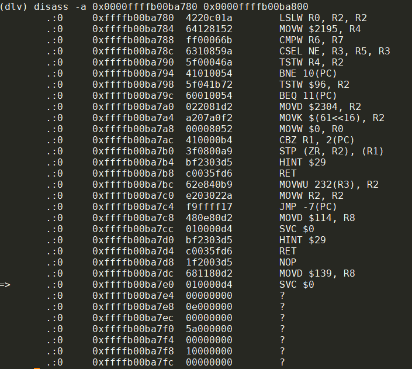
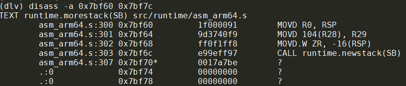

- [环境](#环境)
- [gvisor编译](#gvisor编译)
- [gvisor编译](#gvisor编译-1)
  - [go分支编译](#go分支编译)
  - [master分支编译](#master分支编译)
- [gvisor调试](#gvisor调试)
  - [配置文件](#配置文件)
  - [运行](#运行)
    - [kvm模式运行非常缓慢](#kvm模式运行非常缓慢)
  - [调试](#调试)
    - [调试前准备](#调试前准备)
    - [dlv调试](#dlv调试)
    - [signal返回到哪了?](#signal返回到哪了)
    - [sighandler做桥, host和guest跳转过程](#sighandler做桥-host和guest跳转过程)
      - [一次blupill流程](#一次blupill流程)
    - [另外一次blupill流程](#另外一次blupill流程)
      - [问题](#问题)
    - [断点记录:](#断点记录)
    - [问题1](#问题1)
      - [以上修改不管用](#以上修改不管用)
    - [bluepillGuestExit跳转到哪里了?](#bluepillguestexit跳转到哪里了)

本文在raspberry pi 4上调试gvisor的kvm模式, 目的是理解gvisor的kvm运行机制.

# 环境
|环境|说明
|--|--
|硬件| raspberry pi 4B
|OS| ubuntu server 21.10 for arm64
|kernel| Linux ubuntu 5.13.0-1022-raspi #24-Ubuntu SMP PREEMPT Wed Mar 16 07:19:33 UTC 2022 aarch64 aarch64 aarch64 GNU/Linux

# gvisor编译
|gvisor信息|说明
|--|--
|版本|https://github.com/google/gvisor.git
|分支|master
|编译|make copy TARGETS=runsc DESTINATION=bin/

# gvisor编译
## go分支编译
gvisor有两个分支:
* master分支, 用bazel编译
* go分支, 用go build编译

使用go分支可以编译, 但无法正常运行, 提示类似`/proc/self/exe: no such file or directory`的错误. 调查发现gvisor需要在当前进程下把uid和guid都设置成nobody, 然后执行`/proc/self/exe`再次启动自身.
但这一步出错:
* 当前进程下存在`/proc/self/exe`, 它是个软连接, 指向正确的runsc的路径
* 代码在`runsc/cmd/cmd.go`的`callSelfAsNobody()`函数
* 在这个函数里, 虽然能够找到`/proc/self/exe`, 但执行会报错. 具体原因不明, 我加了点调试代码, 发现这个slef exe可以执行, 但报错提示`/dev/null`不存在.
```go
func  callSelfAsNobody(args []string) error {
    ...
    binPath := "/proc/self/exe"
    dest, _ := os.Readlink(binPath)
    output, err := exec.Command(dest, "-h").CombinedOutput()
    log.Infof("error: %v", errr) //这里提示/dev/null不存在
}
```
* gvisor的启动顺序是`runsc create`再`runsc gofer`再`runsc boot`再`runsc start`再`runsc delete`. 我怀疑是在`runsc create`阶段对这个namespace的创建不完整

## master分支编译
master分支可以编译, 可以"正常"运行. 但在raspberry上编译极其慢, 我大概等了两三个小时.

# gvisor调试
下面是以master分支编译出来的runsc来进行调试
## 配置文件
使用runsc需要在docker里配置runtime, 如下:
```json
ubuntu@ubuntu ~
$ cat /etc/docker/daemon.json
{
    "runtimes": {
        "runsc": {
            "path": "/home/ubuntu/repo/bbb/gvisor/bin/runsc",
            "runtimeArgs": [
                "--cpu-num-from-quota",
                "--platform=kvm",
                "--debug-log=/tmp/runsc/",
                "--debug"
            ]
        }
    }
}
```
更改配置文件需要
`sudo systemctl reload docker`

## 运行
用docker运行centos, 需要指定`--runtime=runsc`, `--cpus=1 -m 2g`指定了cpu和mem的限制:  
`docker run --cpus=1 -m 2g --rm --runtime=runsc -it --name=test centos:7 bash`

### kvm模式运行非常缓慢
正常docker run命令应该很快返回, 但kvm模式下观察到CPU占用非常高, 多核100%运行, docker run命令迟迟不返回.

## 调试
### 调试前准备
除了需要大概了解gvisor的代码和执行流程外, 在调试前, 需要
* 找到runsc boot进程的pid
我这里显示`runsc-sandbox boot`进程的pid是4989
* 反汇编runsc
`go tool objdump -S runsc > runsc.objdump`

### dlv调试
```go
$ sudo /home/ubuntu/go/bin/dlv attach 4989
(dlv) b *0x951d5c
(dlv) c
(dlv) bt
0  0x0000000000951d5c in gvisor.dev/gvisor/pkg/ring0.(*CPU).SwitchToUser
1  0x000000000095a02c in gvisor.dev/gvisor/pkg/sentry/platform/kvm.(*vCPU).SwitchToUser
2  0x000000000095564c in gvisor.dev/gvisor/pkg/sentry/platform/kvm.(*context).Switch
3  0x00000000005420c8 in gvisor.dev/gvisor/pkg/sentry/kernel.(*runApp).execute
4  0x000000000054152c in gvisor.dev/gvisor/pkg/sentry/kernel.(*Task).run
5  0x000000000007e154 in runtime.goexit

(dlv) si
Stopped at: 0x951fa0
```
注:0x951d5c是调用ring0.kernelExitToEl0函数的地方, 在`gvisor.dev/gvisor/pkg/ring0.(*CPU).SwitchToUser`里:  
`0x951d5c      94000091        CALL gvisor.dev/gvisor/pkg/ring0.kernelExitToEl0(SB)`

而0x951fa0就是kernelExitToEl0的代码:  
  
```go
0x951fa0      d538d092        MRS $18052, R18 //其实是MRS TPIDR_EL1, R18
```
这个TPIDR_EL1是thread id寄存器, 只能在EL1访问; 但这里是EL0, 于是发生指令异常:  
在dlv里si并没有执行`0x951fa4      a90e0640        STP (R0, R1), 224(R18)`这句代码而是跳转到了0x95c700就能看出来:  
  

指令异常被host kernel deliver到触发异常的线程(即当前线程), 交由提前注册的sighandler在用户态处理.  
0x95c700是SIGILL的处理函数:  
  

这个sighandler是kvm实现里非常关键的函数, 它负责执行依次KVM_RUN.

`_, _, errno := unix.RawSyscall(unix.SYS_IOCTL, uintptr(c.fd), _KVM_RUN, 0)`

我们一路向下单步执行, 来到了这个函数的返回点:
```go
(dlv) si
Stopped at: 0x95c730 
=>   1: no source available
(dlv) si
Stopped at: 0x95c734 //这句正好是kvm.sighandler的RET指令
=>   1: no source available
```
0x95c734处的指令是kvm.sighandler的RET指令, 继续向下, 我们来到了一个很奇怪的地址:
```go
(dlv) si
Stopped at: 0xffffb00ba7dc
=>   1: no source available
(dlv) si
Stopped at: 0xffffb00ba7e0
=>   1: no source available
```
这里的0xffff开头的地址, 比普通的代码段地址高很多, objdump里还查不到相应的地址...  
那看看dlv的反汇编指令:
```go
(dlv) disass -a 0x0000ffffb00ba780 0x0000ffffb00ba800
```
  

这个svc指令是arm64的系统调用指令, 系统调用号放在r8里:  
  
x8的0x8b就是代码里的`$139`, 这个调用是:
[rt_sigreturn](https://gvisor.dev/docs/user_guide/compatibility/linux/arm64/)
rt_sigreturn系统调用是signal处理机制的trampoline的一部分, 当用户态的sighandler返回的时候, 实际上返回的是signal的trampoline的代码, 后者再调用系统调用rt_sigreturn()让内核帮助恢复用户态上下文, 再返回到用户态被signal打断的代码.  
我们这里的sigill是同步异常, 那么一般情况下就应该还是这个指令; 但我们这里**实际上不是**
因为ucontext改变了, 见下文:

### signal返回到哪了?
调用kvm.sighandler时, 代表被打断的上下文的ucontext被放到R2中:
```go
// sighandler: see bluepill.go for documentation.
//
// The arguments are the following:
//
//     R0 - The signal number.
//     R1 - Pointer to siginfo_t structure.
//     R2 - Pointer to ucontext structure.
//
TEXT ·sighandler(SB),NOSPLIT,$0
    // si_signo should be sigill.
    MOVD    SIGINFO_SIGNO(R1), R7
    CMPW    $4, R7
    BNE    fallback

    MOVD    CONTEXT_PC(R2), R7
    CMPW    $0, R7
    BEQ    fallback

    MOVD    R2, 8(RSP)
    BL    ·bluepillHandler(SB)   // Call the handler.

    RET
```
这里的`0x95c700`就是`kvm.sighandler(SB)`  
  
这里的R2(就是X2)为0x4000460e20  
这实际上是个指向`arch.UContext64`的指针:

  
dlv显示`Pc: 95c6d8`, 这正好是触发SIGILL的指令地址.

直到调用`kvm.bluepillHandler(SB)`之前, 这个PC都是`95c6d8`

注意看这里的`Regs[30]`为`95a004`, 我们知道r30是LR寄存器, `95a004`就是调用完kvm.bluepill后的地址
  

### sighandler做桥, host和guest跳转过程

#### 一次blupill流程
```go
0x95c6c0 kvm.bluepill
0x95c6d8 MRS TPIDR_EL1, R10     //触发sigill
0x95c700 kvm.sighandler         // with Pc: 95c6d8, 也就是前面的指令
    0x954f10 kvm.bluepillHandler()
    0x954e20 bluepillGuestExit  // with Pc: 95c6d8
        ret with Pc: 951d5c
0x95c734 ret                    // with Pc: 951d5c
0xffffb00ba7dc
0xffffb00ba7e0 svc              // rt_sigreturn

0x951d5c CALL kernelExitToEl0() // 单步执行就到了这里, 因为前面ucontext的pc就是951d5c
0x951fa0                        // in kernelExitToEl0() 第一个指令就是特权指令
0x95c700 kvm.sighandler         // with Pc: 951fa0, 也就是前面的指令
    0x954f10 kvm.bluepillHandler()
    0x954e20 bluepillGuestExit  // with Pc: 951fa0
        ret with Pc: 7f41c
0x95c734 ret                    // with Pc: 7f41c
0xffffb00ba7dc
0xffffb00ba7e0 svc              // rt_sigreturn

0x7f41c svc指令                 // in runtime.futex(SB) src/runtime/sys_linux_arm64.s
0x432e8 runtime.futexsleep()

0x95c6c0 kvm.bluepill           // 再次进入bluepill
...
```

本次实验常用地址索引:
```go
0x951d5c CALL gvisor.dev/gvisor/pkg/ring0.kernelExitToEl0(SB)

0x951fa0 ring0.kernelExitToEl0

0x95c6c0 kvm.bluepill(SB)

0x95c700 kvm.sighandler(SB)
0x95c728 CALL gvisor.dev/gvisor/pkg/sentry/platform/kvm.bluepillHandler(SB)
0x95c734 RET
```

如果只打断点0x95c734, 得到跳转地址如下:
```go
0x7f41c svc in runtime.futex(SB)
0x9272c svc in syscall.Syscall(SB)
0x95c6d8 MRS in kvm.bluepill
0x7f41c svc in runtime.futex(SB)
0x7f41c
0x7f41c
```
过程中观察到有多个context:
```go
p %x *(*arch.UContext64)(0x4000460e20)
p %x *(*arch.UContext64)(0x4000188e20)
p %x *(*arch.UContext64)(0x400014ce20)
p %x *(*arch.UContext64)(0x4000008e20)
p %x *(*arch.UContext64)(0x400006ce20)
```

### 另外一次blupill流程
这次是打了bluepillGuestExit断点, continue等待断点时间较长, 从host观察到CPU一直在VM状态下, 持续高负载运行, 现象是htop显示黄色(CPU stolen), 直到trigger断点  
此时观察到ucontext的PC是0x95c6d8, 就是blupill触发sigill的指令地址:
  

#### 问题
如果断点打在`ring0.(*CPU).SwitchToUser()`, 会导致bluepillGuestExit里, 误认为VM退出时候的PC是`ring0.(*CPU).SwitchToUser()`, 导致继续运行不正确.

### 断点记录:
```go
b ring0.(*CPU).SwitchToUser
b *0x95c700 //sigill handler入口
b *0x95c734 //sigill handler返回前
b *0x95c6c0 //bluepill入口
b kvm.bluepillHandler
b kvm.bluepillGuestExit
b ring0.(*CPU).SwitchToUser
```

### 问题1
每一轮的进入guest模式是从bluepill开始的, 但每轮要在guest态执行很久, CPU100%很久, 才能退出guest状态, 此时看到guest里面的调用栈非常非常深:
`0x7f41c svc in runtime.futex(SB)`这里的调用栈显示有太多的runtime.morestack的栈帧.  
  
这里只显示50层, 但实际上bt命令支持depth参数, 即使加到10000层也显示不完...

0x7bf70地址实际上是`runtime·morestack(SB)`的最后一条指令, 理论上执行不到:
```go
@src/runtime/asm_arm64.s
TEXT runtime·morestack(SB),NOSPLIT|NOFRAME,$0-0
    ...
    BL    runtime·newstack(SB)
    
    // Not reached, but make sure the return PC from the call to newstack
    // is still in this function, and not the beginning of the next.
    UNDEF
```

怀疑和BL地址有关, 把bl改为jmp指令试试
```go
//也可以这样显示
(dlv) p %x *(*uint32)(0x7bf6c)

//改为0x17ff9ee8
set *(*uint32)(0x7bf6c) = 0x17ff9ee9
```

即修改前:  
  
修改后:
  

可以看到, call指令换成了jmp指令后, 每轮的bluepill还是会执行很久, 但调用栈似乎已经正常:
  
  
  

有的时候即使调用栈不深也要执行很久  
  

#### 以上修改不管用
还是会出现很多`0x000000000007bf5c in runtime.morestack`  
那么guest在干什么导致CPU占用这么高呢?

用`sudo perf kvm --guest --guestvmlinux path/to/runsc top`可以看vm的符号  
观察到:  
  
对应的代码:
  
pmap显示:
```
sudo pmap 7556
...
000000fee2e31000 273806262272K -----   [ anon ]
0000ffff62e31000      4K rw-s- memfd:memory-usage (deleted)
0000ffff62e32000  38212K rw---   [ anon ]
0000ffff65383000    512K -----   [ anon ]
0000ffff65403000      4K rw---   [ anon ]
0000ffff65404000 523836K -----   [ anon ]
0000ffff85393000      4K rw---   [ anon ]
0000ffff85394000  65476K -----   [ anon ]
0000ffff89385000      4K rw---   [ anon ]
0000ffff89386000   8180K -----   [ anon ]
0000ffff89b83000      4K rw---   [ anon ]
0000ffff89b84000   1020K -----   [ anon ]
0000ffff89c83000    384K rw---   [ anon ]
0000ffff89ce3000      8K r----   [ anon ]

0000ffff89ce5000      4K r-x--   [ anon ]

0000ffffe2bc3000    132K rw---   [ stack ]
 total     273808069472K
```
总共273T, 其中大部分都在一个段里.


### bluepillGuestExit跳转到哪里了?
比如:
在0x95c734, sigill handler马上要返回了, 此时ucontext的PC已经变成了927ac, 经过signal的trampoline系统调用后, kernel恢复了从927ac开始执行的上下文:  
  
这是个`fdnotifier.epollWait`在执行的syscall系统调用, 是guest task执行的, 因为这个上下文是依次KVM_RUN后, 从guest VCPU里得到的.
说明guest vCPU在遇到svc指令的时候, 会退出guest mode:  
  
退出后, host继续运行0x927ac处的代码(即svc指令). 这样host就"代表"guest来向host kernel发出了syscall动作.

比如:  
  
0x9272c处的指令是syscall.Syscall的svc指令

比如:  
  
0x7f41c是tuntime.futex的svc指令

比如:
  

比如:
  