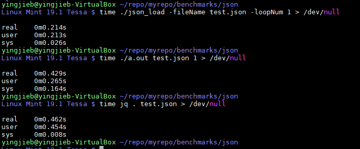
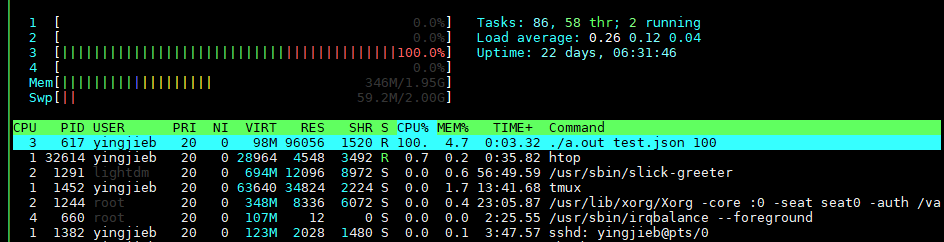
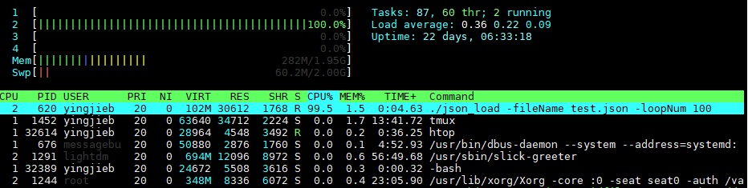

- [json性能之 C vs Go](#json性能之-c-vs-go)
  - [代码如下:](#代码如下)
  - [编译和运行](#编译和运行)
    - [C](#c)
    - [Go](#go)
    - [编译后大小](#编译后大小)
    - [测试用的json文件](#测试用的json文件)
  - [jq](#jq)
    - [x86](#x86)
    - [mips](#mips)
  - [性能结果分析](#性能结果分析)
  - [补充mips测试结果](#补充mips测试结果)
- [go工具链test代码](#go工具链test代码)
  - [encoding/json](#encodingjson)
  - [encoding/json benchmarking模式](#encodingjson-benchmarking模式)
    - [强制单核模式](#强制单核模式)
    - [json benchmarking流程](#json-benchmarking流程)
  - [test2json运行](#test2json运行)
  - [test2json_test代码](#test2json_test代码)
  - [test2json](#test2json)
    - [返回interface类型](#返回interface类型)
- [github golang example](#github-golang-example)
  - [reverse.go](#reversego)
  - [reverse test](#reverse-test)

# json性能之 C vs Go
思路: 对一个给定的xxxx.json文件, 调用相应的API把json文件load并解析到内部表达, 再调用相应API把内部表达转换回json文件, 输出到控制台. 测试时传入循环次数, 统计消耗时间.
Reborn平台上, 用的是C语言实现的libjansson库, 使用`json_load_file()`load并解析json文件, 使用`json_dumpfd()`反解析并输出到文件.
对Go来说, toolchain自带json解析库, 用`json.Unmarshal()`来解析json, 用`json.Marshal()`来做反解析.

## 代码如下:
C语言版本(使用libjansson库):  
  

Go语言版本:  
  

## 编译和运行
在x86环境下
### C
```shell
#先安装libjansson库
#x86 ubuntu
apt install libjansson-dev
#mips gentoo
taskset -c 1,2,3 emerge -av dev-libs/jansson
#编译, 生成a.out
gcc -O2 json_load.c -ljansson

#运行
time ./a.out test.json 100 > /dev/null
```
### Go
```shell
#编译
go build json_load.go
#运行, 默认多进程
time ./json_load -fileName test.json -loopNum 100 > /dev/null
#强制单核
taskset -c 1 time ./json_load -fileName test.json -loopNum 100 > /dev/null
#gentoo上time不是独立的程序
taskset -c 1 sh -c "time ./json_load -fileName test.json -loopNum 100 > /dev/null"
```

### 编译后大小
  

### 测试用的json文件
1. example.json  
  

2. test.json  
1.9M, 190万个字符, 复杂嵌套  
  


## jq
### x86
  
### mips
  

## 性能结果分析
1. C语言json解析运行时  
  

2. Go语言json解析运行时, 默认多核运行. 注意: 测试代码和运行时命令都并没有显式开启多线程, 多线程是json库函数的行为.  
纠正: 多线程是go runtime的行为. 详见goroutine解析  
  

3. Go语言json解析运行时, 强制单核  
  

4. 结果. 运行多次比较稳定:  
  

  

* ~~Go toolchain自带的json解析器默认是多进程解析~~
纠正: 是go runtime起的多线程, go的json解析只是一个goroutine, 被go的runtime调度器调度. 本质上还是单进程.
* libjansson是单进程解析. 
* C语言版本有大量内核态操作, 估计是load文件操作, 用户态只有一半多一点时间在真正干活.
* Go语言load文件优化的很好, 强制单进程时, 用户态进程占比99%, 说明所有时间都在做json解析和反解析.
* 即使除去内核态读文件的差异, Go的json库也比libjansson快一些.
* 此性能对比无法做到绝对公平, C语言也有更快的json库, Go也可以继续优化; 但从实际使用角度出发, 此对比还是很有参考意义.

## 补充mips测试结果
  

  


# go工具链test代码
## encoding/json
```shell
go tool dist test -list | grep -i json
cd ~/repo/gorepo/go/src/encoding/json
go test -c -o jsontest
#help
./jsontest -h
#多进程运行
time ./jsontest
#单核运行
time taskset -c 1 ./jsontest
#所有测试项:
./jsontest -test.list .*
...很多, Test开头的是功能测试, Benchmark开头的是性能测试
```
* encoding/json是多个test的集合:  
  
  
  

## encoding/json benchmarking模式
go test命令族实现了benchmarking的测试, 详见`go help test` 和 `go doc testing`
看起来是要加`-bench`来使能benchmarking模式
对上面的已经编译好的`./jsontest`来说, `./jsontest -h`说要加`./jsontest -test.bench .*`
默认是多进程模式  
  

### 强制单核模式
`taskset -c 1 ./jsontest -test.bench .*`  
  

### json benchmarking流程
  
code.json是个复杂的, 多层嵌套的json, 1.9M大小.  
  

测试代码测试code.json到in-memory 结构体的各种操作:
Marshal Unmarshal Encode Decode等待

```go
type codeResponse struct {
    //指针

    Tree *codeNode `json:"tree"`
    Username string `json:"username"`
}

type codeNode struct {
    Name string `json:"name"`
    //数组, 嵌套的codeNode指针

    Kids []*codeNode `json:"kids"`
    CLWeight float64 `json:"cl_weight"`
    Touches int `json:"touches"`
    MinT int64 `json:"min_t"`
    MaxT int64 `json:"max_t"`
    MeanT int64 `json:"mean_t"`
}

var codeJSON []byte
var codeStruct codeResponse

func codeInit() {
    //os Open

    f, err := os.Open("testdata/code.json.gz")
    if err != nil {
        panic(err)
    }
    //defer是先进后出, 也就是说, 离开这个函数的时候, 最后才调用f.Close()

    defer f.Close()
    gz, err := gzip.NewReader(f)
    if err != nil {
        panic(err)
    }
    //data是文件内容

    data, err := ioutil.ReadAll(gz)
    if err != nil {
        panic(err)
    }
    //赋值会深拷贝吗? -- 好像是的 -- 后记: 应该不拷贝
    //data是切片, codeJSON也是切片; codeJSON和data同时指向底层文件的数据. 相当于两个指针都指向底层的真正数据
    //func ReadAll(r io.Reader) ([]byte, error); 真正的数据保存在这个函数里申请的内存中; 

    codeJSON = data

    //先Unmarshal, 即转为结构体

    if err := Unmarshal(codeJSON, &codeStruct); err != nil {
        panic("unmarshal code.json: " + err.Error())
    }

    //在把codeStruct Marshal到data;

    //这么看data变了, 但codeJSON 不变 -- 后记: data只是相当于指针, 指针变了而已

    if data, err = Marshal(&codeStruct); err != nil {
        panic("marshal code.json: " + err.Error())
    }

    //字节比较

    if !bytes.Equal(data, codeJSON) {
        println("different lengths", len(data), len(codeJSON))
        for i := 0; i < len(data) && i < len(codeJSON); i++ {
            if data[i] != codeJSON[i] {
                println("re-marshal: changed at byte", i)
                println("orig: ", string(codeJSON[i-10:i+10]))
                println("new: ", string(data[i-10:i+10]))
                break
            }
        }
        panic("re-marshal code.json: different result")
    }
}
```


## test2json运行
* 在`go/src/cmd/internal/test2json`下面运行`go test`
* 或者 还是在这个目录下, 编译出可执行文件再运行`go test -c -o test2json`
* 这是个多进程程序, 用strace的-f命令可以看出来: `strace -f -o log ./test2json`
* 用taskset -c 1执行, 可强制单核跑: `taskset -c 1 ./test2json`
* 列出所有测试项: `./test2json -test.list .*` `TestGolden TestTrimUTF8`  
  

test2json特性:

* 用户态占比接近100%
* 操作包括
    * 文件open, read  
  
    * json和go结构体互相转换, 调用标准json库
    * 字符串解析和操作
    * 结构体深度比较, 使用go的反射机制

## test2json_test代码
测试的思路是: 先调用test2json的converter方法, 把xxx.test转为json, 和已经保存好的正确的xxx.json比对, 一致则测试通过.
如何证明一致:
* 用`json.Unmarshal()`把have和want的json都转为结构体`event `
* 用反射包里提供的`reflect.DeepEqual`来深度比较两个结构体.

```go
func TestGolden(t *testing.T) {
    //func Glob(pattern string) (matches []string, err error)

    //读*.test文件列表

    files, err := filepath.Glob("testdata/*.test")
    if err != nil {

        t.Fatal(err)

    }

    //对每个文件

    for _, file := range files {

        name := strings.TrimSuffix(filepath.Base(file), ".test")

        //用testing的Run方法, 注册每个xxx.test 的sub run

        //用test2json的converter去把test里面的字段, 转换为json

        //和保存好的对应的xxx.json文件比对, 一致则测试成功.

        t.Run(name, func(t *testing.T) {......})
    }
}
```
* t.Run是subtest, 由其parent test控制, 可多进程执行.
`func (t *T) Run(name string, f func(t *T)) bool`
> Run runs f as a subtest of t called name. It runs f in a separate goroutine and blocks until f returns or calls t.Parallel to become a parallel test. Run reports whether f succeeded (or at least did not fail before calling t.Parallel).
Run may be called simultaneously from multiple goroutines, but all such calls must return before the outer test function for t returns.

## test2json
```
go tool dist test -list
go tool dist test -rebuild -run test2json
```

这个程序的思路是: 根据xxx.test文件, 填event结构体; 用`json.Marshal()`把结构体转为json, 保存到文件xxx.json

```go
//`json:",omitempty"`是反射字段, 给encoding/json包看的, json.Marshal()会用到
// event is the JSON struct we emit.
type event struct {
 Time *time.Time `json:",omitempty"`
 Action string
 Package string `json:",omitempty"`
}
```

### 返回interface类型
```go
// io.WriteCloser是个interface类型
type WriteCloser interface {
    Writer
    Closer
}
// 而Writer又是个interface, 包装了Write方法
type Writer interface {
    Write(p []byte) (n int, err error)
}
// 同理是Closer
type Closer interface {
        Close() error
}

// converter实现了Write方法和Close方法
func (c *converter) Write(b []byte) (int, error) {
    c.input.write(b)
    return len(b), nil
}

//这里new(converter)返回指针, converter实现了io.WriteCloser的方法, 符合io.WriteCloser的interface要求
//之所以要先new一个converter, 而不是直接返回&converter, 是因为在给*c赋值的时候, 要用到c.writeOutputEvent; 这是个先又new的c对象, 在给*c赋值的特殊场景;实际上, 是对*c包含的一个结构体赋值.
//如果没有上面的特殊场景, 直接返回converter的实例就行. 比如c= converter{....} return &c
//把converter当作io.WriteCloser返回
func NewConverter(w io.Writer, pkg string, mode Mode) io.WriteCloser {
    c := new(converter)
    *c = converter{
        w: w,
        pkg: pkg,
        mode: mode,
        start: time.Now(),
        input: lineBuffer{
            b: make([]byte, 0, inBuffer),
            line: c.handleInputLine,
            part: c.output.write,
        },
        output: lineBuffer{
            b: make([]byte, 0, outBuffer),
            line: c.writeOutputEvent,
            part: c.writeOutputEvent,
        },
    }
    return c
}
```
# github golang example
## reverse.go
https://github.com/golang/example/blob/master/stringutil/reverse.go

```go
// Package stringutil contains utility functions for working with strings.
package stringutil

// Reverse returns its argument string reversed rune-wise left to right.
func Reverse(s string) string {
    //rune是int32的别名; 这里是把s转换为int32的数组
    r := []rune(s)
    for i, j := 0, len(r)-1; i < len(r)/2; i, j = i+1, j-1 {
        r[i], r[j] = r[j], r[i]
    }
    return string(r)
}
```

## reverse test
https://github.com/golang/example/blob/master/stringutil/reverse_test.go

```go
//package和reverse.go相同, 同一个文件夹下面的惯例都是同一个package
//package不是main, 所以这个是个lib
package stringutil


import "testing"
//T是个struct: type T struct{ ... }
func TestReverse(t *testing.T) {
    //range遍历, 返回index和value
    for _, c := range []struct {
        //in和want写一行, 都是string类型
        in, want string
    }{
        {"Hello, world", "dlrow ,olleH"},
        {"Hello, 世界", "界世 ,olleH"},
        {"", ""},
    } {
        got := Reverse(c.in)
        if got != c.want {
            t.Errorf("Reverse(%q) == %q, want %q", c.in, got, c.want)
        }
    }
}
```
