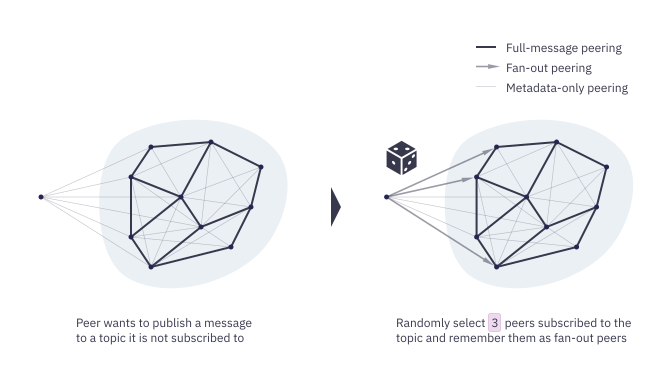
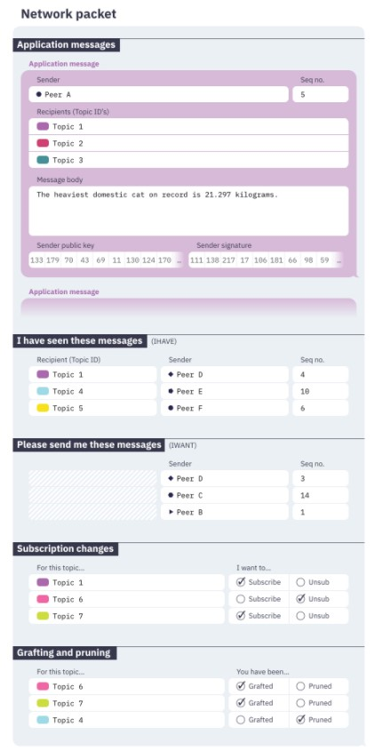
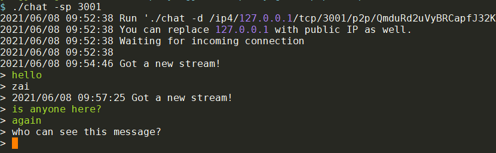
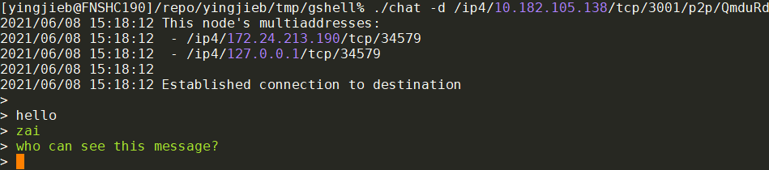
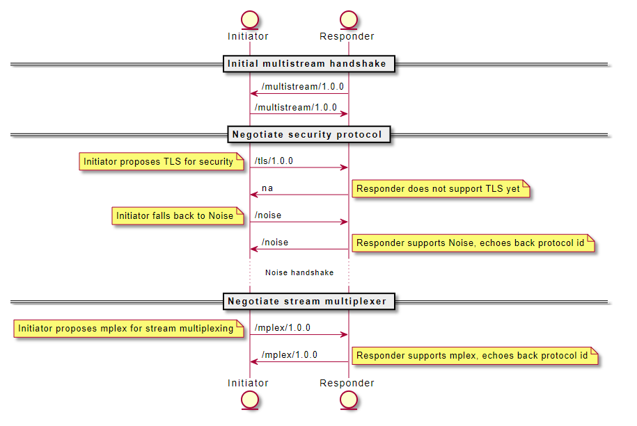
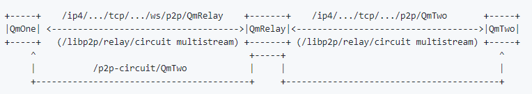
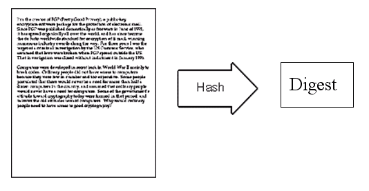
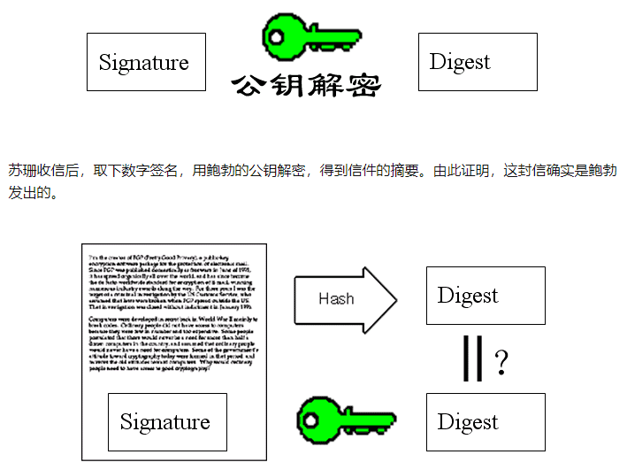
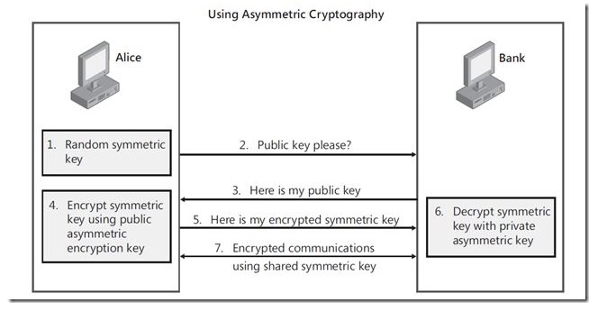

- [libp2p文档](#libp2p文档)
  - [入门](#入门)
  - [transport](#transport)
    - [QUIC](#quic)
      - [特性](#特性)
      - [libp2p里的quic](#libp2p里的quic)
    - [地址格式](#地址格式)
    - [同时支持多transport](#同时支持多transport)
  - [Nat穿透](#nat穿透)
  - [circuit relay](#circuit-relay)
  - [协议和stream](#协议和stream)
    - [内置协议](#内置协议)
  - [peer ID](#peer-id)
  - [内容路由和peer发现](#内容路由和peer发现)
  - [安全](#安全)
  - [发布和订阅](#发布和订阅)
    - [发现peer](#发现peer)
    - [full message和meta message](#full-message和meta-message)
  - [多路复用](#多路复用)
  - [知识点](#知识点)
- [go的开发状态](#go的开发状态)
  - [transport](#transport-1)
  - [Stream muxers](#stream-muxers)
  - [Crypto channels](#crypto-channels)
  - [Connection & Connection Upgrades](#connection--connection-upgrades)
  - [Peer routing](#peer-routing)
  - [NAT Traversal](#nat-traversal)
  - [Discovery](#discovery)
  - [其他](#其他)
- [例子](#例子)
  - [echo](#echo)
    - [makeBasicHost](#makebasichost)
    - [runListener](#runlistener)
    - [runSender](#runsender)
    - [总结](#总结)
  - [host](#host)
  - [routed echo](#routed-echo)
    - [总结](#总结-1)
  - [chat](#chat)
    - [使用](#使用)
    - [既然要IP, 那后面那一大串p2p的地址是干啥的?](#既然要ip-那后面那一大串p2p的地址是干啥的)
    - [代码](#代码)
  - [chat mdns](#chat-mdns)
    - [使用](#使用-1)
    - [代码](#代码-1)
  - [chat with peer发现, 基于dht](#chat-with-peer发现-基于dht)
    - [用到的package](#用到的package)
    - [代码](#代码-2)
    - [总结](#总结-2)
  - [pub sub chat room](#pub-sub-chat-room)
    - [代码](#代码-3)
  - [relay](#relay)
    - [代码](#代码-4)
  - [multipro](#multipro)
    - [代码](#代码-5)
    - [总结](#总结-3)
  - [总结的总结](#总结的总结)
  - [扩展](#扩展)
- [host的option](#host的option)
  - [默认值](#默认值)
- [规范](#规范)
  - [如何建立连接](#如何建立连接)
    - [协议协商](#协议协商)
    - [连接升级](#连接升级)
    - [新建stream](#新建stream)
    - [具体实现](#具体实现)
    - [隧道](#隧道)
      - [relay](#relay-1)
        - [Addressing](#addressing)
      - [STUN-like](#stun-like)
      - [Coordination](#coordination)
      - [节点发现机制](#节点发现机制)
      - [几种场景](#几种场景)
      - [问答](#问答)
    - [将来work](#将来work)
  - [Peer Ids and Keys](#peer-ids-and-keys)
    - [key的使用场景](#key的使用场景)
  - [identify协议](#identify协议)
  - [mplex协议](#mplex协议)
  - [Rendezvous集结协议](#rendezvous集结协议)
  - [大概原理](#大概原理)
  - [Protocols汇总](#protocols汇总)
- [基础知识](#基础知识)
  - [公钥与私钥](#公钥与私钥)
    - [讨论](#讨论)
  - [**对称加密（Symmetric Cryptography）**](#对称加密symmetric-cryptography)
  - [**非对称加密（Asymmetric Cryptography）**](#非对称加密asymmetric-cryptography)
  - [**总结**](#总结-4)

# libp2p文档
https://docs.libp2p.io/introduction/
libp2p是个开发p2p应用的框架.
libp2p起源于IPFS, 以模块化的方式把基础的p2p网络分离为独立的libp2p.
那么libp2p有哪些功能? 解决了哪些通用问题?
* Transport: transport是p2p网络的基础, 负责peer间的实际数据的发送/接收. 为了支持现有的和将来的协议, libp2p定义了一组统一的interface
* Identity: 身份标识是安全和可靠网络的保证. libp2p用非对称加密的公钥做为peer的标识(PeerId), 这个PeerId就是每个peer的全球唯一名字; 因为p2p的"open"本质, PeerId既是名字又是公钥, 其他任何peer都可以通过PeerId得到其公钥. 这样在peer之间的通信是安全的.
* Security: libp2p支持TLS1.3(就是ssh用的那个, 前身是ssl)和Noise协议在transport上面加密传输数据.
* Peer Routing: 知道了PeerId, 还要知道网络上怎么访问到它. 经常我们只知道PeerId不知道网络位置, 这就需要peer路由. libp2p用DHT(distributed hash table, 通常每个node都预分配key空间, 所有的node组成一个大的hash表)来查询peer routing, DHT也可以提供其他metadata的key value的查询服务. go支持[Kademlia](https://en.wikipedia.org/wiki/Kademlia)的DHT算法(UDP based, O(log(n))的搜索效率)
* Content Discovery: 有时候我们不关心对方peer在哪, 只关心我要的内容能不能被其他peer提供. libp2p提供了内容发现的接口, 底层基于同样的Kademlia的DHT技术.
* Messaging / PubSub: peer发送消息给其他peer是p2p网络的核心, 其中pub/sub模式最为实用.libp2p定义了pub/sub的接口, 用于在给定topic下面发送消息给所有的peer. 目前支持简单粗暴的floodsub和比较高端的gossipsub. 后者的升级版本episub正在开发中.

## 入门
listen的地址是0号端口, 自动分配. 这里关闭了内置的ping(还有内置的ping?)
```go
func main() {
    ...

    // start a libp2p node that listens on a random local TCP port,
    // but without running the built-in ping protocol
    node, err := libp2p.New(ctx,
        libp2p.ListenAddrStrings("/ip4/127.0.0.1/tcp/0"),
        libp2p.Ping(false),
    )
    // configure our own ping protocol
    pingService := &ping.PingService{Host: node}
    node.SetStreamHandler(ping.ID, pingService.PingHandler)
    ...
}
```

## transport
最常见的transport是TCP, 另外也提到了QUIC(Quick UDP Internet Connections, google发布的基于UDP的协议), 其目标是替代TCP
libp2p的设计初衷是transport透明化, 由开发者决定使用哪种transport, 或者同时支持多种transport.

### QUIC
QUIC 与现有 TCP + TLS + HTTP/2 方案相比，有以下几点主要特征：
1）利用缓存，显著减少连接建立时间；
2）改善拥塞控制，拥塞控制从内核空间到用户空间；
3）没有 head of line 阻塞的多路复用；
4）前向纠错，减少重传；
5）连接平滑迁移，网络状态的变更不会影响连接断线。

  

#### 特性
* 采用 **多路复用** 思想，一个连接可以同时承载多个 **流** ( _stream_ )，同时发起多个请求。 请求间完全 **独立** ，某个请求阻塞甚至报文出错均不影响其他请求。
对比 _HTTP_ 长连接，由于 _TCP_ 是只实现一个字节流，如果请求阻塞，新请求无法发起。
* 新的安全机制比 TLS 性能更好，而且具有各种攻击防御策略。
* 前向纠错
TCP 采用 重传 机制，而 QUIC 采用 纠错 机制。
TCP 发生丢包时，需要一个等待延时判断发生了丢包，然后再启动重传机制，这个过程会造成一定的阻塞，影响传输时间。
而 QUIC 则采用一种更主动的方案，有点类似 RAID5 ，每 n 个包额外发一个 校验和包 。 如果这 n 个包中丢* * 应用程序内实现
_QUIC_ 直接基于客户端(应用进程)实现，而非基于内核，可以快速迭代更新，不需要操作系统层面的改造，部署灵活。 这也是不使用基于迭代升级 _TCP_ 方案的原因 —— _TCP_ 在操作系统内核中实现，很难进行大规模调整以及推广。
* 连接保持
_QUIC_ 在客户端保存连接标识，当客户端 _IP_ 或者端口发生变化时，可以快速恢复连接 —— 客户端以标识请求服务端，服务端验证标识后感知客户端新地址端口并重新关联，继续通讯。 这对于改善移动端应用连接体验意义重大(从 _WiFi_ 切换到流量)。

#### libp2p里的quic
go-libp2p-quic-transport uses [quic-go](https://github.com/lucas-clemente/quic-go/) to provide QUIC support for libp2p.

### 地址格式
libp2p使用一种叫multiaddr的东西来描述地址, 这个描述兼容所有的transport类型.  
比如
```
/ip4/7.7.7.7/tcp/6543
```
libp2p的通信单元叫peer, 用peerId来唯一标识; 必须指定peerId来建立安全信道来通信.
```
/ip4/1.2.3.4/tcp/4321/p2p/QmcEPrat8ShnCph8WjkREzt5CPXF2RwhYxYBALDcLC1iV6
```

### 同时支持多transport
一般libp2p是支持多transport, 比如一个服务可以同时对使用TCP的一个守护进程和使用websocket的浏览器服务.
能实现对多transport的多路复用, 是因为libp2p有个switch层(也叫swarm层), 提供了
* 协议协商: 当客户端dialing一个新的stream的时候, 它会发送protocol id来和服务端协商, 如果服务端也支持该协议, 就会返回这个协议ID, 之后的通信会使用这个协商好的协议来进行. 如果不支持, 返回不支持, 那么客户端要么停止, 要么发起另外一个protocol ID来进行下一轮协商. -- 想法: encoding也要协商
* stream多路复用: 就是使用一个物理的transport(比如一个TCP连接)来支持多个逻辑上的stream的通信. 一个stream有个很短的header来标记stream. libp2p使用mplex multiplexing实现, 同时也提供了yamux和spdy实现.
    * mplex: 每次通信都会加个header, payload是固定长度的data segment. header是个base128的变长数, 最长9字节. mplex基于可靠的, 保序的传输层协议比如TCP或UDS. 这个应该是默认的.
    ```
    | header  | length  | data           |
    | uvarint | uvarint | 'length' bytes |
    ```
    * [Yamux](https://github.com/hashicorp/yamux): 另外一种multiplexing, 支持双向stream, 支持流控, 同时支持大量stream消耗比较小.
    * spdy: chrome浏览器项目, 面向web协议的
* 建立安全连接

## Nat穿透
代码在[go-libp2p-nat](https://github.com/libp2p/go-libp2p-nat)

* 有的路由器支持UPnP或nat-pmp协议, libp2p会尝试自动配置端口映射.
* STUN打洞: 内网能dial出去, 是因为内网路由器会map这个内部端口到对外可见的端口. 有的路由会把incoming的到这个端口的连接也转发给内网. 
    * libp2pyong `SO_REUSEPORT`选项复用这个IP的端口号
    * 内网出去方向的连接会在内网路由器分配一个对外的端口号, 这个端口号外部可见, 但内部是不知道的. 那么可以让外部的peer告诉我们我们的外部地址是什么, 然后我们就可以告诉p2p网络, 这个地址可以到达我们.
    * 那么谁来当这个外部的观察者呢?传统的STUN实现需要固定的外部观察者, 而libp2p使用了identify protocol在peer间交换信息:`https://github.com/libp2p/specs/tree/master/identify`, 基本上是个`/ipfs/id/1.0.0`这个协议ID, 交换的信息如下, 其中就有observedAddr
    ```
    message Identify {
      optional string protocolVersion = 5;
      optional string agentVersion = 6;
      optional bytes publicKey = 1;
      repeated bytes listenAddrs = 2;
      optional bytes observedAddr = 4;
      repeated string protocols = 3;
    }
    ```
    * AutoNAT服务: 在identify告知我们的外部观察port后, 还可以让它peer回拨我们的port, 这需要使能AutoNAT服务, 让对方回拨. 回拨成功就知道这个端口可以允许穿透内网.
    * Circuit Relay (TURN): 有时候内网就是出不去, 这个协议可以先在内网找个跳板节点再访问. 比如内网的QmAlice想让QmBob访问, 她可以找个relay的节点:`/ip4/7.7.7.7/tcp/55555/p2p/QmRelay/p2p-circuit/p2p/QmAlice`告知QmBob, 这样QmBob就可以通过这个relay的节点访问QmAlice了.
    
## circuit relay
打开了autorelay的话, libp2p会使用内容路由的接口, 自动发现提供relay服务的peer. 当autoNAT服务发现我们在受限的NAT网络里面后, autorelay就起作用了
1.  discovering relay nodes around the world,
2.  establishing long-lived connections to them, and
3.  advertising relay-enabled addresses for ourselves to our peers, thus making ourselves routable through delegated routing.

When [AutoNAT service](https://docs.libp2p.io/concepts/nat/#autonat) detects we’re behind a NAT that blocks inbound connections, Autorelay jumps into action, and the following happens:

1.  We locate candidate relays by running a DHT provider search for the `/libp2p/relay` namespace.
2.  We select three results at random, and establish a long-lived connection to them (`/libp2p/circuit/relay/0.1.0` protocol). Support for using latency as a selection heuristic will be added soon.
3.  We enhance our local address list with our newly acquired relay-enabled multiaddrs, with format: `/ip4/1.2.3.4/tcp/4001/p2p/QmRelay/p2p-circuit`, where: `1.2.3.4` is the relay’s public IP address, `4001` is the libp2p port, and `QmRelay` is the peer ID of the relay. Elements in the multiaddr can change based on the actual transports at use.
4.  We announce our new relay-enabled addresses to the peers we’re already connected to via the `IdentifyPush` protocol.

The last step is crucial, as it enables peers to learn our updated addresses, and in turn return them when another peer looks us up.

## 协议和stream
* 这里说的协议是应用定义的协议, 协议id是任意字符串, 但按惯例是类似这样的:
`/my-app/amazing-protocol/1.0.1`
* 两端在协议对接的时候, 有个协商过程. 协议id使用全匹配方式
* 每个协议都可以set一个handler. 
* 也可以set一个match handler, 自己进行协议匹配. 可以注册多个协议匹配handler, 当一个协议没有确切的handler的时候, 会逐个调用匹配handler来匹配. 可以使用[`MultistreamSemverMatcher`](https://github.com/libp2p/go-libp2p-core/blob/master/helpers/match.go)来匹配版本号
* dial的时候要传入协议id, 可以是多个, 通常是一个协议的多个版本.
* stream可以是半关闭的, 即以把写关了, 只保留读.
* stream地下的switch层是加密的, 但stream看到的是解密后的数据

### 内置协议
内置协议都使用protobuf编码
* `/ipfs/ping/1.0.0`: 一个peer来ping, 另外一个响应. 记录lattency
* `/ipfs/id/1.0.0`: 交换peerId的协议, 告知对方自己的信息. 特别的, identify协议的响应消息里有`observedAddr`, 用于告知对方它的外部观测的地址.
* `/ipfs/id/push/1.0.0`: 用于通知别人自己的网络有变化
* `/secio/1.0.0`: secure IO. 用于加密通信. 因为peerId实际上是从公钥得出的, 所以可以验证签名是否正确. 这样就不需有像TLS中`Certificate Authority`的过程. -- 注意, secio是默认的加密协议, 但以后的默认加密协议是TLS1.3
* `/ipfs/kad/1.0.0`: dht协议
* `/libp2p/circuit/relay/0.1.0`: realy协议

## peer ID
* 每个peer都有自己知道的私钥, 并把公钥公开到p2p网络中, 公钥的hash就是peer ID. 所以
    * 连接上的peer都知道每个人的公钥
* peer ID其实不是字符串, 只是hash值用base58编码后, 字符串化了.
* peer info结构包括peerID和这个peer监听的multiaddr地址. 每个peer都有个"电话本", 记录它知道的peer info

## 内容路由和peer发现
待续

## 安全
libp2p的底层通信是加密, 但只是在传输层. 一个p2p网络通常还需要某种"权限控制"策略, 来决定谁有权限去做什么. libp2p没有提供内置的"权限控制"功能.

## 发布和订阅
基于gossipsub协议的消息扩散策略.
*   **Reliability:** All messages get delivered to all peers subscribed to the topic.
*   **Speed:** Messages are delivered quickly.
*   **Efficiency:** The network is not flooded with excess copies of messages.
*   **Resilience:** Peers can join and leave the network without disrupting it. There is no central point of failure.
*   **Scale:** Topics can have enormous numbers of subscribers and handle a large throughput of messages.
*   **Simplicity:** The system is simple to understand and implement. Each peer only needs to remember a small amount of state.

### 发现peer
这里的发现指发现同一个topic的peer, 如果gossipsub已经基于一个建立好的p2p网络, 怎么知道谁订阅了某个topic呢?
应用需要自己发现peer, 用下面的方法:
*   Distributed hash tables
*   Local network broadcasts
*   Exchanging peer lists with existing peers
*   Centralized trackers or rendezvous points
*   Lists of bootstrap peers

### full message和meta message
  
比如上图中, 有连接的节点都是一个topic下面的, 但只有粗实线的连接被用来传递"gossip". 上图配置成3个peer来做粗线, 通常配置成6, 一般在4-12之间.
meta data的连接用来维护gossip网络
* 粗线和细线可以互相转换: https://docs.libp2p.io/concepts/publish-subscribe/#grafting-and-pruning
* subscribe和unsubscribe信息交换: 每个peer都和它相连的peer交换各自的topic订阅信息.
* 发送消息: 消息会被粗线连接扩散.  
  
* 谣言八卦: 每秒钟, 细线连接间都互相八卦说我看到了什么gossip. 目的是补充实线网络中的遗漏, 如果一个peer发现它得到的八卦总是少点, 它就需要和别人多增加实线连接.  
  
* 不需要订阅就可以发送某个topic下面的消息: 随机选择6个连接来发送  
  
* 信息聚合: 不同类型的信息可以聚合在一起, 用一个报文发送  
  

## 多路复用
多路复用的目的是使用一个底层transport来服务多个stream.
这个switch(aka swarm)是在第一次建立transport连接的时候协商的. libp2p提供:
* mplex:libp2p自己写的, 比较简单
* yamux: 复杂点, 支持一些高级特性比如流控
* quic: 基于UDP的用户态TCP. 它实际上是一个transport, 但有native multiplexing能力. libp2p会在支持quic协议的节点直接使用这个能力.
* spdy: 目标是http2.0
* muxado: 可能比较小众...

## 知识点
https://docs.libp2p.io/reference/glossary/
* Circuit Relay: 在两个不能直接连接的节点之间, 通过第三个willing node来连接. 比如两个不同内网的节点通过共同的外网节点relay; 或者一个说tcp, 一个说websocket的节点, 通过第三个说双语的节点来talk.
* DHT: 分布式的hash表. peer routing和content routing依赖DHT. 可以用来做内容发现和服务广播.
* Multihash: 用来产生peerID和其他libp2p系统内的hash值的.multihash在原hash基础上加了两个字节的头.这两个字节表示了hash算法和长度. 比如用base58编码后的`QmYyQSo1c1Ym7orWxLYvCrM2EmxFTANf8wXmmE7DWjhx5N`, `Qm`就是加的两个字节, 表示SHA-256, 256bit长度.

# go的开发状态
https://libp2p.io/implementations
## transport
libp2p-tcp libp2p-quic libp2p-websockets 支持比较好
## Stream muxers
libp2p-multiplex libp2p-yamux 已ready
## Crypto channels
libp2p-secio libp2p-tls libp2p-noise
## Connection & Connection Upgrades
libp2p-conn
## Peer routing
libp2p-kad-dht
## NAT Traversal
libp2p-nat还在开发中, 不稳定
## Discovery
bootstrap random-walk mdns-discovery都OK
## 其他
libp2p-floodsub libp2p-gossipsub crypto libp2p-ping libp2p-peer-info libp2p-peer-book libp2p-swarm都OK.

# 例子
## echo
运行两个echo实例, 一个是listener, 一个是sender
它们都是个basichost, 它是更底层的[go-libp2p swarms](https://godoc.org/github.com/libp2p/go-libp2p-swarm#Swarm)的封装. swarm处理更细节的流, 连接, 多协议多路复用等.
### makeBasicHost
```go
// makeBasicHost creates a LibP2P host with a random peer ID listening on the
// given multiaddress. It won't encrypt the connection if insecure is true.
func makeBasicHost(listenPort int, insecure bool, randseed int64) (host.Host, error) {
    var r io.Reader
    if randseed == 0 {
        r = rand.Reader
    } else {
        r = mrand.New(mrand.NewSource(randseed))
    }

    // Generate a key pair for this host. We will use it at least
    // to obtain a valid host ID.
    priv, _, err := crypto.GenerateKeyPairWithReader(crypto.RSA, 2048, r)
    if err != nil {
        return nil, err
    }

    opts := []libp2p.Option{
        libp2p.ListenAddrStrings(fmt.Sprintf("/ip4/127.0.0.1/tcp/%d", listenPort)),
        libp2p.Identity(priv),
        libp2p.DisableRelay(),
    }

    if insecure {
        opts = append(opts, libp2p.NoSecurity)
    }

    return libp2p.New(context.Background(), opts...)
}
```
* `crypto.GenerateKeyPairWithReader`: 先用RSA生成私钥, 私钥可以推导出公钥
* `libp2p.ListenAddrStrings`: 使用写死的地址: `/ip4/127.0.0.1/tcp/%d`
* `libp2p.Identity`: 使用上面的priv key生成PeerId
* `libp2p.DisableRelay()`: 禁止relay transport
* `libp2p.NoSecurity`: libp2p默认都是加密的, 初非用这个显式声明非加密
* `libp2p.New`: 新建libp2p node的核心接口, 支持很多配置选项, 如果没有显式的指定, 有合理的默认值:
    * 默认监听`/ip4/0.0.0.0/tcp/0` 和 `/ip6/::/tcp/0`
    * 默认使用TCP和websocket传输协议
    * 默认使用多路复用协议`yamux`和`mplux`, 多路复用协议会在peer间协商?
    * 默认加密, 使用noise协议或者TLS
    * 默认使用RSA 2048产生随机的PeerId
    * 默认用空的peerstore(用于peer routing)
    * 有个API `NewWithoutDefaults`没有任何default配置, 但不建议使用.
* Host是p2p网络的一个实体, 它既是server, 可以提供服务; 又是client, 可以发送请求. 所以叫host, 是二合一. host有一系列聚合的抽象:
```go
type Host interface {
    // ID returns the (local) peer.ID associated with this Host
    ID() peer.ID

    // Peerstore returns the Host's repository of Peer Addresses and Keys.
    Peerstore() peerstore.Peerstore

    // Returns the listen addresses of the Host
    Addrs() []ma.Multiaddr

    // Networks returns the Network interface of the Host
    Network() network.Network

    // Mux returns the Mux multiplexing incoming streams to protocol handlers
    Mux() protocol.Switch

    // Connect ensures there is a connection between this host and the peer with
    // given peer.ID. Connect will absorb the addresses in pi into its internal
    // peerstore. If there is not an active connection, Connect will issue a
    // h.Network.Dial, and block until a connection is open, or an error is
    // returned. // TODO: Relay + NAT.
    Connect(ctx context.Context, pi peer.AddrInfo) error

    // SetStreamHandler sets the protocol handler on the Host's Mux.
    // This is equivalent to:
    //   host.Mux().SetHandler(proto, handler)
    // (Threadsafe)
    SetStreamHandler(pid protocol.ID, handler network.StreamHandler)

    // SetStreamHandlerMatch sets the protocol handler on the Host's Mux
    // using a matching function for protocol selection.
    SetStreamHandlerMatch(protocol.ID, func(string) bool, network.StreamHandler)

    // RemoveStreamHandler removes a handler on the mux that was set by
    // SetStreamHandler
    RemoveStreamHandler(pid protocol.ID)

    // NewStream opens a new stream to given peer p, and writes a p2p/protocol
    // header with given ProtocolID. If there is no connection to p, attempts
    // to create one. If ProtocolID is "", writes no header.
    // (Threadsafe)
    NewStream(ctx context.Context, p peer.ID, pids ...protocol.ID) (network.Stream, error)

    // Close shuts down the host, its Network, and services.
    Close() error

    // ConnManager returns this hosts connection manager
    ConnManager() connmgr.ConnManager

    // EventBus returns the hosts eventbus
    EventBus() event.Bus
}
```

### runListener
```go
func runListener(ctx context.Context, ha host.Host, listenPort int, insecure bool) {
    fullAddr := getHostAddress(ha)
    log.Printf("I am %s\n", fullAddr)

    // Set a stream handler on host A. /echo/1.0.0 is
    // a user-defined protocol name.
    ha.SetStreamHandler("/echo/1.0.0", func(s network.Stream) {
        log.Println("listener received new stream")
        if err := doEcho(s); err != nil {
            log.Println(err)
            s.Reset()
        } else {
            s.Close()
        }
    })

    log.Println("listening for connections")

    if insecure {
        log.Printf("Now run \"./echo -l %d -d %s -insecure\" on a different terminal\n", listenPort+1, fullAddr)
    } else {
        log.Printf("Now run \"./echo -l %d -d %s\" on a different terminal\n", listenPort+1, fullAddr)
    }

    // Wait until canceled
    <-ctx.Done()
}
```
* `getHostAddress`: 使用mutliaddr的Encapsulate函数, 把peerId包装进network地址中:`I am /ip4/127.0.0.1/tcp/10000/p2p/QmW1Ze4AbEtWtTg5ibcnsLgUPJsZ3wh1VuGzhqHtrvAp2e`
* `SetStreamHandler(pid protocol.ID, handler network.StreamHandler)`: 给mux层设定一个handler. 第一个参数是个string, 描述协议的, 第二个参数handler的签名是`type StreamHandler func(Stream)`, 有点像OnConnect(), 同样的是会被框架传入Stream, 这是个在mux层之上的概念, 提供逻辑上的2个agent之间的双向通信, 是io reader和io writer, 它的下面是个multiplexer.
这里这个handler很简单, 就是doEcho. 因为`s network.Stream`是框架传入的, 能直接做io读写操做.
```go
// doEcho reads a line of data a stream and writes it back
func doEcho(s network.Stream) error {
    buf := bufio.NewReader(s)
    str, err := buf.ReadString('\n')
    if err != nil {
        return err
    }

    log.Printf("read: %s", str)
    _, err = s.Write([]byte(str))
    return err
}
```

### runSender
sender通过用于输入-d的地址, 比如`/ip4/127.0.0.1/tcp/10000/p2p/QmW1Ze4AbEtWtTg5ibcnsLgUPJsZ3wh1VuGzhqHtrvAp2e`来dial listener.
* 通过multiaddr的Decapsulate操做, 把targetPeerAddr提取出来:`/ip4/127.0.0.1/tcp/10000`
* 然后add到peerstore中:
`ha.Peerstore().AddAddr(peerid, targetAddr, peerstore.PermanentAddrTTL)`
* `s, err := ha.NewStream(context.Background(), peerid, "/echo/1.0.0")`: NewStream连listener, 使用相同的echo1.0.0协议.
* 然后直接调用`s.Write([]byte("Hello, world!\n"))`来发送.

### 总结
* listener和sender都是host, host是p2p网络的一个node
* host可以定制, 列表在https://pkg.go.dev/github.com/libp2p/go-libp2p
* listener指定stream的处理函数, 有新的stream连接的时候会调用.
* RSA等非对称算法生成的key是peerId
* multiaddr能够处理多地址协议, 统一地址的表达方式
* 空的peerstore不能"发现"peer, 所以本例的连接信息还是要用户输入.
* host.Newstream(ctx, peerId, ...protocolId)用于向指定peerId发起一个stream连接, protocolId是个`[]string`, 指定要走的用户(多个)协议, 比如`"/echo/1.0.0"`
* stream的抽象是io reader writer, 面向字节流的.
* sender类似client, client的逻辑是建立连接然后直接write

## host
之前的echo的例子只是用了简单的option. 我们在这个例子里会用一些常用的option, 使能了routing, 使nat网络也能发现.
```go
    // To construct a simple host with all the default settings, just use `New`
    h, err := libp2p.New(ctx)

    //h2是个定制的host
    h2, err := libp2p.New(ctx,
        // Use the keypair we generated, 使用自定义key
        libp2p.Identity(priv),
        // Multiple listen addresses, 指定多个listen地址
        libp2p.ListenAddrStrings(
            "/ip4/0.0.0.0/tcp/9000",      // regular tcp connections
            "/ip4/0.0.0.0/udp/9000/quic", // a UDP endpoint for the QUIC transport
        ),
        // support TLS connections
        libp2p.Security(libp2ptls.ID, libp2ptls.New),
        // support secio connections
        libp2p.Security(secio.ID, secio.New),
        // support QUIC - experimental
        libp2p.Transport(libp2pquic.NewTransport),
        // support any other default transports (TCP)
        libp2p.DefaultTransports, // DefaultTransports是tcp和websocket
        // Let's prevent our peer from having too many
        // connections by attaching a connection manager.
        libp2p.ConnectionManager(connmgr.NewConnManager(
            100,         // Lowwater
            400,         // HighWater,
            time.Minute, // GracePeriod
        )),
        // 下面这几个配置了NAT可达
        // Attempt to open ports using uPNP for NATed hosts.
        libp2p.NATPortMap(),
        // Let this host use the DHT to find other hosts
        libp2p.Routing(func(h host.Host) (routing.PeerRouting, error) {
            idht, err = dht.New(ctx, h)
            return idht, err
        }),
        // Let this host use relays and advertise itself on relays if
        // it finds it is behind NAT. Use libp2p.Relay(options...) to
        // enable active relays and more.
        libp2p.EnableAutoRelay(),
        // If you want to help other peers to figure out if they are behind
        // NATs, you can launch the server-side of AutoNAT too (AutoRelay
        // already runs the client)
        //
        // This service is highly rate-limited and should not cause any
        // performance issues.
        libp2p.EnableNATService(),
    )
```
配置好了host, 为了让这个host高可达, 还要连接预配置的bootstrap nodes.
```go
        // This connects to public bootstrappers
        for _, addr := range dht.DefaultBootstrapPeers {
            pi, _ := peer.AddrInfoFromP2pAddr(addr)
            // We ignore errors as some bootstrap peers may be down
            // and that is fine.
            h2.Connect(ctx, *pi)
        }
```

## routed echo
在简单echo和host的基础上, routed echo配置一个host使用DHT,连接bootstrap节点, 使其能够被peer发现.
其他peer可以只根据peerId来访问它.

* `makeRoutedHost`函数首先生成私钥, 然后配置options如下, 此时它还是个basic host
```go
    opts := []libp2p.Option{
        libp2p.ListenAddrStrings(fmt.Sprintf("/ip4/0.0.0.0/tcp/%d", listenPort)),
        libp2p.Identity(priv),
        libp2p.DefaultTransports,
        libp2p.DefaultMuxers,
        libp2p.DefaultSecurity,
        libp2p.NATPortMap(),
    }
    ctx := context.Background()

    basicHost, err := libp2p.New(ctx, opts...)
```
* 然后新建datastroe
```go
    // Construct a datastore (needed by the DHT). This is just a simple, in-memory thread-safe datastore.
    dstore := dsync.MutexWrap(ds.NewMapDatastore())

    // Make the DHT
    dht := dht.NewDHT(ctx, basicHost, dstore)

    // Make the routed host -- 这步就是把basic host包装成routed host
    // 可以看出, routed host需要basic host和dht
    routedHost := rhost.Wrap(basicHost, dht) //这里的rhost就是go-libp2p/p2p/host/routed

    // connect to the chosen ipfs nodes
    // for每个bootstrap peer, 调用host.Connect
    // 奇怪的是在connect之前就把每个bootstrap peer的地址加到自己的peerstore中了: ph.Peerstore().AddAddrs(p.ID, p.Addrs, peerstore.PermanentAddrTTL)
    // -- 不奇怪, 要先知道地址信息, 再connect. 因为connect只需要peer ID
    err = bootstrapConnect(ctx, routedHost, bootstrapPeers)

    // Bootstrap the host
    err = dht.Bootstrap(ctx)
```
* bootstrap peer如何确定的?
可以是全局写死的, 比如:
```go
    IPFS_PEERS = convertPeers([]string{
        "/ip4/104.131.131.82/tcp/4001/p2p/QmaCpDMGvV2BGHeYERUEnRQAwe3N8SzbUtfsmvsqQLuvuJ",
        "/ip4/104.236.179.241/tcp/4001/p2p/QmSoLPppuBtQSGwKDZT2M73ULpjvfd3aZ6ha4oFGL1KrGM",
        "/ip4/128.199.219.111/tcp/4001/p2p/QmSoLSafTMBsPKadTEgaXctDQVcqN88CNLHXMkTNwMKPnu",
        "/ip4/104.236.76.40/tcp/4001/p2p/QmSoLV4Bbm51jM9C4gDYZQ9Cy3U6aXMJDAbzgu2fzaDs64",
        "/ip4/178.62.158.247/tcp/4001/p2p/QmSoLer265NRgSp2LA3dPaeykiS1J6DifTC88f5uVQKNAd",
    })
```
或者从本地http server获取
```go
LOCAL_PEER_ENDPOINT = "http://localhost:5001/api/v0/id"
resp, err := http.Get(LOCAL_PEER_ENDPOINT)
```

### 总结
* client和server都连接了bootstrap节点, 都有dht
* 用到的包:
    * go-libp2p basichost 基本的host, 没有peer发现的能力
    * go-libp2p-kad-dht peer ID查找
    * go-libp2p/p2p/host/routed 包装上述两个对象成为routed host
* routed host创建后, 就可以调用`NewStream`打开一个双向的stream了, 这个stream就可以read write了.
* host也可以调用`SetStreamHandle`来listen incoming的连接.

## chat
一个简单的聊天应用. 假设
A在内网, B在外网(有公网IP)
或者A和B都在局域网
### 使用
在138机器上开启A:  
  
根据提示, 把127的地址改成大网IP. 在190服务器上连接A. 190服务器的这个chat叫做B.  
  
我又在138的docker环境里开了C, 同样连接A
* A能看到B和C发的消息
* A的回复只能B看到
* C不会收到回复
* 必须显式指定ip才能连上
所以chat只是两个人的chat, 第一次连上的两个.

### 既然要IP, 那后面那一大串p2p的地址是干啥的?
答: 校验用的. 如果填错p2p地址, 比如B错填了A的地址, 会报错, 不让连接  
  

### 代码
* 打印颜色
```go
            // Green console colour:     \x1b[32m
            // Reset console colour:     \x1b[0m
            fmt.Printf("\x1b[32m%s\x1b[0m> ", str)
```
* 如果初始随机值一样, 得出的key每次都一样的:
```go
    if *debug {
        // Use the port number as the randomness source.
        // This will always generate the same host ID on multiple executions, if the same port number is used.
        // Never do this in production code.
        r = mrand.New(mrand.NewSource(int64(*sourcePort)))
    } else {
        r = rand.Reader
    }
```
* 全0的地址会listen所有的网络接口
```go
// 0.0.0.0 will listen on any interface device.
sourceMultiAddr, _ := multiaddr.NewMultiaddr(fmt.Sprintf("/ip4/0.0.0.0/tcp/%d", port))
```
* "服务端"要`SetStreamHandler`
* 可以让系统自动分配端口
```go
    // Let's get the actual TCP port from our listen multiaddr, in case we're using 0 (default; random available port).
    var port string
    for _, la := range h.Network().ListenAddresses() {
        if p, err := la.ValueForProtocol(multiaddr.P_TCP); err == nil {
            port = p
            break
        }
    }

    if port == "" {
        log.Println("was not able to find actual local port")
        return
    }
```
* "客户端"不仅要建立自己的host, 还要connect"服务端". 要先从-d选项的字符串里提取地址信息
```go
    // Turn the destination into a multiaddr.
    maddr, err := multiaddr.NewMultiaddr(destination)
    if err != nil {
        log.Println(err)
        return nil, err
    }

    // Extract the peer ID from the multiaddr.
    info, err := peer.AddrInfoFromP2pAddr(maddr)
    if err != nil {
        log.Println(err)
        return nil, err
    }
```
* 先在peerstore里面add对端的地址, 然后就可以发起连接了.
```go
    // Add the destination's peer multiaddress in the peerstore.
    // This will be used during connection and stream creation by libp2p.
    h.Peerstore().AddAddrs(info.ID, info.Addrs, peerstore.PermanentAddrTTL)
    
    // Start a stream with the destination.
    // Multiaddress of the destination peer is fetched from the peerstore using 'peerId'.
    s, err := h.NewStream(context.Background(), info.ID, "/chat/1.0.0")
```
* 使用bufio可以把阻塞的io读写变成非阻塞的:
```go
    // Start a stream with the destination.
    // Multiaddress of the destination peer is fetched from the peerstore using 'peerId'.
    s, err := h.NewStream(context.Background(), info.ID, "/chat/1.0.0")
    
    // Create a buffered stream so that read and writes are non blocking.
    rw := bufio.NewReadWriter(bufio.NewReader(s), bufio.NewWriter(s))
```

## chat mdns
使能里mdns发现的chat. 其他的和chat一样
### 使用
```
./chat-with-mdns -port 6666
./chat-with-mdns -port 6668
```

### 代码
* 先New一个基本的host, 这个和普通的chat一样; SetStreamHandler也一样
```go
    // 0.0.0.0 will listen on any interface device.
    sourceMultiAddr, _ := multiaddr.NewMultiaddr(fmt.Sprintf("/ip4/%s/tcp/%d", cfg.listenHost, cfg.listenPort))

    // libp2p.New constructs a new libp2p Host.
    // Other options can be added here.
    host, err := libp2p.New(
        ctx,
        libp2p.ListenAddrs(sourceMultiAddr),
        libp2p.Identity(prvKey),
    )
    
    // Set a function as stream handler.
    // This function is called when a peer initiates a connection and starts a stream with this peer.
    host.SetStreamHandler(protocol.ID(cfg.ProtocolID), handleStream)
```
* 使能mDNS, 等待并连接peer.
```go
    peerChan := initMDNS(ctx, host, cfg.RendezvousString)

    peer := <-peerChan // will block untill we discover a peer
    err := host.Connect(ctx, peer)
    // open a stream, this stream will be handled by handleStream other end
    stream, err := host.NewStream(ctx, peer.ID, protocol.ID(cfg.ProtocolID))
```
* `go-libp2p/p2p/discovery`提供了mDNS发现功能. 这个discovery包目前只有mdns发现方式.
discoveryNotifee是被通知的一方. mdns发现新的peer, 就会发送到PeerChan, 这样就接上前面的从peerChan读peer信息, 再connect, 再NewStream的操做了.
```go
//Initialize the MDNS service
func initMDNS(ctx context.Context, peerhost host.Host, rendezvous string) chan peer.AddrInfo {
    // An hour might be a long long period in practical applications. But this is fine for us
    ser, err := discovery.NewMdnsService(ctx, peerhost, time.Hour, rendezvous)

    //register with service so that we get notified about peer discovery
    n := &discoveryNotifee{}
    n.PeerChan = make(chan peer.AddrInfo)

    ser.RegisterNotifee(n)
    return n.PeerChan
}
```
* "github.com/whyrusleeping/mdns"是底层提供mdns的包, mdns的query返回ServiceEntry
```go
// ServiceEntry is returned after we query for a service
type ServiceEntry struct {
    Name       string
    Host       string
    AddrV4     net.IP
    AddrV6     net.IP
    Port       int
    Info       string // peerID就是用这个field来传递的.
    InfoFields []string

    Addr net.IP // @Deprecated

    hasTXT bool
}
```
`p2p/discovery/mdns.go`的`NewMdnsService`函数中, 起了个`mdns.NewMDNSService()`, 自己的ID就会被当作Info传进去
```go
    info := []string{myid}
    if serviceTag == "" {
        serviceTag = ServiceTag
    }
    service, err := mdns.NewMDNSService(myid, serviceTag, "", "", port, ipaddrs, info)
```

## chat with peer发现, 基于dht
### 用到的package
```go
    "github.com/libp2p/go-libp2p"
    "github.com/libp2p/go-libp2p-core/network"
    "github.com/libp2p/go-libp2p-core/peer"
    "github.com/libp2p/go-libp2p-core/protocol"
    "github.com/libp2p/go-libp2p-discovery"

    dht "github.com/libp2p/go-libp2p-kad-dht"
    multiaddr "github.com/multiformats/go-multiaddr"
```
### 代码
* 还是先New一个host
```go
    // libp2p.New constructs a new libp2p Host. Other options can be added
    // here.
    host, err := libp2p.New(ctx,
        libp2p.ListenAddrs([]multiaddr.Multiaddr(config.ListenAddresses)...),
    )
    // Set a function as stream handler. This function is called when a peer
    // initiates a connection and starts a stream with this peer.
    host.SetStreamHandler(protocol.ID(config.ProtocolID), handleStream)
```
* 后面这里厉害了, 注意看注释: New了一个dht还不够, 还需要Bootstrap, 这样每个node都有个dht的拷贝, 即使初始节点down了也不影响后续的peer发现. Bootstrap这个函数会每5分钟后台刷新这个dht
```go
    // Start a DHT, for use in peer discovery. We can't just make a new DHT
    // client because we want each peer to maintain its own local copy of the
    // DHT, so that the bootstrapping node of the DHT can go down without
    // inhibiting future peer discovery.
    kademliaDHT, err := dht.New(ctx, host)
    
    // Bootstrap the DHT. In the default configuration, this spawns a Background
    // thread that will refresh the peer table every five minutes.
    err = kademliaDHT.Bootstrap(ctx)
```
* 接下来就要连接bootstrap节点了
```go
for _, peerAddr := range config.BootstrapPeers {
    peerinfo, _ := peer.AddrInfoFromP2pAddr(peerAddr)
    go func() {
        host.Connect(ctx, *peerinfo)
    }
}
```
* 接下来要声明"meet me here"服务, 然后通过FindPeer功能找到"同类"  
discovery这块在`go-libp2p-discovery/routing.go`
```go
    // We use a rendezvous point "meet me here" to announce our location.
    // This is like telling your friends to meet you at the Eiffel Tower.
    logger.Info("Announcing ourselves...")
    routingDiscovery := discovery.NewRoutingDiscovery(kademliaDHT)
    discovery.Advertise(ctx, routingDiscovery, config.RendezvousString)
    logger.Debug("Successfully announced!")
    
    // Now, look for others who have announced
    // This is like your friend telling you the location to meet you.
    logger.Debug("Searching for other peers...")
    peerChan, err := routingDiscovery.FindPeers(ctx, config.RendezvousString)
```

* RoutingDiscovery是个子类, 继承了go-libp2p-core/routing的ContentRouting  
ContentRouting是对内容的routing, 那么内容由一个hash值标识(Cid)
```go
// RoutingDiscovery is an implementation of discovery using ContentRouting.
// Namespaces are translated to Cids using the SHA256 hash.
type RoutingDiscovery struct {
    routing.ContentRouting
}
```
* ContentRouting在`go-libp2p-core/routing/routing.go`
```go
// ContentRouting is a value provider layer of indirection. It is used to find
// information about who has what content.
//
// Content is identified by CID (content identifier), which encodes a hash
// of the identified content in a future-proof manner.
type ContentRouting interface {
    // Provide adds the given cid to the content routing system. If 'true' is
    // passed, it also announces it, otherwise it is just kept in the local
    // accounting of which objects are being provided.
    Provide(context.Context, cid.Cid, bool) error

    // Search for peers who are able to provide a given key
    //
    // When count is 0, this method will return an unbounded number of
    // results.
    FindProvidersAsync(context.Context, cid.Cid, int) <-chan peer.AddrInfo
}
```
* 得到了peerChan, 那么最后就range这个peerChan, 对每个peer都Newstream一把.

### 总结
和上个chat不同的是, 这里使用dht来发现peer. 上一个是用mdns协议在局域网发现.

## pub sub chat room
  
### 代码
* 还是首先建立一个基本的host, 使用系统分配的端口
```go
    ctx := context.Background()

    // create a new libp2p Host that listens on a random TCP port
    h, err := libp2p.New(ctx, libp2p.ListenAddrStrings("/ip4/0.0.0.0/tcp/0"))
```
* 用gossipsub协议建立一个pubsub服务
```go
    // create a new PubSub service using the GossipSub router
    ps, err := pubsub.NewGossipSub(ctx, h)
```
* 用到了`libp2p/go-libp2p-pubsub`包, 这个包重度使用了map, 有点复杂.
* gossip网络扩散"gossip", 但每个peer只扩散大约4个周边的peer. node对topic进行订阅, 发布者在某个topic上发布消息, 消息扩散到所有订阅了topic的node. 这个行为又叫overlay multicast. pubsub对象基于topic, 提供基础方法; 在此基础上提供了三个router: 暴力广播式的Floodsub, 随机选择下线peer的Randomsub, 基于gossip协议的Gossipsub
* 用topic的Publish APi来发送消息, 不用订阅topic就可以发送消息
* 用topic的Subscribe来订阅返回sub对象, sub对象的Next方法返回下一条消息.
* 消息是用protocol buf来封装的
* 配合官方pubsub说明来理解: https://docs.libp2p.io/concepts/publish-subscribe/
* 使用mdns协议内网发现, 默认1个小时更新一次列表
```go
    // setup local mDNS discovery
    err = setupDiscovery(ctx, h)
```
* 接下来就是加入聊天室开始ui
```
    // join the chat room
    cr, err := JoinChatRoom(ctx, ps, h.ID(), nick, room)
    // draw the UI
    ui := NewChatUI(cr)
    ui.Run()
```
* join的过程就是pubsub Join一个topic的过程, 底层是个Subscribe的过程.  
最后开始后台routine, 读这个topic.Next, 发送给ui  
注意虽然pubsub使用gpb编码的, 但里面的msg.Data是json编码的
```go
// join the pubsub topic
topic, err := ps.Join(topicName(roomName))
// and subscribe to it
sub, err := topic.Subscribe()
cr := &ChatRoom{
    ctx:      ctx,
    ps:       ps,
    topic:    topic,
    sub:      sub,
    self:     selfID,
    nick:     nickname,
    roomName: roomName,
    Messages: make(chan *ChatMessage, ChatRoomBufSize),
}

// start reading messages from the subscription in a loop
go cr.readLoop()
```
* ui负责打印收到的message.

## relay
### 代码
* h1显式使能了relay功能, 这里指使用realy功能的功能
```go
    // Tell the host use relays
    h1, err := libp2p.New(context.Background(), libp2p.EnableRelay())
```
* h2能给其他node提供relay功能
```go
    // Tell the host to relay connections for other peers (The ability to *use*
    // a relay vs the ability to *be* a relay)
    h2, err := libp2p.New(context.Background(), libp2p.EnableRelay(circuit.OptHop))
```
* h3清空了listen地址(默认是全部interface监听), 让h3只能通过上面的circuit relay来通信
```go
    // Zero out the listen addresses for the host, so it can only communicate
    // via p2p-circuit for our example
    h3, err := libp2p.New(context.Background(), libp2p.ListenAddrs(), libp2p.EnableRelay())
```
* 分别连接h1和h3到h2, 但h1和h3不直接连接
```go
    h2info := peer.AddrInfo{
        ID:    h2.ID(),
        Addrs: h2.Addrs(),
    }
    err := h1.Connect(context.Background(), h2info)
    err := h3.Connect(context.Background(), h2info)
```
* 测试h1到h3的连通性
```go
    // Now, to test things, let's set up a protocol handler on h3
    h3.SetStreamHandler("/cats", func(s network.Stream) {
        log.Println("Meow! It worked!")
        s.Close()
    })

    //下面这块演示了直接从h1连接到h3是不行的.
    _, err = h1.NewStream(context.Background(), h3.ID(), "/cats")
    if err == nil {
        log.Println("Didnt actually expect to get a stream here. What happened?")
        return
    }
    log.Printf("Okay, no connection from h1 to h3: %v", err)
    log.Println("Just as we suspected")
    
    // Creates a relay address to h3 using h2 as the relay
    relayaddr, err := ma.NewMultiaddr("/p2p/" + h2.ID().Pretty() + "/p2p-circuit/ipfs/" + h3.ID().Pretty())
    
    //先清理h3, 因为刚才连接失败了, 默认不让马上连
    // Since we just tried and failed to dial, the dialer system will, by default
    // prevent us from redialing again so quickly. Since we know what we're doing, we
    // can use this ugly hack (it's on our TODO list to make it a little cleaner)
    // to tell the dialer "no, its okay, let's try this again"
    h1.Network().(*swarm.Swarm).Backoff().Clear(h3.ID())
    
    //使用h3的relay地址连接
    h3relayInfo := peer.AddrInfo{
        ID:    h3.ID(),
        Addrs: []ma.Multiaddr{relayaddr},
    }
    //h1可以连接到h3了
    h1.Connect(context.Background(), h3relayInfo)
    s, err := h1.NewStream(context.Background(), h3.ID(), "/cats")
    s.Read(make([]byte, 1)) // block until the handler closes the stream
```

## multipro
创建两个host, 同时支持自定义的ping协议和echo协议. 每个自定的协议都是用protobuf来request和response
这样的好处是, 通过协议号先分流不同的行为, 而不是像一般的应用, 只有一个protobuf的结构体, 里面有大量的可选fields.
这个例子可以处理异步的response, 并匹配到其对应的request.
在message级别使用libp2p protocol multiplexing
### 代码

* Node是个多协议的组合体
```go
// Node type - a p2p host implementing one or more p2p protocols
type Node struct {
    host.Host     // lib-p2p host
    *PingProtocol // ping protocol impl
    *EchoProtocol // echo protocol impl
    // add other protocols here...
}
```
new一个Node就是new ping协议和echo协议
```go
// Create a new node with its implemented protocols
func NewNode(host host.Host, done chan bool) *Node {
    node := &Node{Host: host}
    node.PingProtocol = NewPingProtocol(node, done)
    node.EchoProtocol = NewEchoProtocol(node, done)
    return node
}
```
* ping协议有两级的protocol名
```go
// pattern: /protocol-name/request-or-response-message/version
const pingRequest = "/ping/pingreq/0.0.1"
const pingResponse = "/ping/pingresp/0.0.1"
```
* ping使用一个map来记录request和response的关系
```go
// PingProtocol type
type PingProtocol struct {
    node     *Node                       // local host
    requests map[string]*p2p.PingRequest // used to access request data from response handlers
    done     chan bool                   // only for demo purposes to stop main from terminating
}
```
* NewPingProtocol的时候要set两个handler, pingreq和pingresp分别一个.
另外, 这里还用到了高级技巧: 方法当作函数
```go
func NewPingProtocol(node *Node, done chan bool) *PingProtocol {
    p := &PingProtocol{node: node, requests: make(map[string]*p2p.PingRequest), done: done}
    node.SetStreamHandler(pingRequest, p.onPingRequest)
    node.SetStreamHandler(pingResponse, p.onPingResponse)
    return p
}
```
* pingreq的handler
```go
// remote peer requests handler
func (p *PingProtocol) onPingRequest(s network.Stream) {
    //大概流程是从s读request, 然后马上关闭s. 因为s只包括一次request
    //读到data先proto.Unmarshal到&p2p.PingRequest{}结构体
    data := &p2p.PingRequest{}
    buf, err := ioutil.ReadAll(s)
    s.Close()
    proto.Unmarshal(buf, data)
    //这部就关键了: 每个request都要验证签名
    valid := p.node.authenticateMessage(data, data.MessageData)
    //然后组一个response, 并签名
    resp := &p2p.PingResponse{MessageData: p.node.NewMessageData(data.MessageData.Id, false),
        Message: fmt.Sprintf("Ping response from %s", p.node.ID())}
    signature, err := p.node.signProtoMessage(resp)
    // add the signature to the message
    resp.MessageData.Sign = signature
    //最后发送这个response, 这个函数里面每次都会新建一个stream来发送. 对Lip2p来说, 因为用了多路复用, 一个stream好像没有那么重.
    p.node.sendProtoMessage(s.Conn().RemotePeer(), pingResponse, resp)
}
```
* pingrep的handler类似的, 逻辑很简单, 就是收到对方的response, 说明对方收到了我们的request, 并且回复了, 那我们就删除之前的reqeust map里面记录的id.
```go
    // locate request data and remove it if found
    _, ok := p.requests[data.MessageData.Id]
    if ok {
        // remove request from map as we have processed it here
        delete(p.requests, data.MessageData.Id)
    } else {
        log.Println("Failed to locate request data boject for response")
        return
    }
```
* echo协议也非常类似
* main流程如下: 
* 建立两个对等的host, 比较普通的那种
```go
    priv, _, _ := crypto.GenerateKeyPair(crypto.Secp256k1, 256)
    listen, _ := ma.NewMultiaddr(fmt.Sprintf("/ip4/127.0.0.1/tcp/%d", port))
    host, _ := libp2p.New(
        context.Background(),
        libp2p.ListenAddrs(listen),
        libp2p.Identity(priv),
    )
```
* 最后run
注意这里也是先Peerstore添加peer的信息, 但没有马上connect. 而是等到后面NewStream的时候再连接.
```go
    // connect peers
    h1.Peerstore().AddAddrs(h2.ID(), h2.Addrs(), peerstore.PermanentAddrTTL)
    h2.Peerstore().AddAddrs(h1.ID(), h1.Addrs(), peerstore.PermanentAddrTTL)

    // send messages using the protocols
    h1.Ping(h2.Host)
    h2.Ping(h1.Host)
    h1.Echo(h2.Host)
    h2.Echo(h1.Host)
```
### 总结
* 使用了host的SetStreamHandler()函数注册协议的handler, 这里使用了多个协议(ping和echo), 大协议里面还有小协议(req和rep). 可见一个host可以set多个协议的handler.

## 总结的总结
* host是个基础设施实体, 类似IP协议的地位, 上面可以运行不同的protocol(可以类比为端口号)
    * 比如`pubsub.NewGossipSub(ctx, h)`的入参是一个ctx和一个host. 并不是说"注册"一个gossipsub给这个host, 相反的, host只提供基础能力, gossipsub主动使用host的能力, 自主的维护基于这个host节点的gossip网络. 
    * 多个不同的"功能"可以在一个host节点上同时运行. 比如同时运行一个mdns服务
* SetStreamHandler是每个protocol一个, 这里的protocol不是指tcp啥的, 而是一个string, 比如`/chat/1.1.0`, 或者`/echo/1.0.0`
* 对应的, "client"在NewStream的时候, 也要传入一个protocol.ID

## 扩展
* host的底层是swarm(蜂巢), 新建一个swarm需要5个参数:
```go
swarm, err := NewSwarm(ctx, laddrs, pid, pstore, bwc)
ctx: ctx
laddrs: an array of multiaddrs that the swarm will open up listeners for
pid: peer id. 通常是RSA的key生成的ID
pstore: 存peer id用的
bwc: 统计用的.
```
* swarm是基于多路复用的. stream可以set handler
```go
swrm.SetStreamHandler(func(s inet.Stream) {
    defer s.Close()
    fmt.Println("Got a stream from: ", s.SwarmConn().RemotePeer())
    fmt.Fprintln(s, "Hello Friend!")
})
```
* 也可以直接连接NewStreamWithPeer
```go
s, err := swrm.NewStreamWithPeer(ctx, rpid)
defer s.Close()
io.Copy(os.Stdout, s) // pipe the stream to stdout
```
* 在swarm这一层, 没有protocol ID; 后者是host层加的.

# host的option
`libp2p.New`: 新建libp2p node的核心接口, 支持很多配置选项, 如果没有显式的指定, 有合理的默认值:
* 默认监听`/ip4/0.0.0.0/tcp/0` 和 `/ip6/::/tcp/0`
* 默认使用TCP和websocket传输协议
* 默认使用多路复用协议`yamux`和`mplux`, 多路复用协议会在peer间协商?
* 默认加密, 使用noise协议或者TLS
* 默认使用RSA 2048产生随机的PeerId
* 默认用空的peerstore(用于peer routing)
* 有个API `NewWithoutDefaults`没有任何default配置, 但不建议使用.

可选配置如下:
* ListenAddrStrings: 指定(多个)listen地址, 使用原始字符串表达
```go
libp2p.ListenAddrStrings("/ip4/0.0.0.0/tcp/0"))
libp2p.ListenAddrStrings(
            "/ip4/0.0.0.0/tcp/9000",      // regular tcp connections
            "/ip4/0.0.0.0/udp/9000/quic", // a UDP endpoint for the QUIC transport
        )
```
* ListenAddrs: 指定(多个)listen地址, 使用Multiaddr表达
```go
listen, _ := ma.NewMultiaddr(fmt.Sprintf("/ip4/127.0.0.1/tcp/%d", port))
libp2p.ListenAddrs(listen),
```
* Security: 配置transport加密
```go
// support TLS connections
libp2p.Security(libp2ptls.ID, libp2ptls.New),
// support secio connections
libp2p.Security(secio.ID, secio.New),
```
* NoSecurity: 不加密
* Muxer: 配置multiplexing
* Transport: 配置支持的transport
```go
// support QUIC - experimental
libp2p.Transport(libp2pquic.NewTransport),
libp2p.DefaultTransports,  // DefaultTransports是tcp和websocket
```
* Peerstore: 配置使用peerstore
* PrivateNetwork: 保护私有网络, 只有同样的私有网络标识才能连接
* BandwidthReporter: 配置带宽报告
* Identity: 配置key
```go
priv, _, err := crypto.GenerateKeyPairWithReader(crypto.RSA, 2048, r)
libp2p.Identity(priv),
```
* ConnectionManager: 配置连接管理
```go
libp2p.ConnectionManager(connmgr.NewConnManager(
            100,         // Lowwater
            400,         // HighWater,
            time.Minute, // GracePeriod
        )),
```
* AddrsFactory: 地址工厂
* EnableRelay: 传入OptHop会让这个host 广告自己可以是relay hop
```go
libp2p.EnableRelay(circuit.OptHop)
```
* DisableRelay: 禁用relay. 默认使能
* EnableAutoRelay: 使能relay服务(对别人提供relay功能)
```go
libp2p.EnableAutoRelay(),
```
* StaticRelays: 配置静态relay
* DefaultStaticRelays: 使用内置的代码写死的relay节点
```go
// These are the known PL-operated relays
var DefaultRelays = []string{
    "/ip4/147.75.80.110/tcp/4001/p2p/QmbFgm5zan8P6eWWmeyfncR5feYEMPbht5b1FW1C37aQ7y",
    "/ip4/147.75.195.153/tcp/4001/p2p/QmW9m57aiBDHAkKj9nmFSEn7ZqrcF1fZS4bipsTCHburei",
    "/ip4/147.75.70.221/tcp/4001/p2p/Qme8g49gm3q4Acp7xWBKg3nAa9fxZ1YmyDJdyGgoG6LsXh",
}
```
* ForceReachabilityPublic: 在autoNAT时, 强制让这个host相信自己public可达
* ForceReachabilityPrivate: 在autoNAT时, 强制让这个host相信自己在内部NAT网络
* EnableNATService: 使能nat观测服务. 尝试用新连接回连到peer, 并告知对端是否成功, 帮助对端判断自己是否外网可访问.
* AutoNATServiceRateLimit: 限制回连服务的次数
* ConnectionGater: 配置一个连接看护人来拒绝特定的inbound和outbound连接
* NATPortMap: 尝试使用路由器的UPnP功能来穿透NAT
* NATManager: 上面的api使用默认的nat manager, 这个api是自己配置一个.
* Ping: 使能ping服务. 默认使能
* Routing: 
```go
        // Let this host use the DHT to find other hosts
        libp2p.Routing(func(h host.Host) (routing.PeerRouting, error) {
            idht, err = dht.New(ctx, h)
            return idht, err
        }),
```
* NoListenAddrs: 配置这个node不listen
* UserAgent: user-agent sent
* MultiaddrResolver: dns resolver

## 默认值
这里提供默认值的目的是让用户扩展选项, 同时也有这些默认值
```go
var DefaultSecurity = ChainOptions(
    Security(noise.ID, noise.New),
    Security(tls.ID, tls.New),
)
var DefaultMuxers = ChainOptions(
    Muxer("/yamux/1.0.0", yamux.DefaultTransport),
    Muxer("/mplex/6.7.0", mplex.DefaultTransport),
)
var DefaultTransports = ChainOptions(
    Transport(tcp.NewTCPTransport),
    Transport(ws.New),
)
// DefaultPeerstore configures libp2p to use the default peerstore.
var DefaultPeerstore Option = func(cfg *Config) error {
    return cfg.Apply(Peerstore(pstoremem.NewPeerstore()))
}
// RandomIdentity generates a random identity. (default behaviour)
var RandomIdentity = func(cfg *Config) error {
    priv, _, err := crypto.GenerateKeyPairWithReader(crypto.RSA, 2048, rand.Reader)
    return cfg.Apply(Identity(priv))
}
// DefaultListenAddrs configures libp2p to use default listen address.
var DefaultListenAddrs = func(cfg *Config) error {
    defaultIP4ListenAddr, err := multiaddr.NewMultiaddr("/ip4/0.0.0.0/tcp/0")
    defaultIP6ListenAddr, err := multiaddr.NewMultiaddr("/ip6/::/tcp/0")
    return cfg.Apply(ListenAddrs(
        defaultIP4ListenAddr,
        defaultIP6ListenAddr,
    ))
}
// DefaultEnableRelay enables relay dialing and listening by default.
var DefaultEnableRelay = func(cfg *Config) error {
    return cfg.Apply(EnableRelay())
}

```

# 规范
在 https://github.com/libp2p/specs
## 如何建立连接
先是建立raw transport连接, 比如tcp连接. 这部分很标准.
在raw连接基础上, 规范描述了如何协商安全特性和多路复用等能力的过程, 包括了从最初的传输建立后, 到打开应用层的stream, 识别应用层的protocol ID, 根据ID找到合适的handler
有连个核心的特性:
* 安全: 最初的握手之后, 数据都是加密的, 用签名的方式
* stream是可靠的, 双向的, 通信channel, 是基于在底层transport多路复用的基础上的. stream必须支持反压, 支持半连接, 比如可以关了写, 但是可以读.
stream的好处是可以多个逻辑的流共享一个底层transport, 节约建立通道的开销.

有的transport协议比如QUIC, 本身就有内置的安全和多路复用. 其他的协议比如TCP, 就必须在原始的transport之上建立安全和多路复用. 对于这种本身没有安全和多路复用支持的情况, 就需要"连接升级"

### 协议协商
协议号是个字符串, 通常带版本号. 比如`/multistream/1.0.0`
multistream也叫multistream-select, 使用utf8编码的字符串来传递消息. 协商不上返回`na\n`  
  

### 连接升级
连接升级也是使用`/multistream/1.0.0`来协商的过程:  
  
比如上图的过程, 在原始连接基础上:
* 一定是先协商安全特性, 这里发起方先发送`/tls/1.0.0`, 但对方不支持, 发送方再协商`/noise`, 这回对方支持了
* 接下来协商多路复用, 一下子就协商成了`mplex/1.0.0`

### 新建stream
上面的过程是升级一个底层连接, 在连接上面, 可以新建多个逻辑上的stream.
新建stream的过程也是要使用`/multistream/1.0.0`协议来协商"应用层"的协议: 比如发送方发送`/echo/1.0.1`, 接收方查询自己是否有`/echo/1.0.1`协议的handler(或能match到这个协议的match handler), 没有就返回`na\n`, 那发送方就停止交互, 或者再换一个应用层协议. 如果接收方支持echo协议, 双方就可以按照echo协议开始干活了.
### 具体实现
* 推荐使用Noise安全特性(又有说法是回切换到tls)
* 推荐使用mplex多路复用
* 推荐提供peer metadata storage, see [go-libp2p-peerstore](https://github.com/libp2p/go-libp2p-peerstore)
* 推荐进行连接限制
* 连接状态通知类型:

| Event | Description |
| --- | --- |
| Connected | A new connection has been opened |
| Disconnected | A connection has closed |
| OpenedStream | A new stream has opened over a connection |
| ClosedStream | A stream has closed |
| Listen | We've started listening on a new address |
| ListenClose | We've stopped listening on an address |

### 隧道
底层transport有两种情况
* non-browser: 通常是tcp或quic
* browser: 不能直接dial, 不能直接控制底层socket

能"穿透"的协议有

#### [relay](https://github.com/libp2p/specs/tree/master/relay)
* TURN: Traversal Using Relays around NAT (TURN), 基于中间节点
* [circuit relay v1](https://github.com/libp2p/specs/tree/master/relay)和[circuit relay v2](https://github.com/libp2p/specs/issues/314): 双方都知晓这个relay server的存在  
  
* relay的地址格式:
`[<relay peer multiaddr>]/p2p-circuit/<destination peer multiaddr>`

##### Addressing

`/p2p-circuit` multiaddrs don't carry any meaning of their own. They need to encapsulate a `/p2p` address, or be encapsulated in a `/p2p` address, or both.

As with all other multiaddrs, encapsulation of different protocols determines which metaphorical tubes to connect to each other.

A `/p2p-circuit` circuit address, is formated following:

`[<relay peer multiaddr>]/p2p-circuit/<destination peer multiaddr>`

Examples:

*   `/p2p-circuit/p2p/QmVT6GYwjeeAF5TR485Yc58S3xRF5EFsZ5YAF4VcP3URHt` - Arbitrary relay node
*   `/ip4/127.0.0.1/tcp/5002/p2p/QmdPU7PfRyKehdrP5A3WqmjyD6bhVpU1mLGKppa2FjGDjZ/p2p-circuit/p2p/QmVT6GYwjeeAF5TR485Yc58S3xRF5EFsZ5YAF4VcP3URHt` - Specific relay node

This opens the room for multiple hop relay, where the second relay is encapsulated in the first relay multiaddr, such as:

`<1st relay>/p2p-circuit/<2nd relay>/p2p-circuit/<dst multiaddr>`

A few examples:

Using any relay available:

*   `/p2p-circuit/p2p/QmTwo`
    *   Dial QmTwo, through any available relay node (or find one node that can relay).
    *   The relay node will use peer routing to find an address for QmTwo if it doesn't have a direct connection.
*   `/p2p-circuit/ip4/../tcp/../p2p/QmTwo`
    *   Dial QmTwo, through any available relay node, but force the relay node to use the encapsulated `/ip4` multiaddr for connecting to QmTwo.

Specify a relay:

*   `/p2p/QmRelay/p2p-circuit/p2p/QmTwo`
    *   Dial QmTwo, through QmRelay.
    *   Use peer routing to find an address for QmRelay.
    *   The relay node will also use peer routing, to find an address for QmTwo.
*   `/ip4/../tcp/../p2p/QmRelay/p2p-circuit/p2p/QmTwo`
    *   Dial QmTwo, through QmRelay.
    *   Includes info for connecting to QmRelay.
    *   The relay node will use peer routing to find an address for QmTwo.

Double relay:

*   `/p2p-circuit/p2p/QmTwo/p2p-circuit/p2p/QmThree`
    *   Dial QmThree, through a relayed connection to QmTwo.
    *   The relay nodes will use peer routing to find an address for QmTwo and QmThree.
    *   We'll **not support nested relayed connections for now**, see [Future Work](https://github.com/libp2p/specs/tree/master/relay#future-work) section.

#### STUN-like
让另外一个host来观测自己是否是在NAT里面, 并帮助自己发现端口映射. libp2p使用AutoNAT和identify来实现

#### Coordination
在relay协议基础上, 让两个host来互相写作进行打洞. 比如[Session Description Protocol (SDP)](https://en.wikipedia.org/wiki/Session_Description_Protocol) and [Direct Connection Upgrade through Relay](https://github.com/libp2p/specs/pull/173).

#### 节点发现机制
这里主要是libp2p [Kademlia](https://github.com/libp2p/specs/pull/108/) and [Gossipsub](https://github.com/libp2p/specs/blob/master/pubsub/gossipsub/README.md) protocol

#### 几种场景
* Public Non-Browser (A) to Public Non-Browser (B): 不需要打洞, 直接连.
* Private Non-Browser (A) to Public Non-Browser (B): 不需要打洞, A可以直接连B
* Private Browser (A) to Public Non-Browser (B): B需要支持Websocket, 因为之后websocket才能直接连. B也必须支持TLS
* Public or Private Non-Browser (A) to Private Non-Browser (B): 可以有几种方式连接:
    * B使用了AutoNAT和Identify得到"对外"的ip和端口, 这样A就能够访问到. 但A或B是symmeritc, NAT这招就不好用了.
    * B使用 [circuit relay v2 protocol](https://github.com/libp2p/specs/issues/314)协议, 先主动连接某个relay server, B广播自己的relay地址让. A通过访问这个relay地址来访问B, A和B连接上之后, 执行升级协议[Direct Connection Upgrade through Relay](https://github.com/libp2p/specs/pull/173), 进最大可能做打洞建立直接连接.
    
#### 问答
* 打洞失败会怎么样?  
确实有可能失败, 没办法, 上层的协议要接受这一点. 但两个节点间还是可以用relay节点连接, 虽然这个连接是比较绕远的, 但没办法.
* 为什么同时使用[AutoNAT](https://github.com/libp2p/specs/issues/180) and [STUN](https://en.wikipedia.org/wiki/STUN), 为什么不用其中一个就好了?  
browser场景下只能用STUN, 不能用AutoNAT. TCP或QUIC场景下可以用STUN取代AutoNAT. --但上文中看到, AutoNAT配合identify机制, 是libp2p对SATUN的实现.

### 将来work
* 优化协商协议multistream-select
* 优化connection manager
* 支持quic(好像已经支持了)
* event bus

## Peer Ids and Keys
libp2p使用使用密钥来给message签名, 以及生成peer ID.
下面是key的protobuf定义
```go
syntax = "proto2";

enum KeyType {
    RSA = 0;
    Ed25519 = 1;
    Secp256k1 = 2;
    ECDSA = 3;
}

message PublicKey {
    required KeyType Type = 1;
    required bytes Data = 2;
}

message PrivateKey {
    required KeyType Type = 1;
    required bytes Data = 2;
}
```
其中data域可以有其他的编码方式
PrivateKey不会在线路中传输, 但可以以protobuf的编码保存在本地存储上, 从而可以被load来重用这个key.

### key的使用场景
* 给message签名
    *   IPNS records
    *   PubSub messages
    *   SECIO handshake
* 生成peerID

## identify协议
用`/ipfs/id/1.0.0`和`/ipfs/id/push/1.0.0`来查询remote peer和广播自己的peerID.  
里面包含public key
```go
message Identify {
  optional string protocolVersion = 5;
  optional string agentVersion = 6;
  optional bytes publicKey = 1;
  repeated bytes listenAddrs = 2;
  optional bytes observedAddr = 4;
  repeated string protocols = 3;
}
```

## mplex协议
mplex是个简单的多路复用协议, 比如简单到没有流控.
* open一个streamd时候要先生成个stream ID, stream名只是用来debug
* 写stream是个message, 用`MessageReceiver` (1) or `MessageInitiator` (2)标记是否是发起者, data域是你要写的内容, 最大1MB 还有大小限制?!
* 可以半关
* reset操做会同时关闭读和写

## Rendezvous集结协议
一个去中心化的, 轻量化的, 通用的发现协议. 我的理解是加入集结就能发现周边的peer.
*   During bootstrap, a node can use known rendezvous points to discover peers that provide critical services. For instance, rendezvous can be used to discover circuit relays for connectivity restricted nodes.
*   During initialization, a node can use rendezvous to discover peers to connect with the rest of the application. For instance, rendezvous can be used to discover pubsub peers within a topic.
*   In a real time setting, applications can poll rendezvous points in order to discover new peers in a timely fashion.
*   In an application specific routing setting, rendezvous points can be used to progressively discover peers that can answer specific queries or host shards of content.

## 大概原理
实现了`/rendezvous/1.0.0`的每个node都可以是集结点, 其他节点连接到集结点时, 会注册自己的名字空间. 
其他节点可以向集结点发请求查询某个namespace, 返回其包括的节点. 也支持cookie来进行增量查询
注册的时候可以指定TTL, 设置老化时间. 默认时2个小时, 最大72小时.
namespace最大255, 最大注册数1000

## Protocols汇总
These specs define wire protocols that are used by libp2p for connectivity, security, multiplexing, and other purposes.

The protocols described below all use [protocol buffers](https://developers.google.com/protocol-buffers/docs/proto?hl=en) (aka protobuf) to define message schemas. Version `proto2` is used unless stated otherwise.

*   [identify](https://github.com/libp2p/specs/blob/master/identify/README.md) - Exchange keys and addresses with other peers
*   [mplex](https://github.com/libp2p/specs/blob/master/mplex/README.md) - The friendly stream multiplexer
*   [plaintext](https://github.com/libp2p/specs/blob/master/plaintext/README.md) - An insecure transport for non-production usage
*   [pnet](https://github.com/libp2p/specs/blob/master/pnet/Private-Networks-PSK-V1.md) - Private networking in libp2p using pre-shared keys
*   [pubsub](https://github.com/libp2p/specs/blob/master/pubsub/README.md) - PubSub interface for libp2p
    *   [gossipsub](https://github.com/libp2p/specs/blob/master/pubsub/gossipsub/README.md) - An extensible baseline PubSub protocol
        *   [episub](https://github.com/libp2p/specs/blob/master/pubsub/gossipsub/episub.md) - Proximity Aware Epidemic PubSub for libp2p
*   [relay](https://github.com/libp2p/specs/blob/master/relay/README.md) - Circuit Switching for libp2p (similar to TURN)
*   [rendezvous](https://github.com/libp2p/specs/blob/master/rendezvous/README.md) - Rendezvous Protocol for generalized peer discovery
*   [secio](https://github.com/libp2p/specs/blob/master/secio/README.md) - SECIO, a transport security protocol for libp2p
*   [tls](https://github.com/libp2p/specs/blob/master/tls/tls.md) - The libp2p TLS Handshake (TLS 1.3+)

# 基础知识
## 公钥与私钥
数字签名是什么？

鲍勃有两把钥匙，一把是公钥，另一把是私钥。

鲍勃把公钥送给他的朋友们----帕蒂、道格、苏珊----每人一把。

苏珊要给鲍勃写一封保密的信。她写完后用鲍勃的公钥加密，就可以达到保密的效果。  
  

鲍勃收信后，用私钥解密，就看到了信件内容。这里要强调的是，只要鲍勃的私钥不泄露，这封信就是安全的，即使落在别人手里，也无法解密。  
  

鲍勃给苏珊回信，决定采用"数字签名"。他写完后先用Hash函数，生成信件的摘要（digest）。

然后，鲍勃使用私钥，对这个摘要加密，生成"数字签名"（signature）。  
  

鲍勃将这个签名，附在信件下面，一起发给苏珊。

  

苏珊再对信件本身使用Hash函数，将得到的结果，与上一步得到的摘要进行对比。如果两者一致，就证明这封信未被修改过。

复杂的情况出现了。道格想欺骗苏珊，他偷偷使用了苏珊的电脑，用自己的公钥换走了鲍勃的公钥。此时，苏珊实际拥有的是道格的公钥，但是还以为这是鲍勃的公钥。因此，道格就可以冒充鲍勃，用自己的私钥做成"数字签名"，写信给苏珊，让苏珊用假的鲍勃公钥进行解密。

后来，苏珊感觉不对劲，发现自己无法确定公钥是否真的属于鲍勃。她想到了一个办法，要求鲍勃去找"证书中心"（certificate authority，简称CA），为公钥做认证。证书中心用自己的私钥，对鲍勃的公钥和一些相关信息一起加密，生成"数字证书"（Digital Certificate）。

鲍勃拿到数字证书以后，就可以放心了。以后再给苏珊写信，只要在签名的同时，再附上数字证书就行了。

苏珊收信后，用CA的公钥解开数字证书，就可以拿到鲍勃真实的公钥了，然后就能证明"数字签名"是否真的是鲍勃签的。

下面，我们看一个应用"数字证书"的实例：https协议。这个协议主要用于网页加密。

首先，客户端向服务器发出加密请求。

服务器用自己的私钥加密网页以后，连同本身的数字证书，一起发送给客户端。

客户端（浏览器）的"证书管理器"，有"受信任的根证书颁发机构"列表。客户端会根据这张列表，查看解开数字证书的公钥是否在列表之内。

如果数字证书记载的网址，与你正在浏览的网址不一致，就说明这张证书可能被冒用，浏览器会发出警告。

如果这张数字证书不是由受信任的机构颁发的，浏览器会发出另一种警告。

### 讨论
1. 那么鲍勃发给苏珊的信件，帕蒂不是也能打开了么??(既然大家都有鲍勃的公钥)?  
这个问题其实被作者简化了（如果我没记错的话），实际上bob和Susan的通信过程应该是：1.他俩用公钥和私钥通信达成一个临时的协议，包括一个对称加密的密钥，密码因为是通过非对称加密的方式（就像此文第一个加密传输过程)传输所以能在第一次传输的时候也保证安全和正确。2.然后他俩用这个对称加密的密钥通信，帕蒂就没办法解密密文了。 所以实际上真正的通信过程应该是大部分基于对称加密，和小部分（对称加密密钥)基于非对称加密。
2. 你好，本人非密码学专业出身。可否请教一下：既然 Bob 公钥是公开的，那 Susan 用 Bob 公钥加密的内容为什么无法被其他有 Bob 公钥的人解密呢？  
公钥加密得到的密文只能由私钥进行解密，如果不知道私钥，仅有公钥和密文是无法计算出明文的

## **对称加密（Symmetric Cryptography）**

对称加密是最快速、最简单的一种加密方式，加密（encryption）与解密（decryption）用的是同样的密钥（secret key）。对称加密有很多种算法，由于它效率很高，所以被广泛使用在很多加密协议的核心当中。

对称加密通常使用的是相对较小的密钥，一般小于256 bit。因为密钥越大，加密越强，但加密与解密的过程越慢。如果你只用1 bit来做这个密钥，那黑客们可以先试着用0来解密，不行的话就再用1解；但如果你的密钥有1 MB大，黑客们可能永远也无法破解，但加密和解密的过程要花费很长的时间。密钥的大小既要照顾到安全性，也要照顾到效率，是一个trade-off。

2000年10月2日，美国国家标准与技术研究所（NIST--_American National Institute of Standards and Technology_）选择了Rijndael算法作为新的高级加密标准（AES--_Advanced_ _Encryption_ _Standard）。_.NET中包含了Rijndael算法，类名叫RijndaelManaged，下面举个例子。
对称加密的一大缺点是密钥的管理与分配，换句话说，如何把密钥发送到需要解密你的消息的人的手里是一个问题。在发送密钥的过程中，密钥有很大的风险会被黑客们拦截。现实中通常的做法是将对称加密的密钥进行非对称加密，然后传送给需要它的人。

## **非对称加密（Asymmetric Cryptography）**

非对称加密为数据的加密与解密提供了一个非常安全的方法，它使用了一对密钥，公钥（public key）和私钥（private key）。私钥只能由一方安全保管，不能外泄，而公钥则可以发给任何请求它的人。非对称加密使用这对密钥中的一个进行加密，而解密则需要另一个密钥。比如，你向银行请求公钥，银行将公钥发给你，你使用公钥对消息加密，那么只有私钥的持有人--银行才能对你的消息解密。与对称加密不同的是，银行不需要将私钥通过网络发送出去，因此安全性大大提高。

目前最常用的非对称加密算法是RSA算法，是Rivest, Shamir, 和Adleman于1978年发明，他们那时都是在MIT。.NET中也有RSA算法，请看下面的例子：
虽然非对称加密很安全，但是和对称加密比起来，它非常的慢，所以我们还是要用对称加密来传送消息，但对称加密所使用的密钥我们可以通过非对称加密的方式发送出去。为了解释这个过程，请看下面的例子：

（1） Alice需要在银行的网站做一笔交易，她的浏览器首先生成了一个随机数作为对称密钥。

（2） Alice的浏览器向银行的网站请求公钥。

（3） 银行将公钥发送给Alice。

（4） Alice的浏览器使用银行的公钥将自己的对称密钥加密。

（5） Alice的浏览器将加密后的对称密钥发送给银行。

（6） 银行使用私钥解密得到Alice浏览器的对称密钥。

（7） Alice与银行可以使用对称密钥来对沟通的内容进行加密与解密了。

  

## **总结**

（1） 对称加密加密与解密使用的是同样的密钥，所以速度快，但由于需要将密钥在网络传输，所以安全性不高。

（2） 非对称加密使用了一对密钥，公钥与私钥，所以安全性高，但加密与解密速度慢。

（3） 解决的办法是将对称加密的密钥使用非对称加密的公钥进行加密，然后发送出去，接收方使用私钥进行解密得到对称加密的密钥，然后双方可以使用对称加密来进行沟通。
