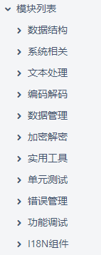

- [框架](#框架)
  - [goframe gf](#goframe-gf)
    - [hello](#hello)
    - [Hello World](#hello-world)
    - [API Service Demo](#api-service-demo)
- [编解码](#编解码)
  - [性能汇总](#性能汇总)
  - [排名](#排名)
  - [bson](#bson)
  - [msgpack](#msgpack)
- [go解释器](#go解释器)
- [python装饰器](#python装饰器)
- [protobuf](#protobuf)
- [cli选型](#cli选型)
  - [需求](#需求)
  - [新增备选](#新增备选)
  - [备选](#备选)
    - [Survey](#survey)
    - [grumble](#grumble)
    - [liner](#liner)
    - [readline](#readline)
      - [我的代码:](#我的代码)
    - [ishell](#ishell)
    - [go-prompt](#go-prompt)
    - [cobra](#cobra)
      - [教程](#教程)
    - [urfave/cli](#urfavecli)
      - [简单例子](#简单例子)
      - [子命令](#子命令)
    - [其他](#其他)
    - [go micro的cli](#go-micro的cli)
  - [方案1 -- go-prompt](#方案1----go-prompt)
  - [方案2 -- promptui + cobra](#方案2----promptui--cobra)
  - [方案3 -- readline + cobra](#方案3----readline--cobra)
  - [方案4 -- 自己写REPL循环 + cobra](#方案4----自己写repl循环--cobra)

# 框架
## goframe gf
作者是国人 郭强, 应该是某互联网大厂的架构师
https://goframe.org/display/gf

库链接:
https://github.com/gogf/gf/issues

gf是个go的web应用开发框架, 提供了大一统的企业应用开发的基础库:  
  

封装了常见的基础库:  
  

### hello
创建一个hello工程
```
gf init hello
```

默认就开始编译运行了, 起来之后默认就提供swagger UI的和open api等url.


### Hello World

视频地址：[https://www.bilibili.com/video/BV15R4y1G7hq/](https://www.bilibili.com/video/BV15R4y1G7hq/)

包含以下内容：

1.  安装`GoFrame CLI`
2.  使用`CLI`创建一个`Go`项目
3.  工程目录介绍

### API Service Demo

视频地址：[https://www.bilibili.com/video/BV1b44y1M7oL/](https://www.bilibili.com/video/BV1b44y1M7oL/)

代码地址：[https://github.com/gogf/gf-demo-user](https://github.com/gogf/gf-demo-user)

我们以一个简单的`API Service`为例来介绍如何使用`GoFrame`框架以及相应的`CLI`工具来开发一个接口项目。

包含以下内容：

1.  包名设计
2.  接口设计
3.  接口文档
4.  配置管理
5.  控制器实现
6.  业务逻辑封装
7.  路由注册
8.  中间件使用
9.  Context及上下文变量


# 编解码
## 性能汇总
https://golangrepo.com/repo/alecthomas-go_serialization_benchmarks-go-benchmarks

## 排名
https://kokizzu.blogspot.com/2020/12/golang-serialization-benchmark-2020.html

| Format | type | ns/op | bytes/op | allocs/op | ns/alloc |
|----| ---- | ---- | ---- | ---- | ---- |
| Mum | ser | 97 | 48 | 0 | 0.00 |
| GencodeUnsafe | ser | 98 | 46 | 48 | 2.05 |
| Gotiny | ser | 130 | 48 | 0 | 0.00 |
| GotinyNoTime | ser | 136 | 48 | 0 | 0.00 |
| Gogoprotobuf | ser | 147 | 53 | 64 | 2.30 |
| Msgp | ser | 174 | 97 | 128 | 1.36 |
| Gencode | ser | 186 | 53 | 80 | 2.33 |
| FlatBuffers | ser | 298 | 95 | 0 | 0.00 |
| Goprotobuf | ser | 317 | 53 | 64 | 4.95 |
| Protobuf | ser | 801 | 52 | 152 | 5.27 |
| ShamatonMapMsgpack | ser | 819 | 92 | 208 | 3.94 |
| Gob | ser | 834 | 63 | 48 | 17.38 |

| Format | type | ns/op | bytes/op | allocs/op | ns/alloc |
|----| ---- | ---- | ---- | ---- | ---- |
| Gencode | des | 222 | 53 | 112 | 1.98 |
| Gogoprotobuf | des | 230 | 53 | 96 | 2.40 |
| GotinyNoTime | des | 241 | 48 | 96 | 2.51 |
| FlatBuffers | des | 265 | 95 | 112 | 2.37 |
| Gotiny | des | 267 | 48 | 112 | 2.38 |
| Msgp | des | 314 | 97 | 112 | 2.80 |
| CapNProto | des | 443 | 96 | 200 | 2.21 |
| Goprotobuf | des | 481 | 53 | 168 | 2.86 |
| Protobuf | des | 790 | 52 | 192 | 4.11 |
| Ikea | des | 871 | 55 | 160 | 5.44 |
| Gob | des | 900 | 63 | 112 | 8.04 |
| GoAvro2Binary | des | 1092 | 47 | 560 | 1.95 |
| Hprose | des | 1195 | 85 | 319 | 3.75 |
| UgorjiCodecMsgpack | des | 1398 | 91 | 496 | 2.82 |
| Binary | des | 1511 | 61 | 320 | 4.72 |
| UgorjiCodecBinc | des | 1587 | 95 | 656 | 2.42 |
| Bson | des | 1694 | 110 | 232 | 7.30 |


| Format | ns/op | bytes |
|-- | -- | -- |
| Bebop | 228 | 110 |
| GencodeUnsafe | 259 | 92 |
| XDR2 | 290 | 120 |
| Mum | 313 | 96 |
| Colfer | 321 | 101 |
| GotinyNoTime | 377 | 96 |
| Gogoprotobuf | 377 | 106 |
| Gotiny | 397 | 96 |
| Gencode | 408 | 106 |
| Msgp | 488 | 194 |
| FlatBuffers | 563 | 190 |
| Goprotobuf | 798 | 106 |
| CapNProto | 829 | 192 |
| Hprose2 | 1,213 | 170 |
| ShamatonArrayMsgpack | 1,241 | 100 |
| CapNProto2 | 1,364 | 192 |
| Ikea | 1,541 | 110 |
| ShamatonMapMsgpack | 1,557 | 184 |
| Protobuf | 1,591 | 104 |
| Gob | 1,734 | 126 |
| GoAvro2Binary | 2,042 | 94 |
| Hprose | 2,110 | 170 |
| UgorjiCodecMsgpack | 2,820 | 182 |
| VmihailencoMsgpack | 2,838 | 200 |
| Bson | 2,865 | 220 |
| Binary | 2,875 | 122 |
| UgorjiCodecBinc | 3,055 | 190 |
| EasyJson | 3,513 | 299 |
| XDR | 4,091 | 182 |
| JsonIter | 4,266 | 278 |
| GoAvro2Text | 5,801 | 268 |
| Sereal | 6,313 | 264 |
| Json | 6,786 | 299 |
| GoAvro | 9,790 | 94 |
| SSZNoTimeNoStringNoFloatA | 12,616 | 110 |


## bson
https://github.com/mongodb/mongo-go-driver/tree/master/bson
对应的文档: https://pkg.go.dev/go.mongodb.org/mongo-driver/bson

还有一个实现: https://pkg.go.dev/labix.org/v2/mgo/bson
实现比较简单, 2014年更新的.

## msgpack
*   [github.com/vmihailenco/msgpack/v4](https://github.com/vmihailenco/msgpack)

# go解释器
库地址: https://github.com/traefik/yaegi
背景: https://traefik.io/blog/announcing-yaegi-263a1e2d070a/

看起来很好
*   Complete support of [Go specification](https://golang.org/ref/spec)
*   Written in pure Go, using only the standard library
*   Simple interpreter API: `New()`, `Eval()`, `Use()`
*   Works everywhere Go works
*   All Go & runtime resources accessible from script (with control)
*   Security: `unsafe` and `syscall` packages neither used nor exported by default
*   Support Go 1.13 and Go 1.14 (the latest 2 major releases)


# python装饰器
本质上是函数闭包: 把返回的函数赋值给原始函数名

```python
@a_new_decorator
def a_function_requiring_decoration():
    """Hey you! Decorate me!"""
    print("I am the function which needs some decoration to "
          "remove my foul smell")
 
a_function_requiring_decoration()
#outputs: I am doing some boring work before executing a_func()
#         I am the function which needs some decoration to remove my foul smell
#         I am doing some boring work after executing a_func()
 
#the @a_new_decorator is just a short way of saying:
a_function_requiring_decoration = a_new_decorator(a_function_requiring_decoration)
```
[参考这里](https://www.runoob.com/w3cnote/python-func-decorators.html) 其中第一篇笔记很赞

# protobuf
protobuf项目的go版本现在转到:
[https://github.com/protocolbuffers/protobuf-go](https://github.com/protocolbuffers/protobuf-go)
之前是golang team维护的
[https://github.com/golang/protobuf](https://github.com/golang/protobuf)

# cli选型
## 需求
* 自动完成
* 命令层级
* 交互式(REPL): The name REPL stands for Read-Eval-Print-Loop - an interactive, typically console-based, programming environment.
* 命令式

## 新增备选
https://pkg.go.dev/golang.org/x/term
看起来有点官方

## 备选

从readline grumble liner里面选一个.

对abs来说, 不需要grumble这样的"集成"cli. readline/liner应该够了.
但grumble的思路可以借鉴.

最后选择readline

### [Survey](https://github.com/AlecAivazis/survey)
https://github.com/AlecAivazis/survey
感觉不是普通的shell思路, 应该说加了比如check box等功能

### [grumble](https://github.com/desertbit/grumble)
https://github.com/desertbit/grumble
本身代码量很少, 但集成了readline等库; 但使用了较新维护的版本https://github.com/desertbit/readline
思路是cobra式的子命令, 但默认加了交互式命令行
更新不多, 但比较稳定? 
作者自称受ishell启发
> There are a handful of powerful go CLI libraries available (spf13/cobra, urfave/cli). However sometimes an integrated shell interface is a great and useful extension for the actual application. This library offers a simple API to create powerful CLI applications and automatically starts an integrated interactive shell, if the application is started without any command arguments.

### [liner](https://github.com/peterh/liner)
https://github.com/peterh/liner
看起来不错. 类VT100
支持go.mod
支持常规快捷键
支持历史命令

### readline
https://github.com/chzyer/readline
和c版本的readline套路一样.

有个库包装了readline, 成为一个简单的迭代器, 看起来不错
https://github.com/knieriem/readlineutil
```go
func (t *Term) Scan() bool {
    line, err := t.inst.Readline()
    if err != nil {
        t.err = err
        return false
    }
    t.line = line
    if t.prevPrompt != "" && line != "" {
        t.inst.SaveHistory(line)
    }
    return true
}
```

#### 我的代码:
```go
func repl() {
    completer := readline.NewPrefixCompleter()
    liner, err := readline.NewEx(&readline.Config{
        Prompt:       "> ",
        AutoComplete: completer,
        EOFPrompt:    "exit",
    })
    if err != nil {
        panic(err)
    }
    defer liner.Close()
    for {
        l, err := liner.Readline()
        if errors.Is(err, io.EOF) {
            break
        }
        if errors.Is(err, readline.ErrInterrupt) {
            continue
        }
        if len(l) != 0 {
            fmt.Println(l)
        }
    }
}
```

### ishell
https://github.com/abiosoft/ishell
看着有点简陋...
```sh
Sample Interactive Shell
>>> help

Commands:
  clear      clear the screen
  greet      greet user
  exit       exit the program
  help       display help

>>> greet Someone Somewhere
Hello Someone Somewhere
>>> exit
$
```

### go-prompt
https://github.com/c-bata/go-prompt
还在更新, 主打交互式, 命令联想, 快捷键, 历史记录上下翻. 好像目标是提供kubectl兼容的kube-prompt


[go.libhunt上对比](https://go.libhunt.com/go-prompt-alternatives)
* [termui](https://github.com/gizak/termui)
主打文本的图形显示

* [gocui](https://github.com/jroimartin/gocui)
主打文本布局, 有点像调试器界面

* [tview](https://github.com/rivo/tview)
也是主打界面的
* [tcell](https://github.com/gdamore/tcell)
文本控制台库, 似乎很有用.

### cobra 
https://github.com/spf13/cobra
* 使用广泛 
Cobra is used in many Go projects such as [Kubernetes](http://kubernetes.io/), [Hugo](https://gohugo.io/), and [Github CLI](https://github.com/cli/cli) to name a few. [This list](https://github.com/spf13/cobra/blob/master/projects_using_cobra.md) contains a more extensive list of projects using Cobra.
* cobra是个框架, 典型布局
```
  ▾ appName/
    ▾ cmd/
        add.go
        your.go
        commands.go
        here.go
      main.go
```

* main.go

```go
package main

import (
  "{pathToYourApp}/cmd"
)

func main() {
  cmd.Execute()
}
```

#### 教程
[这个教程](https://www.educative.io/edpresso/how-to-use-cobra-in-golang)写的不错
用Cobra的几个好处:
*   Easy to create subcommand-based CLIs and use nested subcommands.
*   Automatic help generation for commands and flags.
*   Increased productivity because of commands such as `cobra init appname` & `cobra add cmdname`.
*   Helpful, intelligent suggestions (`app srver`… did you mean `app server`?).

[这篇文章](https://medium.com/a-journey-with-go/go-thoughts-about-cobra-f4e8c5f18091)写的更好
Cobra比标准库flag的功能更丰富
* 支持-abc -e --example等传统的参数输入
* 支持子命令. 这个是主要原因. golang标准库里本来有, 但在internal下面, 外部用不了

子命令举例:
```go
package main

import (
    "github.com/spf13/cobra"
)

func main() {
    cmd := newCommand()
    cmd.AddCommand(newNestedCommand())

    rootCmd := &cobra.Command{}
    rootCmd.AddCommand(cmd)

    if err := rootCmd.Execute(); err != nil {
        println(err.Error())
    }
}

func newCommand() *cobra.Command {
    cmd := &cobra.Command{
        Run:  func (cmd *cobra.Command, args []string) {
            println(`Foo`)
        },
        Use:   `foo`,
        Short: "Command foo",
        Long:  "This is a command",
    }

    return cmd
}

func newNestedCommand() *cobra.Command {
    cmd := &cobra.Command{
        Run:  func (cmd *cobra.Command, args []string) {
            println(`Bar`)
        },
        Use:   `bar`,
        Short: "Command bar",
        Long:  "This is a nested command",
    }

    return cmd
}
```

### urfave/cli
https://github.com/urfave/cli
主打轻量化.在积极维护

#### 简单例子
```go
package main

import (
  "fmt"
  "log"
  "os"

  "github.com/urfave/cli/v2"
)

func main() {
  app := &cli.App{
    Name: "greet",
    Usage: "fight the loneliness!",
    Action: func(c *cli.Context) error {
      fmt.Println("Hello friend!")
      return nil
    },
  }

  err := app.Run(os.Args)
  if err != nil {
    log.Fatal(err)
  }
}
```

#### 子命令
```go
package main
import (
    "fmt"
    "log"
    "os"
    "github.com/urfave/cli/v2"
)
func main() {
    app := cli.NewApp()
    app.EnableBashCompletion = true
    app.Commands = []*cli.Command{
        {
            Name:    "add",
            Aliases: []string{"a"},
            Usage:   "add a task to the list",
            Action: func(c *cli.Context) error {
                fmt.Println("added task: ", c.Args().First())
                return nil
            },
        },
        {
            Name:    "complete",
            Aliases: []string{"c"},
            Usage:   "complete a task on the list",
            Action: func(c *cli.Context) error {
                fmt.Println("completed task: ", c.Args().First())
                return nil
            },
        },
        {
            Name:    "template",
            Aliases: []string{"t"},
            Usage:   "options for task templates",
            Subcommands: []*cli.Command{
                {
                    Name:  "add",
                    Usage: "add a new template",
                    Action: func(c *cli.Context) error {
                        fmt.Println("new task template: ", c.Args().First())
                        return nil
                    },
                },
                {
                    Name:  "remove",
                    Usage: "remove an existing template",
                    Action: func(c *cli.Context) error {
                        fmt.Println("removed task template: ", c.Args().First())
                        return nil
                    },
                },
            },
        },
    }
    err := app.Run(os.Args)
    if err != nil {
        log.Fatal(err)
    }
}
```


### 其他
* [kingpin](https://github.com/alecthomas/kingpin)
似乎不怎么维护了

### go micro的cli
micro命令似乎进入了一个命令行界面, 有提示符. 但里面的命令和在shell中敲的一样.
cli命令对应的Action是Run.
这个Run是个典型的Read-Eval-Print-Loop, 基本上是
```go
for {
    //先readline()
    args, err := r.Readline()
    //准备参数
    args = strings.TrimSpace(args)
    parts := strings.Split(args, " ")
    //找到cmd
    cmd, ok := commands[name]
    //执行cmd
    rsp, err := cmd.exec(c, parts[1:])
    println(string(rsp))
}
```
micro的交互式cli很简单, 就是在顶层有个循环来readline, 执行cmd.
没有其他功能.

## 方案1 -- go-prompt


## 方案2 -- [promptui](https://github.com/manifoldco/promptui) + cobra


[讨论在此](https://github.com/spf13/cobra/issues/248)

看下来感觉不好...

## 方案3 -- [readline](https://github.com/chzyer/readline) + cobra

## 方案4 -- 自己写REPL循环 + cobra
比如[这篇文章](https://medium.com/hackernoon/today-i-learned-making-a-simple-interactive-shell-application-in-golang-aa83adcb266a)里, 就只用了`reader.ReadString('\n')`
```go
func main() {
    reader := bufio.NewReader(os.Stdin)
    for {
        fmt.Print("$ ")
        cmdString, err := reader.ReadString('\n')
        if err != nil {
            fmt.Fprintln(os.Stderr, err)
        }
        err = runCommand(cmdString)
        if err != nil {
            fmt.Fprintln(os.Stderr, err)
        }
    }
}

func runCommand(commandStr string) error {
    commandStr = strings.TrimSuffix(commandStr, "\n")
    arrCommandStr := strings.Fields(commandStr)
    switch arrCommandStr[0] {
    case "exit":
        os.Exit(0)
        // add another case here for custom commands.
    }
    cmd := exec.Command(arrCommandStr[0], arrCommandStr[1:]...)
    cmd.Stderr = os.Stderr
    cmd.Stdout = os.Stdout
    return cmd.Run()
}
```
