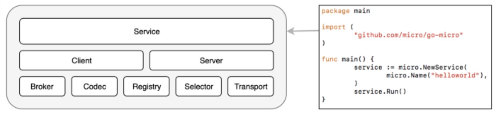

- [micro server命令流程](#micro-server命令流程)
  - [makefile](#makefile)
  - [main.go](#maingo)
  - [cmd](#cmd)
    - [顶层Action](#顶层action)
    - [server子命令](#server子命令)
    - [log](#log)
    - [`./micro service api`执行流程](#micro-service-api执行流程)
      - [service命令入口, 代码在`cmd/service/service.go`](#service命令入口-代码在cmdserviceservicego)
    - [api命令入口](#api命令入口)
    - [总结](#总结)
  - [urfave的cli使用](#urfave的cli使用)
- [新版micro搭建blog服务](#新版micro搭建blog服务)
  - [建立运行环境](#建立运行环境)
  - [新建posts 服务](#新建posts-服务)
    - [写main.go](#写maingo)
    - [写handler.go](#写handlergo)
    - [增加save功能](#增加save功能)
- [新版micro](#新版micro)
  - [依赖](#依赖)
  - [要先启动server, 再login上去](#要先启动server-再login上去)
  - [micro server会默认启动一些服务](#micro-server会默认启动一些服务)
  - [run hello world service](#run-hello-world-service)
  - [调用hello world服务](#调用hello-world服务)
    - [cli方式](#cli方式)
    - [rest API方式](#rest-api方式)
    - [自己写个client](#自己写个client)
    - [总结](#总结-1)
  - [新建service](#新建service)
    - [使用`micro new`新建个工程](#使用micro-new新建个工程)
  - [storage服务](#storage服务)
    - [每个service都有自己的table](#每个service都有自己的table)
  - [用update命令重新run一个服务](#用update命令重新run一个服务)
  - [内置config命令](#内置config命令)
- [更新2021.6.18](#更新2021618)
  - [分叉](#分叉)
  - [v2-to-v3-upgrade-guide](#v2-to-v3-upgrade-guide)
  - [v3版本也是搞micro run这一套](#v3版本也是搞micro-run这一套)
  - [go micro的网络设计理念](#go-micro的网络设计理念)
- [更新2020.11](#更新202011)
- [介绍](#介绍)
- [框架](#框架)
  - [服务发现](#服务发现)
  - [异步消息](#异步消息)
  - [消息编码](#消息编码)
  - [其他接口](#其他接口)
- [使用micro模板](#使用micro模板)
  - [生成工程模板代码](#生成工程模板代码)
  - [安装依赖](#安装依赖)
  - [运行工程](#运行工程)

# micro server命令流程
## makefile
micro的makefile很简单
```makefile
build:
        go build -a -installsuffix cgo -ldflags "-s -w ${LDFLAGS}" -o $(NAME)
```
会展开成
```sh
$ make build
go build -a -installsuffix cgo -ldflags "-s -w -X github.com/micro/micro/v3/cmd.BuildDate=1624082635 -X github.com/micro/micro/v3/cmd.GitCommit=870f80e7 -X github.com/micro/micro/v3/cmd.GitTag=v3.3.0" -o micro
```
注:
* `-a`是强制所有包都重编
* `-ldflags "-X ...`这一堆是给包的"全局变量"赋值

## main.go
main.go的思路和gshellos building很像
通过import的package的init函数来注册, main里面只调用`cmd.Run()`
```go
package main

//go:generate ./scripts/generate.sh

import (
    "github.com/micro/micro/v3/cmd"

    // load packages so they can register commands
    _ "github.com/micro/micro/v3/cmd/cli"
    _ "github.com/micro/micro/v3/cmd/server"
    _ "github.com/micro/micro/v3/cmd/service"
    _ "github.com/micro/micro/v3/cmd/usage"
)

func main() {
    cmd.Run()
}
```
注:
* go generate命令是独立的, go build不会默认先调用go generate. 之所以这里在makefile里面没有调用go generate命令, 可能是因为生成代码这个步骤是开发者手动完成的

## cmd
使用了urfave的cli框架
urfave的cli框架里, 命令是以树的形式组织的:子命令先注册到上级命令, 然后顶层命令的run函数, 会找到合适的子命令来run; 如果没找到, 就调用本层命令的Action函数. 
cmd包全局变量`DefaultCmd Cmd = New()`之后, 就调用`DefaultCmd.Run()`来开始命令行解析.

### 顶层Action
上面说过, 没有匹配的子命令的时候, 就调用本次的Action. 那么顶层的Action被调用到的时候, 说明用户输入的不是子命令, 按照micro的设计, 而是个自定义服务名. 这里的基本逻辑是查找这个服务名, 调用服务.

### server子命令
按照教程, 所有micro都要依赖micro服务. `./micro server`
这个server是个子命令, 被注册到DefaultCmd的子命令列表中
```go
    command := &cli.Command{
        Name:  "server",
        Usage: "Run the micro server",
        Description: `Launching the micro server ('micro server') will enable one to connect to it by
        setting the appropriate Micro environment (see 'micro env' && 'micro env --help') commands.`,
        Flags: []cli.Flag{
            &cli.StringFlag{
                Name:    "address",
                Usage:   "Set the micro server address :10001",
                EnvVars: []string{"MICRO_SERVER_ADDRESS"},
            },
            &cli.StringFlag{
                Name:    "image",
                Usage:   "Set the micro server image",
                EnvVars: []string{"MICRO_SERVER_IMAGE"},
                Value:   "micro/micro:latest",
            },
        },
        Action: func(ctx *cli.Context) error {
            Run(ctx)
            return nil
        },
    }
```
server的Action动作是启动如下服务
```go
    services = []string{
        "registry", // :8000
        "broker",   // :8003
        "network",  // :8443
        "runtime",  // :8088
        "config",   // :8001
        "store",    // :8002
        "events",   // :unset
        "auth",     // :8010
        "proxy",    // :8081
        "api",      // :8080
    }
```
按照`micro service [name]`的形式, 注意这里的命令的关键词是`service`
```go
for 每个在上面services列表中的service {
        // all things run by the server are `micro service [name]`
        cmdArgs := []string{"service"}
        cmdArgs = append(cmdArgs, service)
        // runtime based on environment we run the service in
        args := []runtime.CreateOption{
            runtime.WithCommand(os.Args[0]),
            runtime.WithArgs(cmdArgs...),
            runtime.WithEnv(env),
            runtime.WithPort(port),
            runtime.WithRetries(10),
            runtime.WithServiceAccount("micro"),
            runtime.WithVolume("store-pvc", "/store"),
            runtime.CreateImage(context.String("image")),
            runtime.CreateNamespace("micro"),
            runtime.WithSecret("MICRO_AUTH_PUBLIC_KEY", auth.DefaultAuth.Options().PublicKey),
            runtime.WithSecret("MICRO_AUTH_PRIVATE_KEY", auth.DefaultAuth.Options().PrivateKey),
        }
        // NOTE: we use Version right now to check for the latest release
        muService := &runtime.Service{Name: service, Version: "latest"}
        //真正的启动内置service
        runtimeServer.Create(muService, args...)
}
```
这里有两种类型的runtime:
* local
* kubernetes

我们这里走的是local. local的Create函数在
`service/runtime/local/local.go`
```go
func (r *localRuntime) Create(resource runtime.Resource, opts ...runtime.CreateOption) error {
    这个Create是个通用的接口, 可以新建比如namespace, NetworkPolicy, 也可以是Service
    // create new service
    service := newService(s, options)
    // 先建log文件, 一般在 /tmp/micro/logs/runtime.log
    f, err := os.OpenFile(logFile(service.Name), os.O_APPEND|os.O_CREATE|os.O_WRONLY, 0644)
    // start the service
    err := service.Start()
}
```
注意最后`service.Start()`是启动一个独立的进程, 这个进程运行了内置的service
这里执行的命令是:`./micro service api`
```go
p, err := s.Process.Fork(s.Exec)
    cmd := exec.Command(exe.Package.Path, exe.Args...)
    err := cmd.Start()
```

### log
micro的log都放在`/tmp/micro/logs`
```go
var (
    // The directory for logs to be output
    LogDir = filepath.Join(os.TempDir(), "micro", "logs")
    // The source directory where code lives
    SourceDir = filepath.Join(os.TempDir(), "micro", "uploads")
)
```
比如我的实际例子:
```sh
$ ls /tmp/micro/logs/
api.log  auth.log  broker.log  config.log  events.log  network.log  proxy.log  registry.log  runtime.log  store.log
```

### `./micro service api`执行流程
#### service命令入口, 代码在`cmd/service/service.go`
命令行入口: 注意这个入口是在下级命令的情况下才会调用的. 所以我看了半天实际是执行不到的. : (
```go
// Run starts a micro service sidecar to encapsulate any app
func Run(ctx *ccli.Context) {
    // new service
    srv := service.New(opts...)

    // create new muxer
    //    muxer := mux.New(name, p)

    // set the router
    srv.Server().Init(
        server.WithRouter(p),
    )

    // run service
    srv.Run()
}
```

### api命令入口
api命令的入口实际上是
```go
var srvCommands = []srvCommand{
    {
        Name:    "api",
        Command: api.Run,
        Flags:   api.Flags,
    },
    ...
}
```
对应代码: `service/api/server/server.go`
默认值就是这里的8080
```go
var (
    Name                  = "api"
    Address               = ":8080"
    Handler               = "meta"
    Resolver              = "micro"
    APIPath               = "/"
    ProxyPath             = "/{service:[a-zA-Z0-9]+}"
    Namespace             = ""
    ACMEProvider          = "autocert"
    ACMEChallengeProvider = "cloudflare"
    ACMECA                = acme.LetsEncryptProductionCA
)
```
api命令的入口就是:
```go
func Run(ctx *cli.Context) error {
    // initialise service
    srv := service.New(service.Name(Name))
    // create a new api server with wrappers
    api := httpapi.NewServer(Address)
    // initialise
    api.Init(opts...)
    // register the handler
    api.Handle("/", h)

    // Start API
    if err := api.Start(); err != nil {
        log.Fatal(err)
    }

    // Run server
    if err := srv.Run(); err != nil {
        log.Fatal(err)
    }

    // Stop API
    if err := api.Stop(); err != nil {
        log.Fatal(err)
    }
}
```
我这里`./micro server`总是出错, 看log是因为:
api这个服务的8080端口被占用了.
```
2021-06-20 05:20:44  file=server/server.go:341 level=fatal service=api listen tcp :8080: bind: address already in use
```
这个端口是写死的. 虽然有命令行参数可以改, 但是这个命令行是`micro server`传入写死的...
这似乎是个死局, 初非直接改代码.
解决办法很简单, 直接改个port:
```go
$ git diff
diff --git a/service/api/server/server.go b/service/api/server/server.go
index 2bcd7651..69f7f31a 100644
--- a/service/api/server/server.go
+++ b/service/api/server/server.go
@@ -39,7 +39,7 @@ import (

 var (
        Name                  = "api"
-       Address               = ":8080"
+       Address               = ":18080"
        Handler               = "meta"
        Resolver              = "micro"
        APIPath               = "/"

```

### 总结
* 每个service都使用了micro的框架, 都以独立进程的形式存在.

## urfave的cli使用
注册的action会被调用: 比如
```go
func Run(ctx *cli.Context) error {
    ...
}
```
* `ctx.String("server_name")`: 获取命令行的string类型的flag值
* `ctx.Bool("enable_acme")`: 类似的, 获取Bool类型的值

# 新版micro搭建blog服务
## 建立运行环境
先run micro server
```
micro server
```
看看当前环境
```sh
$ micro env
* local      127.0.0.1:8081         Local running micro server
  dev        proxy.m3o.dev          Cloud hosted development environment
  platform   proxy.m3o.com          Cloud hosted production environment
```
可能需要先运行`micro env set local`来建立local的环境

## 新建posts 服务
```sh
$ micro new posts
$ ls posts
Dockerfile    Makefile    README.md    generate.go    go.mod        handler        main.go        proto
```

改proto先
```go
syntax = "proto3";
 
package posts;
 
service Posts {
    rpc Save(SaveRequest) returns (SaveResponse) {}
    rpc Query(QueryRequest) returns (QueryResponse) {}
    rpc Delete(DeleteRequest) returns (DeleteResponse) {}
}
 
message SaveRequest {
    string id = 1;
    string title = 2;
    string slug = 3;
    string content = 4;
    int64 timestamp = 5;
    repeated string tags = 6;
}
 
message SaveResponse {
    string id = 1;
}
 
message Post {
    string id = 1;
    string title = 2;
    string slug = 3;
    string content = 4;
    int64 created = 5;
    int64 updated = 6;
    string author = 7;
    repeated string tags = 8;
}
```
proto文件有一定的修改, 目的是让命令访问更简单点
不改的话是这样
`micro posts save --post_title=Title --post_content=Content`
这里想整成这样:
`micro posts save --title=Title --content=Content`

然后make proto就可以生成代码了

### 写main.go
```go
package main
 
import (
    "posts/handler"
 
    "github.com/micro/micro/v3/service"
    "github.com/micro/micro/v3/service/logger"
)
 
func main() {
    // Create the service
    srv := service.New(
        service.Name("posts"),
    )
 
    // Register Handler
    srv.Handle(handler.NewPosts())
 
    // Run service
    if err := srv.Run(); err != nil {
        logger.Fatal(err)
    }
}
```
### 写handler.go
```go
package handler
 
import (
    "context"
    "time"
 
    "github.com/micro/dev/model"
    "github.com/micro/go-micro/errors"
    "github.com/micro/micro/v3/service/logger"
    "github.com/micro/micro/v3/service/store"
 
    proto "posts/proto"
 
    "github.com/gosimple/slug"
)
 
type Posts struct {
    db           model.Model
    idIndex      model.Index
    createdIndex model.Index
    slugIndex    model.Index
}
 
func NewPosts() *Posts {
    createdIndex := model.ByEquality("created")
    createdIndex.Order.Type = model.OrderTypeDesc
 
    slugIndex := model.ByEquality("slug")
 
    idIndex := model.ByEquality("id")
    idIndex.Order.Type = model.OrderTypeUnordered
 
    return &Posts{
        db: model.New(
            store.DefaultStore,
            "posts",
            model.Indexes(slugIndex, createdIndex),
            &model.ModelOptions{
                IdIndex: idIndex,
            },
        ),
        createdIndex: createdIndex,
        slugIndex:    slugIndex,
        idIndex:      idIndex,
    }
}
```
现在run这个服务`micro run .`, 能得到初步的输出
```sh
$ micro logs posts
Starting [service] posts
Server [grpc] Listening on [::]:53031
Registry [service] Registering node: posts-b36361ae-f2ae-48b0-add5-a8d4797508be
```

### 增加save功能
增加save函数
```go
func (p *Posts) Save(ctx context.Context, req *proto.SaveRequest, rsp *proto.SaveResponse) error {
    logger.Info("Received Posts.Save request")
    post := &proto.Post{
        Id:      req.Id,
        Title:   req.Title,
        Content: req.Content,
        Slug:    req.Slug,
        Created: time.Now().Unix(),
    }
    if req.Slug == "" {
        post.Slug = slug.Make(req.Title)
    }
    return p.db.Save(post)
}
```
重新run `micro update .`
```
micro posts save --id=1 --title="Post one" --content="First saved post"
micro posts save --id=2 --title="Post two" --content="Second saved post"
```


# 新版micro
## 依赖
依赖protobuf go版本
```sh
# Download latest proto releaes
# https://github.com/protocolbuffers/protobuf/releases
go get github.com/golang/protobuf/protoc-gen-go
go get github.com/micro/micro/v3/cmd/protoc-gen-micro
```
## 要先启动server, 再login上去
用户名密码是admin和micro
```sh
micro server

$ micro login
Enter username: admin
Enter password:
Successfully logged in.
```

## micro server会默认启动一些服务
```sh
$ micro services
api
auth
broker
config
events
network
proxy
registry
runtime
server
store
```

## run hello world service
在`github.com/micro/services`库中, 有很多"官方"写好的服务
比如我们要run个hello world
```sh
micro run github.com/micro/services/helloworld
```
现在可以看看状态
```sh
$ micro status
NAME        VERSION    SOURCE                    STATUS    BUILD    UPDATED    METADATA
helloworld    latest    github.com/micro/services/helloworld    running    n/a    4s ago    owner=admin, group=micro
```
看看log
```sh
$ micro logs helloworld
2020-10-06 17:52:21  file=service/service.go:195 level=info Starting [service] helloworld
2020-10-06 17:52:21  file=grpc/grpc.go:902 level=info Server [grpc] Listening on [::]:33975
2020-10-06 17:52:21  file=grpc/grpc.go:732 level=info Registry [service] Registering node: helloworld-67627b23-3336-4b92-a032-09d8d13ecf95
```

## 调用hello world服务
### cli方式
还是使用micro命令来调用, 格式是`micro [service] [method]`, 默认的method是`call`, 参数可以直接命令行传入
```sh
$ micro helloworld --name=Jane
{
    "msg": "Hello Jane"
}
```
查询这个服务能提供什么服务:
```sh
$ micro helloworld --help
NAME:
    micro helloworld

VERSION:
    latest

USAGE:
    micro helloworld [command]

COMMANDS:
    call
```
要看call命令的子命令call的使用
```sh
$ micro helloworld call --help
NAME:
    micro helloworld call

USAGE:
    micro helloworld call [flags]

FLAGS:
    --name string
```

### rest API方式
`curl "http://localhost:8080/helloworld?name=John"`

### 自己写个client
是个rpc模式的client
实际上这个client本身也是个"service"(使用`service.New()`得来)
```go
package main

import (
    "context"
    "fmt"
    "time"

    "github.com/micro/micro/v3/service"
    proto "github.com/micro/services/helloworld/proto"
)

func main() {
    // create and initialise a new service
    srv := service.New()

        // create the proto client for helloworld
        client := proto.NewHelloworldService("helloworld", srv.Client())

        // call an endpoint on the service
        rsp, err := client.Call(context.Background(), &proto.Request{
            Name: "John",
        })
        if err != nil {
            fmt.Println("Error calling helloworld: ", err)
            return
        }

        // print the response
        fmt.Println("Response: ", rsp.Msg)
        
        // let's delay the process for exiting for reasons you'll see below
        time.Sleep(time.Second * 5)
}
```
run这个client:
```sh
cd example && go mod init example
micro run .
```
run的时候不打印, 用status命令能看到
```sh
$ micro status
NAME        VERSION    SOURCE                                    STATUS    BUILD    UPDATED        METADATA
example        latest    example.tar.gz                            running    n/a     2s ago        owner=admin, group=micro
helloworld    latest    github.com/micro/services/helloworld    running    n/a        5m59s ago    owner=admin, group=micro
```
看log能够得到其output
```sh
$ micro logs example
# some go build output here
Response:  Hello John
```

### 总结
* 使用protobuf来封装message
* client也是service

## 新建service
### 使用`micro new`新建个工程
配套目录, proto定义, Makefile自动生成
```sh
$ micro new helloworld
Creating service helloworld

.
├── main.go
├── generate.go
├── handler
│   └── helloworld.go
├── proto
│   └── helloworld.proto
├── Dockerfile
├── Makefile
├── README.md
├── .gitignore
└── go.mod


download protoc zip packages (protoc-$VERSION-$PLATFORM.zip) and install:

visit https://github.com/protocolbuffers/protobuf/releases

download protobuf for micro:

go get -u github.com/golang/protobuf/proto
go get -u github.com/golang/protobuf/protoc-gen-go
go get github.com/micro/micro/v3/cmd/protoc-gen-micro

compile the proto file helloworld.proto:

cd helloworld
make proto
```
根据提示, 改了proto后, `make proto`来生成go代码

## storage服务
没错, 永久存储被内置成了服务, 并配套了专有命令
* 写key value对
```sh
$ micro store write key1 value1
```
* 读key
```sh
$ micro store read key1
val1
$ micro store read -v key1
KEY    VALUE   EXPIRY
key1   val1    None
```
* pattern读, -p选项
```sh
$ micro store read --prefix --verbose key
KEY    VALUE   EXPIRY
key1   val1    None
key2   val2    None
```

### 每个service都有自己的table
用`--table`指定table
`micro store write --table=example mykey "Hi there"`
可以在client代码里读key
```go
package main

import (
    "fmt"
    "time"

    "github.com/micro/micro/v3/service"
    "github.com/micro/micro/v3/service/store"
)

func main() {
    srv := service.New(service.Name("example"))
    srv.Init()

    records, err := store.Read("mykey")
    if err != nil {
        fmt.Println("Error reading from store: ", err)
    }

    if len(records) == 0 {
        fmt.Println("No records")
    }
    for _, record := range records {
        fmt.Printf("key: %v, value: %v\n", record.Key, string(record.Value))
    }

    time.Sleep(1 * time.Hour)
}
```

## 用update命令重新run一个服务
比如之前已经在run的example服务(实际是hello world的client), 改了代码要重新run, 用
`micro update .` 使用最近代码重run
也可以先kill, 再run
```sh
micro kill example
micro run .
```

## 内置config命令
支持类似map式的set
```sh
$ micro config set key val
$ micro config get key
val

$ micro config set key.subkey val
$ micro config get key.subkey
val
$ micro config get key
{"subkey":"val"}

$ micro config set key.othersubkey val2
$ micro config get key
{"othersubkey":"val2","subkey":"val"}
```
用client代码来获取config
```go
package main

import (
    "fmt"

    "github.com/micro/micro/v3/service"
    "github.com/micro/micro/v3/service/config"
)

func main() {
    // setup the service
    srv := service.New(service.Name("example"))
    srv.Init()

    // read config value
    val, _ := config.Get("key.subkey")
    fmt.Println("Value of key.subkey: ", val.String(""))
}
```

# 更新2021.6.18
## 分叉
分叉为两个分支:
* https://github.com/micro/micro: 统一的库, 包括原go-micro(在micro/service目录下, 是原go-micro的拷贝)
这个版本使用了[`Polyform Shield`](https://github.com/micro/micro/blob/master/LICENSE)许可证, 禁止和开源作者竞争
* https://github.com/asim/go-micro: 原go-micro, 使用个人地址, 也是v3版本, 使用apache协议
    * 已经没有github.com/micro/go-micro 地址了, 自动跳转到https://github.com/asim/go-micro
* 创始人(asim)两个库都在维护, 但更多的精力放在了另外一个库中:https://github.com/micro/services
* 官方的说法是[v2-to-v3-upgrade-guide](https://micro.mu/v2-to-v3-upgrade-guide): go-micro已经"now deprecated", 由asim个人维护.

## v2-to-v3-upgrade-guide
```go
  srv := micro.NewService(
    micro.Name("go.micro.service.foo")
  )
```
变为
```go
  srv := service.New(
    service.Name("foo")
  )
```

## v3版本也是搞micro run这一套
要先起个server: 使用命令`micro server`, 没有server的环境, 可以使用免费的M3O环境: `micro env set platform`

## go micro的网络设计理念
从[Building a global services network using Go, QUIC and Micro](https://medium.com/microhq/building-a-global-services-network-using-go-quic-and-micro-2c1cf9b89c8)看过来的.


# 更新2020.11
go micro换了地址
老地址:github.com/micro/go-micro
新地址:~~https://github.com/asim/nitro~~


访问老地址会自动跳到新地址
[FAQ](https://github.com/asim/nitro#faq)中说
* go-micro重命名为Nitro, 现在由个人维护; 原组织github.com/micro现在加倍下注(doubling down)在Micro项目, 这个项目会集大成
* License从`Apache 2.0`换到了`Polyform Noncommercial`
* go-plugins现在地址是`github.com/asim/nitro-plugins`, 虽然是Apache协议, 但用了Nitro, 所以也不能商用
* Nitro的目标是不引入外部依赖, 外部依赖由Nitro Plugins解决. -- 纯框架
* defualt的top level services初始化被移出了. 作者认为设置default初始化不好
* cmd包也被移出了. 作者认为这部分代码引入了复杂的依赖代码.难于维护. 作者推荐使用google的[生成依赖初始化项目wire](https://github.com/google/wire) 介绍见[blog](https://blog.golang.org/wire)
不同于基于reflection的 [Uber's dig](https://github.com/uber-go/dig) and [Facebook's inject](https://github.com/facebookgo/inject), wire使用代码生成技术, 类似java的 [Dagger 2](https://google.github.io/dagger/)
基本上是代码里声明依赖, 用go generate调用wire生成代码.
* 作者认为micro和nitro的区别是, 前者现在是大一统的方案, 目标是云; 后者是作者自己维护的框架, 目标是edge, IOT, 嵌入式等.
* 原来的go-micro开发怎么继续?
答: 使用Micro和[m3o.com](https://m3o.com/) which starts as a purely free Dev environment in the cloud.
* go-micro v2还能用吗?
答: 可以. v2还是Apache许可证. `import github.com/micro/go-micro/v2` github会自动重定向到`https://github.com/asim/nitro`

补充: Micro项目的License也换了. 但同样的, 可以用v2版本

# 介绍
本文介绍go的开源微服务框架[https://github.com/micro/go-micro](https://github.com/micro/go-micro). [原文链接](https://itnext.io/micro-in-action-getting-started-a79916ae3cac)

*   [Micro in Action, Part 2: An Ultimate Guide for Bootstrap](https://itnext.io/micro-in-action-part-2-71230f01d6fb)
*   [Micro In Action, Part 3: Calling a Service](https://itnext.io/micro-in-action-part-3-calling-a-service-55d865928f11)
*   [Micro In Action, Part 4: Pub/Sub](https://medium.com/@dche423/micro-in-action-part4-pub-sub-564f3b054ecd)
*   [Micro In Action, Part 5: Message Broker](https://itnext.io/micro-in-action-part-5-message-broker-a3decf07f26a)
*   [Micro In Action, Part 6: Service Discovery](https://itnext.io/micro-in-action-part6-service-discovery-f988988e5936)
*   [Micro In Action, Part 7: Circuit Breaker & Rate Limiter](https://itnext.io/micro-in-action-7-circuit-breaker-rate-limiter-431ccff6a120)
*   [Micro In Action, Coda: Distributed Cron Job](https://itnext.io/micro-in-action-coda-distributed-cron-job-a2b577885b24)
*   [The index page of Micro In Action](https://medium.com/@dche423/micro-in-action-1be29b057f2d)

Micro有两个库:
* [go-micro](https://github.com/micro/go-micro)
核心库. 典型的是用gRPC
* [micro](https://github.com/micro/micro)
辅助工具集, 比如工程模板生成, 运行状态检查, 微服务调用. 基于go-micro

还有一个重要库:
* [go-plugins](https://github.com/micro/go-plugins)
自定义扩展, 比如提供了transport protocols的扩展选择. go-micro是plugin的思路, 不同的扩展可以自由组合.

# 框架
go-mirco对通用的分布式微服务做了interface抽象.  
  
其中service是核心, 负责协调其他interfaces

## 服务发现
服务发现定义为如下的interface, 只要实现了这些, 就能被框架使用.
`github.com/micro/go-micro/v2/registry/Registry`
```go
// The registry provides an interface for service discovery
// and an abstraction over varying implementations
// {consul, etcd, zookeeper, ...}
type Registry interface {
 Init(...Option) error
 Options() Options
 Register(*Service, ...RegisterOption) error
 Deregister(*Service) error
 GetService(string) ([]*Service, error)
 ListServices() ([]*Service, error)
 Watch(...WatchOption) (Watcher, error)
 String() string
}
```
实际上, go-plugin库已经有很多实现了, 比如etcd/consul/zookeeper, 默认是多播DNS(mDNS), 不需要配置, 开箱即用.

## 异步消息
异步消息定义如下:
`github.com/micro/go-micro/v2/broker/Broker`
```go
// Broker is an interface used for asynchronous messaging.
type Broker interface {
 Init(...Option) error
 Options() Options
 Address() string
 Connect() error
 Disconnect() error
 Publish(topic string, m *Message, opts ...PublishOption) error
 Subscribe(topic string, h Handler, opts ...SubscribeOption) (Subscriber, error)
 String() string
}
```
已经实现的broker有: RabbitMQ, Kafka, NSQ, 默认的使用http.

## 消息编码
`github.com/micro/go-micro/v2/codec/Codec`
```go
// Codec encodes/decodes various types of messages used within go-micro.
// ReadHeader and ReadBody are called in pairs to read requests/responses
// from the connection. Close is called when finished with the
// connection. ReadBody may be called with a nil argument to force the
// body to be read and discarded.
type Codec interface {
 Reader
 Writer
 Close() error
 String() string
}
```
目前有json bson msgpack等实现.

## 其他接口
*   **Server**， define the server of microservices
*   **Transport**， defines the transport protocol
*   **Selector**，abstracts logic of service selection. you can implement various load balancing strategies with this interface
*   **Wrapper**，defines middleware which can wrap server/client request

go-micro对微服务的抽象很"正交"(orthoganal), 比较全面.

# 使用micro模板
## 生成工程模板代码
下载micro工具
`GO111MODULE=on go get github.com/micro/micro/v2@v2.4.0`
创建一个模板工程
`micro new --namespace=com.foo --gopath=false hello`
*   **micro new**, create a gRPC service by running the **new** sub-command of the **micro** command-line tool
*   **hello**, specify the service name
*   **--namespace=com.foo**, provide a namespace to the service
*   **--gopath=false**, generate code into the current directory instead of `$GOPATH` (since Golang supports [Go Module](https://blog.golang.org/using-go-modules), new projects should be placed outside of `$GOPATH`)

命令执行完毕后, 在当前目录会创建工程代码:
```
Creating service com.foo.srv.hello in hello
.
├── main.go
├── generate.go
├── plugin.go
├── handler
│   └── hello.go
├── subscriber
│   └── hello.go
├── proto/hello
│   └── hello.proto
├── Dockerfile
├── Makefile
├── README.md
├── .gitignore
└── go.mod
download protobuf for micro:
brew install protobuf
go get -u github.com/golang/protobuf/{proto,protoc-gen-go}
go get -u github.com/micro/protoc-gen-micro/v2
compile the proto file hello.proto:
cd hello
protoc --proto_path=.:$GOPATH/src --go_out=. --micro_out=. proto/hello/hello.proto
```
注意到一个Makefile文件生成了

## 安装依赖
主要是安装protobuf
```sh
# install protobuf
brew install protobuf
# install protoc-gen-go
go get -u github.com/golang/protobuf/{proto,protoc-gen-go}
# install protoc-gen-micro
GO111MODULE=on go get -u github.com/micro/protoc-gen-micro/v2
```
`protoc-gen-micro`是protobuf的micro插件

注:
protobuf项目的go版本现在转到:
https://github.com/protocolbuffers/protobuf-go
之前是golang team维护的
https://github.com/golang/protobuf

## 运行工程
首先要get go-micro
`go get github.com/micro/go-micro/v2@v2.4.0`
这样go.mod会是
```
module hello
go 1.14
require github.com/micro/go-micro/v2 v2.4.0
```
运行
`make build && ./hello-service`
得到如下输出
```
make build && ./hello-serviceprotoc --proto_path=. --micro_out=Mgithub.com/micro/go-micro/api/proto/api.proto=github.com/micro/go-micro/v2/api/proto:. --go_out=Mgithub.com/micro/go-micro/api/proto/api.proto=github.com/micro/go-micro/v2/api/proto:. proto/hello/hello.protogo build -o hello-service *.go2020-04-02 11:12:47  level=info Starting [service] go.micro.service.hello
2020-04-02 11:12:47  level=info Server [grpc] Listening on [::]:53451
2020-04-02 11:12:47  level=info Broker [eats] Connected to [::]:53453
2020-04-02 11:12:47  level=info Registry [mdns] Registering node: go.micro.service.hello-063d6dae-826b-49f5-9141-df525af8a6b1
2020-04-02 11:12:47  level=info Subscribing to topic: go.micro.service.hello
```
这里make build会先用protoc编译.proto文件, 然后go build, 生成hello-service可执行程序.
