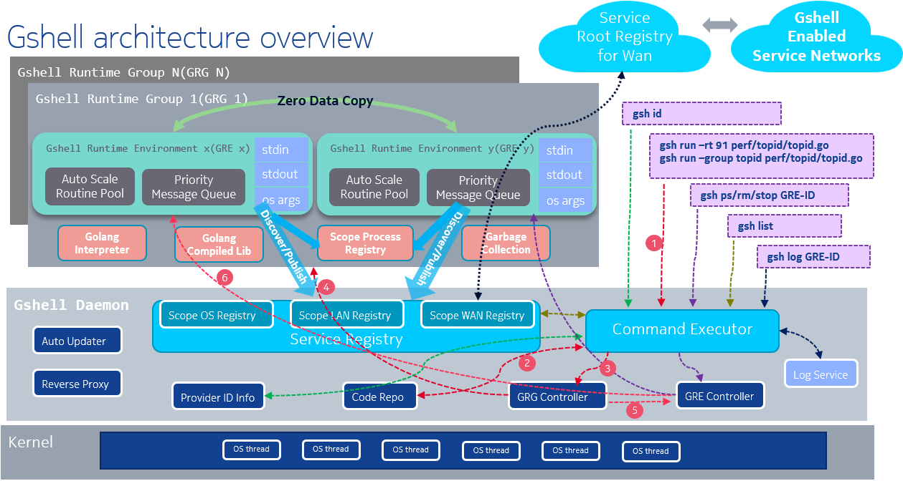

我在[gshellos](https://github.com/godevsig/gshellos)使用了go plugin, 这里记录一下心得.

gshellos是个面向消息的go微服务开发框架:
* 纯go写的
* server发布服务, client发现服务
* server定义消息, 即server定义它可以处理哪些事务, client直接给server发消息来请求server处理该事务
* 需要高性能的go代码编译进二进制文件
* 需要灵活性的go代码使用[yaegi](https://github.com/traefik/yaegi)解释运行
* 使用了类似docker的daemon架构: 
  * 一个gshell daemon在后台运行, 提供服务注册/发现等基础服务, 同时负责启动和管理多个gshell runtime group
  * gshell runtime group(GRG)提供了一个独立的运行环境, 提供golang解释器, 共享编译后的golang库, 支持进程间的服务发现
  * 在GRG内部, 可以启动多个gshell runtime environment(GRE)实例. 每个GRE实例都有独立的标准输入输出, 自动伸缩的worker池, 优先级消息队列等
* 支持多CPU架构, 不同的CPU架构之间消息可互通



- [gshellos的扩展性](#gshellos的扩展性)
- [加入plugin支持](#加入plugin支持)
  - [golang的plugin机制](#golang的plugin机制)
  - [如何制作gshell plugin](#如何制作gshell-plugin)


# gshellos的扩展性
gshell通过集成其他已有的go代码来提供用户功能.

gshell在`extension/extension.go`中, 定义了
```go
package extension

import "reflect"

var BuiltinSymbols = map[string]map[string]reflect.Value{}
```
对一个目标功能, 比如`github.com/godevsig/glib/sys/shell`, 利用[yaegi](https://github.com/traefik/yaegi)解释器, 使用golang的反射机制先把原始go代码的符号导入到`BuiltinSymbols`:
```go
// Code generated by 'yaegi extract github.com/godevsig/glib/sys/shell'. DO NOT EDIT.

//go:build shell
// +build shell

package extension

import (
	"github.com/godevsig/glib/sys/shell"
	"reflect"
)

func init() {
	BuiltinSymbols["github.com/godevsig/glib/sys/shell/shell"] = map[string]reflect.Value{
		// function, constant and variable definitions
		"New":     reflect.ValueOf(shell.New),
		"Run":     reflect.ValueOf(shell.Run),
		"RunWith": reflect.ValueOf(shell.RunWith),

		// type definitions
		"Shell": reflect.ValueOf((*shell.Shell)(nil)),
	}
}
```

在GRE中创建解释器实例的时候, 会使用这些符号:
```go
i := interp.New(opt)
i.Use(stdlib.Symbols)
i.Use(unsafe.Symbols)
i.Use(extension.BuiltinSymbols)
i.ImportUsed()
```

通过这个机制, gshell可以把已有的其他go工程的代码, 导入到extension中.
* 因为`import`了目标package, 并遍历了其所有符号, 所以目标代码被**全部编译**进了gshell二进制文件.
* 通过`i.Use(extension.BuiltinSymbols)`, 可以让`gshell run`的解释运行的代码也能**调用**这些在二进制文件里的符号.

这样虽好, 但问题是随着集成的功能越来越多, 最后编译出来的gshell二进制的size也会越来越大.

在开发gshell的早期, 已经把下面的几个功能都编译进`BuiltinSymbols`, 从而下面的代码都已经全部进入了gshell的bin.
```go
//go:generate ./gen_symbols github.com/godevsig/adaptiveservice

//go:generate ./gen_symbols github.com/godevsig/glib/sys/shell
//go:generate ./gen_symbols github.com/godevsig/glib/sys/log -fixlog
//go:generate ./gen_symbols github.com/godevsig/glib/sys/pidinfo

//go:generate ./gen_symbols github.com/godevsig/grepo/fileserver
//go:generate ./gen_symbols github.com/godevsig/grepo/echo -extramsg
//go:generate ./gen_symbols github.com/godevsig/grepo/asbench
//go:generate ./gen_symbols github.com/godevsig/grepo/topidchart -extramsg
//go:generate ./gen_symbols github.com/godevsig/grepo/recorder -extramsg
//go:generate ./gen_symbols github.com/godevsig/grepo/docit
```

# 加入plugin支持
如前所述, 一直用`BuiltinSymbols`增加功能不可持续, 所以现在extension模块增加了`PluginSymbols`:
```go
package extension

import "reflect"

// BuiltinSymbols variable stores the map of symbols per built-in package.
var BuiltinSymbols = map[string]map[string]reflect.Value{}

// PluginSymbols variable stores the map of symbols per plugin.
var PluginSymbols = map[string]map[string]reflect.Value{}
```

对一个目标package, 比如`github.com/godevsig/grepo/echo`, 同样也是先生成其反射版本的符号, `github_com-godevsig-grepo-echo.go`:
```go
package main

import (
	"github.com/godevsig/grepo/echo"
	"go/constant"
	"go/token"
	"reflect"
)

func Export() (string, map[string]reflect.Value) {
	return "github.com/godevsig/grepo/echo/echo", map[string]reflect.Value{
		// function, constant and variable definitions
		"NewServer":   reflect.ValueOf(echo.NewServer),
		"Publisher":   reflect.ValueOf(constant.MakeFromLiteral("\"example\"", token.STRING, 0)),
		"ServiceEcho": reflect.ValueOf(constant.MakeFromLiteral("\"echo.v1.0\"", token.STRING, 0)),

		// type definitions
		"Reply":           reflect.ValueOf((*echo.Reply)(nil)),
		"Request":         reflect.ValueOf((*echo.Request)(nil)),
		"Server":          reflect.ValueOf((*echo.Server)(nil)),
		"SubWhoElseEvent": reflect.ValueOf((*echo.SubWhoElseEvent)(nil)),
		"WhoElse":         reflect.ValueOf((*echo.WhoElse)(nil)),
	}
}
```
再用golang的`-buildmode=plugin`模式来编译:
```shell
CGO_ENABLED=1 go build -buildmode=plugin github_com-godevsig-grepo-echo.go
mv github_com-godevsig-grepo-echo.so github_com-godevsig-grepo-echo.gplugin
```

和`BuiltinSymbols`不同, 这里使用了一个函数`func Export()`来返回`string, map[string]reflect.Value`.

这个`.gplugin`文件就是个`.so`文件, 在gshell启动时, load这些plugin:
```go
func loadPlugins(pluginDir string) error {
	if _, err := os.Stat(pluginDir); err != nil {
		return nil // no such path, assume ok
	}
	var allErr error
	if err := filepath.WalkDir(pluginDir, func(path string, d fs.DirEntry, err error) error {
		if err != nil {
			return err
		}
		if d.Type().IsRegular() && strings.HasSuffix(d.Name(), ".gplugin") {
			p, err := plugin.Open(path)
			if err != nil {
				allErr = fmt.Errorf("open plugin %s error: %v; %v", path, err, allErr)
				return nil
			}
			export, err := p.Lookup("Export")
			if err != nil {
				allErr = fmt.Errorf("symbol lookup error in plugin %s: %v; %v", path, err, allErr)
				return nil
			}

			name, symbols := export.(func() (string, map[string]reflect.Value))()
			if len(name) != 0 && len(symbols) != 0 {
				if _, has := extension.PluginSymbols[name]; !has {
					extension.PluginSymbols[name] = symbols
				}
			}
		}
		return nil
	}); err != nil {
		allErr = fmt.Errorf("walk dir %s error: %v; %v", pluginDir, err, allErr)
	}
	if allErr != nil {
		return allErr
	}
	return nil
}

func listPlugins() []string {
	var plugins []string
	for name := range extension.PluginSymbols {
		plugins = append(plugins, name)
	}
	sort.Strings(plugins)
	return plugins
}
```

关键点:
* `plugin.Open()`来打开`.gplugin`文件
* `p.Lookup("Export")`来找到gplugin里面的`func Export() (string, map[string]reflect.Value)`
* `name, symbols := export.(func() (string, map[string]reflect.Value))()`强转成`func() (string, map[string]reflect.Value)`再调用, 得到其符号
* 最后add进`extension.PluginSymbols`

同样的, 在初始化解释器的时候, 也要使用`extension.PluginSymbols`这个map
```
i := interp.New(opt)
i.Use(stdlib.Symbols)
i.Use(unsafe.Symbols)
i.Use(extension.BuiltinSymbols)
i.Use(extension.PluginSymbols)
i.ImportUsed()
```

## golang的plugin机制
go的标准库提供了plugin机制:
> Package plugin implements loading and symbol resolution of Go plugins.
>
> A plugin is a **Go main** package with **exported functions and variables** that has been built with:
```
go build -buildmode=plugin
```
> When a plugin is first opened, the init functions of all packages not already part of the program are called. The main function is not run. A plugin is only initialized once, and cannot be closed.

* 必须是main package
* 只能导出大写的函数和变量
* plugin只在被第一次加载的时候会调用其init函数, plugin只能被初始化一次
* main函数不会run, 所以plugin里面定义main没有意义
* plugin不能被close, 只能跟着"宿主"程序关闭
* Runtime crashes are likely to occur unless all parts of the program (the application and all its plugins) are compiled using exactly the same version of the toolchain, the same build tags, and the same values of certain flags and environment variables.
* Similar crashing problems are likely to arise unless all common dependencies of the application and its plugins are built from exactly the same source code.

根据我的观察, 还有其他要点:
* `go build -buildmode=plugin`编译plugin阶段, 会把所有import的package都编译进`.so`, 这样如果有个基础的package同时被宿主main package import, 或者被其他plugin import, 这个package会被重复编译, 重复存在于各个`.so`和main program的bin中.
* 还是这个被import多次的基础package `base`, 如果其中有个变量被宿主main使用, 宿主main又load了一个plugin, 这个plugin同样也使用了packge `base`的变量, 那么运行时这个变量只有一份有效, 整个程序, 包括所有的plugin, 都只会用这一份变量.
* 总结: 对于一个common package的依赖, 会有多份编译后的拷贝, 但运行时只有一份有效. go的runtime会保证main 和每个plugin的初始化只有一次, 他们公共的变量只有一份被load到内存.

## 如何制作gshell plugin
有了plugin功能之后, gshell可以独立发布了. 当其他的项目需要制作gshell plugin的时候, 只需要调用gshell项目下的`gen_symbols`.
```
../extension/gen_symbols -plugin github.com/godevsig/grepo/echo
CGO_ENABLED=1 go build -buildmode=plugin github_com-godevsig-grepo-echo.go
mv github_com-godevsig-grepo-echo.so github_com-godevsig-grepo-echo.gplugin
```