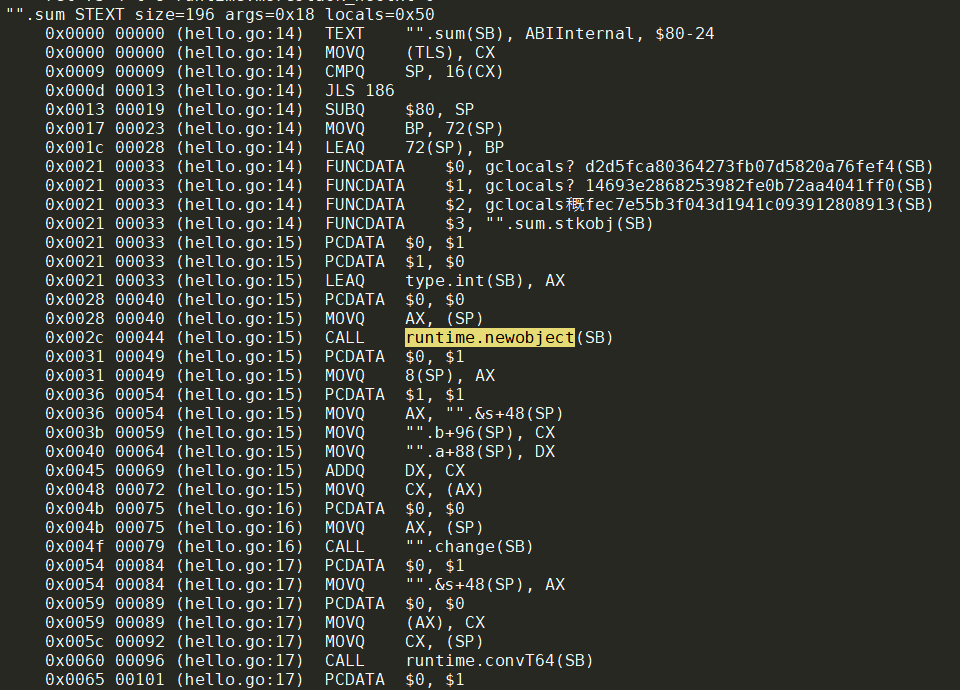
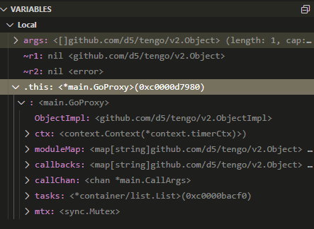
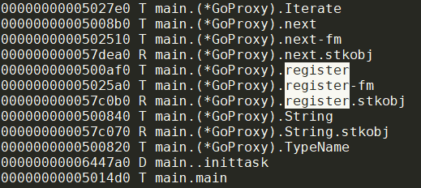
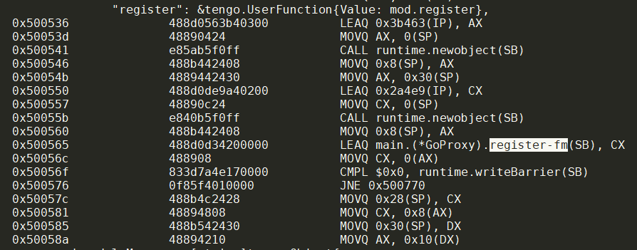

- [增加VM的并发run](#增加vm的并发run)
  - [编译函数](#编译函数)
  - [VM执行函数](#vm执行函数)
  - [函数怎么调用的?](#函数怎么调用的)
    - [编译阶段](#编译阶段)
    - [执行阶段](#执行阶段)
  - [函数怎么退出的?](#函数怎么退出的)
  - [如何理解字节码?](#如何理解字节码)
  - [运行时会改变/增加/删除 global或constant数组吗?](#运行时会改变增加删除-global或constant数组吗)
  - [CompiledFunction的Free对象指针数组是干什么的?](#compiledfunction的free对象指针数组是干什么的)
    - [运行阶段](#运行阶段)
    - [结论](#结论)
  - [例子](#例子)
- [tengo指令集和go的操作码](#tengo指令集和go的操作码)
- [tengo运行过程](#tengo运行过程)
  - [初始状态](#初始状态)
  - [`a := 1` 后](#a--1-后)
  - [`b := 2` 后](#b--2-后)
  - [`c := a+b` 后](#c--ab-后)
  - [`f := func(a, b) { return a + b }` 后](#f--funca-b--return-a--b--后)
  - [FormatConstants函数](#formatconstants函数)
  - [那么什么是constant?](#那么什么是constant)
    - [constants在何处使用, 在何处定义](#constants在何处使用-在何处定义)
    - [为什么constants要传递给NewCompiler?](#为什么constants要传递给newcompiler)
- [extension](#extension)
  - [为什么extension.UserFunction不生效? -- 注意Copy()方法](#为什么extensionuserfunction不生效----注意copy方法)
    - [调查](#调查)
    - [结论](#结论-1)
  - [bash](#bash)
    - [能够在bash的命令里引用脚本的变量吗?](#能够在bash的命令里引用脚本的变量吗)
      - [解决方法](#解决方法)
  - [添加新的builtin函数ex()](#添加新的builtin函数ex)
    - [能否添加到builtinFuncs表](#能否添加到builtinfuncs表)
    - [添加到global表](#添加到global表)
- [tengo代码](#tengo代码)
  - [examples/interoperability/main.go](#examplesinteroperabilitymaingo)
    - [可被注册的对象: native go](#可被注册的对象-native-go)
    - [可被注册的对象: tengo脚本](#可被注册的对象-tengo脚本)
    - [native go对象穿越脚本的黑魔法](#native-go对象穿越脚本的黑魔法)
      - [dlv调查](#dlv调查)
      - [对象穿越魔法揭秘](#对象穿越魔法揭秘)
      - [使用注意](#使用注意)
    - [总结](#总结)
  - [tengo锁](#tengo锁)
  - [tengo并发](#tengo并发)
  - [代码组织:](#代码组织)
    - [总结](#总结-1)
    - [error.go](#errorgo)
    - [require/require.go](#requirerequirego)
    - [parser/opcodes.go](#parseropcodesgo)
    - [parser/source_file.go](#parsersource_filego)
    - [parser/parser.go](#parserparsergo)
      - [NewParser()函数](#newparser函数)
      - [ParseFile()函数](#parsefile函数)
    - [formatter.go](#formattergo)
      - [Pool对象池技术](#pool对象池技术)
    - [tengo.go](#tengogo)
      - [`FromInterface()`和`ToInterface()`函数是go和脚本交互的核心](#frominterface和tointerface函数是go和脚本交互的核心)
      - [什么是callable对象](#什么是callable对象)
      - [`CountObjects`这个递归函数写的真好](#countobjects这个递归函数写的真好)
    - [script.go](#scriptgo)
      - [Script.Add用于从native go添加变量到tengo脚本](#scriptadd用于从native-go添加变量到tengo脚本)
      - [NewScript](#newscript)
      - [Compile函数](#compile函数)
      - [preCompile()函数](#precompile函数)
      - [RemoveDuplicates()去掉重复常量?](#removeduplicates去掉重复常量)
      - [RunContext()函数](#runcontext函数)
      - [Run函数](#run函数)
    - [variable.go](#variablego)
    - [builtins.go](#builtinsgo)
    - [compiler.go](#compilergo)
      - [Compile()函数](#compile函数-1)
      - [emit()函数](#emit函数)
      - [Compile之module](#compile之module)
      - [compileModule()函数](#compilemodule函数)
      - [module默认路径](#module默认路径)
      - [Bytecode()函数返回编译好的字节码](#bytecode函数返回编译好的字节码)
    - [modules.go](#modulesgo)
      - [module类型: 支持import native go对象和tengo代码](#module类型-支持import-native-go对象和tengo代码)
    - [symbol_table.go](#symbol_tablego)
      - [NewSymbolTable()函数](#newsymboltable函数)
      - [Define()函数](#define函数)
      - [builtin符号除了保存在store中, 还保存在单独的builtinSymbols中](#builtin符号除了保存在store中-还保存在单独的builtinsymbols中)
      - [Fork()函数](#fork函数)
      - [Resolve()函数](#resolve函数)
      - [总结](#总结-2)
    - [vm.go](#vmgo)
      - [VM New函数](#vm-new函数)
      - [VM Run函数](#vm-run函数)
      - [vm.run总结](#vmrun总结)
    - [stdlib/func_typedefs.go](#stdlibfunc_typedefsgo)
- [tengo的后继](#tengo的后继)
- [tengo](#tengo)
  - [入门](#入门)
  - [语法](#语法)
    - [token](#token)
  - [一个go调脚本的例子](#一个go调脚本的例子)
    - [所有都是值类型](#所有都是值类型)
    - [tengo值类型和go类型](#tengo值类型和go类型)
    - [error升级为一等类型](#error升级为一等类型)
    - [值不可变](#值不可变)
    - [未定义也是一种类型](#未定义也是一种类型)
    - [广义的array和map](#广义的array和map)
    - [函数也是值, 一等公民, 支持闭包](#函数也是值-一等公民-支持闭包)
    - [变量scope](#变量scope)
    - [内置类型转换](#内置类型转换)
    - [支持三目操作](#支持三目操作)
    - [`[]`和`.`能作用于复合类型:array map string和bytes](#和能作用于复合类型array-map-string和bytes)
    - [再切片和go一样](#再切片和go一样)
    - [if支持前置执行语句, 和go一样; for的结构也和go一样样的; for支持 for in](#if支持前置执行语句-和go一样-for的结构也和go一样样的-for支持-for-in)
    - [其他和native go的不同点](#其他和native-go的不同点)
  - [内置函数](#内置函数)
  - [被嵌入执行](#被嵌入执行)
    - [直接代码执行](#直接代码执行)
    - [代码实时"编译"后执行](#代码实时编译后执行)
    - [外部代码里import](#外部代码里import)
  - [用户可以自定义类型](#用户可以自定义类型)
    - [自定义类型举例](#自定义类型举例)
    - [增加更多功能](#增加更多功能)
    - [总结](#总结-3)
  - [模块化和标准库](#模块化和标准库)
    - [标准库](#标准库)
  - [runtime对象类型](#runtime对象类型)
  - [安全性](#安全性)
  - [并发](#并发)
  - [这里说的VM感觉就是编译后的"表达树"?](#这里说的vm感觉就是编译后的表达树)
    - [官方例子](#官方例子)
  - [更多官方例子](#更多官方例子)
    - [gento代码转成lua](#gento代码转成lua)
    - [有限状态机](#有限状态机)

# 增加VM的并发run
思路是浅拷贝当前的VM, 来run一个compiledFunc
## 编译函数
在`compiler.go`中
```go
// Compile compiles the AST node.
func (c *Compiler) Compile(node parser.Node) error {
    case *parser.FuncLit: //函数编译
        c.enterScope()

        for _, p := range node.Type.Params.List {
            s := c.symbolTable.Define(p.Name)

            // function arguments is not assigned directly.
            s.LocalAssigned = true
        }

        if err := c.Compile(node.Body); err != nil {
            return err
        }

        // code optimization
        c.optimizeFunc(node)

        freeSymbols := c.symbolTable.FreeSymbols() //FreeSymbols函数返回"原始"symbol, 即被捕获的symbol, 所以才包含ScopeLocal和ScopeFree两个类型
        numLocals := c.symbolTable.MaxSymbols()
        instructions, sourceMap := c.leaveScope()

        for _, s := range freeSymbols { //这段没看明白, 这里已经是父函数scope, OpGetFreePtr到栈上? -- 是的. 在定义的时候就把子函数的free变量全部放到栈上备用. 对应VM的OpClosure会把这些free变量放到其
            switch s.Scope {
            case ScopeLocal:
                if !s.LocalAssigned {
                    c.emit(node, parser.OpNull)
                    c.emit(node, parser.OpDefineLocal, s.Index)
                    s.LocalAssigned = true
                }
                c.emit(node, parser.OpGetLocalPtr, s.Index) //捕获了父函数的local变量, s.Index是local变量在栈上相对basePointer的index
            case ScopeFree:
                c.emit(node, parser.OpGetFreePtr, s.Index) //捕获了父函数的free变量, index是父函数freeVar数组中的index
            }
        }

        compiledFunction := &CompiledFunction{
            Instructions:  instructions,
            NumLocals:     numLocals,
            NumParameters: len(node.Type.Params.List),
            VarArgs:       node.Type.Params.VarArgs,
            SourceMap:     sourceMap,
        }
        if len(freeSymbols) > 0 {
            c.emit(node, parser.OpClosure,
                c.addConstant(compiledFunction), len(freeSymbols))
        } else {
            c.emit(node, parser.OpConstant, c.addConstant(compiledFunction))
        }
    case *parser.CallExpr: //函数调用
        if err := c.Compile(node.Func); err != nil {
            return err
        }
        for _, arg := range node.Args {
            if err := c.Compile(arg); err != nil {
                return err
            }
        }
        ellipsis := 0
        if node.Ellipsis.IsValid() {
            ellipsis = 1
        }
        c.emit(node, parser.OpCall, len(node.Args), ellipsis) //OpCall操作码
}
```

## VM执行函数
```go
func (v *VM) run() {
        case parser.OpCall:
            numArgs := int(v.curInsts[v.ip+1])
            spread := int(v.curInsts[v.ip+2])
            v.ip += 2 //对应编译阶段的emit Opcall, 参数个数, 是否变长

            //比如两个参数的func, 栈是
            //sp-->|      |
            //sp-1 | arg1 |
            //sp-2 | arg0 |
            //sp-3 | func |
            value := v.stack[v.sp-1-numArgs] //sp-3的object就是func
            if !value.CanCall() {
                v.err = fmt.Errorf("not callable: %s", value.TypeName())
                return
            }

            if spread == 1 { //如果最后的参数是变长的, 则那个object必然是array; 把array的成员都展开到栈上, 栈向上增长. 更新numArgs的值
                v.sp--
                switch arr := v.stack[v.sp].(type) {
                case *Array:
                    for _, item := range arr.Value {
                        v.stack[v.sp] = item
                        v.sp++
                    }
                    numArgs += len(arr.Value) - 1
                case *ImmutableArray:
                    for _, item := range arr.Value {
                        v.stack[v.sp] = item
                        v.sp++
                    }
                    numArgs += len(arr.Value) - 1
                default:
                    v.err = fmt.Errorf("not an array: %s", arr.TypeName())
                    return
                }
            }

            if callee, ok := value.(*CompiledFunction); ok {
                if callee.VarArgs {
                    // if the closure is variadic,
                    // roll up all variadic parameters into an array
                    realArgs := callee.NumParameters - 1
                    varArgs := numArgs - realArgs
                    if varArgs >= 0 {
                        numArgs = realArgs + 1
                        args := make([]Object, varArgs)
                        spStart := v.sp - varArgs
                        for i := spStart; i < v.sp; i++ {
                            args[i-spStart] = v.stack[i]
                        }
                        v.stack[spStart] = &Array{Value: args} //这里的操做看起来和上面在栈上展开array正好相反, 把栈上展开后的变长参数们还原回array, 再放到栈上. -- 为啥这样搞? -- 因为要兼容调用native go代码的形式, native go里面, 参数都是变长传入的.
                        v.sp = spStart + 1
                    }
                }
                if numArgs != callee.NumParameters {
                    if callee.VarArgs {
                        v.err = fmt.Errorf(
                            "wrong number of arguments: want>=%d, got=%d",
                            callee.NumParameters-1, numArgs)
                    } else {
                        v.err = fmt.Errorf(
                            "wrong number of arguments: want=%d, got=%d",
                            callee.NumParameters, numArgs)
                    }
                    return
                }

                // test if it's tail-call
                if callee == v.curFrame.fn { // recursion
                    nextOp := v.curInsts[v.ip+1]
                    if nextOp == parser.OpReturn ||
                        (nextOp == parser.OpPop &&
                            parser.OpReturn == v.curInsts[v.ip+2]) {
                        for p := 0; p < numArgs; p++ {
                            v.stack[v.curFrame.basePointer+p] =
                                v.stack[v.sp-numArgs+p]
                        }
                        v.sp -= numArgs + 1
                        v.ip = -1 // reset IP to beginning of the frame
                        continue
                    }
                }
                if v.framesIndex >= MaxFrames {
                    v.err = ErrStackOverflow
                    return
                }

                // update call frame
                v.curFrame.ip = v.ip // store current ip before call
                v.curFrame = &(v.frames[v.framesIndex]) //framesIndex是提前++的, 所以这里就是下一个frame
                v.curFrame.fn = callee
                v.curFrame.freeVars = callee.Free
                v.curFrame.basePointer = v.sp - numArgs //帧指针的初值是sp的当前值减去参数个数
                v.curInsts = callee.Instructions
                v.ip = -1
                v.framesIndex++
                v.sp = v.sp - numArgs + callee.NumLocals //给局部变量留好空间, callee.NumLocals包括了arg的个数
            }
}
```

举例, 比如2个arg和4个局部变量的栈的初始情况
```
                    |             | <-- v.sp(frame n)
                    | local obj 3 |
                    | local obj 2 |
                    | local obj 1 |
v.sp(frame n-1) --> | local obj 0 |
                    | arg obj 1   |
                    | arg obj 0   | <-- v.curFrame.basePointer
```

## 函数怎么调用的?
比如下面的代码
```go
fn := func(i) { return i+1 }
...

res := fn(5) //res=6
```
是如何编译执行的?
### 编译阶段
1. 编译器发现是`case *parser.FuncLit:`, 就编译`func(i) { return i+1 }`, 生成`compiledFunction`对象, 并把这个对象放到constant数组里, emit OpConstant操作码: `c.emit(node, parser.OpConstant, c.addConstant(compiledFunction))`; 如果是闭包函数, emit `parser.OpClosure`操做码.
2. tengo不支持声明函数, 而是用赋值模式. 那么上面一步把`func(i) { return i+1 }`编译完成后, 把compiledFunction对象保存到constant数组, 并马上放到栈上. 因为接下来就是赋值操做
3. 编译器发现接下来马上是`case *parser.AssignStmt:`对`fn`变量赋值: 在确定`fn`的符号位置后, 发送操作码到字节码:
```go
c.emit(node, parser.OpSetGlobal, symbol.Index)
//或
c.emit(node, parser.OpSetLocal, symbol.Index)
//或
c.emit(node, parser.OpSetFree, symbol.Index)
```
4. 现在假设代码运行到某处, 需要调用fn:`res := fn(5)`. 编译器需要先解析fn这个符号. 这个例子中fn就是符号引用, 但更复杂的情况可以是`res := someMap.fn(5)`, 下面`c.Compile(node.Func)`就是解析这个表达式, 最终get到这个compiledFunction对象fn:  
这里面包括两个过程:  
   * 4.1. 先把fn放到栈上
   * 4.2. 依次编译args, 把结果args对象依次放到栈上
```go
    case *parser.CallExpr:
        if err := c.Compile(node.Func); err != nil { //最终对应*parser.Ident来确定符号, 对应emit的操做码是OpGetGlobal或OpGetLocal或OpGetBuiltin或OpGetFree, 效果是把compiledFunction对象fn放到栈上
            return err
        }
        for _, arg := range node.Args { //比如这里的arg就是5, 它是个*parser.IntLit, 对应emit操作码OpConstant, 把5放到栈上
            if err := c.Compile(arg); err != nil {
                return err
            }
        }
        ellipsis := 0
        if node.Ellipsis.IsValid() {
            ellipsis = 1
        }
        c.emit(node, parser.OpCall, len(node.Args), ellipsis) //最后emit OpCall
```
比如
```
            //比如两个参数的func, 栈是
            //sp-->|      |
            //sp-1 | arg1 |
            //sp-2 | arg0 |
            //sp-3 | func |
```


### 执行阶段
VM负责执行
1. 对应编译阶段的前三步, VM执行`fn := func(i) { return i+1 }`, 效果是把fn这个compiledFunction对象先临时保存在`v.stack[v.sp-1]`中, 再根据变量scope, 保存在下面三种变量区的一个
    * 全局对象区, 即vm的globals数组中
    * 栈中: 因为上一步已经把fn放在了`v.stack[v.sp-1]`, 这里做的就是把`v.stack[v.sp-1]`赋值给`v.stack[v.curFrame.basePointer + localIndex]`. 这个localIndex是操做码里指定的, 编译阶段就知道了
    * frame的free数组中: `*v.curFrame.freeVars[freeIndex].Value = v.stack[v.sp-1]`
      
2. VM执行到函数执行阶段`res := fn(5)`时:
对应`case parser.OpCall:`
```
            //比如两个参数的func, 栈是
            //sp-->|      |
            //sp-1 | arg1 |
            //sp-2 | arg0 |
            //sp-3 | func |
```
进入下一个栈帧前, 做准备:
* 保存当前ip到父栈帧
* 准备空的栈帧, 栈帧切换到子函数
* 子栈帧的fn为子函数callee
* 子栈帧的freeVars为callee.Free, 此时callee.Free里面已经准备好了
* 因为参数是父栈帧准备的, 这里子栈帧的basePointer = v.sp - numArgs
* 子栈帧的字节码为callee.Instructions
* 子栈帧的ip从-1开始, 正好下一次从0开始执行
* 把local变量的位置留出来, 子栈帧的sp从local变量区顶部开始.
进入下一个栈帧, 从ip=0开始执行fn.Instructions

```
                    |             | <-- v.sp(frame n)
                    | local obj 3 |
                    | local obj 2 |
                    | local obj 1 |
v.sp(frame n-1) --> | local obj 0 |
                    | arg obj 1   |
                    | arg obj 0   | <-- v.curFrame.basePointer
```

## 函数怎么退出的?
在编译阶段, 空的return会`c.emit(node, parser.OpReturn, 0)`
return一个表达式的情况, 会先编译这个表达式, 最终的结果对象放到栈顶, 然后`c.emit(node, parser.OpReturn, 1)`

执行阶段, 如果发现OpReturn的第二个操作数是1, 就从栈上拿到返回值; 然后还原栈帧, 还原sp, 并把返回值放到栈顶(此时已经是父函数的栈了).

## 如何理解字节码?
看这个文件`compiler_test.go`

## 运行时会改变/增加/删除 global或constant数组吗?
首先, constant数组是在编译时确定的, 在运行时不改变.
其次, global数组是可以更改的, 但不需要增加/删除, 因为对global的操做的index是在编译时就确定的.

## CompiledFunction的Free对象指针数组是干什么的?
在编译阶段, Resolve symbol的时候, 这个symbol可以是global的, 也可以是自己函数局部的, 还可以是父级函数路径上的局部函数. 最后这种情况就是free变量.
> if symbol is defined in parent table and if it's not global/builtin then it's free variable.

free变量是一路父函数上的局部变量, resolve要化不少代价, 所以在编译生成函数对象`CompiledFunction`的时候就用`Free          []*ObjectPtr`来保存对"捕获"的父函数局部变量的指针. 

### 运行阶段
只有闭包函数有free变量, 闭包在编译的时候, emit的是OpClosure, 在这之前free变量已经从父函数的local区和free区拷贝到栈上了.
```go
        if len(freeSymbols) > 0 {
            c.emit(node, parser.OpClosure,
                c.addConstant(compiledFunction), len(freeSymbols))
        } else {
            c.emit(node, parser.OpConstant, c.addConstant(compiledFunction))
        }
```
那么运行时
```go
case parser.OpClosure:
    v.ip += 3
    constIndex := int(v.curInsts[v.ip-1]) | int(v.curInsts[v.ip-2])<<8
    numFree := int(v.curInsts[v.ip])
    fn, ok := v.constants[constIndex].(*CompiledFunction)
    if !ok {
        v.err = fmt.Errorf("not function: %s", fn.TypeName())
        return
    }
    free := make([]*ObjectPtr, numFree) //分配free var的数组
    for i := 0; i < numFree; i++ {
        switch freeVar := (v.stack[v.sp-numFree+i]).(type) { //已经由前一个操作码(parser.FuncLit)提前把所有free变量连续的放到栈上了. 这里拷贝到free数组
        case *ObjectPtr:
            free[i] = freeVar
        default:
            free[i] = &ObjectPtr{
                Value: &v.stack[v.sp-numFree+i],
            }
        }
    }
    v.sp -= numFree
    cl := &CompiledFunction{
        Instructions:  fn.Instructions,
        NumLocals:     fn.NumLocals,
        NumParameters: fn.NumParameters,
        VarArgs:       fn.VarArgs,
        Free:          free, //到这里free数组已经ok
    }
    v.allocs--
    if v.allocs == 0 {
        v.err = ErrObjectAllocLimit
        return
    }
    v.stack[v.sp] = cl
    v.sp++
    

```
OpClosure操作码后面应该是接着赋值操做.

还有几个case:
* OpGetFreePtr:从freeVars数组取index对应的ptr到栈顶
* OpGetFree: 从freeVars数组取index的ptr的Value到栈顶
* OpSetFree: 栈顶obj赋值给freeVars数组index对应的ptr, 注意是赋值给`*ptr`
* OpGetLocalPtr: 把本frame的指定local变量`v.stack[v.curFrame.basePointer + localIndex]`, 封装为`*ObjectPtr`, 放到栈顶.
* OpSetSelFree: 把selectors序列对应的对象依次写入v.curFrame.freeVars

### 结论
* 子函数可以是普通的函数, 也可以是Closure, 他们都是compiledFunction. 区别在于函数声明后, 必定会赋值到一个变量. 到变量赋值这里后, closure的compiledFunction的Free域就有值了, 这些值是指针, 是对free变量的指针表.
* 闭包对free变量的访问不是去父函数路径上的栈里去找, 而是去自己的free变量的指针表里操做.

## 例子
比如下面的代码
```go
f1 := func(a, b) { return a + b}; func(fn, ...args){ return fn(args...) }(f1, 1, 2)
```
会被编译成
```go
0000 CONST   0     //对应第一个函数从const 0取到栈顶
0003 SETG    0     //对应f1的赋值
0006 CONST   1     //对应第二个函数从const 1取到栈顶
0009 GETG    0     //对应f1入参
0012 CONST   2     //对应常量1入参
0015 CONST   3     //对应常量2入参
0018 CALL    3     0     //对应函数调用
0021 POP           //对应这块代码无返回值
0022 SUSPEND       //对应这块代码的结束
```
对应的const数组
```go
[  0] (Compiled Function|0xc0000946e8)
     0000 GETL    0    //对应得到入参a
     0002 GETL    1    //对应得到入参b
     0004 BINARYOP 11  //a+b
     0006 RET     1    //return 值
[  1] (Compiled Function|0xc0000946f0)
     0000 GETL    0    //对应得到fn
     0002 GETL    1    //对应应该传入的args
     0004 CALL    1     1    //call一个参数, 最后一个参数变长
     0007 RET     1    //return栈上的值
[  2] 1 (Int|0xc0000fd1e0)
[  3] 2 (Int|0xc0000fd200)
```

# tengo指令集和go的操作码
GO的编译器也有自己一套的”操作码”.  

是对所有CPU指令集的common抽象, 比如下面的CALL就相当于MIPS指令集的jal或者ARM的blr

Tengo的指令级比这个”高阶”, 比如数据访问永远都是以obj为单位. 但基本上思路是一样的.

  

# tengo运行过程
在REPL中加打印, 主要考察符号表, 全局变量, 和constants
## 初始状态
```go
symbols: &tengo.SymbolTable{parent:(*tengo.SymbolTable)(nil), block:false, store:map[string]*tengo.Symbol{"ex":(*tengo.Symbol)(0xc0000df980), "show":(*tengo.Symbol)(0xc0000df9e0)}, numDe$
inition:2, maxDefinition:2, freeSymbols:[]*tengo.Symbol(nil), builtinSymbols:[]*tengo.Symbol(nil)}
```
没有父table, 是全局符号表. 里面有内建的两个函数: ex和show. 没毛病
constant为空
global只有两个, 对应ex和show. 没毛病
```go
globals: []tengo.Object{(*tengo.UserFunction)(0xc0000df9b0), (*tengo.UserFunction)(0xc0000dfa10), ...后面都是nil
```
## `a := 1` 后
symtable由于第一次执行后, 多了内置的很多函数, 也多了变量a
```go
symbols: &tengo.SymbolTable{parent:(*tengo.SymbolTable)(nil), 
block:false, store:map[string]*tengo.Symbol{"a":(*tengo.Symbol)(0xc00018e690), "append":(*tengo.Symbol)(0xc00018e0f0), "bool":(*tengo.Symbol)(0xc00018e1e0), "bytes":(*tengo.Symbol)(0xc00018e270), "char":(*tengo.Symbol)(0xc00018e240), "copy":(*tengo.Symbol)(0xc00018e0c0), "delete":(*tengo.Symbol)(0xc00018e120), "ex":(*tengo.Symbol)(0xc0000df980), "float":(*tengo.Symbol)(0xc00018e210), "format":(*tengo.Symbol)(0xc00018e600), "int":(*tengo.Symbol)(0xc00018e1b0), "is_array":(*tengo.Symbol)(0xc00018e3f0), "is_bool":(*tengo.Symbol)(0xc00018e360), "is_bytes":(*tengo.Symbol)(0xc00018e3c0), "is_callable":(*tengo.Symbol)(0xc00018e5a0), "is_char":(*tengo.Symbol)(0xc00018e390), "is_error":(*tengo.Symbol)(0xc00018e510), "is_float":(*tengo.Symbol)(0xc00018e300), "is_function":(*tengo.Symbol)(0xc00018e570), "is_immutable_array":(*tengo.Symbol)(0xc00018e420), "is_immutable_map":(*tengo.Symbol)(0xc00018e480), "is_int":(*tengo.Symbol)(0xc00018e2d0), "is_iterable":(*tengo.Symbol)(0xc00018e4b0), "is_map":(*tengo.Symbol)(0xc00018e450), "is_string":(*tengo.Symbol)(0xc00018e330), "is_time":(*tengo.Symbol)(0xc00018e4e0), "is_undefined":(*tengo.Symbol)(0xc00018e540), "len":(*tengo.Symbol)(0xc00018e090), "show":(*tengo.Symbol)(0xc0000df9e0), "splice":(*tengo.Symbol)(0xc00018e150), "string":(*tengo.Symbol)(0xc00018e180), "time":(*tengo.Symbol)(0xc00018e2a0), "type_name":(*tengo.Symbol)(0xc00018e5d0)}, 
numDefinition:3, 
maxDefinition:3, 
freeSymbols:[]*tengo.Symbol(nil), 
builtinSymbols:[]*tengo.Symbol{(*tengo.Symbol)(0xc00018e090), (*tengo.Symbol)(0xc00018e0c0), (*tengo.Symbol)(0xc00018e0f0), (*tengo.Symbol)(0xc00018e120), (*tengo.Symbol)(0xc00018e150), (*tengo.Symbol)(0xc00018e180), (*tengo.Symbol)(0xc00018e1b0), (*tengo.Symbol)(0xc00018e1e0), (*tengo.Symbol)(0xc00018e210), (*tengo.Symbol)(0xc00018e240), (*tengo.Symbol)(0xc00018e270), (*tengo.Symbol)(0xc00018e2a0), (*tengo.Symbol)(0xc00018e2d0), (*tengo.Symbol)(0xc00018e300), (*tengo.Symbol)(0xc00018e330), (*tengo.Symbol)(0xc00018e360), (*tengo.Symbol)(0xc00018e390), (*tengo.Symbol)(0xc00018e3c0), (*tengo.Symbol)(0xc00018e3f0), (*tengo.Symbol)(0xc00018e420), (*tengo.Symbol)(0xc00018e450), (*tengo.Symbol)(0xc00018e480), (*tengo.Symbol)(0xc00018e4b0), (*tengo.Symbol)(0xc00018e4e0), (*tengo.Symbol)(0xc00018e510), (*tengo.Symbol)(0xc00018e540), (*tengo.Symbol)(0xc00018e570), (*tengo.Symbol)(0xc00018e5a0), (*tengo.Symbol)(0xc00018e5d0), (*tengo.Symbol)(0xc00018e600)}}
```
constant多了一个
```go
constants: []tengo.Object{(*tengo.Int)(0xc000138028)}
```
globals多了一个, 多的这个和constant多出来的是一个地址.
```go
globals: []tengo.Object{(*tengo.UserFunction)(0xc0000df9b0), (*tengo.UserFunction)(0xc0000dfa10), (*tengo.Int)(0xc000138028)
```
## `b := 2` 后
symbol表多了b, 但似乎其他的符号地址都变了. -- 这里好像有bug
```go
symbols: &tengo.SymbolTable{parent:(*tengo.SymbolTable)(nil), block:false, store:map[string]*tengo.Symbol{"a":(*tengo.Symbol)(0xc00018e690), "append":(*tengo.Symbol)(0xc00020a0f0), "b":(*tengo.Symbol)(0xc00020a690), "bool":(*tengo.Symbol)(0xc00020a1e0), "bytes":(*tengo.Symbol)(0xc00020a270), "char":(*tengo.Symbol)(0xc00020a240), "copy":(*tengo.Symbol)(0xc00020a0c0), "delete":(*tengo.Symbol)(0xc00020a120), "ex":(*tengo.Symbol)(0xc0000df980), "float":(*tengo.Symbol)(0xc00020a210), "format":(*tengo.Symbol)(0xc00020a600), "int":(*tengo.Symbol)(0xc00020a1b0), "is_array":(*tengo.Symbol)(0xc00020a3f0), "is_bool":(*tengo.Symbol)(0xc00020a360), "is_bytes":(*tengo.Symbol)(0xc00020a3c0), "is_callable":(*tengo.Symbol)(0xc00020a5a0), "is_char":(*tengo.Symbol)(0xc00020a390), "is_error":(*tengo.Symbol)(0xc00020a510), "is_float":(*tengo.Symbol)(0xc00020a300), "is_function":(*tengo.Symbol)(0xc00020a570), "is_immutable_array":(*tengo.Symbol)(0xc00020a420), "is_immutable_map":(*tengo.Symbol)(0xc00020a480), "is_int":(*tengo.Symbol)(0xc00020a2d0), "is_iterable":(*tengo.Symbol)(0xc00020a4b0), "is_map":(*tengo.Symbol)(0xc00020a450), "is_string":(*tengo.Symbol)(0xc00020a330), "is_time":(*tengo.Symbol)(0xc00020a4e0), "is_undefined":(*tengo.Symbol)(0xc00020a540), "len":(*tengo.Symbol)(0xc00020a090), "show":(*tengo.Symbol)(0xc0000df9e0), "splice":(*tengo.Symbol)(0xc00020a150), "string":(*tengo.Symbol)(0xc00020a180), "time":(*tengo.Symbol)(0xc00020a2a0), "type_name":(*tengo.Symbol)(0xc00020a5d0)}, numDefinition:4, maxDefinition:4, freeSymbols:[]*tengo.Symbol(nil), builtinSymbols:[]*tengo.Symbol{(*tengo.Symbol)(0xc00018e090), (*tengo.Symbol)(0xc00018e0c0), (*tengo.Symbol)(0xc00018e0f0), (*tengo.Symbol)(0xc00018e120), (*tengo.Symbol)(0xc00018e150), (*tengo.Symbol)(0xc00018e180), (*tengo.Symbol)(0xc00018e1b0), (*tengo.Symbol)(0xc00018e1e0), (*tengo.Symbol)(0xc00018e210), (*tengo.Symbol)(0xc00018e240), (*tengo.Symbol)(0xc00018e270), (*tengo.Symbol)(0xc00018e2a0), (*tengo.Symbol)(0xc00018e2d0), (*tengo.Symbol)(0xc00018e300), (*tengo.Symbol)(0xc00018e330), (*tengo.Symbol)(0xc00018e360), (*tengo.Symbol)(0xc00018e390), (*tengo.Symbol)(0xc00018e3c0), (*tengo.Symbol)(0xc00018e3f0), (*tengo.Symbol)(0xc00018e420), (*tengo.Symbol)(0xc00018e450), (*tengo.Symbol)(0xc00018e480), (*tengo.Symbol)(0xc00018e4b0), (*tengo.Symbol)(0xc00018e4e0), (*tengo.Symbol)(0xc00018e510), (*tengo.Symbol)(0xc00018e540), (*tengo.Symbol)(0xc00018e570), (*tengo.Symbol)(0xc00018e5a0), (*tengo.Symbol)(0xc00018e5d0), (*tengo.Symbol)(0xc00018e600), (*tengo.Symbol)(0xc00020a090), (*tengo.Symbol)(0xc00020a0c0), (*tengo.Symbol)(0xc00020a0f0), (*tengo.Symbol)(0xc00020a120), (*tengo.Symbol)(0xc00020a150), (*tengo.Symbol)(0xc00020a180), (*tengo.Symbol)(0xc00020a1b0), (*tengo.Symbol)(0xc00020a1e0), (*tengo.Symbol)(0xc00020a210), (*tengo.Symbol)(0xc00020a240), (*tengo.Symbol)(0xc00020a270), (*tengo.Symbol)(0xc00020a2a0), (*tengo.Symbol)(0xc00020a2d0), (*tengo.Symbol)(0xc00020a300), (*tengo.Symbol)(0xc00020a330), (*tengo.Symbol)(0xc00020a360), (*tengo.Symbol)(0xc00020a390), (*tengo.Symbol)(0xc00020a3c0), (*tengo.Symbol)(0xc00020a3f0), (*tengo.Symbol)(0xc00020a420), (*tengo.Symbol)(0xc00020a450), (*tengo.Symbol)(0xc00020a480), (*tengo.Symbol)(0xc00020a4b0), (*tengo.Symbol)(0xc00020a4e0), (*tengo.Symbol)(0xc00020a510), (*tengo.Symbol)(0xc00020a540), (*tengo.Symbol)(0xc00020a570), (*tengo.Symbol)(0xc00020a5a0), (*tengo.Symbol)(0xc00020a5d0), (*tengo.Symbol)(0xc00020a600)}}
```
constant多了一个, 就是b
```go
constants: []tengo.Object{(*tengo.Int)(0xc000138028), (*tengo.Int)(0xc00012a178)}
```
globals也多了这一个
```go
globals: []tengo.Object{(*tengo.UserFunction)(0xc0000df9b0), (*tengo.UserFunction)(0xc0000dfa10), (*tengo.Int)(0xc000138028), (*tengo.Int)(0xc00012a178)
```

## `c := a+b` 后
symbol table多了c, 但还是之前的问题: builtin的符号都被重新注册了一次, 地址都变了.  
但constants没有变化, 即c不是constant  
globals多了c, 其他都一样.
```go
globals: []tengo.Object{(*tengo.UserFunction)(0xc0000df9b0), (*tengo.UserFunction)(0xc0000dfa10), (*tengo.Int)(0xc000138028), (*tengo.Int)(0xc00012a178), (*tengo.Int)(0xc0001e4228)
```

## `f := func(a, b) { return a + b }` 后
首先符号表多了f这个没有疑问.
constants多了f, 类型是CompiledFunction
```go
constants: []tengo.Object{(*tengo.Int)(0xc000138028), (*tengo.Int)(0xc00012a178), (*tengo.CompiledFunction)(0xc0000c86e0)}
```
这个f也出现在globals里面
```go
globals: []tengo.Object{(*tengo.UserFunction)(0xc0000df9b0), (*tengo.UserFunction)(0xc0000dfa10), (*tengo.Int)(0xc000138028), (*tengo.Int)(0xc00012a178), (*tengo.Int)(0xc0001e4228), (*ten
go.CompiledFunction)(0xc0000c86e0)
```

## FormatConstants函数
这个函数可以查看constant的值, 比如:
```go
fmt.Println(bytecode.FormatConstants())
```
会打印:
```go
[[  0] 1 (Int|0xc0000f4920) [  1] 2 (Int|0xc0000f4950) [  2] (Compiled Function|0xc0000c4730)      0000 GETL    0          0002 GETL    1          0004 BINARYOP 11         0006 RET     1    ]
```
这个Compiled Function和汇编的风格很像. 同时可以看到FormatConstants函数能够把编译后的字节码打印出来.

## 那么什么是constant?
为什么constants数组在编译和运行时段都存在?  
constants是个对象数组, 保存的是**固定值**的变量, 比如上文的
```go
a := 1
b := 2
f := func(a, b){...}
```

### constants在何处使用, 在何处定义
首先, VM在运行的时候, 在当前指令是`parser.OpConstant`的时候, 回去constants数组找需要的对象:
`v.stack[v.sp] = v.constants[cidx]`
```go
func (v *VM) run() {
    for atomic.LoadInt64(&v.aborting) == 0 {
        v.ip++

        switch v.curInsts[v.ip] {
        case parser.OpConstant:
            v.ip += 2
            cidx := int(v.curInsts[v.ip]) | int(v.curInsts[v.ip-1])<<8

            v.stack[v.sp] = v.constants[cidx]
            v.sp++
```
注意, constants对象数组是靠index来索引的.

这些constant对象, 是在编译的时候, 编译器发现`a := 1`变量是个常量, 就把它放到constants数组里, 并emit `parser.OpConstant`指令.
```go
func (c *Compiler) addConstant(o Object) int {
    if c.parent != nil {
        // module compilers will use their parent's constants array
        return c.parent.addConstant(o)
    }
    c.constants = append(c.constants, o)
    if c.trace != nil {
        c.printTrace(fmt.Sprintf("CONST %04d %s", len(c.constants)-1, o))
    }
    return len(c.constants) - 1
}

// Compile compiles the AST node.
func (c *Compiler) Compile(node parser.Node) error {
    ...
    case *parser.IntLit:
        c.emit(node, parser.OpConstant,
            c.addConstant(&Int{Value: node.Value}))
    case *parser.FloatLit:
        c.emit(node, parser.OpConstant,
            c.addConstant(&Float{Value: node.Value}))
```

### 为什么constants要传递给NewCompiler?
主要是用在REPL场景下, 把上一次的constants传递给这一次, 因为REPL是增量式编译执行模式, 需要前面的常量表和符号表, 而增量式的run也需要上一次的globals表.
```go
            srcFile := fileSet.AddFile("repl", -1, len(line))
            p := parser.NewParser(srcFile, []byte(line), nil)
            file, err := p.ParseFile()
            if err != nil {
                fmt.Println(err)
                continue
            }

            c := tengo.NewCompiler(srcFile, sh.symbolTable, constants, sh.modules, nil)
            if err := c.Compile(file); err != nil {
                fmt.Println(err)
                continue
            }

            bytecode := c.Bytecode()
            bytecode.RemoveDuplicates()
            machine := tengo.NewVM(bytecode, sh.globals, -1)
            if err := machine.Run(); err != nil {
                fmt.Println(err)
                continue
            }
            constants = bytecode.Constants
            fmt.Println(bytecode.FormatConstants())
```


# extension
## 为什么extension.UserFunction不生效? -- 注意Copy()方法
我在`eobjects.go`里面, 继承了`tengo.UserFunction`
```go
type UserFunction struct {
    tengo.UserFunction
    Signature string
    Help string
}
```
我是想重载String方法, 这样fmt.println会调用到这个String方法, 显示help信息.
```go
func (o *UserFunction) TypeName() string {
    return "user-function(extended):" + o.Name
}

func (o *UserFunction) String() string {
    return o.Signature + "\n" + o.Help
}
```
在注册function的时候, 类型为`&extension.UserFunction`
编译通过, 似乎没问题.
```go
var module = map[string]tengo.Object{
    "newx": &extension.UserFunction{
        UserFunction: tengo.UserFunction{
            Name:  "new",
            Value: newStat,
        },
        Signature: "new({option1:true, option2:false}) => statCollector",
        Help: "option can be ",
    }, // new({option1:true, option2:false}) => statCollector
}
```

但为什么还是调到了原tengo.UserFunction? 应该会打印帮助文本啊???
```go
pidstat := import("pidstat")
fmt := import("fmt")
fmt.println(pidstat)
{newx: <user-function>, __module_name__: "pidstat"}
```

### 调查
用vscode和dlv调查, 发现在注册的时候是对的, object类型是`&extension.UserFunction`
```go
"newx": <github.com/d5/tengo/v2.Object(*bhgitlab.int.net.nokia.com/godev/gshell/extension.UserFunction)>)
    data: <*bhgitlab.int.net.nokia.com/godev/gshell/extension.UserFunction>(0xc0000f8050)
```
但调用到`fmt.println`的时候, 传入的object类型就变成了
```go
<github.com/d5/tengo/v2.Object(*github.com/d5/tengo/v2.UserFunction)>)
```

是go的"继承"系统出了问题吗? 看起来像是对象从派生类变成基类了?
-- 不是. go的继承没问题.
问题在注册module对象的时候, 返回了原module对象的Copy()方法, 目的是返回一个ImmutableMap
```go
// BuiltinModule is an importable module that's written in Go.
type BuiltinModule struct {
    Attrs map[string]Object
}

// Import returns an immutable map for the module.
func (m *BuiltinModule) Import(moduleName string) (interface{}, error) {
    return m.AsImmutableMap(moduleName), nil
}

// AsImmutableMap converts builtin module into an immutable map.
func (m *BuiltinModule) AsImmutableMap(moduleName string) *ImmutableMap {
    attrs := make(map[string]Object, len(m.Attrs))
    for k, v := range m.Attrs {
        attrs[k] = v.Copy()
    }
    attrs["__module_name__"] = &String{Value: moduleName}
    return &ImmutableMap{Value: attrs}
}
```
注意`AsImmutableMap()`函数里面, 调用了`attrs[k] = v.Copy()`
问题就出在这里: 我继承了基类的Copy()方法:
```go
// Copy returns a copy of the type.
func (o *UserFunction) Copy() Object {
    return &UserFunction{Value: o.Value}
}
```
它返回一个`tengo.UserFunction`对象. 所以后面`fmt.println()`的时候, 实际打印的是这个对象.

### 结论
* tengo在注册module的时候, 为了不改变原对象, 对原对象进行了Copy(), 返回了immutable对象.
* immutable对象实际是调用原对象的Copy()方法来的, 要extend的话, 需要自己实现Copy()方法.

## bash
### 能够在bash的命令里引用脚本的变量吗?
```go
file := "test"
fmt.println(bash.run(`touch $file`).output())
```
简单回答: 不能.
因为`bash.run()`实际是调用的native go的代码, 调用的时候已经是在tengo的VM中运行的字节码调用的. 在ast阶段是有符号概念的, 但ast编译成字节码之后, 符号已经变成了"地址"了.  
所以, 调用到bash.run()时, 已经没有"file"这个变量了, 只有其对应的地址.

除非在ast中新增对`$`的解析, 在ast编译成字节码的阶段, 把`touch $file`对file的访问, emit成一个GetLocal的op. 比如`c.emit(node, parser.OpGetLocal, symbol.Index)`

#### 解决方法
只有分两步走:
```go
file := "testfile"
cmd := fmt.sprintf("touch %s", file)
fmt.println(bash.run(cmd).output())
```
注: 使用tengo内置的format函数更简单点
```go
pid := 10086
fmt.println(format("hello %d", pid))
```

## 添加新的builtin函数ex()
### 能否添加到builtinFuncs表
先说结论: tengo的builtin函数表是固定的, 外面无法更改.

`builtins.go`中, 有个固化的表:
```go
var builtinFuncs = []*BuiltinFunction{
    {
        Name:  "len",
        Value: builtinLen,
    },
    {
        Name:  "copy",
        Value: builtinCopy,
    },
}
```
调用这个表里的函数, 不是以字符串方式查找函数的, 而是index:
`vm.go`执行字节码阶段的`run()`函数:
```go
        case parser.OpGetBuiltin:
            v.ip++
            builtinIndex := int(v.curInsts[v.ip])
            v.stack[v.sp] = builtinFuncs[builtinIndex]
            v.sp++
```
从字节码里面取出builtinIndex, 查找`builtinFuncs`, 得到函数, 放到stack上.

而字节码的builtinIndex, 是在编译阶段`compiler.go`中`Compile()`函数:
```go
    case *parser.Ident:
        symbol, _, ok := c.symbolTable.Resolve(node.Name, false)
        if !ok {
            return c.errorf(node, "unresolved reference '%s'", node.Name)
        }

        switch symbol.Scope {
        case ScopeGlobal:
            c.emit(node, parser.OpGetGlobal, symbol.Index)
        case ScopeLocal:
            c.emit(node, parser.OpGetLocal, symbol.Index)
        case ScopeBuiltin:
            c.emit(node, parser.OpGetBuiltin, symbol.Index)
        case ScopeFree:
            c.emit(node, parser.OpGetFree, symbol.Index)
        }
```
对符号的处理, 统一都是`Resolve()`当前的`symbolTable`, 得到`symbol`的Index信息, emit到字节码中. 字节码里面已经没有符号, 都是通过index来操作的. 这样最高效.

而最开始的符号, 是初始化的时候加的: `gshell.go`中`runREPL()`函数
```go
    symbolTable := tengo.NewSymbolTable()
    for idx, fn := range tengo.GetAllBuiltinFunctions() {
        symbolTable.DefineBuiltin(idx, fn.Name)
    }
```
这里只是加了符号表信息, 把符号的名字和index对上. 实际运行阶段, 按前文所述, vm会去`builtinFuncs`表中找.

### 添加到global表
函数也是对象, 那就可以当作"全局变量"添加到global表: 在symbolTable里定义一个`ex`的符号, 用返回的`index`和globals里面实际定义的函数对应起来.
```go
    globals := make([]tengo.Object, tengo.GlobalsSize)
    symbolTable := tengo.NewSymbolTable()
    
    symbol := symbolTable.Define("ex")
    globals[symbol.Index] = &tengo.UserFunction{
        Name: "ex",
        Value: func(args ...tengo.Object) (ret tengo.Object, err error) {
            if len(args) != 1 {
                return nil, tengo.ErrWrongNumArguments
            }
            return extension.ExtendObj(args[0])
        },
    }
```
然后在`NewCompiler()`的时候传入`symbolTable`; 在`NewVM()`的时候传入`globals`
因为之前符号表和全局变量对的上, 那么运行时就能找到正确的函数.

# tengo代码
从简单的例子开始:
```go
import "github.com/d5/tengo/v2"

var code = `
reduce := func(seq, fn) {
    s := 0
    for x in seq { fn(x, s) }
    return s
}

print(reduce([1, 2, 3], func(x, s) { s += x }))
`

func main() {
    s := tengo.NewScript([]byte(code))
    if _, err := s.Run(); err != nil {
        panic(err)
    }
}
```
上面是直接运行的例子.
下面是编译成字节码后运行的例子.
```go
s := tengo.NewScript([]byte(`a := b + 20`))
s.Add("b", 10)
c, err := s.Compile()
err := c.Run()
a := c.Get("a")
c.Set("b", 20)
c.Run()
```

## examples/interoperability/main.go
```go
func main() {
    src := `
     // goproxy and proxy must be imported.
     goproxy := import("goproxy")
     proxy := import("proxy")
 
     global := 0
 
     callbacks := {
         sum: func(a, b) {
             return a + b
         },
         multiply: func(a, b) {
             return a * b
         },
         increment: func() {
             global++
             return global
         }
     }
 
     // Register callbacks to call them in goproxy loop.
     goproxy.register(callbacks)
 
     // goproxy loop waits for new call requests and run them with the help of
     // "proxy" source module. Cancelling the context breaks the loop.
     for goproxy.next() {
         proxy(goproxy.args())
     }
`
    // 5 seconds context timeout is enough for an example.
    ctx, cancel := context.WithTimeout(context.Background(), 5*time.Second)
    defer cancel()
    script := tengo.NewScript([]byte(src))
    moduleMap := tengo.NewModuleMap()
    goproxy := NewGoProxy(ctx)
    // register modules
    moduleMap.AddBuiltinModule("goproxy", goproxy.ModuleMap())
    moduleMap.AddSourceModule("proxy", []byte(ProxySource))
    script.SetImports(moduleMap)

    compiled, err := script.Compile()
    if err != nil {
        panic(err)
    }

    // call "sum", "multiply", "increment" functions from tengo in a new goroutine
    go func() {
        callChan := goproxy.CallChan()
        result := make(chan tengo.Object, 1)
        // TODO: check tengo error from result channel.
    loop:
        for {
            select {
            case <-ctx.Done():
                break loop
            default:
            }
            fmt.Println("Calling tengo sum function")
            i1, i2 := rand.Int63n(100), rand.Int63n(100)
            callChan <- &CallArgs{Func: "sum",
                Params: []tengo.Object{&tengo.Int{Value: i1},
                    &tengo.Int{Value: i2}},
                Result: result,
            }
            v := <-result
            fmt.Printf("%d + %d = %v\n", i1, i2, v)

            fmt.Println("Calling tengo multiply function")
            i1, i2 = rand.Int63n(20), rand.Int63n(20)
            callChan <- &CallArgs{Func: "multiply",
                Params: []tengo.Object{&tengo.Int{Value: i1},
                    &tengo.Int{Value: i2}},
                Result: result,
            }
            v = <-result
            fmt.Printf("%d * %d = %v\n", i1, i2, v)

            fmt.Println("Calling tengo increment function")
            callChan <- &CallArgs{Func: "increment", Result: result}
            v = <-result
            fmt.Printf("increment = %v\n", v)
            time.Sleep(1 * time.Second)
        }
    }()

    if err := compiled.RunContext(ctx); err != nil {
        fmt.Println(err)
    }
}
```

### 可被注册的对象: native go
```go
// NewGoProxy creates GoProxy object.
func NewGoProxy(ctx context.Context) *GoProxy {
    mod := new(GoProxy)
    mod.ctx = ctx
    mod.callbacks = make(map[string]tengo.Object)
    mod.callChan = make(chan *CallArgs, 1)
    mod.moduleMap = map[string]tengo.Object{
        "next":     &tengo.UserFunction{Value: mod.next},
        "register": &tengo.UserFunction{Value: mod.register},
        "args":     &tengo.UserFunction{Value: mod.args},
    }
    mod.tasks = list.New()
    return mod
}

// GoProxy is a builtin tengo module to register tengo functions and run them.
type GoProxy struct {
    tengo.ObjectImpl //匿名包含tengo.ObjectImpl就是tengo的Object
    ctx       context.Context
    moduleMap map[string]tengo.Object
    callbacks map[string]tengo.Object
    callChan  chan *CallArgs
    tasks     *list.List
    mtx       sync.Mutex
}
```
上面的mod.next mod.args等符号, 是函数:
比如
```go
func (mod *GoProxy) register(args ...tengo.Object) (tengo.Object, error) {
    if len(args) == 0 {
        return nil, tengo.ErrWrongNumArguments
    }
    mod.mtx.Lock()
    defer mod.mtx.Unlock()

    switch v := args[0].(type) {
    case *tengo.Map:
        mod.callbacks = v.Value
    case *tengo.ImmutableMap:
        mod.callbacks = v.Value
    default:
        return nil, tengo.ErrInvalidArgumentType{
            Name:     "first",
            Expected: "map",
            Found:    args[0].TypeName(),
        }
    }
    return tengo.UndefinedValue, nil
}
```
这些函数必须符合`CallableFunc`签名:
```go
// CallableFunc is a function signature for the callable functions.
type CallableFunc = func(args ...Object) (ret Object, err error)
```
注意, 这里mod.register等函数, 在语法上是`*GoProxy`的方法, 为什么符合CallableFunc签名呢?  
tengo脚本里面的  
`goproxy.register(callbacks)` 又是怎么调用到`func (mod *GoProxy) register(args ...tengo.Object) (tengo.Object, error)`的呢? 这里的receiver是从哪里来的呢?  
还有, New过的goproxy, 怎么在脚本和native go之前共享的呢?  
`goproxy := NewGoProxy(ctx)`  
见
[native go对象穿越脚本的黑魔法](#native-go对象穿越脚本的黑魔法)

注:
* native go也可以调用tengo的函数  
脚本的`goproxy.register(callbacks)`其实会调用到native go的register函数, 而它的callbacks是tengo脚本里的函数
```go
global := 0
 
     callbacks := {
         sum: func(a, b) {
             return a + b
         },
         multiply: func(a, b) {
             return a * b
         },
         increment: func() {
             global++
             return global
         }
     }
```
上面的脚本函数对应native go的`*tengo.CompiledFunction`对象. 在neitive go里断言得到compiledFunc对象.
```go
//mod.callbacks是在register的时候赋值的
//mod.callbacks = v.Value
f, ok := mod.callbacks[callArgs.Func]
compiledFunc, ok := f.(*tengo.CompiledFunction)
```
然后return一个不可改的tengo.Map
```go
return &tengo.ImmutableMap{

    Value: map[string]tengo.Object{
        ...
        "callable":   compiledFunc,
    }
}
```
通过这个对象, 脚本就又可以调用"callable"函数了, 即最终, 脚本调用"callable"是compiledFunc, 而后者就是从tengo脚本compile来的.

* 通常使用类型断言来解参数, 比如
```go
    switch v := args[0].(type) {
    case *tengo.Map:
        mod.callbacks = v.Value
    case *tengo.ImmutableMap:
        mod.callbacks = v.Value
```
这需要直到tengo中Object的具体类型的定义:
```go
type Map struct {
    ObjectImpl
    Value map[string]Object
}
```

* native go里实现的函数, 可以做参数检查:
在这里是提示tengo脚本里的入参类型不对
```go
    default:
        return nil, tengo.ErrInvalidArgumentType{
            Name:     "first",
            Expected: "map",
            Found:    args[0].TypeName(),
        }
```

从tengo脚本调用native go的过程就是解tengo.Object到go对象, 运算, 再返回tengo.Object的过程

函数方法返回的Object, 可以继续是一个BuiltinModule
```go
func (mod *GoProxy) args(args ...tengo.Object) (tengo.Object, error) {
    mod.mtx.Lock()
    defer mod.mtx.Unlock()

    if mod.tasks.Len() == 0 {
        return tengo.UndefinedValue, nil
    }
    el := mod.tasks.Front()
    callArgs, ok := el.Value.(*CallArgs)
    if !ok || callArgs == nil {
        return nil, errors.New("invalid call arguments")
    }
    mod.tasks.Remove(el)
    f, ok := mod.callbacks[callArgs.Func]
    if !ok {
        return tengo.UndefinedValue, nil
    }
    compiledFunc, ok := f.(*tengo.CompiledFunction)
    if !ok {
        return tengo.UndefinedValue, nil
    }
    params := callArgs.Params
    if params == nil {
        params = make([]tengo.Object, 0)
    }
    // callable.VarArgs implementation is omitted.
    return &tengo.ImmutableMap{
        Value: map[string]tengo.Object{
            "result": &tengo.UserFunction{
                Value: func(args ...tengo.Object) (tengo.Object, error) {
                    if len(args) > 0 {
                        callArgs.Result <- args[0]
                        return tengo.UndefinedValue, nil
                    }
                    callArgs.Result <- &tengo.Error{
                        Value: &tengo.String{
                            Value: tengo.ErrWrongNumArguments.Error()},
                    }
                    return tengo.UndefinedValue, nil
                }},
            "num_params": &tengo.Int{Value: int64(compiledFunc.NumParameters)},
            "callable":   compiledFunc,
            "params":     &tengo.Array{Value: params},
        },
    }, nil
}
```
注: 
* native go`&tengo.ImmutableMap`中的`"params":     &tengo.Array{Value: params},`可以被tengo脚本使用: `v = callable(args.params[0], args.params[1], args.params[2])`


### 可被注册的对象: tengo脚本
在main()中import了tengo的源码:
```go
moduleMap.AddSourceModule("proxy", []byte(ProxySource))
```
脚本源码在此:
```go
// ProxySource is a tengo script to handle bidirectional arguments flow between
// go and pure tengo functions. Note: you should add more if conditions for
// different number of parameters.
// TODO: handle variadic functions.
var ProxySource = `
 export func(args) {
     if is_undefined(args) {
         return
     }
     callable := args.callable
     if is_undefined(callable) {
         return
     }
     result := args.result
     num_params := args.num_params
     v := undefined
     // add more else if conditions for different number of parameters.
     if num_params == 0 {
         v = callable()
     } else if num_params == 1 {
         v = callable(args.params[0])
     } else if num_params == 2 {
         v = callable(args.params[0], args.params[1])
     } else if num_params == 3 {
         v = callable(args.params[0], args.params[1], args.params[2])
     }
     result(v)
 }
 `
```
注:
* 要在外部脚本引用的对象, 用export关键词导出

### native go对象穿越脚本的黑魔法
在native go中, New了对象后, 只是把goproxy的moduleMap注册给script
```go
goproxy := NewGoProxy(ctx)
moduleMap.AddBuiltinModule("goproxy", goproxy.ModuleMap())
```
其中, 这个map包括了这个模块支持的方法
```go
    mod.moduleMap = map[string]tengo.Object{
        "next":     &tengo.UserFunction{Value: mod.next},
        "register": &tengo.UserFunction{Value: mod.register},
        "args":     &tengo.UserFunction{Value: mod.args},
    }
```
比如, register函数原型是
```go
func (mod *GoProxy) register(args ...tengo.Object) (tengo.Object, error)
```
被包装成了`&tengo.UserFunction{Value: mod.register}`保存在`goproxy.ModuleMap`中

而在tengo脚本中, import只是得到这个map, 就直接调用native go的register方法了
```go
goproxy := import("goproxy")
//调用native go的方法
goproxy.register(callbacks)
```
那么问题是, receiver哪去了? 没有receiver怎么调用

#### dlv调查
tengo脚本经过compile后, Run这个字节码:
```go
compiled.RunContext(ctx)
    vm.run()的执行循环中
        for atomic.LoadInt64(&v.aborting) == 0 {
            v.ip++
            switch v.curInsts[v.ip] {
            case parser.OpCall:
                //支持CompiledFunction类型的执行, 这块对应tengo编译后的函数
                //但这里走的是UserFunction的分支
                    var args []Object
                    args = append(args, v.stack[v.sp-numArgs:v.sp]...)
                    //这里就是函数调用了
                    //value的静态类型是tengo.Object, 动态类型是tengo.UserFunction
                    //其值是main.(*GoProxy).register-fm, 见下图当时value的值
                    ret, e := value.Call(args...)
                    v.sp -= numArgs + 1
            ...
```
当时value的值  
  
到这里有点有意思了: native go注册的函数是mod.register
```go
    mod.moduleMap = map[string]tengo.Object{
        "register": &tengo.UserFunction{Value: mod.register},
    }
```
这里看到实际是`main.(*GoProxy).register-fm`
这个带`fm`字样的函数应该是编译器生成的, 或者说是编译器内部对"方法"到"函数"的转换表达: 它自带`.this`做为receiver  
  
dlv对`main.(*GoProxy).register-fm`的处理也是隐形的: 它直接定位到`func (mod *GoProxy) register(args ...tengo.Object) (tengo.Object, error)`函数, 但调用栈能看到:`register-fm`是`register`的上级函数:  
  
注意: `register-fm`的`.this`就是注册时候的`"register": &tengo.UserFunction{Value: mod.register},`中的mod, 是**同一个**对象.

待调用到`register`时, `.this`从`register-fm`变为receiver.

#### 对象穿越魔法揭秘
编译的时候, 编译器发现这里把"方法"赋值给"函数", 比如:  
`func (mod *GoProxy) register(args ...tengo.Object) (tengo.Object, error)`  
赋值给CallableFunc, 其定义为`func(args ...Object) (ret Object, err error)`  
即:  
`"register": &tengo.UserFunction{Value: mod.register}`

那么此时编译器会给每个`obj.function`自动生成`functionName-fm()`函数, obj被保存到`.this`. 运行的时候`functionName-fm()`会调用`obj.function()`, 并把保存的`.this`做为receiver, 类似调用`(.this).fucntion()`  
编译后的符号表有`functionName-fm()`出现:  
  

`go tool objdump -S interoperability`看的非常清楚: 赋值的时候就是register-fm  
  
这样赋值的结果是: `mod`对象会被带进`UserFunction`

所以, 这里的魔法是编译器在把"方法"转换为"函数"时, 生成的`-fm`包装代码.
详见: `src/cmd/compile/internal/gc/closure.go`的`makepartialcall()`函数

-- 真正的黑科技永远是芯片和编译器

#### 使用注意
注意要用**实际**对象的方法来注册, 即下面的`mod`是个实例化过的对象.
```go
// NewGoProxy creates GoProxy object.
func NewGoProxy(ctx context.Context) *GoProxy {
    mod := new(GoProxy)
    mod.ctx = ctx
    mod.callbacks = make(map[string]tengo.Object)
    mod.callChan = make(chan *CallArgs, 1)
    mod.moduleMap = map[string]tengo.Object{
        "next":     &tengo.UserFunction{Value: mod.next},
        "register": &tengo.UserFunction{Value: mod.register},
        "args":     &tengo.UserFunction{Value: mod.args},
    }
    mod.tasks = list.New()
    return mod
}
```

其实`(*GoProxy).next`也是语法合法的, 但它是`type func(*GoProxy, args ...v2.Object) (v2.Object, error)`, 第一个参数是`*GoProxy`; 在这里不能赋值给`func(args ...Object) (ret Object, err error)`

### 总结
tengo脚本和自定义native go的交互:
* native go的入参和返回值都是tengo.Object
* native go返回的tengo.Object的concrete类型可以是
    * &tengo.UserFunction: 脚本可以继续调函数
    * &tengo.Int: 脚本能直接用做Int
    * &tengo.Array: 脚本能按[index]来访问
    * 其他Object类型
    * 估计也可以自定义类型, 见[用户可以自定义类型](#用户可以自定义类型)
* tengo脚本可以调用native go的代码
* native go也可以调用tengo的函数
* native go的对象方法能够转换为tengo脚本的函数. 
* 要在tengo脚本里import("module_name"), 这个module必须先在native go代码里注册.
参考`stdlib/stdlib.go`中的`GetModuleMap()`函数

## tengo锁


## tengo并发
script_test.go中, 有个测并发的函数: 用了compiled.Clone()复制一个compiled对象, 每个go routine用复制的compiled对象来运行.
```go
    for i := 0; i < concurrency; i++ {
        go func(compiled *tengo.Compiled) {
            time.Sleep(time.Duration(rand.Int63n(50)) * time.Millisecond)
            defer wg.Done()

            a := rand.Intn(10)
            b := rand.Intn(10)
            c := rand.Intn(10)

            d, e := executeFn(compiled, a, b, c)
            expectedD, expectedE := solve(a, b, c)

            require.Equal(t, expectedD, d, "input: %d, %d, %d", a, b, c)
            require.Equal(t, expectedE, e, "input: %d, %d, %d", a, b, c)
        }(compiled.Clone())
    }
```

Clone函数主要是clone了golbals全局变量集, 这样routine之前的全局变量不打架.  
其他的几个filed, 都没有实际拷贝, 而是用了引用.
```go
// Clone creates a new copy of Compiled. Cloned copies are safe for concurrent
// use by multiple goroutines.
func (c *Compiled) Clone() *Compiled {
    c.lock.Lock()
    defer c.lock.Unlock()

    clone := &Compiled{
        globalIndexes: c.globalIndexes,
        bytecode:      c.bytecode,
        globals:       make([]Object, len(c.globals)),
        maxAllocs:     c.maxAllocs,
    }
    // copy global objects
    for idx, g := range c.globals {
        if g != nil {
            clone.globals[idx] = g
        }
    }
    return clone
}
```
说明:
* 在vM执行过程中, bytecode是不会变的
* global的对照表也不变

## 代码组织:
tengo很多代码都是直接属于tengo包的.

### 总结
* `SourceFile`和`symbolTable`和`constants`和`modules`是Compiler(`*tengo.Compiler`)的属性.
* 而经过parser解析文本内容而来的代表ast的`parser.File`是Compiler的输入
* 编译后的bytecode和全局变量array是运行时VM的输入
* constants是运行时"不变"的Object的集合. 比如:`a:=1`和`b:=2`中的a和b是constant; 而`c=a+b`的`c`就不是constant. 不变的函数也是constant. 随着bytecode传递, 每次执行会改变
* tengo的Script经过compile后的compiled对象, 代表了VM之前的所有步骤.
    * compiled包括globals和bytecode
    * 在没有compiled.Run之前, globals是可以改的. compiled.Set()可以改
    * compiled.Get()可以得到结果.
    * compiled的Get()和Set()是go调用tengo脚本的时候, 和脚本交互变量用的.

### error.go
内部预定义错误, 比如`ErrStringLimit = errors.New("exceeding string size limit")`

### require/require.go
require.go依赖标准库testing, 提供了一些type断言的功能. 主要是tengo的内部test代码在用.

### parser/opcodes.go
opcodes定义了支持的所有操作:
注意这里是"指令流"的操作, 没有for, 因为for已经被编译成类似Jump的指令了
```go
// List of opcodes
const (
    OpConstant      Opcode = iota // Load constant
    OpBComplement                 // bitwise complement
    OpPop                         // Pop
    OpTrue                        // Push true
    OpFalse                       // Push false
    OpEqual                       // Equal ==
    OpNotEqual                    // Not equal !=
    OpMinus                       // Minus -
    OpLNot                        // Logical not !
    OpJumpFalsy                   // Jump if falsy
    OpAndJump                     // Logical AND jump
    OpOrJump                      // Logical OR jump
    OpJump                        // Jump
    OpNull                        // Push null
    OpArray                       // Array object
    OpMap                         // Map object
    OpError                       // Error object
    OpImmutable                   // Immutable object
    OpIndex                       // Index operation
    OpSliceIndex                  // Slice operation
    OpCall                        // Call function
    OpReturn                      // Return
    OpGetGlobal                   // Get global variable
    OpSetGlobal                   // Set global variable
    OpSetSelGlobal                // Set global variable using selectors
    OpGetLocal                    // Get local variable
    OpSetLocal                    // Set local variable
    OpDefineLocal                 // Define local variable
    OpSetSelLocal                 // Set local variable using selectors
    OpGetFreePtr                  // Get free variable pointer object
    OpGetFree                     // Get free variables
    OpSetFree                     // Set free variables
    OpGetLocalPtr                 // Get local variable as a pointer
    OpSetSelFree                  // Set free variables using selectors
    OpGetBuiltin                  // Get builtin function
    OpClosure                     // Push closure
    OpIteratorInit                // Iterator init
    OpIteratorNext                // Iterator next
    OpIteratorKey                 // Iterator key
    OpIteratorValue               // Iterator value
    OpBinaryOp                    // Binary operation
    OpSuspend                     // Suspend VM
)
```

### parser/source_file.go
提供了脚本file的表达, 重点是file 集合
```go
// SourceFileSet represents a set of source files.
type SourceFileSet struct {
    Base     int           // base offset for the next file
    Files    []*SourceFile // list of files in the order added to the set
    LastFile *SourceFile   // cache of last file looked up
}
```
其中SourceFile还可以包括Files
```go
// SourceFile represents a source file.
type SourceFile struct {
    // SourceFile set for the file
    set *SourceFileSet
    // SourceFile name as provided to AddFile
    Name string
    // SourcePos value range for this file is [base...base+size]
    Base int
    // SourceFile size as provided to AddFile
    Size int
    // Lines contains the offset of the first character for each line
    // (the first entry is always 0)
    Lines []int
}
```
所以一个file集合是个树状的.

### parser/parser.go
parser的底层是token, 对下调用token的方法, 对上提供词法分析
parser持有scanner实例, 提供next方法
```go
// Parser parses the Tengo source files. It's based on Go's parser
// implementation.
type Parser struct {
    file      *SourceFile
    errors    ErrorList
    scanner   *Scanner
    pos       Pos
    token     token.Token
    tokenLit  string
    exprLevel int // < 0: in control clause, >= 0: in expression
    syncPos   Pos // last sync position
    syncCount int // number of advance calls without progress
    trace     bool
    indent    int
    traceOut  io.Writer
}
```
#### NewParser()函数
NewParser返回一个parser对象, 值得一提的是, 如果trace不是nil, 会输出debug信息到指定的io.Writer
```go
// NewParser creates a Parser.
func NewParser(file *SourceFile, src []byte, trace io.Writer) *Parser {
    p := &Parser{
        file:     file,
        trace:    trace != nil,
        traceOut: trace,
    }
    p.scanner = NewScanner(p.file, src,
        func(pos SourceFilePos, msg string) {
            p.errors.Add(pos, msg)
        }, 0)
    p.next()
    return p
}
```

#### ParseFile()函数
ParseFile的核心是返回一个[]Stmt, 即表达式的集合
```go
// ParseFile parses the source and returns an AST file unit.
func (p *Parser) ParseFile() (file *File, err error) {
    defer func() {
        if e := recover(); e != nil {
            if _, ok := e.(bailout); !ok {
                panic(e)
            }
        }

        p.errors.Sort() //这里用defer在最后来排序erros
        err = p.errors.Err()
    }()

    if p.trace {
        defer untracep(tracep(p, "File")) //使用了defer的trace技术
    }

    if p.errors.Len() > 0 {
        return nil, p.errors.Err()
    }

    stmts := p.parseStmtList()
    if p.errors.Len() > 0 {
        return nil, p.errors.Err()
    }

    file = &File{
        InputFile: p.file,
        Stmts:     stmts,
    }
    return
}
```

stmt是个抽象化的接口
```go
type Stmt interface {
    Node
    stmtNode()
}
```

`parseStmtList()`不断调用`p.parseStmt()`, 并把结果放到`[]Stmt`中
```go
func (p *Parser) parseStmtList() (list []Stmt) {
    if p.trace {
        defer untracep(tracep(p, "StatementList"))
    }

    for p.token != token.RBrace && p.token != token.EOF {
        list = append(list, p.parseStmt())
    }
    return
}
```
`parseStmt()`是核心函数, 根据每次根据token的类型做动作, 并且前进(advance)
```go
func (p *Parser) parseStmt() (stmt Stmt) {
    if p.trace {
        defer untracep(tracep(p, "Statement"))
    }

    switch p.token {
    case // simple statements
        token.Func, token.Error, token.Immutable, token.Ident, token.Int,
        token.Float, token.Char, token.String, token.True, token.False,
        token.Undefined, token.Import, token.LParen, token.LBrace,
        token.LBrack, token.Add, token.Sub, token.Mul, token.And, token.Xor,
        token.Not:
        s := p.parseSimpleStmt(false)
        p.expectSemi()
        return s
    case token.Return:
        return p.parseReturnStmt()
    case token.Export:
        return p.parseExportStmt()
    case token.If:
        return p.parseIfStmt()
    case token.For:
        return p.parseForStmt()
    case token.Break, token.Continue:
        return p.parseBranchStmt(p.token)
    case token.Semicolon:
        s := &EmptyStmt{Semicolon: p.pos, Implicit: p.tokenLit == "\n"}
        p.next()
        return s
    case token.RBrace:
        // semicolon may be omitted before a closing "}"
        return &EmptyStmt{Semicolon: p.pos, Implicit: true}
    default:
        pos := p.pos
        p.errorExpected(pos, "statement")
        p.advance(stmtStart)
        return &BadStmt{From: pos, To: p.pos}
    }
}
```
比如其中的`token.If`
```go
func (p *Parser) parseIfStmt() Stmt {
    if p.trace {
        defer untracep(tracep(p, "IfStmt"))
    }

    pos := p.expect(token.If)
    init, cond := p.parseIfHeader()
    body := p.parseBlockStmt()

    var elseStmt Stmt
    if p.token == token.Else {
        p.next()

        switch p.token {
        case token.If:
            elseStmt = p.parseIfStmt()
        case token.LBrace:
            elseStmt = p.parseBlockStmt()
            p.expectSemi()
        default:
            p.errorExpected(p.pos, "if or {")
            elseStmt = &BadStmt{From: p.pos, To: p.pos}
        }
    } else {
        p.expectSemi()
    }
    return &IfStmt{
        IfPos: pos,
        Init:  init,
        Cond:  cond,
        Body:  body,
        Else:  elseStmt,
    }
}
```
这个过程存在不少的递归. 比如if的body就是`body := p.parseBlockStmt()`, 而BlockStmt里面又可以包含任何的语句.
```go
func (p *Parser) parseBlockStmt() *BlockStmt {
    if p.trace {
        defer untracep(tracep(p, "BlockStmt"))
    }

    lbrace := p.expect(token.LBrace)
    list := p.parseStmtList()
    rbrace := p.expect(token.RBrace)
    return &BlockStmt{
        LBrace: lbrace,
        RBrace: rbrace,
        Stmts:  list,
    }
}
```
### formatter.go
提供了format tengo对象Object的函数, 这些函数是自己实现的, 不依赖标准库fmt.
```go
// Format is like fmt.Sprintf but using Objects.
func Format(format string, a ...Object) (string, error)
```

#### Pool对象池技术
这里使用了sync.Pool技术来避免重复分配内存.

注: sync.Pool是标准库提供的对象池化技术, 主要用于cache对象, 减轻gc压力. 要点:
* 提供Put()和Get()接口, 用来存取pool中对象.
    * Put()和Get()没有相关性. 不保证Put过的对象就一定能Get()到
    * 实际上, 这里是对象池. 使用者不应该关心对象携带的"历史"信息. Get()一个就是一个新的对象.
    * 可以提供一个`New func() interface{}`函数, Get()不到的时候也返回一个新的.
* 并发安全
* 标准库fmt使用了Pool技术
* pool不能被拷贝
* 似乎比较heavy. 轻量的free list的需求场景建议自己实现对象free list

新建对象池, 这里提供了默认的New方法:
```go
var ppFree = sync.Pool{
    New: func() interface{} { return new(pp) },
}
```
从对象池get:
```go
// newPrinter allocates a new pp struct or grabs a cached one.
func newPrinter() *pp {
    p := ppFree.Get().(*pp)
    p.erroring = false
    p.fmt.init(&p.buf)
    return p
}
```
free对象, 放到对象池
```go
// free saves used pp structs in ppFree; avoids an allocation per invocation.
func (p *pp) free() {
    // Proper usage of a sync.Pool requires each entry to have approximately
    // the same memory cost. To obtain this property when the stored type
    // contains a variably-sized fmtbuf, we add a hard limit on the maximum
    // fmtbuf to place back in the pool.
    //
    // See https://golang.org/issue/23199
    if cap(p.buf) > 64<<10 {
        return
    }

    p.buf = p.buf[:0] //注意这里, 看起来把slice置为0, 并不能导致gc回收其underlying的array. 否者就不会有上面的大于64K直接return. 还有个点可以证明: 如果这里能真正把underlying的array清0, 那么这个池化还有什么意义呢? 在我看来, 这里这个p.buf所代表的真正"buffer"是要被池化的最主要的目标.
    p.arg = nil
    ppFree.Put(p)
}
```
在这里, 被池化的对象是
```go
// pp is used to store a printer's state and is reused with sync.Pool to avoid
// allocations.
type pp struct {
    buf fmtbuf

    // arg holds the current item.
    arg Object

    // fmt is used to format basic items such as integers or strings.
    fmt formatter

    // reordered records whether the format string used argument reordering.
    reordered bool

    // goodArgNum records whether the most recent reordering directive was
    // valid.
    goodArgNum bool

    // erroring is set when printing an error string to guard against calling
    // handleMethods.
    erroring bool
}
```

### tengo.go
tengo.go里面的函数, 入参都是统一的Object, 利用类型断言来搞事情, 提供入参是Object, 对外统一的函数.
比如:
```go
func ToInt(o Object) (v int, ok bool)
func CountObjects(o Object) (c int)
...

//最后这对方法很特别, 是native go和tengo类型互转的关键
func ToInterface(o Object) (res interface{})
func FromInterface(v interface{}) (Object, error)
```
对外提供统一的API, 即入参是Object的API, 有两个思路
* 本例中, 传入Object接口, 在函数实现里面搞类型断言, 比如:
```go
// ToTime will try to convert object o to time.Time value.
func ToTime(o Object) (v time.Time, ok bool) {
    switch o := o.(type) {
    case *Time:
        v = o.Value
        ok = true
    case *Int:
        v = time.Unix(o.Value, 0)
        ok = true
    }
    return
}
```
* 所有的对外API都定义成接口, 比如要求Object全部实现`func ToTime(o Object) (v time.Time, ok bool)`方法

比较而言, 第一种好点:
* 并不是所有Object都需要ToTime, 对一个array来搞ToTime有点怪.
* 而通过一个统一函数, ToTime(Object)的方式, 不怪, 如果传入Array类型的Object, 就返回0值就好了.

#### `FromInterface()`和`ToInterface()`函数是go和脚本交互的核心
`FromInterface()`从go的interface{}推断得到tengo的Object;
而`ToInterface()`正好相反

```go
// FromInterface will attempt to convert an interface{} v to a Tengo Object
func FromInterface(v interface{}) (Object, error) {
    switch v := v.(type) {
    case nil:
        return UndefinedValue, nil //UndefinedValue Object = &Undefined{} 定义于objects.go
    case string:
        if len(v) > MaxStringLen {    //tengo的String不能大于MaxStringLen, 2G, 已经非常大了
            return nil, ErrStringLimit
        }
        return &String{Value: v}, nil
    case int64:
        return &Int{Value: v}, nil
    case int:
        return &Int{Value: int64(v)}, nil
    case bool:
        if v {
            return TrueValue, nil
        }
        return FalseValue, nil
    case rune:
        return &Char{Value: v}, nil
    case byte:
        return &Char{Value: rune(v)}, nil
    case float64:
        return &Float{Value: v}, nil
    case []byte:
        if len(v) > MaxBytesLen {
            return nil, ErrBytesLimit
        }
        return &Bytes{Value: v}, nil //Bytes就是[]byte的tengo表达
    case error:
        return &Error{Value: &String{Value: v.Error()}}, nil //Error默认是值为string
    case map[string]Object: //注意这个case, 比下个case更具体, 要放在前面; 从go代码调用下来, 有能力断言Object
        return &Map{Value: v}, nil
    case map[string]interface{}:    //层层嵌套的map
        kv := make(map[string]Object)
        for vk, vv := range v {
            vo, err := FromInterface(vv) //递归调用
            if err != nil {
                return nil, err
            }
            kv[vk] = vo
        }
        return &Map{Value: kv}, nil
    case []Object: //array类型
        return &Array{Value: v}, nil
    case []interface{}: //层层嵌套的arrary
        arr := make([]Object, len(v))
        for i, e := range v {
            vo, err := FromInterface(e) //递归调用
            if err != nil {
                return nil, err
            }
            arr[i] = vo
        }
        return &Array{Value: arr}, nil
    case time.Time:
        return &Time{Value: v}, nil //Time就是time.Time的包装
    case Object:
        return v, nil
    case CallableFunc:
        return &UserFunction{Value: v}, nil
    }
    return nil, fmt.Errorf("cannot convert to object: %T", v)
}
```

#### 什么是callable对象
符合这个签名的都是:
```go
// CallableFunc is a function signature for the callable functions.
type CallableFunc = func(args ...Object) (ret Object, err error)
```

经过测试
```go
type test struct {
    a int
}
```
和下面带`=`号的版本, 都能编过, 效果差不多
```go
type test = struct {
    a int
}
```
但还是有些差别:
* `=`版本的type, 只是别名, `an alternate spelling`; 别名拥有原名的一切属性
* 普通版本的type定义, 是一个全新的类型, 不具有原类型的方法

#### `CountObjects`这个递归函数写的真好
最里层返回预设值1, 其他情况递归的计算array/map的元素个数
```go
// CountObjects returns the number of objects that a given object o contains.
// For scalar value types, it will always be 1. For compound value types,
// this will include its elements and all of their elements recursively.
func CountObjects(o Object) (c int) {
    c = 1
    switch o := o.(type) {
    case *Array:
        for _, v := range o.Value {
            c += CountObjects(v)
        }
    case *ImmutableArray:
        for _, v := range o.Value {
            c += CountObjects(v)
        }
    case *Map:
        for _, v := range o.Value {
            c += CountObjects(v)
        }
    case *ImmutableMap:
        for _, v := range o.Value {
            c += CountObjects(v)
        }
    case *Error:
        c += CountObjects(o.Value)
    }
    return
}
```

### script.go
依赖parser, 用于嵌入代码和调用go代码的交互. 新建script实例, 从go代码add变量进script
还提供了一些API
```go
func (s *Script) EnableFileImport(enable bool)
```

#### Script.Add用于从native go添加变量到tengo脚本
即把interface{}转换为{name, Object}, 加到script的`variables`map里
```go
// Add adds a new variable or updates an existing variable to the script.
func (s *Script) Add(name string, value interface{}) error {
    obj, err := FromInterface(value) //见tengo.go里的函数实现
    if err != nil {
        return err
    }
    s.variables[name] = &Variable{
        name:  name,
        value: obj,
    }
    return nil
}
```

#### NewScript
在`script.go`中, NewScript简单到返回一个结构体:
```go
// Variable is a user-defined variable for the script.
type Variable struct {
    name  string
    value Object //Object是tengo的数据类型的统一表述(接口)
}

// Script can simplify compilation and execution of embedded scripts.
type Script struct {
    variables        map[string]*Variable //script和外部go的变量交互通过这个map
    modules          *ModuleMap
    input            []byte
    maxAllocs        int64
    maxConstObjects  int
    enableFileImport bool
    importDir        string
}

// NewScript creates a Script instance with an input script.
func NewScript(input []byte) *Script {
    return &Script{
        variables:       make(map[string]*Variable),
        input:           input,
        maxAllocs:       -1,
        maxConstObjects: -1,
    }
}
```

#### Compile函数
Script对象的Compile方法把代码编译成Compiled对象
Compiled对象包括了字节码和全局变量, 和一个锁
```go
// Compiled is a compiled instance of the user script. Use Script.Compile() to
// create Compiled object.
type Compiled struct {
    globalIndexes map[string]int // global symbol name to index
    globals       []Object //以上两个域一起, 实际就是map[string]Object; 这里作者这么搞怕不是有什么优化
    bytecode      *Bytecode
    maxAllocs     int64
    lock          sync.RWMutex
}
```

Compile函数流程
```go
func (s *Script) Compile() (*Compiled, error) {
    symbolTable, globals, err := s.prepCompile() //新建符号表, 建立全局变量索引
    fileSet := parser.NewFileSet() //新建一个fileset, fileset类似文件描述符, 本身不存储文件内容
    srcFile := fileSet.AddFile("(main)", -1, len(s.input)) //AddFile加默认的main文件, 此时只是传入len
    p := parser.NewParser(srcFile, s.input, nil) //到NewParser才把文件和s.input内容联系起来.
    file, err := p.ParseFile()
    c := NewCompiler(srcFile, symbolTable, nil, s.modules, nil)
    c.EnableFileImport(s.enableFileImport)
    c.SetImportDir(s.importDir)
    err := c.Compile(file)
    
    //优化全局变量
    ...
    // remove duplicates from constants
    bytecode := c.Bytecode()
    bytecode.RemoveDuplicates()
    
    //检查最大object数目是否超限制
    
    //这里的变量名和域名一样, 是合法的.
    return &Compiled{
        globalIndexes: globalIndexes,
        bytecode:      bytecode,    //看起来这个bytecode是关键
        globals:       globals,
        maxAllocs:     s.maxAllocs,
    }, nil
}
```

#### preCompile()函数
preCompile函数负责创建初始symbolTable, 并把Script.Add()加入的变量, Define到symbolTable中. 注意Define只是增加个符号, 而不是保存实际值. 实际值保存在单独的变量表中:
preCompile还增加builtin的符号
preCompile返回符号表和全局变量表.
```go
func (s *Script) prepCompile() (
    symbolTable *SymbolTable,
    globals []Object,
    err error,
) {
    var names []string
    for name := range s.variables {
        names = append(names, name)
    }

    symbolTable = NewSymbolTable()
    for idx, fn := range builtinFuncs {
        symbolTable.DefineBuiltin(idx, fn.Name)
    }

    globals = make([]Object, GlobalsSize)

    for idx, name := range names {
        symbol := symbolTable.Define(name)
        if symbol.Index != idx {
            panic(fmt.Errorf("wrong symbol index: %d != %d",
                idx, symbol.Index))
        }
        globals[symbol.Index] = s.variables[name].value //实际的Object保存在global中
    }
    return
}
```

#### RemoveDuplicates()去掉重复常量?
没细看

#### RunContext()函数
这是个带超时的Run()函数
```go
// RunContext is like Run but includes a context.
func (c *Compiled) RunContext(ctx context.Context) (err error) {
    c.lock.Lock()
    defer c.lock.Unlock()

    v := NewVM(c.bytecode, c.globals, c.maxAllocs)
    ch := make(chan error, 1)
    go func() {
        ch <- v.Run()
    }()

    select {
    case <-ctx.Done():
        v.Abort()
        <-ch
        err = ctx.Err()
    case err = <-ch:
    }
    return
}
```

#### Run函数
script的Run
```go
// Run compiles and runs the scripts. Use returned compiled object to access
// global variables.
func (s *Script) Run() (compiled *Compiled, err error) {
    compiled, err = s.Compile()
    if err != nil {
        return
    }
    err = compiled.Run()
    return
}
```
Compiled的Run
```go
// Run executes the compiled script in the virtual machine.
func (c *Compiled) Run() error {
    c.lock.Lock()
    defer c.lock.Unlock()

    v := NewVM(c.bytecode, c.globals, c.maxAllocs)
    return v.Run()
}
```
VM的Run在vm.go中

### variable.go
variable.go提供了从Variable类型到native go的转换.
```go
type Variable struct {
    name  string
    value Object
}
```
典型的转换如下:
```go
        _ = compiled.Set("a", a)
        _ = compiled.Set("b", b)
        _ = compiled.Set("c", c)
        err := compiled.Run()
        require.NoError(t, err)
        d = compiled.Get("d").Int()
        e = compiled.Get("e").Int()
```

### builtins.go
builtin函数的实现
```go
var builtinFuncs = []*BuiltinFunction{
    {
        Name:  "len",
        Value: builtinLen,
    },
    {
        Name:  "copy",
        Value: builtinCopy,
    },
    等等
```
又少不了类型断言...

### compiler.go
compiler的作用是把ast转化为字节码
它依赖下层的token和parser.
compiler管符号表, 模块, 已经被编译过的函数, 
```go
// Compiler compiles the AST into a bytecode.
type Compiler struct {
    file            *parser.SourceFile
    parent          *Compiler
    modulePath      string
    importDir       string
    constants       []Object
    symbolTable     *SymbolTable
    scopes          []compilationScope
    scopeIndex      int
    modules         *ModuleMap
    compiledModules map[string]*CompiledFunction
    allowFileImport bool
    loops           []*loop
    loopIndex       int
    trace           io.Writer
    indent          int
}
```
new一个compiler就是
```go
    &Compiler{
        file:            file,
        symbolTable:     symbolTable,
        constants:       constants,
        scopes:          []compilationScope{mainScope}, //每个scope都有自己的字节码
        scopeIndex:      0, //scope从0开始
        loopIndex:       -1,
        trace:           trace,
        modules:         modules,
        compiledModules: make(map[string]*CompiledFunction),
    }
```
特别的, NewCompiler()的时候, 也可以传入一个io.Writer做为trace, 方便debug. io.Writer配合defer的trace功能, 就能详细的log软件逻辑.  
compiler的allowFileImport和importDir一般和script的对应属性一样.

#### Compile()函数
Compile()的入参是parser.Node, 它是个接口; `parser.ParseFile()`返回的`*parser.File`就是其中的一种实现  
`func (c *Compiler) Compile(node parser.Node) error`  
Compile()的实现又是典型的类型断言+递归的方式, 它支持File树, 支持表达式树, 进一步支持更加拆分细化的基础操作.  
用递归调用来化整为零, 很经典:
```go
// Compile compiles the AST node.
func (c *Compiler) Compile(node parser.Node) error {
    switch node := node.(type) {
    case *parser.File: //如果是File类型, 只是对其中的每个声明做递归的Compile
        for _, stmt := range node.Stmts {
            if err := c.Compile(stmt); err != nil { //再次调用Compile函数
                return err
            }
        }
    case *parser.ExprStmt: //如果是表达式
        if err := c.Compile(node.Expr); err != nil {
            return err
        }
        c.emit(node, parser.OpPop) //表达式是有具体动作的: emit POP(出栈)字节码到c.scopes[c.scopeIndex].Instructions的最后
    其他更加拆分的case, 比如
    case *parser.BinaryExpr: //处理加减乘除, emit OpBinaryOp
    case *parser.IntLit:
    case *parser.StringLit:
    case *parser.FloatLit: //以上带Lit后缀的是literature, 即字面值. emit OpConstant
    case *parser.UnaryExpr:: //一元操作
    case *parser.IncDecStmt: //++ --
    case *parser.IfStmt:
        // open new symbol table for the statement
        c.symbolTable = c.symbolTable.Fork(true) //if块有自己的符号scope, 所以这里fork出一个子的scope
        defer func() {
            c.symbolTable = c.symbolTable.Parent(false) //退出if块的时候, 还原父scope
        }()
        if node.Init != nil { //和go语法一样, if支持前置表达式
            if err := c.Compile(node.Init); err != nil {
                return err
            }
        }
        if err := c.Compile(node.Cond); err != nil { //条件部分
            return err
        }
        // first jump placeholder
        jumpPos1 := c.emit(node, parser.OpJumpFalsy, 0) //不要被这里的0 offset迷惑 后面会修正
        //注意, 这里对应 vm.run()中的执行部分: 当前ip是操作码OpJumpFalsy, 判断当前sp的值是否为假, 是的话, ip跳转到pos-1, 这个pos就是指令码里的offset, 看起来是用两个字节表示的. 最大跳转65535字节.
        //case parser.OpJumpFalsy:
        //    v.ip += 2
        //    v.sp--
        //    if v.stack[v.sp].IsFalsy() {
        //        pos := int(v.curInsts[v.ip]) | int(v.curInsts[v.ip-1])<<8
        //        v.ip = pos - 1
        //    }
        if node.Else != nil {
            // second jump placeholder
            jumpPos2 := c.emit(node, parser.OpJump, 0)

            // update first jump offset
            curPos := len(c.currentInstructions())
            c.changeOperand(jumpPos1, curPos)
            if err := c.Compile(node.Else); err != nil {
                return err
            }

            // update second jump offset
            curPos = len(c.currentInstructions())
            c.changeOperand(jumpPos2, curPos)
        } else {
            // update first jump offset
            curPos := len(c.currentInstructions())
            c.changeOperand(jumpPos1, curPos) //修正jump的offset
        }
        
    case *parser.ForStmt:
    case *parser.BlockStmt: //块语句, 有字节的scope
    case *parser.Ident: //要找符号, 沿着当前的symbolTable来寻找符号的名字node.Name
    //根据符号的scope, emit不同的操作码
        symbol, _, ok := c.symbolTable.Resolve(node.Name, false)
        if !ok {
            return c.errorf(node, "unresolved reference '%s'", node.Name)
        }

        switch symbol.Scope {
        case ScopeGlobal:
            c.emit(node, parser.OpGetGlobal, symbol.Index)
        case ScopeLocal:
            c.emit(node, parser.OpGetLocal, symbol.Index)
        case ScopeBuiltin:
            c.emit(node, parser.OpGetBuiltin, symbol.Index)
        case ScopeFree:
            c.emit(node, parser.OpGetFree, symbol.Index)
        }
    case *parser.IndexExpr: //可以index的对象, emit OpIndex
    case *parser.FuncLit: //函数字面
        c.enterScope() //不仅是fork一个子symbolTable, 而且还新建一个compilationScope, append到c.scopes, 并c.scopeIndex++
        for _, p := range node.Type.Params.List { //定义入参
            s := c.symbolTable.Define(p.Name)

            // function arguments is not assigned directly.
            s.LocalAssigned = true
        }
        if err := c.Compile(node.Body); err != nil { //编译函数体, 这里的c其实已经进入到这个函数的compilationScope
            return err
        }

        // code optimization
        c.optimizeFunc(node) //去除死代码, 需要的话在最后添加return操作码

        freeSymbols := c.symbolTable.FreeSymbols()
        numLocals := c.symbolTable.MaxSymbols()
        //leaveScope很重要, 它返回当前compilationScope的字节码, 即本函数的字节码, 并撤销当前scope和symbolTable
        //c.scopes = c.scopes[:len(c.scopes)-1]
        //c.scopeIndex--
        //c.symbolTable = c.symbolTable.Parent(true)
        instructions, sourceMap := c.leaveScope()
        
        for _, s := range freeSymbols { //emit OpGetLocalPtr 引用外部free变量
            switch s.Scope {
            case ScopeLocal:
                if !s.LocalAssigned {
                    c.emit(node, parser.OpNull)
                    c.emit(node, parser.OpDefineLocal, s.Index)
                    s.LocalAssigned = true
                }
                c.emit(node, parser.OpGetLocalPtr, s.Index)
            case ScopeFree:
                c.emit(node, parser.OpGetFreePtr, s.Index)
            }
        }
        compiledFunction := &CompiledFunction{
            Instructions:  instructions,
            NumLocals:     numLocals,
            NumParameters: len(node.Type.Params.List),
            VarArgs:       node.Type.Params.VarArgs,
            SourceMap:     sourceMap,
        }
        if len(freeSymbols) > 0 { //如果引用了父scope的局部变量, 那这个函数就是个闭包; emit OpClosure
            c.emit(node, parser.OpClosure,
                c.addConstant(compiledFunction), len(freeSymbols))
        } else { //普通函数, emit OpConstant
            //先把上面的compiledFunction加到constant数组里, 然后把这个对象放到栈中.
            c.emit(node, parser.OpConstant, c.addConstant(compiledFunction))
        }
    case *parser.ReturnStmt: //函数返回
        if c.symbolTable.Parent(true) == nil {
            // outside the function
            return c.errorf(node, "return not allowed outside function")
        }

        if node.Result == nil {
            c.emit(node, parser.OpReturn, 0) //空return
        } else {
            if err := c.Compile(node.Result); err != nil {
                return err
            }
            c.emit(node, parser.OpReturn, 1) //return值
        }
    case *parser.CallExpr: //函数调用
        if err := c.Compile(node.Func); err != nil {
            return err
        }
        for _, arg := range node.Args {
            if err := c.Compile(arg); err != nil {
                return err
            }
        }
        ellipsis := 0
        if node.Ellipsis.IsValid() {
            ellipsis = 1
        }
        c.emit(node, parser.OpCall, len(node.Args), ellipsis)
    等等
}
```
在没有类型断言的语言里, 恐怕最常规的思路是写一堆的CompileXxx函数, 来互相调用, 比如:
* CompileExprStmt()
* CompileIfStmt()
* CompileBinaryExpr()
等等
源文件会比较乱.
注: 实际上, 这里还真有compileForStmt()函数

#### emit()函数
通常的调用比如:
```go
c.emit(node, parser.OpBinaryOp, int(token.Add))
c.emit(node, parser.OpMinus)
pos := c.emit(node, parser.OpJump, 0)
```
第二个参数都是OpCode, 每个OpCode只有1个字节, 被放到字节码中. 全部的OpCode不多, 在[parser/opcodes.go](#parser/opcodes.go)中定义  
最终这个OpCode被写入`c.scopes[c.scopeIndex].Instructions`:
```go
func (c *Compiler) emit(
    node parser.Node,
    opcode parser.Opcode,
    operands ...int,
) int {
    filePos := parser.NoPos
    if node != nil {
        filePos = node.Pos()
    }

    inst := MakeInstruction(opcode, operands...)
    pos := c.addInstruction(inst)
    c.scopes[c.scopeIndex].SourceMap[pos] = filePos
    if c.trace != nil {
        c.printTrace(fmt.Sprintf("EMIT  %s",
            FormatInstructions(
                c.scopes[c.scopeIndex].Instructions[pos:], pos)[0]))
    }
    return pos
}

func (c *Compiler) addInstruction(b []byte) int {
    posNewIns := len(c.currentInstructions())
    c.scopes[c.scopeIndex].Instructions = append(
        c.currentInstructions(), b...)
    return posNewIns
}

func (c *Compiler) currentInstructions() []byte {
    return c.scopes[c.scopeIndex].Instructions
}
```

#### Compile之module
Compile遇到import语句时, import先从注册过的module查找. 没有的话, 从文件查找
```go
    case *parser.ImportExpr:
        if node.ModuleName == "" {
            return c.errorf(node, "empty module name")
        }

        if mod := c.modules.Get(node.ModuleName); mod != nil {
            v, err := mod.Import(node.ModuleName)
            if err != nil {
                return err
            }

            switch v := v.(type) {
            case []byte: // module written in Tengo 注册过的tengo代码, 还是原始文本代码
                compiled, err := c.compileModule(node, //所以这里需要compile
                    node.ModuleName, v, false)
                if err != nil {
                    return err
                }
                c.emit(node, parser.OpConstant, c.addConstant(compiled))
                c.emit(node, parser.OpCall, 0, 0)
            case Object: // builtin module
                c.emit(node, parser.OpConstant, c.addConstant(v))
            default:
                panic(fmt.Errorf("invalid import value type: %T", v))
            }
        } else if c.allowFileImport { //如果使能了文件module
            moduleName := node.ModuleName
            if !strings.HasSuffix(moduleName, ".tengo") {
                moduleName += ".tengo" //module必须以.tengo结尾
            }

            modulePath, err := filepath.Abs(
                filepath.Join(c.importDir, moduleName)) //module name是个相对路径, 要和c.importDir结合才能找到文件
            if err != nil {
                return c.errorf(node, "module file path error: %s",
                    err.Error())
            }

            moduleSrc, err := ioutil.ReadFile(modulePath)
            if err != nil {
                return c.errorf(node, "module file read error: %s",
                    err.Error())
            }

            compiled, err := c.compileModule(node, modulePath, moduleSrc, true)
            if err != nil {
                return err
            }
            c.emit(node, parser.OpConstant, c.addConstant(compiled))
            c.emit(node, parser.OpCall, 0, 0)
        } else {
            return c.errorf(node, "module '%s' not found", node.ModuleName)
        }
    case *parser.ExportStmt:
        // export statement must be in top-level scope
        if c.scopeIndex != 0 {
            return c.errorf(node, "export not allowed inside function")
        }

        // export statement is simply ignore when compiling non-module code
        if c.parent == nil {
            break
        }
        if err := c.Compile(node.Result); err != nil {
            return err
        }
        c.emit(node, parser.OpImmutable)
        c.emit(node, parser.OpReturn, 1)
```

#### compileModule()函数
一个module被编译后, 实际上是个`*CompiledFunction`, 定义于`objects.go`
```go
// CompiledFunction represents a compiled function.
type CompiledFunction struct {
    ObjectImpl
    Instructions  []byte
    NumLocals     int // number of local variables (including function parameters)
    NumParameters int
    VarArgs       bool
    SourceMap     map[int]parser.Pos
    Free          []*ObjectPtr
}
```
它先检查是否有循环依赖. 然后检查是否该模块是否已经编译过了, 编译过就不需要再编了, 直接返回之前的.  
然后才是编译.  
模块的编译使用了fork的概念, 即fork一个上级compiler的副本, 再填入module的信息来编译.  
编译完成后还要从字节码的角度来优化代码. 最后保存这个编译好的module  
简化流程如下:
```go
    c.checkCyclicImports(node, modulePath)
    c.loadCompiledModule(modulePath)
    modFile := c.file.Set().AddFile(modulePath, -1, len(src))
    p := parser.NewParser(modFile, src, nil)
    file, err := p.ParseFile()
    // inherit builtin functions
    symbolTable := NewSymbolTable()
    // no global scope for the module
    symbolTable = symbolTable.Fork(false)
    // compile module
    moduleCompiler := c.fork(modFile, modulePath, symbolTable, isFile)
    moduleCompiler.Compile(file)
    // code optimization
    moduleCompiler.optimizeFunc(node)
    compiledFunc := moduleCompiler.Bytecode().MainFunction
    c.storeCompiledModule(modulePath, compiledFunc)
    return compiledFunc, nil
```
注: 
storeCompiledModule()和loadCompiledModule()都是对最顶层的Compiler操作的
```go
func (c *Compiler) loadCompiledModule(
    modulePath string,
) (mod *CompiledFunction, ok bool) {
    if c.parent != nil {
        return c.parent.loadCompiledModule(modulePath)
    }
    mod, ok = c.compiledModules[modulePath]
    return
}

func (c *Compiler) storeCompiledModule(
    modulePath string,
    module *CompiledFunction,
) {
    if c.parent != nil {
        c.parent.storeCompiledModule(modulePath, module)
    }
    c.compiledModules[modulePath] = module
}
```

#### module默认路径
`c.importDir`默认为`""`, 即从当前目录找module  
也可以调用  
`c.SetImportDir(filepath.Dir(inputFile))`  
把import路径设为文件名的路径. 这个主意不错.

#### Bytecode()函数返回编译好的字节码
它调用了上面的`c.currentInstructions()`
```go
// Bytecode returns a compiled bytecode.
func (c *Compiler) Bytecode() *Bytecode {
    return &Bytecode{
        FileSet: c.file.Set(),
        MainFunction: &CompiledFunction{
            Instructions: append(c.currentInstructions(), parser.OpSuspend),
            SourceMap:    c.currentSourceMap(),
        },
        Constants: c.constants,
    }
}
```

### modules.go
tengo的模块支持  
ModuleMap是个简单的map  
Importable是个可以被import的对象: Import()的签名足够简单
```go
// Importable interface represents importable module instance.
type Importable interface {
    // Import should return either an Object or module source code ([]byte).
    Import(moduleName string) (interface{}, error)
}

// ModuleMap represents a set of named modules. Use NewModuleMap to create a
// new module map.
type ModuleMap struct {
    m map[string]Importable
}
```
NewModuleMap()就返回一个初始的ModuleMap

#### module类型: 支持import native go对象和tengo代码
下面代码中有三种module类型
```go
// Add adds an import module.
func (m *ModuleMap) Add(name string, module Importable) {
    m.m[name] = module
}

// AddBuiltinModule adds a builtin module.
func (m *ModuleMap) AddBuiltinModule(name string, attrs map[string]Object) {
    m.m[name] = &BuiltinModule{Attrs: attrs}
}

// AddSourceModule adds a source module.
func (m *ModuleMap) AddSourceModule(name string, src []byte) {
    m.m[name] = &SourceModule{Src: src}
}
```
* 普通的实现了Import()方法的对象
* Builtin模块: 用于import native go实现的对象. 就是add一个`map[string]Object`, import builtin模块返回一个`ImmutableMap`对象
定义于`objects.go`

```go
// BuiltinModule is an importable module that's written in Go.
type BuiltinModule struct {
    Attrs map[string]Object
}

// Import returns an immutable map for the module.
func (m *BuiltinModule) Import(moduleName string) (interface{}, error) {
    return m.AsImmutableMap(moduleName), nil
}

// AsImmutableMap converts builtin module into an immutable map.
func (m *BuiltinModule) AsImmutableMap(moduleName string) *ImmutableMap {
    attrs := make(map[string]Object, len(m.Attrs))
    for k, v := range m.Attrs {
        attrs[k] = v.Copy()
    }
    attrs["__module_name__"] = &String{Value: moduleName}
    return &ImmutableMap{Value: attrs}
}

// ImmutableMap represents an immutable map object.
type ImmutableMap struct {
    ObjectImpl
    Value map[string]Object
}
```
* 源码模块: 用于import tengo脚本代码

```go
// SourceModule is an importable module that's written in Tengo.
type SourceModule struct {
    Src []byte
}

// Import returns a module source code.
func (m *SourceModule) Import(_ string) (interface{}, error) {
    return m.Src, nil
}
```
注: 这里的Import的源码模块, 是没有经过编译的. 名字被故意去掉了, 可能是后面和"main"脚本一起编译.

### symbol_table.go
提供symbol的定义和存储, define一个symbol的操作
symbol分为四种:
```go
// List of symbol scopes
const (
    ScopeGlobal  SymbolScope = "GLOBAL"
    ScopeLocal   SymbolScope = "LOCAL"
    ScopeBuiltin SymbolScope = "BUILTIN"
    ScopeFree    SymbolScope = "FREE"
)
```
SymbolTable应该是个树结构, 但只能往上找parent; 这很好理解: 一般的call stack中, 都是一路向下的调用, caller函数其实更关心怎么return到父级函数, 而不怎么关心callee函数
```go
// Symbol represents a symbol in the symbol table.
type Symbol struct {
    Name          string
    Scope         SymbolScope
    Index         int
    LocalAssigned bool // if the local symbol is assigned at least once
}

// SymbolTable represents a symbol table.
type SymbolTable struct {
    parent         *SymbolTable 
    block          bool
    store          map[string]*Symbol
    numDefinition  int
    maxDefinition  int
    freeSymbols    []*Symbol
    builtinSymbols []*Symbol
}
```
注意这里symbolTable只关注(name, index), 即symbolTable本身只保存符号和index, 并不保存Object.

#### NewSymbolTable()函数
返回一个SymbolTable结构体
```go
// NewSymbolTable creates a SymbolTable.
func NewSymbolTable() *SymbolTable {
    return &SymbolTable{
        store: make(map[string]*Symbol),
    }
}
```

#### Define()函数
`func (t *SymbolTable) Define(name string) *Symbol`
确定这个Symbol的scope:
* 如果t有parent, 则这个symbol是local的
* 否则是global的
* 然后放在这个t的store中: `t.store[name] = symbol`

#### builtin符号除了保存在store中, 还保存在单独的builtinSymbols中
builtin符号保存在最顶层的符号表中:
```go
// DefineBuiltin adds a symbol for builtin function.
func (t *SymbolTable) DefineBuiltin(index int, name string) *Symbol {
    if t.parent != nil {
        return t.parent.DefineBuiltin(index, name)
    }

    symbol := &Symbol{
        Name:  name,
        Index: index,
        Scope: ScopeBuiltin,
    }
    t.store[name] = symbol
    t.builtinSymbols = append(t.builtinSymbols, symbol)
    return symbol
}
```

#### Fork()函数
当扫描ast发现是一个block statement时, 调用SymbolTable的Fork函数, 在当前SymbolTable下, 新建一个SymbolTable.  
退出这个block statement时, 还原SymbolTable到父symbolTable  
compile函数片段:
```go
    case *parser.BlockStmt:
        if len(node.Stmts) == 0 {
            return nil
        }

        //注意这里, compile到这里发现是个新的语句块, 比如if, for的body部分
        //fork一个新的symbolTable, 并做为当前的symbolTable: 注意下面这句
        c.symbolTable = c.symbolTable.Fork(true) 
        defer func() {
            //退出这个block的时候, 还原symbolTable为父symbolTable
            c.symbolTable = c.symbolTable.Parent(false)
        }()

        for _, stmt := range node.Stmts {
            if err := c.Compile(stmt); err != nil {
                return err
            }
        }
```

#### Resolve()函数
Resolve()函数从本SymbolTable开始, 递归的沿parent路径查找, 直到在路径上的t.store map中找到该name的symbol.  
这就像是在本函数作用域查找变量一样: 在本函数没有, 就找父函数, 直到global的符号表.  
如果本函数没有, 但在某个父函数找到了这个符号, 这个符号就是free scope类型的.  
找到free scope类型的符号后, 添加到本函数的SymbolTable中.
```go
// if symbol is defined in parent table and if it's not global/builtin
    // then it's free variable.
    if !t.block && depth > 0 &&
        symbol.Scope != ScopeGlobal &&
        symbol.Scope != ScopeBuiltin {
        return t.defineFree(symbol), depth, true
    }
```
free scope这个名字很贴切, "游离"的变量: 定义于某个函数, 但在其子函数中被引用到 -- 这就是闭包的概念.  
对子函数来说, 引用父函数的变量, 是free scope; 但对被引用的这个父函数变量来说, 它在父函数中是local的.  
在compile生成字节码阶段就调用了Resolve()函数
```go
    case *parser.Ident:
        // 在当前symbolTable查找name, symbolTable有父symbolTable的指针
        // 当前找不到会依次往上查找
        symbol, _, ok := c.symbolTable.Resolve(node.Name, false)
        if !ok {
            return c.errorf(node, "unresolved reference '%s'", node.Name)
        }

        switch symbol.Scope {
        case ScopeGlobal:
            c.emit(node, parser.OpGetGlobal, symbol.Index)
        case ScopeLocal:
            c.emit(node, parser.OpGetLocal, symbol.Index)
        case ScopeBuiltin:
            c.emit(node, parser.OpGetBuiltin, symbol.Index)
        case ScopeFree:
            c.emit(node, parser.OpGetFree, symbol.Index)
        }
```

#### 总结
基本上一个symbolTable对应一个block体, 比如for的的代码块主体就是一个symbolTable.   
一个函数也是一个新的symbolTable, 函数return返回的时候symbolTable也恢复为其父symbolTable.

symbolTable在编译阶段发挥作用, 即从ast到字节码的过程中, 根据语义分析的ast, 如果是对变量的引用, 就在当前symbolTable中查找变量的符号, 并最终emit到字节码中(见上面代码).  
如果是对变量的赋值, 比如对局部变量赋值, 会调用  
`c.emit(node, parser.OpSetLocal, symbol.Index)`  

看到这里我认为字节码中并没有符号信息, 就像汇编里已经不是变量名了, 而是地址.

### vm.go
看起来到VM阶段, 字节码已经是解结构化的, 类似汇编式的指令流了. 所以这个run函数的主体是个for, 通过控制ip的移动来"执行"指令流. 所以这里不是解释器那种的递归调用Eval的情况.

VM是个固定栈大小的(目前是固定2048个Object对象), 有global的引用, 最大1024个frame的VM.  
注意这里的栈大小是整个VM的栈, 随着fram的增减而上下浮动. 对应C里面`ulimit -s`的栈大小, 一般是8192K.
```go
// VM is a virtual machine that executes the bytecode compiled by Compiler.
type VM struct {
    constants   []Object
    stack       [StackSize]Object
    sp          int
    globals     []Object
    fileSet     *parser.SourceFileSet
    frames      [MaxFrames]frame
    framesIndex int
    curFrame    *frame
    curInsts    []byte
    ip          int
    aborting    int64
    maxAllocs   int64
    allocs      int64
    err         error
}

//主要限制如下:
const (
    // GlobalsSize is the maximum number of global variables for a VM.
    GlobalsSize = 1024

    // StackSize is the maximum stack size for a VM.
    StackSize = 2048

    // MaxFrames is the maximum number of function frames for a VM.
    MaxFrames = 1024
)
```

frame管状态记录的, 定义如下:
```go
// frame represents a function call frame.
type frame struct {
    fn          *CompiledFunction //CompiledFunction也是Object对象, 主要包括对应的字节码
    freeVars    []*ObjectPtr //ObjectPrt是指向Object的结构, 见下面:
    ip          int
    basePointer int
}

// CompiledFunction represents a compiled function.
type CompiledFunction struct {
    ObjectImpl
    Instructions  []byte
    NumLocals     int // number of local variables (including function parameters); 这个是在编译阶段就确定了的
    NumParameters int
    VarArgs       bool
    SourceMap     map[int]parser.Pos
    Free          []*ObjectPtr //持有ObjectPtr是要干什么呢? 可能是"堆"变量
}

// ObjectPtr represents a free variable.
type ObjectPtr struct {
    ObjectImpl
    Value *Object
}
```


#### VM New函数
传入的globals可以在多个VM中共享
```go
// NewVM creates a VM.
func NewVM(
    bytecode *Bytecode,
    globals []Object,
    maxAllocs int64,
) *VM {
    if globals == nil {
        globals = make([]Object, GlobalsSize)
    }
    v := &VM{
        constants:   bytecode.Constants,
        sp:          0,
        globals:     globals,
        fileSet:     bytecode.FileSet,
        framesIndex: 1,
        ip:          -1,
        maxAllocs:   maxAllocs,
    }
    v.frames[0].fn = bytecode.MainFunction
    v.frames[0].ip = -1
    v.curFrame = &v.frames[0]
    v.curInsts = v.curFrame.fn.Instructions
    return v
}
```
VM在run阶段, 会把产生的全局变量放到globals中.
```go
        case parser.OpSetGlobal:
            v.ip += 2
            v.sp--
            globalIndex := int(v.curInsts[v.ip]) | int(v.curInsts[v.ip-1])<<8
            v.globals[globalIndex] = v.stack[v.sp]
```
#### VM Run函数
Script, Compiled的Run, 最后都是调用VM.Run();如果去掉错误处理, VM.Run()是下面的样子
```go
// Run starts the execution.
func (v *VM) Run() (err error) {
    // reset VM states
    //VM真的有sp, ip, frame等操作
    v.sp = 0
    v.curFrame = &(v.frames[0])
    v.curInsts = v.curFrame.fn.Instructions
    v.framesIndex = 1
    v.ip = -1
    v.allocs = v.maxAllocs + 1

    //重点是这个run函数
    v.run()
    atomic.StoreInt64(&v.aborting, 0)
    err = v.err
    ...
}
```
VM.run()是真正执行部分
```go
func (v *VM) run() {
    for atomic.LoadInt64(&v.aborting) == 0 { //对应VM Abort来停止
        v.ip++ //字节码的执行依靠ip指针的向后移动
        
        switch v.curInsts[v.ip] {
        case parser.OpConstant:
            v.ip += 2
            cidx := int(v.curInsts[v.ip]) | int(v.curInsts[v.ip-1])<<8

            v.stack[v.sp] = v.constants[cidx]
            v.sp++ //栈向上增长
        case parser.OpNull:
            v.stack[v.sp] = UndefinedValue
            v.sp++
        case parser.OpEqual: 
            right := v.stack[v.sp-1] //所有操作数都在栈上
            left := v.stack[v.sp-2]
            v.sp -= 2
            if left.Equals(right) {
                v.stack[v.sp] = TrueValue
            } else {
                v.stack[v.sp] = FalseValue
            }
            v.sp++
        case parser.OpPop: //pop操做只是sp--
            v.sp--
            
        //重点看Call
        case parser.OpCall:
            numArgs := int(v.curInsts[v.ip+1]) //个数是ip+1那个字节
            spread := int(v.curInsts[v.ip+2]) //spread是个标记
            v.ip += 2
            
            value := v.stack[v.sp-1-numArgs]
            if !value.CanCall() { //看起来是callable对象先于args压栈; 我感觉栈是向上增长的.
                v.err = fmt.Errorf("not callable: %s", value.TypeName())
                return
            }
            
            //最后一个参数是变长
            if spread == 1 {
                v.sp--
                switch arr := v.stack[v.sp].(type) {
                case *Array:
                    for _, item := range arr.Value {
                        v.stack[v.sp] = item
                        v.sp++
                    }
                    numArgs += len(arr.Value) - 1
                case *ImmutableArray:
                    for _, item := range arr.Value {
                        v.stack[v.sp] = item
                        v.sp++
                    }
                    numArgs += len(arr.Value) - 1
                default:
                    v.err = fmt.Errorf("not an array: %s", arr.TypeName())
                    return
                }
            }
            
            //CompiledFunction类型的Object并没有真正的Call实现
            if callee, ok := value.(*CompiledFunction); ok {
                if callee.VarArgs {
                    // if the closure is variadic,
                    // roll up all variadic parameters into an array
                    realArgs := callee.NumParameters - 1
                    varArgs := numArgs - realArgs
                    if varArgs >= 0 {
                        numArgs = realArgs + 1
                        args := make([]Object, varArgs)
                        spStart := v.sp - varArgs
                        for i := spStart; i < v.sp; i++ {
                            args[i-spStart] = v.stack[i]
                        }
                        v.stack[spStart] = &Array{Value: args}
                        v.sp = spStart + 1
                    }
                }
                if numArgs != callee.NumParameters { //有参数个数合法性检查
                    if callee.VarArgs {
                        v.err = fmt.Errorf(
                            "wrong number of arguments: want>=%d, got=%d",
                            callee.NumParameters-1, numArgs)
                    } else {
                        v.err = fmt.Errorf(
                            "wrong number of arguments: want=%d, got=%d",
                            callee.NumParameters, numArgs)
                    }
                    return
                }
                // test if it's tail-call
                if callee == v.curFrame.fn { // recursion
                    nextOp := v.curInsts[v.ip+1]
                    if nextOp == parser.OpReturn ||
                        (nextOp == parser.OpPop &&
                            parser.OpReturn == v.curInsts[v.ip+2]) {
                        for p := 0; p < numArgs; p++ {
                            v.stack[v.curFrame.basePointer+p] =
                                v.stack[v.sp-numArgs+p]
                        }
                        v.sp -= numArgs + 1
                        v.ip = -1 // reset IP to beginning of the frame
                        continue
                    }
                }
                
                if v.framesIndex >= MaxFrames {
                    v.err = ErrStackOverflow
                    return
                }

                //下面非常重要!!!!! 一个CompiledFunction运行在独立的frame里, 全部的frame是个1024个大小的frame数组.
                // update call frame
                //进入下一个循环, switch v.curInsts[v.ip]
                v.curFrame.ip = v.ip // store current ip before call
                v.curFrame = &(v.frames[v.framesIndex])
                v.curFrame.fn = callee
                v.curFrame.freeVars = callee.Free
                v.curFrame.basePointer = v.sp - numArgs
                v.curInsts = callee.Instructions 
                v.ip = -1 //下个循环中, v.ip++刚好为0
                v.framesIndex++
                v.sp = v.sp - numArgs + callee.NumLocals //注意这里, sp并没有独立的"frame". 这里的NumLocals是包括了参数个数的:number of local variables (including function parameters)
            } else { //难道else对应用户自定义函数?
                var args []Object
                args = append(args, v.stack[v.sp-numArgs:v.sp]...)
                ret, e := value.Call(args...)
                v.sp -= numArgs + 1

                // runtime error
                if e != nil {
                    if e == ErrWrongNumArguments {
                        v.err = fmt.Errorf(
                            "wrong number of arguments in call to '%s'",
                            value.TypeName())
                        return
                    }
                    if e, ok := e.(ErrInvalidArgumentType); ok {
                        v.err = fmt.Errorf(
                            "invalid type for argument '%s' in call to '%s': "+
                                "expected %s, found %s",
                            e.Name, value.TypeName(), e.Expected, e.Found)
                        return
                    }
                    v.err = e
                    return
                }

                // nil return -> undefined
                if ret == nil {
                    ret = UndefinedValue
                }
                v.allocs--
                if v.allocs == 0 {
                    v.err = ErrObjectAllocLimit
                    return
                }
                v.stack[v.sp] = ret
                v.sp++
            }
        }
        
        //这个frame return
        case parser.OpReturn:
            v.ip++
            var retVal Object
            if int(v.curInsts[v.ip]) == 1 { //有return 值
                retVal = v.stack[v.sp-1]
            } else {
                retVal = UndefinedValue // 没有return默认return UndefinedValue
            }
            //v.sp--
            v.framesIndex-- //撤销这个frame, 下面几句还原上一个frame的现场
            v.curFrame = &v.frames[v.framesIndex-1]
            v.curInsts = v.curFrame.fn.Instructions
            v.ip = v.curFrame.ip
            //v.sp = lastFrame.basePointer - 1
            v.sp = v.frames[v.framesIndex].basePointer
            // skip stack overflow check because (newSP) <= (oldSP)
            v.stack[v.sp-1] = retVal //返回值使用栈转递
            //v.sp++
        
        //Jump指令的处理: 从curInsts取出pos, v.ip=pos-1
        case parser.OpOrJump:
            v.ip += 2
            if v.stack[v.sp-1].IsFalsy() { //每种对象类型都有isFalsy()方法
                v.sp--
            } else {
                pos := int(v.curInsts[v.ip]) | int(v.curInsts[v.ip-1])<<8
                v.ip = pos - 1
            }
        case parser.OpJump:
            pos := int(v.curInsts[v.ip+2]) | int(v.curInsts[v.ip+1])<<8
            v.ip = pos - 1
    }
}
```
Abort用atomic写入v.aborting
```go
// Abort aborts the execution.
func (v *VM) Abort() {
    atomic.StoreInt64(&v.aborting, 1)
}
```
下面的几个操作有什么区别? 使用场景是什么? 栈变量? 堆变量? 
```go
    OpDefineLocal                 // Define local variable
    OpSetSelLocal                 // Set local variable using selectors
    OpGetFreePtr                  // Get free variable pointer object
    OpGetFree                     // Get free variables
    OpSetFree                     // Set free variables
    OpGetLocalPtr                 // Get local variable as a pointer
```
粗看下来, 我感觉变量的第一使用现场都是在`stack       [StackSize]Object`, 虽然这里叫stack, 但实际是`Object`的运动场, "堆"变量也保存在这里. 那有人要问了, 明明看到这个stack有sp, 而且sp会上下浮动. 如果当然frame的堆变量保存在此, 那sp"回退"到上个frame怎么办?
感觉`OpGetFree`和`OpSetFree`就是来解决这个问题的
```go
        case parser.OpGetFree:
            v.ip++
            freeIndex := int(v.curInsts[v.ip])
            val := *v.curFrame.freeVars[freeIndex].Value
            v.stack[v.sp] = val
            v.sp++
        case parser.OpSetFree:
            v.ip++
            freeIndex := int(v.curInsts[v.ip])
            *v.curFrame.freeVars[freeIndex].Value = v.stack[v.sp-1]
            v.sp--
```
* `OpGetFree`从`v.curFrame.freeVars`这个map里得到值, 放到`v.stack[v.sp]`中
* `OpSetFree`相反, 把栈变量放到frame的freeVars中.
* 注意这里都是值拷贝.

即: 变量都是在stack运动场上参与运动(CPU计算), 变量退场的时候, 其值被拷贝(**值拷贝**)到当前休息区`curFrame.freeVars`; 等下次轮到这个变量上场的时候, 再次值拷贝到运动场(stack). 
前面说过, callee函数也是做为一个Object被放到stack上的, 所以这里的stack并不是完全的C的"栈"的概念. 应该说是对象的运动场/训练场更合适.

#### vm.run总结
* ip是字节码的"pc"指针, op和op的操作指令放在字节码里
* sp向上增长, op的操作数放在栈上. 
比如 判断左右两个操作数相等, 左右两个操作数都在栈上, 出栈后判断是否相等, 并把结果压栈.
```go
case parser.OpEqual:
            right := v.stack[v.sp-1]
            left := v.stack[v.sp-2]
            v.sp -= 2
            if left.Equals(right) {
                v.stack[v.sp] = TrueValue
            } else {
                v.stack[v.sp] = FalseValue
            }
            v.sp++
```

### stdlib/func_typedefs.go
提供了go的函数签名到tengo callable对象的包装函数:
比如:
```go
// FuncARI transform a function of 'func() int' signature into CallableFunc
// type.
func FuncARI(fn func() int) tengo.CallableFunc {
    return func(args ...tengo.Object) (ret tengo.Object, err error) {
        if len(args) != 0 {
            return nil, tengo.ErrWrongNumArguments
        }
        return &tengo.Int{Value: int64(fn())}, nil
    }
}
```

# tengo的后继
https://github.com/ozanh/ugo
tengo的v2版本处于维护状态. 
tengo的一个contributor自己也建了一个类似的解释器: ugo

# tengo
https://github.com/d5/tengo
[Reddit讨论在此](https://www.reddit.com/r/golang/comments/ah53md/tengo_an_embeddable_script_language_for_go/)
* tengo似乎是个VM模式的解释语言.
* 语法和go非常相近, 性能似乎不错:

|| fib(35) | fibt(35) | Language (Type) |
| ---- | ---- | ---- | ---- |
| [**Tengo**](https://github.com/d5/tengo) | `2,931ms` | `4ms` | Tengo (VM) |
| [go-lua](https://github.com/Shopify/go-lua) | `4,824ms` | `4ms` | Lua (VM) |
| [GopherLua](https://github.com/yuin/gopher-lua) | `5,365ms` | `4ms` | Lua (VM) |
| [goja](https://github.com/dop251/goja) | `5,533ms` | `5ms` | JavaScript (VM) |
| [starlark-go](https://github.com/google/starlark-go) | `11,495ms` | `5ms` | Starlark (Interpreter) |
| [Yaegi](https://github.com/containous/yaegi) | `15,645ms` | `12ms` | Yaegi (Interpreter) |
| [gpython](https://github.com/go-python/gpython) | `16,322ms` | `5ms` | Python (Interpreter) |
| [otto](https://github.com/robertkrimen/otto) | `73,093ms` | `10ms` | JavaScript (Interpreter) |
| [Anko](https://github.com/mattn/anko) | `79,809ms` | `8ms` | Anko (Interpreter) |
| - | - | - | - |
| Go | `53ms` | `3ms` | Go (Native) |
| Lua | `1,612ms` | `3ms` | Lua (Native) |
| Python | `2,632ms` | `23ms` | Python 2 (Native) |

* 编译出来size也很小, 4.8M.
* 没有外部package引用, 没有cgo
* 被设计成类似lua的被嵌入的语言. -- 更容易集成
* 似乎扩展性不错. -- 有库的概念. 库是go语言写的
* github 2.1k个星

## 入门
a b c d四个变量求和:
```go
package main

import (
    "context"
    "fmt"

    "github.com/d5/tengo/v2"
)

func main() {
    // Tengo script code
    src := `
each := func(seq, fn) {
    for x in seq { fn(x) }
}

sum := 0
mul := 1
each([a, b, c, d], func(x) {
    sum += x
    mul *= x
})`

    // create a new Script instance
    script := tengo.NewScript([]byte(src))

    // set values
    _ = script.Add("a", 1)
    _ = script.Add("b", 9)
    _ = script.Add("c", 8)
    _ = script.Add("d", 4)

    // run the script
    compiled, err := script.RunContext(context.Background())
    if err != nil {
        panic(err)
    }

    // retrieve values
    sum := compiled.Get("sum")
    mul := compiled.Get("mul")
    fmt.Println(sum, mul) // "22 288"
}
```

## 语法
### token
有几个token值得注意:
```go
    Ellipsis:     "...",
    Func:         "func",
    Error:        "error",
    Immutable:    "immutable",
    Export:       "export",
    True:         "true",
    False:        "false",
    In:           "in",
    Undefined:    "undefined",
    Import:       "import",
```
比如`... error immutable undefined export import`都是关键词

## 一个go调脚本的例子
```go
package main

import (
    "log"

    "github.com/d5/tengo/v2"
    "github.com/d5/tengo/v2/stdlib"
)

func main() {
    src := `
text := import("text")

m := {
    contains: func(args) {
        return text.contains(args.str, args.substr)
    }
}
out := undefined
if f := m[argsMap.function]; !is_undefined(f) {
    out = f(argsMap)
} else {
    out = error("unknown function")
}
`
    script := tengo.NewScript([]byte(src))
    script.SetImports(stdlib.GetModuleMap("text"))
    argsMap := map[string]interface{}{
        "function": "contains", "str": "foo bar", "substr": "bar"}
    if err := script.Add("argsMap", argsMap); err != nil {
        log.Fatal(err)
    }
    c, err := script.Run()
    if err != nil {
        log.Fatal(err)
    }
    out := c.Get("out")
    if err := out.Error(); err != nil {
        log.Fatal(err)
    }
    // If it returns a dynamic type use type switch using out.Value()
    log.Println("result =", out.Bool())
}
```

### 所有都是值类型
```go
19 + 84               // int values
"aomame" + `kawa`     // string values
-9.22 + 1e10          // float values
true || false         // bool values
'九' > '9'            // char values
[1, false, "foo"]     // array value
{a: 12.34, b: "bar"}  // map value
func() { /*...*/ }    // function value
```

### tengo值类型和go类型

| Tengo Type | Description | Equivalent Type in Go |
| :-: | :-: | :-: |
| int | signed 64-bit integer value | `int64` |
| float | 64-bit floating point value | `float64` |
| bool | boolean value | `bool` |
| char | unicode character | `rune` |
| string  | unicode string | `string` |
| bytes  | byte array | `[]byte` |
| error | [error](https://github.com/d5/tengo/blob/master/docs/tutorial.md#error-values) value | - |
| time | time value | `time.Time` |
| array | value array _(mutable)_ | `[]interface{}` |
| immutable array | [immutable](https://github.com/d5/tengo/blob/master/docs/tutorial.md#immutable-values) array | - |
| map | value map with string keys _(mutable)_ | `map[string]interface{}` |
| immutable map | [immutable](https://github.com/d5/tengo/blob/master/docs/tutorial.md#immutable-values) map | - |
| undefined | [undefined](https://github.com/d5/tengo/blob/master/docs/tutorial.md#undefined-values) value | - |
| function | [function](https://github.com/d5/tengo/blob/master/docs/tutorial.md#function-values) value | - |
| _user-defined_ | value of [user-defined types](https://github.com/d5/tengo/blob/master/docs/objects.md) | - |

### error升级为一等类型
```go
err1 := error("oops")    // error with string value
err2 := error(1+2+3)     // error with int value
if is_error(err1) {      // 'is_error' builtin function
  err_val := err1.value  // get underlying value
}
```

### 值不可变
除了map和array, 其他类型的值不能改变
```go
s := "12345"
s[1] = 'b'    // illegal: String is immutable

a := [1, 2, 3]
a[1] = "two"  // ok: a is now [1, "two", 3]
```
用immutable关键词可以把map和array也设成不可变
```go
b := immutable([1, 2, 3])
b[1] = "foo"  // illegal: 'b' references to an immutable array.
```
注意, 重新赋值和immutabiltiy没有关系: 对变量重新赋值永远都是可以的
```go
s := "abc"
s = "foo"                  // ok
a := immutable([1, 2, 3])
a = false                  // ok
```
immutable改变只是当前变量属性, 对map/array里的元素没有约束
```go
a := immutable({b: 4, c: [1, 2, 3]})
a.b = 5        // illegal
a.c[1] = 5     // ok: because 'a.c' is not immutable

a = immutable({b: 4, c: immutable([1, 2, 3])})
a.c[1] = 5     // illegal
```

### 未定义也是一种类型
* 没有return的函数是undefined类型
* 不存在的index/key返回undefined类型
* 强转失败返回undefined类型

```go
a := func() { b := 4 }()    // a == undefined
b := [1, 2, 3][10]          // b == undefined
c := {a: "foo"}["b"]        // c == undefined
d := int("foo")             // d == undefined
```
注: 这里看到, index超过范围返回的是undefined类型, 而不是直接panic

### 广义的array和map
array和map被设计成解释器该有的样子:

* array的元素可以是任意类型, 支持嵌套: 

```go
[1, 2, 3][0]       // == 1
[1, 2, 3][2]       // == 3
[1, 2, 3][3]       // == undefined

["foo", "bar", [1, 2, 3]]   // ok: array with an array element
```

* array支持加法操作: (array) + (array): return a concatenated array
* map的元素可以用`[]`也可以用`.`来访问

```go
m := { a: 1, b: false, c: "foo" }
m["b"]                                // == false
m.c                                   // == "foo"
m.x                                   // == undefined

{a: [1,2,3], b: {c: "foo", d: "bar"}} // ok: map with an array element and a map element  
```

* array和map都支持比较操作

### 函数也是值, 一等公民, 支持闭包

```go
my_func := func(arg1, arg2) {
  return arg1 + arg2
}

adder := func(base) {
  return func(x) { return base + x }  // capturing 'base'
}
add5 := adder(5)
nine := add5(4)    // == 9
```
和go的区别是, tengo里的函数必须是**值声明**的方式来定义
声明函数的方式不支持
```go
func my_func(arg1, arg2) {  // illegal
  return arg1 + arg2
}
```

支持变长参数: 变长部分被组成一个array
```go
variadic := func (a, b, ...c) {
  return [a, b, c]
}
variadic(1, 2, 3, 4) // [1, 2, [3, 4]]

variadicClosure := func(a) {
  return func(b, ...c) {
    return [a, b, c]
  }
}
variadicClosure(1)(2, 3, 4) // [1, 2, [3, 4]]
```
变长部分只能在最后:
```go
// illegal, because a is variadic and is not the last parameter
illegal := func(a..., b) { /*... */ }
```

支持go式的`...`解array:
```go
f1 := func(a, b, c) { return a + b + c }
f1([1, 2, 3]...)    // => 6
f1(1, [2, 3]...)    // => 6
f1(1, 2, [3]...)    // => 6
f1([1, 2]...)       // Runtime Error: wrong number of arguments: want=3, got=2

f2 := func(a, ...b) {}
f2(1)               // valid; a = 1, b = []
f2(1, 2)            // valid; a = 1, b = [2]
f2(1, 2, 3)         // valid; a = 1, b = [2, 3]
f2([1, 2, 3]...)    // valid; a = 1, b = [2, 3]
```

### 变量scope
和abs不同, tengo支持函数级的scope
* `:=`在当前scope定义新变量
* `=`在当前scope重新赋值变量
* 变量的值类型是动态的:
```go
a := 123        // assigned    'int'
a = "123"       // re-assigned 'string'
a = [1, 2, 3]   // re-assigned 'array'
```

scope例子:
```go
a := "foo"      // define 'a' in global scope

func() {        // function scope A
  b := 52       // define 'b' in function scope A
  
  func() {      // function scope B
    c := 19.84  // define 'c' in function scope B

    a = "bee"   // ok: assign new value to 'a' from global scope
    b = 20      // ok: assign new value to 'b' from function scope A

    b := true   // ok: define new 'b' in function scope B
                //     (shadowing 'b' from function scope A)
  }
  
  a = "bar"     // ok: assigne new value to 'a' from global scope
  b = 10        // ok: assigne new value to 'b'
  a := -100     // ok: define new 'a' in function scope A
                //     (shadowing 'a' from global scope)
  
  c = -9.1      // illegal: 'c' is not defined
  b := [1, 2]   // illegal: 'b' is already defined in the same scope
}

b = 25          // illegal: 'b' is not defined
a := {d: 2}     // illegal: 'a' is already defined in the same scope
```

### 内置类型转换
比如int转为string是可以的: `string(x)`: tries to convert `x` into string; returns `undefined` if failed
```go
//在native go里, string(1984)是不行的; 但这里可以
s1 := string(1984)    // "1984"
i2 := int("-999")     // -999
f3 := float(-51)      // -51.0
b4 := bool(1)         // true
c5 := char("X")       // 'X'
```
所有类型都有false的概念:
*   **Int**: `n == 0`
*   **String**: `len(s) == 0`
*   **Float**: `isNaN(f)`
*   **Bool**: `!b`
*   **Char**: `c == 0`
*   **Bytes**: `len(bytes) == 0`
*   **Array**: `len(arr) == 0`
*   **Map**: `len(map) == 0`
*   **Time**: `Time.IsZero()`
*   **Error**: `true` _(Error is always falsy)_
*   **Undefined**: `true` _(Undefined is always falsy)_

### 支持三目操作
```go
a := true ? 1 : -1    // a == 1

min := func(a, b) {
  return a < b ? a : b
}
b := min(5, 10)      // b == 5
```

### `[]`和`.`能作用于复合类型:array map string和bytes
特别的用`m.x = 5 `能新增一个(key value)
```go
["one", "two", "three"][1]  // == "two"

m := {
  a: 1,
  b: [2, 3, 4],
  c: func() { return 10 }
}
m.a              // == 1
m["b"][1]        // == 3
m.c()            // == 10
m.x = 5          // add 'x' to map 'm'
m["b"][5]        // == undefined
m["b"][5].d      // == undefined
m.b[5] = 0       // == undefined
m.x.y.z          // == undefined
```

### 再切片和go一样
可惜`-1`不是倒数第一个的意思, `[1, 2, 3, 4, 5][3:-1]`是非法的
```go
a := [1, 2, 3, 4, 5][1:3]    // == [2, 3]
b := [1, 2, 3, 4, 5][3:]     // == [4, 5]
c := [1, 2, 3, 4, 5][:3]     // == [1, 2, 3]
d := "hello world"[2:10]     // == "llo worl"
c := [1, 2, 3, 4, 5][-1:10]  // == [1, 2, 3, 4, 5]
```

### if支持前置执行语句, 和go一样; for的结构也和go一样样的; for支持 for in
```go
for v in [1, 2, 3] {          // array: element
  // 'v' is value
}
for i, v in [1, 2, 3] {       // array: index and element
  // 'i' is index
  // 'v' is value  
}
for k, v in {k1: 1, k2: 2} {  // map: key and value
  // 'k' is key
  // 'v' is value
}
```

### 其他和native go的不同点
* 没有struct -- 有map了, 不需要struct
* 没有go routine和channel
* 没有defer
* 没有switch case
* 没有panic
* 没有类型断言

## 内置函数
不是很多, format len copy append delete等等
```go
a := [1, 2, 3]
s := format("Foo: %v", a) // s == "Foo: [1, 2, 3]"

v := [1, 2, 3]
l := len(v) // l == 3

v1 := [1, 2, 3]
v2 := v1
v3 := copy(v1)
v1[1] = 0
print(v2[1]) // "0"; 'v1' and 'v2' referencing the same array
print(v3[1]) // "2"; 'v3' not affected by 'v1'

v := [1]
v = append(v, 2, 3) // v == [1, 2, 3]

v := {key: "value"}
delete(v, "key") // v == {}
delete(v, "missing") // v == {"key": "value"}
```
还有类型转换和类型判断
```go
string()
is_string()

v := bytes("foo") //  v == [102 111 111]
is_bytes()
等等
```

## 被嵌入执行
### 直接代码执行
```go
import "github.com/d5/tengo/v2"

var code = `
reduce := func(seq, fn) {
    s := 0
    for x in seq { fn(x, s) }
    return s
}

print(reduce([1, 2, 3], func(x, s) { s += x }))
`

func main() {
    s := tengo.NewScript([]byte(code))
    if _, err := s.Run(); err != nil {
        panic(err)
    }
}
```

### 代码实时"编译"后执行
这个例子中, 代码被"编译"了一次, 但执行了2次. 全局变量可以通过`Compiled.Set`和`Compiled.Get`来从外部访问.
```go
import (
    "fmt"

    "github.com/d5/tengo/v2"
)

func main() {
    s := tengo.NewScript([]byte(`a := b + 20`))

    // define variable 'b'
    _ = s.Add("b", 10)

    // compile the source
    c, err := s.Compile()
    if err != nil {
        panic(err)
    }

    // run the compiled bytecode
    // a compiled bytecode 'c' can be executed multiple times without re-compiling it
    if err := c.Run(); err != nil {
        panic(err)
    }

    // retrieve value of 'a'
    a := c.Get("a")
    fmt.Println(a.Int())           // prints "30"

    // re-run after replacing value of 'b'
    if err := c.Set("b", 20); err != nil {
        panic(err)
    }
    if err := c.Run(); err != nil {
        panic(err)
    }
    fmt.Println(c.Get("a").Int())  // prints "40"
}
```

### 外部代码里import
这里的外部代码指调用tengo的go代码:
```go
s := tengo.NewScript([]byte(`math := import("math"); a := math.abs(-19.84)`))

s.SetImports(stdlib.GetModuleMap("math"))
// or, to include all stdlib at once
s.SetImports(stdlib.GetModuleMap(stdlib.AllModuleNames()...))
```
也可以引用自定义module:
```go
s := tengo.NewScript([]byte(`double := import("double"); a := double(20)`))

mods := tengo.NewModuleMap()
mods.AddSourceModule("double", []byte(`export func(x) { return x * 2 }`))
s.SetImports(mods)
```

## 用户可以自定义类型
用户实现了Object接口就可以自定义类型. 用户的自定义类型和内置类型待遇一样.  
即要实现下面的接口:
```go
//类型名字
TypeName() string
//值的字面字符串表达
String() string
//重载操作符: +, -, *, /, %, &, |, ^, &^, >>, <<, >, >=
//有错误发生时, 可以返回Error值到res(不中断脚本执行)
//也可以直接返回err, 比如ErrInvalidOperator, 但会中断VM的执行
BinaryOp(op token.Token, rhs Object) (res Object, err error)
IsFalsy() bool
Equals(o Object) bool
//内建的类型是深拷贝模式, 但用户也可以在自定义类型中搞浅拷贝
Copy() Object
//If Object is not indexable, ErrNotIndexable should be returned as error. If nil is returned as value, it will be converted to Undefined value by the runtime.
IndexGet(index Object) (value Object, err error)
IndexSet(index, value Object) error

//对象可以有call方法
CanCall() bool
//Call的格式比native go更死板一点, 返回值必须是两个
Call(args ...Object) (ret Object, err error)

//对象可以被迭代
CanIterate() bool
//Iterator是返回的对象, 实现了Iterator接口
Iterate() Iterator
//Iterator接口包括:
Next() bool
Key() Object
Value() Object
```

### 自定义类型举例
和native go的核心精神一样, 下面的`*StringArray`实现了tengo的Object要求:
主要是实现了string array的`+`操作
注意`StringArray`匿名包含了`tengo.ObjectImpl`, 这是个典型的继承操作: 继承了`tengo.ObjectImpl`的方法集, 后者是个空结构体`type ObjectImpl struct {}`, 但由`tengo/objects.go`提供的默认类型方法实现.

```go
type StringArray struct {
    tengo.ObjectImpl
    Value []string
}

func (o *StringArray) String() string {
    return strings.Join(o.Value, ", ")
}

func (o *StringArray) BinaryOp(op token.Token, rhs tengo.Object) (tengo.Object, error) {
    if rhs, ok := rhs.(*StringArray); ok {
        switch op {
        //这里是核心实现
        case token.Add:
            if len(rhs.Value) == 0 {
                return o, nil
            }
            return &StringArray{Value: append(o.Value, rhs.Value...)}, nil
        }
    }

    return nil, tengo.ErrInvalidOperator
}

func (o *StringArray) IsFalsy() bool {
    return len(o.Value) == 0
}

func (o *StringArray) Equals(x tengo.Object) bool {
    if x, ok := x.(*StringArray); ok {
        if len(o.Value) != len(x.Value) {
            return false
        }

        for i, v := range o.Value {
            if v != x.Value[i] {
                return false
            }
        }

        return true
    }

    return false
}

func (o *StringArray) Copy() tengo.Object {
    return &StringArray{
        Value: append([]string{}, o.Value...),
    }
}

func (o *StringArray) TypeName() string {
    return "string-array"
}
```

那么一个`*StringArray`对象可以被直接Add进脚本, 不需要"注册"步骤, tengo就知道自动调用`*StringArray`重载的`+`方法:
```go
// script that uses 'my_list'
s := tengo.NewScript([]byte(`
    print(my_list + "three")
`))

myList := &StringArray{Value: []string{"one", "two"}}
s.Add("my_list", myList)  // add StringArray value 'my_list'
s.Run()                   // prints "one, two, three"
```

### 增加更多功能
在`StringArray`的实现里可以增加index的支持.
```go
func (o *StringArray) IndexGet(index tengo.Object) (tengo.Object, error) {
    intIdx, ok := index.(*tengo.Int)
    if ok {
        if intIdx.Value >= 0 && intIdx.Value < int64(len(o.Value)) {
            return &tengo.String{Value: o.Value[intIdx.Value]}, nil
        }

        return nil, tengo.ErrIndexOutOfBounds
    }

    strIdx, ok := index.(*tengo.String)
    if ok {
        for vidx, str := range o.Value {
            if strIdx.Value == str {
                return &tengo.Int{Value: int64(vidx)}, nil
            }
        }

        return tengo.UndefinedValue, nil
    }

    return nil, tengo.ErrInvalidIndexType
}

func (o *StringArray) IndexSet(index, value tengo.Object) error {
    strVal, ok := tengo.ToString(value)
    if !ok {
        return tengo.ErrInvalidIndexValueType
    }

    intIdx, ok := index.(*tengo.Int)
    if ok {
        if intIdx.Value >= 0 && intIdx.Value < int64(len(o.Value)) {
            o.Value[intIdx.Value] = strVal
            return nil
        }

        return tengo.ErrIndexOutOfBounds
    }

    return tengo.ErrInvalidIndexType
}
```

也可以增加call的支持:
```go
func (o *StringArray) CanCall() bool {
    return true
}

func (o *StringArray) Call(args ...tengo.Object) (ret tengo.Object, err error) {
    if len(args) != 1 {
        return nil, tengo.ErrWrongNumArguments
    }

    s1, ok := tengo.ToString(args[0])
    if !ok {
        return nil, tengo.ErrInvalidArgumentType{
            Name:     "first",
            Expected: "string",
            Found:    args[0].TypeName(),
        }
    }

    for i, v := range o.Value {
        if v == s1 {
            return &tengo.Int{Value: int64(i)}, nil
        }
    }

    return tengo.UndefinedValue, nil
}
```
这样这个对象就可以被函数式调用:
```go
s := tengo.NewScript([]byte(`
    print(my_list("two"))
`))

myList := &StringArray{Value: []string{"one", "two", "three"}}
s.Add("my_list", myList)  // add StringArray value 'my_list'
s.Run()                   // prints "1" (index of "two")
```

也可以增加迭代支持:
```go
func (o *StringArray) CanIterate() bool {
    return true
}

func (o *StringArray) Iterate() tengo.Iterator {
    return &StringArrayIterator{
        strArr: o,
    }
}

type StringArrayIterator struct {
    tengo.ObjectImpl
    strArr *StringArray
    idx    int
}

func (i *StringArrayIterator) TypeName() string {
    return "string-array-iterator"
}

func (i *StringArrayIterator) Next() bool {
    i.idx++
    return i.idx <= len(i.strArr.Value)
}

func (i *StringArrayIterator) Key() tengo.Object {
    return &tengo.Int{Value: int64(i.idx - 1)}
}

func (i *StringArrayIterator) Value() tengo.Object {
    return &tengo.String{Value: i.strArr.Value[i.idx-1]}
}
```

### 总结
tengo使用了go的匿名继承, "斧头帮"式的接口概念, 可以非常容易的自定义类型.
自己搞个工程, 定义类型, 和tengo编译在一起, 这样其脚本就支持非常丰富的自定义操作.
但上面的例子中, `my_list`变量是在go代码里定义的, 在脚本里使用. 
如何在脚本里直接定义`StringArray`类型的变量呢?

## 模块化和标准库
tengo支持模块化, 有两个层次的:
* tengo脚本

```go
sum := import("./sum")  // load module from a local file
fmt.print(sum(10))      // module function
```

`sum.tengo`的内容如下: 用export来声明要导出的对象, 可以是任何tengo类型, 比如map

```go
base := 5

export func(x) {
  return x + base
}
```
export就是文件级别的return, export返回的对象都是immutable的. 没有export声明的module, 返回undefined类型.
* go代码的模块
标准库是go代码实现的
```go
math := import("math")
a := math.abs(-19.84)  // == 19.84
```
如何实现的?

### 标准库
标准库由:
*   [os](https://github.com/d5/tengo/blob/master/docs/stdlib-os.md): platform-independent interface to operating system functionality.
*   [text](https://github.com/d5/tengo/blob/master/docs/stdlib-text.md): regular expressions, string conversion, and manipulation
*   [math](https://github.com/d5/tengo/blob/master/docs/stdlib-math.md): mathematical constants and functions
*   [times](https://github.com/d5/tengo/blob/master/docs/stdlib-times.md): time-related functions
*   [rand](https://github.com/d5/tengo/blob/master/docs/stdlib-rand.md): random functions
*   [fmt](https://github.com/d5/tengo/blob/master/docs/stdlib-fmt.md): formatting functions
*   [json](https://github.com/d5/tengo/blob/master/docs/stdlib-json.md): JSON functions
*   [enum](https://github.com/d5/tengo/blob/master/docs/stdlib-enum.md): Enumeration functions 有`each(x, fn)` `all(x, fn) => bool` `any(x, fn) => bool`等针对array和map调用fn的函数
*   [hex](https://github.com/d5/tengo/blob/master/docs/stdlib-hex.md): hex encoding and decoding functions
*   [base64](https://github.com/d5/tengo/blob/master/docs/stdlib-base64.md): base64 encoding and decoding functions

## runtime对象类型
*   Primitive value types: [Int](https://godoc.org/github.com/d5/tengo#Int), [String](https://godoc.org/github.com/d5/tengo#String), [Float](https://godoc.org/github.com/d5/tengo#Float), [Bool](https://godoc.org/github.com/d5/tengo#ArrayIterator), [Char](https://godoc.org/github.com/d5/tengo#Char), [Bytes](https://godoc.org/github.com/d5/tengo#Bytes), [Time](https://godoc.org/github.com/d5/tengo#Time)
*   Composite value types: [Array](https://godoc.org/github.com/d5/tengo#Array), [ImmutableArray](https://godoc.org/github.com/d5/tengo#ImmutableArray), [Map](https://godoc.org/github.com/d5/tengo#Map), [ImmutableMap](https://godoc.org/github.com/d5/tengo#ImmutableMap)
*   Functions: [CompiledFunction](https://godoc.org/github.com/d5/tengo#CompiledFunction), [BuiltinFunction](https://godoc.org/github.com/d5/tengo#BuiltinFunction), [UserFunction](https://godoc.org/github.com/d5/tengo#UserFunction)
*   [Iterators](https://godoc.org/github.com/d5/tengo#Iterator): [StringIterator](https://godoc.org/github.com/d5/tengo#StringIterator), [ArrayIterator](https://godoc.org/github.com/d5/tengo#ArrayIterator), [MapIterator](https://godoc.org/github.com/d5/tengo#MapIterator), [ImmutableMapIterator](https://godoc.org/github.com/d5/tengo#ImmutableMapIterator)
*   [Error](https://godoc.org/github.com/d5/tengo#Error)
*   [Undefined](https://godoc.org/github.com/d5/tengo#Undefined)
*   Other internal objects: [Break](https://godoc.org/github.com/d5/tengo#Break), [Continue](https://godoc.org/github.com/d5/tengo#Continue), [ReturnValue](https://godoc.org/github.com/d5/tengo#ReturnValue)

## 安全性
有几个API可以设置最大对象个数, 最大code长度等等
```go
Script.SetMaxAllocs(n int64)
//默认关闭从文件load模块
Script.EnableFileImport(enable bool)
tengo.MaxStringLen
tengo.MaxBytesLen
```

## 并发
编译后的tengo代码被`Compiled.Clone`后, 可以多个goroutine并发执行.
```go
for i := 0; i < concurrency; i++ {
    go func(compiled *tengo.Compiled) {
        // inputs
        _ = compiled.Set("a", rand.Intn(10))
        _ = compiled.Set("b", rand.Intn(10))
        _ = compiled.Set("c", rand.Intn(10))

        if err := compiled.Run(); err != nil {
            panic(err)
        }

        // outputs
        d = compiled.Get("d").Int()
        e = compiled.Get("e").Int()
    }(compiled.Clone()) // Pass the cloned copy of Compiled
}
```

## 这里说的VM感觉就是编译后的"表达树"?
> Although it's not recommended, you can directly create and run the Tengo Compiler, and VM for yourself instead of using Scripts and Script Variables. It's a bit more involved as you have to manage the symbol tables and global variables between them, but, basically that's what Script and Script Variable is doing internally.

用tengo默认的cli命令, 可以看到:
```sh
$ cat test.tengo
fmt := import("fmt")
fmt.println("hello")

#可以直接执行tengo脚本
$ ./tengo test.tengo
hello

#也可以"编译"成字节码, 编译后大概1k
$ ./tengo -o test test.tengo
$ llh
total 4.8M
-rwxr-xr-x 1 yingjieb platform 4.8M Dec  4 08:53 tengo
-rwxr-xr-x 1 yingjieb platform 1019 Dec  4 08:53 test
-rw-r--r-- 1 yingjieb platform   42 Dec  4 08:53 test.tengo

#可以直接运行字节码
$ ./tengo test
hello
```
`vi test`看到这个"字节码":  
  

### 官方例子
编译成字节码后执行
```sh
tengo -o myapp myapp.tengo   # compile 'myapp.tengo' into binary file 'myapp'
tengo myapp                  # execute the compiled binary `myapp`
```
加`#!/usr/local/bin/tengo`后脚本方式执行
脚本必须以`.tengo`结尾. 似乎是这个cli程序的限制
```sh
# copy tengo executable to a dir where PATH environment variable includes
cp tengo /usr/local/bin/

# add shebang line to source file
cat > myapp.tengo << EOF
#!/usr/local/bin/tengo
fmt := import("fmt")
fmt.println("Hello World!")
EOF

# make myapp.tengo file executable
chmod +x myapp.tengo

# run your script
./myapp.tengo
```

## 更多官方例子
### [gento代码转成lua](https://github.com/d5/tengo2lua)
从
```go
each := func(x, f) { for k, v in x { f(k, v) } }
sum := 0
each([1, 2, 3], func(i, v) { sum += v })
```
自动转到:
似乎有点丑...
```go
function __iter__(v)
  if v.__a then
    local idx = 0
    return function()
      if v[idx] == nil then
        return nil
      end
      idx = idx + 1
      return idx-1, v[idx-1]
    end
  else
    return pairs(v)
  end
end
getmetatable("").__add=function(a,b) return a..b end
local each=function(x,f)
  for k, v in __iter__(x) do
    local __cont_1__ = false
    repeat
      f(k,v)
      __cont_1__ = true
    until 1
    if not __cont_1__ then break end
  end
end

local sum=0
each({[0]=(1),(2),(3), __a=true},function(i,v)
  sum=sum+v
end
)
```

### [有限状态机](https://github.com/d5/go-fsm)
看起来挺绕的.
https://github.com/d5/go-fsm 全是go代码, 但里面调用了tengo, 实现了fsm框架
main函数只依赖`"github.com/d5/go-fsm"`的API, 但状态机的定义是"文本"的:
```go
package main

import (
    "fmt"

    "github.com/d5/go-fsm"
)

var decimalsScript = []byte(`
fmt := import("fmt")

export {
    // test if the first character is a digit
    is_digit: func(src, dst, v) {
        return v[0] >= '0' && v[0] <= '9'
    },
    // test if the first character is a period
    is_dot: func(src, dst, v) {
        return v[0] == '.'  
    },
    // test if there are no more characters left
    is_eol: func(src, dst, v) {
        return len(v) == 0  
    },
    // prints out transition info
    print_tx: func(src, dst, v) {
        fmt.printf("%s -> %s: %q\n", src, dst, v)
    },
    // cut the first character
    enter: func(src, dst, v) {
        return v[1:]
    },
    enter_end: func(src, dst, v) {
        return "valid number"
    }, 
    enter_error: func(src, dst, v) {
        return "invalid number: " + v
    }
}`)

func main() {
    // build and compile state machine
    //这个调用很吊, 注释和.夹杂
    machine, err := fsm.New(decimalsScript).
        State("S", "enter", "").       // start
        State("N", "enter", "").       // whole numbers
        State("P", "enter", "").       // decimal point
        State("F", "enter", "").       // fractional part
        State("E", "enter_end", "").   // end
        State("X", "enter_error", ""). // error
        Transition("S", "E", "is_eol", "print_tx").
        Transition("S", "N", "is_digit", "print_tx").
        Transition("S", "X", "", "print_tx").
        Transition("N", "E", "is_eol", "print_tx").
        Transition("N", "N", "is_digit", "print_tx").
        Transition("N", "P", "is_dot", "print_tx").
        Transition("N", "X", "", "print_tx").
        Transition("P", "F", "is_digit", "print_tx").
        Transition("P", "X", "", "print_tx").
        Transition("F", "E", "is_eol", "print_tx").
        Transition("F", "F", "is_digit", "print_tx").
        Transition("F", "X", "", "print_tx").
        Compile()
    if err != nil {
        panic(err)
    }

    // test case 1: "123.456"
    res, err := machine.Run("S", "123.456")
    if err != nil {
        panic(err)
    }
    fmt.Println(res)

    // test case 2: "12.34.65"
    res, err = machine.Run("S", "12.34.56")
    if err != nil {
        panic(err)
    }
    fmt.Println(res)
}
```
