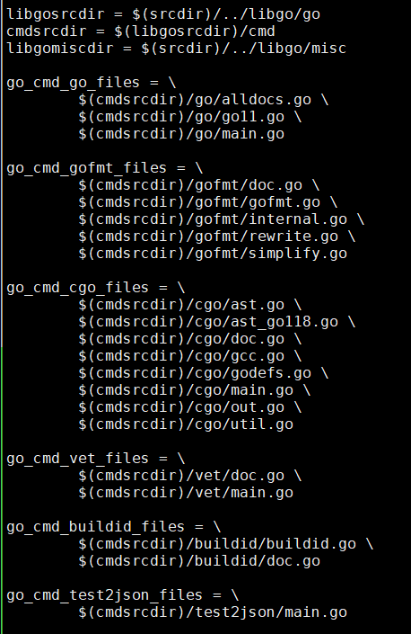

- [gccgo和go tools](#gccgo和go-tools)
- [使用go tools和gccgo](#使用go-tools和gccgo)
- [crosstool ng(我最后用的是这个)](#crosstool-ng我最后用的是这个)
- [编译gcc的理论基础](#编译gcc的理论基础)
- [编译过程for x86_64](#编译过程for-x86_64)
	- [下载gcc9.2源码, release版本就可以](#下载gcc92源码-release版本就可以)
	- [安装依赖](#安装依赖)
	- [解压gcc 编译](#解压gcc-编译)
	- [编译完成后](#编译完成后)
	- [会在指定目录下生成](#会在指定目录下生成)
	- [使用](#使用)
	- [交叉编译情况下不会编译gotools](#交叉编译情况下不会编译gotools)

# gccgo和go tools

gotools目录是编译go tools的. 到时候要自己改build源码, 自己生成tools?

go的代码在libgo

https://github.com/golang/go/wiki/GccgoCrossCompilation#build-a-cross-gccgo-aware-version-of-the-go-tool


https://github.com/golang/go/wiki/GccgoCrossCompilation


https://github.com/karalabe/xgo


# 使用go tools和gccgo

https://medium.com/@chrischdi/cross-compiling-go-for-raspberry-pi-dc09892dc745


# crosstool ng(我最后用的是这个)

https://crosstool-ng.github.io/docs/configuration/

crosstool-ng可以打印shell的调用栈, 比如:
```
[INFO ]  Retrieving needed toolchain components' tarballs
[EXTRA]    Retrieving 'automake-1.16.1'
[EXTRA]    Verifying SHA512 checksum for 'automake-1.16.1.tar.xz'
[EXTRA]    Retrieving 'linux-4.9.156'
[ERROR]    linux: download failed
[ERROR]   
[ERROR]  >>
[ERROR]  >>  Build failed in step 'Retrieving needed toolchain components' tarballs'
[ERROR]  >>        called in step '(top-level)'
[ERROR]  >>
[ERROR]  >>  Error happened in: CT_Abort[scripts/functions@487]
[ERROR]  >>        called from: CT_DoFetch[scripts/functions@2103]
[ERROR]  >>        called from: CT_PackageRun[scripts/functions@2063]
[ERROR]  >>        called from: CT_Fetch[scripts/functions@2174]
[ERROR]  >>        called from: do_kernel_get[scripts/build/kernel/linux.sh@22]
[ERROR]  >>        called from: main[scripts/crosstool-NG.sh@647]
[ERROR]  >>
```

是因为使用了`trap ... ERR`技术.  
在`crosstool-ng-1.24.0/scripts/functions`中, `trap CT_OnError ERR`, 具体见`CT_OnError`函数.
```
# Install the fault handler
trap CT_OnError ERR
# Inherit the fault handler in subshells and functions
set -E
# Make pipes fail on the _first_ failed command
# Not supported on bash < 3.x, but we need it, so drop the obsolete bash-2.x
set -o pipefail
```
`help trap`和`help set`说的很清楚

上面这个`CT_OnError`函数用了下面的思路:
bash默认有变量FUNCNAME BASH_SOURCE BASH_LINENO, 这些是数组, 保存了调用栈.
https://unix.stackexchange.com/questions/462156/how-do-i-find-the-line-number-in-bash-when-an-error-occured

# 编译gcc的理论基础

https://preshing.com/20141119/how-to-build-a-gcc-cross-compiler/


https://solarianprogrammer.com/2018/05/06/building-gcc-cross-compiler-raspberry-pi/


# 编译过程for x86_64

## 下载gcc9.2源码, release版本就可以
```sh
axel http://www.netgull.com/gcc/releases/gcc-9.2.0/gcc-9.2.0.tar.xz
```

## 安装依赖
```sh
apt install build-essential libgmp-dev libmpfr-dev libmpc-dev
```

## 解压gcc 编译
```sh
cd gcc-9.2.0

mkdir objdir && cd objdir

../configure --prefix=/home/byj/repo/gorepo/gcc --enable-languages=go --disable-multilib

# 虽然没有写明要c和c++, 但默认是肯定有的
make -j
```

## 编译完成后
```sh
make install
```

## 会在指定目录下生成
```
gcc c++ g++ 

go gofmt gccgo
```

## 使用
```
export LD_LIBRARY_PATH=~/repo/gorepo/gcc/lib64

PATH=~/repo/gorepo/gcc/bin:$PATH

go build hello.go
```

会生成hello可执行文件, 默认动态链接, 大小70K

动态库libgo.so大小48M, strip后26M

压缩后5M

```sh
$ ldd hello
	linux-vdso.so.1 =>  (0x00007ffe35580000)
	libgo.so.14 => /home/byj/repo/gorepo/gcc/lib64/libgo.so.14 (0x00007f5fae036000)
	libm.so.6 => /lib/x86_64-linux-gnu/libm.so.6 (0x00007f5fadd05000)
	libgcc_s.so.1 => /home/byj/repo/gorepo/gcc/lib64/libgcc_s.so.1 (0x00007f5fadaee000)
	libc.so.6 => /lib/x86_64-linux-gnu/libc.so.6 (0x00007f5fad723000)
	/lib64/ld-linux-x86-64.so.2 (0x000055cdd4f10000)
	libpthread.so.0 => /lib/x86_64-linux-gnu/libpthread.so.0 (0x00007f5fad506000)
```

## 交叉编译情况下不会编译gotools
gcc的住Makefile.in文件中, 搜索gotools
```
configure-host:
	...
	maybe-configure-gotools
	...

configure-target:
	没有maybe-configure-gotools
```
gotools包括

  

gcc/gotools/Makefile.am中也写了
```
if NATIVE

```


