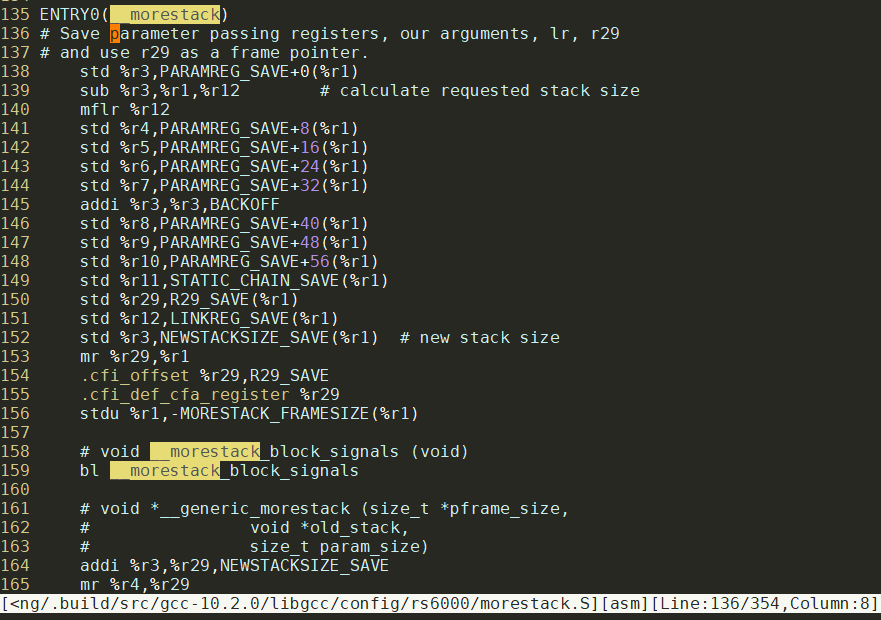
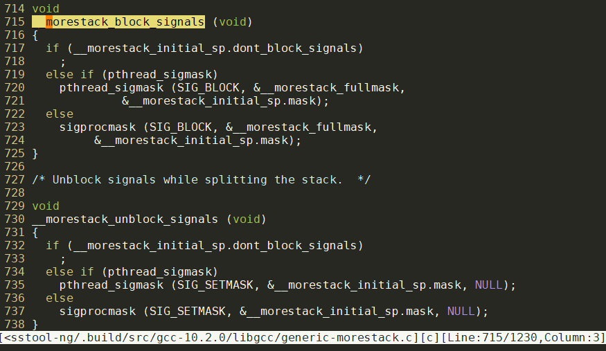

- [gccgo工具链不编译c文件](#gccgo工具链不编译c文件)
  - [过程](#过程)
- [gcc的gccgo官方文档](#gcc的gccgo官方文档)
- [编译gc go并上传下载](#编译gc-go并上传下载)
- [gccgo toolchain准备, 操作命令版本](#gccgo-toolchain准备-操作命令版本)
  - [build toolchain](#build-toolchain)
  - [upload the toolchain to artifactory](#upload-the-toolchain-to-artifactory)
- [命令cache](#命令cache)
- [go源码编译](#go源码编译)
  - [原版go源码编译go tools](#原版go源码编译go-tools)
  - [修改版源码编译](#修改版源码编译)
- [不改变go tools的尝试](#不改变go-tools的尝试)
  - [使用gccgo](#使用gccgo)
    - [传入`GOARCH=ppc64`](#传入goarchppc64)
    - [传入`GOARCH=amd64`](#传入goarchamd64)
    - [总结:](#总结)
- [尝试成功, 使用ppc32 gccgo的方法](#尝试成功-使用ppc32-gccgo的方法)
- [修改go源码, 支持`GOARCH=ppc32`](#修改go源码-支持goarchppc32)
  - [编译gccgo](#编译gccgo)
    - [crosstool-ng编译gccgo](#crosstool-ng编译gccgo)
    - [使用crosstool-ng的gccgo](#使用crosstool-ng的gccgo)
  - [修改go源码支持ppc32](#修改go源码支持ppc32)
    - [power ISA背景知识](#power-isa背景知识)
      - [Power ISA v.2.06](#power-isa-v206)
      - [Power ISA v.2.07](#power-isa-v207)
      - [Power ISA v.3.0](#power-isa-v30)
    - [default ARCH选项](#default-arch选项)
    - [默认编译器参数](#默认编译器参数)
    - [要修改的文件](#要修改的文件)
- [ppc64无法在e6500上运行](#ppc64无法在e6500上运行)
  - [这些缺失的符号应该在哪里?](#这些缺失的符号应该在哪里)
  - [为什么`generic-morestack.c`没有编译到?](#为什么generic-morestackc没有编译到)
    - [crosstool-ng的bug](#crosstool-ng的bug)
  - [关于split stack](#关于split-stack)
    - [上面提到的gold linker是什么意思?](#上面提到的gold-linker是什么意思)
    - [相关链接](#相关链接)
- [上传gccgo工具链到artifactory](#上传gccgo工具链到artifactory)
- [gccgo的hello size过大问题](#gccgo的hello-size过大问题)
  - [相关命令](#相关命令)
  - [减小libgo.a的体积](#减小libgoa的体积)
    - [使能lto](#使能lto)
  - [改动提交到crosstool-ng](#改动提交到crosstool-ng)
  - [go_export小节](#go_export小节)
  - [static和static-libgo](#static和static-libgo)
- [让gcgo支持ppc32](#让gcgo支持ppc32)
- [下一步](#下一步)
- [补充: fant-f运行topid](#补充-fant-f运行topid)
- [补充: ppc64](#补充-ppc64)
- [补充: 为什么gc go工具链的支持ppc64, 但不能在e6500上运行?](#补充-为什么gc-go工具链的支持ppc64-但不能在e6500上运行)
- [补充: elf格式](#补充-elf格式)

# gccgo工具链不编译c文件
参考: https://github.com/golang/go/issues/41758  
结论: 没有打开`CGO_ENABLED=1`的情况下, 不会自动编译c文件. `CGO_ENABLED=1`就好了.

## 过程
使用gccgo编译MF14Temp时，由于import了fsnotify这个包，而这个包会使用`golang.org/x/sys/`这个包 这个包里`unix/gccgo.go`这个go文件里需要调用`gccgoRealSyscall`和`gccgoRealSyscallNoError`这两个函数，而这两个函数的实现在unix/gccgo_c.c这个c文件中。

产生下述链接错误的原因是gccgo_c.c这个c文件没有被gccgo编译，因此需要在编译MF14Temp时，加上“CGO_ENABLED=1”这个选项，使能CGO，让GO能够调用C
```sh
GOARCH=ppc64 go build -o MF14Temp_ppc64
# gitlabe1.ext.net.nokia.com/godevsig/MF14Temp
/opt/crosstool/powerpc64-e6500-linux-gnu/bin/../lib/gcc/powerpc64-e6500-linux-gnu/10.2.0/../../../../powerpc64-e6500-linux-gnu/bin/ld: /home/xming/.cache/go-build/16/16ae8d3fbaffd001bb92ecdbfd968c9b2f078bb1bfd38396335cd0a145ce241c-d(_go_.o): in function `golang.x2eorg..z2fx..z2fsys..z2funix.SyscallNoError':
/repo/xming/go/pkg/mod/golang.org/x/sys@v0.0.0-20191005200804-aed5e4c7ecf9/unix/gccgo.go:23: undefined reference to `gccgoRealSyscallNoError'
/opt/crosstool/powerpc64-e6500-linux-gnu/bin/../lib/gcc/powerpc64-e6500-linux-gnu/10.2.0/../../../../powerpc64-e6500-linux-gnu/bin/ld: /home/xming/.cache/go-build/16/16ae8d3fbaffd001bb92ecdbfd968c9b2f078bb1bfd38396335cd0a145ce241c-d(_go_.o): in function `golang.x2eorg..z2fx..z2fsys..z2funix.Syscall':
/repo/xming/go/pkg/mod/golang.org/x/sys@v0.0.0-20191005200804-aed5e4c7ecf9/unix/gccgo.go:30: undefined reference to `gccgoRealSyscall'
```

# gcc的gccgo官方文档
https://gcc.gnu.org/onlinedocs/gcc-10.2.0/gccgo/

# 编译gc go并上传下载
到`https://artifactory-blr1.int.net.nokia.com/artifactory/godevsig-generic-local/toolchain/gccgo/` 查最新的文件夹
找到commit号, 比如 059da3dd98ab7be871a0556dd53fa4057f7dcf09
下载:
```sh
#编译
cd golang-go
git checkout release-branch.go1.16
cd src
GOOS=linux GOARCH=amd64 ./bootstrap.bash

#上传
curl -H "X-JFrog-Art-Api:AKCp8hyinctVijrdqGaFc1YAT7e7KDHWJEaackjuv6oCheipkYU9jU5okRj8rnFkVvcZWnTVc" -X PUT "https://artifactory-blr1.int.net.nokia.com:443/artifactory/godevsig-generic-local/toolchain/gcgo/`git rev-parse HEAD`/"  -T ../../go-linux-amd64-bootstrap.tbz

#下载
curl https://artifactory-blr1.int.net.nokia.com/artifactory/godevsig-generic-local/toolchain/gcgo/1cabb66796f4529afc615dd466b5667fe1509f6c/go-linux-amd64-bootstrap.tbz -O
```

# gccgo toolchain准备, 操作命令版本
Steps to prepare gccgo toolchain

## build toolchain
* checkout godev branch
```sh
cd crosstool-ng
git checkout godev
```

* make crosstool-ng
```sh
# install dependencies
apt install flex help2man texinfo libtool-bin libncurses-dev gawk bison rsync

# build
./bootstrap
./configure --enable-local
make
```

* build gccgo toolchain
e.g. to build ppc64 gccgo
```sh
./ct-ng defconfig DEFCONFIG=samples/Nokia/isam-reborn_godev-ppc64-e6500
./ct-ng build
```

* find the toolchain in targets after successfully build
```sh
cd targets
ls
# powerpc64-e6500-linux-gnu
```

## upload the toolchain to artifactory
* compress the toolchain folder
```sh
tar cJf godev-gccgo-ppc64.tar.xz powerpc64-e6500-linux-gnu
```
* upload to artifactory
```sh
curl -H "X-JFrog-Art-Api:AKCp8hyinctVijrdqGaFc1YAT7e7KDHWJEaackjuv6oCheipkYU9jU5okRj8rnFkVvcZWnTVc" -X PUT "https://artifactory-blr1.int.net.nokia.com:443/artifactory/godevsig-generic-local/toolchain/gccgo/`git rev-parse HEAD`/"  -T godev-gccgo-ppc64.tar.xz
```

同时上传ppc和ppc64
```sh
proxyoff

cd crosstool-ng/targets

tar cJf godev-gccgo-ppc.tar.xz powerpc-e500mc-linux-gnu
tar cJf godev-gccgo-ppc64.tar.xz powerpc64-e6500-linux-gnu

curl -H "X-JFrog-Art-Api:AKCp8hyinctVijrdqGaFc1YAT7e7KDHWJEaackjuv6oCheipkYU9jU5okRj8rnFkVvcZWnTVc"  -X PUT "https://artifactory-blr1.int.net.nokia.com:443/artifactory/godevsig-generic-local/toolchain/gccgo/`git rev-parse HEAD`/"  -T "{godev-gccgo-ppc.tar.xz,godev-gccgo-ppc64.tar.xz}"
```

# 命令cache
```sh
# hello
yingjieb@9102a93a554e /repo/yingjieb/godev/practice/src/examples
$ rm -f hello; rm -rf /home/yingjieb/.cache/go-build/; rm -f gccgo.log; PATH=$PATH:/repo/yingjieb/crosstoolng/github/crosstool-ng/targets/powerpc-e500mc-linux-gnu/bin GOARCH=ppc64 /repo/yingjieb/godev/golang-go/bin/go build -compiler gccgo -gccgoflags '-static -Os' hello.go

/repo/yingjieb/crosstoolng/github/crosstool-ng/targets/powerpc-e500mc-linux-gnu/bin/powerpc-linux-strip hello

scp yingjieb@10.182.105.138:/repo/yingjieb/godev/practice/src/examples/hello .

# topid
yingjieb@godev-server /repo/yingjieb/godev/practice
$ export GOPATH="`pwd`:$GOPATH"

yingjieb@godev-server /repo/yingjieb/godev/practice/src/tools
$ PATH=$PATH:/repo/yingjieb/crosstoolng/github/crosstool-ng/targets/powerpc-e500mc-linux-gnu/bin GOARCH=ppc64 /repo/yingjieb/godev/golang-go/bin/go build -compiler gccgo -gccgoflags '-static -Os' topid.go

/repo/yingjieb/crosstoolng/github/crosstool-ng/targets/powerpc-e500mc-linux-gnu/bin/powerpc-linux-strip topid

scp yingjieb@10.182.105.138:/repo/yingjieb/godev/practice/src/tools/topid .

./topid -record -tag fantf -p 1 -child -chartserver 10.182.105.138:9887 -i 3
```

目标是修改golang go的编译器源码, 使其支持ppc32的gccgo后端
# go源码编译
## 原版go源码编译go tools

`git clone https://github.com/golang/go.git`

`go build`源码在`src/cmd/go/internal/work/build.go`

第一次编译需要全部编译.
```sh
cd golang-go/src
./make.bash -a
```
再编`./make.bash --no-clean`似乎更快

编译好的go程序在当前工程的bin目录下

```sh
cd golang-go/
export GOPATH="$GOPATH:`pwd`"
#编译go主程序, 会在当前目录下生成go的可执行程序
cd src/cmd/go
go build
```

注: go tools是指`GOTOOLDIR`下面的一些可执行文件:
```sh
$ ls "/usr/local/go/pkg/tool/linux_amd64"
addr2line  asm  buildid  cgo  compile  cover  dist  doc  fix  link  nm  objdump  pack  pprof  test2json  trace  vet
```

## 修改版源码编译
我在godevsig分支修改了源码, 支持ppc的gccgo
现在我想基于go1.13 release分支自己编译一套工具链出来
在godev-tool docker里面操作:
```sh
git checkout release-branch.go1.13
# e164f53422是godevsig分支上我的commit
git cherry-pick e164f53422
#在1.15之前, 需要这个commit来支持ppc的cgo
git cherry-pick 5d1378143bc

#我还想要1.14的-trimpath功能
git cherry-pick eb6ce1cff4
git rm cmd/go/testdata/script/build_trimpath.txt

#gccgo不支持go:linkname 指示符, go module要用就出错`//go:linkname is only supported for functions`
#需要下面的patch
git cherry-pick baf7d95350
git cherry-pick 45873a242d

cd golang-go/src
GOOS=linux GOARCH=amd64 ./bootstrap.bash
```
注: bootstrap支持`BOOTSTRAP_FORMAT=mintgz`意思是生成干净的工具链, 删掉一些不用的文件. 但似乎删的太狠了, 不推荐

# 不改变go tools的尝试
通常来讲, 用go tools需要传入`GOARCH=`, 而ppc32是不在列表里面的:
```sh
$ go tool dist list | grep linux
linux/386
linux/amd64
linux/arm
linux/arm64
linux/mips
linux/mips64
linux/mips64le
linux/mipsle
linux/ppc64
linux/ppc64le
linux/s390x
```

## 使用gccgo
一般的, go build的时候, 加`-compiler gccgo`选项使能gccgo编译器, 需要有`gccgo`这个可执行文件.
对ppc32来说, 首先要有crosstool-ng编译出来的gccgo, 比如`powerpc-e500mc-linux-gnu-gccgo`
在`/repo/yingjieb/godev/gccgoppc32/powerpc-e500mc-linux-gnu/bin`下面
建一个gccgo的可执行脚本, 内容如下:
这会把所有调用到gccgo的参数打印出来
```sh
#!/bin/bash

(
echo `pwd`
echo "$@"
) >> gccgo.log

exec powerpc-e500mc-linux-gnu-gccgo $@
```

注意, `go build`会使用cache, 要得到完整过程, 需要删掉cache

### 传入`GOARCH=ppc64`
```sh
yingjieb@9102a93a554e /repo/yingjieb/godev/practice/src/examples
$ rm -f hello; rm -rf /home/yingjieb/.cache/go-build/; rm -f gccgo.log; PATH=$PATH:/repo/yingjieb/godev/gccgoppc32/powerpc-e500mc-linux-gnu/bin GOARCH=ppc64 go build -compiler gccgo hello.go
yingjieb@9102a93a554e /repo/yingjieb/godev/practice/src/examples
$ cat gccgo.log
/repo/yingjieb/godev/practice/src/examples
-print-search-dirs
/repo/yingjieb/godev/practice/src/examples
-dumpversion
/repo/yingjieb/godev/practice/src/examples
-dumpmachine
/repo/yingjieb/godev/practice/src/examples
-### -x go -c -
/repo/yingjieb/godev/practice/src/examples
-c -g -fdebug-prefix-map=/tmp/go-build836929485=/tmp/go-build -gno-record-gcc-switches -fgo-relative-import-path=_/repo/yingjieb/godev/practice/src/examples -o /tmp/go-build836929485/b001/_go_.o -I /tmp/go-build836929485/b001/_importcfgroot_ /repo/yingjieb/godev/practice/src/examples/hello.go
/repo/yingjieb/godev/practice/src/examples
-xassembler-with-cpp -I /tmp/go-build836929485/b001/ -c -o /tmp/go-build836929485/b001/_buildid.o -D GOOS_linux -D GOARCH_ppc64 /tmp/go-build836929485/b001/_buildid.s
/repo/yingjieb/godev/practice/src/examples
-### -x go -c -
/repo/yingjieb/godev/practice/src/examples
-o /tmp/go-build836929485/b001/exe/a.out -Wl,-( -Wl,--whole-archive /tmp/go-build836929485/b001/_pkg_.a -Wl,--no-whole-archive -Wl,-) -Wl,--build-id=0x66534c46775162664f44395036684634392d76552f6f79586f4a615778706b5f78586c7852795069492f476e3059334754737349613869696f4b524356432f66534c46775162664f44395036684634392d7655
```
虽然传入的是`GOARCH=ppc64`, 但依然成功生成了hello程序:
```sh
yingjieb@9102a93a554e /repo/yingjieb/godev/practice/src/examples
$ file hello
hello: ELF 32-bit MSB executable, PowerPC or cisco 4500, version 1 (SYSV), dynamically linked, interpreter /lib/ld.so.1, for GNU/Linux 4.9.156, with debug_info, not stripped
```

生成的hello和libgo.so.13考到板子上(FANT-F), 可以正常执行:
```sh
scp yingjieb@10.182.105.138:/repo/yingjieb/godev/practice/src/examples/hello .
scp yingjieb@10.182.105.138:/repo/yingjieb/godev/gccgoppc32/powerpc-e500mc-linux-gnu/powerpc-e500mc-linux-gnu/lib/libgo.so.13 .

~ # LD_LIBRARY_PATH=`pwd` ./hello
hello world!
4
0x21192008 4
4

```

### 传入`GOARCH=amd64`
```sh
yingjieb@9102a93a554e /repo/yingjieb/godev/practice/src/examples
$ rm -f hello; rm -rf /home/yingjieb/.cache/go-build/; rm -f gccgo.log; PATH=$PATH:/repo/yingjieb/godev/gccgoppc32/powerpc-e500mc-linux-gnu/bin GOARCH=amd64 go build -compiler gccgo hello.go
# command-line-arguments
go1: error: '-m64' not supported in this configuration
yingjieb@9102a93a554e /repo/yingjieb/godev/practice/src/examples
$ cat gccgo.log
/repo/yingjieb/godev/practice/src/examples
-print-search-dirs
/repo/yingjieb/godev/practice/src/examples
-dumpversion
/repo/yingjieb/godev/practice/src/examples
-dumpmachine
/repo/yingjieb/godev/practice/src/examples
-### -x go -c -
/repo/yingjieb/godev/practice/src/examples
-c -g -m64 -fdebug-prefix-map=/tmp/go-build246565517=/tmp/go-build -gno-record-gcc-switches -fgo-relative-import-path=_/repo/yingjieb/godev/practice/src/examples -o /tmp/go-build246565517/b001/_go_.o -I /tmp/go-build246565517/b001/_importcfgroot_ /repo/yingjieb/godev/practice/src/examples/hello.go
```
说明`go build`确实会**默认**传入一些编译选项, 比如这里, 因为指定了`GOARCH=amd64`, 但我们的交叉编译器是`powerpc-e500mc-linux-gnu-gccgo`, 不认x86的`-m64`选项, 报错:
`go1: error:  '-m64'  not supported in  this configuration`

### 总结:
使用gccgo ppc32的交叉toolchain的时候, 后端编译器`powerpc-e500mc-linux-gnu-gccgo`就默认使用ppc32.
当`go build`传入`GOARCH=ppc64`时, 并没有传入"默认"的ABI, 所以没有给编译器造成困扰. 
但这里有个隐患: 
```sh
-xassembler-with-cpp -I /tmp/go-build836929485/b001/  -c -o /tmp/go-build836929485/b001/_buildid.o -D GOOS_linux -D GOARCH_ppc64 /tmp/go-build836929485/b001/_buildid.s
```
这里的`-D GOARCH_ppc64`是不对的.

# 尝试成功, 使用ppc32 gccgo的方法
其他都一样, 只是要传入`GOARCH=ppc64`和`-compiler gccgo`, 并且保证`PATH=$PATH:/repo/yingjieb/godev/gccgoppc32/powerpc-e500mc-linux-gnu/bin`下面有`gccgo`链接到同目录下的`powerpc-e500mc-linux-gnu-gccgo`

# 修改go源码, 支持`GOARCH=ppc32`
前面已经证明, 使用`GOARCH=ppc64`是可以编译成功的, 并且运行也没发现什么问题.
但注意到ppc64会定义`-D GOARCH_ppc64`, 这个宏是给C和汇编看的, 有什么影响呢?
搜索一下, 下面的文件使用了`GOARCH_ppc64`
```sh
src/internal/bytealg/compare_ppc64x.s
src/internal/bytealg/indexbyte_ppc64x.s
src/crypto/md5/md5block_ppc64x.s

# 这个文件是go运行时的汇编支持, 比如gcWriteBarrier, 和cgo相关的实现
// +build ppc64 ppc64le
src/runtime/asm_ppc64x.s

# 这个似乎是syscall的汇编实现
// +build linux
// +build ppc64 ppc64le
src/runtime/sys_linux_ppc64x.s

src/runtime/cgo/asm_ppc64x.s
```

下面我们要修改go源码, 以支持直接传入`GOARCH=ppc32`
首先需要crosstool-ng编出gccgo. 

## 编译gccgo
gcc源码里面包含了go的源码, 在`gcc/libgo`下面. 不同版本的gcc的go源码版本如下:
`cat gcc/libgo/VERSION`

|gcc version|go version
|----|----
|gcc-8.3.0|go1.10.3
|gcc-9.3.0|go1.12
|gcc-10.1.0|go1.14.2

### crosstool-ng编译gccgo
这里我用官方crosstool-ng
`git clone https://github.com/crosstool-ng/crosstool-ng`
需要先安装些依赖:
```sh
apt install flex help2man texinfo libtool-bin libncurses-dev gawk bison
```

要生成ct-ng
```sh
cd crosstool-ng
./bootstrap
./configure --enable-local
make
```

使用cg-ng
```sh
./ct-ng help
./ct-ng list-samples
./ct-ng powerpc-e300c3-linux-gnu

./ct-ng defconfig DEFCONFIG=samples/Nokia/isam-reborn-ppc-P40xx
./ct-ng menuconfig
./ct-ng build

#保存config
./ct-ng savedefconfig DEFCONFIG=samples/Nokia/isam-reborn-ppc-e6500
```
完成后, 会在`targets`下面生成工具链

### 使用crosstool-ng的gccgo
为了版本一致, 我选用了
gcc-10.2.0, 里面的go版本是go1.14;
go源码使用`release-branch.go1.14`, 编译go tools.
使用新生成的go tools, 指定gccgo编译hello.go
```sh
PATH=$PATH:/repo/yingjieb/crosstoolng/github/crosstool-ng/targets/powerpc-e500mc-linux-gnu/bin GOARCH=ppc64 /repo/yingjieb/godev/golang-go/bin/go build -compiler gccgo -gccgoflags '-static -Os' hello.go
```

## 修改go源码支持ppc32
### power ISA背景知识
[power ISA](https://en.wikipedia.org/wiki/Power_ISA)

#### Power ISA v.2.06

The specification for Power ISA v.2.06 was released in February 2009, and revised in July 2010. It is based on Power ISA v.2.05 and includes extensions for the POWER7 processor and [e500-mc core](https://en.wikipedia.org/wiki/PowerPC_e500#e500mc "PowerPC e500"). One significant new feature is vector-scalar floating-point instructions ([VSX](https://en.wikipedia.org/wiki/AltiVec#VSX_(Vector_Scalar_Extension) "AltiVec")). **Book III-E** also includes significant enhancement for the embedded specification regarding hypervisor and virtualisation on single and multi core implementations.

The spec was revised in November 2010 to the Power ISA v.2.06 revision B spec, enhancing virtualization features.

**Compliant cores**

*   All cores that comply with previous versions of the Power ISA
*   [POWER7](https://en.wikipedia.org/wiki/POWER7 "POWER7")
*   [A2I](https://en.wikipedia.org/wiki/IBM_A2#A2I "IBM A2")
*   [e500-mc](https://en.wikipedia.org/wiki/PowerPC_e500#e500mc "PowerPC e500")
*   [e5500](https://en.wikipedia.org/wiki/PowerPC_e5500 "PowerPC e5500")

#### Power ISA v.2.07

The specification for Power ISA v.2.07 was released in May 2013\. It is based on Power ISA v.2.06 and includes major enhancements to [logical partition functionality](https://en.wikipedia.org/wiki/Logical_partition_(virtual_computing_platform) "Logical partition (virtual computing platform)"), [transactional memory](https://en.wikipedia.org/wiki/Transactional_memory "Transactional memory"), expanded performance monitoring, new storage control features, additions to the VMX and VSX vector facilities (VSX-2), along with [AES](https://en.wikipedia.org/wiki/Advanced_Encryption_Standard "Advanced Encryption Standard")> and [Galois Counter Mode](https://en.wikipedia.org/wiki/Galois_Counter_Mode "Galois Counter Mode") (GCM), SHA-224, SHA-256, SHA-384 and SHA-512 ([SHA-2](https://en.wikipedia.org/wiki/SHA-2 "SHA-2")) cryptographic extensions and [cyclic redundancy check](https://en.wikipedia.org/wiki/Cyclic_redundancy_check "Cyclic redundancy check") (CRC) [algorithms](https://en.wikipedia.org/wiki/Algorithm "Algorithm").

The spec was revised in April 2015 to the Power ISA v.2.07 B spec.

**Compliant cores**

*   All cores that comply with previous versions of the Power ISA
*   [POWER8](https://en.wikipedia.org/wiki/POWER8 "POWER8")
*   [e6500](https://en.wikipedia.org/wiki/PowerPC_e6500 "PowerPC e6500") core
*   [A2O](https://en.wikipedia.org/wiki/IBM_A2#A2O "IBM A2")

#### Power ISA v.3.0

The specification for Power ISA v.3.0 was released in November 2015\. It is the first to come out after the founding of the OpenPOWER Foundation and includes enhancements for a broad spectrum of workloads and removes the server and embedded categories while retaining backwards compatibility and adds support for VSX-3 instructions. New functions include 128-bit quad-precision floating-point operations, a random number generator, hardware-assisted garbage collection and hardware-enforced trusted computing.

The spec was revised in March 2017 to the Power ISA v.3.0 B spec.

**Compliant cores**

*   All cores that comply with previous versions of the Power ISA
*   [POWER9](https://en.wikipedia.org/wiki/POWER9 "POWER9")

### default ARCH选项
每个arch都有个default选项: 这段代码是自动生成的
```go
// Code generated by go tool dist; DO NOT EDIT.

package objabi

import "runtime"

const defaultGO386 = `sse2`
const defaultGOARM = `5`
const defaultGOMIPS = `hardfloat`
const defaultGOMIPS64 = `hardfloat`
const defaultGOPPC64 = `power8`
const defaultGOOS = runtime.GOOS
const defaultGOARCH = runtime.GOARCH
const defaultGO_EXTLINK_ENABLED = ``
const defaultGO_LDSO = ``
const version = `go1.14.9`
const stackGuardMultiplierDefault = 1
const goexperiment = ``
```
值得注意的是, PPC64实际上是`power8`

### 默认编译器参数
`golang-go/src/cmd/go/internal/work/exec.go`
```go
// gccArchArgs returns arguments to pass to gcc based on the architecture.
func (b *Builder) gccArchArgs() []string {
    switch cfg.Goarch {
    case "386":
        return []string{"-m32"}
    case "amd64":
        return []string{"-m64"}
    case "arm":
        return []string{"-marm"} // not thumb
    case "s390x":
        return []string{"-m64", "-march=z196"}
    case "mips64", "mips64le":
        return []string{"-mabi=64"}
    case "mips", "mipsle":
        return []string{"-mabi=32", "-march=mips32"}
    case "ppc64":
        if cfg.Goos == "aix" {
            return []string{"-maix64"}
        }
    }
    return nil
}
```

### 要修改的文件
```sh
modified:   src/cmd/dist/build.go
modified:   src/cmd/dist/buildruntime.go
modified:   src/cmd/go/internal/cfg/cfg.go
modified:   src/internal/cfg/cfg.go
```

# ppc64无法在e6500上运行
用gcgo编译出来的`GOARCH=ppc64`的版本无法在fant-g上运行.
用gccgo编出来的32位程序可以执行.
用gccgo编ppc64时, 编译出错, 报link错误:

```sh
lib/gcc/powerpc-e6500-linux-gnu/10.2.0/libgcc.a(morestack.o): in function `__morestack':
src/gcc/libgcc/config/rs6000/morestack.S:159: undefined reference to `__morestack_block_signals'

undefined reference to `__generic_morestack'
undefined reference to `__morestack_unblock_signals'
undefined reference to `__morestack_block_signals'
undefined reference to `__generic_releasestack'
undefined reference to `__morestack_unblock_signals'
undefined reference to `__generic_findstack'
undefined reference to `__generic_morestack_set_initial_sp'
undefined reference to `__morestack_load_mmap'
```

对hello.go来说, 加选项`-fno-split-stack`可以成功编译ppc64, 成功运行
```sh
/repo/yingjieb/crosstoolng/github/crosstool-ng/targets/powerpc-e6500-linux-gnu/bin/powerpc-e6500-linux-gnu-gccgo  -fno-split-stack -static hello.go

PATH=$PATH:/repo/yingjieb/crosstoolng/github/crosstool-ng/targets/powerpc-e6500-linux-gnu/bin GOARCH=ppc64 /repo/yingjieb/godev/golang-go/bin/go build -compiler gccgo -gccgoflags '-static -Os -fno-split-stack' hello.go
```

但topid.go即使加了`-fno-split-stack`, 还是报一样的链接错误

## 这些缺失的符号应该在哪里?
看起来是libgcc.a的`__morestack`函数需要调用`__morestack_block_signals`等函数, 但没有定义.
```sh
$ nm /repo/yingjieb/crosstoolng/github/powerpc-e6500-linux-gnu/lib/gcc/powerpc-e6500-linux-gnu/10.2.0/libgcc.a  | grep more
morestack.o:
                 U __generic_morestack
                 U __generic_morestack_set_initial_sp
0000000000000018 D __morestack
                 U __morestack_block_signals
0000000000000048 D __morestack_get_guard
                 U __morestack_load_mmap
0000000000000078 D __morestack_make_guard
0000000000000000 D __morestack_non_split
0000000000000060 D __morestack_set_guard
                 U __morestack_unblock_signals
```
`U`的意思就是undefined
对ppc来说, gcc的代码`libgcc/config/rs6000/morestack.S`中, 有`__morestack`的定义, 确实调用了这些函数.  
  

这些函数的定义在:`libgcc/generic-morestack.c`  
  

根据下面的参考文章, split stack功能是`Ian Lance Taylor`在x86上实现的; ppc64上的实现的作者是`Alan Modra`, [[Patch 0/4] PowerPC64 Linux split stack support](https://gcc.gnu.org/legacy-ml/gcc-patches/2015-05/msg01519.html)

对照X86机器上:
```sh
# 先找到gcc的lib目录, 是/usr/lib/gcc/x86_64-linux-gnu/7
gcc -print-search-dirs

# 用nm看符号表
$ nm libgcc.a | grep more
nm: _trampoline.o: no symbols
nm: __main.o: no symbols
nm: _mulhc3.o: no symbols
nm: _divhc3.o: no symbols
generic-morestack.o:
00000000000002b0 T __generic_morestack
0000000000000240 T __generic_morestack_set_initial_sp
0000000000000940 T __morestack_allocate_stack_space
0000000000000880 T __morestack_block_signals
00000000000000b8 B __morestack_current_segment
0000000000000040 T __morestack_fail
0000000000000020 b __morestack_fullmask
                 U __morestack_get_guard
0000000000000000 B __morestack_initial_sp
0000000000000ad0 T __morestack_load_mmap
                 U __morestack_make_guard
0000000000000110 T __morestack_release_segments
00000000000000c0 B __morestack_segments
                 U __morestack_set_guard
00000000000008e0 T __morestack_unblock_signals
generic-morestack-thread.o:
                 U __morestack_fail
                 U __morestack_release_segments
                 U __morestack_segments
morestack.o:
                 U __generic_morestack
                 U __generic_morestack_set_initial_sp
0000000000000037 T __morestack
                 U __morestack_block_signals
0000000000000155 T __morestack_get_guard
000000000000011c T __morestack_large_model
                 U __morestack_load_mmap
0000000000000169 T __morestack_make_guard
0000000000000000 T __morestack_non_split
000000000000015f T __morestack_set_guard
                 U __morestack_unblock_signals
```
`T`表示是代码符号.
确实的函数大部分在`generic-morestack.o`中. 这和`libgcc/generic-morestack.c`代码分析是一样的.
说明这部分代码没有编译到libgcc.a中.

ppc32没有这个问题, 因为ppc32本来就不支持split stack.

## 为什么`generic-morestack.c`没有编译到?
`libgcc/generic-morestack.c`中, 主体代码的编译条件是:  
`#if !defined __powerpc__ || defined __powerpc64__`  
`__powerpc64__`确定是有的. 
那为什么还是没有编到呢?  
原来是`libgcc/config/t-stack`中, `enable_threads`控制这个文件是否参与编译:
```makefile
ifeq ($(enable_threads),yes)
LIB2ADD_ST += $(srcdir)/generic-morestack.c $(srcdir)/generic-morestack-thread.c
endif
```
在[gcc安装手册](https://gcc.gnu.org/install/configure.html)中, 有使用方法:
```sh
--enable-threads
Specify that the target supports threads. This affects the Objective-C compiler and runtime library, and exception handling for other languages like C++. On some systems, this is the default.

In general, the best (and, in many cases, the only known) threading model available will be configured for use. Beware that on some systems, GCC has not been taught what threading models are generally available for the system. In this case, --enable-threads is an alias for --enable-threads=single.

--enable-threads=lib
Specify that lib is the thread support library. This affects the Objective-C compiler and runtime library, and exception handling for other languages like C++. The possibilities for lib are:

aix
AIX thread support.

dce
DCE thread support.

lynx
LynxOS thread support.

mipssde
MIPS SDE thread support.

no
This is an alias for ‘single’.

posix
Generic POSIX/Unix98 thread support.

rtems
RTEMS thread support.

single
Disable thread support, should work for all platforms.

tpf
TPF thread support.

vxworks
VxWorks thread support.

win32
Microsoft Win32 API thread support.
```

在`gcc/config.gcc`中, 每个arch和os都会检查
```sh
case ${target} in
*-*-linux* | frv-*-*linux* | *-*-kfreebsd*-gnu | *-*-gnu* | *-*-kopensolaris*-gnu | *-*-uclinuxfdpiceabi)
    case ${enable_threads} in
    "" | yes | posix) thread_file='posix' ;;
    esac
...
esac
```

### crosstool-ng的bug
经进一步检查, 原版的gcc没有问题. 问题在于crosstool-ng的一个patch:
```sh
yingjieb@godev-server /repo/yingjieb/crosstoolng/github/crosstool-ng/packages/gcc/10.2.0
$ cat 0008-libgcc-disable-split-stack-nothreads.patch
disable split-stack for non-thread builds

Signed-off-by: Waldemar Brodkorb <wbx@openadk.org>

---
 libgcc/config/t-stack |    2 ++
 1 file changed, 2 insertions(+)

--- a/libgcc/config/t-stack
+++ b/libgcc/config/t-stack
@@ -1,4 +1,6 @@
 # Makefile fragment to provide generic support for -fsplit-stack.
 # This should be used in config.host for any host which supports
 # -fsplit-stack.
+ifeq ($(enable_threads),yes)
 LIB2ADD_ST += $(srcdir)/generic-morestack.c $(srcdir)/generic-morestack-thread.c
+endif
```

尝试在crosstool-ng的config里面加:
```sh
CT_CC_GCC_EXTRA_CONFIG_ARRAY="--enable-threads=yes"
```
但不起作用, 删除掉这个文件`0008-libgcc-disable-split-stack-nothreads.patch`就好了.

## 关于split stack
gcc的大神`Ian Lance Taylor`有两篇文章:
[gccgo中的split stack](https://blog.golang.org/gccgo-in-gcc-471)
>Gccgo provides the standard, complete Go library. Many of the core features of the Go runtime are the same in both gccgo and gc, including the goroutine scheduler, channels, the memory allocator, and the garbage collector. Gccgo supports splitting goroutine stacks as the gc compiler does, but currently only on x86 (32-bit or 64-bit) and only when using the gold linker (on other processors, each goroutine will have a large stack, and a deep series of function calls may run past the end of the stack and crash the program).

>Gccgo distributions do not yet include a version of the go command. However, if you install the go command from a standard Go release, it already supports gccgo via the `-compiler` option: go build `-compiler gccgo myprog`. The tools used for calls between Go and C/C++, cgo and SWIG, also support gccgo.

[gcc中的split stack](https://gcc.gnu.org/wiki/SplitStacks)

### 上面提到的gold linker是什么意思?
gold linker是另一种linker, 并不是ld的某种模式. 

### 相关链接
[PowerPC64 Linux split stack support](https://gcc.gnu.org/legacy-ml/gcc-patches/2015-05/msg01519.html)

https://gcc.gnu.org/legacy-ml/gcc-patches/2015-05/msg01522.html
https://groups.google.com/g/golang-codereviews/c/4T_KQys3XM0/m/VWNk2c6JCgAJ

# 上传gccgo工具链到artifactory
```sh
proxyoff

cd crosstool-ng/targets
tar cJf godev-gccgo-ppc.tar.xz powerpc-e500mc-linux-gnu
tar cJf godev-gccgo-ppc64.tar.xz powerpc64-e6500-linux-gnu

curl -H "X-JFrog-Art-Api:AKCp8hyinctVijrdqGaFc1YAT7e7KDHWJEaackjuv6oCheipkYU9jU5okRj8rnFkVvcZWnTVc"  -X PUT "https://artifactory-blr1.int.net.nokia.com:443/artifactory/godevsig-generic-local/toolchain/gccgo/`git rev-parse HEAD`/"  -T "{godev-gccgo-ppc.tar.xz,godev-gccgo-ppc64.tar.xz}"
```
详见笔记`云端环境和go实践.md`

# gccgo的hello size过大问题
gccgo编译出来的静态链接的hello是17M
其中有12M左右是debug info. 
用`gcc -s`或者`strip --strip-debug`都能减小size, 但问题是运行时panic就不能打印调用栈了.
按照`gcc-10.2.0/libgo/README`的说法:
> This library should not be stripped when it is installed.  Go code
relies on being able to look up file/line information, which comes
from the debugging info using the libbacktrace library.

go需要debug info来查找file line信息.

注: `libbacktrace`也是[ianlancetaylor](https://github.com/ianlancetaylor/libbacktrace/commits?author=ianlancetaylor "View all commits by ianlancetaylor")大神的作品: [github](https://github.com/ianlancetaylor/libbacktrace)

那有没有其他的办法可以减小hello的size呢? 17M也太大了.
[strip使用说明](https://sourceware.org/binutils/docs/binutils/strip.html)
[GCC的debug选项](https://gcc.gnu.org/onlinedocs/gcc/Debugging-Options.html)

gcc的选项中, `-g1`和`-gz`看起来比较有用:
```sh
-glevel
    Request debugging information and also use level to specify how much information. The default level is 2.

    Level 0 produces no debug information at all. Thus, -g0 negates -g.

    Level 1 produces minimal information, enough for making backtraces in parts of the program that you don’t plan to debug. This includes descriptions of functions and external variables, and line number tables, but no information about local variables.

    Level 3 includes extra information, such as all the macro definitions present in the program. Some debuggers support macro expansion when you use -g3.

    If you use multiple -g options, with or without level numbers, the last such option is the one that is effective.

    -gdwarf does not accept a concatenated debug level, to avoid confusion with -gdwarf-level. Instead use an additional -glevel option to change the debug level for DWARF.
    
-gz[=type]
    Produce compressed debug sections in DWARF format, if that is supported. If type is not given, the default type depends on the capabilities of the assembler and linker used. type may be one of ‘none’ (don’t compress debug sections), ‘zlib’ (use zlib compression in ELF gABI format), or ‘zlib-gnu’ (use zlib compression in traditional GNU format). If the linker doesn’t support writing compressed debug sections, the option is rejected. Otherwise, if the assembler does not support them, -gz is silently ignored when producing object files.
```

`-gz`能让hello从17M减小到8.7M

## 相关命令
```sh
#看具体那个section的size
size -A hello
```

[这篇文章](https://help.backtrace.io/en/articles/1716990-dwarf)非常详细的介绍了debug节的方方面面的信息.
特别的, objcopy能够去掉任意指定section
```sh
/repo/yingjieb/godevsig/crosstool-ng/targets/powerpc-e500mc-linux-gnu/bin/powerpc-e500mc-linux-gnu-objcopy -R .debug_info -R .debug_abbrev -R .debug_aranges -R .debug_ranges -R .debug_loc -R .debug_str hello
```

## 减小libgo.a的体积
gcc的libgo在编译的时候, 有自己默认的编译选项`-O2 -g`
用下面的patch
```diff
diff --git a/Makefile.in b/Makefile.in
index 36e369df6..2e183c702 100644
--- a/Makefile.in
+++ b/Makefile.in
@@ -619,7 +619,7 @@ CXXFLAGS_FOR_TARGET = @CXXFLAGS_FOR_TARGET@
 LIBCFLAGS_FOR_TARGET = $(CFLAGS_FOR_TARGET)
 LIBCXXFLAGS_FOR_TARGET = $(CXXFLAGS_FOR_TARGET) -fno-implicit-templates
 LDFLAGS_FOR_TARGET = @LDFLAGS_FOR_TARGET@
-GOCFLAGS_FOR_TARGET = -O2 -g
+GOCFLAGS_FOR_TARGET = -Os -g1 -gz
 GDCFLAGS_FOR_TARGET = -O2 -g

 FLAGS_FOR_TARGET = @FLAGS_FOR_TARGET@
diff --git a/Makefile.tpl b/Makefile.tpl
index efed15117..3c0d2e5e2 100644
--- a/Makefile.tpl
+++ b/Makefile.tpl
@@ -542,7 +542,7 @@ CXXFLAGS_FOR_TARGET = @CXXFLAGS_FOR_TARGET@
 LIBCFLAGS_FOR_TARGET = $(CFLAGS_FOR_TARGET)
 LIBCXXFLAGS_FOR_TARGET = $(CXXFLAGS_FOR_TARGET) -fno-implicit-templates
 LDFLAGS_FOR_TARGET = @LDFLAGS_FOR_TARGET@
-GOCFLAGS_FOR_TARGET = -O2 -g
+GOCFLAGS_FOR_TARGET = -Os -g1 -gz
 GDCFLAGS_FOR_TARGET = -O2 -g

 FLAGS_FOR_TARGET = @FLAGS_FOR_TARGET@

```

经过测试, 各个选项组合的size如下:

|GOCFLAGS_FOR_TARGET | webhello size
|--|--
|-O2 -g(default) | 17M
|-Os -g1 -gz | 13M
|-Os -g1 -gz -fdata-sections -ffunction-sections -Wl,--gc-sections | 12M
|-Os -g1 -gz -fdata-sections -ffunction-sections -Wl,--gc-sections -flto | 12M
|-Os -g1 -gz -fdata-sections -ffunction-sections | 12M

### 使能lto
crosstool-ng默认在static gcc模式下(STATIC_TOOLCHAIN=y), 不使能lto.
但可以自己强制使能:
`CT_CC_GCC_EXTRA_CONFIG_ARRAY=--enable-lto`
但经过验证, 似乎打开lto优化, 并没有减小size.

## 改动提交到crosstool-ng
在gcc库上commit这个改动, 生成patch
```sh
# -1表示最新的1个改动
git format-patch -1
```
拷贝这个patch到gcc下面
`cp 0001-gccgo-generate-smaller-libgo-when-building-gccgo.patch crosstool-ng/packages/gcc/10.2.0/`

## go_export小节
用`size -A`命令看到, gccgo编译出来的executable中, 有`.go_export`小节, 在webhello中占1.6M
根据[这个讨论](https://github.com/golang/go/issues/26204), gccgo的作者说`.go_export`是给shared library用的, 最终的可执行文件不需要. 但他不知道怎么告诉linker把这个小节去掉

那可以在最后手动用`objcopy -R .go_export file`来删除这个小节.

```sh
/opt/crosstool/powerpc64-e6500-linux-gnu/bin/powerpc64-e6500-linux-gnu-objcopy --remove-section=.go_export hello
```

## static和static-libgo
使用gccgo, 可以传入`-gccgoflags`为`-static-libgo`, 只把libgo编译到static的目标文件中, 而libc等库还是动态连接的.
详见[这个问答](https://stackoverflow.com/questions/20369106/gccgo-static-vs-static-libgo)

# 让gcgo支持ppc32
这个[issue](https://github.com/golang/go/issues/22885)就是讨论这个话题的. 但截止目前(2020.10)还没有动静.
有人提到了通常支持一个ARCH需要的工作:

Quoting this super useful post from Aram Hăvărneanu from [https://groups.google.com/d/msg/golang-dev/SRUK7yJVA0c/JeoCRMwzBwAJ](https://groups.google.com/d/msg/golang-dev/SRUK7yJVA0c/JeoCRMwzBwAJ)

"I've done many ports now, so the strategy I use
is this (very simplified):

```
1\. Add GOOS/GOARCH support to the toolchain

2\. Add some support for GOARCH in cmd/internal/obj
3\. Add some support for GOARCH in cmd/asm
4\. Add some support for GOOS/GOARCH in cmd/link

5\. Iterate through 2-3-4 until you can produse some kind
   of binaries from assembly files. Depending on the specifics
   of GOOS/GOARCH you might, or might not need to use external
   linking.

6\. Once you can produce binaries, thoroughly test them (link
   just assembly programs, without runtime). Basically make
   sure the low-level toolchain works.

7\. Start working on the Go compiler for GOARCH.

8\. Write a minimal alternative runtime for Go. The runtime
   is much too complicated as a first test Go program. Basically
   write your own runtime in assembly that is just stubbed
   out, but can run a good bulk of the programs in go/test.

9\. Once that works well enough, start using the real runtime.
   This requires implementing a lot of assembly, but you can
   use the lessons learned from #8.

10\. Make all the tests in go/test work.
11\. Make all the stdlib tests work. You are still working
    amd64 now, and executing on GOARCH with go_GOOS_GOARCH_exec.

12\. Run bootstrap.bash

13\. Move over the artifacts on GOOS/GOARCH machine.

14\. Make sure make.bash works. You will still likely have
    to fix problems to make this N-generation compiler work.

15\. Make sure all.bash works.

16\. Done.

```

As you can see, steps 1-14 are done on amd64 (or some other supported
platform), and only step 15 is done on the target architecture.

搜索源码大约有5000行包含ppc64字样... 要完整支持ppc32并非易事.

# 下一步
用crosstool-ng编译go1.13兼容的工具链
* 最好全部静态链接
* 高版本

# 补充: fant-f运行topid
```sh
~ # LD_LIBRARY_PATH=`pwd` ./topid -record -tag fantf -p 1 -child -chartserver 10.182.105.138:9887 -i 3
Hello 你好 Hola Hallo Bonjour Ciao Χαίρετε こんにちは 여보세요
Version: 0.1.3
Visit below URL to get the chart:
http://10.182.105.138:9888/fantf/538600174

~ # ls -lh
total 38M
-rwxr-xr-x    1 root     root       89.7K Jul  8 14:22 hello
-rwxr-xr-x    1 root     root       37.8M Jul  8 14:24 libgo.so.13
-rwxr-xr-x    1 root     root      258.3K Jul  8 15:01 topid
~ # cat /isam/slot_default/devs/rip/boardName
FANT-F  ~ #
~ #

```

# 补充: ppc64
```sh
yingjieb@godev-server /repo/yingjieb/godevsig/crosstool-ng/samples/Nokia
$ git show 0a81bc37
commit 0a81bc37a9e8d44c9d3f13c0b557854425b018db
Author: Bai Yingjie <yingjie.bai@nokia-sbell.com>
Date:   Tue Oct 20 08:55:23 2020 +0000

    godev: enable the default split-stack

    for ppc64, gccgo lib uses split-stack feature, which requires toolchain
    support split-stack.

diff --git a/packages/gcc/10.2.0/0008-libgcc-disable-split-stack-nothreads.patch b/packages/gcc/10.2.0/0008-libgcc-disable-split-stack-nothreads.patch
deleted file mode 100644
index df91a9ff..00000000
--- a/packages/gcc/10.2.0/0008-libgcc-disable-split-stack-nothreads.patch
+++ /dev/null
@@ -1,17 +0,0 @@
-disable split-stack for non-thread builds
-
-Signed-off-by: Waldemar Brodkorb <wbx@openadk.org>
-
----
- libgcc/config/t-stack |    2 ++
- 1 file changed, 2 insertions(+)
-
---- a/libgcc/config/t-stack
-+++ b/libgcc/config/t-stack
-@@ -1,4 +1,6 @@
- # Makefile fragment to provide generic support for -fsplit-stack.
- # This should be used in config.host for any host which supports
- # -fsplit-stack.
-+ifeq ($(enable_threads),yes)
- LIB2ADD_ST += $(srcdir)/generic-morestack.c $(srcdir)/generic-morestack-thread.c
-+endif
```

# 补充: 为什么gc go工具链的支持ppc64, 但不能在e6500上运行?
因为gc go的ppc64特指power8

[zte有人支持了e6500](https://github.com/golang/go/issues/19074) 用法是传入GOPPC
但我试了, 官方源码树里还没有.

```sh
GOPPC64=e6500 GOARCH=ppc64 _go build hello.g
2020/11/03 01:21:57 Invalid GOPPC64 value. Must be power8 or power9.
```

还有个说法是, [去掉ppc64的支持, 只保留ppc64le](https://github.com/golang/go/issues/34850)

# 补充: elf格式
https://stevens.netmeister.org/631/elf.html
