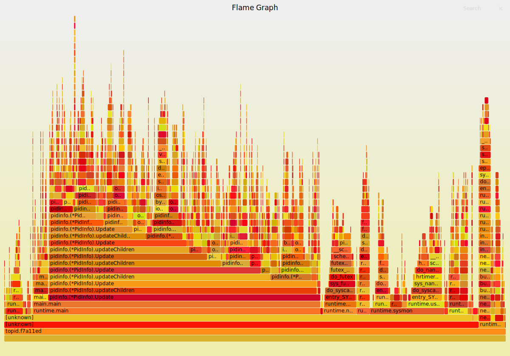

- [topid性能优化(倒叙阅读)](#topid性能优化倒叙阅读)
  - [单核和多核数据背离](#单核和多核数据背离)
  - [24核运行时](#24核运行时)
  - [单核运行时](#单核运行时)
  - [对比多核, 单核运行时](#对比多核-单核运行时)
    - [新版本](#新版本)
    - [老版本](#老版本)
  - [结论](#结论)
- [pprof数据和实际观测的背离(还是不全面)](#pprof数据和实际观测的背离还是不全面)
  - [htop采集的运行数据](#htop采集的运行数据)
  - [pprof的采集数据](#pprof的采集数据)
  - [哪个数据是准确的?](#哪个数据是准确的)
  - [perf火焰图数据来仲裁](#perf火焰图数据来仲裁)
    - [新版本在内核态多搞了什么事情?](#新版本在内核态多搞了什么事情)
  - [结论](#结论-1)
- [topid性能优化(不全面)](#topid性能优化不全面)
  - [topid和htop性能对比](#topid和htop性能对比)
    - [数据](#数据)
  - [阶段解读1](#阶段解读1)
  - [benchmark关键函数](#benchmark关键函数)
    - [分析热点调用链](#分析热点调用链)
  - [递归的routine化改造](#递归的routine化改造)
    - [改造思路和细节](#改造思路和细节)
    - [docker instance里面的结果](#docker-instance里面的结果)
    - [在host上运行](#在host上运行)
      - [系统调用次数](#系统调用次数)
      - [open的fd数](#open的fd数)
    - [goroutine数量](#goroutine数量)
      - [pprof数据](#pprof数据)
      - [同时运行新老版本](#同时运行新老版本)
  - [结论](#结论-2)
  - [再改进: 保存fd句柄, 但不在goroutine上下文中.](#再改进-保存fd句柄-但不在goroutine上下文中)
  - [题外: 尝试加goroutine](#题外-尝试加goroutine)

topid是纯go写的类似top的进程性能统计工具, 和topidchart联用可以实时图形化显示性能. [gshell topid代码](https://github.com/godevsig/grepo/tree/master/perf/topid)

虽然本文调试的时候topid还没有使用gshell框架, 但是它们的主体代码都是[lib pidinfo](https://github.com/godevsig/grepo/blob/master/lib/sys/pidinfo/pidinfo.go), 主要的活是lib干的.

# topid性能优化(倒叙阅读)

## 单核和多核数据背离
背景见下面.
还是新版本和老版本, 一点都没变.
当用taskset绑定单核运行时, 结果有惊人的变化.

## 24核运行时
见下面 htop采集的运行数据 小节
左侧是新版本, 右侧是老版本  
  

## 单核运行时
分别将新老两个版本绑定到15 16核运行
注: `taskset`和`GOMAXPROCS=1`都能够限制单核, 实测效果一样. 但后者支持跨核调度, 更好点.
```shell
GOMAXPROCS=1 ./topid.dd0301e -p 1 -tree -thread
taskset -c 15 ./topid.dd0301e -p 1 -tree -thread
```
左侧是新版本, 右侧是老版本  
  

## 对比多核, 单核运行时
* 新版本和老版本的CPU占用都下来了. 
* 新版本的CPU占用下降更多; 甚至比老版本还快.
* 新老版本使用的OS线程数量都明显下降了, 新版本减小的更多.
* taskset1以后, 采样数量都小了很多

### 新版本
多核运行时:  
  
单核运行时:  
  

解读:
* runtime.mcall大大减少, 从24核的2759次减小为31次
* runtime.futex大大减小, 从24核的4397次减小为51次
* runtime.sellock大大减小, 从24核的1131次减小为3次
* gc相关的比例还是30%多, 但绝对数量也大大减小

### 老版本
多核运行时:  
  
单核运行时:  
  

和上面类似
* runtime.mcall大大减少
* runtime.futex大大减小
* runtime.sellock本来也没有啥
* 连gc相关的比例都减小了

## 结论
go的性能和P和M的数量关系巨大, 即PMG三者中, P是执行者, M是执行环境, 代码逻辑是要干的活; M的数量受G的数量和P的数量约束
* P的数量可以用GOMAXPROCS=n来静态配置, 也可以调用runtime的GOMAXPROCS()函数来配置. 默认和CPU核数相等.
* M是runtime根据需要动态生成的, 和P的数量看起来是成比例相关性. 应该说G的数量是需求, P是比例系数, 最终确定M的数量
* 主要影响M个数的还是P, 因为P是执行者, P要结合执行环境M才能干活. P越多, 环境也要求越多.
* 活分给1个G或者多个G, 对性能影响不大. G和业务逻辑自然对应就好.不要苛求. G越多, M的数量也会多. 并不是G越多并发就越好, 但其实G多了也没啥大影响. -- 补充, 在P数量很少的情况下是的. 但如果P数量大, 比如24个, 然后你的程序的G又多, 那么效果就是M会大大增多, P和M的分离和结合是go调度器的核心, 也是性能开销巨大的地方.
* P的数量影响锁. 因为P是真正并发的个数, 并发才需要锁. 上面的数据中, P为1的时候, 原来的"广播"channel的锁的开销也变得非常小了. P为24的时候, "广播"channel的锁开销很大
* 总的来说, 活不多的时候, 多少个G做都无所谓, 主要是P越小越好. 即一个P能干完的活, 用一个P干比让多个P干更省系统资源.
* 活多的时候, 一个P干不过来, 表现是一个CPU长期100%也干不完, 那就要增大P. 增大P能多出活, 但要代价是要承担多P的调度开销, 通常来讲这个开销很不小.
* 多核环境下, 默认的P等于核数的策略, 开销很大. 建议每个go程序都要根据情况手动配置GOMAXPROCS

# pprof数据和实际观测的背离(还是不全面)
背景见下面: topid性能优化(不全面)
但里面的分析落入了"用户态"陷阱.
有很多数据对不上

## htop采集的运行数据
  
左边是新版本topid运行情况  
右边是老版本topid运行情况  
无论是从观察CPU占用的情况, 还是TIME时间统计, 新版本都比老版本CPU占用高, 累计运行时间长. 这两个程序我同时起的, 但左边新版本累计运行(即在R状态的时间)了55分钟, 右边是32分钟. 即新版本比老版本CPU占用几乎高2倍.

## pprof的采集数据
同样采样10分钟:  
新版本:  
  
  

老版本:  
  
  

可以看到, 同样是采样10分钟, pprof采样认为, 新版本真正运行了13.86s ( 2.31%); 而老版本真正运行了24.73s ( 4.12%)
即pprof认为新版本性能更好.

## 哪个数据是准确的?
pprof的采集数据和htop显示的数据是矛盾的吗? 新版本比老版本真的性能更好吗?  
从代码逻辑上说, 新版本是做了优化的:
* 优化了文件open的逻辑, 打开不关闭, 下次继续用.
* 新增每个线程一个goroutine, 来更新status情况. 大概有900个这样的goroutine

感觉上, 新版本应该性能更好. 从pprof的数据看来, 确实系统调用占比下降了. 其他也没有明显的增加, 只大概gc部分和systemstack部分有所增加.

真的吗?

## perf火焰图数据来仲裁
同样采样60秒:  
新版本:  
  

老版本:  
  

新版本的采样数为9048  
老版本的采样数为4338

这个数据很硬, 说明新版比老版本慢了. 和htop的观测数据基本一致的.  
那么怎么看pprof数据呢? 它错了吗?  
pprof也没错, 但它只报告**用户态**的数据.

从用户态来看, 新版本更快了.  
但从用户态加内核态来看, 新版本反而慢了一倍多.

另外, pprof的采样频率不高:  
10分钟期间  
新版本采样1386个, 每秒才采集到2个点.  
老版本采样2473个, 每秒才采集到4个点.  
**采样频率太低了!**  
而perf的采样每秒能到150个点. 这个差距太大了

**似乎pprof只关注用户态, 即使采样到本进程的内核态函数, 似乎pprof就忽略了, 并不计入统计. 就好像这个进程的内核态时间不算一样.**

这样就可以解释, 比如在pprof看来, 新老版本的runtime.futex的采样数差不多, 但perf看来确实新版本比老版本多两倍. 如果pprof采样时, 只看用户态的栈, 那么比如某个时刻pprof采样到内核态, 它不管了; 但实际上, 此时是内核在做runtime.futex的事情. perf会通过回溯内核栈知道是runtime.futex, 但pprof没有能力知道这个信息, 就没有统计进.


PS: 网上说runtime的
`func SetCPUProfileRate(hz int)`  
可以修改采样频率. -- 好像加了没有用? 还是默认的100

### 新版本在内核态多搞了什么事情?
新版本用户态的逻辑确实快了, 但却带了更大的内核态开销.  
要对比一下:  
新版本的采样数为9048  
老版本的采样数为4338  

* **runtime.futex**, 这个函数是goroutine睡眠和唤醒的关键函数
    * 新版本: `9048*48.6% = 4397`
    * 老版本: `4338*53.7% = 2329`
    * 新版比老版多了近一倍
* runtime.sellock
    * 新版本: `9048*12.5% = 1131`
    * 老版本: 几乎可以忽略
    * 因为新版本中, 900个gotouine都"监听"一个channel, 这个channel用close来"广播"事件. 这个channel的锁开销**非常大**
* **runtime.mcall**
    * 新版本: `9048*30.5% = 2759`
    * 老版本: `4338*36.7% = 1592`
    * 新版本也是老版本的2倍, 是因为线程多吗?
* runtime.sysmon
    * 新版本: 4.9%, 443个
    * 老版本: 8.5%, 368个
    * sysmon并没有太大影响
* **gc相关(统计正则"bg|gc")**
    * 新版本: 35%
    * 老版本: 29%
    * 还是新版本多了不少
    
## 结论
* 新版本比老版本慢. 主要原因是goroutine调度和channel的锁, 以及gc开销变大
* 新版本的线程数也多, mcall也有开销.
* pprof工具不统计目标进程的内核态的开销, 导致和实际观测结果不一致. 说三遍
* pprof工具不统计目标进程的内核态的开销, 导致和实际观测结果不一致. 说三遍
* pprof工具不统计目标进程的内核态的开销, 导致和实际观测结果不一致. 说三遍

# topid性能优化(不全面)
## topid和htop性能对比
测试命令: `./topid -p 1 -tree -thread`和`htop`  
或者`GOMAXPROCS=1 ./topid -p 1 -tree -thread`

### 数据
* 目测htop的CPU占用在3%左右. 偶尔能到7%
* htop的系统调用

```shell
perf stat --log-fd 1 -e 'syscalls:sys_enter_*' -p 17470 -- sleep 10 | egrep -v "[[:space:]]+0"

 Performance counter stats for process id '17470':

                62 syscalls:sys_enter_poll
             4,044 syscalls:sys_enter_getdents
                12 syscalls:sys_enter_newstat
             2,046 syscalls:sys_enter_newfstat
            23,928 syscalls:sys_enter_read
               413 syscalls:sys_enter_write
            17,946 syscalls:sys_enter_openat
            13,992 syscalls:sys_enter_close
                12 syscalls:sys_enter_rt_sigaction

      10.221686634 seconds time elapsed
```
* topid, e86db98(opt1)的CPU占用总体较高, 跳跃幅度大, 最小3%, 最大有11%.
* topid的系统调用

```shell
#连续3次执行
perf stat --log-fd 1 -e 'syscalls:sys_enter_*' -p 28187 -- sleep 10 | egrep -v "[[:space:]]+0"

#1
 Performance counter stats for process id '28187':

            40,904 syscalls:sys_enter_epoll_ctl
               243 syscalls:sys_enter_epoll_pwait
             2,174 syscalls:sys_enter_getdents64
                24 syscalls:sys_enter_fcntl
            27,688 syscalls:sys_enter_read
             9,368 syscalls:sys_enter_write
            18,749 syscalls:sys_enter_openat
            18,748 syscalls:sys_enter_close
             1,770 syscalls:sys_enter_madvise
             6,026 syscalls:sys_enter_futex
             2,927 syscalls:sys_enter_nanosleep
             6,749 syscalls:sys_enter_sched_yield

      14.298493125 seconds time elapsed

#2
 Performance counter stats for process id '28187':

            30,728 syscalls:sys_enter_epoll_ctl
               198 syscalls:sys_enter_epoll_pwait
             1,782 syscalls:sys_enter_getdents64
                20 syscalls:sys_enter_fcntl
            22,691 syscalls:sys_enter_read
             7,677 syscalls:sys_enter_write
            15,364 syscalls:sys_enter_openat
            15,364 syscalls:sys_enter_close
             1,294 syscalls:sys_enter_madvise
             3,415 syscalls:sys_enter_futex
             1,668 syscalls:sys_enter_nanosleep
            25,145 syscalls:sys_enter_sched_yield

      11.999374271 seconds time elapsed

#3
Performance counter stats for process id '28187':

            30,730 syscalls:sys_enter_epoll_ctl
               197 syscalls:sys_enter_epoll_pwait
             1,978 syscalls:sys_enter_getdents64
                24 syscalls:sys_enter_fcntl
            27,721 syscalls:sys_enter_read
             9,379 syscalls:sys_enter_write
            18,771 syscalls:sys_enter_openat
            18,770 syscalls:sys_enter_close
             1,650 syscalls:sys_enter_madvise
             4,870 syscalls:sys_enter_futex
             2,535 syscalls:sys_enter_nanosleep
               166 syscalls:sys_enter_sched_yield

      12.300680961 seconds time elapsed
```
* topid, f7a11ed(opt2+other): 相比较opt1, 没有明显CPU利用率的变化, 最小3.3%, 7.2%, 9.1%, 偶尔到11.1%


## 阶段解读1
* 从文件open和read来看, htop和topid数量级差不多
* 文件close上htop要少
* 从以上看似乎htop并没有采取"保持open"的策略
* topid的opt2对比opt1没有性能上的变化, opt2只是去掉了map的遍历以及多调用的一次pi.Children()调用, 都属于很小的优化点.
* opt2的代码可以做为baseline

## benchmark关键函数
关键函数是Update()
该baseline的benchmark性能在2ms左右, 这是docker实例里的pid1的

```go
//benchmark:
for i := 0; i < b.N; i++ {
        if err := pi.Update(); err != nil {
            b.Errorf("main: %v\n", err)
            return
        }
    }
```
```shell
#结果
yingjieb@3a9f377eee5d /repo/yingjieb/godev/practice/src/pidinfo
$ go test -run xxxxxx -bench BenchmarkP1InfoUpdate
goos: linux
goarch: amd64
pkg: pidinfo
BenchmarkP1InfoUpdate-23             712           1539443 ns/op
PASS
ok      pidinfo 1.293s
```

### 分析热点调用链
```shell
#先利用go test记录cpu的profile文件
go test -run xxxxxx -bench BenchmarkP1InfoUpdate -cpuprofile cpu.out
#打开pprof工具分析
go tool pprof -http=0.0.0.0:8000 cpu.out
#网页浏览
http://10.182.105.138:60080
```
  

从图中得出, 关键在频繁的open read close系统调用.  
而且, go的runtime特别喜欢在系统调用路径上埋桩, 比如open的时候会把fd加到epoll里面, 导致epollctl比较高, 几乎和open+close相当. 10秒3万次.  
相对于C的htop, 虽然open和close也在每秒万次级别, 但htop没有使用epollctl; htop只有几十次的poll系统调用

到这里, 可以看到, GO程序的开销还是比较大的, 主要有:
* 系统调用开销: go的open read write系统调用, 首先是受runtime用户态调度的; 即read()发生时, runtime把这个goroutine调度出去, 待该fd可以read了再调度回来. 之所以能做到用户态调度, 是因为runtime记录了每个open的文件的fd, 并加到epoll_ctl里面管理.
* GC的开销

实际上, 可以利用go的"同步"特性, 用**保持open**的方式来避免反复的open read close文件.
如果去掉上图的 1 2 3, 只留read, 估计至少可以提高性能一倍.
即下面这个函数相关的逻辑要改造
```go
func readFile(filename string) ([]byte, error) {
    f, err := os.Open(filename)
    if err != nil {
        return nil, fmt.Errorf("%s: %w", here(), err)
    }
    defer f.Close()

    return ioutil.ReadAll(f)
}
```
关键是怎么利用goroutine, 让open的文件保持. 整个程序的思路要从C的递归思路, 转变为go的routine思路.

## 递归的routine化改造
### 改造思路和细节
### docker instance里面的结果
benchmarking的结果是:
同一个环境, 老版本和新版本都run三次

新版本(并发版本)大概在2ms左右
```shell
$ go test -run xxxxxx -bench BenchmarkP1InfoUpdate
goos: linux
goarch: amd64
pkg: pidinfo
BenchmarkP1InfoUpdate-23             732           2105706 ns/op
PASS
ok      pidinfo 4.919s
```

老版本(递归版本)大概4ms
```shell
$ go test -run xxxxxx -bench BenchmarkP1InfoUpdate
goos: linux
goarch: amd64
pkg: pidinfo
BenchmarkP1InfoUpdate-23             273           4075231 ns/op
PASS
ok      pidinfo 1.557s
```

从这个数据看, 新版本优于老版本.

### 在host上运行
#### 系统调用次数
系统调用次数统计中, epoll_ctl, open和close次数减小的非常明显, 符合预期.
```shell
root@godev-server:/repo/yingjieb/godev/practice/src/tools# perf stat --log-fd 1 -e 'syscalls:sys_enter_*' -p 3632 -- sleep 10 | egrep -v "[[:space:]]+0"

 Performance counter stats for process id '3632':

                24      syscalls:sys_enter_epoll_ctl
               277      syscalls:sys_enter_epoll_pwait
             2,954      syscalls:sys_enter_getdents64
                 8      syscalls:sys_enter_fcntl
            22,029      syscalls:sys_enter_lseek
            30,716      syscalls:sys_enter_read
             2,204      syscalls:sys_enter_write
                 6      syscalls:sys_enter_openat
                 8      syscalls:sys_enter_close
             1,600      syscalls:sys_enter_madvise
             5,544      syscalls:sys_enter_futex
             2,615      syscalls:sys_enter_nanosleep
               708      syscalls:sys_enter_sched_yield

      21.666616483 seconds time elapsed
```


#### open的fd数
大概在2K数量级, 超过了默认的1024.
要先`ulimit -n 10240`扩大打开文件的上限.
```shell
yingjieb@godev-server /proc/3632/fd
$ ll | wc -l
1972
```

### goroutine数量
大概2K个  
  

#### pprof数据
  

1. 是系统调用, 主要是read; 占33%
2. 是GC, 占35%
3. 是调度, 占7%

综合来看, 这么多个goroutine(2K)情况下, 调度其实占比不多. 而实际上, 系统调用次数和开销明显减小了;
但GC的情况变得很糟糕, 有1/3的时间全部在搞GC.

#### 同时运行新老版本
同时运行两个版本, 用htop观察  
  
  
  

可以看到, 新版本并没有变好, 甚至观察到比老版本还稍差.
* 打开的fd多, 需要先修改ulimit的文件打开上限数
* 占用内存多, 新版本21M, 老版本8M

## 结论
新版本的思路是用goroutine长期持有fd, open了不关闭, 需要read的时候, 用channel来触发. 但新版本并没有保存fd到记录, 而是每个新的fd都开一个goroutine来守护, 同时搭配channel来协同工作. 这是用goroutine+channel的组合来替换反复的open close文件操作.

* 当进程数较少时, 新版本有性能优势. 因为避免了老版本的重复open close文件的开销
* 当进程数很多时, 新版本反而性能更差. 
    * 其实调度的开销并不是很大, 这么多个goroutine才7%左右; 补充, 有的时候也能到20%
    * **开销大的是GC**. 异步程序设计复杂, 程序逻辑更多. 也加剧了GC的开销.大量的map使用, 应该是主要原因.

所以凡事无绝对, 要看什么场景.

## 再改进: 保存fd句柄, 但不在goroutine上下文中.
减小goroutine的数量. 减小异步交互. 减小逻辑复杂度.
最终的目的是减小GC压力.

## 题外: 尝试加goroutine
在调用点
1. for循环里得到线程列表, 调用线程的update函数的时候, 用goroutine
2. for循环里得到子进程的历表, 调用子进程的update函数的时候, 用goroutine

类似这样:
```go
    //fmt.Printf("Process %d's child processes:%v\n", pi.pid, pi.children)
    for _, childpid := range pi.childrenIds {
        childpid := childpid
        childpi := pi.children[childpid]

        //wrong use of goroutine, 并发panic
        go func() {
            //fmt.Println("Updating PidInfo for", childpid)
            if err := childpi.Update(); err != nil {
                delete(pi.children, childpid)
            }
        }()
    }
```

注意, 这样使用会有并发问题
`go test -run xxxxxx -bench BenchmarkP1InfoUpdate`执行后, 会报错:
```go
yingjieb@3a9f377eee5d /repo/yingjieb/godev/practice/src/pidinfo
$ go test -run xxxxxx -bench BenchmarkP1InfoUpdate
goos: linux
goarch: amd64
pkg: pidinfo
BenchmarkP1InfoUpdate-23        fatal error: concurrent map read and map write

goroutine 13 [running]:
runtime.throw(0x5623be, 0x21)
        /usr/local/go/src/runtime/panic.go:774 +0x72 fp=0xc0000b5d98 sp=0xc0000b5d68 pc=0x42d232
runtime.mapaccess1_fast64(0x52d800, 0xc0000b2450, 0x2900, 0xc000150828)
        /usr/local/go/src/runtime/map_fast64.go:21 +0x1a6 fp=0xc0000b5dc0 sp=0xc0000b5d98 pc=0x410136
pidinfo.(*PidInfo).updateThreads(0xc0000fc300, 0x0, 0x0)
        /repo/yingjieb/godev/practice/src/pidinfo/pidinfo.go:315 +0x3e0 fp=0xc0000b5f08 sp=0xc0000b5dc0 pc=0x506f30
pidinfo.(*PidInfo).Update(0xc0000fc300, 0x0, 0x0)
        /repo/yingjieb/godev/practice/src/pidinfo/pidinfo.go:486 +0x16e fp=0xc0000b5fa0 sp=0xc0000b5f08 pc=0x50885e
pidinfo.(*PidInfo).updateChildren.func1(0xc0000fc300, 0xc0000fc000, 0x2885)
        /repo/yingjieb/godev/practice/src/pidinfo/pidinfo.go:393 +0x2b fp=0xc0000b5fc8 sp=0xc0000b5fa0 pc=0x509eab
runtime.goexit()
        /usr/local/go/src/runtime/asm_amd64.s:1357 +0x1 fp=0xc0000b5fd0 sp=0xc0000b5fc8 pc=0x45b8b1
created by pidinfo.(*PidInfo).updateChildren
        /repo/yingjieb/godev/practice/src/pidinfo/pidinfo.go:391 +0x8e9
```
因为在更新线程状态的时候, 会对同一个map读写.  
说明runtime有一定能力检测并发问题, 并进行运行时的panic处理.
