- [处理import, 解决unable to find source related to: xxxxxx](#处理import-解决unable-to-find-source-related-to-xxxxxx)
  - [现象](#现象)
  - [解决](#解决)
  - [我的操作](#我的操作)
    - [下载`go-figure`](#下载go-figure)
    - [拷贝第三方库到`$GOPATH/src`](#拷贝第三方库到gopathsrc)
  - [总结](#总结)
  - [参考](#参考)
- [yeagi执行流程和损耗](#yeagi执行流程和损耗)
  - [先说数据](#先说数据)
  - [perf采样](#perf采样)
    - [binary topid](#binary-topid)
    - [yaegi topid](#yaegi-topid)
  - [优化](#优化)
- [interface wrapper](#interface-wrapper)
  - [空指针引用panic](#空指针引用panic)
  - [解决](#解决-1)
  - [reflect出现assignable错误](#reflect出现assignable错误)
- [bin不能调用解释器里对象的方法, 但解释器里可以调用对象的方法](#bin不能调用解释器里对象的方法-但解释器里可以调用对象的方法)
- [Methods can not be called by bin](#methods-can-not-be-called-by-bin)
- [go embed和yaegi](#go-embed和yaegi)
  - [嵌入scriptlib.go](#嵌入scriptlibgo)
  - [scriptlib是要解释执行的库](#scriptlib是要解释执行的库)
  - [使用时](#使用时)
- [yaegi如何执行go语句](#yaegi如何执行go语句)
  - [ast阶段](#ast阶段)
  - [cfg阶段](#cfg阶段)
  - [run阶段](#run阶段)
    - [builtin数组里面, aCall和aCallSlice的action是call](#builtin数组里面-acall和acallslice的action是call)
    - [case callExpr里面callBin被当作快速路径?](#case-callexpr里面callbin被当作快速路径)
- [yaegi使用](#yaegi使用)
  - [Eval](#eval)
  - [Stop脚本](#stop脚本)
    - [bin函数执行时不能被cancel](#bin函数执行时不能被cancel)
    - [怎么解决呢?](#怎么解决呢)
    - [结果](#结果)
    - [题外](#题外)
- [yaegi已知问题](#yaegi已知问题)
  - [脚本的结构体没有名字](#脚本的结构体没有名字)
- [yaegi执行过程](#yaegi执行过程)
- [yaegi集成到gshell](#yaegi集成到gshell)
  - [new 解释器](#new-解释器)
- [yaegi使用](#yaegi使用-1)
  - [编译运行](#编译运行)
    - [debug](#debug)
    - [ast和cfg举例图](#ast和cfg举例图)
      - [空敲回车](#空敲回车)
      - [`a := 100`](#a--100)
      - [`s := "hello world"`](#s--hello-world)
      - [if](#if)
      - [slice](#slice)
      - [import](#import)
      - [for range](#for-range)
      - [函数定义](#函数定义)
      - [func call](#func-call)
  - [使用例子](#使用例子)
  - [动态代码](#动态代码)
- [解释器调用bin符号 -- 代码生成部分](#解释器调用bin符号----代码生成部分)
  - [go generate](#go-generate)
    - [extract包](#extract包)
    - [不用New的对象初始化](#不用new的对象初始化)
    - [Extract方法](#extract方法)
    - [go/importer 和 go/types](#goimporter-和-gotypes)
    - [模板替换](#模板替换)
      - [模板](#模板)
      - [替换结果举例](#替换结果举例)
- [yaegi](#yaegi)
  - [背景知识](#背景知识)
    - [AST语法树](#ast语法树)
      - [`1+3*(4-1)+2`](#134-12)
      - [xml](#xml)
      - [while](#while)
      - [for](#for)
    - [为什么需要抽象语法树](#为什么需要抽象语法树)
    - [函数](#函数)
    - [第一步：词法分析，也叫扫描scanner](#第一步词法分析也叫扫描scanner)
    - [第二步：语法分析，也称解析器](#第二步语法分析也称解析器)
  - [main](#main)
  - [解释器](#解释器)
  - [解释器调用bin里的符号](#解释器调用bin里的符号)
    - [使用refect.Value.Call()的例子](#使用refectvaluecall的例子)
    - [查找bin 的method](#查找bin-的method)
    - [`interp/run.go`的call()函数](#interprungo的call函数)
  - [ast的node](#ast的node)
  - [Eval](#eval-1)
    - [ast函数](#ast函数)
    - [builtin预定义action](#builtin预定义action)
    - [cfg函数](#cfg函数)
    - [frame类型](#frame类型)
    - [run函数](#run函数)
    - [exec举例](#exec举例)
  - [总结](#总结-1)
  - [代码生成](#代码生成)
  - [REPL循环](#repl循环)
    - [EvalWithContext](#evalwithcontext)
    - [总结](#总结-2)

# 处理import, 解决unable to find source related to: xxxxxx
## 现象
使用原版yaegi
```go
cat cmd/yaegi/test/figure.go

package main

import("github.com/common-nighthawk/go-figure")

func main() {
    myFigure := figure.NewFigure("Hello World", "", true)
    myFigure.Print()
}
```
运行时报错:
```shell
$ cmd/yaegi/yaegi run cmd/yaegi/test/figure.go
run: cmd/yaegi/test/figure.go:3:8: import "github.com/common-nighthawk/go-figure" error: unable to find source related to: "github.com/common-nighthawk/go-figure"
```
## 解决
从yaegi的问题讨论来看, 似乎go mod方式支持import还不支持?  
有人总结import第三方库的步骤如下:
1.  go mod init xxx
2.  go get .
3.  go mod vendor
4.  copy package folder (under vendor folder) to $GOPATH/src
5.  yaegi run ./main.go

## 我的操作
### 下载`go-figure`
我首先下载了`go-figure`这个库
```shell
go get github.com/common-nighthawk/go-figure
```
这个命令会下载package的源码到`GOPATH`, 我的`GOPATH`是`/repo/yingjieb/go`
```
$ ls /repo/yingjieb/go/pkg/mod/github.com/common-nighthawk/
go-figure@v0.0.0-20210622060536-734e95fb86be
```

同时修改工程的`go.mod`, 增加一行
```
require github.com/common-nighthawk/go-figure v0.0.0-20210622060536-734e95fb86be // indirect
```
这步完成后重新运行`cmd/yaegi/yaegi run cmd/yaegi/test/figure.go`还是报一样的错误, 说明yaegi不支持go mod方式.

### 拷贝第三方库到`$GOPATH/src`
注意直接拷贝`go-figure@v0.0.0-20210622060536-734e95fb86be`是不行的, 我按照上面的步骤先`go mod vendor`在当前工程下面生成了依赖包. 我这个简单的`figure.go`只依赖一个包:
```
$ ls vendor/github.com/common-nighthawk/
go-figure
```
拷贝这个包到`$GOPATH/src`
```
$ ls /repo/yingjieb/go/src/github.com/common-nighthawk/
go-figure
```

最后运行正常
```
$ cmd/yaegi/yaegi run cmd/yaegi/test/figure.go
 _   _          _   _            __        __                 _       _
| | | |   ___  | | | |   ___     \ \      / /   ___    _ __  | |   __| |
| |_| |  / _ \ | | | |  / _ \     \ \ /\ / /   / _ \  | '__| | |  / _` |
|  _  | |  __/ | | | | | (_) |     \ V  V /   | (_) | | |    | | | (_| |
|_| |_|  \___| |_| |_|  \___/       \_/\_/     \___/  |_|    |_|  \__,_|
```

## 总结
* yaegi支持第三方库的解释, 但只认`$GOPATH/src`, 不认`$GOPATH/pkg/mod`
* `$GOPATH/src`下面的package不带版本号, 而`$GOPATH/pkg/mod`下面的package带版本号
* `go mod vendor`的作用是把所有的依赖的包都放到工程的vendor目录下, 保证main module能编译.

## 参考
* https://github.com/traefik/yaegi/pull/1265
* https://github.com/traefik/yaegi/issues/1517
* 源码`interp/src.go`, 函数`func (interp *Interpreter) pkgDir(goPath string, root, importPath string) (string, string, error)`
* 可以在new interpreter的时候传入GOPATH: `I := interp.New(interp.Options{GoPath: build.Default.GOPATH}) `

# yeagi执行流程和损耗
同样的go代码topid, 解释执行和编译执行的性能分析和对比如下.  
原始代码在 https://github.com/godevsig/grepo

## 先说数据
* 两个程序做的事情一模一样
* 跑了一个小时, yaegi的topid实际占用79秒, 平均2.2%
* 同样一个小时, bin topid实际占用33秒, 平均0.9%
* 二者大概差两倍, 也就是说对这个case, 解释会增加100%的成本

## perf采样
```sh
perf record -g -p 18149 -- sleep 60
perf script | /repo/yingjieb/FlameGraph/stackcollapse-perf.pl | /repo/yingjieb/FlameGraph/flamegraph.pl > topid.svg
```
### binary topid
  

* 实际干活是蓝色框
* 被pmu中断会算在进程时间里

### yaegi topid
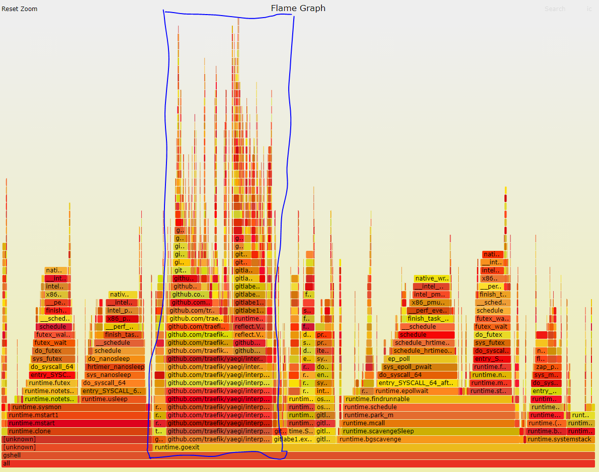  
  
* yaegi的解释执行执行是个递归的过程, 具体来说就是`interp.runCfg`和`interp.call.func6`的递归  
  
* 出现很多`fmt.Fprintf`和`fmt.Sprintf`是在递归打印进程信息. 这个过程要不断解释, 递归执行.
* 真正的printf只占很小比例, 很多时间花在了`interp.runCfg`和`interp.call.func6`的递归中, 即: 时间花在了"解释"代码而非"执行"代码

## 优化
* 尽量避免解释, 但又不要把太多"应用逻辑"塞到bin里.
* 目前来看, 如果`showPidInfo`解释起来成本稍高, 但如果是网络传输, `appendProcessInfo`函数应该好点.
* 结论就是保持现状, 不增加bin call api.

# interface wrapper
yaegi对于带方法的iface, 都自动生成了一个interface wrapper
比如stdlib的flag.go:
```go
// _flag_Value is an interface wrapper for Value type
type _flag_Value struct {
    IValue  interface{}
    WSet    func(a0 string) error
    WString func() string
}

func (W _flag_Value) Set(a0 string) error { return W.WSet(a0) }
func (W _flag_Value) String() string      { return W.WString() }
```
因为bin call不能直接认识解释模式下的类型定义, yaegi的做法是, 定义一个wrapper 结构体, 例如上面的`_flag_Value`, 这个结构体实现了规定的方法; 估计yaegi在解释的时候, 把需要满足该接口的类型(flag.Value), 包装成`_flag_Value`. 这样bin call就可以调用脚本的方法了.
-- 注意, << Methods can not be called by bin >>描述的是eface(`interface{}`)的处理, 因为fmt传入的是eface, fmt包里面断言其有`String() string`方法; 但yaegi没有办法把一个eface也包装, 所以不能输出`aaaa`
-- 但这里, 是明确的带方法的iface, 那么yaegi就能wrap 这个iface

## 空指针引用panic
对应的应用代码
```go
var pids pidValue

func main() {
    flags := flag.NewFlagSet("", flag.ContinueOnError)
    flags.SetOutput(os.Stdout)
    
    flags.Var(&pids, "p", "process id. Multiple -p is supported, but -tree and -child are ignored (default -1)")
    flags.BoolVar(&sf.memMB, "MB", false, "show mem in MB (default in KB)")
    ...
    if err = flags.Parse(args); err != nil {
        if err == flag.ErrHelp {
            err = nil
        }
        return err
    }
}
```
上面的pid是自定义的满足falg.Value的接口:
注意我加了调试打印
```go
type pidValue []int

func (pids *pidValue) String() string {
    fmt.Println("===== string")
    return "[-1]"
}

func (pids *pidValue) Set(value string) error {
    pid, err := strconv.Atoi(value)
    if err != nil {
        return err
    }
    *pids = append(*pids, pid)
    return nil
}
```
解释:
* 首先, pidValue的`String()`方法能够被调用, 能打印"===== string"; 说明yaegi里面`方法明确的iface`方法**是能够被调用的**
* 代码在`flags.Parse(args)`里面panic

加`-h`打印help时出现panic
路径显示在`flag.isZeroValue`有空引用
```go
runtime error: invalid memory address or nil pointer dereference

flag.isZeroValue(0xc00028dd00, 0x0, 0x0, 0xc0000f7801)
flag.(*FlagSet).PrintDefaults.func1(0xc00028dd00)
```

对应的代码`isZeroValue()`是在打印help的过程中被`PrintDefaults()`调用的:
```go
// isZeroValue determines whether the string represents the zero
// value for a flag.
func isZeroValue(flag *Flag, value string) bool {
    // Build a zero value of the flag's Value type, and see if the
    // result of calling its String method equals the value passed in.
    // This works unless the Value type is itself an interface type.
    typ := reflect.TypeOf(flag.Value)
    var z reflect.Value
    if typ.Kind() == reflect.Ptr {
        z = reflect.New(typ.Elem())
    } else {
        z = reflect.Zero(typ)
    }
    return value == z.Interface().(Value).String()
}
```
* 普通bool flag定义:
`flags.BoolVar(&sf.memMB, "MB", false, "show mem in MB (default in KB)")`  
这个BoolVar对应到isZeroValue()的入参flag是:  
`&flag.Flag{Name:"MB", Usage:"show mem in MB (default in KB)", Value:(*flag.boolValue)(0xc000728142), DefValue:"false"}`  
显示其底层是`*flag.boolValue`类型.

* `flag.Value` iface定义:  
而`flags.Var(&pids, "p", "process id. Multiple -p is supported, but -tree and -child are ignored (default -1)")`  
因为`func (f *FlagSet) Var(value Value, name string, usage string)`函数要求value是`flag.Value`这个iface, 而pids是pidValue满足接口要求, yaegi就"构造"了一个wrapper:  
`&flag.Flag{Name:"p", Usage:"process id. Multiple -p is supported, but -tree and -child are ignored (default -1)", Value:stdlib._flag_Value{IValue:(*[]int)(0xc000444ed0), WSet:(func(string) error)(0x4c5bc0), WString:(func() string)(0x4c5bc0)}, DefValue:""}`  
注意, 此时在`isZeroValue()`看来, 这个flag就是`stdlib._flag_Value`类型了  
但为什么会panic? 需要往下看:  
为了比较这个flag值是否为零值, `z = reflect.Zero(typ)`调用后, z的值为零值, 其`Wstring`方法也是nil:   
`stdlib._flag_Value{IValue:interface {}(nil), WSet:(func(string) error)(nil), WString:(func() string)(nil)}`  
那么在调用的时候, `func (W _flag_Value)  String()  string  {  return W.WString()  }`就会引用nil, 从而产生panic

## 解决
我的解决办法是在代码生成模板里面加nil的check:
```go
We have interface wrapper that has funcion wrappers which may be nil
in some cases, for example in stdlib flag.go

type _flag_Value struct {
    IValue  interface{}
    WSet    func(a0 string) (r0 error)
    WString func() (r0 string)
}

WString can be nil in flag package calling PrintDefaults() in which
isZeroValue() is called where String() is called on zero value:

func isZeroValue(flag *Flag, value string) bool {
    ...
    z = reflect.Zero(typ)
    return value == z.Interface().(Value).String()
}

This causes runtime error: invalid memory address or nil pointer dereference
because WString is nil:

func (W _flag_Value) String() string      { return W.WString() }

The fix is adding a check before calling the func wrapper:

func (W _flag_Value) String() (r0 string) {
    if W.WString == nil {
        return
    }
    return W.WString()
}
```

## reflect出现assignable错误
出现错误: `reflect.Set: value of type interface {} is not assignable to type interp.valueInterface`

出错代码在:
```go
// messageOut represents a message to be sent
type messageOut interface {
    isMessageOut()
}

var outputCh chan messageOut = make(chan messageOut, 30)

    select {
    case <-ctx.Done():
        return
    case msg := <-outputCh: //这句出错
        err := marshalMsg(msg)
        if err != nil {
            fmt.Println(err)
        }
    }
```
这里的`valueInterface`在`interp/run.go`
```go
type valueInterface struct {
    node  *node
    value reflect.Value
}
```
看字面意思: interface{}的值不能赋值给`interp.valueInterface`
我理解应该是interp规定的interface在bin里可能是不认的.

# bin不能调用解释器里对象的方法, 但解释器里可以调用对象的方法
下面的代码在yaegi里运行正常, 和编译运行结果一样
```go
package main

import (
    "fmt"
    "math"
)

type geometry interface {
    area() float64
    perim() float64
}

type rect struct {
    width, height float64
}
type circle struct {
    radius float64
}

func (r rect) area() float64 {
    return r.width * r.height
}
func (r rect) perim() float64 {
    return 2*r.width + 2*r.height
}

func (c circle) area() float64 {
    return math.Pi * c.radius * c.radius
}
func (c circle) perim() float64 {
    return 2 * math.Pi * c.radius
}

func measure(g geometry) {
    fmt.Println(g)
    fmt.Println(g.area())
    fmt.Println(g.perim())
}

func main() {
    r := rect{width: 3, height: 4}
    c := circle{radius: 5}

    measure(r)
    measure(c)
}
```

结果:
```
{3 4}
12
14
{5}
78.53981633974483
31.41592653589793
```

# Methods can not be called by bin

If a struct has `String() string` method, `fmt.Printf` will call this method in compiled go:

```go
type test struct {
    a int
    c string
}

func (t *test) String() string {
    return "aaaa"
}

func main() {
    fmt.Println("Hello, world!")
    fmt.Printf("%v\n", &test{1, "nihao"})
}
```

```sh
$ go run hello.go
Hello, world!
aaaa
```

But gshell output:

```sh
$ gsh exec hello.go
Hello, world!
{1 nihao}
```
说明在解释器模式下, fmt.Printf()是看不到`test`类型的任何方法的. 实际上, `type`定义的结构体其实是没有名字的, 这是reflect的限制, 用reflect只能产生匿名的结构体.

相关讨论:
* https://github.com/golang/go/issues/16522
* https://github.com/traefik/yaegi/issues/1535

# go embed和yaegi

## 嵌入scriptlib.go
```go
import _ "embed" // embed libs

//go:embed scriptlib/scriptlib.go
var scriptlib string

func (sh *shell) loadScriptLib() error {
    _, err := sh.Eval(scriptlib)
    if err != nil {
        return fmt.Errorf("load script libs error: %s", err)
    }
    return nil
}
```

## scriptlib是要解释执行的库
```go
// Package scriptlib should be used as loadable scripts
package scriptlib

import (
    "fmt"
    "io"
    "net/http"
)

// HTTPGet gets file from url
func HTTPGet(url string) ([]byte, error) {
    resp, err := http.Get(url)
    if err != nil {
        return nil, err
    }
    defer resp.Body.Close()
    if resp.StatusCode != 200 {
        return nil, fmt.Errorf("file not found: %d error", resp.StatusCode)
    }

    body, err := io.ReadAll(resp.Body)
    if err != nil {
        return nil, err
    }

    return body, nil
}
```

## 使用时
newShell以后, loadScriptLib就是`sh.Eval(scriptlib)`, 就把embed的scriptlib.go解释编译了.  
`v, err := crs.sh.Eval("scriptlib.HTTPGet")`就是把文本的符号`scriptlib.HTTPGet`解释成一个函数, 然后  
强制转换成native go能够执行的函数:  
`crs.httpGet = v.Interface().(func(url string) ([]byte, error))`
```go
crs := &codeRepoSvc{sh: newShell(interp.Options{}), repoInfo: repoInfo}
if err := crs.sh.loadScriptLib(); err != nil {
    return err
}
v, err := crs.sh.Eval("scriptlib.HTTPGet")
if err != nil {
    return err
}
crs.httpGet = v.Interface().(func(url string) ([]byte, error))
if err := s.Publish("codeRepo",
    codeRepoKnownMsgs,
    as.OnNewStreamFunc(func(ctx as.Context) { ctx.SetContext(crs) }),
); err != nil {
    return err
}
```

# yaegi如何执行go语句
## ast阶段
```go
// ast parses src string containing Go code and generates the corresponding AST.
// The package name and the AST root node are returned.
// The given name is used to set the filename of the relevant source file in the
// interpreter's FileSet.
func (interp *Interpreter) ast(src, name string, inc bool) (string, *node, error)
    switch nod.(type)
        case *ast.GoStmt:
            st.push(addChild(&root, anc, pos, goStmt, aNop), nod)
```

## cfg阶段
```go
// cfg generates a control flow graph (CFG) from AST (wiring successors in AST)
// and pre-compute frame sizes and indexes for all un-named (temporary) and named
// variables. A list of nodes of init functions is returned.
// Following this pass, the CFG is ready to run.
func (interp *Interpreter) cfg(root *node, importPath, pkgName string) ([]*node, error)

        switch n.kind {
        case deferStmt, goStmt:
            wireChild(n)
```

## run阶段
### builtin数组里面, aCall和aCallSlice的action是call
```go
func call(n *node) {
    goroutine := n.anc.kind == goStmt
    n.exec = func(f *frame) bltn {
        bf := value(f)
        if bf.IsValid() { // 如果是bin func
            if goroutine {
                go bf.Call(in) // go关键词, 起goroutine来调用bf.Call
                return tnext
            }
            out := bf.Call(in) // 直接调用bf.Call
            ...
        }
        
        //下面是脚本的func执行流程
        nf := newFrame(anc, len(def.types), anc.runid()) // 先建立新frame
        
        if goroutine {
            go runCfg(def.child[3].start, nf, def, n) // goroutine执行函数体
            return tnext
        }
        
        runCfg(def.child[3].start, nf, def, n) // 直接执行函数体
    }
```

runCfg()函数内部已经recover了panic, 但会再次触发panic, 这点不是我们想要的:
```go
func runCfg(n *node, f *frame, funcNode, callNode *node) {
    defer func() {
        f.mutex.Lock()
        f.recovered = recover()
        for _, val := range f.deferred {
            val[0].Call(val[1:])
        }
        if f.recovered != nil {
            oNode := originalExecNode(n, exec)
            if oNode == nil {
                oNode = n
            }
            fmt.Fprintln(n.interp.stderr, oNode.cfgErrorf("panic"))
            f.mutex.Unlock()
            panic(f.recovered)
        }
        f.mutex.Unlock()
    }()
}
```
上面逻辑对应的调用栈:
```go
panic: test panic [recovered] //对应上面代码的recover
    panic: test panic //代码里再次panic
    
github.com/traefik/yaegi/interp.runCfg.func1 //对应runCfg的defer执行的函数
panic
github.com/traefik/yaegi/interp._panic.func1 //对应脚本里调用panic
github.com/traefik/yaegi/interp.runCfg
github.com/traefik/yaegi/interp.call.func6
```

所以:
脚本里调用的panic, 实际上是`interp/run.go`里的
```go
func _panic(n *node) {
    value := genValue(n.child[1])

    n.exec = func(f *frame) bltn {
        panic(value(f))
    }
}
```

### case callExpr里面callBin被当作快速路径?
```go
// ast阶段代码
case callExpr:
    case isBinCall(n):
    n.gen = callBin
```

```go
// Callbin calls a function from a bin import, accessible through reflect.
func callBin(n *node) {
    case n.anc.kind == goStmt:
        // Execute function in a goroutine, discard results.
        n.exec = func(f *frame) bltn {
            in := make([]reflect.Value, l)
            for i, v := range values {
                in[i] = v(f)
            }
            go callFn(value(f), in)
            return tnext
        }
}
```

# yaegi使用
## Eval
* `interp.Eval()`可以认为默认是`main`包, 单独行的`Eval()`可以执行, 比如:
```go
i := interp.New(interp.Options{})
i.Use(stdlib.Symbols)
i.Eval(`import "fmt"`)
i.Eval(`fmt.Println("hello")`)
//会打印
hello
```

* 但如果待执行的字符串有`import`动作, 则"独立"的语句不执行:
```go
i.Eval(`import "fmt"; fmt.Println("hello")`)
//不会打印hello, 会有如下error
_.go:1:28: expected declaration, found fmt
```

* 带import动作的脚本, 需要有main函数才能执行:
```go
i.Eval(`import "fmt"; func main(){fmt.Println("hello")}`)
//可以打印
hello
```

* 加上`package main`效果和上面一样:
```go
i.Eval(`package main; import "fmt"; func main(){fmt.Println("hello")}`)
//可以打印
hello
```

* 但是加上`package other`就不会执行main了, 实际上非main包也不应该有main函数
```go
i.Eval(`package module; import "fmt"; func main(){fmt.Println("hello")}`)
//不会打印hello, 执行不会出错
```

* 每次Eval都会执行main
比如我写了个hello.go, 里面是`package main`, 打印`hello`
```go
package main
import (
    "fmt"
)
func main() {
    fmt.Println("Hello, playground~")
}
func Stop() {
    fmt.Println("stopping")
}
```

我想在框架里调用`Stop()`, 比如这样:
```go
sh := newShell(interp.Options{})
sh.runFile(file) // 就是run这个hello.go
sh.Eval("Stop()") // 可以执行Stop, 打印stopping, 但Hello, playground~会再打印一遍

// output
Hello, playground~
stopping
Hello, playground~
```
解释: 
* 对main包来说, 每次Eval都会执行main
* 引用main包的函数, 不能加main前缀, 比如`main.Stop`, 加了会报`undefined selector: Stop`
* 如果hello.go不是main包, 比如是test. 那么
    * 要加test前缀来引用, 比如`sh.Eval("test.Stop()")`
    * 因为是非main包, 执行`sh.Eval("test.Stop()")`不会导致main()函数被二次执行

代码解释:
因为在compile阶段, `main()`函数每次都会被加到node列表里
```go
func (interp *Interpreter) compile(src, name string, inc bool) (*Program, error) {
    ...
    // Add main to list of functions to run, after all inits.
    if m := gs.sym[mainID]; pkgName == mainID && m != nil {
        initNodes = append(initNodes, m.node)
    }
    ...
}
```

## Stop脚本
### bin函数执行时不能被cancel
`EvalWithContext()`函数在`cancel()`的时候不能停止bin的函数, 但估计可以停止所有脚本的后续执行.  
比如脚本在执行一个bin的函数`http.Serve(lnr, fs)`, 这个函数会卡住, 一直accept连接来服务http请求.
```go
lnr, err = net.Listen("tcp", ":"+*port)
fs := http.FileServer(http.Dir(*dir))
http.Serve(lnr, fs)
```

即使用了带ctx的Eval函数:
```go
ctx, cancel := context.WithCancel(context.Background())
vc.newShell()
vc.sh.EvalWithContext(ctx, "_main()")
```
但在`cancel()`的时候, 虽然`EvalWithContext()`能退出来, 但是起里面执行的`Eval()`却无法退出, 因为Eval在单独的goroutine里面正在执行`http.Serve(lnr, fs)`
```go
// EvalWithContext evaluates Go code represented as a string. It returns
// a map on current interpreted package exported symbols.
func (interp *Interpreter) EvalWithContext(ctx context.Context, src string) (reflect.Value, error) {
    var v reflect.Value
    var err error

    interp.mutex.Lock()
    interp.done = make(chan struct{})
    interp.cancelChan = !interp.opt.fastChan
    interp.mutex.Unlock()

    done := make(chan struct{})
    go func() {
        defer close(done)
        v, err = interp.Eval(src)
    }()

    select {
    case <-ctx.Done():
        interp.stop()
        return reflect.Value{}, ctx.Err()
    case <-done:
    }
    return v, err
}
```

### 怎么解决呢?
思路: 在脚本里定义`func Stop()`函数:
```go
var lnr net.Listener
var hello = "nihao"

func Start() (err error) {
    hello = "wo ye hao"
    lnr, err = net.Listen("tcp", ":"+*port)
    ...
    http.Serve(lnr, fs)
}

func Stop() {
    fmt.Println("stopping")
    fmt.Println(hello)
    fmt.Println(lnr == nil)

    lnr.Close()
}
```
然后在`cancel()`之前, 由解释器来调用Stop函数:
```go
        switch msg.Cmd {
        case "kill":
            if vc.stat == vmStatRunning { // no need to atomic
                fmt.Fprintln(&vc.stderr, "calling Stop()")
                vc.sh.Eval("Stop()") //注意这里, 解释执行脚本里的Stop函数
                vc.cancel()
                atomic.CompareAndSwapInt32(&vc.stat, vmStatRunning, vmStatAborting)
                ids = append(ids, vc.ID)
            }
```

### 结果
脚本的stop函数会被调用, 而且, 脚本的内部变量还能"看到"
```go
/repo1/services/http 8088
stopping    //注意这里说明stop函数被解释器"单独"的调用了
wo ye hao   //但是, 这次"单独"的调用依然能看到main()函数里的变量的改变.
false       // 同上, 能看到变量改变
accept tcp [::]:8088: use of closed network connection //这里的错误信息说明, lnr已经被close了
calling Stop()  //我重新安排了输出, 按理说这句应该在前面
56:12: panic    // 这两个panic我不知道从哪里来的
1:28: panic
context canceled
```

### 题外
因为这里的例子是http的file server, 我发现以下事实:
* chrome浏览器打开了`http://10.182.105.179:8088`连接, 来访问我这里的http服务. 这是个长连接, 即使页面关闭了, 还会一直存在.
* 所以表面看起来, 脚本stop了还是可以访问http文件, 是因为这个长连接并没有关闭: 下面是stop后的连接
```sh
netstat -an | grep 8088
tcp6       0      0 192.168.0.18:8088       10.243.141.21:58826     ESTABLISHED
```
* 对比stop前的连接, 明显看到listen的socket没有了, 被关闭了
```sh
netstat -an | grep 8088
tcp6       0      0 :::8088                 :::*                    LISTEN
tcp6       0      0 192.168.0.18:8088       10.243.141.21:58826     ESTABLISHED
```

# yaegi已知问题
## 脚本的结构体没有名字
脚本里定义的结构体, 没有名字. 因为reflect创建的结构体都没有名字
```go
package main

import (
    "fmt"
    "reflect"
)

func main() {
    structFields := []reflect.StructField{
        {
            Name: "Name",
            Type: reflect.TypeOf(""),
        },
    }
    structDec := reflect.StructOf(structFields)

    fmt.Printf("Type Dynamic : %+v\n", structDec)
    fmt.Printf("Type Static  : %+v\n", reflect.TypeOf(struct{ Name string }{}))
}
```
而yaegi是基于reflect来解释执行代码的:
```go
type testA struct {
    A int
    B string
}

fmt.Printf("%#v\n", testA{})
```
所以上面的代码打印:
```go
struct { A int; B string }{A:0, B:""}
```

相关的讨论:
* [Representation of types by `reflect` and printing values using %T may give different results between compiled mode and interpreted mode.](https://github.com/traefik/yaegi/issues/654)
* https://github.com/traefik/yaegi/issues/947
* [stackoveflow](https://stackoverflow.com/questions/62483433/is-it-possible-to-provide-a-name-to-a-dynamically-created-struct-using-reflecti)

结论: 只有bin里的结构体才能有名字. 如果脚本里需要使用结构体的名字, 比如注册结构体到gotiny, 或者定义结构体的方法, 这个结构体应该在native go代码里定义.


# yaegi执行过程
```go
interp.(*Interpreter).EvalPath()
    interp.(*Interpreter).importSrc()
        interp.(*Interpreter).run()
            //在这之前已经生成了CFG
            interp.runCfg()
                //这里这个node isBinCall()为真, 就是as.RegisterType()
                //对应这句: callFn := func(v reflect.Value, in []reflect.Value) []reflect.Value { return v.Call(in) }
                interp.callBin.func10()
                    reflect.Value.Call()
                        reflect.Value.call()
                            adaptiveservice.RegisterType()
```

# yaegi集成到gshell
## new 解释器
```go
type Options struct {
    // GoPath sets GOPATH for the interpreter.
    GoPath string

    // BuildTags sets build constraints for the interpreter.
    BuildTags []string

    // Standard input, output and error streams.
    // They default to os.Stdin, os.Stdout and os.Stderr respectively.
    Stdin          io.Reader
    Stdout, Stderr io.Writer

    // SourcecodeFilesystem is where the _sourcecode_ is loaded from and does
    // NOT affect the filesystem of scripts when they run.
    // It can be any fs.FS compliant filesystem (e.g. embed.FS, or fstest.MapFS for testing)
    // See example/fs/fs_test.go for an example.
    SourcecodeFilesystem fs.FS
}
```

# yaegi使用
[Yet Another Go Interpreter, with the E standing for Elegant, Embedded, Easy 入门文章](https://traefik.io/blog/announcing-yaegi-263a1e2d070a/)

* 使用简单, 只有New() Eval() Use()三个API
* 完全兼容go规范

## 编译运行
目前只在go1.14以上才能编
```sh
cd yaegi
make generate
cd cmd/yaegi
go build

//编译出来yaegi又22M
```
运行
```sh
yingjieb@godev-server /repo/yingjieb/3rdparty/yaegi/cmd/yaegi
$ ./yaegi -h
Yaegi is a Go interpreter.

Usage:

    yaegi [command] [arguments]

The commands are:

    extract     generate a wrapper file from a source package
    help        print usage information
    run         execute a Go program from source
    test        execute test functions in a Go package
    version     print version

Use "yaegi help <command>" for more information about a command.

If no command is given or if the first argument is not a command, then
the run command is assumed.
```

### debug
打印ast和cfg图: `YAEGI_AST_DOT=1 YAEGI_CFG_DOT=1 ./yaegi`
输入的每一行都会在当前目录下生成, 覆盖前一个;
```sh
yaegi-cfg-_.dot
yaegi-ast-_.dot
```
这里的小bug是, 会生成一堆的dot进程. 注, dot是linux命令, 用来绘图.
dot文件转成svg后用firefox打开
```sh
watch -n1 "dot -Tsvg yaegi-ast-_.dot -o ast.svg; dot -Tsvg yaegi-cfg-_.dot -o cfg.svg"

firefox "file:///repo/yingjieb/3rdparty/yaegi/cmd/yaegi/ast.svg"
```

### ast和cfg举例图
#### 空敲回车
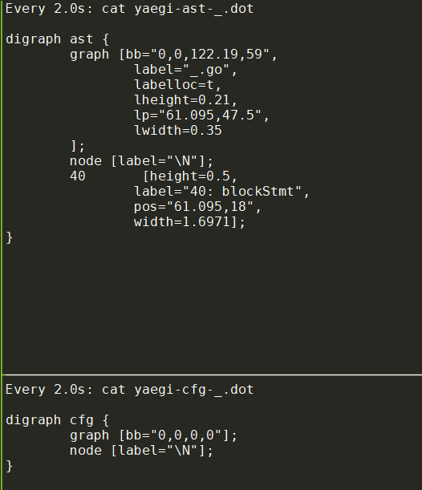  
对应的ast图  
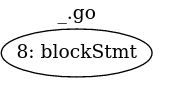  
cfg图为空

#### `a := 100`
  
  

#### `s := "hello world"`
  
  

#### if
```
> if s == "hello world" { a = 200 }
: 200
```
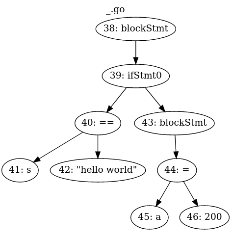  
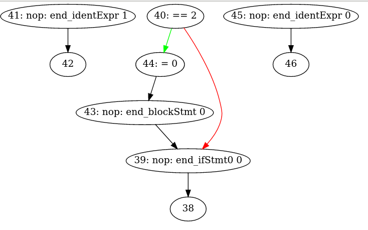  

#### slice
```
> si := []int{1,2,3,4,5}
: [1 2 3 4 5]
```
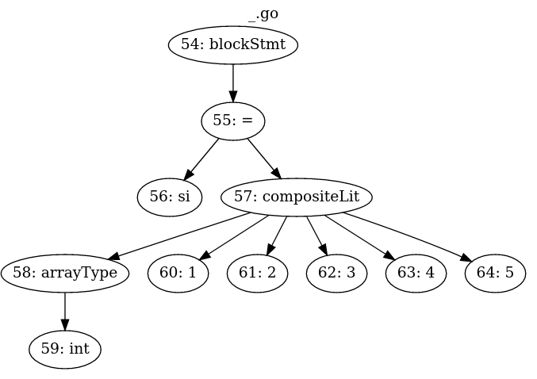  
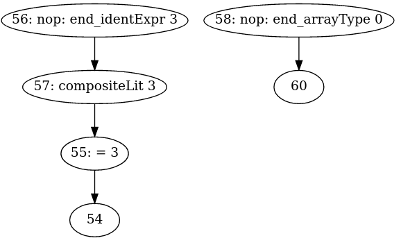  

#### import
```
import "fmt"
```
  
  

#### for range
```
> for i, num := range(si) { fmt.Println(i, num)}
```
  
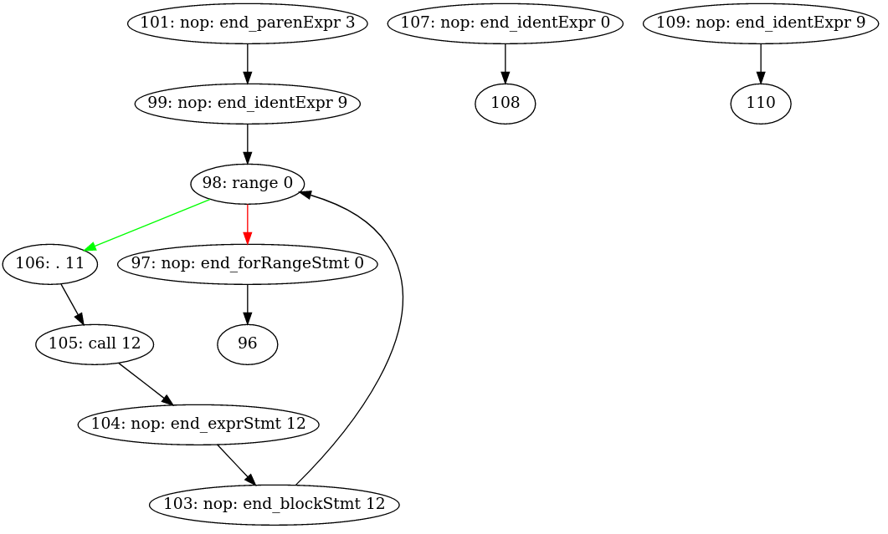  

#### 函数定义
```
func myPrint(p ...interface{}) { fmt.Println(p...) }
```
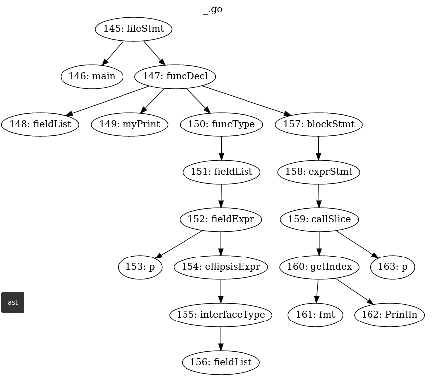  
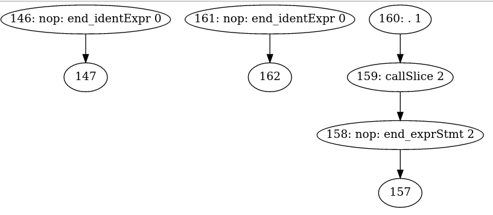  

#### func call
```
> myPrint("ni", "hao", "ma", 123)
```
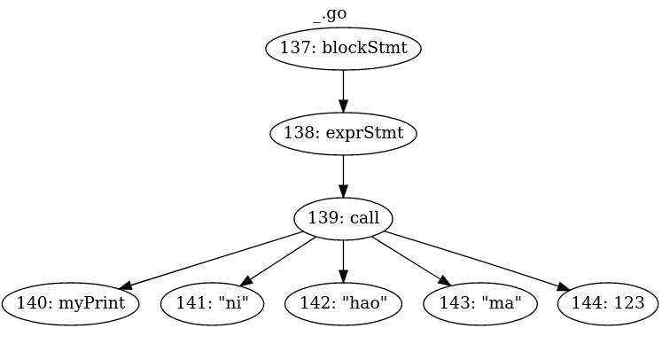  
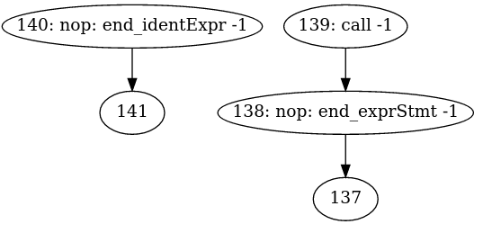  

## 使用例子
命令循环模式
```go
$ yaegi
> 1 + 2
3
> import "fmt"
> fmt.Println("Hello World")
Hello World
>
```
嵌入别的代码里:
```go
package main

import (
    "github.com/containous/yaegi/interp"
    "github.com/containous/yaegi/stdlib"
)

func main() {
    i := interp.New(interp.Options{})
    i.Use(stdlib.Symbols)
    i.Eval(`import "fmt"`)
    i.Eval(`fmt.Println("hello")`)
}
```
> This example demonstrates the ability to use executable pre-compiled symbols in the interpreter. Thanks to the statement `i.Use(stdlib.Symbols)`, the interpreted `import "fmt"`will load the `fmt` package from the executable itself (wrapped in `reflect.Values`) instead of trying to parse source files.

> Yaegi also provides the `goexports` command to build the binary wrapper of any package from its source. This is the command we used to generate all stdlib wrappers provided by default.

注意, stdlib是预编译好的bin. 这个解释器能够执行已经编译好的代码. `i.Use(stdlib.Symbols)`的作用是把导入编译后的符号给解释器用. 实现的关键是`reflect.Values`包装.

## 动态代码
入前文所说, 解释执行和编译执行能够交互.
下面的例子中, 这个文件都是正常编译的. 但里面的`v, _ := i.Eval("foo.Bar")`却是解释执行的.
```go
package main

import "github.com/containous/yaegi/interp"

const src = `package foo
func Bar(s string) string { return s + "-Foo" }`

func main() {
    i := interp.New(interp.Options{})
    i.Eval(src)
    //v是reflect.Value
    v, _ := i.Eval("foo.Bar")
    //需要先把v还原成interface再断言.
    bar := v.Interface().(func(string) string)
    
    r := bar("Kung")
    println(r)
    // Output:
    // Kung-Foo
}
```

# 解释器调用bin符号 -- 代码生成部分
在yaegi中, 初始化时用`map["符号名"]reflect.Value`保存bin中的符号信息. 解释执行过程中, 查找符号名, 得到reflect.Value, 对其进行`refect.Value.Call()`调用, 就像直接调用这个符号一样.

这个过程如下:

## go generate
先是`go generate ./internal/cmd/extract`
`internal/cmd/extract/extract.go`中, 首先第一行就是
```
//go:generate go build
```
其实就是go build出来一个叫extract的bin程序, 该程序负责使用模板技术生成标准库的wrapper调用

### extract包
`extract/extract.go`包提供了生成wrapper的模板和相关辅助函数

### 不用New的对象初始化
做为一个package, 一般的入口函数是New一个对象. 但这里一个简单的结构体初始化就搞定了:
```go
    ext := extract.Extractor{
        Dest: path.Base(wd),
    }
    //可以根据情况给ext的其他属性field赋值
    ext.Exclude = strings.Split(excludeString, ",")
```
相对于一般的`NewObj()`等API来说, 这个模式简单, 直观, 但就是写法上稍显啰嗦
也有`NewObj(Options...)`的模式, 可以传入不定长的Options. 本质上和显示结构体初始化一样.

### Extract方法
```go
var buf bytes.Buffer
//这里Extract把模板替换后的代码输出到bytes.Buffer, 后者会被io.Copy到文件中.
importPath, err := ext.Extract(pkgIdent, "", &buf)
f, err := os.Create(prefix + "_" + oFile)
_, err := io.Copy(f, &buf)
f.Close()
```

从这里开始, 需要有reflect基础.

### go/importer 和 go/types
`func ForCompiler(fset *token.FileSet, compiler string, lookup Lookup) types.Importer`
> ForCompiler returns an Importer for importing from installed packages for the compilers "gc" and "gccgo", or for importing directly from the source if the compiler argument is "source".

```go
//"source"类型的importer
pkg, err := importer.ForCompiler(token.NewFileSet(), "source", nil).Import("pkgname")
//Import以后, "pkgname"的包就是`*types.Package`类型的对象

//根据模板生成内容. ipp是import 路径
content, err := e.genContent(ipp, pkg)
```

genContent代码
```go
// Val stores the value name and addressable status of symbols.
type Val struct {
    Name string // "package.name"
    Addr bool   // true if symbol is a Var
}

// Method stores information for generating interface wrapper method.
type Method struct {
    Name, Param, Result, Arg, Ret string
}

// Wrap stores information for generating interface wrapper.
type Wrap struct {
    Name   string
    Method []Method
}

func (e *Extractor) genContent(importPath string, p *types.Package) ([]byte, error) {
    //声明+初始化
    typ := map[string]string{}
    val := map[string]Val{}
    wrap := map[string]Wrap{}
    imports := map[string]bool{}
    
    //返回这个package的对象空间, 持有这个package的包括的各种对象
    //Scope returns the (complete or incomplete) package scope holding the objects declared at package level (TypeNames, Consts, Vars, and Funcs).
    sc := p.Scope()
    
    //import路径从p.Imports()而来
    for _, pkg := range p.Imports() {
        imports[pkg.Path()] = false
    }

    //Scope的Names返回其持有的所有对象的名字
    for _, name := range sc.Names() {
        o := sc.Lookup(name)
        // skip if name不在e.Include里面 or 在e.Exclude里面
        switch o := o.(type) {
        
        case *types.Const:
        case *types.Func:
            //pname是name的全称, 即"package.name"
            val[name] = Val{pname, false}
        case *types.Var:
            val[name] = Val{pname, true}
        //以上Const, Func, Var都算var
        
        //typ是什么?
        case *types.TypeName:
            typ[name] = pname
            //底层是interface时, 构造methods
            if t, ok := o.Type().Underlying().(*types.Interface); ok {
                var methods []Method
                for i := 0; i < t.NumMethods(); i++ {
                    f := t.Method(i)
                    sign := f.Type().(*types.Signature)
                    v := sign.Params().At(j)
                    //入参
                    param := "(" + strings.Join(params, ", ") + ")"
                    v := sign.Results().At(j)
                    //返回值
                    result := "(" + strings.Join(results, ", ") + ")"
                    methods = append(methods, Method{f.Name(), param, result, arg, ret})
                }
                wrap[name] = Wrap{prefix + name, methods}
            }
        }
    }
}
```

* `func (s *Scope) Lookup(name string) Object` 返回的是types.Object, 是个接口. 一个函数返回接口, 说明这个东西是变化的.
An Object describes a named language entity such as a package, constant, type, variable, function (incl. methods), or label. All objects implement the Object interface.
```go
type Object interface {
    Parent() *Scope // scope in which this object is declared; nil for methods and struct fields
    Pos() token.Pos // position of object identifier in declaration
    Pkg() *Package  // package to which this object belongs; nil for labels and objects in the Universe scope
    Name() string   // package local object name
    Type() Type     // object type
    Exported() bool // reports whether the name starts with a capital letter
    Id() string     // object name if exported, qualified name if not exported (see func Id)

    // String returns a human-readable string of the object.
    String() string
    // contains filtered or unexported methods
}
```
* 变化的接口, 代表了一种抽象; 但抽象是不能直接用的, 所以一般会跟类型断言, 来"具化"这个接口变量:
```go
switch o := o.(type) {
case *types.Const:
case *types.Func:
case *types.Var:
case *types.TypeName:
}
```

### 模板替换
基本上, 符号被分成三类:
* Val: 变量 函数
* Typ: 结构体对象
* Wrap: interface的方法集
通过对源码的分析, 把符号分类后, 传给模板

```go
data := map[string]interface{}{
        "Dest":      e.Dest,
        "Imports":   imports,
        "PkgName":   importPath,
        "Val":       val,
        "Typ":       typ,
        "Wrap":      wrap,
        "BuildTags": buildTags,
        "License":   e.License,
    }

base := template.New("extract")
parse, err := base.Parse(model)
b := new(bytes.Buffer)
err = parse.Execute(b, data)
// format格式
source, err := format.Source(b.Bytes())
```

#### 模板
```go
const model = `
func init() {
    Symbols["{ {.PkgName} }"] = map[string]reflect.Value{
        { {- if .Val} }
        // function, constant and variable definitions
        { {range $key, $value := .Val -} }
            //value是变量的时候, 先取地址, 再Elem() -- 不知道为啥
            { {- if $value.Addr -} }
                "{ {$key} }": reflect.ValueOf(&{ {$value.Name} }).Elem(),
            //value是个函数, 或者常量
            { {else -} }
                "{ {$key} }": reflect.ValueOf({ {$value.Name} }),
            { {end -} }
        { {end} }
        { {- end} }
        
        //typ类型包装成指针
        { {- if .Typ} }
        // type definitions
        { {range $key, $value := .Typ -} }
            "{ {$key} }": reflect.ValueOf((*{ {$value} })(nil)),
        { {end} }
        { {- end} }
        
        { {- if .Wrap} }
        // interface wrapper definitions
        { {range $key, $value := .Wrap -} }
            "_{ {$key} }": reflect.ValueOf((*{ {$value.Name} })(nil)),
        { {end} }
        { {- end} }
    }
}
{ {range $key, $value := .Wrap -} }
    // { {$value.Name} } is an interface wrapper for { {$key} } type
    type { {$value.Name} } struct {
        { {range $m := $value.Method -} }
        W{ {$m.Name} } func{ {$m.Param} } { {$m.Result} }
        { {end} }
    }
    { {range $m := $value.Method -} }
        func (W { {$value.Name} }) { {$m.Name} }{ {$m.Param} } { {$m.Result} } { { {$m.Ret} } W.W{ {$m.Name} }{ {$m.Arg} } }
    { {end} }
{ {end} }
`
```

#### 替换结果举例
`stdlib/go1_14_io.go`
```go
package stdlib

import (
    "go/constant"
    "go/token"
    "io"
    "reflect"
)

func init() {
    Symbols["io"] = map[string]reflect.Value{
        // function, constant and variable definitions
        "Copy":             reflect.ValueOf(io.Copy),
        "CopyBuffer":       reflect.ValueOf(io.CopyBuffer),
        "EOF":              reflect.ValueOf(&io.EOF).Elem(),
        "ErrClosedPipe":    reflect.ValueOf(&io.ErrClosedPipe).Elem(),
        "SeekCurrent":      reflect.ValueOf(constant.MakeFromLiteral("1", token.INT, 0)),
        "SeekEnd":          reflect.ValueOf(constant.MakeFromLiteral("2", token.INT, 0)),
        
        // type definitions
        "Reader":          reflect.ValueOf((*io.Reader)(nil)),
        "Writer":          reflect.ValueOf((*io.Writer)(nil)),
        
        // interface wrapper definitions
        "_Reader":          reflect.ValueOf((*_io_Reader)(nil)),
        "_Writer":          reflect.ValueOf((*_io_Writer)(nil)),
    }
}

// _io_Reader is an interface wrapper for Reader type
type _io_Reader struct {
    WRead func(p []byte) (n int, err error)
}

func (W _io_Reader) Read(p []byte) (n int, err error) { return W.WRead(p) }

// _io_Writer is an interface wrapper for Writer type
type _io_Writer struct {
    WWrite func(p []byte) (n int, err error)
}

func (W _io_Writer) Write(p []byte) (n int, err error) { return W.WWrite(p) }
```

# [yaegi](https://github.com/traefik/yaegi)

## 背景知识
### AST语法树
AST不依赖于具体的文法，不依赖于语言的细节，我们将源代码转化为AST后，可以对AST做很多的操作，包括一些你想不到的操作，这些操作实现了各种各样形形色色的功能，给你带进一个不一样的世界。
抽象语法树（abstract syntax code，AST）是源代码的抽象语法结构的树状表示，树上的每个节点都表示源代码中的一种结构，这所以说是抽象的，是因为抽象语法树并不会表示出真实语法出现的每一个细节，比如说，嵌套括号被隐含在树的结构中，并没有以节点的形式呈现。抽象语法树并不依赖于源语言的语法，也就是说语法分析阶段所采用的上下文无文文法，因为在写文法时，经常会对文法进行等价的转换（消除左递归，回溯，二义性等），这样会给文法分析引入一些多余的成分，对后续阶段造成不利影响，甚至会使合个阶段变得混乱。因些，很多编译器经常要独立地构造语法分析树，为前端，后端建立一个清晰的接口。

#### `1+3*(4-1)+2`
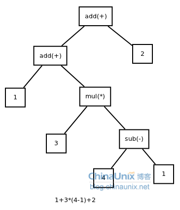  

#### xml
```
<letter>
  <address>
    <city>ShiChuang</city>
  </address>
  <people>
    <id>12478</id>
    <name>Nosic</name>
  </people>
</letter>
```
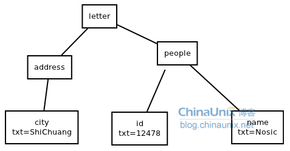  

#### while
```
while b != 0
{
    if a > b
        a = a-b
    else
        b = b-a
}
return a
```
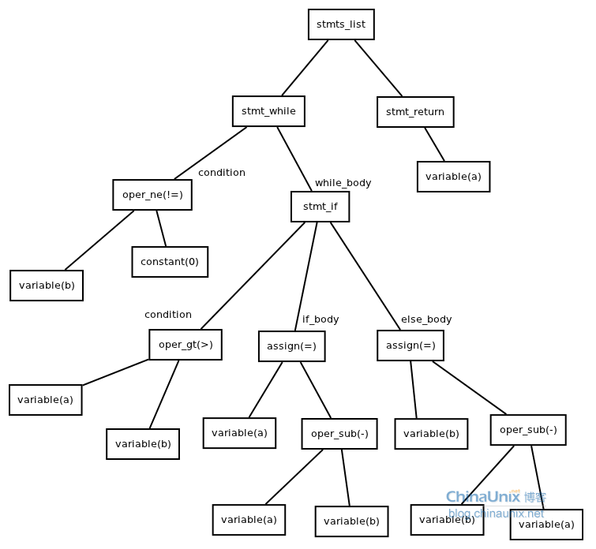  

#### for
```
sum=0
for i in range(0,100)
    sum=sum+i
end
```
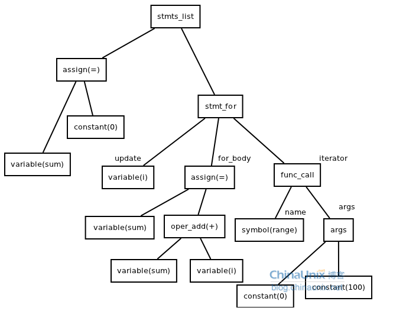  

### 为什么需要抽象语法树
当在源程序语法分析工作时，是在相应程序设计语言的语法规则指导下进行的。语法规则描述了该语言的各种语法成分的组成结构，通常可以用所谓的前后文无关文法或与之等价的Backus-Naur范式(BNF)将一个程序设计语言的语法规则确切的描述出来。前后文无关文法有分为这么几类：LL(1)，LR(0)，LR(1)， LR(k) ,LALR(1)等。每一种文法都有不同的要求，如LL(1)要求文法无二义性和不存在左递归。当把一个文法改为LL(1)文法时，需要引入一些隔外的文法符号与产生式。

AST的重要特征就是和语法无关, 只关注抽象.
比如C的if
```c
if(condition)
{
    do_something();
}
```
和fortran的if语法就不一样
```fortran
If condition then
    do_somthing()
end if
```
但它们的AST都是一样的: 在源程序中出现的括号，或者是关键字，都会被丢掉。  
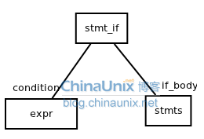  

### 函数
```go
// 简单函数
function square(n) {
    return n * n;
}
 
// 转换后的AST
{
    type: "FunctionDeclaration",
    id: {
    type: "Identifier",
    name: "square"
},

params: [
    {
        type: "Identifier",
        name: "n"
    }
],

...
}
```

### 第一步：词法分析，也叫扫描scanner

它读取我们的代码，然后把它们按照预定的规则合并成一个个的标识 tokens。同时，它会移除空白符、注释等。最后，整个代码将被分割进一个 tokens 列表（或者说一维数组）。
```c
const a = 5;
// 转换成
[{value: 'const', type: 'keyword'}, {value: 'a', type: 'identifier'}, ...]
```

### 第二步：语法分析，也称解析器
它会将词法分析出来的数组转换成树形的形式，同时，验证语法。语法如果有错的话，抛出语法错误。
```c
[{value: 'const', type: 'keyword'}, {value: 'a', type: 'identifier'}, ...]
// 语法分析后的树形形式
{
    type: "VariableDeclarator",
    id: {
    type: "Identifier",
    name: "a"
},
...
}
```
当生成树的时候，解析器会删除一些没必要的标识 tokens（比如：不完整的括号），因此 AST 不是 100% 与源码匹配的。

## main
`cmd/yaegi/yaegi.go`的`main()`是入口
```go
func main()
    run(os.Args[1:])
        //New一个解释器
        i := interp.New(interp.Options{GoPath: build.Default.GOPATH, BuildTags: strings.Split(tags, ",")})
        // Symbols variable stores the map of stdlib symbols per package.
        // var Symbols = map[string]map[string]reflect.Value{} //reflect.Value表示任意对象实例
        // Symbols["github.com/traefik/yaegi/stdlib"] = map[string]reflect.Value{ "Symbols": reflect.ValueOf(Symbols)} //第一个key的值就是自身的reflect.Value表达
        // 所以Symbols是个很大的map表的集合
        i.Use(stdlib.Symbols)
        // 使用解释器导出的symbol, 这个很小. 只有"New" "Interpreter" "Options" "Panic"
        i.Use(interp.Symbols)
        // 使用其他种类的符号表
        i.Use(syscall.Symbols)
        i.Use(unsafe.Symbols)
        i.Use(unrestricted.Symbols)
        
        //cmd是-e选项传过来的要执行的字符串
        _, err = i.Eval(cmd)
        //如果没有cmd就执行REPL循环
        i.REPL()
```
* `map[string]reflect.Value{} //reflect.Value表示任意对象实例`

## 解释器
`interp/interp.go`
一个解释器包括全局变量和状态
```go
// Interpreter contains global resources and state.
type Interpreter struct {
    // id is an atomic counter counter used for run cancellation,
    // only accessed via runid/stop
    // Located at start of struct to ensure proper alignment on 32 bit
    // architectures.
    id uint64

    // nindex is a node number incremented for each new node.
    // It is used for debug (AST and CFG graphs). As it is atomically
    // incremented, keep it aligned on 64 bits boundary.
    nindex int64

    name string // name of the input source file (or main)

    opt                        // user settable options
    cancelChan bool            // enables cancellable chan operations
    fset       *token.FileSet  // fileset to locate node in source code
    binPkg     Exports         // binary packages used in interpreter, indexed by path
    rdir       map[string]bool // for src import cycle detection

    mutex    sync.RWMutex
    frame    *frame            // program data storage during execution
    universe *scope            // interpreter global level scope
    scopes   map[string]*scope // package level scopes, indexed by import path
    srcPkg   imports           // source packages used in interpreter, indexed by path
    pkgNames map[string]string // package names, indexed by import path
    done     chan struct{}     // for cancellation of channel operations

    hooks *hooks // symbol hooks
}
```

## 解释器调用bin里的符号
用`i.Use(stdlib.Symbols)`可以在yaegi的解释器里面, 调用已经编译好的标准库.
怎么做到的呢?

```go
// Exports stores the map of binary packages per package path.
type Exports map[string]map[string]reflect.Value

// Use loads binary runtime symbols in the interpreter context so
// they can be used in interpreted code.
func (interp *Interpreter) Use(values Exports) {
    for k, v := range values {
        if k == selfPrefix {
            interp.hooks.Parse(v)
            continue
        }

        if interp.binPkg[k] == nil {
            interp.binPkg[k] = make(map[string]reflect.Value)
        }

        for s, sym := range v {
            //双map表. 值是reflect.Value
            interp.binPkg[k][s] = sym
        }
    }

    // Checks if input values correspond to stdlib packages by looking for one
    // well known stdlib package path.
    if _, ok := values["fmt"]; ok {
        fixStdio(interp)
    }
}

```
比如`stdlib/go1_14_bytes.go`中,
```go
func init() {
    Symbols["bytes"] = map[string]reflect.Value{
        ...
        //这里bytes.Join指代的是Join这个函数; 有点像函数指针.
        //是否通过这个函数指针就可以调用bin里的函数了?
        "Join":            reflect.ValueOf(bytes.Join),
    }
}
```

### 使用refect.Value.Call()的例子
```go
func TestGetFunc(t *testing.T) {
    i := interp.New(interp.Options{GoPath: "./_gopath/"})
    i.Use(stdlib.Symbols)

    if _, err := i.Eval(`import "github.com/foo/bar"`); err != nil {
        t.Fatal(err)
    }
    
    //bar.NewFoo并没有执行, 只是获取了NewFoo的对象的reflect.Value值
    //val是reflect.Value类型, 因为Eval返回reflect.Value,error
    val, err := i.Eval(`bar.NewFoo`)
    if err != nil {
        t.Fatal(err)
    }

    fmt.Println(val.Call(nil))
}
```
这里的NewFoo是个函数
```go
type Foo struct {
    A string
}

func NewFoo() *Foo {
    return &Foo{A: "test"}
}
```
Call的原型如下:
`func (v Value) Call(in []Value) []Value`  
> Call calls the function v with the input arguments in. For example, if len(in) == 3, v.Call(in) represents the Go call v(in[0], in[1], in[2]). Call panics if v's Kind is not Func. It returns the output results as Values. As in Go, each input argument must be assignable to the type of the function's corresponding input parameter. If v is a variadic function, Call creates the variadic slice parameter itself, copying in the corresponding values.

* 此时v的Kind必须是Func
* vc可以是`func (v Value) MethodByName(name string) Value`的返回值; 此时vc.Call()默认第一个参数是v, 其他参数才是Call传入的

### 查找bin 的method
在cfg阶段, 通过判断node中的信息(typ, child等), 发现这个是个对bin的method的调用.
```go
if m, lind, isPtr, ok := n.typ.lookupBinMethod(n.child[1].ident); ok {
    n.action = aGetMethod
    if isPtr && n.typ.fieldSeq(lind).cat != ptrT {
        n.gen = getIndexSeqPtrMethod
    } else {
        n.gen = getIndexSeqMethod
    }
    //
    n.recv = &receiver{node: n.child[0], index: lind}
    n.val = append([]int{m.Index}, lind...)
    n.typ = &itype{cat: valueT, rtype: m.Type, recv: n.child[0].typ}
}
```
前面说过, 初始化的时候, 对标准库的引用, 是个双map的表
`type Exports map[string]map[string]reflect.Value`
对一个函数级的符号来说, 就是比如`interp.binPkg["fmt"]["Println"]`查到reflect.ValueOf(fmt.Println), 这是个reflect.Value类型的值, 存储了"函数指针"`fmt.Println`的所有内部表达.
```go
// LookupBinMethod returns a method and a path to access a field in a struct object (the receiver).
func (t *itype) lookupBinMethod(name string) (m reflect.Method, index []int, isPtr, ok bool) {
    //指针类型下
    if t.cat == ptrT {
        return t.val.lookupBinMethod(name)
    }
    for i, f := range t.field {
        //是闭包的意思吗?
        if f.embed {
            if m2, index2, isPtr2, ok2 := f.typ.lookupBinMethod(name); ok2 {
                index = append([]int{i}, index2...)
                return m2, index, isPtr2, ok2
            }
        }
    }
    //这里关键的黑魔法来了
    //reflect.Value的MethodByName方法查找对象的"name"方法, 返回reflect.Method类型.
    //在go里面, 方法集是绑定在类型上的, 
    m, ok = t.TypeOf().MethodByName(name)
    if !ok {
        //没找到就找指针指向的对象的method
        m, ok = reflect.PtrTo(t.TypeOf()).MethodByName(name)
        isPtr = ok
    }
    return m, index, isPtr, ok
}
```

反射的Method是这样的:
```go
type Method struct {
    // Name is the method name.
    // PkgPath is the package path that qualifies a lower case (unexported)
    // method name. It is empty for upper case (exported) method names.
    // The combination of PkgPath and Name uniquely identifies a method
    // in a method set.
    // See https://golang.org/ref/spec#Uniqueness_of_identifiers
    Name    string
    PkgPath string

    Type  Type  // method type
    Func  Value // func with receiver as first argument
    Index int   // index for Type.Method
}
```

### `interp/run.go`的call()函数
```go
func call(n *node) {
    //value是由genValue返回的闭包函数
    //n.child[0]就是要call的函数名
    value := genValue(n.child[0])
    //child[0]是个receiver对象
    if n.child[0].recv != nil {
        ...
    }
    准备in参数
    准备out参数
    基本上最后每个参数都是个闭包函数的返回值
    最后给n.exec赋值, 值为一个闭包函数{
        如果是bin func
            bf := value(f)
            //in 和 out都是[]reflect.Value
            闭包函数里面调用了out := bf.Call(in)
            返回
        如果是解释执行的func
            最后调用runCfg(def.child[3].start, nf)
    }
}
```

## ast的node
```go
type node struct {
    child  []*node        // child subtrees (AST)
    anc    *node          // ancestor (AST)
    start  *node          // entry point in subtree (CFG)
    tnext  *node          // true branch successor (CFG)
    fnext  *node          // false branch successor (CFG)
    interp *Interpreter   // interpreter context
    frame  *frame         // frame pointer used for closures only (TODO: suppress this)
    index  int64          // node index (dot display)
    findex int            // index of value in frame or frame size (func def, type def)
    level  int            // number of frame indirections to access value
    nleft  int            // number of children in left part (assign) or indicates preceding type (compositeLit)
    nright int            // number of children in right part (assign)
    kind   nkind          // kind of node
    pos    token.Pos      // position in source code, relative to fset
    sym    *symbol        // associated symbol
    typ    *itype         // type of value in frame, or nil
    recv   *receiver      // method receiver node for call, or nil
    types  []reflect.Type // frame types, used by function literals only; 每个type代表一个变量?
    action action         // action
    exec   bltn           // generated function to execute
    gen    bltnGenerator  // generator function to produce above bltn
    val    interface{}    // static generic value (CFG execution)
    rval   reflect.Value  // reflection value to let runtime access interpreter (CFG)
    ident  string         // set if node is a var or func
}

// receiver stores method receiver object access path.
type receiver struct {
    node  *node         // receiver value for alias and struct types
    val   reflect.Value // receiver value for interface type and value type
    index []int         // path in receiver value for interface or value type
}

// frame contains values for the current execution level (a function context).
type frame struct {
    // id is an atomic counter used for cancellation, only accessed
    // via newFrame/runid/setrunid/clone.
    // Located at start of struct to ensure proper aligment.
    id uint64

    anc  *frame          // ancestor frame (global space)
    data []reflect.Value // values

    mutex     sync.RWMutex
    deferred  [][]reflect.Value  // defer stack
    recovered interface{}        // to handle panic recover
    done      reflect.SelectCase // for cancellation of channel operations
}
```

## Eval
interpreter的Eval方法, 把string解释执行
```go
func (interp *Interpreter) eval(src, name string, inc bool) (res reflect.Value, err error) {
    // 调用go标准库的语法库解析生成AST. root就是根节点
    pkgName, root, err := interp.ast(src, interp.name, inc)
    // 可以打印这个graph
    root.astDot(dotWriter(dotCmd), interp.name)
    // cfg是control flow graph. 控制流的图表达
    initNodes, err := interp.cfg(root, pkgName)
    // Perform global types analysis.
    err = interp.gtaRetry([]*node{root}, pkgName)

    gs := interp.scopes[pkgName]
    // Add main to list of functions to run, after all inits.
    if m := gs.sym["main"]; pkgName == mainID && m != nil {
        initNodes = append(initNodes, m.node)
    }
    // Generate node exec closures.
    err = genRun(root)
    
    //准备frame内存
    // Init interpreter execution memory frame.
    interp.frame.setrunid(interp.runid())
    interp.frame.mutex.Lock()
    interp.resizeFrame()
    interp.frame.mutex.Unlock()
    
    // Execute node closures.
    interp.run(root, nil)
    
    // Wire and execute global vars.
    n, err := genGlobalVars([]*node{root}, interp.scopes[pkgName])
    interp.run(n, nil)
    
    // main也在这个initNodes里面
    for _, n := range initNodes {
        interp.run(n, interp.frame)
    }
    //genValue返回一个函数闭包
    // v是返回的函数: func(*frame) reflect.Value
    v := genValue(root)
    res = v(interp.frame)
    return res, err
}
```

### ast函数
在ast.go里面实现interpreter包的ast树功能, 使用了标准库的go/ast go/token go/parser go/scanner
```go
// Note: no type analysis is performed at this stage, it is done in pre-order
// processing of CFG, in order to accommodate forward type declarations.

// ast parses src string containing Go code and generates the corresponding AST.
// The package name and the AST root node are returned.
// The given name is used to set the filename of the relevant source file in the
// interpreter's FileSet.
func (interp *Interpreter) ast(src, name string, inc bool) (string, *node, error) {
    //先parse
    f, err := parser.ParseFile(interp.fset, name, src, mode)
    
    var root *node
    var anc astNode
    var st nodestack
    var pkgName string
    //Inspect会深度优先遍历ast
    //这里传入的func是个巨长的函数, 在遍历过程中, 对每个node调用
    //它检查node的类型, 
    ast.Inspect(f, func(nod ast.Node) bool {
        //st是node栈
        anc = st.top()
        //根据node的类型不同, 操作st栈. 一般都是st.push()
        //type类型断言
        switch a := nod.(type) {
        case nil:
        case *ast.ArrayType:
        case *ast.AssignStmt:
        case *ast.BlockStmt:
        case *ast.BranchStmt:
        case *ast.CallExpr:
        case *ast.CaseClause:
        case *ast.ChanType:
        case *ast.CommClause:
        case *ast.DeclStmt:
        case *ast.DeferStmt:
        case *ast.ExprStmt:
        case *ast.ForStmt:
        case *ast.File:
        case *ast.Field:
        case *ast.GoStmt:
        case *ast.IfStmt:
        case *ast.MapType:
        还有很多case. 一个语言, 所有支持的操作都在此.
        }
    })
}

```

### builtin预定义action
`run.go`会提供一个builtin数组, 里面是不同操作码对应的动作:
```go
var builtin = [...]bltnGenerator{
    aNop:          nop,
    aAddr:         addr,
    aAssign:       assign,
    aAdd:          add,
    aAddAssign:    addAssign,
    aAnd:          and,
    aAndAssign:    andAssign,
    aAndNot:       andNot,
    aAndNotAssign: andNotAssign,
    aBitNot:       bitNot,
    aCall:         call,
    aCallSlice:    call,
    aCase:         _case,
    aCompositeLit: arrayLit,
    aDec:          dec,
    aEqual:        equal,
    aGetFunc:      getFunc,
    aGreater:      greater,
    aGreaterEqual: greaterEqual,
    aInc:          inc,
    aLand:         land,
    aLor:          lor,
    aLower:        lower,
    aLowerEqual:   lowerEqual,
    aMul:          mul,
    aMulAssign:    mulAssign,
    aNeg:          neg,
    aNot:          not,
    aNotEqual:     notEqual,
    aOr:           or,
    aOrAssign:     orAssign,
    aPos:          pos,
    aQuo:          quo,
    aQuoAssign:    quoAssign,
    aRange:        _range,
    aRecv:         recv,
    aRem:          rem,
    aRemAssign:    remAssign,
    aReturn:       _return,
    aSend:         send,
    aShl:          shl,
    aShlAssign:    shlAssign,
    aShr:          shr,
    aShrAssign:    shrAssign,
    aSlice:        slice,
    aSlice0:       slice0,
    aStar:         deref,
    aSub:          sub,
    aSubAssign:    subAssign,
    aTypeAssert:   typeAssertShort,
    aXor:          xor,
    aXorAssign:    xorAssign,
}
```
在ast阶段就把操作码的动作"编译"进node树里:
```go
addChild := func(root **node, anc astNode, pos token.Pos, kind nkind, act action) *node {
    ...
    n := &node{anc: anc.node, interp: interp, index: nindex, pos: pos, kind: kind, action: act, val: &i, gen: builtin[act]}
    ...
}
```
比如所有的"+"操做, 都会调用:
```go
func add(n *node) {
    switch typ.Kind() {
    case reflect.String:
    case reflect.Int, reflect.Int8, reflect.Int16, reflect.Int32, reflect.Int64:
    //各种类型断言, 使用反射赋值; 注意这里并不是马上执行, 而是返回一个闭包函数
        switch {
        case isInterface:
            v0 := genValueInt(c0)
            v1 := genValueInt(c1)
            n.exec = func(f *frame) bltn {
                _, i := v0(f)
                _, j := v1(f)
                dest(f).Set(reflect.ValueOf(i + j).Convert(typ))
                return next
            }
        case c0.rval.IsValid():
            i := vInt(c0.rval)
            v1 := genValueInt(c1)
            n.exec = func(f *frame) bltn {
                _, j := v1(f)
                dest(f).SetInt(i + j)
                return next
            }
        case c1.rval.IsValid():
            v0 := genValueInt(c0)
            j := vInt(c1.rval)
            n.exec = func(f *frame) bltn {
                _, i := v0(f)
                dest(f).SetInt(i + j)
                return next
            }
        default:
            v0 := genValueInt(c0)
            v1 := genValueInt(c1)
            n.exec = func(f *frame) bltn {
                _, i := v0(f)
                _, j := v1(f)
                dest(f).SetInt(i + j)
                return next
            }
        }
    case reflect.Float32, reflect.Float64:
}
```

### cfg函数
cfg函数根据ast, 生成控制流的图
入参是root node, 返回node类型的切片
```go
// cfg generates a control flow graph (CFG) from AST (wiring successors in AST)
// and pre-compute frame sizes and indexes for all un-named (temporary) and named
// variables. A list of nodes of init functions is returned.
// Following this pass, the CFG is ready to run.
func (interp *Interpreter) cfg(root *node, importPath string) ([]*node, error) {
    sc := tinterp.initScopePkg(importPath)
    check := typecheck{}
    var initNodes []*node
    var err error
    //这里传了两个函数
    //第一个函数, 根据node的类型, 很多地方在调用sc = sc.pushBloc()
    //比如这样的
    //case forStmt0, forStmt1, forStmt2, forStmt3, forStmt4, forStmt5, forStmt6, forStmt7, forRangeStmt:
    //        sc = sc.pushBloc()
    //        sc.loop, sc.loopRestart = n, n.lastChild()
    //
    root.Walk(func(n *node) bool {}, func(n *node))
    ...
}
```
walk函数深度优先遍历树, 对每个节点, 遍历之前调用in函数, 遍历之后调用out函数.
in函数又称为pre-ordering函数
out函数又称为post-ordering函数
```go
// Walk traverses AST n in depth first order, call cbin function
// at node entry and cbout function at node exit.
func (n *node) Walk(in func(n *node) bool, out func(n *node)) {
    if in != nil && !in(n) {
        return
    }
    for _, child := range n.child {
        child.Walk(in, out)
    }
    if out != nil {
        out(n)
    }
}
```
### frame类型
函数level的frame
```go
// frame contains values for the current execution level (a function context).
type frame struct {
    // id is an atomic counter used for cancellation, only accessed
    // via newFrame/runid/setrunid/clone.
    // Located at start of struct to ensure proper aligment.
    id uint64

    anc  *frame          // ancestor frame (global space)
    data []reflect.Value // values

    mutex     sync.RWMutex
    deferred  [][]reflect.Value  // defer stack
    recovered interface{}        // to handle panic recover
    done      reflect.SelectCase // for cancellation of channel operations
}

//newFrame生成一个frame
func newFrame(anc *frame, len int, id uint64) *frame {
    f := &frame{
        anc:  anc,
        data: make([]reflect.Value, len),
        id:   id,
    }
    if anc != nil {
        f.done = anc.done
    }
    return f
}
```

### run函数
```go
func (interp *Interpreter) run(n *node, cf *frame) {
    if n == nil {
        return
    }
    var f *frame
    if cf == nil {
        f = interp.frame
    } else {
        //初始frame, 其data切片的大小是len(n.types)
        //但为什么大小是n.types
        f = newFrame(cf, len(n.types), interp.runid())
    }
    interp.mutex.RLock()
    c := reflect.ValueOf(interp.done)
    interp.mutex.RUnlock()

    f.mutex.Lock()
    f.done = reflect.SelectCase{Dir: reflect.SelectRecv, Chan: c}
    f.mutex.Unlock()

    for i, t := range n.types {
        //每种type在f.data里面才有个位置? 还是说f.data[]里面每个type都代表了一个变量?
        //这里先给每个变量new空间. 用reflect.New
        f.data[i] = reflect.New(t).Elem()
    }
    //调用runCfg. run这个node的流程控制图(CFG)
    // runCfg executes a node AST by walking its CFG and running node builtin at each step.
    runCfg(n.start, f) {
        for exec = n.exec; exec != nil && f.runid() == n.interp.runid(); {
            exec = exec(f)
        }
    }
    
}

```

### exec举例
上面的exec是这个node的exec主要是在op.go run.go中定义. 基本上, 每个基础操作都对应一个exec.
比如run.go中的not操作:
```go
func not(n *node) {
    dest := genValue(n)
    value := genValue(n.child[0])
    tnext := getExec(n.tnext)

    if n.fnext != nil {
        fnext := getExec(n.fnext)
        n.exec = func(f *frame) bltn {
            if !value(f).Bool() {
                dest(f).SetBool(true)
                return tnext
            }
            dest(f).SetBool(false)
            return fnext
        }
    } else {
        n.exec = func(f *frame) bltn {
            dest(f).SetBool(!value(f).Bool())
            return tnext
        }
    }
}
```
再比如op.go中的
对string的+操作
```go
func add(n *node) {
    next := getExec(n.tnext)
    typ := n.typ.concrete().TypeOf()
    dest := genValueOutput(n, typ)
    c0, c1 := n.child[0], n.child[1]

    switch typ.Kind() {
    case reflect.String:
        switch {
        case c0.rval.IsValid():
            s0 := vString(c0.rval)
            v1 := genValue(c1)
            n.exec = func(f *frame) bltn {
                dest(f).SetString(s0 + v1(f).String())
                return next
            }
        case c1.rval.IsValid():
            v0 := genValue(c0)
            s1 := vString(c1.rval)
            n.exec = func(f *frame) bltn {
                dest(f).SetString(v0(f).String() + s1)
                return next
            }
        default:
            v0 := genValue(c0)
            v1 := genValue(c1)
            n.exec = func(f *frame) bltn {
                dest(f).SetString(v0(f).String() + v1(f).String())
                return next
            }
        }
    case reflect.Int, reflect.Int8, reflect.Int16, reflect.Int32, reflect.Int64:
    ...
}
```

`genValue()`和`genValueOutput(n, typ)`都返回一个闭包函数, 底层是value.go基于反射实现的.
`dest(f)`就是调用这个闭包函数.
```go
func genValue(n *node) func(*frame) reflect.Value {
    i := n.sym.index
    if n.sym.global {
        return func(f *frame) reflect.Value {
            return n.interp.frame.data[i]
        }
    }
    return valueGenerator(n, i)
}

func valueGenerator(n *node, i int) func(*frame) reflect.Value {
    switch n.level {
    case 0:
        return func(f *frame) reflect.Value { return valueOf(f.data, i) }
    case 1:
        return func(f *frame) reflect.Value { return valueOf(f.anc.data, i) }
    case 2:
        return func(f *frame) reflect.Value { return valueOf(f.anc.anc.data, i) }
    default:
        return func(f *frame) reflect.Value {
            for level := n.level; level > 0; level-- {
                f = f.anc
            }
            return valueOf(f.data, i)
        }
    }
}

// valueOf safely recovers the ith element of data. This is necessary
// because a cancellation prior to any evaluation result may leave
// the frame's data empty.
func valueOf(data []reflect.Value, i int) reflect.Value {
    if i < len(data) {
        return data[i]
    }
    //没有就返回一个空的reflect.Value{}
    return reflect.Value{}
}

func genValueOutput(n *node, t reflect.Type) func(*frame) reflect.Value {
    //value本身已经是个func(*frame) reflect.Value
    value := genValue(n)
    switch {
    case n.anc.action == aAssign && n.anc.typ.cat == interfaceT:
        fallthrough
    case n.anc.kind == returnStmt && n.anc.val.(*node).typ.ret[0].cat == interfaceT:
        // The result of the builtin has to be returned as an interface type.
        // Wrap it in a valueInterface and return the dereferenced value.
        return func(f *frame) reflect.Value {
            //本质上是f.data[i]
            d := value(f)
            //new一个t类型的对象
            //New returns a Value representing a pointer to a new zero value for the specified type. That is, the returned Value's Type is PtrTo(typ).
            v := reflect.New(t).Elem()
            //Set是按照通用的值格式赋值
            d.Set(reflect.ValueOf(valueInterface{n, v}))
            return v
        }
    }
    return value
}
```
`dest(f)`展开就是
```
f.data[i]
```

## 总结
解释执行的过程是
* 先New一个解释器实例
* Eval(string)解释
    * 使用了标准库的go/ast go/token go/parser go/scanner来生成ast. ast表达的是go的抽象语法树; 至此每个node都有个类型, 比如`*ast.MapType` `*ast.BlockStmt` `*ast.AssignStmt`
    * 根据ast生成控制流的图表达(cfg): 深度优先walk这个ast, 对每个node, 遍历之前调用in函数, 遍历之后调用out函数; 生成initNodes的切片. main函数也会被加入这个切片
    * 建立frame: 应该是每个函数有个frame, frame.data[]表示函数内的所有变量, 其类型是反射的通用值类型`reflect.Value`. frame.data[]和node的`types  []reflect.Type`是对应的. 即先有ast的reflect.Type, 再有frame.data[i]
    * 真正run的是node的exec()函数. 这个函数会循环调用exec() `exec  =  exec(f)`. exec()是每个node的闭包函数, 比如`dest(f).SetBool(!value(f).Bool())`, 又比如`dest(f).SetString(s0 + v1(f).String())`, 这里利用反射对`f.data[i]`赋值
* 整个过程只使用了go的标准库
* 相关标准库`go/*`的介绍在这里: https://github.com/golang/example/tree/master/gotypes

> Starting at the bottom, the [`go/token` package](http://golang.org/pkg/go/token) defines the lexical tokens of Go. The [`go/scanner` package](http://golang.org/pkg/go/scanner) tokenizes an input stream and records file position information for use in diagnostics or for file surgery in a refactoring tool. The [`go/ast` package](http://golang.org/pkg/go/ast) defines the data types of the abstract syntax tree (AST). The [`go/parser` package](http://golang.org/pkg/go/parser) provides a robust recursive-descent parser that constructs the AST. And [`go/constant`](http://golang.org/pkg/go/constant) provides representations and arithmetic operations for the values of compile-time constant expressions, as we'll see in [Constants](https://github.com/golang/example/tree/master/gotypes#constants).

## 代码生成
op.go的代码是`go run ../internal/genop/genop.go`生成的
```go
//用{ {$name} }来做模板替换
const model = `代码模板`
base := template.New("genop")
parse, err := base.Parse(model)
b := &bytes.Buffer{}
data := map[string]interface{} {
    预定义的data
}
//把data按照模板parse进b
parse.Execute(b, data)
//gofmt代码
source, err := format.Source(b.Bytes())
//结果写道文件里
ioutil.WriteFile("op.go", source, 0666)
```

## REPL循环
```go
// REPL performs a Read-Eval-Print-Loop on input reader.
// Results are printed to the output writer of the Interpreter, provided as option
// at creation time. Errors are printed to the similarly defined errors writer.
// The last interpreter result value and error are returned.
func (interp *Interpreter) REPL() (reflect.Value, error) {
    in, out, errs := interp.stdin, interp.stdout, interp.stderr
    ctx, cancel := context.WithCancel(context.Background())
    end := make(chan struct{})     // channel to terminate the REPL
    sig := make(chan os.Signal, 1) // channel to trap interrupt signal (Ctrl-C)
    lines := make(chan string)     // channel to read REPL input lines
    prompt := getPrompt(in, out)   // prompt activated on tty like IO stream
    s := bufio.NewScanner(in)      // read input stream line by line
    var v reflect.Value            // result value from eval
    var err error                  // error from eval
    src := ""                      // source string to evaluate
    
    //注册Ctrl-C
    signal.Notify(sig, os.Interrupt)
    defer signal.Stop(sig)
    prompt(v)
    
    //管输入的routine
    go func() {
        defer close(end)
        //Ctrl+D EOF会退出
        for s.Scan() {
            lines <- s.Text()
        }
        if e := s.Err(); e != nil {
            fmt.Fprintln(errs, e)
        }
    }()

    //处理退出的
    go func() {
        for {
            select {
            case <-sig:
                cancel()
                lines <- ""
            case <-end:
                return
            }
        }
    }()
    
    //REPL循环
    for {
        var line string

        select {
        case <-end:
            cancel()
            return v, err
        case line = <-lines:
            src += line + "\n"
        }
        
        v, err = interp.EvalWithContext(ctx, src)
        //Ctrl+C只能打断本次eval的执行. 这里重新实例化一个context
        if errors.Is(err, context.Canceled) {
            ctx, cancel = context.WithCancel(context.Background())
        }
        src = ""
        prompt(v)
    }
}
```

### EvalWithContext
这段写的很标准, 有带cancel的context. 
```go
// EvalWithContext evaluates Go code represented as a string. It returns
// a map on current interpreted package exported symbols.
func (interp *Interpreter) EvalWithContext(ctx context.Context, src string) (reflect.Value, error) {
    var v reflect.Value
    var err error

    interp.mutex.Lock()
    interp.done = make(chan struct{})
    interp.cancelChan = !interp.opt.fastChan
    interp.mutex.Unlock()

    done := make(chan struct{})
    //在routine里执行Eval的好处是后面的主循环会马上等待ctx.Done()
    //这样用户Ctrl+C能马上生效; 要优雅的生效, interp.stop()必不可少.
    go func() {
        //close用的漂亮
        defer close(done)
        //直接用外面的变量赋值
        v, err = interp.Eval(src)
    }()

    select {
    case <-ctx.Done():
        interp.stop()
        return reflect.Value{}, ctx.Err()
    case <-done:
    }
    return v, err
}
```

优雅的异步中断pattern:
* 在新的go routine里执行耗时函数
* 主循环在select里等待ctx.Done()
* 收到异步停止信号后(比如超时到, 比如ctx的cancel()触发), 调用stop()

重点是执行方提供一个stop()函数, 比如这里, interp的stop就是close掉done channel
```go
// stop sends a semaphore to all running frames and closes the chan
// operation short circuit channel. stop may only be called once per
// invocation of EvalWithContext.
func (interp *Interpreter) stop() {
    atomic.AddUint64(&interp.id, 1)
    close(interp.done)
}
```

### 总结
REPL循环使用bufio的scanner获取输入, 调用interp的Eval来执行.
context 以及输入routine, Eval routine, 配合signal, 和interp.stop函数, 能及时退出本次eval执行.

