- [zmq和nanomsg](#zmq和nanomsg)
  - [nanomsg支持的socket类型](#nanomsg支持的socket类型)
  - [nanomsg的transport类型](#nanomsg的transport类型)
  - [nanomsg和nng](#nanomsg和nng)
  - [nng的纯go版本](#nng的纯go版本)
- [高级REQ-REP](#高级req-rep)
  - [经过ROUTER会加"address" frame](#经过router会加address-frame)
    - [地址的生成](#地址的生成)
    - [Router再把标识符剥掉, 传给REQ](#router再把标识符剥掉-传给req)
    - [总结](#总结)
  - [搭配](#搭配)
    - [合法的搭配](#合法的搭配)
    - [不合法的搭配](#不合法的搭配)
    - [总结](#总结-1)
- [zmq使用](#zmq使用)
  - [transport类型](#transport类型)
    - [线程间](#线程间)
    - [进程间](#进程间)
    - [TCP](#tcp)
    - [pgm](#pgm)
  - [zmq socket](#zmq-socket)
    - [server和client](#server和client)
    - [zmq socket类型](#zmq-socket类型)
    - [zmq的send和recv和tcp的不同](#zmq的send和recv和tcp的不同)
    - [zmq的message framing](#zmq的message-framing)
      - [Frames](#frames)
      - [兼容性](#兼容性)
    - [IO thread和context](#io-thread和context)
    - [zmq_poll()函数](#zmq_poll函数)
      - [不用poll](#不用poll)
      - [使用poll](#使用poll)
    - [分片的msg](#分片的msg)
  - [服务发现](#服务发现)
  - [多对多的client和server](#多对多的client和server)
  - [其他模型](#其他模型)
  - [并发支持](#并发支持)
  - [zmq的应用代码可以run在线程, 进程, 或node上.](#zmq的应用代码可以run在线程-进程-或node上)
  - [pub到已知数量的subscriber](#pub到已知数量的subscriber)
  - [零拷贝](#零拷贝)
  - [pub-sub实际上是msg filter](#pub-sub实际上是msg-filter)
  - [高水位](#高水位)
  - [丢包怎么定位?](#丢包怎么定位)
- [消息交互模式](#消息交互模式)
  - [PAIR类型](#pair类型)
    - [为社么要用pair](#为社么要用pair)
  - [req-rep](#req-rep)
    - [server端](#server端)
    - [client端](#client端)
  - [pub-sub](#pub-sub)
    - [server侧](#server侧)
    - [client侧](#client侧)
  - [push-pull](#push-pull)
    - [生产者 ventilator](#生产者-ventilator)
    - [消费者worker](#消费者worker)
    - [sink](#sink)
    - [总结](#总结-2)
  - [context](#context)
  - [pipeline](#pipeline)
  - [fanout](#fanout)
  - [灵魂几问](#灵魂几问)
    - [阻塞还是异步?](#阻塞还是异步)
    - [谁当server谁当client?](#谁当server谁当client)
    - [怎么在wire上表示一个message?](#怎么在wire上表示一个message)
    - [如果对端没准备好的时候, 要发送的数据缓存在哪里?](#如果对端没准备好的时候-要发送的数据缓存在哪里)
    - [拥塞控制策略?](#拥塞控制策略)
    - [消息丢失怎么办? 要保证送达吗?](#消息丢失怎么办-要保证送达吗)
    - [如果有新的transport方法怎么办? app要改吗? 比如增加支持yipc?](#如果有新的transport方法怎么办-app要改吗-比如增加支持yipc)
    - [消息怎么路由?](#消息怎么路由)
    - [多语言怎么适配? encoding怎么选择? 网络错误怎么处理?](#多语言怎么适配-encoding怎么选择-网络错误怎么处理)
    - [作者观点](#作者观点)
- [zero mq(zmq, 0mq)](#zero-mqzmq-0mq)
- [问题: REQ-REP模式下的RPC, 怎么把异步同步化的?](#问题-req-rep模式下的rpc-怎么把异步同步化的)
  - [zmq使用最基本的模式, send后马上recv](#zmq使用最基本的模式-send后马上recv)
  - [go标准库的rpc](#go标准库的rpc)
  - [问题和改进思路](#问题和改进思路)

# zmq和nanomsg
zmq的作者之一后来自立门户, 创立了nanomsg
https://nanomsg.org/documentation-zeromq.html
上面文章详细写了nanomsg和zmq的不同点.
总的来说, zmq的作者之一对2008年当时的实现有所反思, 然后在实现方式上有所改进, 但整体思想是有延续性的, 比如都是以lib形式提供的.
特别的, nanomsg是MIT的license

## nanomsg支持的socket类型
*   PAIR - simple one-to-one communication
*   BUS - simple many-to-many communication
*   REQREP - allows to build clusters of stateless services to process user requests
*   PUBSUB - distributes messages to large sets of interested subscribers
*   PIPELINE - aggregates messages from multiple sources and load balances them among many destinations
*   SURVEY - allows to query state of multiple applications in a single go

## nanomsg的transport类型
*   INPROC - transport within a process (between threads, modules etc.)
*   IPC - transport between processes on a single machine
*   TCP - network transport via TCP
*   WS - websockets over TCP

## nanomsg和nng
nng又是nanomsg的改版: https://github.com/nanomsg/nng
看起来不错:
https://github.com/nanomsg

## nng的纯go版本
https://github.com/nanomsg/mangos
目前是v3版本
看起来完成度不错.

# 高级REQ-REP
REP都有envelop, envelop其实就是加"报文头".
> We already looked briefly at multipart messages. Let’s now look at a major use case, which is _reply message envelopes_. An envelope is a way of safely packaging up data with an address, without touching the data itself. By separating reply addresses into an envelope we make it possible to write general purpose intermediaries such as APIs and proxies that create, read, and remove addresses no matter what the message payload or structure is.

> In the request-reply pattern, the envelope holds the return address for replies. It is how a ZeroMQ network with no state can create round-trip request-reply dialogs.

> When you use REQ and REP sockets you don’t even see envelopes; these sockets deal with them automatically. But for most of the interesting request-reply patterns, you’ll want to understand envelopes and particularly ROUTER sockets. We’ll work through this step-by-step.

zmq用多frame描述一个msg, 地址和data在不同的frame中.

> The ZeroMQ reply envelope formally consists of zero or more reply addresses, followed by an empty frame (the envelope delimiter), followed by the message body (zero or more frames). The envelope is created by multiple sockets working together in a chain. We’ll break this down.

> We’ll start by sending “Hello” through a REQ socket. The REQ socket creates the simplest possible reply envelope, which has no addresses, just an empty delimiter frame and the message frame containing the “Hello” string. This is a two-frame message.

简单的REQ-REP没地址, 但有个空的分隔frame. 第一个数字是字节数  
  
zmq会把前面的envelop头剥掉, 只传递data frame给应用层.  
every request and every reply is in fact two frames, an empty frame and then the body

## 经过ROUTER会加"address" frame
这里的address是用来识别connection的. 因为router面对的是多个connection.  
  
### 地址的生成
> The ROUTER socket _invents_ a random identity for each connection with which it works. If there are three REQ sockets connected to a ROUTER socket, it will invent three random identities, one for each REQ socket.

router的socket会给每个连接生成随机的标识符. 比如ABC. router内部用map来跟踪这个标识符和connection的对应关系.  
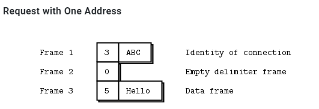  
然后这三个frame被发到DEALER socket出去. 从而REP的socket也收到这3个frame.  
REP的应用层不关心这个标识frame, 所以zmq暂存这个标识, 剥掉前两个frame, 只返回Hello给应用层.  
应用层处理后, zmq把保存的frame重新包装回frame, 回去还是3个frame.  
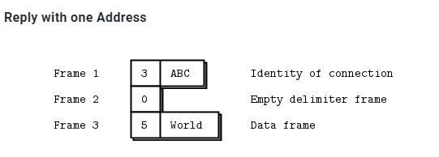  
为什么不用底层socket的地址做为标识? 这样就不用生成随机的标识了呀???? 是安全性考虑吗?

### Router再把标识符剥掉, 传给REQ
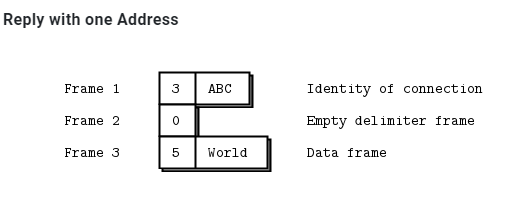  
DEALER还是把3个frame都给ROUTER, ROUTER查表得到connection, 剥掉标识符那个frame, 只发2个frame给REQ socket.  
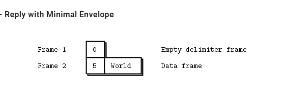  
> ROUTER sockets don’t care about the whole envelope. They don’t know anything about the empty delimiter. All they care about is that one identity frame that lets them figure out which connection to send a message to.

### 总结
*   The REQ socket sends, to the network, an empty delimiter frame in front of the message data. REQ sockets are synchronous. REQ sockets always send one request and then wait for one reply. REQ sockets talk to one peer at a time. If you connect a REQ socket to multiple peers, requests are distributed to and replies expected from each peer one turn at a time.

*   The REP socket reads and saves all identity frames up to and including the empty delimiter, then passes the following frame or frames to the caller. REP sockets are synchronous and talk to one peer at a time. If you connect a REP socket to multiple peers, requests are read from peers in fair fashion, and replies are always sent to the same peer that made the last request.

*   The DEALER socket is oblivious to the reply envelope and handles this like any multipart message. DEALER sockets are asynchronous and like PUSH and PULL combined. They distribute sent messages among all connections, and fair-queue received messages from all connections.

*   The ROUTER socket is oblivious to the reply envelope, like DEALER. It creates identities for its connections, and passes these identities to the caller as a first frame in any received message. Conversely, when the caller sends a message, it uses the first message frame as an identity to look up the connection to send to. ROUTERS are asynchronous.

## 搭配
详见: https://zguide.zeromq.org/docs/chapter3/#Request-Reply-Combinations

### 合法的搭配
*   REQ to REP
*   DEALER to REP
*   REQ to ROUTER
*   DEALER to ROUTER
*   DEALER to DEALER
*   ROUTER to ROUTER
### 不合法的搭配
*   REQ to REQ
*   REQ to DEALER
*   REP to REP
*   REP to ROUTER
### 总结
* DEALER is like an asynchronous REQ socket, and ROUTER is like an asynchronous REP socket. Where we use a REQ socket, we can use a DEALER; we just have to read and write the envelope ourselves. Where we use a REP socket, we can stick a ROUTER; we just need to manage the identities ourselves.

* Think of REQ and DEALER sockets as “clients” and REP and ROUTER sockets as “servers”.


# zmq使用
libzmq是zmq的核心lib
server端用`zmq_bind()`绑定到"well known"的地址
client端从是不固定的, 动态的地址`zmq_connect()`到server
所有的zmq socket都是在zmq的context里面. zmq的context是一个IO线程池加底层socket的合体.
API `void *zmq_init (int io_threads)`可以来配置io thread的个数. 

## transport类型
transport用下面的格式来说明: `transport://地址`
### 线程间
`inproc://名字` 实际上是直接线程间内存传递, 此时zmq没有IO thread参与, 即`void *zmq_init (int io_threads);`可以传0. 其他的transport需要背景io线程至少一个.
```c
// Assign the in-process name "#1"
rc = zmq_bind(socket, "inproc://#1");
assert (rc == 0);
// Assign the in-process name "my-endpoint"
rc = zmq_bind(socket, "inproc://my-endpoint"); assert (rc == 0);

// Connect to the in-process name "#1"
rc = zmq_connect(socket, "inproc://#1");
assert (rc == 0);
// Connect to the in-process name "my-endpoint"
rc = zmq_connect(socket, "inproc://my-endpoint"); assert (rc == 0);
```
不支持disconnected模式, 即一定要server先起. 可能后面版本会支持

### 进程间
`ipc://路径` 实际上是unix domain socket
```c
// Assign the pathname "/tmp/feeds/0"
rc = zmq_bind(socket, "ipc:///tmp/feeds/0"); assert (rc == 0);

// Connect to the pathname "/tmp/feeds/0"
rc = zmq_connect(socket, "ipc:///tmp/feeds/0"); assert (rc == 0);
```
也支持disconnected模式. 即server后起起, client先起, 但还是连的上.

### TCP
对tcp的地址做了简化封装
```c
// TCP port 5555 on all available interfaces
rc = zmq_bind(socket, "tcp:/// :5555");
assert (rc == 0);
// TCP port 5555 on the local loop-back interface on all platforms
rc = zmq_bind(socket, "tcp://127.0.0.1:5555");
assert (rc == 0);
// TCP port 5555 on the first Ethernet network interface on Linux
rc = zmq_bind(socket, "tcp://eth0:5555"); assert (rc == 0);

// Connecting using an IP address
rc = zmq_connect(socket, "tcp://192.168.1.1:5555");
assert (rc == 0);
// Connecting using a DNS name
rc = zmq_connect(socket, "tcp://server1:5555"); assert (rc == 0);
```
tcp类型的transport支持disconnected模式. 即server后起起, client先起, 但还是连的上.

### pgm
PGM (Pragmatic General Multicast) is a protocol for reliable multicast transport of data over IP networks.
zmq支持两种pgm:
* pgm: 基于raw IP
* epgm: 基于UDP
pgm的socket只能用于PUB SUB模式
pgm的地址格式有点长: `interface名;多播地址;端口`
```c
// Connecting to the multicast address 239.192.1.1, port 5555,
// using the first Ethernet network interface on Linux
// and the Encapsulated PGM protocol
rc = zmq_connect(socket, "epgm://eth0;239.192.1.1:5555");
assert (rc == 0);
// Connecting to the multicast address 239.192.1.1, port 5555,
// using the network interface with the address 192.168.1.1
// and the standard PGM protocol
rc = zmq_connect(socket, "pgm://192.168.1.1;239.192.1.1:5555"); assert (rc == 0);
```

## zmq socket
* 一个zmq socket可以同时有多个incoming和outgoing连接
* zmq的socket没有accept概念: 一个bind了的socket, 自动会accept连接
* 背景io线程会处理原始连接, 自动断线重连
* app层不应该关心原始socket, 实际上app层也不能直接使用原始socket

### server和client
* server代表一个不变的组件. server有well-konwn地址, 用`zmq_bind()`
* client更多的是动态的. 用`zmq_connect()`来连server
* zmq会缓存message. client和server可以任意顺序启动. 
* server可以bind多中transport类型, 比如tcp和进程间, 线程间都可以混在一起bind到一个zmq的socket上
```c
zmq_bind (socket, "tcp://*:5555");
zmq_bind (socket, "tcp://*:9999");
zmq_bind (socket, "inproc://somename");
```
但同一个transport一般不能bind两次, 比如tcp, 肯定是端口重复.

### zmq socket类型
socket的类型决定了交互模式, 路由方式, 缓存策略等等. 是zmq对交互模式的归类和抽象

### zmq的send和recv和tcp的不同
* zmq的message有边界的, 就像UDP; 而tcp是stream式的.
* zmq有后台IO线程, message先进local的input queue; 发送的message也是从local 的output queue里面来的.
* zmq的socket可以1发多, 即1:N的多播.
* `zmq_send()`只是把message发送到queue里, 后台的IO线程会异步的发送这个message. 除非特别情况, 这个API不会阻塞
* `zmq_msg_send()`后面还要研究一下


### zmq的message framing
zmq内部对wire上的数据是做了按size分割的. 是类UDP的设计.
所以recv的API被设计成要传入buffer size的格式:
```c
int zmq_send (void *socket, void *buf, size_t len, int flags)
int zmq_recv (void *socket, void *buf, size_t len, int flags)
```
那么zmq_recv会根据用户提供的buf size来"截断"消息. 这个用起来就不地道.

所以zmq提供了另外两个API, 这里面就没有size, 每次调用都是一个完整的msg
```c
int zmq_msg_send (zmq_msg_t *msg, void *socket, int flags)
int zmq_msg_recv (zmq_msg_t *msg, void *socket, int flags)
```
实际上, 对msg的操作是一系列的API
```c
Initialise a message: zmq_msg_init(), zmq_msg_init_size(), zmq_msg_init_data().
Sending and receiving a message: zmq_msg_send(), zmq_msg_recv().
Release a message: zmq_msg_close().
Access message content: zmq_msg_data(), zmq_msg_size(), zmq_msg_more().
Work with message properties: zmq_msg_get(), zmq_msg_set().
Message manipulation: zmq_msg_copy(), zmq_msg_move().
```
用户要自己选择合适的"纯数据"的表现形式, 比如用gpb/json来序列化等等, 这个zmq不管.
使用msg的要点:
*   You create and pass around `zmq_msg_t` objects, not blocks of data.

*   To read a message, you use [zmq_msg_init()](http://api.zeromq.org/3-2:zmq_msg_init) to create an empty message, and then you pass that to [zmq_msg_recv()](http://api.zeromq.org/3-2:zmq_msg_recv).

*   To write a message from new data, you use [zmq_msg_init_size()](http://api.zeromq.org/3-2:zmq_msg_init_size) to create a message and at the same time allocate a block of data of some size. You then fill that data using `memcpy`, and pass the message to [zmq_msg_send()](http://api.zeromq.org/3-2:zmq_msg_send).

*   To release (not destroy) a message, you call [zmq_msg_close()](http://api.zeromq.org/3-2:zmq_msg_close). This drops a reference, and eventually ZeroMQ will destroy the message.

*   To access the message content, you use [zmq_msg_data()](http://api.zeromq.org/3-2:zmq_msg_data). To know how much data the message contains, use [zmq_msg_size()](http://api.zeromq.org/3-2:zmq_msg_size).

*   Do not use [zmq_msg_move()](http://api.zeromq.org/3-2:zmq_msg_move), [zmq_msg_copy()](http://api.zeromq.org/3-2:zmq_msg_copy), or [zmq_msg_init_data()](http://api.zeromq.org/3-2:zmq_msg_init_data) unless you read the man pages and know precisely why you need these.

*   After you pass a message to [zmq_msg_send()](http://api.zeromq.org/3-2:zmq_msg_send), ØMQ will clear the message, i.e., set the size to zero. You cannot send the same message twice, and you cannot access the message data after sending it.
需要的话, 用`zmq_msg_copy()`增加引用, 但实际并不拷贝msg内容. 最后一个引用被send成功后, msg会被自动销毁.

*   These rules don’t apply if you use [zmq_send()](http://api.zeromq.org/3-2:zmq_send) and [zmq_recv()](http://api.zeromq.org/3-2:zmq_recv), to which you pass byte arrays, not message structures.

#### Frames
zmq定义了自己的frame格式. frame是msg的基本承载单元. 一个msg可以包括多个frame.
* frame的size是确定的
* frame的定义在[protocol called ZMTP](http://rfc.zeromq.org/spec:15)
> The ZeroMQ Message Transport Protocol (ZMTP) is a transport layer protocol for exchanging messages between two peers over a connected transport layer such as TCP. This document describes ZMTP/2.0.
ZMTP delimits the TCP stream as ‘frames’. A message can consist of multiple frames, for purposes of structuring. A frame consists of a flags field, followed by a length field and a frame body of length octets. The length does not include the flags field, nor itself, so an empty frame has a length of zero.
> *   Bit 0 (MORE): _More frames to follow_. A value of 0 indicates that there are no more frames to follow. A value of 1 indicates that more frames will follow. On messages consisting of a single frame the MORE bit MUST be 0.
> *   Bit 1 (LONG): _Long message_. A value of 0 indicates that the message length is encoded as a single octet. A value of 1 indicates that the message length is encoded as a 64-bit unsigned integer in network byte order.
> *   Bits 2-7: _Reserved_. Bits 2-7 are reserved for future use and MUST be zero.

```c
The following diagram shows the layout of a final frame with a length of 0 to 255 octets:
            +-----------------+
 Octet 0    | 0 0 0 0 0 0 0 0 |
            +-----------------+
 Octet 1    | Length          |
            +-----------------+- ... -----------------+
 Octets 2+  | Body                      Length octets |
            +------------------- ... -----------------+

The following diagram shows the layout of a final LONG frame:
            +-----------------+
 Octet 0    | 0 0 0 0 0 0 1 0 |
            +-----------------+
 Octets 1-8 | Length                       8 octets   |
            +------------------ ... ------------------+
 Octets 9+  | Body                      Length octets |
            +------------------ ... ------------------+            
```
概念点:
*   A message can be one or more parts.
*   These parts are also called “frames”.
*   Each part is a `zmq_msg_t` object.
*   You send and receive each part separately, in the low-level API.
*   Higher-level APIs provide wrappers to send entire multipart messages.
使用要点:
*   You may send zero-length messages, e.g., for sending a signal from one thread to another.
*   ZeroMQ guarantees to deliver all the parts (one or more) for a message, or none of them.
*   ZeroMQ does not send the message (single or multipart) right away, but at some indeterminate later time. A multipart message must therefore fit in memory.
*   A message (single or multipart) must fit in memory. If you want to send files of arbitrary sizes, you should break them into pieces and send each piece as separate single-part messages. _Using multipart data will not reduce memory consumption._
*   You must call [zmq_msg_close()](http://api.zeromq.org/3-2:zmq_msg_close) when finished with a received message, in languages that don’t automatically destroy objects when a scope closes. You don’t call this method after sending a message.

#### 兼容性
PAIR accepts connections from PAIR.
PUB accepts connections from SUB.
SUB accepts connections from PUB.
REQ accepts connections from REP or ROUTER.
REP accepts connections from REQ or DEALER.
DEALER accepts connections from REP, DEALER, or ROUTER.
ROUTER accepts connections from REQ, DEALER, or ROUTER.
PULL accepts connections from PUSH.
PUSH accepts connections from PULL.

### IO thread和context
IO thread从属于context. 一个context创建的时候, 就默认启动了一个IO thread. 其后从属于context创建的socket们, 共同使用这个IO thread.  
有个api`zmq_ctx_set (context, ZMQ_IO_THREADS, io_threads);`可以更改io thread的个数.  

### zmq_poll()函数
如果一个zmq的socket有多个对端, 我们想同时读怎么办?  
一般用`zmq_poll()`, 比如把poll包装在框架里, 框架分发event, 应用侧代码只负责react. 用户需要自己实现基于zmq的事件驱动框架, zmq不提供这个框架.
> An even better way might be to wrap zmq_poll() in a framework that turns it into a nice event-driven reactor, but it’s significantly more work than we want to cover here.

#### 不用poll
```go
//
// Reading from multiple sockets 
// This version uses a simple recv loop
//
package main

import (
    "fmt"
    zmq "github.com/alecthomas/gozmq"
    "time"
)

func main() {

    context, _ := zmq.NewContext()
    defer context.Close()

    //  Connect to task ventilator
    receiver, _ := context.NewSocket(zmq.PULL)
    defer receiver.Close()
    receiver.Connect("tcp://localhost:5557")

    //  Connect to weather server
    subscriber, _ := context.NewSocket(zmq.SUB)
    defer subscriber.Close()
    subscriber.Connect("tcp://localhost:5556")
    subscriber.SetSubscribe("10001")

    //  Process messages from both sockets
    //  We prioritize traffic from the task ventilator
    for {

        // ventilator
        for b, _ := receiver.Recv(zmq.NOBLOCK); b != nil; {
            // fake process task
        }

        // weather server
        for b, _ := subscriber.Recv(zmq.NOBLOCK); b != nil; {
            //  process task
            fmt.Printf("found weather =%s\n", string(b))
        }

        //  No activity, so sleep for 1 msec
        time.Sleep(1e6)
    }

    fmt.Println("done")

}
```
在循环里非阻塞读, 每轮傻傻的sleep 1ms.

#### 使用poll
```go
//
// Reading from multiple sockets 
// This version uses zmq.Poll()
//
package main

import (
    "fmt"
    zmq "github.com/alecthomas/gozmq"
)

func main() {

    context, _ := zmq.NewContext()
    defer context.Close()

    //  Connect to task ventilator
    receiver, _ := context.NewSocket(zmq.PULL)
    defer receiver.Close()
    receiver.Connect("tcp://localhost:5557")

    //  Connect to weather server
    subscriber, _ := context.NewSocket(zmq.SUB)
    defer subscriber.Close()
    subscriber.Connect("tcp://localhost:5556")
    subscriber.SetSubscribe("10001")

    pi := zmq.PollItems{
        zmq.PollItem{Socket: receiver, Events: zmq.POLLIN},
        zmq.PollItem{Socket: subscriber, Events: zmq.POLLIN},
    }

    //  Process messages from both sockets
    for {

        _, _ = zmq.Poll(pi, -1)

        switch {
        case pi[0].REvents&zmq.POLLIN != 0:
            //  Process task
            pi[0].Socket.Recv(0) // eat the incoming message
        case pi[1].REvents&zmq.POLLIN != 0:
            //  Process weather update
            pi[1].Socket.Recv(0) // eat the incoming message
        }

    }

    fmt.Println("done")

}
```
添加poll item, 不用傻sleep

### 分片的msg
没仔细看, 详见: https://zguide.zeromq.org/docs/chapter2/#Multipart-Messages
发送方:
```c
zmq_msg_send (&message, socket, ZMQ_SNDMORE);
...
zmq_msg_send (&message, socket, ZMQ_SNDMORE);
...
zmq_msg_send (&message, socket, 0);
```
接收方:
```c
while (1) {
    zmq_msg_t message;
    zmq_msg_init (&message);
    zmq_msg_recv (&message, socket, 0);
    //  Process the message frame
    ...
    zmq_msg_close (&message);
    if (!zmq_msg_more (&message))
        break;      //  Last message frame
}
```

## 服务发现
服务发现解决的是网络主体间如何知道对方的问题.

hard code或者静态配置式的都不算是服务发现. 因为你在写静态配置的时候, 已经知道你的网络的样子了.
比如下面静态配置的网络: 如果简单的增加subscriber是简单的, 每个subscriber写死`192.168.55.210:5556`就行了.  
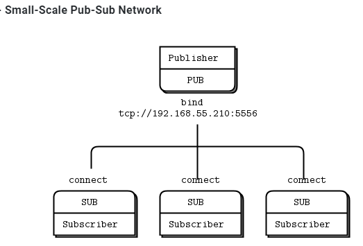  
但如果增加publisher呢? 原来的subscriber也要改吗?

用下面的图来解决这个问题: 增加中间人. 这是典型的`M:N`到`M: 1 :N`的解耦  
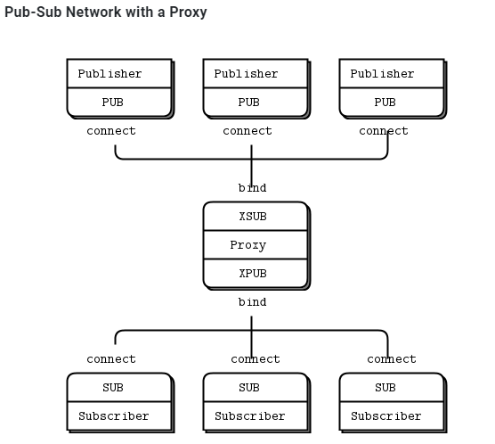  

那为什么zmq不退出一个默认的中心式的broker? 让网络一开始就是星形的中心结构?
作者对broker是持有谨慎的态度的, 一方面是担心性能, 一方面担心担心故障
> You might wonder, if all networks eventually get large enough to need intermediaries, why don’t we simply have a message broker in place for all applications? For beginners, it’s a fair compromise. Just always use a star topology, forget about performance, and things will usually work. However, message brokers are greedy things; in their role as central intermediaries, they become too complex, too stateful, and eventually a problem.

最后抽象的典型模式是:  
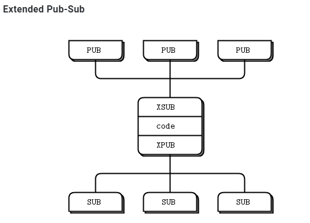  

## 多对多的client和server
比如  
  
每个client连接所有的server, servers都提供同一个服务, 以至于client和哪个server请求, 都是回一样的数据. 多个server扩展了网络的处理能力, 但这样要求每个client都知道所有的server.

可以演化为这种模式:  
  
中间人会记住哪个client来的req, 当某个server给出对这个req的回复的时候, 中间人会找到之前记住的client来沿路返回rep.

zmq把中间这个转发逻辑抽象成API: `int zmq_proxy (const void *frontend, const void *backend, const void *capture)`

## 其他模型
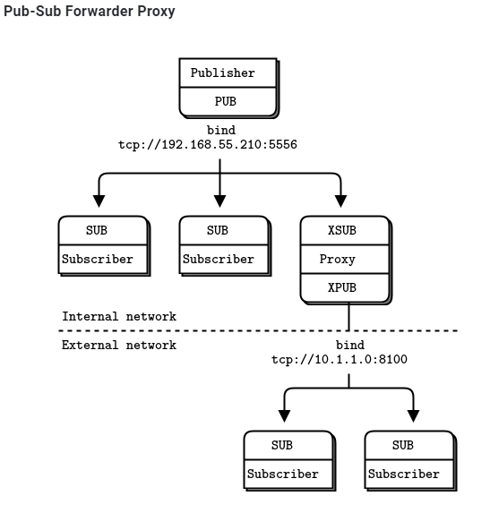  
  

## 并发支持
简单来说, zmq做了你能想到的所有对并发的支持: `we don’t need mutexes, locks, or any other form of inter-thread communication except messages sent across ZeroMQ sockets`

作者的基本思想是: 不要共享任何东西, stateless就是最好的并发模型 -- 因为什么都不需要保护

*   Isolate data privately within its thread and never share data in multiple threads. The only exception to this are ZeroMQ contexts, which are threadsafe.  
不要共享数据...

*   Stay away from the classic concurrency mechanisms like as mutexes, critical sections, semaphores, etc. These are an anti-pattern in ZeroMQ applications.  
不要用锁啥的. 和zmq八字不合.

*   Create one ZeroMQ context at the start of your process, and pass that to all threads that you want to connect via `inproc` sockets.

*   Use _attached_ threads to create structure within your application, and connect these to their parent threads using PAIR sockets over `inproc`. The pattern is: bind parent socket, then create child thread which connects its socket.  
在线程间使用inproc socket pair

*   Use _detached_ threads to simulate independent tasks, with their own contexts. Connect these over `tcp`. Later you can move these to stand-alone processes without changing the code significantly.

*   All interaction between threads happens as ZeroMQ messages, which you can define more or less formally.  
和go一样, 使用"通信"来代替"共享"

*   Don’t share ZeroMQ sockets between threads. ZeroMQ sockets are not threadsafe. Technically it’s possible to migrate a socket from one thread to another but it demands skill. The only place where it’s remotely sane to share sockets between threads are in language bindings that need to do magic like garbage collection on sockets.  
虽然context是并发安全的. 但socket不是. 不要在线程间共享socket.
> Do not use or close sockets except in the thread that created them.  
除了创建socket的线程, 不要在另外的线程使用和关闭socket.

## zmq的应用代码可以run在线程, 进程, 或node上.
通过zmq的抽象, 应用代码面对的是通信编程, 可以方便的在各种环境中扩展.
比如要实现下面的模块: 虚框内是一个进程  
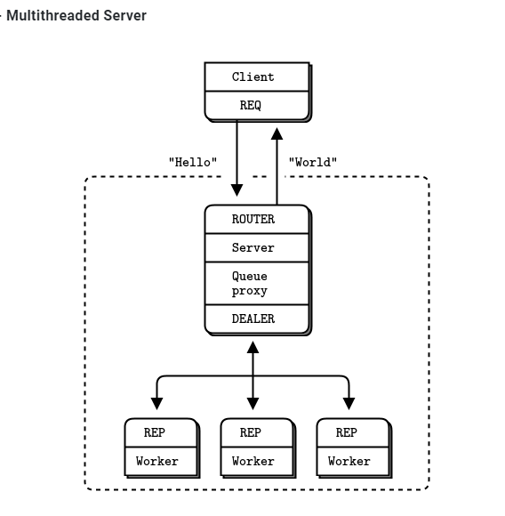  
```go
// Multithreaded Hello World server.
// Uses Goroutines.  We could also use channels (a native form of 
// inproc), but I stuck to the example.
//
// Author:  Brendan Mc.
// Requires: http://github.com/alecthomas/gozmq

package main

import (
    "fmt"
    zmq "github.com/alecthomas/gozmq"
    "time"
)

func main() {
    // Launch pool of worker threads
    for i := 0; i != 5; i = i + 1 {
        go worker()
    }

    // Prepare our context and sockets
    context, _ := zmq.NewContext()
    defer context.Close()

    // Socket to talk to clients
    clients, _ := context.NewSocket(zmq.ROUTER) //和clients连
    defer clients.Close()
    clients.Bind("tcp://*:5555")

    // Socket to talk to workers
    workers, _ := context.NewSocket(zmq.DEALER)
    defer workers.Close()
    workers.Bind("ipc://workers.ipc") //应该是unix socket

    // connect work threads to client threads via a queue
    zmq.Device(zmq.QUEUE, clients, workers) //这个后面要看一下
}

func worker() {
    context, _ := zmq.NewContext()
    defer context.Close()

    // Socket to talk to dispatcher
    receiver, _ := context.NewSocket(zmq.REP)
    defer receiver.Close()
    receiver.Connect("ipc://workers.ipc")

    for true {
        received, _ := receiver.Recv(0)
        fmt.Printf("Received request [%s]\n", received)

        // Do some 'work'
        time.Sleep(time.Second)

        // Send reply back to client
        receiver.Send([]byte("World"), 0)
    }
}
```
解释
*   The server starts a set of worker threads. Each worker thread creates a REP socket and then processes requests on this socket. Worker threads are just like single-threaded servers. The only differences are the transport (`inproc` instead of `tcp`), and the bind-connect direction.

*   The server creates a ROUTER socket to talk to clients and binds this to its external interface (over `tcp`).

*   The server creates a DEALER socket to talk to the workers and binds this to its internal interface (over `inproc`).

*   The server starts a proxy that connects the two sockets. The proxy pulls incoming requests fairly from all clients, and distributes those out to workers. It also routes replies back to their origin.

## pub到已知数量的subscriber
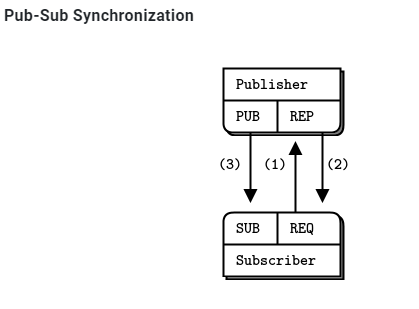  
已知subscriber数量, publisher通过REP类型的socket等待所有订阅者连上来(1,2步), 然后发消息(第3步)  
发布者代码:
```go
// Synchronized publisher
//
// Author:  Brendan Mc.
// Requires: http://github.com/alecthomas/gozmq

package main

import (
    zmq "github.com/alecthomas/gozmq"
)

var subsExpected = 10

func main() {
    context, _ := zmq.NewContext()
    defer context.Close()

    // Socket to talk to clients
    publisher, _ := context.NewSocket(zmq.PUB)
    defer publisher.Close()
    publisher.Bind("tcp://*:5561")

    // Socket to receive signals
    syncservice, _ := context.NewSocket(zmq.REP)
    defer syncservice.Close()
    syncservice.Bind("tcp://*:5562")

    // Get synchronization from subscribers
    for i := 0; i < subsExpected; i = i + 1 {
        syncservice.Recv(0)
        syncservice.Send([]byte(""), 0)
    }

    for update_nbr := 0; update_nbr < 1000000; update_nbr = update_nbr + 1 {
        publisher.Send([]byte("Rhubarb"), 0)
    }

    publisher.Send([]byte("END"), 0)
}
```
订阅者代码
```go
// Synchronized subscriber
//
// Author: Aleksandar Janicijevic
// Requires: http://github.com/alecthomas/gozmq

package main

import (
    "fmt"
    zmq "github.com/alecthomas/gozmq"
    "time"
)

func main() {
    context, _ := zmq.NewContext()
    defer context.Close()

    subscriber, _ := context.NewSocket(zmq.SUB)
    defer subscriber.Close()
    subscriber.Connect("tcp://localhost:5561")
    subscriber.SetSubscribe("")

    //  0MQ is so fast, we need to wait a while...
    time.Sleep(time.Second)

    //  Second, synchronize with publisher
    syncclient, _ := context.NewSocket(zmq.REQ)
    defer syncclient.Close()
    syncclient.Connect("tcp://localhost:5562")

    //  - send a synchronization request
    fmt.Println("Send synchronization request")
    syncclient.Send([]byte(""), 0)
    fmt.Println("Wait for synchronization reply")

    //  - wait for synchronization reply
    syncclient.Recv(0)

    fmt.Println("Get updates")
    //  Third, get our updates and report how many we got
    update_nbr := 0
    for {
        reply, _ := subscriber.Recv(0)
        if string(reply) == "END" {
            break
        }
        update_nbr++
    }
    fmt.Printf("Received %d updates\n", update_nbr)
}
```

用shell起10个订阅者进程, 然后再起发布者进程.
```sh
echo "Starting subscribers..."
for ((a=0; a<10; a++)); do
    syncsub &
done
echo "Starting publisher..."
syncpub
```
结果
```
Starting subscribers...
Starting publisher...
Received 1000000 updates
Received 1000000 updates
...
Received 1000000 updates
Received 1000000 updates
```

## 零拷贝
这里的拷贝是指应用层的发送buffer到zmq的socket之间的拷贝. 零拷贝指发送的时候, 应用层的buffer直接用于zmq的发送, 而不是先拷贝到zmq的buffer, 再发送.
> To do zero-copy, you use zmq_msg_init_data() to create a message that refers to a block of data already allocated with malloc() or some other allocator, and then you pass that to zmq_msg_send(). When you create the message, you also pass a function that ZeroMQ will call to free the block of data, when it has finished sending the message. This is the simplest example, assuming buffer is a block of 1,000 bytes allocated on the heap:

代码如下:
```c
void my_free (void *data, void *hint) {
    free (data);
}
//  Send message from buffer, which we allocate and ZeroMQ will free for us
zmq_msg_t message;
zmq_msg_init_data (&message, buffer, 1000, my_free, NULL);
zmq_msg_send (&message, socket, 0);
```
> Note that you don’t call zmq_msg_close() after sending a message–libzmq will do this automatically when it’s actually done sending the message.

## pub-sub实际上是msg filter
订阅系统实际上做的是string的prefix match: 在数据里搜索prefix, 匹配到了就是命中订阅. 订阅的filter发生在发送侧.  
但问题是, 比如prefix是xyz, 如果"纯数据"种也有xyz怎么办?
-- 用zmq的key和data分离  
  

因为这个prefix的匹配会在msg内搜索, 但不会跨frame. --那么第一个frame来发key, 后面的frame发data就可以了. 这样prefix只会在第一个frame种匹配  
发布方:
```go
//
//  Pubsub envelope publisher
//

package main

import (
    zmq "github.com/alecthomas/gozmq"
    "time"
)

func main() {
    context, _ := zmq.NewContext()
    defer context.Close()

    publisher, _ := context.NewSocket(zmq.PUB)
    defer publisher.Close()
    publisher.Bind("tcp://*:5563")

    for {
        publisher.SendMultipart([][]byte{[]byte("A"), []byte("We don't want to see this")}, 0)
        publisher.SendMultipart([][]byte{[]byte("B"), []byte("We would like to see this")}, 0)
        time.Sleep(time.Second)
    }
}
```
订阅方:
```go
//
//  Pubsub envelope subscriber
//

package main

import (
    zmq "github.com/alecthomas/gozmq"
)

func main() {
    context, _ := zmq.NewContext()
    defer context.Close()

    subscriber, _ := context.NewSocket(zmq.SUB)
    defer subscriber.Close()
    subscriber.Connect("tcp://localhost:5563")
    subscriber.SetSubscribe("B")

    for {
        address, _ := subscriber.Recv(0)
        content, _ := subscriber.Recv(0)
        print("[" + string(address) + "] " + string(content) + "\n")
    }
}
```

如果此时加新需求: 增加多个发布者, 那么可以设计交互格式为:  
  

## 高水位
作者对于flow control有经典的描述, 详见: https://zguide.zeromq.org/docs/chapter2/#High-Water-Marks  
作者认为高水线后, 向app发送反压"stop"是不好的. 如果A高频率给B发, B由于gc或者CPU load高处理不了, 消息会在这个通信系统上堆积, A的应用侧也会有消息堆积.

> ZeroMQ uses the concept of HWM (high-water mark) to define the capacity of its internal pipes. Each connection out of a socket or into a socket has its own pipe, and HWM for sending, and/or receiving, depending on the socket type. Some sockets (PUB, PUSH) only have send buffers. Some (SUB, PULL, REQ, REP) only have receive buffers. Some (DEALER, ROUTER, PAIR) have both send and receive buffers.  
> In ZeroMQ v3.x, it’s set to 1,000 by default  
zmq内部也使用高水线定义buffer的容量. 默认是10000个msg.

> When your socket reaches its HWM, it will either block or drop data depending on the socket type. PUB and ROUTER sockets will drop data if they reach their HWM, while other socket types will block. Over the inproc transport, the sender and receiver share the same buffers, so the real HWM is the sum of the HWM set by both sides.  
到达高水线后, 不同的socket type的策略不同: PUB和ROUTER类型的是丢弃; 而其他类型是阻塞.

## 丢包怎么定位?
见这里: https://zguide.zeromq.org/docs/chapter2/#Missing-Message-Problem-Solver  
要点:
*   On SUB sockets, set a subscription using <tt style="box-sizing: inherit;">[zmq_setsockopt()](http://api.zeromq.org/3-2:zmq_setsockopt)`ZMQ_SUBSCRIBE`, or you won’t get messages. Because you subscribe to messages by prefix, if you subscribe to "” (an empty subscription), you will get everything.

*   If you start the SUB socket (i.e., establish a connection to a PUB socket) _after_ the PUB socket has started sending out data, you will lose whatever it published before the connection was made. If this is a problem, set up your architecture so the SUB socket starts first, then the PUB socket starts publishing.

*   Even if you synchronize a SUB and PUB socket, you may still lose messages. It’s due to the fact that internal queues aren’t created until a connection is actually created. If you can switch the bind/connect direction so the SUB socket binds, and the PUB socket connects, you may find it works more as you’d expect.

*   If you’re using REP and REQ sockets, and you’re not sticking to the synchronous send/recv/send/recv order, ZeroMQ will report errors, which you might ignore. Then, it would look like you’re losing messages. If you use REQ or REP, stick to the send/recv order, and always, in real code, check for errors on ZeroMQ calls.

*   If you’re using PUSH sockets, you’ll find that the first PULL socket to connect will grab an unfair share of messages. The accurate rotation of messages only happens when all PULL sockets are successfully connected, which can take some milliseconds. As an alternative to PUSH/PULL, for lower data rates, consider using ROUTER/DEALER and the load balancing pattern.

*   If you’re sharing sockets across threads, don’t. It will lead to random weirdness, and crashes.

*   If you’re using `inproc`, make sure both sockets are in the same context. Otherwise the connecting side will in fact fail. Also, bind first, then connect. `inproc` is not a disconnected transport like `tcp`.

*   If you’re using ROUTER sockets, it’s remarkably easy to lose messages by accident, by sending malformed identity frames (or forgetting to send an identity frame). In general setting the `ZMQ_ROUTER_MANDATORY` option on ROUTER sockets is a good idea, but do also check the return code on every send call.

*   Lastly, if you really can’t figure out what’s going wrong, make a _minimal_ test case that reproduces the problem, and ask for help from the ZeroMQ community.

# 消息交互模式
[zmq文档中](https://zguide.zeromq.org/docs/chapter1/)有详细解释

核心的交互模式有4种:
*   **Request-reply**, which connects a set of clients to a set of services. This is a remote procedure call and task distribution pattern.
rpc或通常的client server

*   **Pub-sub**, which connects a set of publishers to a set of subscribers. This is a data distribution pattern.
订阅-发布

*   **Pipeline**, which connects nodes in a fan-out/fan-in pattern that can have multiple steps and loops. This is a parallel task distribution and collection pattern.
这就是例子push-pull

*   **Exclusive pair**, which connects two sockets exclusively. This is a pattern for connecting two threads in a process, not to be confused with “normal” pairs of sockets.
线程间的socket对.

socket类型配对:
*   PUB and SUB
*   REQ and REP
*   REQ and ROUTER (take care, REQ inserts an extra null frame)
*   DEALER and REP (take care, REP assumes a null frame)
*   DEALER and ROUTER
*   DEALER and DEALER
*   ROUTER and ROUTER
*   PUSH and PULL
*   PAIR and PAIR

## PAIR类型
对于线程间的"共享", zmq的策略是不要用锁啥的, 用zmq的通信机制.
use PAIR sockets over the inproc transport

比如下面这个模型:  
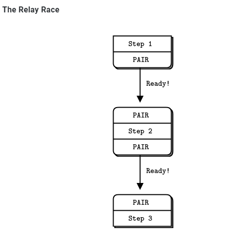  

```go
// Multithreaded relay.
// Uses Goroutines.  We could also use channels (a native form of 
// inproc), but I stuck to the example.
//
// Author:  Brendan Mc.
// Requires: http://github.com/alecthomas/gozmq

package main

import (
    "fmt"
    zmq "github.com/alecthomas/gozmq"
)

func main() {
    // Prepare our context and sockets
    context, _ := zmq.NewContext()
    defer context.Close()

    // Bind inproc socket before starting step2
    receiver, _ := context.NewSocket(zmq.PAIR)
    defer receiver.Close()
    receiver.Bind("ipc://step3.ipc")

    go step2()

    // Wait for signal
    receiver.Recv(0)
    fmt.Println("Test successful!")
}

func step1() {
    // Connect to step2 and tell it we're ready
    context, _ := zmq.NewContext()
    defer context.Close()

    xmitter, _ := context.NewSocket(zmq.PAIR)
    defer xmitter.Close()
    xmitter.Connect("ipc://step2.ipc")

    fmt.Println("Step 1 ready, signaling step 2")

    xmitter.Send([]byte("READY"), 0)
}

func step2() {
    context, _ := zmq.NewContext()
    defer context.Close()

    // Bind inproc before starting step 1
    receiver, _ := context.NewSocket(zmq.PAIR)
    defer receiver.Close()
    receiver.Bind("ipc://step2.ipc")

    go step1()

    // wait for signal and pass it on
    receiver.Recv(0)

    // Connect to step3 and tell it we're ready
    xmitter, _ := context.NewSocket(zmq.PAIR)
    defer xmitter.Close()
    xmitter.Connect("ipc://step3.ipc")

    fmt.Println("Step 2 ready, singaling step 3")

    xmitter.Send([]byte("READY"), 0)
}
```
注意这里的go的例子, 用的是ipc的transport类型, 而实际上, 这里要表达的是inproc的transport类型, 似乎这个文档的当时还不支持go的inproc transport?
下面是c版本:
```c
//  Multithreaded relay

#include "zhelpers.h"
#include <pthread.h>

static void *
step1 (void *context) {
    //  Connect to step2 and tell it we're ready
    void *xmitter = zmq_socket (context, ZMQ_PAIR);
    zmq_connect (xmitter, "inproc://step2");
    printf ("Step 1 ready, signaling step 2\n");
    s_send (xmitter, "READY");
    zmq_close (xmitter);

    return NULL;
}

static void *
step2 (void *context) {
    //  Bind inproc socket before starting step1
    void *receiver = zmq_socket (context, ZMQ_PAIR);
    zmq_bind (receiver, "inproc://step2");
    pthread_t thread;
    pthread_create (&thread, NULL, step1, context);

    //  Wait for signal and pass it on
    char *string = s_recv (receiver);
    free (string);
    zmq_close (receiver);

    //  Connect to step3 and tell it we're ready
    void *xmitter = zmq_socket (context, ZMQ_PAIR);
    zmq_connect (xmitter, "inproc://step3");
    printf ("Step 2 ready, signaling step 3\n");
    s_send (xmitter, "READY");
    zmq_close (xmitter);

    return NULL;
}

int main (void)
{
    void *context = zmq_ctx_new ();

    //  Bind inproc socket before starting step2
    void *receiver = zmq_socket (context, ZMQ_PAIR);
    zmq_bind (receiver, "inproc://step3");
    pthread_t thread;
    pthread_create (&thread, NULL, step2, context);

    //  Wait for signal
    char *string = s_recv (receiver);
    free (string);
    zmq_close (receiver);

    printf ("Test successful!\n");
    zmq_ctx_destroy (context);
    return 0;
}
```

注意用inproc类型的transport的主要场景是低延迟, 高性能. 但这个类型的transport扩展性不好. 如果是用tcp或者是ipc, 多线程的模型可以很轻易的breakdown到多进程.

### 为社么要用pair
*   You can use PUSH for the sender and PULL for the receiver. This looks simple and will work, but remember that PUSH will distribute messages to all available receivers. If you by accident start two receivers (e.g., you already have one running and you start a second), you’ll “lose” half of your signals. PAIR has the advantage of refusing more than one connection; the pair is _exclusive_.

*   You can use DEALER for the sender and ROUTER for the receiver. ROUTER, however, wraps your message in an “envelope”, meaning your zero-size signal turns into a multipart message. If you don’t care about the data and treat anything as a valid signal, and if you don’t read more than once from the socket, that won’t matter. If, however, you decide to send real data, you will suddenly find ROUTER providing you with “wrong” messages. DEALER also distributes outgoing messages, giving the same risk as PUSH.

*   You can use PUB for the sender and SUB for the receiver. This will correctly deliver your messages exactly as you sent them and PUB does not distribute as PUSH or DEALER do. However, you need to configure the subscriber with an empty subscription, which is annoying.


## req-rep
典型的rpc模式或最常用的client-server模式, 同步的. 按作者的说法是, lock-step:  
  
从示例代码来看

### server端
```go
//
// Hello World Zeromq server
//
// Author: Aaron Raddon   github.com/araddon
// Requires: http://github.com/alecthomas/gozmq
//
package main

import (
    "fmt"
    zmq "github.com/alecthomas/gozmq"
    "time"
)

func main() {
    context, _ := zmq.NewContext()
    socket, _ := context.NewSocket(zmq.REP) //REP类型, server侧
    defer context.Close()
    defer socket.Close()
    socket.Bind("tcp://*:5555")

    // Wait for messages
    for {
        msg, _ := socket.Recv(0)
        println("Received ", string(msg))

        // do some fake "work"
        time.Sleep(time.Second)

        // send reply back to client
        reply := fmt.Sprintf("World")
        socket.Send([]byte(reply), 0)
    }
}
```
从server的app角度看:
* server只"监听"`tcp://*:5555`的数据
* zmq对app屏蔽了listen, accept过程, app看不到数据通道的socket.
* 那么在app看来, 它不知道对端client是谁. 很可能这次recv的数据, 和下次recv的数据, 都不是一个client发过来的.  
-- 所以作者提到lockstep: 本次recv的东西要马上处理, 马上send, 才能保证两次操作是对一个client.

这里zmq的示例代码是典型的同步结构.或者说是框架代码和app代码混在一起的.  
作者专门提到:
> Now this looks too simple to be realistic, but ZeroMQ sockets have, as we already learned, superpowers. You could throw thousands of clients at this server, all at once, and it would continue to work happily and quickly. For fun, try starting the client and then starting the server, see how it all still works, then think for a second what this means.

这个看起来简单的server代码, 可以同时支持上千个client发起请求; 即使先启动client, 再启动server, 还能正常工作. -- 似乎暗示了zmq为client侧提供的lib库有缓存msg功能.

### client端
```go
//
// Hello World Zeromq Client
//
// Author: Aaron Raddon   github.com/araddon
// Requires: http://github.com/alecthomas/gozmq
//
package main

import (
    "fmt"
    zmq "github.com/alecthomas/gozmq"
)

func main() {
    context, _ := zmq.NewContext()
    socket, _ := context.NewSocket(zmq.REQ) //REQ类型, client侧
    defer context.Close()
    defer socket.Close()

    fmt.Printf("Connecting to hello world server...")
    socket.Connect("tcp://localhost:5555")

    for i := 0; i < 10; i++ {
        // send hello
        msg := fmt.Sprintf("Hello %d", i)
        socket.Send([]byte(msg), 0)
        println("Sending ", msg)

        // Wait for reply:
        reply, _ := socket.Recv(0)
        println("Received ", string(reply))
    }
}
```
client的关键操作是`socket.Connect("tcp://localhost:5555")`, 从此这个socket代表了和server的连接.说明从app的角度看:
* client是持有server连接信息的
* client send后马上recv, 虽然不是rcp的call形式, 但这里必须是"lockstep"式的同步等. 因为过了这个点, app就不知道reply对应的是那个request.

## pub-sub
一个pub, 多个sub. 复制消息, 异步模式  
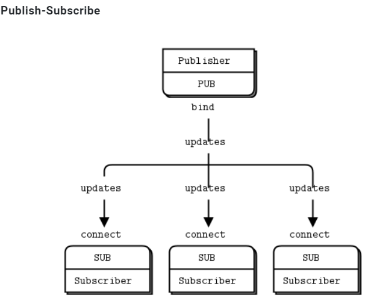  

subcriber需要用`zmq_setsockopt()`来订阅一个string关键词.   
sub的"socket"是只读的, pub的"socket"是只写的.  
虽然理论上client也可以pub, 但一般都是server pub, client来订阅.  
从下面作者的描述来看:
*   A subscriber can connect to more than one publisher, using one connect call each time. Data will then arrive and be interleaved (“fair-queued”) so that no single publisher drowns out the others.  
一个subscriber可以从多个publisher来订阅. 从这个sub的"socket"读能读到所有订阅的消息. 从多个publisher来的消息交叉放置在socket里

*   If a publisher has no connected subscribers, then it will simply drop all messages.  
如果没有人订阅, publisher会丢弃所有消息. -- 说明订阅者是直接和发布者有真正的socket连接的, publisher都知道.

*   If you’re using TCP and a subscriber is slow, messages will queue up on the publisher. We’ll look at how to protect publishers against this using the “high-water mark” later.  
如果是远端机器上的慢速subscriber, 那消息会在publisher侧拥塞. -- 更加说明了没有"中间人"来转发.

*   From ZeroMQ v3.x, filtering happens at the publisher side when using a connected protocol (tcp或ipc). Using the epgm protocol, filtering happens at the subscriber side. In ZeroMQ v2.x, all filtering happened at the subscriber side.  
zmq的2.0版本, filtering发生在接收方; 而zmq3.0版本, filtering发生在发送方.

### server侧
```go
// 
//   Weather update server
//   Binds PUB socket to tcp://*:5556
//   Publishes random weather updates
// 
package main

import (
    "fmt"
    zmq "github.com/alecthomas/gozmq"
    "math/rand"
    "time"
)

func main() {
    context, _ := zmq.NewContext()
    socket, _ := context.NewSocket(zmq.PUB) //注意这里指明了PUB类型
    defer context.Close()
    defer socket.Close()
    socket.Bind("tcp://*:5556")
    socket.Bind("ipc://weather.ipc") //似乎PUB类型能绑定多个地址?

    // Seed the random number generator
    rand.Seed(time.Now().UnixNano())

    // loop for a while aparently
    for {
        //  make values that will fool the boss
        zipcode := rand.Intn(100000)
        temperature := rand.Intn(215) - 80
        relhumidity := rand.Intn(50) + 10

        msg := fmt.Sprintf("%d %d %d", zipcode, temperature, relhumidity)

        //  Send message to all subscribers
        socket.Send([]byte(msg), 0)
    }
}
```

### client侧
```go
// 
//   Weather proxy listens to weather server which is constantly
//   emitting weather data
//   Binds SUB socket to tcp://*:5556
// 
package main

import (
    "fmt"
    zmq "github.com/alecthomas/gozmq"
    "os"
    "strconv"
    "strings"
)

func main() {
    context, _ := zmq.NewContext()
    socket, _ := context.NewSocket(zmq.SUB) //SUB类型
    defer context.Close()
    defer socket.Close()

    var temps []string
    var err error
    var temp int64
    total_temp := 0
    filter := "59937"

    // find zipcode
    if len(os.Args) > 1 { // ./wuclient 85678
        filter = string(os.Args[1])
    }

    //  Subscribe to just one zipcode (whitefish MT 59937) 
    fmt.Printf("Collecting updates from weather server for %s…\n", filter)
    socket.SetSubscribe(filter) //订阅实际就是filter
    socket.Connect("tcp://localhost:5556")

    for i := 0; i < 101; i++ {
        // found temperature point
        datapt, _ := socket.Recv(0)
        temps = strings.Split(string(datapt), " ")
        temp, err = strconv.ParseInt(temps[1], 10, 64)
        if err == nil {
            // Invalid string 
            total_temp += int(temp)
        }
    }

    fmt.Printf("Average temperature for zipcode %s was %dF \n\n", filter, total_temp/100)
}
```

## push-pull
zmq的push和pull模式用于生产 消费系统  
push生产, pull来消费. 可以一个push, 多个pull. 但很显然, push的消息不会复制广播给每个puller  
  
*   A ventilator that produces tasks that can be done in parallel
*   A set of workers that process tasks
*   A sink that collects results back from the worker processes

push和pull没有固定的server client角色, client也可以pull, 也可以push.
这里的所有框框都是独立的进程.

### 生产者 ventilator
```go
//
// Task ventilator
// Binds PUSH socket to tcp://localhost:5557
// Sends batch of tasks to workers via that socket
//
package main

import (
    "fmt"
    zmq "github.com/alecthomas/gozmq"
    "math/rand"
    "time"
)

func main() {
    context, _ := zmq.NewContext()
    defer context.Close()

    // Socket to send messages On
    sender, _ := context.NewSocket(zmq.PUSH)
    defer sender.Close()
    sender.Bind("tcp://*:5557")

    //  Socket to send start of batch message on
    sink, _ := context.NewSocket(zmq.PUSH)
    defer sink.Close()
    sink.Connect("tcp://localhost:5558")

    fmt.Print("Press Enter when the workers are ready: ")

    var line string
    fmt.Scanln(&line)

    fmt.Println("Sending tasks to workers…")

    sink.Send([]byte("0"), 0)

    // Seed the random number generator
    rand.Seed(time.Now().UnixNano())

    total_msec := 0

    for i := 0; i < 100; i++ {
        workload := rand.Intn(100)
        total_msec += workload
        msg := fmt.Sprintf("%d", workload)
        sender.Send([]byte(msg), 0)
    }

    fmt.Printf("Total expected cost: %d msec\n", total_msec)

    time.Sleep(1e9) //  Give 0MQ time to deliver: one second ==  1e9 ns

}
```

### 消费者worker
```go
//
// Task Wroker
// Connects PULL socket to tcp://localhost:5557
// Collects workloads from ventilator via that socket
// Connects PUSH socket to tcp://localhost:5558
// Sends results to sink via that socket 
// 
package main

import (
    "fmt"
    zmq "github.com/alecthomas/gozmq"
    "strconv"
    "time"
)

func main() {
    context, _ := zmq.NewContext()
    defer context.Close()

    //  Socket to receive messages on
    receiver, _ := context.NewSocket(zmq.PULL)
    defer receiver.Close()
    receiver.Connect("tcp://localhost:5557")

    //  Socket to send messages to task sink
    sender, _ := context.NewSocket(zmq.PUSH)
    defer sender.Close()
    sender.Connect("tcp://localhost:5558")

    //  Process tasks forever
    for {
        msgbytes, _ := receiver.Recv(0)
        fmt.Printf("%s.\n", string(msgbytes))

        //  Do the work
        msec, _ := strconv.ParseInt(string(msgbytes), 10, 64)
        time.Sleep(time.Duration(msec) * 1e6)

        //  Send results to sink
        sender.Send([]byte(""), 0)

    }
}
```

### sink
```go
//
// Task sink
// Binds PULL socket to tcp://localhost:5558
// Collects results from workers via that socket
//
package main

import (
    "fmt"
    zmq "github.com/alecthomas/gozmq"
    "time"
)

func main() {
    context, _ := zmq.NewContext()
    defer context.Close()

    //  Socket to receive messages on
    receiver, _ := context.NewSocket(zmq.PULL)
    defer receiver.Close()
    receiver.Bind("tcp://*:5558")

    //  Wait for start of batch
    msgbytes, _ := receiver.Recv(0)
    fmt.Println("Received Start Msg ", string(msgbytes))

    //  Start our clock now
    start_time := time.Now().UnixNano()

    //  Process 100 confirmations
    for i := 0; i < 100; i++ {
        msgbytes, _ = receiver.Recv(0)
        fmt.Print(".")
    }

    //  Calculate and report duration of batch
    te := time.Now().UnixNano()
    fmt.Printf("Total elapsed time: %d msec\n", (te-start_time)/1e6)

}
```

### 总结
* The workers connect upstream to the ventilator, and downstream to the sink. This means you can add workers arbitrarily. If the workers bound to their endpoints, you would need (a) more endpoints and (b) to modify the ventilator and/or the sink each time you added a worker. We say that the ventilator and sink are _stable_ parts of our architecture and the workers are _dynamic_ parts of it.  
worker对上对下都是client, 所以worker能够动态的添加. 而上下两层都是server, 架构上是稳定的.

* We have to synchronize the start of the batch with all workers being up and running. This is a fairly common gotcha in ZeroMQ and there is no easy solution. The zmq_connect method takes a certain time. So when a set of workers connect to the ventilator, the first one to successfully connect will get a whole load of messages in that short time while the others are also connecting. If you don’t synchronize the start of the batch somehow, the system won’t run in parallel at all. Try removing the wait in the ventilator, and see what happens.  
如果生产者ventilator不等所有worker连接成功, 那在第一个连上的worker会收到大量的work. 而其他的worker还在连接中. zmq的经验是, 建立连接需要ms级的时间, 这个时间内足够大量的消息交互了. -- 可能说的是跨机器跨网络的场景.

*   The ventilator’s PUSH socket distributes tasks to workers (assuming they are all connected _before_ the batch starts going out) evenly. This is called _load balancing_ and it’s something we’ll look at again in more detail.  
load balance发生在生产者即ventilator里面

*   The sink’s PULL socket collects results from workers evenly. This is called _fair-queuing_.  
sinker收集结果的时候, 从每个worker公平的收集. 公平队列  
  

## context
上面go代码中, 首先要建个context, socket是从属于context的.
zmq建议: 每个进程一个context.
> You should create and use exactly one context in your process. Technically, the context is the container for all sockets in a single process, and acts as the transport for inproc sockets, which are the fastest way to connect threads in one process.


## pipeline
## fanout

## 灵魂几问
https://zguide.zeromq.org/docs/chapter1/#Why-We-Needed-ZeroMQ  
摘要如下:
### 阻塞还是异步?
阻塞性能不佳, 异步很难搞对.
> How do we handle I/O? Does our application block, or do we handle I/O in the background? This is a key design decision. Blocking I/O creates architectures that do not scale well. But background I/O can be very hard to do right.How do we handle I/O? Does our application block, or do we handle I/O in the background? This is a key design decision. Blocking I/O creates architectures that do not scale well. But background I/O can be very hard to do right.

### 谁当server谁当client?
需要server永远在吗? 需要断线重连吗?

### 怎么在wire上表示一个message?
我觉得用结构体, 或者tengo中的Object抽象

### 如果对端没准备好的时候, 要发送的数据缓存在哪里?

### 拥塞控制策略?

### 消息丢失怎么办? 要保证送达吗?

### 如果有新的transport方法怎么办? app要改吗? 比如增加支持yipc?
> What if we need to use a different network transport. Say, multicast instead of TCP unicast? Or IPv6? Do we need to rewrite the applications, or is the transport abstracted in some layer?

### 消息怎么路由?
> How do we route messages? Can we send the same message to multiple peers? Can we send replies back to an original requester?

### 多语言怎么适配? encoding怎么选择? 网络错误怎么处理?

### 作者观点
消息处理框架不好搞. 很多人越高越复杂, 故障率越高. 这包括了broker概念的发明和广泛使用. 在带来方便的同时, broker也有很多问题, 比如broker系统本身需要人维护, 只适合大型系统.  
对中小型的系统开发来说, 通常的结局作者已经预言了:  
> Either they avoid network programming and make monolithic applications that do not scale. Or they jump into network programming and make brittle, complex applications that are hard to maintain. Or they bet on a messaging product, and end up with scalable applications that depend on expensive, easily broken technology.  
不是自己瞎搞, 就是赌上一个新技术来瞎搞.

作者认为的理想消息系统:  
> What we need is something that does the job of messaging, but does it in such a simple and cheap way that it can work in any application, with close to zero cost. It should be a library which you just link, without any other dependencies. No additional moving pieces, so no additional risk. It should run on any OS and work with any programming language.

只是个库, 简单, 高效, 没有其他的比如broker, 消息中心等独立实体.  
* It handles I/O asynchronously, in background threads. These communicate with application threads using lock-free data structures, so concurrent ZeroMQ applications need no locks, semaphores, or other wait states.  
背景线程处理异步IO, 无锁设计. app层不关心锁

* Components can come and go dynamically and ZeroMQ will automatically reconnect. This means you can start components in any order. You can create “service-oriented architectures” (SOAs) where services can join and leave the network at any time.  
自动重连

* It queues messages automatically when needed. It does this intelligently, pushing messages as close as possible to the receiver before queuing them.  
自动缓存消息

* It has ways of dealing with over-full queues (called “high water mark”). When a queue is full, ZeroMQ automatically blocks senders, or throws away messages, depending on the kind of messaging you are doing (the so-called “pattern”).  
拥塞时有考虑

* It lets your applications talk to each other over arbitrary transports: TCP, multicast, in-process, inter-process. You don’t need to change your code to use a different transport.  
多transport支持: tcp, 多播, 进程间, 线程间

* It handles slow/blocked readers safely, using different strategies that depend on the messaging pattern.  
还是关于拥塞的

* It lets you route messages using a variety of patterns such as request-reply and pub-sub. These patterns are how you create the topology, the structure of your network.  
支持多模式, 比如req-rep, pub-sub等等

* It lets you create proxies to queue, forward, or capture messages with a single call. Proxies can reduce the interconnection complexity of a network.  
支持proxy来做转发, 转存, 抓包等

* It delivers whole messages exactly as they were sent, using a simple framing on the wire. If you write a 10k message, you will receive a 10k message.  
消息级别传输. 而不是报文级别

* It does not impose any format on messages. They are blobs from zero to gigabytes large. When you want to represent data you choose some other product on top, such as msgpack, Google’s protocol buffers, and others.  
从zmq级别来看, zmq不对传输的数据做包装.

* It handles network errors intelligently, by retrying automatically in cases where it makes sense.  
对网络错误有一套处理

zmq底层是背景线程管理的"连接"
> In the ZeroMQ universe, sockets are doorways to fast little background communications engines that manage a whole set of connections automagically for you. You can’t see, work with, open, close, or attach state to these connections. Whether you use blocking send or receive, or poll, all you can talk to is the socket, not the connections it manages for you. The connections are private and invisible, and this is the key to ZeroMQ’s scalability.

> This is because your code, talking to a socket, can then handle any number of connections across whatever network protocols are around, without change. **A messaging pattern sitting in ZeroMQ scales more cheaply than a messaging pattern sitting in your application code.**

zmq对app提供的socket不是原始的os级别socket, 而是os.socket+os.thread组成的一套系统.


# zero mq(zmq, 0mq)
https://zeromq.org/get-started/
https://lwn.net/Articles/466304/

概念: 
http://zguide.zeromq.org/page:all
http://zguide.zeromq.org/page:chapter1

纯go实现zero mq 
https://github.com/zeromq/gomq
https://github.com/go-zeromq/zmq4

cgo版本:
https://github.com/zeromq/goczmq
https://github.com/pebbe/zmq4

zero mq api: http://api.zeromq.org/2-1:zmq-connect

# 问题: REQ-REP模式下的RPC, 怎么把异步同步化的?
比如socket send后, 怎么等待socket recv?
最简单的send, 原地recv可以, 但并发场景呢?
我记得在哪里看到过, 思路有点像channel in channel. 但client方需要有个守护routine, 收到REP后, 给对应的goroutine发channel

## zmq使用最基本的模式, send后马上recv
client代码
```c
//  Hello World client
#include <zmq.h>
#include <string.h>
#include <stdio.h>
#include <unistd.h>

int main (void)
{
    printf ("Connecting to hello world server...\n");
    void *context = zmq_ctx_new ();
    void *requester = zmq_socket (context, ZMQ_REQ);
    zmq_connect (requester, "tcp://localhost:5555");

    int request_nbr;
    for (request_nbr = 0; request_nbr != 10; request_nbr++) {
        char buffer [10];
        printf ("Sending Hello %d...\n", request_nbr);
        //先send
        zmq_send (requester, "Hello", 5, 0);
        //原地recv
        zmq_recv (requester, buffer, 10, 0);
        printf ("Received World %d\n", request_nbr);
    }
    zmq_close (requester);
    zmq_ctx_destroy (context);
    return 0;
}
```

server侧代码
```c
//  Hello World server

#include <zmq.h>
#include <stdio.h>
#include <unistd.h>
#include <string.h>
#include <assert.h>

int main (void)
{
    //  Socket to talk to clients
    void *context = zmq_ctx_new ();
    void *responder = zmq_socket (context, ZMQ_REP);
    int rc = zmq_bind (responder, "tcp://*:5555");
    assert (rc == 0);

    while (1) {
        char buffer [10];
        //先接收
        zmq_recv (responder, buffer, 10, 0);
        printf ("Received Hello\n");
        sleep (1);          //  Do some 'work'
        //再发送
        zmq_send (responder, "World", 5, 0);
    }
    return 0;
}
```
在这个基本模式下, zmq不允许同时发REQ:
> The REQ-REP socket pair is in lockstep. The client issues zmq_send() and then zmq_recv(), in a loop (or once if that’s all it needs). Doing any other sequence (e.g., sending two messages in a row) will result in a return code of -1 from the send or recv call.

## go标准库的rpc
在`src/net/rpc/client.go`中, client支持同时多个REQ并发发送到server, 怎么做到的?
```go
// Client represents an RPC Client.
// There may be multiple outstanding Calls associated
// with a single Client, and a Client may be used by
// multiple goroutines simultaneously.
type Client struct {
    codec ClientCodec

    reqMutex sync.Mutex // protects following
    request  Request

    mutex    sync.Mutex // protects following
    //秘诀在seq和后面的pending map
    seq      uint64
    pending  map[uint64]*Call
    closing  bool // user has called Close
    shutdown bool // server has told us to stop
}
```
在send的时候
```go
func (client *Client) send(call *Call) {
    client.mutex.Lock()
    //在加锁的情况下, 把seq++并加到map中
    seq := client.seq
    client.seq++
    client.pending[seq] = call
    client.mutex.Unlock()
    
    //发送
    client.request.Seq = seq
    client.codec.WriteRequest(&client.request, call.Args)
}
```
这里面的Call是这次RPC调用的抽象:
```go
// Call represents an active RPC.
type Call struct {
    ServiceMethod string      // The name of the service and method to call.
    Args          interface{} // The argument to the function (*struct).
    Reply         interface{} // The reply from the function (*struct).
    Error         error       // After completion, the error status.
    Done          chan *Call  // Strobes when call is complete.
}
```

好了, 下面看看client.Call
```go
// Call invokes the named function, waits for it to complete, and returns its error status.
func (client *Client) Call(serviceMethod string, args interface{}, reply interface{}) error {
    call := <-client.Go(serviceMethod, args, reply, make(chan *Call, 1)).Done
    return call.Error
}
```
Go函数里面, 实例化一个Call, 和一个channel, send这个Call给server, 返回这个channel.
注意, Go函数并不等待server的REP过来.
```go
// Go invokes the function asynchronously. It returns the Call structure representing
// the invocation. The done channel will signal when the call is complete by returning
// the same Call object. If done is nil, Go will allocate a new channel.
// If non-nil, done must be buffered or Go will deliberately crash.
func (client *Client) Go(serviceMethod string, args interface{}, reply interface{}, done chan *Call) *Call {
    call := new(Call)
    call.ServiceMethod = serviceMethod
    call.Args = args
    call.Reply = reply
    if done == nil {
        done = make(chan *Call, 10) // buffered.
    } else {
        // If caller passes done != nil, it must arrange that
        // done has enough buffer for the number of simultaneous
        // RPCs that will be using that channel. If the channel
        // is totally unbuffered, it's best not to run at all.
        if cap(done) == 0 {
            log.Panic("rpc: done channel is unbuffered")
        }
    }
    call.Done = done
    client.send(call)
    return call
}
```
等待发生在Go函数里面, 等待这个返回的channel.
好了, 但是哪里写这个channel呢?

每个client都启动了一个守护goroutine, 叫input
```go
// NewClientWithCodec is like NewClient but uses the specified
// codec to encode requests and decode responses.
func NewClientWithCodec(codec ClientCodec) *Client {
    client := &Client{
        codec:   codec,
        pending: make(map[uint64]*Call),
    }
    go client.input()
    return client
}
```
前面说过了, client.Call函数只是调用了send, 然后等待在chennel上. 没有调用recv
是这个input routine不断的调用recv来收包的.
```go
func (client *Client) input() {
    for {
        response = Response{}
        //recv收header
        err = client.codec.ReadResponseHeader(&response)
        //包头里面由seq号
        seq := response.Seq
        client.mutex.Lock()
        //根据seq号找到call channel
        call := client.pending[seq]
        delete(client.pending, seq)
        client.mutex.Unlock()
        
        //读Reply
        client.codec.ReadResponseBody(call.Reply)
        //这个函数写channel, 通知client.Call停止等待
        call.done()
    }
}
```

总结:
* send之前实例化一个call结构体, 用来传递信息. 同时实例化一个channel(每个call一个). 发送的时候, 每个req都有个序号, 这个序号和call是一一对应的, 把这个对应关系保存在map里.
client等待在这个channel.
* server端把seq原封不动的搬到reply的header里面: `resp.Seq = req.Seq`
* 有个input goroutine不断的读socket, 把header里面包含的seq序号, 通过map查到pending的call结构体. 读reply到这个call结构体, 写channel通知client本次call完成.

## 问题和改进思路
个人感觉这个RPC写的一般, 很啰嗦, 用seq和map来记录每个call, server会原封不动的把seq返回来, client再根据seq号查找到本次call实例. 这里面有map的hash计算, 扩容等等性能不好的地方.  
我的想法是, 既然server要把client发送的seq号原封不动的返回, 何不在client直接"封装"chennel信息, server端还是原封不动返回, 这样client的input守护routine在收到回复报文的时候, 就可以直接用这个channel了, 省掉了hash map.  
但input守护routine是没有办法省掉的. 这和routine之间channel in channel的RPC不同, 因为socket RPC跨了进程.
