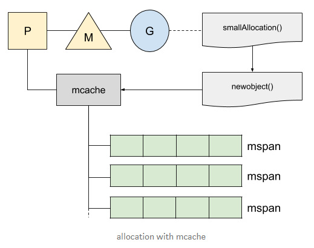
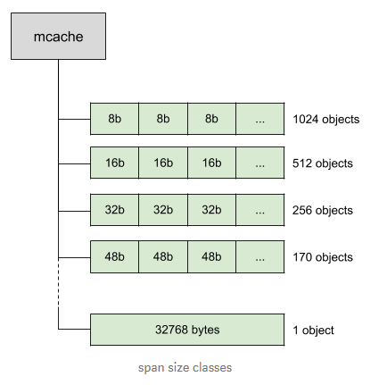
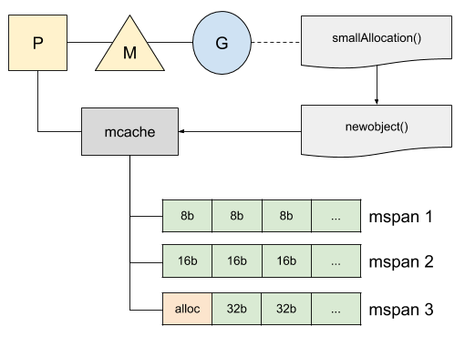
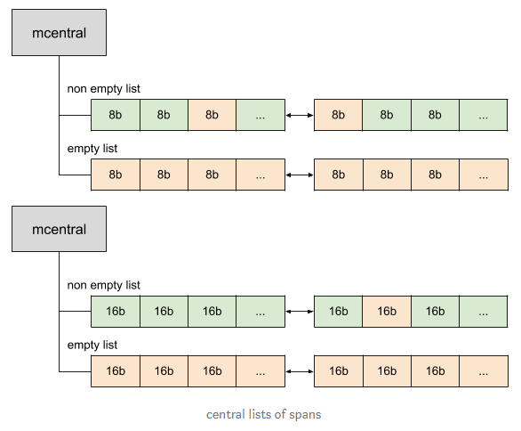
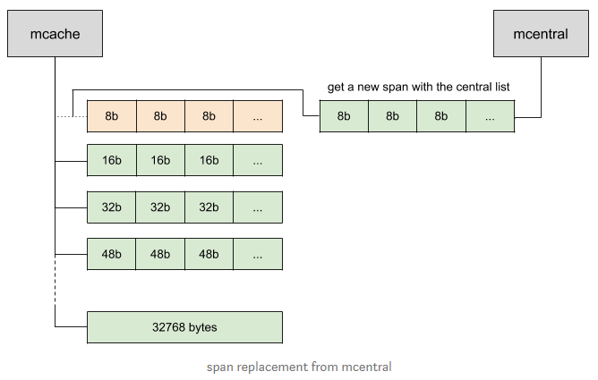
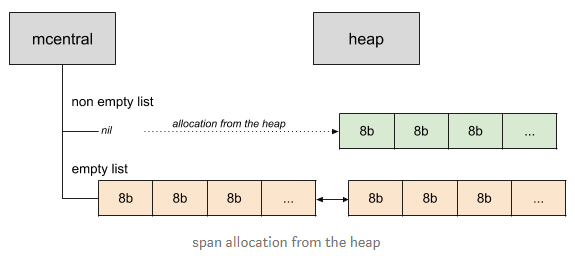
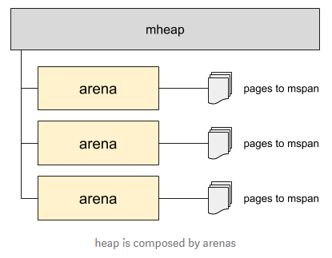
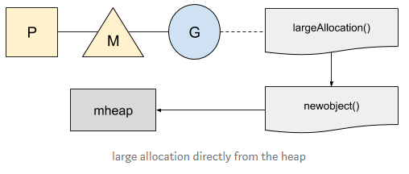
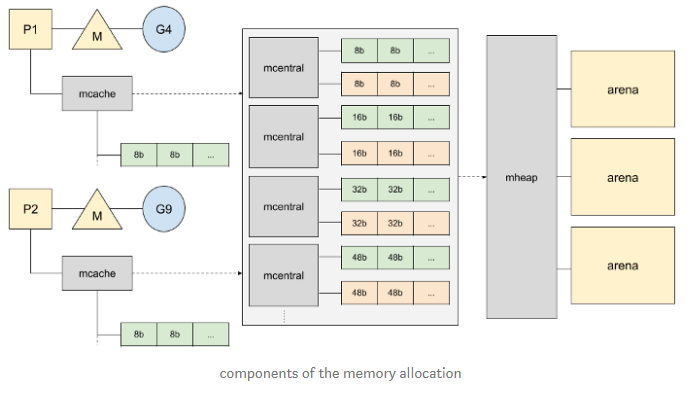

- [Go: Memory Management and Allocation](#go-memory-management-and-allocation)
- [Allocation on the heap](#allocation-on-the-heap)
- [Small allocation](#small-allocation)
- [Large allocation](#large-allocation)
- [Big picture](#big-picture)
- [Inspiration](#inspiration)

> go先从本M的buddy系统里分配内存, 再从全局的buddy里面分
> 对于大于32k的大内存, 直接跟os要.

# Go: Memory Management and Allocation
ℹ️ _This article is based on Go 1.13._

Go memory management is automatically done by the standard library from the allocation of the memory to its collection when it is not used anymore. Although the developer does not have to deal with it, the underlying management done by Go is well optimized and full of interesting concepts.

# Allocation on the heap

The memory management is designed to be fast in a concurrent environment and integrated with the garbage collector. Let’s start with a simple example:

```go
package main

type smallStruct **struct** {
    a, b int64
    c, d float64
}

func main() {
    smallAllocation()
}

//go:noinline
func smallAllocation() *smallStruct {
    return &smallStruct{}
}
```

The annotation `//go:noinline` will disable in-lining that would optimize the code by removing the function and, therefore, end up with no allocation.

Running the escape analysis command with `go tool compile "-m" main.go` will confirm the allocation made by Go:

Dumping the assembly code for this program, thanks to `go tool compile -S main.go`, would also explicitly show us the allocation:

```go
0x001d 00029 (main.go:14)  LEAQ   type."".smallStruct(SB), AX
0x0024 00036 (main.go:14)  PCDATA $0, $0
0x0024 00036 (main.go:14)  MOVQ   AX, (SP)
0x0028 00040 (main.go:14)  CALL   runtime.newobject(SB)
```

The function `newobject` is the built-in function for new allocations and proxy `mallocgc`, a function that manages them on the heap. There are two strategies in Go, one for the small allocations and one for larger ones.

# Small allocation

For the small allocations, under 32kb, Go will try to get the memory from a local cache called `mcache`. This cache handles a list of span (memory chunk of 32kb), called `mspan`, that contains the memory available for allocation:

  

Each thread `M` is assigned to a processor `P` and handles at most one goroutine at a time. While allocating memory, our current goroutine will use the local cache of its current `P` to find the first free object available in the span list. Using this local cache does not require lock and makes the allocation more efficient.

The span list is divided into ~70 size classes, from 8 bytes to 32k bytes, that can store different object sizes:

  

Each span exists twice: one list for objects that do not contain pointer and another one that contains pointer. This distinction will make the life of the garbage collector easier since it will not have to scan the spans that do not contain any pointer.

In our previous example, the size of the structure is 32 bytes and will fit in the 32 bytes span:

  

Now, we may wonder what would happen if the span does not have a free slot during the allocation. Go maintains central lists of spans per size classes, called `mcentral`, with the spans that contain free objects and the ones that do not:

  

`mcentral` maintains a double linked list of spans; each of them has a reference to the previous span and next span. A span in the non-empty list — “non-empty” means that at least one slot is free in the list for allocation — could contain some memory in-use already. Indeed, when the garbage collector sweeps the memory, it could clean a part of the span — the part marked as not used anymore — and would put it back in the non-empty list.

Our program can now request a span from the central list if it runs out of slots:

  

Go needs a way to get new spans to the central list if none are available in the empty list. New spans will now be allocated from the heap and linked to the central list:

  

The heap pulls the memory from the OS when needed. If it needs more memory, the heap will allocate a large chunk of memory, called `arena`, of 64Mb for the 64bits architectures and 4Mb for most of the other architectures. The arena also maps the memory page with the spans:

  

# Large allocation

Go does not manage the large allocations with a local cache. Those allocations, greater than 32kb, are rounded up to the page size and the pages are allocated directly to the heap.

  

# Big picture

We now have a good view of what is happening at a high level during the memory allocation. Let’s draw all the components together to get the full picture:

  

# Inspiration

The memory allocator is originally based on TCMalloc, a memory allocator optimized for the concurrent environment created by Google. The [documentation of TCMalloc](http://goog-perftools.sourceforge.net/doc/tcmalloc.html) is worth reading; you will also find the concepts explained previously.

