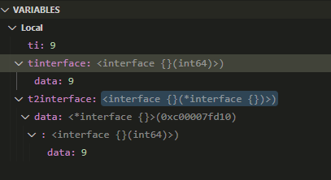

- [go的内存模型](#go的内存模型)
  - [例子1](#例子1)
  - [例子2](#例子2)
- [业务逻辑上避免调用锁](#业务逻辑上避免调用锁)
- [for循环里的变量](#for循环里的变量)
  - [变量每次进入循环都会初始化](#变量每次进入循环都会初始化)
  - [变量的地址会变吗?](#变量的地址会变吗)
    - [不会?](#不会)
    - [会!](#会)
    - [结论:](#结论)
  - [理论解释 -- 表示怀疑](#理论解释----表示怀疑)
    - [怀疑](#怀疑)
    - [合理解释](#合理解释)
    - [内置new函数也不是一定分配到堆](#内置new函数也不是一定分配到堆)
  - [总结](#总结)
  - [修正](#修正)
  - [再修正](#再修正)
- [reflect.ValueOf](#reflectvalueof)
  - [ValueOf流程](#valueof流程)
  - [什么是ifaceIndir](#什么是ifaceindir)
  - [Value的Elem()方法](#value的elem方法)
  - [emptyInterface和nonEmptyInterface](#emptyinterface和nonemptyinterface)
  - [ValueOf实例](#valueof实例)
    - [结论](#结论-1)
  - [强制escape](#强制escape)
  - [问答](#问答)
    - [为什么看到value的kind是54?](#为什么看到value的kind是54)
- [interface赋值给interface](#interface赋值给interface)
  - [直接赋值: interface只有一层](#直接赋值-interface只有一层)
  - [取地址赋值: interface包interface地址](#取地址赋值-interface包interface地址)
  - [结论](#结论-2)
- [slice能当作"出参"传递](#slice能当作出参传递)
  - [结论](#结论-3)
- [slice和gc](#slice和gc)
  - [具体例子](#具体例子)
    - [Remove all elements](#remove-all-elements)
    - [Keep allocated memory](#keep-allocated-memory)
  - [结论](#结论-4)
- [float32和data race](#float32和data-race)
  - [使用sync/atomic](#使用syncatomic)
- [再说reflect](#再说reflect)
  - [什么是unaddressable](#什么是unaddressable)
    - [不能改变a](#不能改变a)
    - [能改变a](#能改变a)
    - [为什么?](#为什么)
    - [更进一步解释](#更进一步解释)
    - [结论](#结论-5)
    - [例子](#例子)
  - [原理](#原理)
    - [结论](#结论-6)
- [再议interface](#再议interface)
  - [interface{}回顾](#interface回顾)
  - [set get性能损失如何?](#set-get性能损失如何)
  - [结论](#结论-7)
- [标准库的`time.Now()`如何取得系统时间?](#标准库的timenow如何取得系统时间)
  - [`time.Now()`的实现流程](#timenow的实现流程)
  - [clock_gettime系统调用](#clock_gettime系统调用)
- [逃逸分析和变量分配](#逃逸分析和变量分配)
  - [逃逸分析使用](#逃逸分析使用)
  - [逃逸分析实例](#逃逸分析实例)
- [go的值和指针](#go的值和指针)
- [map](#map)
  - [初始化](#初始化)
    - [hashmap结构体](#hashmap结构体)
    - [make map变量的时候](#make-map变量的时候)
  - [遍历](#遍历)
  - [hash算法](#hash算法)
    - [常用的hash算法](#常用的hash算法)
  - [结论](#结论-8)
- [Gc的演进](#gc的演进)
- [interface赋值](#interface赋值)
  - [更正](#更正)
  - [interface的内部表达](#interface的内部表达)
    - [reflect Type和interface](#reflect-type和interface)
    - [reflect method](#reflect-method)
    - [reflect Value](#reflect-value)
- [timer](#timer)
  - [timer API](#timer-api)
    - [单次timer](#单次timer)
    - [周期性timer](#周期性timer)
  - [timer实现原理](#timer实现原理)
    - [add timer](#add-timer)
    - [触发timer](#触发timer)
    - [time.NewTimer()注册了sendTime()回调](#timenewtimer注册了sendtime回调)
    - [timer堆的维护](#timer堆的维护)
  - [time包的NewTimer方法调用了runtime.startTimer](#time包的newtimer方法调用了runtimestarttimer)
  - [性能测试和结果](#性能测试和结果)
    - [测试结果](#测试结果)
    - [结论](#结论-9)
- [go1.14对timer的优化](#go114对timer的优化)
  - [go1.13的timer问题](#go113的timer问题)
  - [1.14解决思路](#114解决思路)
- [系统监控](#系统监控)
  - [监控循环](#监控循环)
  - [检查timer](#检查timer)
  - [检查死锁](#检查死锁)
  - [轮询网络](#轮询网络)
  - [抢占处理器](#抢占处理器)
  - [垃圾回收](#垃圾回收)
- [IO多路复用](#io多路复用)
  - [golang对epoll的封装](#golang对epoll的封装)
  - [数据结构](#数据结构)
  - [初始化](#初始化-1)
  - [goroutine等待事件](#goroutine等待事件)
  - [调用epoll](#调用epoll)
  - [截至日期](#截至日期)
- [GC 垃圾收集器](#gc-垃圾收集器)
- [go runtime调度器](#go-runtime调度器)
- [相关的结构体表示](#相关的结构体表示)
- [go比较快的5点](#go比较快的5点)

# go的内存模型
* 对一个goroutine来说, 编译器和CPU可以合理的乱序, 但必须保证程序顺序的正确性.
即无关的指令才能reorder, 比如`a = 1; b = 2;`, 在另外一个routine观察可以先看到`b = 2`
* 多routine对共享变量的**access**(重点, 包括读和写), 必须用sync方法
* 对大于machine word(比如32bit)的值的读写, 是多个machine word size的操做, 它们的顺序未定义
* init函数是在特殊的初始化gorotine里执行的, 但init函数可以启动新的goroutine. 被import包的init函数**一定**先于importer完成. `main.main`一定是最后执行

## 例子1
```go
var a, b int

func f() {
    a = 1
    b = 2
}

func g() {
    print(b)
    print(a)
}

func main() {
    go f()
    g()
}
```
可能打印2然后是0. 即f()的`b = 2`先被`g()`观察到.

## 例子2
```go
var a string
var done bool

func setup() {
    a = "hello, world"
    done = true
}

func doprint() {
    if !done {
        once.Do(setup)
    }
    print(a)
}

func twoprint() {
    go doprint()
    go doprint()
}
```
在`doprint()`里, 观察到`done`的写入, 因为乱序执行, 不一定`a = "hello, world"`也完成了.

下面的代码也不对:
```go
var a string
var done bool

func setup() {
    a = "hello, world"
    done = true
}

func main() {
    go setup()
    for !done {
    }
    print(a)
}
```
过了`for !done`之后, a可能依然是空.
更糟糕的是, 因为没有使用sync, done的写入不能保证一定被main观察到, 以至于main永远不退出.

下面的错误代码更有隐蔽性:
```go
type T struct {
    msg string
}

var g *T

func setup() {
    t := new(T)
    t.msg = "hello, world"
    g = t
}

func main() {
    go setup()
    for g == nil {
    }
    print(g.msg)
}
```
既是main看到g不是nil了, 也不能保证`g.msg`就有值了.

# 业务逻辑上避免调用锁
代码1
```go
func (mq *msgQ) putMsg(mm *metaKnownMsg) {
    if _, ok := mm.msg.(HighPriorityMessage); ok {
        if mq.ingressHighChan == nil {
            mq.Lock()
            if mq.ingressHighChan == nil {
                mq.ingressHighChan = make(chan *metaKnownMsg, mq.qsize)
            }
            mq.Unlock()
        }
        mq.ingressHighChan <- mm
    }
}
```
代码2
```go
func (mq *msgQ) putMsg(mm *metaKnownMsg) {
    if _, ok := mm.msg.(HighPriorityMessage); ok {
        mq.Lock()
        if mq.ingressHighChan == nil {
            mq.ingressHighChan = make(chan *metaKnownMsg, mq.qsize)
        }
        mq.Unlock()
        mq.ingressHighChan <- mm
    }
}
```

在并发场景下, 代码1比代码2理论上性能高非常多. 
这里在ingressHighChan为空的时候, 需要新建队列. 这个事情只用做一次.
而代码2在**每次**进入函数的时候, 都要去获取锁, 那么比如说并发100个函数都走到这里, 就**只有一个**人能够获取到做, 其他人必须等待锁释放. 而接下来的99个人, 都必须**串行**的完成这个过程.

总结:
* 在业务逻辑侧尽量减少lock的调用. 比如这里已知队列为空的时候才调用锁.

# for循环里的变量
## 变量每次进入循环都会初始化
比如下面的代码:
```go
    for {
        var a, b, c int
        fmt.Println("Hello, playground", a, b, c)
        a = 9
        fmt.Println("Hello, playground", a, b, c)
        time.Sleep(time.Second)
    }
```
输出:
```
Hello, playground 0 0 0
Hello, playground 9 0 0
Hello, playground 0 0 0
Hello, playground 9 0 0
```
可以看到: a,b,c都是for里面定义的变量, 初始为零值. 没毛病
循环体里面把a赋值为9, 随后打印a为9, 也没毛病.
本次循环体执行完毕后, 下次循环体执行时, a的值又从零值开始. -- 这里不能用C的思路去理解

## 变量的地址会变吗?
### 不会?
看下面的代码:
```go
    for i := 0; i < 3; i++ {
        var a int
        fmt.Println("Hello, playground", a, uintptr(unsafe.Pointer(&a)))
        a = 9
        fmt.Println("Hello, playground", a, uintptr(unsafe.Pointer(&a)))
        time.Sleep(time.Second)
    }
```
输出:
```
Hello, playground 0 824634355464
Hello, playground 9 824634355464
Hello, playground 0 824634355464
Hello, playground 9 824634355464
Hello, playground 0 824634355464
Hello, playground 9 824634355464
```
看起来变量a的地址并没有变化

### 会!
```go
func main() {
    for i := 0; i < 3; i++ {
        var a int
        fmt.Println("Hello, playground", a, uintptr(unsafe.Pointer(&a)))
        a = 9
        fmt.Println("Hello, playground", a, uintptr(unsafe.Pointer(&a)))
        time.Sleep(time.Second)
    }

    for i := 0; i < 3; i++ {
        var a int
        fmt.Println("in main ", a, uintptr(unsafe.Pointer(&a)))
        a = 9

        go func() {
            fmt.Println("in go   ", a, uintptr(unsafe.Pointer(&a)))
        }()
        time.Sleep(time.Second)
    }
}
```
输出:
```
Hello, playground 0 824634388176
Hello, playground 9 824634388176
Hello, playground 0 824634388176
Hello, playground 9 824634388176
Hello, playground 0 824634388176
Hello, playground 9 824634388176
in main  0 824634499152
in go    9 824634499152
in main  0 824634499176
in go    9 824634499176
in main  0 824634499200
in go    9 824634499200
```

那么更进一步的问题: 这里go中看到的变量`a`地址, 和main中每次进入循环体时`a`的地址一样, 是否是因为它们在时间顺序上前者在后, 后者在前?
改成这样:
```go
    for i := 0; i < 30; i++ {
        var a int
        fmt.Println("in main ", a, uintptr(unsafe.Pointer(&a)))
        a = 9

        go func() {
            time.Sleep(time.Second)
            fmt.Println("in go   ", a, uintptr(unsafe.Pointer(&a)))
        }()
        //time.Sleep(time.Second)
    }
    time.Sleep(time.Minute)
```
在go函数里面, 先延迟一秒钟. 那么main的for循环会先执行完, goroutine都在后面执行.
结果如下, 说明go函数里面取得到的变量a, 就是**本次**循环体里面的变量`a`.
```
in main  0 824634499136
in main  0 824634499152
in main  0 824634499168
in main  0 824634499184
in main  0 824634499200
in main  0 824634499216
in main  0 824634499232
in main  0 824634499248
in main  0 824634499264
in main  0 824634499280
in main  0 824634499296
in main  0 824634499312
in main  0 824634499328
in main  0 824634499344
in main  0 824634499360
in main  0 824634499376
in main  0 824634499392
in main  0 824634499408
in main  0 824634499424
in main  0 824634499440
in main  0 824634499456
in main  0 824634499472
in main  0 824634499488
in main  0 824634499504
in main  0 824634499520
in main  0 824634499536
in main  0 824634499552
in main  0 824634499568
in main  0 824634499584
in main  0 824634499600
in go    9 824634499136
in go    9 824634499600
in go    9 824634499584
in go    9 824634499568
in go    9 824634499552
in go    9 824634499536
in go    9 824634499520
in go    9 824634499504
in go    9 824634499488
in go    9 824634499472
in go    9 824634499456
in go    9 824634499184
in go    9 824634499424
in go    9 824634499408
in go    9 824634499392
in go    9 824634499376
in go    9 824634499360
in go    9 824634499344
in go    9 824634499328
in go    9 824634499312
in go    9 824634499296
in go    9 824634499280
in go    9 824634499264
in go    9 824634499248
in go    9 824634499232
in go    9 824634499216
in go    9 824634499200
in go    9 824634499440
in go    9 824634499168
in go    9 824634499152
```

### 结论:
* ~~for循环体里的变量, 但按照下面的理论来说, 每次进入循环体, 都进入了一个新的scope, 变量地址应该会变化. 少数情况下, 循环体比较简单, 可能变量地址**碰巧**不变.~~ --**结论错误!!!!!**
* for循环体里的变量, 被go函数捕获时, 用的是**本次**循环体里的变量. 即使循环体在main中**异步的**改变了该变量, 也不影响**已经**go出去的routine. --**表面正确**!!!!
* 正确结论见下面


## 理论解释 -- 表示怀疑
参考[stackoverflow](https://stackoverflow.com/questions/39208162/why-i-can-redefine-the-same-variable-multiple-times-in-a-for-loop-but-cant-outs)
有人问为什么在循环里可以:
```go
func main() {
    for i := 0; i < 2; i++ {
        x := 77
        fmt.Println(x)
    }
}
```
但自己手动写就编译不过:
```go
func main() {
    a := 77
    fmt.Println(a)
    a := 77
    fmt.Println(a)
}
```
为啥?

专家的解答是:
for循环每次进入循环体大括号块`{}`, 都是一个新的scope

> The reason is each time you enter a block of curly braces `{}` you're creating a new nested scope. When you declare the variable `x` at the top of the loop it is a new variable and it goes out of scope at the end of the loop. When the program comes back around to the top of the loop again it's another new scope.

有人给出了证据:
```go
func main() {
    for i := 0; i < 2; i++ {
        x := 77
        fmt.Println(&x)
    }
}
```
output
```
0x1040e0f8
0x1040e0fc
```


可以手动加`{}`来添加scope:
```go
func main() {
    a := 77
    fmt.Println(&a)
    {
        a := 77
        fmt.Println(&a)
    }
}
```
output
```
0x1040e0f8
0x1040e0fc
```
上面的例子就可以"连续"定义`a`两次, 但第二次是个新的变量地址

### 怀疑
证据例子中, 变量x的地址改变, 不是因为重新进入`{}`scope的原因.
比如把下面的"证据"
```go
func main() {
    for i := 0; i < 2; i++ {
        x := 77
        fmt.Println(&x)
    }
}
```
结果
```
0x1040e0f8
0x1040e0fc
```

改成:
```go
func main() {
    for i := 0; i < 2; i++ {
        x := 77
        fmt.Println(uintptr(unsafe.Pointer(&x)))
    }
}
```
注意第4行, 用了unsafe.Pointer取x的地址.
结果:
```
824634150736
824634150736
```

为什么结果不一样? 上面的证据显示x的地址改变了, 而下面的代码中x的地址没变.
### 合理解释
因为有`fmt.Println(&x)`, **变量x逃逸到了堆中**, 自然每次进入循环其地址都会改变.
而`fmt.Println(uintptr(unsafe.Pointer(&x)))`不会逃逸, x还是在栈上, 自然地址不变.

### 内置new函数也不是一定分配到堆
比如下面的代码, 不管是`x := 77`, 还是`x := new(int)`, 连续两次的地址都是一样的
```go
for i := 0; i < 2; i++ {
        //x := 77
        //fmt.Println(uintptr(unsafe.Pointer(&x)))
        x := new(int)
        fmt.Println(uintptr(unsafe.Pointer(x)))
    }
```

## 总结
* for的循环变量, 比如`i++`和循环体里面的变量是两码事:
* for循环同一行的变量作用域在for里面没错, 但更像是在进入循环前定义的一样: for循环里面对循环变量的引用都是指向同一个东西
* ~~for循环体里面用`var v int`或`vc := vc`定义的变量, 并非同一个地址, 每次循环都是"临时"生成的. 所以上面在第13行的修改可以解决问题.~~
* 以后检查go出去的函数是否有这个问题, **只检查循环变量**就行了 -- 结论正确, 但前面推导过程不对.
* 见下面

## 修正
变量地址是否改变, 要看
* 如果变量在栈上没有逃逸到堆, 那每次for循环里的变量地址是不变的
* 如果变量逃逸到堆, 那每次for循环里的变量地址不一样
    * fmt.Println类的函数会导致变量逃逸(大概率)
    * go 函数造成的闭包引用会导致变量逃逸(必然)
    * channel的send应该也会必然导致变量逃逸
* 不清楚的情况下, 请默认变量是同一个地址. 这样你可以更小心的避免"无意中"改变了一个你认为是独立的变量但实际是共享的, 因为你一开始就应该假定这个变量就是共享的.

错误代码示例:
```go
for {
    // fill bufMsg from network socket
    var tm streamTransportMsg
    dec.Decode(bufMsg, &tm)
    streamChan <- &streamTransportMsg{srcChan: tm.dstChan, dstChan: tm.srcChan, msg: tm.msg}
}
```
注意这里取tm地址做为decode的"出参", 会实际改变tm底层的数据; 而chan的发送是异步的效果, 真正处理的routine可能看到的`tm.msg`已经改变.

## 再修正
上面的错误代码示例不准确
```go
for {
    // fill bufMsg from network socket
    var tm streamTransportMsg
    dec.Decode(bufMsg, &tm)
    streamChan <- &streamTransportMsg{srcChan: tm.dstChan, dstChan: tm.srcChan, msg: tm.msg}
}
```
另外一个goroutine从streamChan中得到streamTransportMsg的引用, 但看到的tm.msg会在for循环里改变, 不是因为tm的地址没变, 实际上tm的地址会变, 因为channel的发送会导致逃逸. 那错误的原因是tm.msg地址没变, 这是gotiny的Decode问题, 是另外一个故事.


# reflect.ValueOf

## ValueOf流程
```go
// ValueOf returns a new Value initialized to the concrete value
// stored in the interface i. ValueOf(nil) returns the zero Value.
func ValueOf(i interface{}) Value {
    if i == nil {
        return Value{}
    }

    // TODO: Maybe allow contents of a Value to live on the stack.
    // For now we make the contents always escape to the heap. It
    // makes life easier in a few places (see chanrecv/mapassign
    // comment below).
    escapes(i)

    return unpackEface(i)
}
```
从这个函数传进来的`i`, 不管之前是什么类型, 到这里都是`eface`, 即empty interface.
这里的`escapes(i)`我理解i这个interface变量的结构体是在栈上的, 但其"contents"要强制分配到heap中, 这里的contents就是i的指针域指向的实体.

```go
// unpackEface converts the empty interface i to a Value.
func unpackEface(i interface{}) Value {
    e := (*emptyInterface)(unsafe.Pointer(&i)) //明确知道i是个emptyInterface
    // NOTE: don't read e.word until we know whether it is really a pointer or not.
    t := e.typ
    if t == nil {
        return Value{}
    }
    f := flag(t.Kind())
    if ifaceIndir(t) {
        f |= flagIndir
    }
    return Value{t, e.word, f}
}
```
我们看到:
reflect.Value只是`unpackEface`这个interface, 组成一个Value的结构体, 这中间并没有真正拷贝"contents", 而是把"contents"做为word返回. 这个word可以是指针, 也可以是值.


这里的Value是如下结构体:
```go
// Value is the reflection interface to a Go value.
//
// Not all methods apply to all kinds of values. Restrictions,
// if any, are noted in the documentation for each method.
// Use the Kind method to find out the kind of value before
// calling kind-specific methods. Calling a method
// inappropriate to the kind of type causes a run time panic.
//
// The zero Value represents no value.
// Its IsValid method returns false, its Kind method returns Invalid,
// its String method returns "<invalid Value>", and all other methods panic.
// Most functions and methods never return an invalid value.
// If one does, its documentation states the conditions explicitly.
//
// A Value can be used concurrently by multiple goroutines provided that
// the underlying Go value can be used concurrently for the equivalent
// direct operations.
//
// To compare two Values, compare the results of the Interface method.
// Using == on two Values does not compare the underlying values
// they represent.
type Value struct {
    // typ holds the type of the value represented by a Value.
    typ *rtype

    // Pointer-valued data or, if flagIndir is set, pointer to data.
    // Valid when either flagIndir is set or typ.pointers() is true.
    ptr unsafe.Pointer

    // flag holds metadata about the value.
    // The lowest bits are flag bits:
    //    - flagStickyRO: obtained via unexported not embedded field, so read-only
    //    - flagEmbedRO: obtained via unexported embedded field, so read-only
    //    - flagIndir: val holds a pointer to the data
    //    - flagAddr: v.CanAddr is true (implies flagIndir)
    //    - flagMethod: v is a method value.
    // The next five bits give the Kind of the value.
    // This repeats typ.Kind() except for method values.
    // The remaining 23+ bits give a method number for method values.
    // If flag.kind() != Func, code can assume that flagMethod is unset.
    // If ifaceIndir(typ), code can assume that flagIndir is set.
    flag

    // A method value represents a curried method invocation
    // like r.Read for some receiver r. The typ+val+flag bits describe
    // the receiver r, but the flag's Kind bits say Func (methods are
    // functions), and the top bits of the flag give the method number
    // in r's type's method table.
}
```

## 什么是ifaceIndir
在`unpackEface`中, 调用了函数`ifaceIndir(t)`来检查是否eface的data域是个指针(一般都是), 但也有时候这个data域直接存的就是值.
```go
// unpackEface converts the empty interface i to a Value.
func (i interface{}) Value {
    e := (*emptyInterface)(unsafe.Pointer(&i)) //明确知道i是个emptyInterface
    // NOTE: don't read e.word until we know whether it is really a pointer or not.
    t := e.typ
    if t == nil {
        return Value{}
    }
    f := flag(t.Kind())
    if ifaceIndir(t) {
        f |= flagIndir
    }
    return Value{t, e.word, f} //这里的e.word就是eface的data.
}

// ifaceIndir reports whether t is stored indirectly in an interface value.
func ifaceIndir(t *rtype) bool {
    return t.kind&kindDirectIface == 0
}

//rtype的kind字段, 第5位表示data指针实际存的是值.
const (
    kindDirectIface = 1 << 5
    kindGCProg      = 1 << 6 // Type.gc points to GC program
    kindMask        = (1 << 5) - 1
)
```
综上, eface和iface的data域**不一定**都是指针, 还可能是值. 这可能是个优化, 但其实挺费劲的. 都是指针多好.

## Value的Elem()方法
Elem()方法用于取得interface或者ptr的"contents"
```go
// Elem returns the value that the interface v contains
// or that the pointer v points to.
// It panics if v's Kind is not Interface or Ptr.
// It returns the zero Value if v is nil.
func (v Value) Elem() Value {
    k := v.kind()
    switch k {
    case Interface:
        var eface interface{}
        if v.typ.NumMethod() == 0 {
            eface = *(*interface{})(v.ptr) //ptr指向empty interface
        } else {
            eface = (interface{})(*(*interface {
                M() //临时构造一个带一个M方法的interface类型, 相当于eface = someOtherInterfaceWithMethod
            })(v.ptr)) //ptr指向带方法的interface
        }
        x := unpackEface(eface)
        if x.flag != 0 {
            x.flag |= v.flag.ro() //这里就是unsettable的来源?
        }
        return x
    case Ptr:
        ptr := v.ptr //默认是data, 只不过保存在ptr里面. 比如就是int 5
        if v.flag&flagIndir != 0 { //指针
            ptr = *(*unsafe.Pointer)(ptr) //解引用得到data
        }
        // The returned value's address is v's value.
        if ptr == nil {
            return Value{}
        }
        tt := (*ptrType)(unsafe.Pointer(v.typ))
        typ := tt.elem
        fl := v.flag&flagRO | flagIndir | flagAddr //这里我有点困惑, 为什么要设置flagIndir | flagAddr?
        fl |= flag(typ.Kind())
        return Value{typ, ptr, fl}
    }
    panic(&ValueError{"reflect.Value.Elem", v.kind()})
}
```
看起来`Elem()`也是操做ptr, 没有明显的值拷贝.

## emptyInterface和nonEmptyInterface
emptyInterface比较简单
```go
// emptyInterface is the header for an interface{} value.
type emptyInterface struct {
    typ  *rtype
    word unsafe.Pointer
}
```

而nonEmptyInterface就复杂多了, 包括静态interface类型, concrete类型, 和方法表.
方法表容量有100000个之多, 但我判断这部分其实不占那么多内存的.
```go
// nonEmptyInterface is the header for an interface value with methods.
type nonEmptyInterface struct {
    // see ../runtime/iface.go:/Itab
    itab *struct {
        ityp *rtype // static interface type
        typ  *rtype // dynamic concrete type
        hash uint32 // copy of typ.hash
        _    [4]byte
        fun  [100000]unsafe.Pointer // method table
    }
    word unsafe.Pointer
}
```

上面是reflect的定义, 相应的runtime表达, 在`src/runtime/runtime2.go`中, 有:
```go
type iface struct {
    tab  *itab
    data unsafe.Pointer
}

// layout of Itab known to compilers
// allocated in non-garbage-collected memory
// Needs to be in sync with
// ../cmd/compile/internal/gc/reflect.go:/^func.dumptabs.
type itab struct {
    inter *interfacetype
    _type *_type
    hash  uint32 // copy of _type.hash. Used for type switches.
    _     [4]byte
    fun   [1]uintptr // variable sized. fun[0]==0 means _type does not implement inter.
}

type eface struct {
    _type *_type
    data  unsafe.Pointer
}

func efaceOf(ep *interface{}) *eface {
    return (*eface)(unsafe.Pointer(ep))
}
```
基本上差不多.

## ValueOf实例
把一个指向interface类型的指针, 解引用后做ValueOf操做:
```go
// p是unsafe.Pointer, 已知指向reflect.Interface类型, rt是这个类型的TypeOf()后的reflect.Type
if rt.NumMethod() == 0 { // 没有方法是eface
    ti := *(*interface{})(p)
    v := reflect.ValueOf(ti)
}
```
此时p指向eface, 见上面eface定义; 在这个例子中, 这个interface的content是个gotiny.baseTyp结构体:  
  

```go
// p是unsafe.Pointer, 已知指向reflect.Interface类型, rt是这个类型的TypeOf()后的reflect.Type
if rt.NumMethod() > 0 { // 有方法是iface
    ti := *(*interface {
        M()
    })(p)
    v := reflect.ValueOf(ti)
    et := v.Type()
}
```
此时p指向iface, 见上面iface定义; 在这个例子中, 这个interface是:
```go
// tint是int, 实现了io.ReadWriteCloser
type tint int
func (tint) Read([]byte) (int, error)  { return 0, nil }
func (tint) Write([]byte) (int, error) { return 0, nil }
func (tint) Close() error              { return nil }

v1interface io.ReadWriteCloser = tint(2)
```
这里我们看到, `ti`在dlv看来, 其data是2. 我们知道一个interface的"data"域是个指针, 但这里的2刚好就是`v1interface`的值, 那么这个data已经不是指针而是值了, 是否是因为dlv"自动"解引用了呢? 

  
在`ValueOf(ti)`的里面的`unpackEface()`中, ti被"值拷贝"(interface的值拷贝)到i:
```go
// unpackEface converts the empty interface i to a Value.
func unpackEface(i interface{}) Value {
    e := (*emptyInterface)(unsafe.Pointer(&i))
    // NOTE: don't read e.word until we know whether it is really a pointer or not.
    t := e.typ
    if t == nil {
        return Value{}
    }
    f := flag(t.Kind())
    if ifaceIndir(t) {
        f |= flagIndir
    }
    return Value{t, e.word, f}
}
```
因为i在内存中是`emptyInterface`类型, 强转成e, 我们能借助dlv看到e的typ和word:  
  
注意到t的Kind是2(也就是int), 而word是个指针.
这个e就是i, 也就是ti.

所以我们看到`v := reflect.ValueOf(ti)`执行后, v就是ti的实际内存表达:  
  
但从此丢失了ti的method信息???

### 结论
当类型的Kind是Interface的时候, 如果只有指向这个变量的指针p, 那么要区分p指向的到底是eface还是iface, 不能混用, 否则会panic. 所以要这样:
```go
// p是unsafe.Pointer, 已知指向reflect.Interface类型, rt是这个类型的TypeOf()后的reflect.Type
if rt.NumMethod() > 0 { // 有方法是iface
    ti := *(*interface {
        M()
    })(p)
    v := reflect.ValueOf(ti)
    et := v.Type()
} else { // 没有方法是eface
    ti := *(*interface{})(p)
    v := reflect.ValueOf(ti)
    et := v.Type()
}
```

## 强制escape
`/usr/local/go/src/reflect/value.go`
定义一个全局变量:
```go
var dummy struct {
    b bool
    x interface{}
}
```
如果需要强制escape一个变量, 只需要赋值给dummy的x. 因为一个全局变量持有x的引用, 那x必须在heap里面.
```go
// Dummy annotation marking that the value x escapes,
// for use in cases where the reflect code is so clever that
// the compiler cannot follow.
func escapes(x interface{}) {
    if dummy.b {
        dummy.x = x
    }
}
```

## 问答
### 为什么看到value的kind是54?
如图?  
  
答: 这里的kind不是反射那个Kind, 或者说不完全是. 这里的kind是`rtype`类型的一个field.
真正的kind是这个field在与上kindMask, 相当于`t.kind & 31`
```go
func (t *rtype) Kind() Kind { return Kind(t.kind & kindMask) }
```
所以`54&31`后, 是22. 22对应的Kind是`reflect.Ptr`


# interface赋值给interface
## 直接赋值: interface只有一层
我们知道interface的内部第二个field是个指针
```go
type eface struct { // 16 bytes
    _type *_type
    data  unsafe.Pointer
}
type iface struct { // 16 bytes
    tab  *itab
    data unsafe.Pointer
}
```
那么如果我把一个interface变量(t1i)赋值给另一个interface变量(t2i), 那么t2i的data是指向t1i的拷贝的吗?
比如
```go
    t := 9
    var t1i interface{}
    t1i = t
    var t2i interface{}
    t2i = t1i
```
答: 不是. 
首先, interface的赋值也有值拷贝, 前面说过的: 再理解一下
> The second word in the interface value **points at the actual data**, in this case **a copy of** `b`. The assignment `var s Stringer = b` makes a copy of `b` rather than point at `b` for the same reason that `var c uint64 = b` makes a copy: if `b` later changes, `s` and `c` are supposed to have the original value, not the new one.

其次, 这里并不是把t2i这个interface的结构即eface结构拷贝一份, 并用t1i的data域来指向. 而是t2i发现赋值对象也是个interface, 就直接查其concrete类型再赋值.
所以我说interface变量只有一级, 不存在interface里面再包一层interface. 而一定是interface下面就是concrete类型. 注意我说的是运行时, 不是定义时. 定义时可以嵌套interface.
证明: `fmt.Println(reflect.TypeOf(t1i).String())`结果是`int`
`TypeOf(t1i)`这步就有t1i赋值给入参的过程, 这个就是interface赋值给interface. 如果允许运行时嵌套interface, 那多层函数传递interface就会嵌套好多层. 用户不会知道里面有多少层interface的.

## 取地址赋值: interface包interface地址
如果把上面的代码改成
```go
    ti := int64(9)
    var tinterface interface{}
    tinterface = ti
    fmt.Println(reflect.TypeOf(tinterface).String())
    var t2interface interface{}
    t2interface = &tinterface
    
    ti = 10

    fmt.Println(t2interface)
```
那么t2interface的具体内存表达是什么样的?  
  
答: t2interface的data指针是`*interface{}`类型, 应该就是指向tinterface

## 结论
```go
    ti := int64(9)
    var tinterface interface{}
    tinterface = ti
    fmt.Println(reflect.TypeOf(tinterface).String())
    var t2interface interface{}
    t2interface = tinterface
    fmt.Println(reflect.TypeOf(t2interface).String())
    var t3interface interface{}
    t3interface = &tinterface
    fmt.Println(reflect.TypeOf(t3interface).String())

    var t4interface interface{}
    t4interface = &t3interface
    fmt.Println(reflect.TypeOf(t4interface).String())
```
这段代码打印:
```
int64
int64
*interface {}
*interface {}
```
  
特别的, `t4interface`有3层嵌套, 包括`&t3interface`一层, `&tinterface`一层, 最后的`int64(9)`一层.

所以: 
* interface i1值赋值给interface i2, 其concrete**类型**会传递(或者说短接)到"第一层".(t2interface的行为)
* interface i1值赋值给interface i2, 其i1的concrete的**值**会拷贝给i2.
* interface取地址赋值给interface, 并非传递, 而是嵌套.(t4interface的行为)

# slice能当作"出参"传递
比如`io.Reader`
```go
type Reader interface {
    Read(p []byte) (n int, err error)
}
```
这里说的很清楚, `Read reads up to len(p) bytes into p`. 注意这里
* p做为出参, Read函数内对p的修改是能够被调用者看到的.
* 但注意`up to len(p)`, 因为p是调用者传入slice的"浅拷贝", 大小是不能改变的, append()函数等改变len()的不会体现到调用者看到的"p"中.

## 结论
在slice p被当作参数传递的过程中, 发生了slice的"浅拷贝", 浅拷贝共享底层数组, 所以对底层数组的修改能够被调用者看到, 其作用类似"出参". 但"浅拷贝"对slice本身的改变, 比如改变len, 原slice是看不到的.
```go
    a := []int{1,2,3}
    a1 := a
    a1[2]=100
    a1 = append(a1, 4)
    fmt.Println(a1)
    fmt.Println(a)
    
//输出
[1 2 100 4]
[1 2 100]
```

# slice和gc
对一个slice进行切片不会导致底层array被gc.
具体见https://stackoverflow.com/questions/28432658/does-go-garbage-collect-parts-of-slices
> As mentioned earlier, re-slicing a slice doesn't make a copy of the underlying array. **The full array will be kept in memory until it is no longer referenced.** Occasionally this can cause the program to hold all the data in memory when only a small piece of it is needed.
Since the slice references the original array, **as long as the slice is kept around the garbage collector can't release the array**.

## 具体例子
https://yourbasic.org/golang/clear-slice/
### Remove all elements

To remove all elements, simply set the slice to `nil`.

```go
a := []string{"A", "B", "C", "D", "E"}
a = nil
fmt.Println(a, len(a), cap(a)) // [] 0 0
```

This will release the underlying array to the garbage collector (assuming there are no other references).

### Keep allocated memory

To keep the underlying array, slice the slice to zero length.

```go
a := []string{"A", "B", "C", "D", "E"}
a = a[:0]
fmt.Println(a, len(a), cap(a)) // [] 0 5
```

If the slice is extended again, the original data reappears.

```go
fmt.Println(a[:2]) // [A B]
```

## 结论
对slice进行切片不会导致gc
即`a = a[:0]`不会把底层的array gc掉.

# float32和data race
在`pidinfo.go`中, 我使用了float32类型的变量`userHz`
```go
var userHz float32 = 100
```

我当时认为一个CPU对齐的32bit变量, 它的load和store操作是原子的.
-- 好像理论上是的.

但`go test -race`还是认为这里有问题: 即同时读写这个变量被认为是数据竞争:
```
WARNING: DATA RACE
Read at 0x00000071c34c by goroutine 8:
  gitlabe1.ext.net.nokia.com/godevsig/system/pidinfo.(*TidInfo).CPUpercent()
      /builds/godevsig/system/pidinfo/pidinfo.go:480 +0x269
      ...

Previous write at 0x00000071c34c by goroutine 10:
  gitlabe1.ext.net.nokia.com/godevsig/system/pidinfo.hzUpdater()
      /builds/godevsig/system/pidinfo/pidinfo.go:331 +0x22c
```

## 使用sync/atomic
```go
// AtomicLoadFloat64 loads float64 atomically
func AtomicLoadFloat64(addr *float64) float64 {
    return math.Float64frombits(atomic.LoadUint64((*uint64)(unsafe.Pointer(addr))))
}

// AtomicStoreFloat64 stores float64 atomically
func AtomicStoreFloat64(addr *float64, val float64) {
    atomic.StoreUint64((*uint64)(unsafe.Pointer(addr)), math.Float64bits(val))
}
```

# 再说reflect
## 什么是unaddressable

### 不能改变a
```go
package main

import (
    "fmt"
    "reflect"
)

func main() {
    a := 55
    fmt.Println(a)
    rv := reflect.ValueOf(a)
    fmt.Println(rv)
    rv.SetInt(66)
    fmt.Println(a)
}
```
上面的代码输出: 代码13行, 说值不能被寻址
```go
55
55
panic: reflect: reflect.Value.SetInt using unaddressable value

goroutine 1 [running]:
reflect.flag.mustBeAssignableSlow(0x82)
    /usr/local/go-faketime/src/reflect/value.go:260 +0x138
reflect.flag.mustBeAssignable(...)
    /usr/local/go-faketime/src/reflect/value.go:247
reflect.Value.SetInt(0x4a4220, 0x54ab98, 0x82, 0x42)
    /usr/local/go-faketime/src/reflect/value.go:1633 +0x3b
main.main()
    /tmp/sandbox505010953/prog.go:13 +0x1d9
```

### 能改变a
但下面的代码就能够修改变量a的值:
```go
package main

import (
    "fmt"
    "reflect"
)

func main() {
    a := 55
    fmt.Println(a)
    rptr := reflect.ValueOf(&a)
    rv := rptr.Elem()
    fmt.Println(rv)
    rv.SetInt(66)
    fmt.Println(a)
}
```
上面代码输出:
```
55
55
66
```
关键在于第11和12行. rptr是&a的值, 也就是a的地址; 而rv是rptr的解引用, 也即rv就是a. 对rv的值的改变, 就是对a的改变.

### 为什么?
在下面代码中, `rv := reflect.ValueOf(a)`实际上是得到`a`的**副本**的值
而如果`rv.SetInt(66)`能够成立的话, 也只能是set这个副本的值, 且这个修改也不会反应到`a`上.
```go
func main() {
    a := 55
    fmt.Println(a)
    rv := reflect.ValueOf(a)
    fmt.Println(rv)
    rv.SetInt(66)
    fmt.Println(a)
}
```

那为什么这样可以?
```go
func main() {
    a := 55
    fmt.Println(a)
    rptr := reflect.ValueOf(&a)
    rv := rptr.Elem()
    fmt.Println(rv)
    rv.SetInt(66)
    fmt.Println(a)
}
```
`rptr := reflect.ValueOf(&a)`也是得到`&a`的**副本**的值. 但`&a`是个指针, 它的解引用`rptr.Elem()`就是`a`, 而不是`a`的副本. 所以可以修改`a`.  
副本发生在指针是没问题的.

### 更进一步解释
`rv.SetInt(66)`的源码如下:

```go
// SetInt sets v's underlying value to x.
// It panics if v's Kind is not Int, Int8, Int16, Int32, or Int64, or if CanSet() is false.
func (v Value) SetInt(x int64) {
    v.mustBeAssignable()
    switch k := v.kind(); k {
    default:
        panic(&ValueError{"reflect.Value.SetInt", v.kind()})
    case Int:
        *(*int)(v.ptr) = int(x)
    case Int8:
        *(*int8)(v.ptr) = int8(x)
    case Int16:
        *(*int16)(v.ptr) = int16(x)
    case Int32:
        *(*int32)(v.ptr) = int32(x)
    case Int64:
        *(*int64)(v.ptr) = x
    }
}
```
可以看到, 只有`v`有ptr才能赋值.

### 结论
其实很简单, 通过反射赋值, 实际上就是两个过程:
先取地址, 再赋值.
```go
ptr = &a
*ptr = x
```

### 例子
```go
var v interface{}
a := 55
v = &a

rptr := reflect.ValueOf(v)

//unaddressable
rptr.Set(reflect.New(rptr.Type().Elem()))
//可以赋值, 相当于v = &b
reflect.ValueOf(&v).Elem().Set(reflect.New(rptr.Type().Elem()))
```

## 原理
https://blog.golang.org/laws-of-reflection
### 结论
* 每个类型都对应一个_type结构, 描述了该类型的属性和方法
* interface也是类型(也是type声明的), 用interfacetype来描述, 后者内部也包括了_type结构
    * 空interface也是类型, 但没有方法
    * 带方法的interface规定了方法集, 也保存在其_type中
* interface的表达可以大概认为是(value, type)对, 更具体的说, 是个16字节的结构, 包括一个指针和实际的(concrete)类型
```go
// 没方法的interface
type eface struct {
    _type *_type
    data  unsafe.Pointer
}
// 有方法的interface
type iface struct {
    tab  *itab
    data unsafe.Pointer
}
```
* interface变量的静态类型是代码中声明的类型, 这个类型会伴随这个interface变量一生, 不会改变
    * 静态类型在编译阶段用来检查是否赋值成立 -- 即对方是否实现了我规定的方法集
    * 静态类型规定了这个interface变量可以**直接**调用的方法.
* concrete类型(有时也称动态类型)是给interface变量赋值的时候, 实际的对象类型
    * interface变量的concrete类型会随着再次赋值而改变
    * 类型断言的意义在于断言这个concrete类型是否满足断言 -- 用类型断言能够**突破静态类型的限制**, 调用concrete类型的其他方法
    * 有方法的interface的itable是动态计算的 -- runtime通过匹配该interface类型的方法集和concrete对象类型的方法集, 来生成itable. -- 每个interface**变量**都有个动态生成的itable. 这个和编译时检查能否赋值不同 -- 但我没想明白, 似乎在编译阶段就能确定下来. 相关的说法是: 就是说可以在编译时搞, 但没必要. 
    > Go's dynamic type conversions mean that it isn't reasonable for the compiler or linker to precompute all possible itables: there are too many (interface type, concrete type) pairs, and most won't be needed
* 反射本质上是一种检测interface变量底层的(value, type)对的方法 -- 这里指concrete类型
    * reflect.Value类型其实就是这个interface变量的内部表达, 它本身既包含了"值", 也包含了类型. 
        * 所以reflect.Value有Type()方法得到其concrete类型
        * 所以Value类型的Interface()方法能够再次"组装(pack)"一个interface变量, 返回一个空的interface{}类型
    * reflect.TypeOf()方法其实是个shortcut, 和先ValueOf()再Type()效果一样.
    * reflect.Type类型是go内部的`_type`的表达
    * 能否对Value类型进行Set()操作, 取决于是否这个Value对象是否是另一个对象的引用
    ```go
    type Struct1 struct {
        A int64
    }
    p := Struct1{}
    V := reflect.ValueOf(&p).Elem()
    V.FieldByName("A").SetInt(100)
    ```
    上面代码能工作, 因为V是对p的引用, 就能修改p的内容. 理解起来, 和f(x)不能改变x, 但f(&x)能改变x是一个道理

# 再议interface
主要是想考察一下, 我曾经用过的map接口
```go
type intMap struct {
    ks []int // in insertion order
    mp map[int]interface{}
}
```
这里面的key是int, value是`interface{}`
这个`interface{}`的使用会不会有性能问题?
这里的使用是指:
* set, 对value赋值, 和普通的map相比, 这里多了对`interface{}`赋值
* get, 获取value

```go
func (im *intMap) set(k int, v interface{}) {
    _, has := im.mp[k]
    if !has {
        im.ks = append(im.ks, k)
    }

    im.mp[k] = v
}

func (im *intMap) get(k int) (interface{}, bool) {
    v, has := im.mp[k]
    return v, has
}
```

## interface{}回顾
  
* 上图的Binary是uint64, 有两个方法

```go
type Binary uint64

func (i Binary) String() string {
    return strconv.Uitob64(i.Get(), 2)
}

func (i Binary) Get() uint64 {
    return uint64(i)
}
```
* s是个Stringer的interface{}, 是带方法的. 但它的itable表只有String一个方法.
* Binary的Get方法不是Stringer的关注点, 不在Stringer的itable里面
* itable是运行时动态计算的. 虽然在编译的时候, 编译器是可以知道这些信息的:`S := Stringer(b)`就包含了所有的关键点, 但在编译阶段就写好itable太粗暴了: `interface{}`和底层concrete类型的配对可以有非常多种, 很多在运行时可能都不真正需要. 
动态itable基于
    * 编译器给每个concrete类型都生成了类型描述, 包括它的方法(函数指针形式)列表 -- 实现表
    * 编译器给每个interface类型也生成类型描述, 它也有方法列表. -- 需求表
    * 运行时按照需求表来查实现表, 完成itable的构建
    * 构建好的itable表会被cache, 同一个`interface{}`和concrete只会构建一次.
    
## set get性能损失如何?
```go
type intMap struct {
    ks []int // in insertion order
    mp map[int]interface{}
}
```
这里的value是个empty的`interface{}`, go里面有专门的eface来表达:
```go
type eface struct { // 16 bytes
    _type *_type
    data  unsafe.Pointer
}
type iface struct { // 16 bytes
    tab  *itab
    data unsafe.Pointer
}
```
那么对空interface赋值, 除了data域的值拷贝, 还有个`_type *_type`指针的赋值, 这里应该就是指向concrete类型的类型描述. 这样, 赋值完成后, 这个interface变量, 就有所有concrete变量的所有信息.
**看起来多出来的`_type *_type`指针赋值, 并没有多少性能损耗.**

在get的时候, 直接获取到interface, 通常需要类型断言才能被业务逻辑使用:
比如
```go
    //childpi是个空的interface{}类型
    childpi, _ := pi.children.get(pid)
    //断言成*PidInfo才能使用
    children = append(children, childpi.(*PidInfo))
```
我猜从原理上, 这个类型断言就是看`_type *_type`是不是`*PidInfo`
**看起来性能也没有多少损失**

## 结论
我目前倾向**没有多少性能损失**的结论

# 标准库的`time.Now()`如何取得系统时间?
## `time.Now()`的实现流程
实际的系统时间是汇编代码, 比如mips64是在`src/runtime/sys_linux_mips64x.s`
```go
// func walltime() (sec int64, nsec int32)
TEXT runtime·walltime(SB),NOSPLIT,$16
    MOVW    $0, R4 // CLOCK_REALTIME
    MOVV    $0(R29), R5
    MOVV    $SYS_clock_gettime, R2
    SYSCALL
    MOVV    0(R29), R3    // sec
    MOVV    8(R29), R5    // nsec
    MOVV    R3, sec+0(FP)
    MOVW    R5, nsec+8(FP)
    RET

TEXT runtime·nanotime(SB),NOSPLIT,$16
    MOVW    $1, R4 // CLOCK_MONOTONIC
    MOVV    $0(R29), R5
    MOVV    $SYS_clock_gettime, R2
    SYSCALL
    MOVV    0(R29), R3    // sec
    MOVV    8(R29), R5    // nsec
    // sec is in R3, nsec in R5
    // return nsec in R3
    MOVV    $1000000000, R4
    MULVU    R4, R3
    MOVV    LO, R3
    ADDVU    R5, R3
    MOVV    R3, ret+0(FP)
    RET
```
这里的walltime和nanotime会被`time_now()`调用. 在`src/runtime/timestub.go`中
`time_now()`是time.now的linkname. 即实际上time.now()就是runtime.`time_now()`
```go
package runtime

import _ "unsafe" // for go:linkname

//go:linkname time_now time.now
func time_now() (sec int64, nsec int32, mono int64) {
    sec, nsec = walltime()
    return sec, nsec, nanotime()
}
```
这里的问题是, 每次获取系统时间, 都有2次系统调用:
* 第一次是clock_gettime获取CLOCK_REALTIME
* 第二次是clock_gettime获取CLOCK_MONOTONIC

同时, 我们也看到, 虽然调用了系统调用, 但这个调用路径上没有埋伏runtime的调度等函数.

最后, 标准库time包的`Now()`调用了`now()`
```go
// Now returns the current local time.
func Now() Time {
    sec, nsec, mono := now()
    mono -= startNano
    sec += unixToInternal - minWall
    if uint64(sec)>>33 != 0 {
        return Time{uint64(nsec), sec + minWall, Local}
    }
    return Time{hasMonotonic | uint64(sec)<<nsecShift | uint64(nsec), mono, Local}
}
```

## clock_gettime系统调用
`man clock_gettime`中说:
```c
#include <time.h>
int clock_gettime(clockid_t clk_id, struct timespec *tp);
```
这里的clk_id可以是从Epoch(1970年?)算起的绝对时间, 这个时间对所有进程都一样. 也可以是按进程角度看起来的时间
* CLOCK_REALTIME: 系统时间, 墙上时间. wall clock
* CLOCK_REALTIME_COARSE: 系统时间, 精度稍差, 但快速的版本
* CLOCK_MONOTONIC: 从开机算起的时间, 不能更改
* CLOCK_MONOTONIC_COARSE: 精度稍差但快的版本
* CLOCK_MONOTONIC_RAW: 硬件返回的时间, 不受NTP影响
* CLOCK_PROCESS_CPUTIME_ID: 按进程算的时间
* CLOCK_THREAD_CPUTIME_ID: 按线程算的时间

# 逃逸分析和变量分配
go的程序在编译的时候, 通过逃逸分析来确定变量是分配在栈上, 还是分配到堆上.
* 一个变量分配在哪里是编译时决定的
* 如果编译器通过分析得知, 一个变量**可能脱离**其声明时所在的函数作用域, 就会把这个变量分配到堆上.
* 否则, 编译器知道这个变量的所有引用都在此函数的生命周期内, 那这个变量就可以被安全的分配到栈上.
* 在堆上分配的开销相对很大, 编译器会插入`CALL    runtime.newobject(SB)`的汇编代码来实现堆分配. 而栈分配就是简单的通过栈指针SP+偏移的引用.

一个典型的堆分配如图:  
  

下面我们来简单了解一下编译器如何判断一个变量是否可能逃逸

## 逃逸分析使用
go build, go run, go test都支持`-gcflags '-m -l'`选项, 打开逃逸分析的输出.
* -m: 最多4个-m连用, 打开丰富的编译过程的逃逸分析记录
* -l: 禁止inline, 让-m的信息更容易阅读

## 逃逸分析实例
比如下面的代码
```go
package main

import (
    "fmt"
    "unsafe"
)

var gr *int

func change(r *int) {
    *r = *r + 1
    //gr = r
}

func sum(a, b int) int {
    s := a + b
    change(&s)
    fmt.Println(s)
    //fmt.Println(&s)
    addr := uintptr(unsafe.Pointer(&s))
    fmt.Printf("0x%x %v\n", addr, *(*int)(unsafe.Pointer(addr)))
    return s
}

func main() {
    a, b := 1, 2
    c := sum(a, b)
    fmt.Println(c)
}
```
使用逃逸分析结果如下, 
```
$ go run -gcflags '-m -l' hello.go
# command-line-arguments
./hello.go:10:13: change r does not escape
./hello.go:18:13: sum ... argument does not escape
./hello.go:18:13: s escapes to heap
./hello.go:21:12: sum ... argument does not escape
./hello.go:21:13: addr escapes to heap
./hello.go:21:32: *(*int)(unsafe.Pointer(addr)) escapes to heap
./hello.go:28:13: main ... argument does not escape
./hello.go:28:13: c escapes to heap
4
0xc000096eb8 4
4
```

解释:
1. 先看简单点的main函数, a和b两个int变量, 传给sum得到int c, 然后打印c. 首先, go里面都是值传递, main的a和b, 在传给sum的时候, 值已经分别被拷贝进sum的参数, 所以a和b不可能逃逸.
c拷贝了sum函数的返回值, 在传递给Println的时候, 又发生了值拷贝, c只是int, 不可能逃逸.
但`./hello.go:28:13: c escapes to heap`是说c逃逸到堆了吗?
其实不是, 因为Println()的入参是interface{}, 而interface{}是由类型域和指针域组成的, 它的指针域指向底层的数据. 这里的意思是说, c的值被拷贝进一个~~堆的int变量~~(应该还是栈上), 被Println的入参interface变量的指针域指向.
所以并不是变量c本身逃逸到堆. 注: 通过反汇编发现, c的值拷贝也不是分配到堆上的.

2. 如果改成`fmt.Println(&c)`, 则c会逃逸. 因为Pringln持有了c的引用, 而没有什么办法能阻止一个函数再次"传递"这个引用到channel或者一个全局变量, 从而c的引用会被更广泛的持有. 所以编译器认为c会逃逸, 要分配到堆里, 由运行时GC来负责变量c的释放.
真正的逃逸会在变量声明的那行, 打印`moved to heap: 变量名`
比如, 如果第19行没有被注释, 则变量s会逃逸到堆. 逃逸分析会打印:
`./hello.go:16:2: moved to heap: s` 表示s真正的逃逸到堆了.
一般的, 取地址后赋值给interface{}, 则会更可能被编译器判定为逃逸. 注意这里说的是可能, 不是绝对. 有些情况下, 取地址赋值给interface{}不会导致逃逸.
比如下面代码片段: 测试版本go1.13
    ```go
    func changeInterface(r interface{}) {
        v := r.(*int)
        *v = *v + 1
    }
    a, b := 1, 2
    s := a + b
    changeInterface(&s) //同样是interface{}赋值, 这句不会导致s逃逸
    fmt.Println(s) //值拷贝, 不会导致s逃逸
    fmt.Println(&s) //fmt.Print函数族+取变量地址会导致变量逃逸到堆. 个人认为这个设定不是很合理. 编译器应该确切知道fmt.Println()有没有再"散发" `&s`
    ```

3. 不是所有取地址都会逃逸. 比如sum里面调用了`change(&s)`, 传递的是s的引用; 那s是有可能逃逸的, 但编译器发现change函数, 在没有赋值给全局变量gr的情况下(注释掉12行), 并没有实际上让s继续逃逸.
所以上面的代码, 逃逸分析得出, s还是分配到栈里.

4. 同样是打印地址, `addr := uintptr(unsafe.Pointer(&s))`然后打印addr不会让s逃逸; 而`fmt.Println(&s)`则会让s逃逸. uintptr和unsafe.Pointer()的互相强转组合能阻断这种"引用扩散", 这可能是unsafe包名字的由来: 其引用的地址由于没有被记录在案, 可能被gc回收掉而不知道.

5. 判断一个变量是否真正被编译器判定为逃逸, 看变量声明的那行是否有`moved to heap: 变量名`, 注意, `变量名 escapes to heap`发生在使用改变量那一行, 个人认为不是说这个变量逃逸了.
还有一个办法来确认是否逃逸: 用`go tool compile -S -m -l`查看汇编. 比如本例中, 考察sum函数中的变量s, 只有编译器判定s会逃逸并打印`moved to heap: s`, 其汇编代码里才有`CALL    runtime.newobject(SB)`表示真的调用运行时函数来给改变量分配内存空间. 而平常的`s escapes to heap`在调用fmt.Print族函数的时候都会出现, 个人理解并不是变量已经逃逸的意思, 也不是变量的拷贝被放到堆中. 下面的截图是本例代码的反汇编`go tool objdump -S hello > hello.objdump`  
  
在调用`CALL fmt.Println(SB)`之前, sum函数的所有操作的变量看起来都是基于SP的, 都是栈变量. 看起来传递给fmt.Println()的拷贝也并没有分配到堆上.

注: 
1. unsafe.Pointer有如下性质:
    * unsafe.Pointer和任意的指针类型能互相转换
    * unsafe.Pointer和uintptr能互相转换
    * 指针和uintptr不能直接互转
    * uintptr用于做"指针"计算

2. 查看汇编
`go tool compile -S -m -l hello.go`

3. 反汇编
`go tool objdump -S hello > hello.objdump`

# go的值和指针
代码:
```go
func Show(i interface{}) {
    if i == nil {
        fmt.Printf("type: %T, value: %#v\n", i, i)
        return
    }

    t := reflect.TypeOf(i)
    if t.Kind() != reflect.Ptr {
        fmt.Printf("type: %T, size: %d; value: %#v\n", i, t.Size(), i)
    } else {
        v := reflect.ValueOf(i)
        fmt.Printf("type: %T, size: %d; value: %#v, value size: %d\n", i, t.Size(), v.Elem(), t.Elem().Size())
    }
}
```

结论:
* 所有的指针都占8个字节 x86_64

```
type: int, size: 8; value: 99
type: *int, size: 8; value: 99, value size: 8
type: **int, size: 8; value: (*int)(0xc0000e01d0), value size: 8
type: *int, size: 8; value: 0, value size: 8
type: **int, size: 8; value: (*int)(0xc0000e0228), value size: 8
type: string, size: 16; value: "hello world"
type: *string, size: 8; value: "hello world", value size: 16
type: <nil>, value: <nil>
type: *os.File, size: 8; value: os.File{file:(*os.file)(0xc0000cc060)}, value size: 8
type: **os.File, size: 8; value: &os.File{file:(*os.file)(0xc0000cc060)}, value size: 8
```

补充: 逃逸分析命令
```
go build -gcflags '-m -l'
go test -gcflags '-m -l'
```

# map
golang的map底层是hash表实现的.

## 初始化
### hashmap结构体
```go
// A header for a Go map.
type hmap struct {
    // Note: the format of the hmap is also encoded in cmd/compile/internal/gc/reflect.go.
    // Make sure this stays in sync with the compiler's definition.
    count     int // # live cells == size of map.  Must be first (used by len() builtin)
    flags     uint8
    B         uint8  // log_2 of # of buckets (can hold up to loadFactor * 2^B items)
    noverflow uint16 // approximate number of overflow buckets; see incrnoverflow for details
    hash0     uint32 // hash seed

    buckets    unsafe.Pointer // array of 2^B Buckets. may be nil if count==0.
    oldbuckets unsafe.Pointer // previous bucket array of half the size, non-nil only when growing
    nevacuate  uintptr        // progress counter for evacuation (buckets less than this have been evacuated)

    extra *mapextra // optional fields
}
```

* buckets是底层数组的指针, 用`unsafe.Pointer`来声明的

### make map变量的时候
在`make(map[k]v, hint)`的时候
调用`runtime/map.go`
```go
// makemap implements Go map creation for make(map[k]v, hint).
// If the compiler has determined that the map or the first bucket
// can be created on the stack, h and/or bucket may be non-nil.
// If h != nil, the map can be created directly in h.
// If h.buckets != nil, bucket pointed to can be used as the first bucket.
func makemap(t *maptype, hint int, h *hmap) *hmap {
    mem, overflow := math.MulUintptr(uintptr(hint), t.bucket.size)
    if overflow || mem > maxAlloc {
        hint = 0
    }

    // initialize Hmap
    if h == nil {
        h = new(hmap)
    }
    h.hash0 = fastrand()

    // Find the size parameter B which will hold the requested # of elements.
    // For hint < 0 overLoadFactor returns false since hint < bucketCnt.
    B := uint8(0)
    for overLoadFactor(hint, B) {
        B++
    }
    h.B = B

    // allocate initial hash table
    // if B == 0, the buckets field is allocated lazily later (in mapassign)
    // If hint is large zeroing this memory could take a while.
    if h.B != 0 {
        var nextOverflow *bmap
        h.buckets, nextOverflow = makeBucketArray(t, h.B, nil)
        if nextOverflow != nil {
            h.extra = new(mapextra)
            h.extra.nextOverflow = nextOverflow
        }
    }

    return h
}
```
* 这个hash表的底层承载是数组(bukets), 最大容量是2^B即, 而B是uint8, 故数组元素最大2^256个, 非常大
* 每个数组元素叫buket, 能装载8个元素; 相同key的buket用链表链接(拉链式解决冲突)
* 如果make不指定capacity, 初始化hash表的时候默认使用B=0, 即空的bukets数组; 当后面第一次加数据的时候会扩容. -- Lazy模式
* 扩容时, 容量是原来的2倍.
* 因为是在runtime包里的, 这些都是运行时的行为.

## 遍历
用迭代器来遍历map, 用`mapiterinit(t *maptype, h *hmap, it *hiter)`来初始化一个迭代器, 编译器生成代码的时候会插入这个调用
```go
/ A hash iteration structure.
// If you modify hiter, also change cmd/compile/internal/gc/reflect.go to indicate
// the layout of this structure.
type hiter struct {
    key         unsafe.Pointer // Must be in first position.  Write nil to indicate iteration end (see cmd/internal/gc/range.go).
    elem        unsafe.Pointer // Must be in second position (see cmd/internal/gc/range.go).
    t           *maptype
    h           *hmap
    buckets     unsafe.Pointer // bucket ptr at hash_iter initialization time
    bptr        *bmap          // current bucket
    overflow    *[]*bmap       // keeps overflow buckets of hmap.buckets alive
    oldoverflow *[]*bmap       // keeps overflow buckets of hmap.oldbuckets alive
    startBucket uintptr        // bucket iteration started at
    offset      uint8          // intra-bucket offset to start from during iteration (should be big enough to hold bucketCnt-1)
    wrapped     bool           // already wrapped around from end of bucket array to beginning
    B           uint8
    i           uint8
    bucket      uintptr
    checkBucket uintptr
}

func mapiterinit(t *maptype, h *hmap, it *hiter) {
    it.t = t
    it.h = h
    // grab snapshot of bucket state
    it.B = h.B
    it.buckets = h.buckets
    
    //起始点随机, 这是为什么range map出来的结果顺序不确定.
    r := uintptr(fastrand())
    if h.B > 31-bucketCntBits {
        r += uintptr(fastrand()) << 31
    }
    it.startBucket = r & bucketMask(h.B)
    it.offset = uint8(r >> h.B & (bucketCnt - 1))
    
    //it.bucket是当前的bucket指针, 指向底层buckets数组的元素, 即key对应的table中的index的元素
    it.bucket = it.startBucket
    
    mapiternext(it)
}
```
`mapiternext()`是遍历map的执行主体, 编译器会在range语句里面反复调用它, 来得到下一个key, value对
```go
func mapiternext(it *hiter) {
    h := it.h
    //不能同时写, 否则直接panic
    if h.flags&hashWriting != 0 {
        throw("concurrent map iteration and map write")
    }
    
    //it.t.key里面包括了hash算法
    t := it.t
    alg := t.key.alg
    //bucket是当前的bucket指针
    bucket := it.bucket
    //b是当前的bucket指向的bmap, bmap是8个元素的结构
    b := it.bptr
    //i是拉链8个元素的编号
    i := it.i
    
next:
    如果当前bucket为空
        如果又回到起始的bucket, 说明遍历结束了
            it.key = nil
            it.elem = nil
            return
        //根据是否map在增长中, 来算下个pmap拉链元素的地址, 类似这样
        b = (*bmap)(add(it.buckets, bucket*uintptr(t.bucketsize)))
        //指针++, 在it.buckets数组里往下移动一个单元
        bucket++
        //下一个bucket了, i为0
        i = 0
    //看当前的bucket链表, 一个bucket最多有8个元素
    for ; i < 8; i++ {
        ...经过查找, 找到下一个k,v
        it.key = k
        it.elem = e
        //下一个bucket, 或者还是当前的bucket, 取决于上面的bucket值
        it.bucket = bucket
        
    }
    //在b里面没有找到, 溢出了
    b = b.overflow(t)
    i = 0
    goto next
```

## hash算法
hash算法是key的类型决定的, 详见:src/runtime/alg.go
```go
// typeAlg is also copied/used in reflect/type.go.
// keep them in sync.
type typeAlg struct {
    // function for hashing objects of this type
    // (ptr to object, seed) -> hash
    hash func(unsafe.Pointer, uintptr) uintptr
    // function for comparing objects of this type
    // (ptr to object A, ptr to object B) -> ==?
    equal func(unsafe.Pointer, unsafe.Pointer) bool
}
```

### 常用的hash算法
实现hash算法的文件在`src/runtime/hash64.go`和`src/runtime/hash32.go`
注: 这两个文件有编译限制, 针对CPU类型的. 
```go
var algarray = [alg_max]typeAlg{
    alg_NOEQ:     {nil, nil},
    alg_MEM0:     {memhash0, memequal0},
    alg_MEM8:     {memhash8, memequal8},
    alg_MEM16:    {memhash16, memequal16},
    alg_MEM32:    {memhash32, memequal32},
    alg_MEM64:    {memhash64, memequal64},
    alg_MEM128:   {memhash128, memequal128},
    alg_STRING:   {strhash, strequal},
    //这个是interface的hash方法, 内部调用这个interface的hash方法
    alg_INTER:    {interhash, interequal},
    alg_NILINTER: {nilinterhash, nilinterequal},
    alg_FLOAT32:  {f32hash, f32equal},
    alg_FLOAT64:  {f64hash, f64equal},
    alg_CPLX64:   {c64hash, c64equal},
    alg_CPLX128:  {c128hash, c128equal},
}

//内存hash最普遍, 根据指针p的内容和一些素数常量来做操作
const (
    // Constants for multiplication: four random odd 64-bit numbers.
    m1 = 16877499708836156737
    m2 = 2820277070424839065
    m3 = 9497967016996688599
    m4 = 15839092249703872147
)

func memhash64(p unsafe.Pointer, seed uintptr) uintptr {
    h := uint64(seed + 8*hashkey[0])
    h ^= uint64(readUnaligned32(p)) | uint64(readUnaligned32(add(p, 4)))<<32
    h = rotl_31(h*m1) * m2
    h ^= h >> 29
    h *= m3
    h ^= h >> 32
    return uintptr(h)
}

func strhash(a unsafe.Pointer, h uintptr) uintptr {
    x := (*stringStruct)(a)
    return memhash(x.str, h, uintptr(x.len))
}
```
有的架构硬件支持aeshash, 就使用这些硬件算法
```go
func memhash(p unsafe.Pointer, seed, s uintptr) uintptr {
    if (GOARCH == "amd64" || GOARCH == "arm64") &&
        GOOS != "nacl" && useAeshash {
        return aeshash(p, seed, s)
    }
    ...
}
```

## 结论
* golang的map实现是hash表, 拉链式处理冲突
* golang在编译时的`make(map[k]v, hint)`, 会被编译器当作`makemap()`的函数调用插入到目标代码里, 在runtime真正创建map时调用. 
* 对map的range遍历, 会被编译器当作迭代器的函数调用, 供在runtime时调用
* 对map的遍历, 没有magic, 还是老老实实的对底层数组从头到尾遍历
* 根据key的类型不同, 用不同的hash函数, 最后一般会调到memhash(), 做内存hash
* 如果make时不指定capacity, 默认创建底层数组为0的map. 底层数组会在以后put元素时才创建, 而且刚开始不大; 要put的元素越来越多时, 这个底层数组会以2倍的速率随之扩容, 老的元素会被一个个的拷贝到新的2倍大小的数组里. hash函数虽然不变, 但hash出来算index的算法会根据底层数组大小改变.

```
// A map is just a hash table. The data is arranged
// into an array of buckets. Each bucket contains up to
// 8 key/elem pairs. The low-order bits of the hash are
// used to select a bucket. Each bucket contains a few
// high-order bits of each hash to distinguish the entries
// within a single bucket.
//
// If more than 8 keys hash to a bucket, we chain on
// extra buckets.
//
// When the hashtable grows, we allocate a new array
// of buckets twice as big. Buckets are incrementally
// copied from the old bucket array to the new bucket array.
//
// Map iterators walk through the array of buckets and
// return the keys in walk order (bucket #, then overflow
// chain order, then bucket index).  To maintain iteration
// semantics, we never move keys within their bucket (if
// we did, keys might be returned 0 or 2 times).  When
// growing the table, iterators remain iterating through the
// old table and must check the new table if the bucket
// they are iterating through has been moved ("evacuated")
// to the new table.
```

# Gc的演进
1.  [v1.0](https://github.com/golang/go/blob/go1.0.1/src/pkg/runtime/mgc0.c#L882) — 完全串行的标记和清除过程，需要暂停整个程序；
2.  [v1.1](https://github.com/golang/go/blob/go1.1/src/pkg/runtime/mgc0.c#L1938) — 在多核主机并行执行垃圾收集的标记和清除阶段<sup id="fnref:11" style="font-size: 12px; line-height: 0; position: relative; vertical-align: baseline; top: -0.5em; box-sizing: inherit;">[11](https://draveness.me/golang/docs/part3-runtime/ch07-memory/golang-garbage-collector/#fn:11)</sup>；
3.  [v1.3](https://github.com/golang/go/blob/go1.3/src/pkg/runtime/mgc0.c#L2268) — 运行时基于**只有指针类型的值包含指针**的假设增加了对栈内存的精确扫描支持，实现了真正精确的垃圾收集<sup id="fnref:12" style="font-size: 12px; line-height: 0; position: relative; vertical-align: baseline; top: -0.5em; box-sizing: inherit;">[12](https://draveness.me/golang/docs/part3-runtime/ch07-memory/golang-garbage-collector/#fn:12)</sup>；
    *   将 `unsafe.Pointer` 类型转换成整数类型的值认定为不合法的，可能会造成悬挂指针等严重问题；
4.  [v1.5](https://github.com/golang/go/blob/go1.5/src/runtime/mgc.go#L903) — 实现了基于**三色标记清扫的并发**垃圾收集器<sup id="fnref:13" style="font-size: 12px; line-height: 0; position: relative; vertical-align: baseline; top: -0.5em; box-sizing: inherit;">[13](https://draveness.me/golang/docs/part3-runtime/ch07-memory/golang-garbage-collector/#fn:13)</sup>；
    *   大幅度降低垃圾收集的延迟从几百 ms 降低至 10ms 以下；
    *   计算垃圾收集启动的合适时间并通过并发加速垃圾收集的过程；
5.  [v1.6](https://github.com/golang/go/blob/go1.6/src/runtime/mgc.go#L869) — 实现了**去中心化**的垃圾收集协调器；
    *   基于显式的状态机使得任意 Goroutine 都能触发垃圾收集的状态迁移；
    *   使用密集的位图替代空闲链表表示的堆内存，降低清除阶段的 CPU 占用<sup id="fnref:14" style="font-size: 12px; line-height: 0; position: relative; vertical-align: baseline; top: -0.5em; box-sizing: inherit;">[14](https://draveness.me/golang/docs/part3-runtime/ch07-memory/golang-garbage-collector/#fn:14)</sup>；
6.  [v1.7](https://github.com/golang/go/blob/go1.7/src/runtime/mgc.go#L884) — 通过**并行栈收缩**将垃圾收集的时间缩短至 2ms 以内<sup id="fnref:15" style="font-size: 12px; line-height: 0; position: relative; vertical-align: baseline; top: -0.5em; box-sizing: inherit;">[15](https://draveness.me/golang/docs/part3-runtime/ch07-memory/golang-garbage-collector/#fn:15)</sup>；
7.  [v1.8](https://github.com/golang/go/blob/go1.8/src/runtime/mgc.go#L930) — 使用**混合写屏障**将垃圾收集的时间缩短至 0.5ms 以内<sup id="fnref:16" style="font-size: 12px; line-height: 0; position: relative; vertical-align: baseline; top: -0.5em; box-sizing: inherit;">[16](https://draveness.me/golang/docs/part3-runtime/ch07-memory/golang-garbage-collector/#fn:16)</sup>；
8.  [v1.9](https://github.com/golang/go/blob/go1.9/src/runtime/mgc.go#L1187) — 彻底移除暂停程序的重新扫描栈的过程<sup id="fnref:17" style="font-size: 12px; line-height: 0; position: relative; vertical-align: baseline; top: -0.5em; box-sizing: inherit;">[17](https://draveness.me/golang/docs/part3-runtime/ch07-memory/golang-garbage-collector/#fn:17)</sup>；
9.  [v1.10](https://github.com/golang/go/blob/go1.10/src/runtime/mgc.go#L1239) — 更新了垃圾收集调频器（Pacer）的实现，分离软硬堆大小的目标<sup id="fnref:18" style="font-size: 12px; line-height: 0; position: relative; vertical-align: baseline; top: -0.5em; box-sizing: inherit;">[18](https://draveness.me/golang/docs/part3-runtime/ch07-memory/golang-garbage-collector/#fn:18)</sup>；
10.  [v1.12](https://github.com/golang/go/blob/go1.12/src/runtime/mgc.go#L1199) — 使用**新的标记终止算法**简化垃圾收集器的几个阶段<sup id="fnref:19" style="font-size: 12px; line-height: 0; position: relative; vertical-align: baseline; top: -0.5em; box-sizing: inherit;">[19](https://draveness.me/golang/docs/part3-runtime/ch07-memory/golang-garbage-collector/#fn:19)</sup>；
11.  [v1.13](https://github.com/golang/go/blob/go1.13/src/runtime/mgc.go#L1200) — 通过新的 Scavenger 解决瞬时内存占用过高的应用程序向操作系统归还内存的问题<sup id="fnref:20" style="font-size: 12px; line-height: 0; position: relative; vertical-align: baseline; top: -0.5em; box-sizing: inherit;">[20](https://draveness.me/golang/docs/part3-runtime/ch07-memory/golang-garbage-collector/#fn:20)</sup>；
12.  [v1.14](https://github.com/golang/go/blob/go1.14/src/runtime/mgc.go#L1221) — 使用全新的页分配器**优化内存分配的速度**<sup id="fnref:21" style="font-size: 12px; line-height: 0; position: relative; vertical-align: baseline; top: -0.5em; box-sizing: inherit;">[21](https://draveness.me/golang/docs/part3-runtime/ch07-memory/golang-garbage-collector/#fn:21)</sup>；

# interface赋值
接口有两个字段, 一个是类型, 一个是指针.
那对一个空接口赋值, 是传值还是传地址? 
```go
type Person struct{ name string }

type IPerson interface{}

func main() {
    var person Person = Person{"John"}
    var iPerson IPerson
    fmt.Println(person)  // => John
    fmt.Println(iPerson) // => <nil>  ...so looks like a pointer

    iPerson = person     //           ...this seems to be making a copy
    fmt.Println(iPerson) // => John

    person.name = "Mike"
    fmt.Println(person)  // => Mike
    //这里说明, 对数据源的改变, 不会体现到interface里
    //说明interface是值拷贝
    fmt.Println(iPerson) // => John   ...so looks like it wasn't a pointer,
                         //           or at least something was definitely copied
}
```
> The second word in the interface value **points at the actual data**, in this case **a copy of** `b`. The assignment `var s Stringer = b` makes a copy of `b` rather than point at `b` for the same reason that `var c uint64 = b` makes a copy: if `b` later changes, `s` and `c` are supposed to have the original value, not the new one.

也就是说, 对空接口的赋值, 发生了值拷贝, 空接口的指针字段, 指向新的拷贝.

## 更正
又过了一段时间, 觉得上面的解释不对  
对interface的赋值是值拷贝没错. 但对string的值拷贝不拷贝其底层buffer.  
上面例子第11行, 对空接口iPerson的赋值, 发生了string的"值拷贝", 即只拷贝string的结构体, 不拷贝buffer.  
关键是第14行, 对原始变量person.name的赋值, 也只是把"Mike"这个string的结构体赋值给person.name, 并不是把"Mike"拷贝到person.name的buffer里. person.name的底层指针, 改为指向"Mike"  
iPerson的name结构体没有变化, 还是指向原"John"

## interface的内部表达
golang中的interface, 有两种表达  
  
* iface是有方法的
* eface没有方法, 纯空接口

它们都有指向底层数据的指针.
```go
type eface struct { // 16 bytes
    _type *_type
    data  unsafe.Pointer
}

type iface struct { // 16 bytes
    tab  *itab
    data unsafe.Pointer
}
```
  
参考: https://blog.gopheracademy.com/advent-2018/interfaces-and-reflect/

### reflect Type和interface
  

### reflect method
  

### reflect Value
  

# timer
标准库time提供了go语言对时间和定时器的使用接口
## timer API
### 单次timer
Timer对象持有channel C. timer超时后, 会发送当前时间到channel C.
`func NewTimer(d Duration) *Timer` 返回一个Timer对象
典型的应用场景是, 从一个管道读数据, 不想永远等下去, 而是设个超时时间.
```go
func WaitChannel(conn <-chan string) bool {
    timer := time.NewTimer(1 * time.Second)
 
    select {
    case <- conn:
        timer.Stop()
        return true
    case <- timer.C: // 超时
        println("WaitChannel timeout!")
        return false
    }
}
```
### 周期性timer
go里面叫Ticker, 和Timer类似, 但Ticker周期性的往channel发送数据
`func NewTicker(d Duration) *Ticker` 
使用Ticker需要注意的是, 不用的Ticker要调用Stop方法来终止, 否则系统一直会执行这个Ticker.
```go
package main

import (
    "fmt"
    "time"
)

func main() {
    ticker := time.NewTicker(time.Second)
    //不用时stop Ticker
    defer ticker.Stop()
    done := make(chan bool)
    go func() {
        time.Sleep(10 * time.Second)
        done <- true
    }()
    for {
        select {
        case <-done:
            fmt.Println("Done!")
            return
        case t := <-ticker.C:
            fmt.Println("Current time: ", t)
        }
    }
}
```

## timer实现原理
timer的底层实现在runtime里.

在系统监控的循环中，我们通过 runtime.nanotime 和 runtime.timeSleepUntil 获取当前时间和计时器下一次需要唤醒的时间.
其中runtime.timeSleepUntil()函数遍历所有的timer bucket, 返回最小的.
```go
func timeSleepUntil() int64 {
    next := int64(1<<63 - 1)

    // Determine minimum sleepUntil across all the timer buckets.
    //
    // The function can not return a precise answer,
    // as another timer may pop in as soon as timers have been unlocked.
    // So lock the timers one by one instead of all at once.
    for i := range timers {
        tb := &timers[i]

        lock(&tb.lock)
        if tb.sleeping && tb.sleepUntil < next {
            next = tb.sleepUntil
        }
        unlock(&tb.lock)
    }

    return next
}
```

timers是个数组, 元素是`{timersBucket堆, 和cacheline对齐的pad}`
```go
const timersLen = 64

// timers contains "per-P" timer heaps.
//
// Timers are queued into timersBucket associated with the current P,
// so each P may work with its own timers independently of other P instances.
//
// Each timersBucket may be associated with multiple P
// if GOMAXPROCS > timersLen.
var timers [timersLen]struct {
    timersBucket

    // The padding should eliminate false sharing
    // between timersBucket values.
    pad [cpu.CacheLinePadSize - unsafe.Sizeof(timersBucket{})%cpu.CacheLinePadSize]byte
}
```
go1.13里面, 这个数组的大小是**64**, 是固定的. 按理说应该是per CPU的, 但为了避免动态分配内存, 考虑到主流的CPU核数, 这里就固定了64. 
注: 用`unsafe.Sizeof`可以得到结构体大小

timersBucket是个堆结构, 因为timer的操作都会涉及到排序, 堆的排序和查找性能都不错.
```go
type timersBucket struct {
    lock         mutex
    //goroutine的指针
    gp           *g
    created      bool
    sleeping     bool
    rescheduling bool
    //因为所有timer都是排序的, 这是最小的sleep时间
    sleepUntil   int64
    waitnote     note
    //timer桶下面的所有timer
    t            []*timer
}
```

timer结构体, 在timer到时后在timer桶的timerproc协程里执行f
```go
type timer struct {
    tb *timersBucket // the bucket the timer lives in
    i  int           // heap index

    // Timer wakes up at when, and then at when+period, ... (period > 0 only)
    // each time calling f(arg, now) in the timer goroutine, so f must be
    // a well-behaved function and not block.
    when   int64
    period int64
    f      func(interface{}, uintptr)
    arg    interface{}
    seq    uintptr
}
```

### add timer
每个timer的桶都有一个goroutine; 如果add timer的时候, 排好序后该timer是桶里的第一个timer, 会唤醒阻塞的gotoutine; 如果是第一次建立timer桶, 会起goroutine timerproc来执行timer桶里的事件, 因为桶里的timer都是按时间排好序的, 一个goroutine就够了.
```go
func addtimer(t *timer) {
    tb := t.assignBucket()
    lock(&tb.lock)
    ok := tb.addtimerLocked(t)
    unlock(&tb.lock)
    if !ok {
        badTimer()
    }
}
```

timer桶的分配
```go
func (t *timer) assignBucket() *timersBucket {
    //当前g的m的p的id号, 翻译过来就是CPU号
    id := uint8(getg().m.p.ptr().id) % timersLen
    t.tb = &timers[id].timersBucket
    return t.tb
}
```

真正实现addtimer的函数
```go
func (tb *timersBucket) addtimerLocked(t *timer) bool {
    // when must never be negative; otherwise timerproc will overflow
    // during its delta calculation and never expire other runtime timers.
    if t.when < 0 {
        t.when = 1<<63 - 1
    }
    //tb.t是timer切片类型, 是堆的顺序结构存储的实现.
    t.i = len(tb.t)
    tb.t = append(tb.t, t)
    //堆排序
    if !siftupTimer(tb.t, t.i) {
        return false
    }
    //如果是排到了第一个, 说明新加入的这个timer的超时时间最短
    if t.i == 0 {
        // siftup moved to top: new earliest deadline.
        if tb.sleeping && tb.sleepUntil > t.when {
            tb.sleeping = false
            //这个waitnote是个uintptr, 底层是futex或者是semaphore
            //每个timer桶一个
            notewakeup(&tb.waitnote)
        }
        if tb.rescheduling {
            tb.rescheduling = false
            goready(tb.gp, 0)
        }
        if !tb.created {
            tb.created = true
            //起个goroutine, 
            go timerproc(tb)
        }
    }
    return true
}
```

### 触发timer
按前面所述, add timer时会给每个timer 桶起一个"守护"协程`timerproc`, timer的触发就在这个协程中.
它负责检查桶内的timer, 执行超时后的回调函数, 然后休眠到下个timer到期.
```go
//每个timer桶都有一个这个goroutine, 用于到时后执行timer的回调;
//大部分回调是time.sendTime()往channel写.
func timerproc(tb *timersBucket) {
    tb.gp = getg()
    for {
        lock(&tb.lock)
        tb.sleeping = false
        now := nanotime()
        delta := int64(-1)
        for {
            if len(tb.t) == 0 {
                delta = -1
                break
            }
            //第一个元素是超时时间最短的
            t := tb.t[0]
            delta = t.when - now
            //超时时间没到
            if delta > 0 {
                break
            }
            //时间到了
            ok := true
            //是周期的timer
            if t.period > 0 {
                // leave in heap but adjust next time to fire
                //这里delta只能是0或负数, delta的偏差越大, 说明系统繁忙来不及响应? 越增大下次的超时时间
                t.when += t.period * (1 + -delta/t.period)
                //重新加入堆排序
                if !siftdownTimer(tb.t, 0) {
                    ok = false
                }
            } else {
                //是一次性的timer
                // remove from heap
                last := len(tb.t) - 1
                if last > 0 {
                    tb.t[0] = tb.t[last]
                    tb.t[0].i = 0
                }
                tb.t[last] = nil
                tb.t = tb.t[:last]
                if last > 0 {
                    if !siftdownTimer(tb.t, 0) {
                        ok = false
                    }
                }
                t.i = -1 // mark as removed
            }
            //f是这个timer的回调
            f := t.f
            arg := t.arg
            seq := t.seq
            unlock(&tb.lock)
            if !ok {
                badTimer()
            }
            if raceenabled {
                raceacquire(unsafe.Pointer(t))
            }
            //调用这个timer的回调函数, 这个函数必须不能阻塞, 因为这里持有timer桶的锁.
            //time.NewTimer方法, 传入的是sleep.go里的私有函数sendTime
            f(arg, seq)
            lock(&tb.lock)
        }
        if delta < 0 || faketime > 0 {
            // No timers left - put goroutine to sleep.
            tb.rescheduling = true
            goparkunlock(&tb.lock, waitReasonTimerGoroutineIdle, traceEvGoBlock, 1)
            continue
        }
        // At least one timer pending. Sleep until then.
        tb.sleeping = true
        tb.sleepUntil = now + delta
        noteclear(&tb.waitnote)
        unlock(&tb.lock)
        //这个for循环把那个不是忙等, 而是根据delta时间来sleep.
        notetsleepg(&tb.waitnote, delta)
            //底层是futexsleep, 是带超时时间的futex系统调用
            //每个timer桶都有个waitnote, 这个应该是futex锁
            futexsleep(key32(&n.key), 0, ns)
    }
}
```

### time.NewTimer()注册了sendTime()回调
time包的NewTimer()方法, 底层调用的是startTimer(), 向runtime添加timer
```go
func NewTimer(d Duration) *Timer {
    c := make(chan Time, 1)  // 创建一个管道
    t := &Timer{ // 构造Timer数据结构
        C: c,               // 新创建的管道
        r: runtimeTimer{
            when: when(d),  // 触发时间
            f:    sendTime, // 触发后执行函数sendTime
            arg:  c,        // 触发后执行函数sendTime时附带的参数
        },
    }
    startTimer(&t.r) // 此处启动定时器，只是把runtimeTimer放到系统协程的堆中，由系统协程维护
    return t
}
```
sendTime()只是向channel发送当前时间
```go
//sleep.go
func sendTime(c interface{}, seq uintptr) {
    // Non-blocking send of time on c.
    // Used in NewTimer, it cannot block anyway (buffer).
    // Used in NewTicker, dropping sends on the floor is
    // the desired behavior when the reader gets behind,
    // because the sends are periodic.
    select {
    //有default是非阻塞发送
    case c.(chan Time) <- Now():
    default:
    }
}
```

### timer堆的维护
timer桶里面的所有timer, golang使用了4叉数的顺序存储结构(`[]*timer`切片)来管理. 每次新增 删除 修改timer或者是timer到期, 都会对timer堆重新排序.  
  
上图展示的是二叉堆，实际上Go实现时使用的是四叉堆，使用四叉堆的好处是堆的高度降低，堆调整时更快。

具体算法见: time.go `siftupTimer()`和`siftdownTimer()`函数

## time包的NewTimer方法调用了runtime.startTimer
在src/time/sleep.go里面, 创建Timer实例的API NewTimer(), 调用了内部函数startTimer()
```go
// NewTimer creates a new Timer that will send
// the current time on its channel after at least duration d.
func NewTimer(d Duration) *Timer {
    c := make(chan Time, 1)
    t := &Timer{
        C: c,
        r: runtimeTimer{
            when: when(d),
            f:    sendTime,
            arg:  c,
        },
    }
    startTimer(&t.r)
    return t
}

//而startTimer函数竟然在这个文件是个空函数
func startTimer(*runtimeTimer)
```
但在src/runtime/time.go里面, 有这样的声明:
```go
// startTimer adds t to the timer heap.
//go:linkname startTimer time.startTimer
func startTimer(t *timer) {
    if raceenabled {
        racerelease(unsafe.Pointer(t))
    }
    addtimer(t)
}
```
注意同名函数startTimer上面的注释, 似乎是某种链接黑科技: 把本地函数即runtime.startTimer函数, 当作time.startTimer来对待.
go:linkname是给编译器看的指示. 详见[官方说明](https://golang.org/cmd/compile/)
> //go:linkname localname [importpath.name]
The //go:linkname directive instructs the compiler to use “importpath.name” as the object file symbol name for the variable or function declared as “localname” in the source code.

## 性能测试和结果
在性能测试程序中, 我们起了N个go routine, 每个go routine起一个周期为1秒的timer, 即有N个timer同时周期性运行.

timer超时后的动作非常简单(i++), 所以此测试几乎*完全*是测试golang timer机制的效率.

*   MIPS板子为4核的CFNT-B
*   golang的版本是1.13
*   测试程序使用taskset强制跑在单核上.

### 测试结果
|Timer Number | Sequential delay time | Single core CPU load(MIPS) | Single core CPU load(X86)
|----|----|----|----|
|2000 | 0 ms| 0 ~ 2.6% | 0 ~ 0.7% |
|2000 | 20 ms| 0 ~ 9.9% @ stable ~7.3% | 0 ~ 5.9% @ stable ~4.6% |
|2000 | Random in 30 ms | Similar as 20 ms | Similar as 20 ms |
|512 | 20 ms| 0 ~ 2.6% @ stable ~2.0% | 0 ~ 2.0% @ stable ~1.3% |
|20000 | 20 ms| 0 ~ 50% @ stable ~43.7% | 0 ~ 13.2% @ stable ~12.5% |

### 结论

1.  golang里每个CPU一个timer桶
2.  桶内使用4叉树排序
3.  每个桶有个单独的timer守护routine, 负责睡眠到下次timer到期, 执行timer的回调
4.  timer的回调是time包注册的函数, 负责写channel, 对外不可见.

# go1.14对timer的优化
## go1.13的timer问题
如上面所述, 每个P都有一个timer堆, 每个堆都有一个timerproc goroutine, 在这个routine中, 调用futexsleep是要**休眠**的; 注意这里的休眠是系统线程M直接休眠了, 这就要求M要和P解绑定, 意味着一次线程级别的上下文切换的开销:
1. G5里面等待timer`G5: <-timer.C`, 系统把G5放在channel的reveive队列里, 超时时间到期时系统的timer机制会发送数据到这个channel来唤醒G5, 大致可以理解为G5在本地P的timer堆里休眠; 现在假设timer到期, timerproc(TP)被排到下一个被运行的goroutine  
  
2. TP开始执行, 但TP要求M休眠, 即TP"带走"了M, 和P分离  
  
  
3. 独立的P会触发wakep, 新建或寻找新的M并与之绑定; 接下来比如是从别的P里偷取G来运行  
  
  
4. timer到期后, M被kernel唤醒, 会acquirep, 这里可能是抢占了当前的M  
  
5. TP里面通过channel唤醒G5, G5被放到本地P队列; 当然这次可能有多个timer同时超时, 它们对应的G都被放到运行队列  
  
6. TP完成对timer的唤醒, 调用futex继续睡眠, 导致下一轮的M和P的分离.  
  

综上, 1.13的问题在于: timperproc使用了阻塞的方式睡眠等待timer堆到期, 导致其所在的线程阻塞, 导致线程级别的上下文切换.

## 1.14解决思路
1.14中, 不使用timerproc来触发timer到期, 而是复用调度器的调度时机来检查timer是否超时. 调度器是没有单独goroutine的, 这样复用了以后, timer桶的检查点也没有单独的goroutine了. 
少个gotouine不算什么, 关键是少了阻塞式的系统调用, 避免了timerporc里面的M因为要阻塞而与P分离操作.  
  
  

# 系统监控
统监控是 Go 语言运行时的重要组成部分，它会每隔一段时间检查 Go 语言运行时，确保程序没有进入异常状态。
Go 语言的系统监控也起到了很重要的作用，它在内部启动了一个不会中止的循环，在循环的内部会轮询网络、抢占长期运行或者处于系统调用的 Goroutine 以及触发垃圾回收，通过这些行为，它能够让系统的运行状态变得更健康。

运行时通过系统监控来触发线程的抢占、网络的轮询和垃圾回收，保证 Go 语言运行时的可用性。系统监控能够很好地解决尾延迟的问题，减少调度器调度 Goroutine 的饥饿问题并保证计时器在尽可能准确的时间触发。

sysmon在独立的M(系统线程)中运行

## 监控循环
当 Go 语言程序启动时，运行时会在第一个 Goroutine 中调用 runtime.main 启动主程序，该函数会在系统栈中创建**新的线程**：
```go
func main() {
    ...
    if GOARCH != "wasm" {
        systemstack(func() {
            newm(sysmon, nil)
        })
    }
    ...
}
```
runtime.newm 会创建一个存储待执行函数和处理器的新结构体 runtime.m。运行时执行系统监控不需要处理器，系统监控的 Goroutine 会直接在创建的线程上运行：
```go
func newm(fn func(), _p_ *p) {
    mp := allocm(_p_, fn)
    mp.nextp.set(_p_)
    mp.sigmask = initSigmask
    ...
    newm1(mp)
}
```
runtime.newm1 会调用特定平台的 runtime.newsproc 通过系统调用 clone 创建一个新的线程并在新的线程中执行 runtime.mstart：
```go
func newosproc(mp *m) {
    stk := unsafe.Pointer(mp.g0.stack.hi)
    var oset sigset
    sigprocmask(_SIG_SETMASK, &sigset_all, &oset)
    ret := clone(cloneFlags, stk, unsafe.Pointer(mp), unsafe.Pointer(mp.g0), unsafe.Pointer(funcPC(mstart)))
    sigprocmask(_SIG_SETMASK, &oset, nil)
    ...
}
```
在新创建的线程中，我们会执行存储在 runtime.m 结构体中的 runtime.sysmon 函数启动系统监控：
```go
func sysmon() {
    sched.nmsys++
    checkdead()

    lasttrace := int64(0)
    idle := 0
    delay := uint32(0)
    for {
        if idle == 0 {
            delay = 20
        } else if idle > 50 {
            delay *= 2
        }
        if delay > 10*1000 {
            delay = 10 * 1000
        }
        usleep(delay)
        ...
    }
}
```
当运行时刚刚调用上述函数时，会先通过 runtime.checkdead 检查是否存在死锁，然后进入核心的监控循环；系统监控在每次循环开始时都会通过 usleep 挂起当前线程，该函数的参数是微秒，运行时会遵循以下的规则决定休眠时间：

* 初始的休眠时间是 20μs；
* 最长的休眠时间是 10ms；
* 当系统监控在 50 个循环中都没有唤醒 Goroutine 时，休眠时间在每个循环都会倍增；

当程序趋于稳定之后，系统监控的触发时间就会**稳定在 10ms**。它除了会检查死锁之外，还会在循环中完成以下的工作：

* 运行计时器 — 获取下一个需要被触发的计时器；
* 轮询网络 — 获取需要处理的到期文件描述符; 非阻塞地调用 runtime.netpoll 检查待执行的文件描述符并通过 runtime.injectglist 将所有处于就绪状态的 Goroutine 加入全局运行队列中
* 抢占处理器 — 抢占运行时间较长的或者处于系统调用的 Goroutine；
* 垃圾回收 — 在满足条件时触发垃圾收集回收内存；

## 检查timer
在系统监控的循环中，我们通过 runtime.nanotime 和 runtime.timeSleepUntil 获取当前时间和计时器下一次需要唤醒的时间.
在`runtime/proc.go`
```go
func sysmon() {
    for {
        //这个delay大概是10ms
        usleep(delay)
        //处理timer的优先级比较低, 比如只有在idle的时候才检查
        if 各种条件
            next := timeSleepUntil()
            now := nanotime()
            //没到超时时间, 需要Relax一下
            osRelax(true)
    }
}
```

## 检查死锁
计算系统中正在运行的线程个数, 如果为0, 则可能发生了死锁.进一步需要判断如果goroutine有可运行状态的, 则证明发生了死锁.

## 轮询网络
如果上一次轮询网络已经过去了 10ms，那么系统监控还会在循环中轮询网络，检查是否有待执行的文件描述符：
```go
func sysmon() {
    ...
    for {
        ...
        lastpoll := int64(atomic.Load64(&sched.lastpoll))
        if netpollinited() && lastpoll != 0 && lastpoll+10*1000*1000 < now {
            atomic.Cas64(&sched.lastpoll, uint64(lastpoll), uint64(now))
            list := netpoll(0)
            if !list.empty() {
                incidlelocked(-1)
                injectglist(&list)
                incidlelocked(1)
            }
        }
        ...
    }
}
```
调用netpoll(0)非阻塞地检查待执行的文件描述符并通过 runtime.injectglist 将所有处于就绪状态的 Goroutine 加入全局运行队列中;该函数会将所有 Goroutine 的状态从 _Gwaiting 切换至 _Grunnable 并加入全局运行队列等待运行，如果当前程序中存在空闲的处理器，就会通过 runtime.startm 函数启动线程来执行这些任务。

## 抢占处理器
系统监控通过在循环中抢占处理器来避免同一个 Goroutine 占用线程太长时间造成饥饿问题。

## 垃圾回收
在最后，系统监控还会决定是否需要触发强制垃圾回收，runtime.sysmon 会构建 runtime.gcTrigger 结构体并调用 runtime.gcTrigger.test 函数判断是否需要触发垃圾回收：
```go
func sysmon() {
    ...
    for {
        ...
        if t := (gcTrigger{kind: gcTriggerTime, now: now}); t.test() && atomic.Load(&forcegc.idle) != 0 {
            lock(&forcegc.lock)
            forcegc.idle = 0
            var list gList
            list.push(forcegc.g)
            injectglist(&list)
            unlock(&forcegc.lock)
        }
        ...
    }
}
```
如果需要触发垃圾回收，我们会将用于垃圾回收的 Goroutine 加入全局队列，让调度器选择合适的处理器去执行。

参考: https://draveness.me/golang/docs/part3-runtime/ch06-concurrency/golang-sysmon/


# IO多路复用
golang中的go routine在发生IO调用时(read/write), 不是直接阻塞, 而是使用IO多路复用.
goroutine调用read/write时, runtime会把fd加到epoll里等待ready, 同时调用runtime.gopark让出当前线程.
Go 语言的运行时会在调度或者系统监控中调用 runtime.netpoll 轮询网络.
网络轮询器并不是由运行时中的某一个线程独立运行的，运行时中的调度和系统调用会通过 runtime.netpoll 与网络轮询器交换消息，获取待执行的 Goroutine 列表，并将待执行的 Goroutine 加入运行队列等待处理。

所有的文件 I/O、网络 I/O 和计时器都是由网络轮询器管理的，它是 Go 语言运行时重要的组成部分。

golang使用多路IO复用, 但没用select, 而是用的效率更高的epoll(在linux平台上), 见`src/runtime/netpoll_epoll.go`
不同平台使用的系统调用不同

参考: https://draveness.me/golang/docs/part3-runtime/ch06-concurrency/golang-netpoller/

## golang对epoll的封装
golang要同时支持epoll, kqueue, windows上的接口, 它们都使用一组接口
```go
//— 初始化网络轮询器，通过 sync.Once 和 netpollInited 变量保证函数只会调用一次；
func netpollinit()
//监听文件描述符上的边缘触发事件，创建事件并加入监听；
func netpollopen(fd uintptr, pd *pollDesc) int32
//轮询网络并返回一组已经准备就绪的 Goroutine，传入的参数会决定它的行为；
func netpoll(delta int64) gList
//唤醒网络轮询器，例如：计时器向前修改时间时会通过该函数中断网络轮询器；
func netpollBreak()
// 判断文件描述符是否被轮询器使用；
func netpollIsPollDescriptor(fd uintptr) bool
```
## 数据结构
```go
type pollDesc struct {
    //描述符链表
    link *pollDesc

    lock mutex
    fd uintptr
    ...
    rseq uintptr
    rg uintptr
    rt timer
    rd int64
    wseq uintptr
    wg uintptr
    wt timer
    wd int64
}
```

## 初始化
因为文件 I/O、网络 I/O 以及计时器都依赖网络轮询器，所以 Go 语言会通过以下两条不同路径初始化网络轮询器：
1. internal/poll.pollDesc.init — 通过 net.netFD.init 和 os.newFile 初始化网络 I/O 和文件 I/O 的轮询信息时；
2. runtime.doaddtimer — 向处理器中增加新的计时器时；

`runtime.netpollinit()`做了下面的几个事
1. 调用 epollcreate1 创建一个新的 epoll 文件描述符，这个文件描述符会在整个程序的生命周期中使用；
2. 通过 runtime.nonblockingPipe 创建一个用于通信的管道；
3. 使用 epollctl 将用于读取数据的文件描述符打包成 epollevent 事件加入监听；

## goroutine等待事件
当我们在文件描述符上执行读写操作时，如果文件描述符不可读或者不可写，当前 Goroutine 就会执行 `runtime.poll_runtime_pollWait` 检查 `runtime.pollDesc` 的状态并调用 `runtime.netpollblock` 等待文件描述符的可读或者可写：
```go
func poll_runtime_pollWait(pd *pollDesc, mode int) int {
    ...
    for !netpollblock(pd, int32(mode), false) {
        ...
    }
    return 0
}
//runtime.netpollblock 是 Goroutine 等待 I/O 事件的关键函数，
//它会使用运行时提供的 runtime.gopark 让出当前线程，将 Goroutine 转换到休眠状态并等待运行时的唤醒。
func netpollblock(pd *pollDesc, mode int32, waitio bool) bool {
    gpp := &pd.rg
    if mode == 'w' {
        gpp = &pd.wg
    }
    ...
    if waitio || netpollcheckerr(pd, mode) == 0 {
        gopark(netpollblockcommit, unsafe.Pointer(gpp), waitReasonIOWait, traceEvGoBlockNet, 5)
    }
    ...
}
```
## 调用epoll
网络轮询器并不是由运行时中的某一个线程独立运行的，运行时中的调度和系统调用会通过 runtime.netpoll 与网络轮询器交换消息，获取待执行的 Goroutine 列表，并将待执行的 Goroutine 加入运行队列等待处理。

Go 语言的运行时会在调度或者系统监控中调用`func netpoll(delay int64) gList`轮询网络，该函数的执行过程可以分成以下几个部分：

1. 根据传入的 delay 计算 epoll 系统调用需要等待的时间；
2. 调用系统调用`epollwait` 等待可读或者可写事件的发生；
3. 在循环中依次处理 epollevent 事件；
4. 返回可读写的的goroutine列表, runtime会将列表中的全部 Goroutine 加入运行队列并等待调度器的调度

## 截至日期
网络轮询器和计时器的关系非常紧密，这不仅仅是因为网络轮询器负责计时器的唤醒，还因为文件和网络 I/O 的截止日期也由网络轮询器负责处理。截止日期在 I/O 操作中，尤其是网络调用中很关键，网络请求存在很高的不确定因素，我们需要设置一个截止日期保证程序的正常运行，这时就需要用到网络轮询器中的 runtime.poll_runtime_pollSetDeadline 函数

如果截至日期到了, 直接唤醒goroutine;Goroutine 在被唤醒之后就会意识到当前的 I/O 操作已经超时，可以根据需要选择重试请求或者中止调用。

# GC 垃圾收集器
https://blog.golang.org/ismmkeynote

# go runtime调度器
  

# 相关的结构体表示
* The G Struct : This represents a single go routine with it’s properties such as stack pointer, base of stack, it’s ID, it’s cache and it’s status
* The M Struct : This represents an OS thread. It also contains a pointer to the global queue of runnable goroutines, the current running goroutine and the reference to the scheduler
* The Sched Struct : It is a global struct and contains the queues free and waiting goroutines as well as threads.

# go比较快的5点
参考:
https://dave.cheney.net/2014/06/07/five-things-that-make-go-fast

* go变量占的空间更小, 比如一个int, 和c一样, 占4个字节; 而python等动态语言要占24个字节 -- 他们把int当作一个object
* go编译器会做自动inline和死代码消除
* C有stack变量, 也有malloc到堆上的变量; 而go有escape分析, 用来分析一个变量是否有函数外的引用, 没有的话, 分配在栈里; 此时就不需要GC
有的话, 分配在堆里, 需要GC.  
  
上面的代码, c分配在栈里, 因为它没有逃离CenterCursor()函数.
* goroutine, 更加轻量级的协作  
  
  
  
  
每个系统调用都会走这里, entersyscall通知runtime这个线程要阻塞了, runtime就把其他goroutine调度到新线程里去执行.
所以go程序会起几个系统线程, 然后go runtime来管理.

* goroutine的栈管理
普通进程的栈向下生长, 堆向上生长, 中间用guard page来隔离, guard page是只读的, 在之前调试时遇到过. 如果一个进程有多个线程, 那就有多个栈, 需要多个guard page  
  
goroutine不用guard page, 栈不够时自动分配  
  
go1.2的时候, 如果栈不够, 调用新的函数时, 会给新函数在堆里分配一个栈, 该函数返回就销毁这个栈. 
go1.3改了方法, 栈不够时, 分配一个新栈, 大小为2倍. 把之前所有的栈拷贝过来运行, 从此都用这个更大的新栈. 空间换时间.  
  
  
