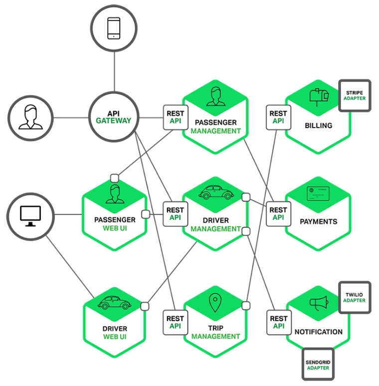
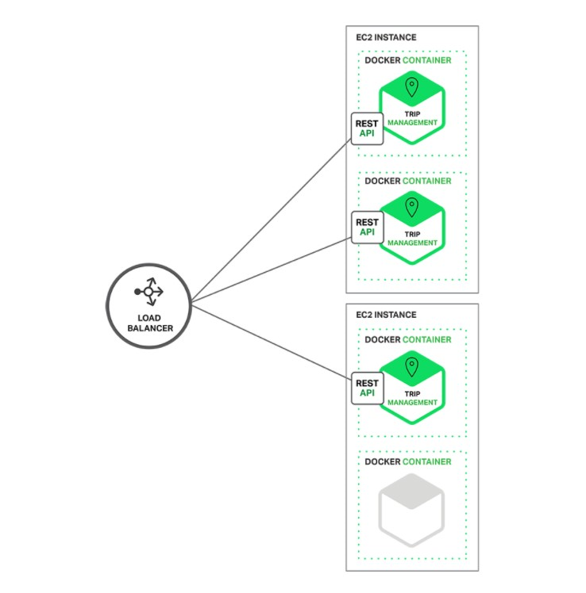
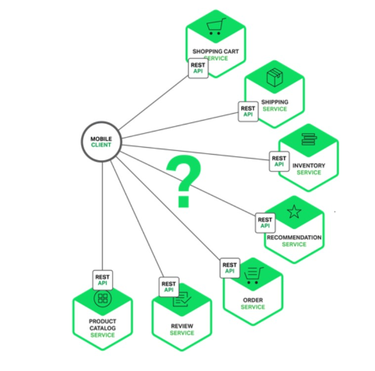
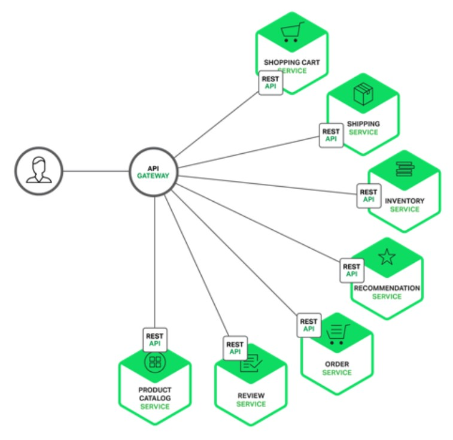
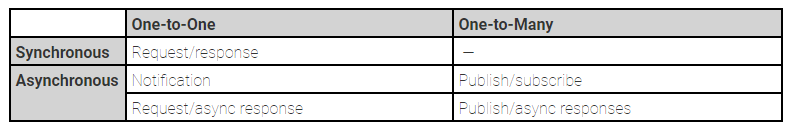
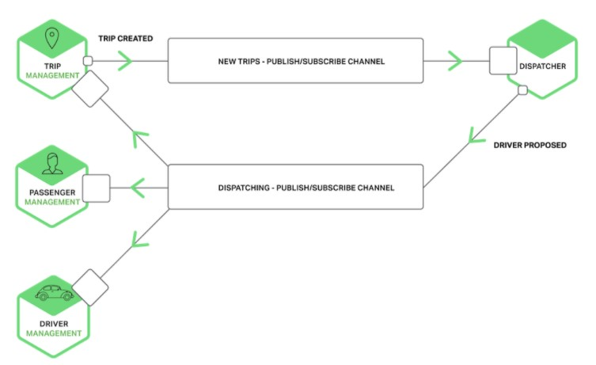

- [传统的monolithic设计](#传统的monolithic设计)
- [微服务](#微服务)
  - [微服务通信](#微服务通信)
    - [API网关](#api网关)
    - [调用service](#调用service)
    - [服务发现](#服务发现)
    - [部分失效](#部分失效)
  - [微服务IPC](#微服务ipc)
    - [消息格式](#消息格式)
    - [微服务API](#微服务api)
    - [处理部分失效](#处理部分失效)

本文是2015年5月, Nginx社区的一篇微服务介绍文章的阅读笔记. 
[原文链接](https://www.nginx.com/blog/introduction-to-microservices/)

文章中假设你要从头设计一个打车的系统, 来和uber竞争

# 传统的monolithic设计
  
这个框架简单,单一形式部署容易. 绝大部分应用都是这个思路.
但随着软件的长期维护, 这个模式不好维护.

# 微服务
一个微服务单独开发和部署, 提供独特的功能. 通常使用容器化技术来部署.  
  
  

* Each service has a well‑defined boundary in the form of an RPC‑ or message‑driven API.
* 好处是分而治之, 但加大了通信复杂性

## 微服务通信
  
一个client想使用某个服务, 它可以直接访问该微服务
Each microservice would have a public endpoint (**https://_serviceName_.api.company.name**).
但通常不这样做, 因为client也要关心和不同的微服务打交道, 也难适应变化.

### API网关
通常client通过API网关来访问微服务.
> Usually a much better approach is to use what is known as an [API Gateway](http://microservices.io/patterns/apigateway.html). An API Gateway is a server that is the single entry point into the system. It is similar to the [Facade](https://en.wikipedia.org/wiki/Facade_pattern) pattern from object‑oriented design. The API Gateway encapsulates the internal system architecture and provides an API that is tailored to each client. It might have other responsibilities such as authentication, monitoring, load balancing, caching, request shaping and management, and static response handling.
The API Gateway is responsible for request routing, composition, and protocol translation. All requests from clients first go through the API Gateway. It then routes requests to the appropriate microservice. The API Gateway will often handle a request by invoking multiple microservices and aggregating the results. It can translate between web protocols such as HTTP and WebSocket and web‑unfriendly protocols that are used internally.

  

关键词:
* 包装内部服务对外呈现
* 鉴权
* 监控
* 负载均衡
* 缓存
* 请求整形
* 静态响应
* 请求转发, 响应聚合

### 调用service
两种风格来调用service:
1. 异步消息. 比如基于massage broker的AMQP, 直接message通信的zeromq
2. 同步调用. 比如RPC HTTP Thrift
通常一个系统中这两个风格都有.

### 服务发现
API gateway必须能访问`Service Registry`数据库. 

### 部分失效
The API Gateway should never block indefinitely waiting for a downstream service.

## 微服务IPC
  
There are the following kinds of one‑to‑one interactions:

*   Request/response – A client makes a request to a service and waits for a response. The client expects the response to arrive in a timely fashion. In a thread‑based application, the thread that makes the request might even block while waiting.
*   Notification (a.k.a. a one‑way request) – A client sends a request to a service but no reply is expected or sent.
*   Request/async response – A client sends a request to a service, which replies asynchronously. The client does not block while waiting and is designed with the assumption that the response might not arrive for a while.

There are the following kinds of one‑to‑many interactions:

*   Publish/subscribe – A client publishes a notification message, which is consumed by zero or more interested services.
*   Publish/async responses – A client publishes a request message, and then waits a certain amount of time for responses from interested services.

  
上面的图例中, trip management发现一个打车请求, 发new trip消息给dispatcher, dispatcher找到一个proposed drvier放到dispatching通道; driver和passenger同时得到通知.

REQ-REP模式下, client发送请求, 阻塞等待响应. 在物联网界, 通常用RESTful API(基于HTTP), 这也是阻塞式的.
[Apache Thrift](https://thrift.apache.org/)也是REQ-REP模式.

### 消息格式
两大类: text类和binery类
前者式json, xml等. 后者是GPB

### 微服务API
API是合同, 但API也注定会变化. 在传统的monolithic模式下, api改了, 每个调用的地方改了就好了. 但微服务场景下, 没有强制手段要求所有的clients都来适配新的API.
所以API要兼容老的, 至少新API和老API都能同时支持.

### 处理部分失效
一个微服务可能因为故障或维护被down了, 那访问就会不可达. 有时候一个微服务负载太高, 响应很慢.
为了避免一个client因为server的故障而永远等待, 可以:
* 使用timeout机制
* 流控, 定义一个limit, 超过limit马上回复
* 定义一个error比例. 统计成功的请求和error的请求, 大于某个比例就视为服务失效.
